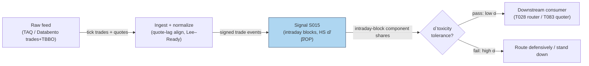

## Stage 15/200 — S015: Spread decomposition — Huang–Stoll

*Batch SB4 · Signal 15/100 · Provenance [D] · Family A — Microstructure & order flow*

### S1. One-line verdict

| | |
|---|---|
| **What it is** | Splits the traded spread into three costs — adverse selection, inventory, order processing — via a trade-indicator regression on quote midpoints. |
| **When it works** | Clean signed trades with lag-aligned quotes; the adverse-selection share becomes a slow-moving toxicity gauge for routing and quoting. |
| **When it dies** | Stale NBBO, mis-signed trades, locked/crossed quotes, short windows — the α/β split is fragile and components blur. |
| **Build-or-buy in one line** | Build the estimator; buy TAQ-grade quote history — alignment is the whole job. |
| Provenance | `[D]` — Huang & Stoll (1997); Glosten–Harris (1988) predecessor; Stoll (1989) covariance family. Family A — Microstructure & order flow. |

### S2. How it works — plain human explanation

It's 9:47:03. AAPL's book: bid 231.40 × 800, ask 231.41 × 300 — the **quoted spread** (ask − bid) is $0.01. Three costs hide inside that penny:

- **Adverse selection**: risk of trading against the better informed. After a buy lifts the ask, the **midquote** ((bid+ask)/2) is revised *upward*, permanently. The spread fraction for information risk is α.
- **Inventory cost**: risk of holding an unwanted position. After absorbing sells, the midquote drifts down to attract buyers — *transitory*, reversing. Its share is β.
- **Order processing**: the fixed cost of standing ready — systems, capital, attention. Whatever is left: 1 − α − β.

Huang and Stoll's (1997) trick: the three costs leave different footprints in the midquote's response to the *sequence* of trade directions — permanent revision after a buy (adverse selection), decaying revision (inventory), constant trade-price/midquote wedge (order processing). One regression on midquote changes vs current and lagged trade directions separates them.

α is a **toxicity gauge**: high α → informed flow, dangerous to quote into (widen quotes, route defensively); low α → the spread is mostly rent. Consumed by T028 and T083.

**Mental model (3 bullets):**
- The spread is three costs, not one — only the adverse-selection slice predicts your fills will be followed by adverse price moves.
- α̂ is a *state* (toxicity regime), not a trigger: high α̂ → stand down or charge more; low α̂ → provide liquidity.
- The estimator is only as honest as the signing and quote alignment underneath — garbage in, three garbage components out.

### S3. The math — exact formula

**Huang–Stoll (1997) trade-indicator model:**

$$\Delta M_t = \frac{S}{2}\,Q_{t-1} + (\alpha+\beta)\,\frac{S}{2}\,Q_t + e_t$$

- M_t — quote **midpoint** (midquote) at trade *t*, in **$**; ΔM_t in $.
- Q_t ∈ {+1, −1} — **trade indicator** (+1 buyer-initiated, −1 seller-initiated), dimensionless; Lee–Ready signed (quote rule on *lagged* midquote, tick rule at midquote).
- S — traded spread (constant within window), in **$**.
- α — **adverse-selection component**: half-spread fraction compensating information risk (permanent revision).
- β — **inventory component**: half-spread fraction for inventory-holding risk (transitory revision).
- 1 − α − β — **order-processing component** (residual); e_t — public-information innovation + noise.

Estimation: **OLS** (ordinary least-squares; or **GMM**, generalized method of moments, with discreteness corrections) of ΔM_t on Q_{t−1}, Q_t gives ĉ₁ = S/2, ĉ₂ = (α+β)(S/2). Splitting α from β needs a second moment — trade-indicator serial correlation: permanent midquote moves identify α, mean-reverting revisions identify β.

**Predecessor — Glosten–Harris (1988):**

$$\Delta p_t = c_0\,\Delta Q_t + c_1\,\Delta Q_t\,V_t + z_0\,Q_t + z_1\,Q_t\,V_t + \varepsilon_t$$

- z-terms = **adverse selection** (permanent), c-terms = **transitory** (order processing + inventory); V_t = trade size. Glosten–Harris splits permanent vs transitory; Huang–Stoll further splits transitory into inventory vs order processing.

**Parameter table:**

| Parameter | Symbol | Typical range | Too small | Too large | Default (example) |
|---|---|---|---|---|---|
| Estimation window | T | 100s–1000s of trades / intraday blocks *(chatbot-suggested, Duck.ai Q-SB4-1 — unverified)* | α/β unidentified, noisy | components assumed constant over regime shifts | 1 trading day *example — not an institutional standard* |
| Quote lag for signing | — | 0–5 s lag quotes behind trades *(chatbot-suggested — unverified)* | lookahead: quote already reacted | stale quotes mis-sign | 1 s lag *example* |

**Causal timing:** components on trades ≤ *t* describe the toxicity *regime*; usable from *t+1*. Shares move slowly — re-estimate intraday, consume as a slow gauge.

**Named variants:**
1. **Two-component HS** (α+β pooled vs order processing) — more stable; use when α/β won't identify.
2. **Glosten–Harris with size interactions** — components as functions of V_t; for block-heavy flow.
3. **Madhavan–Richardson–Roomans (1997)** — allows correlated order flow; intraday component variation.

### S4. Worked example — step-by-step numbers (SYNTHETIC)

**Synthetic 8-observation regression sample** (9 underlying trades t = 1…9; seed 15; fully tabulated). ΔM_t = 0.020·Q_{t−1} + 0.010·Q_t + e_t, ΔM in $:

| t | Q_t | Q_{t−1} | ΔM_t ($) | e_t ($) |
|---|---|---|---|---|
| 2 | +1 | +1 | +0.032 | +0.002 |
| 3 | −1 | +1 | +0.008 | −0.002 |
| 4 | +1 | −1 | −0.009 | +0.001 |
| 5 | −1 | +1 | +0.009 | −0.001 |
| 6 | −1 | −1 | −0.028 | +0.002 |
| 7 | +1 | −1 | −0.012 | −0.002 |
| 8 | −1 | +1 | +0.011 | +0.001 |
| 9 | +1 | −1 | −0.011 | −0.001 |

OLS of ΔM on x₁ = Q_{t−1}, x₂ = Q_t (demeaned, sums 0):
- Σx₁² = Σx₂² = 8, Σx₁x₂ = −4 → (X′X)⁻¹ = [[1/6, 1/12],[1/12, 1/6]].
- X′y: x₁′y = 0.120, x₂′y = 0.000 (hand-chosen errors orthogonal to x₂ — a property of this constructed tape, not real data).
- ĉ₁ = 0.120/6 = **0.020** → S/2 = $0.020, so S = **$0.04**.
- ĉ₂ = 0.120/12 = **0.010** → (α+β) = ĉ₂/ĉ₁ = **0.50**.

Second stage (set by construction to split the pooled 0.50): **α = 0.30**, **β = 0.20**, order processing = **0.50**. Components of the $0.020 half-spread:

| Component | Share | $ of half-spread |
|---|---|---|
| Adverse selection (α·S/2) | 30% | $0.006 |
| Inventory (β·S/2) | 20% | $0.004 |
| Order processing ((1−α−β)·S/2) | 50% | $0.010 |

Interpretation: half the spread is dealer rent; 30% information risk, 20% inventory risk. α̂ = 0.30 → moderately toxic flow.

**Chatbot cross-check:** the Duck.ai draft's guidance (Q-SB4-1) had **no arithmetic errors** — direction, spread definitions, quote-lag alignment, component split, 60–120 h band; labeled lead.

**What to notice:** the first stage recovers S and α+β, but the α/β *split* is fragile — in real data it hinges on trade-indicator autocorrelation, exactly what stale quotes corrupt. Zero fees, constant spread; nothing is a trading result.

### S5. Strategies that use this signal

- **T028 — Spread-Decomposition Router** — *primary signal*: quoted/effective/realized spreads plus HS shares decide routing — high-α̂ flow routed defensively, low-α̂ worked passively.
- **T083 — Retail-Flow Internalizer Fade** — *pricing input*: prices liquidity provision off the decomposition — fades retail/odd-lot imbalance only when α̂ says the flow is uninformed.

### S6. Data required — exact spec

| Field | Type | Granularity | Source tier | Notes |
|---|---|---|---|---|
| Trade price & size | float $, int shares | tick | Tier 1–2 | TAQ / Databento trades; venue odd-lot rules |
| Bid/ask quotes (BBO) | float $ | tick | Tier 1–2 | must *precede* each trade; lag 1–5 s for Lee–Ready *(chatbot-suggested — unverified)* |
| Trade direction Q_t | ±1 | tick | derived | quote rule then tick rule; 0 allowed at midquote |
| Corporate actions | adjustment factors | daily | Tier 0–1 | splits/dividends break ΔM continuity |

Collection: TAQ-grade quotes + trades (Databento `tbbo`+`trades`, or Polygon quotes/trades v3). The critical job is **quote-lag alignment**: sign each trade against the quote that *prevailed before* it — the chatbot lead (Duck.ai Q-SB4-1, labeled) stresses direction, quote-lag alignment, and the component split as make-or-break. Ingest sketch (≤20 lines):

```python
import polars as pl
tr = pl.scan_parquet("trades_*.parquet").select("ts","price","size").sort("ts")
qb = pl.scan_parquet("tbbo_*.parquet").select("ts","bid","ask").sort("ts")
q = qb.with_columns(mid=(pl.col("bid")+pl.col("ask"))/2,
                    ts_lag=pl.col("ts")+pl.duration(seconds=1))  # lag quotes
s = tr.join_asof(q, left_on="ts", right_on="ts_lag", strategy="backward")
s = s.with_columns(Q=pl.when(pl.col("price")>pl.col("mid")).then(1)
                     .when(pl.col("price")<pl.col("mid")).then(-1).otherwise(0),
                   dM=pl.col("mid").diff())
reg = s.with_columns(Qlag=pl.col("Q").shift(1)).drop_nulls()
# OLS: dM ~ Qlag + Q  ->  c1 = S/2, c2 = (α+β)*S/2
```

Storage: L1 quotes+trades ≈ 2–8 GB/day per liquid name in Parquet (cost-model §4) — daily files; aligned quote history required, not bars. Data-quality: locked/crossed NBBO (drop), stale quotes (age < 5 s — *example*), halts/auctions (exclude), odd-lot rules (venue-dependent), DST/half-days, tick-size changes.

### S7. Local build on M5 Max / 128GB

**Feasibility: feasible (Tier M).** The regression is trivial; the *pipeline* — tick-granularity quote-lag alignment, Lee–Ready signing, robust estimation across hundreds of names — is real data engineering.

| Stack | When to pick |
|---|---|
| Python + polars | default: batch re-estimation on intraday blocks; fastest to build |
| Rust event loop | tick-level real-time signing across many symbols |
| DuckDB | ad-hoc research over per-symbol daily Parquet files |

- **Throughput:** polars asof joins ~1–10M rows/sec (cost-model §2, complex ops); aligning a day of TAQ quotes+trades for 50 names is minutes of batch work. Real-time HS needs incremental signing — Python fine at ≤20 symbols L1, Rust beyond.
- **RAM:** one symbol-day of L1 ≈ 0.5–4 GB (cost-model §3); working set is a rolling quote+trade panel per symbol. 500 symbols × 60 days raw L1 does **not** fit — per-symbol daily files + streaming.
- **Engineering: Tier M, 20–60 h** (cost-model §5: S001–S020 ex-L2) → $3,000–9,000 at $150/hr loaded. Chatbot lead (Duck.ai Q-SB4-2, 2026-09-10 — unverified): **60–120 h for a defensible production build**. Cost-model tiers take precedence.
- **SIP adequacy:** Duck.ai lead (labeled, unverified): HS *mostly* honest on SIP — but stale NBBO, reporting delays, locked/crossed quotes, odd-lot handling bite at short horizons. Validate α̂/β̂ against a direct-feed sample before routing on it.
- **Breaks first at 500 symbols:** the tick-granularity quote-alignment join (bandwidth + clock skew); α/β identification degrades as quote staleness rises.

### S8. Buy vs build

| Option | What you get | Indicative price | Buying gains | Buying loses |
|---|---|---|---|---|
| Tier 0: SIP delayed / Stooq | Daily bars, delayed quotes | ~$0 | free | no tick quotes — HS impossible |
| Tier 1: Polygon / Alpaca SIP | Real-time trades + NBBO | ~$30–200/mo | cheapest viable HS input | stale-NBBO caveats on the α/β split |
| Tier 2: Databento (trades + TBBO) | Exchange-timestamped, replay | ~$200/mo + usage | honest quote-lag alignment | usage metering |
| Tier 3: TAQ via WRDS (academic) | Full consolidated history | ~hundreds/yr academic | validation gold standard | academic license; not production |

All prices *indicative — verify before budgeting* (cost-model §6). **Verdict: build the estimator, buy TAQ-grade quotes.** Nobody sells your toxicity thresholds — the α̂ at which *you* stand down is the edge. **Buy** Databento-grade L1 when the decomposition drives routing (T028) or quoting (T083); **build** on SIP while HS is a research gauge. Crossover: SIP-vs-direct α̂ divergence exceeding your toxicity tolerance *example — not an institutional standard*. Hybrid is normal: buy the raw feed, build the analytics.

### S9. Success ratio / efficacy — documented evidence

HS is a spread *measurement*; the evidence concerns component magnitudes and stability — all before-cost.

| Study / source | Market & period | Metric | Before/after cost | Caveat |
|---|---|---|---|---|
| Huang & Stoll (1997), *RFS* 10(4) | NYSE stocks | "Large order processing, smaller but significant adverse selection and inventory"; shares differ by trade size | before-cost (measurement) | Specialist-era structure; model-dependent |
| Gregoriou & Rhodes (2017) on HS (1997) | Large NYSE stocks | Two-component: order processing ≈ **88.6%** avg; full split: order processing largest, inventory next, information asymmetry **<10%** | before-cost (measurement) | Large liquid names — adverse selection small *there* |
| Bleaney & Li (2014), Nottingham DP 14/03 | FX multi-dealer (Reuters D2000-1) | Asymmetric-information component carries the **biggest weight** in FX | before-cost (measurement) | Different structure — shares are regime/venue-dependent |

**Regimes where it fails:** news/jumps (spread not constant; α̂ spikes after), opens/closes (auctions), thin names (too few trades to split α vs β — use two-component), fragmented markets (the "dealer" is a crowd of HFTs). Shares drift with market structure — re-estimate; don't hard-code 1997 shares.

**Bottom line:** standalone trigger: *zero* edge — HS never gives direction. Toxicity gauge: *documented, honest* — α̂ tells routing/quoting how dangerous the flow is. The ordering is the desk-relevant fact — order processing dominates calm large-caps, adverse selection dominates stressed flow.

### S10. Failure modes & pitfalls

1. **Mis-signed trades** — unlagged quotes leak the quote's reaction into Q_t; tick-rule errors cluster when flow is fastest. *Mitigation:* lag quotes 1–5 s; report the signing-failure rate.
2. **Stale / locked / crossed NBBO** — signing against a stale midquote flips Q_t. *Mitigation:* drop locked/crossed quotes; quote age < 5 s (*example*); direct feeds for routing-grade use.
3. **α/β non-identification** — in short/calm windows the second-stage moment is noise. *Mitigation:* fall back to two-component (α+β pooled); require minimum trade counts.
4. **Spread non-constancy** — S assumed constant; violated at opens, closes, news. *Mitigation:* estimate per intraday block; dummy event windows.
5. **Lookahead in alignment** — any forward tolerance in the trade/quote join leaks. *Mitigation:* strictly backward asof joins.
6. **Overfitting window/lag** — tuning T and lag to make α̂ "look right" is parameter mining. *Mitigation:* fix from stability analysis (α̂ autocorrelation), not downstream P&L.
7. **Treating shares as universal** — quoting "α = 10%" from a 1997 large-cap study on a 2026 small-cap is fabricated precision. *Mitigation:* estimate per name/regime (Bleaney & Li 2014).
8. **Cost-model optimism** — HS measures the *traded* spread's composition; realized cost adds fees, latency, partial fills. *Mitigation:* HS is one input to the cost model, not the whole model.

### S11. Visuals




### S12. Sources

1. Huang, R. D., & Stoll, H. R. (1997). "The Components of the Bid-Ask Spread: A General Approach." *RFS*, 10(4), 995–1034. — three-way trade-indicator decomposition; large order-processing, smaller adverse-selection and inventory components. https://ideas.repec.org/a/oup/rfinst/v10y1997i4p995-1034.html
2. Glosten, L. R., & Harris, L. E. (1988). "Estimating the Components of the Bid/Ask Spread." *JFE*, 21, 123–142. — seminal trade-indicator model; permanent vs transitory split. https://business.columbia.edu/faculty/research/estimating-components-bidask-spread
3. Stoll, H. R. (1989). "Inferring the Components of the Bid-Ask Spread." *JF*, 44(1), 115–134. — covariance-based three-component model; NASDAQ/NMS estimates. https://afajof.org/issue/volume-44-issue-1/
4. Gregoriou, A., & Rhodes, M. (2017). "The Accuracy of Spread Decomposition Models in Capturing Informed Trades." *RBF*. — HS (1997): order processing ≈ 88.6% avg two-component; <10% info asymmetry for large stocks; Stoll (1989): >40%. https://eprints.leedsbeckett.ac.uk/id/eprint/3918/6/Gregoriou%20and%20Rhodes%20RBF%202017.pdf
5. Bleaney, M., & Li, Z. (2014). "Decomposing the Bid-Ask Spread in Multi-Dealer Markets." Nottingham DP 14/03. — asymmetric-information biggest in FX; shares venue-dependent. http://ideas.repec.org/p/not/notecp/14-03.html

Duck.ai answered Q-SB4-1–Q-SB4-3 (2026-09-10); Grok/Cursor answers pending (checked 2026-09-10).

**Unverified leads** (chatbot-provided, no independent checkable source — do not quote as fact):
- Duck.ai (GPT-5.6 Luna, 2026-09-10) Q-SB4-1: implementation guidance — trade direction, spread definitions, quote-lag alignment, component split; 60–120 h defensible implementation — *unverified chatbot claims* (no arithmetic errors; kept as labeled leads).
- Duck.ai Q-SB4-2: 60–120 h within a 315–650 h L1/trade pipeline (row sums; printed "285–650" contradicts rows); SIP "mostly" adequate with stale-NBBO caveats — *unverified chatbot claims*.
- Grok / Cursor answers to Q-SB4-1–Q-SB4-3: pending (checked 2026-09-10).
