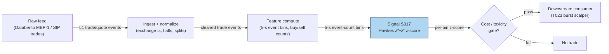

## Stage 17/200 — S017: Hawkes self-excitation intensity of order flow

*Batch SB4 · Signal 17/100 · Provenance [D] · Family A — Microstructure & order flow*

### S1. One-line verdict

| | |
|---|---|
| **What it is** | Conditional event intensity λ(t) that rises after each trade/quote event (self-excitation) and decays; the buy-minus-sell imbalance forecasts near-term activity bursts. |
| **When it works** | Liquid names with clustered, algorithmically sliced flow; ms-to-second horizons; as a probabilistic activity/risk forecast. |
| **When it dies** | Announcements, auctions, halts, regime breaks (nonstationarity); latency beyond a few ms; after spread + fees with marketable orders. |
| **Build-or-buy in one line** | Build the intensity estimator on a bought L1/trade feed — calibration is the work, not the data. |

Provenance **[D]** · Family A — Microstructure & order flow. Signal chapter 17/100.

> **Mandatory framing (operator-verified):** Hawkes models *document clustering and improve probabilistic forecasts of near-term event/price-move risk versus an unconditional/memoryless baseline* — a **weaker** claim than a fee-adjusted strategy. **There is no general documented result that Hawkes-based signals survive fees.** Significant direction accuracy ≠ positive net PnL if the move is < 1 tick or the spread is crossed. Forecast-improvement evidence and net-PnL evidence are kept in separate rows throughout (§S9).

### S2. How it works — plain human explanation

**Self-excitation**: an event makes the *next* event more likely for a while. At 9:47:03 a 500-share buy prints, then two more within 80 ms. A memoryless (Poisson) model treats prints as independent; a Hawkes model says the first buy *raised the instantaneous arrival rate* of further buys, decaying away after. Order slicing (S018) and algos reacting to each other's prints produce exactly this clustering.

**Conditional intensity** λ(t) is the expected event rate *right now* given all history. We track λ⁺(t) (buys) and λ⁻(t) (sells); their difference is the signed signal — a λ⁺ spike vs λ⁻ flags a likely burst of buy-side activity and short-run price pressure.

Why this exists: **order splitting** (child orders cluster buys; adverse selection for anyone leaning against them) and **endogenous feedback** (algos reacting to each other's prints). Hawkes separates exogenous baseline flow (μ) from endogenous excited flow (κ) — a market-endogeneity gauge.

**Mental model:** each event injects a decaying pulse of excitation (recent events matter most); the **branching ratio** (fraction of events caused by prior events) measures endogeneity — near 1, nearly unstable; the z-scored imbalance λ⁺−λ⁻ forecasts *flow activity/direction*, not profit after costs.

### S3. The math — exact formula

**Bivariate exponential Hawkes** (buy/sell), the standard order-flow form (operator-verified against the literature; independently confirmed by the multivariate formula in Worrall et al., SORT):

$$\lambda_i(t) = \mu_i + \sum_{j \in \{+,-\}} \int_0^t \phi_{ij}(t-s)\, dN_j(s), \qquad i \in \{+,-\}$$

with exponential kernel $\phi_{ij}(u) = \alpha_{ij} e^{-\beta_{ij} u}\mathbf{1}\{u>0\}$.

- $\lambda_i(t)$ — conditional intensity of side-$i$ events (events/sec); $\mu_i > 0$ — **baseline intensity**, the exogenous rate with no history.
- $N_j(s)$ — counting process of side-$j$ events; the integral sums kernel contributions of all past events.
- $\alpha_{ij} \ge 0$ — excitation jump per side-$j$ event; $\beta_{ij} > 0$ — decay rate (1/sec), half-life $h_{ij} = \ln 2 / \beta_{ij}$.
- Integrated kernel $K_{ij} = \int_0^\infty \phi_{ij}(u)\,du = \alpha_{ij}/\beta_{ij}$ (dimensionless): expected side-$i$ children per side-$j$ event.
- **Stationarity:** spectral radius $\rho(K) < 1$ (univariate: $\alpha/\beta < 1$); otherwise intensity explodes.
- **Branching ratio** $n = \rho(K)$ (univariate $n = \alpha/\beta$): fraction of events endogenously triggered. $n \to 1$ = near-critical, cascade-prone.

**Signal:** $\text{imb}_t = \lambda^+_t - \lambda^-_t$, then $z_t = (\text{imb}_t - \bar{\text{imb}})/\sigma_{\text{imb}}$ over a rolling window. Trade rule example: enter in the direction of $z_t$ when $|z_t| > 2$ (*example — not an institutional standard*).

**Discrete-time recursion** (what you actually code on binned data, bin width $\Delta$):

$$\kappa_{t+1} = d \cdot (\kappa_t + \alpha x_t), \qquad \lambda_t = \mu + \kappa_t$$

- $x_t$ — event mark in bin $t$ (count, signed flow, or 0/1); $d = e^{-\beta \Delta}$ — per-bin decay.
- Causal timing: $\lambda_t$ uses only history through $\kappa_t$; tradable no earlier than bin $t+1$.

**Parameter table:**

| Parameter | Symbol | Typical range | Too small / too large | Default example |
|---|---|---|---|---|
| Baseline intensity | $\mu$ | 0.1–5 events/s per side | misses exogenous flow / never decays to reality | 0.5/bin (*example — not an institutional standard*) |
| Excitation jump | $\alpha$ | 0.1–2.0 | no burst detection / explosive, violates $\alpha/\beta<1$ | 0.6 (*example*) |
| Decay rate | $\beta$ | 0.02–70 /s (half-life 10 ms–30 s) | stale signals / no memory | half-life 30 s (*example*) |
| z threshold | $z^*$ | 1.5–3.0 | whipsaw / never trades | 2.0 (*example — not an institutional standard*) |
| z window | $W$ | 5–60 min rolling | adapts to noise / lags regimes | 15 min (*example*) |

**Normalization:** z-score on the signed imbalance is standard (raw $\lambda^+-\lambda^-$ scales with activity); rank-normalization is a robust alternative. Empirical kernels are closer to power-law than exponential (source entry), so **named variants**: (1) single exponential (fast, Markovian recursion); (2) sum of 2–3 exponentials (fast + slow decay); (3) nonparametric/power-law kernel (best fit, costlier MLE); (4) trade-only vs full book-event (trades + cancels + limit orders) multivariate Hawkes.

### S4. Worked example — step-by-step numbers (SYNTHETIC)

Synthetic 10-minute tape coarsened to 5-second bins (seed **1717**; `batches/SB4/plot_S017.py` regenerates it). Baseline $\mu=0.5$ events/bin/side, $\alpha=0.6$, half-life 30 s → $d = e^{-\ln 2 \cdot 5/30} \approx 0.8909$. A buy burst is injected in bins 60–71. Table shows bins 60–67; $x_b, x_s$ are buy/sell event counts; $\lambda_b, \lambda_s$ intensities; $z$ the full-sample z-scored imbalance.

| t (s) | buys | sells | $\lambda^b_t$ | $\lambda^s_t$ | $z_t$ |
|---|---|---|---|---|---|
| 300 | 9 | 1 | 2.646 | 2.511 | −0.44 |
| 305 | 4 | 1 | 7.223 | 2.826 | +1.32 |
| 310 | 4 | 0 | 8.628 | 3.107 | +1.79 |
| 315 | 7 | 2 | 9.879 | 2.822 | +2.43 |
| 320 | 0 | 0 | 12.598 | 3.638 | +3.21 |
| 325 | 2 | 0 | 11.278 | 3.296 | +2.81 |
| 330 | 3 | 0 | 11.171 | 2.991 | +2.89 |
| 335 | 2 | 0 | 11.610 | 2.719 | +3.19 |

Hand-check (t=300→305): $\kappa^b_{300}=2.646-0.5=2.146$; with $x_b=9$: $\kappa^b_{305}=0.8909(2.146+5.4)=6.723$ → $\lambda^b_{305}=7.223$ ✓.


**What to notice:** buy intensity rises *after* the burst starts (t=300: 9 buys, yet $\lambda^b$=2.65 — the intensity is backward-looking; first events are always a surprise). z crosses +2 at t=315 s (∼15 s irreducible detection lag) and peaks at +3.21 at t=320 s with *zero* events that bin: intensity has memory — the point, and the trap. **Limits:** no fees/spread, perfect classification, hand-injected burst; real MLE calibration on $10^4$–$10^6$ events is fragile near critical branching.

### S5. Strategies that use this signal

- **T023 — Hawkes Burst Scalper — primary entry trigger**: trades self-excitation bursts signed by the buy/sell intensity imbalance $z_t$.
- **T055 — DeepLOB + Feature-Stack Classifier — feature input**: Hawkes intensities stacked alongside OFI as classical microstructure features.
- *Filter role (in principle):* the activity forecast $\lambda^+ + \lambda^-$ can veto slower signals during excitation bursts (adverse-selection filter) — a toxicity-adjacent use, not a standalone edge.

### S6. Data required — exact spec

| Field | Type | Granularity | Source tier | Notes |
|---|---|---|---|---|
| Trade timestamps + side | events | sub-second, per trade | Tier 1–2 | Aggressor side via Lee–Ready (S007) or exchange flag |
| Quote-change events | events | sub-second | Tier 1–2 | For full book-event Hawkes (cancels, limit adds) |
| Mid-price moves | events | sub-second | Tier 1–2 | Optional 4th process (price × trade Hawkes) |

Collection: Databento MBP-1 or SIP trades+NBBO (trades-only Hawkes is honest on L1); full multivariate book Hawkes needs MBO/ITCH (Tier 3). Ingest sketch (≤20 lines):

```python
import databento as db, polars as pl
cli = db.Historical("KEY")
data = cli.timeseries.get_range(dataset="XNAS.ITCH", schema="trades",
        symbols=["AAPL"], start="2026-09-09", end="2026-09-10")
trades = pl.from_pandas(data.to_df())          # ts_event, price, size, side
trades = trades.sort("ts_event").with_columns(
    t_bin=(pl.col("ts_event").dt.epoch("s") // 5).alias("bin"))
binned = trades.group_by("bin").agg(
    x_b=pl.col("size").filter(pl.col("side") == "ask").sum(),   # buys
    x_s=pl.col("size").filter(pl.col("side") == "bid").sum())   # sells
# then apply the kappa recursion from S3 per side
```

Storage: L1 quotes+trades for a liquid name ≈ 2–8 GB/symbol-day parquet (per `notes/cost-model.md` §4); event timestamps alone are far lighter. Data-quality checklist: exchange timestamp normalization, corporate actions, halts, DST/half-days, stale/locked quotes.

### S7. Local build on M5 Max / 128GB

**Feasibility verdict: feasible (Tier M for L1/trade-level; heavy at full MBO multivariate).** The recursion is O(events) with trivial state (one κ per process) — the online intensity update is a few FLOPs per event, so real-time scoring is trivially feasible. The expensive part is *calibration*: MLE over $10^4$–$10^6$ events with a non-convex likelihood, typically refit on rolling windows.

Throughput (per `notes/cost-model.md` §2): a Python event loop handles ~100–500k events/sec — fine for ≤20 symbols of L1. 50 liquid symbols × 2k events/sec = 100k/sec → Python borderline, Rust comfortable; polars batch recompute each minute is trivial. MLE calibration is the bottleneck (CPU-bound likelihood evaluations), not ingest.

Stack: **Python+polars/numpy** (research, L1 scoring); **Rust** (full-depth real-time, 100+ symbols); **DuckDB** (calibration sweeps).

RAM (per cost-model §3): L1 events ≈ 1–10M/day → ~0.5–4 GB RAM per symbol-day; 50 symbols fit the 77 GB working budget; 60 days × 500 symbols does not — per-symbol daily parquet + streaming. Hawkes state itself is kilobytes.

Engineering time: **Tier M, 20–60 h** (per cost-model §5) for L1/trade-level → $3,000–$9,000 loaded-cost estimate at $150/hr. Full MBO multivariate Hawkes is **Tier H, 60–200 h**. Labeled chatbot lead (Duck.ai, 2026-09-10): Hawkes calibration alone estimated at 80–160 h within an L2 build whose **row sums are 520–1,020 h** (bot's printed "600–1,180" contradicts its rows — use row sums; cost-model takes precedence). **What breaks first:** 500 symbols (Python ingest saturates → Rust) or full-depth history (§4: 10–40 GB/symbol-day L2 — archive externally, keep features local).

### S8. Buy vs build

| Option | What you get | Indicative price | Gains | Loses |
|---|---|---|---|---|
| Tier 0: Alpaca IEX / Stooq | Delayed bars | ~$0 | Free prototyping | No sub-second events |
| Tier 1: Polygon Stocks Advanced / Alpaca SIP | Real-time SIP trades + NBBO | ~$30–200/mo | Trades-only Hawkes feasible | SIP latency; no depth/cancel flow |
| Tier 2: Databento Standard (MBP-1/MBP-10) | Honest L1/L2 event streams | ~$200/mo + usage | True event timestamps; depth for full Hawkes | Usage metering on heavy history |
| Tier 3: LOBSTER (academic) | MBO/ITCH order-book replay | ~hundreds/yr academic | Calibration-grade feed | Academic license; not production |

All prices *indicative — verify before budgeting*. **Verdict: build the estimator, buy the feed.** Your calibrated $(\mu,\alpha,\beta)$ is the research — no vendor sells it. Buy raw L1/trade events (Tier 1/2); build the recursion + MLE harness. Tier 3 only if the hypothesis needs cancel/queue-conditioned excitation (a Tier-H project).

### S9. Success ratio / efficacy — documented evidence

Separated as mandated: **forecast-improvement evidence** vs **net-PnL evidence**.

| Study / source | Market & period | Metric | Before/after cost | Caveat |
|---|---|---|---|---|
| Bacry, Mastromatteo & Muzy (2015), survey | Multi-market review to 2015 | Strong self-/cross-excitation of submissions, cancels, market orders; Hawkes beats memoryless baselines on short-horizon event forecasts | Before cost (forecast only) | Survey, not a trading study; no PnL claim |
| Filimonov & Sornette (2015) | E-mini S&P futures | Significant Hawkes fits; elevated endogeneity estimates (exact band not verified in retrieved sources) | Before cost | Fit quality, not tradability |
| Hawkes (1971), Biometrika | Theory | Foundational self-exciting process | n/a | Not a market study |
| Chatbot lead (Duck.ai, 2026-09-10, Q-SB4-3) | General | "Documents clustering; improves probabilistic forecasts of near-term event/price-move risk vs unconditional/memoryless baseline — weaker claim than a fee-adjusted strategy. **No general documented result on fee survival.**" | n/a — labeled lead | *Unverified chatbot claim* unless independently confirmed; kept as lead |
| Net-PnL after spread/fees/latency/realistic fills | — | **No documented row in surveyed literature** | After cost | Absence noted per mandatory Q-SB4-3 bottom line |

**Regimes where it fails:** announcements and opens/closes (exogenous intensity swamps the kernel); auctions, halts; volatility-regime changes; feed changes; near-critical branching ($n \to 1\)); trade-only Hawkes missing queue depletion/cancellations/hidden liquidity.

**Honest bottom line:** as a *probabilistic activity/direction forecast* this is a genuine, documented improvement over memoryless baselines — a real feature. As a *standalone trigger* it is an **undemonstrated** edge: significant direction accuracy ≠ positive net PnL if the predicted move is < 1 tick or the spread is crossed. Report **both** OOS forecast improvement **and** net implementation performance after spread/fees/latency/realistic fills; without the second, call it a predictive feature, not a demonstrated edge (Q-SB4-3 bottom line, labeled chatbot source).

### S10. Failure modes & pitfalls

1. **Near-critical branching** — calibrated $n \approx 0.9$+ amplifies noise into phantom bursts. *Mitigation:* regularize; cap $n$ (bot's 0.8–0.95 stability band is a labeled lead); monitor out-of-sample.
2. **Nonstationarity** — announcements/regime breaks violate constant-$(\mu,\alpha,\beta)$. *Mitigation:* rolling refits; exogenous-event dummies; stand down on scheduled news.
3. **Lookahead leakage** — revised trade records or future quote alignment in calibration. *Mitigation:* as-traded timestamps; purged/embargoed validation (S088).
4. **Misclassified trade signs** — error concentrates exactly when flow is most active (labeled chatbot lead, Q-SB4-3), biasing $\lambda^+ - \lambda^-$ during bursts. *Mitigation:* exchange aggressor flags; sensitivity analysis.
5. **Cost blowup** — burst-chasing with marketable orders pays full spread + adverse selection. *Mitigation:* model net of spread/fees/impact; prefer passive or filter roles.
6. **Overfitting the kernel** — multi-exponential/power-law kernels fit noise on short windows. *Mitigation:* single-exponential baseline first; information criteria for added kernels.
7. **Latency illusion** — historical timestamps assume instant reaction; live latency eats the ms-scale edge. *Mitigation:* lag the signal by measured latency; label SIP-based results *simulated only — requires MBO/ITCH* where queue claims are made.
8. **Microstructure noise vs signal** — flickering quotes inflate event counts without information. *Mitigation:* filter to economically meaningful events; compare trade-only vs full-event specs.

### S11. Visuals




### S12. Sources

1. Bacry, E., Mastromatteo, I. & Muzy, J.-F. (2015). "Hawkes processes in finance." *Market Microstructure and Liquidity* (arXiv:1502.04592). https://arxiv.org/abs/1502.04592v2
2. Filimonov, V. & Sornette, D. (2015). "Apparent criticality and calibration issues in the Hawkes self-excited point process model." arXiv:1406.3967. https://arxiv.org/pdf/1406.3967v1
3. Worrall, J. et al. "Fifty years later: new directions in Hawkes processes." *SORT* 46(1) — multivariate intensity formula with exponential kernel, independently confirming the S3 standard form. https://www.Idescat.cat/sort/sort461/46.1.1.Worrall-etal.pdf
4. Hawkes, A. G. (1971). "Spectra of some self-exciting and mutually exciting point processes." *Biometrika*, 58(1), 83–90. (Journal citation; URL not independently verified.)
5. Bowsher, C. G. (2007). "Modelling security market microstructure with Hawkes processes." *Journal of Econometrics*. (Report citation; URL not independently verified.)
6. Chatbot source (labeled): Duck.ai (GPT-5.6 Luna, anonymous, 2026-09-10) answered Q-SB4-1–Q-SB4-3; Grok/Cursor answers pending (checked 2026-09-10). Formula sections verified against standard literature; eng-hour/fee-survival points used as *labeled leads*.

**Unverified leads** (chatbot-only): branching-ratio stability band 0.8–0.95; 1–3 exponentials; 10⁴–10⁶ calibration events; kernel half-life ranges.
