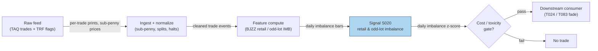

## Stage 20/200 — S020: Retail & odd-lot order imbalance

*Batch SB4 · Signal 20/100 · Provenance [D] · Family A — Microstructure & order flow*

### S1. One-line verdict

| | |
|---|---|
| **What it is** | Signed order imbalance computed on retail-identifiable flow (sub-penny prints) and on odd-lot (<100-share) trades, which carry a different information mix than institutional flow. |
| **When it works** | Around attention events and earnings, where retail flow is directional and persistent; as a contrarian or internalizer's adverse-selection gauge. |
| **When it dies** | Treated as a uniform "dumb money" signal — retail is heterogeneous; after spread/fees on short holds; when odd lots are really algo slices, not people. |
| **Build-or-buy in one line** | Build the classifier on bought TAQ — the identification logic (BJZZ) is public; the data is the cost. |

Provenance **[D]** · Family A — Microstructure & order flow. Signal chapter 20/100.

> **Mandatory framing (operator-verified):** there is **no blanket "retail = uninformed"** result. Retail flow is *heterogeneous*: liquidity-taking/attention-driven, contrarian, pure noise, and informed around earnings/news/specialized situations. Odd lots are **not** automatically noise — they include algo slices, fractional shares, and (for high-priced stocks) economically large trades. After-cost honesty: high turnover plus short holds means spread crossing, adverse selection, and queue priority eat gross edge; midpoint-marked evaluation with marketable-order implementation overstates results.

### S2. How it works — plain human explanation

**Jargon, defined once:** *NBBO* (National Best Bid and Offer — the consolidated best bid/ask across exchanges); *SIP* (Securities Information Processor — the official consolidated tape).

An **odd lot** is any trade for fewer than 100 shares (the traditional **round lot**). Long assumed to be small retail trades and excluded from the consolidated tape (the public trade record), that assumption broke: algos slice orders into sub-100-share pieces, high-priced stocks make 10 shares a $5,000 trade, and fractional shares print odd lots constantly. O'Hara, Yao & Ye (2014): odd lots are ~24% of trades at the median (60%+ in some stocks), contribute ~35% of **price discovery** (how prices incorporate information), and informed traders deliberately use them to avoid detection.

**Retail identification** uses a clever fingerprint. Market makers who **internalize** retail flow — execute it themselves rather than routing to an exchange — typically give tiny **price improvement**: a retail buy at $50.00 executes at $50.001–$50.009 (a *sub-penny* print). Boehmer, Jones, Zhang & Zhang (2021) ("BJZZ") classify trades by sub-penny fraction: (0.6, 1.0] cent → retail buy; (0, 0.4) cent → retail sell (round-penny prints excluded); (0.4, 0.6) excluded as ambiguous. This recovers a retail flow series from public TAQ with no broker feed.

Why predict anything? Three channels, pulling in different directions — which kills the blanket claim. (1) **Attention-driven flow**: retail piles into salient stocks; pressure later reverses — the fade case. (2) **Contrarian liquidity provision**: retail sells strength, buys dips — the *internalizer's* edge. (3) **Informed pockets**: around earnings/news some retail flow is informed, and odd lots can be stealth institutional slices — the follow case. Channel dominance is stock-, event-, and era-specific. Vignette: on an earnings day retail prints −0.28 (selling into the pop) while institutional flow had built +0.18 the day before — that disagreement *is* information.

**Mental model (3 bullets):**
- Odd lots are a *size* category, not a *trader* category: they mix retail, algo slices, and stealth flow.
- BJZZ sub-penny fractions identify marketable retail flow in TAQ; the imbalance is (buys − sells)/(buys + sells).
- Retail is heterogeneous — the signal is conditional (event type, horizon, venue mix), never a uniform "fade the dummies" rule.

### S3. The math — exact formula

**Odd-lot imbalance** (quote-rule classified, 5-minute to daily windows):

$$\text{IMB}^{\text{odd}}_B = \frac{V^{\text{odd,buy}}_B - V^{\text{odd,sell}}_B}{V^{\text{odd,total}}_B}$$

- $B$ — aggregation window (5 min to 1 day).
- $V^{\text{odd,buy}}_B$ — odd-lot (<100 shares) buy volume in $B$, classified by quote rule (S007) or aggressor flag.
- Ranges in $[-1, +1]$; 0 = balanced.

**Retail imbalance (BJZZ)**:

$$f_i = 100p_i - \lfloor 100p_i \rfloor = (100p_i) \bmod 1 \in [0,1) \quad \text{(fractional part of the cent component)}$$

$$\text{retail buy if } f_i \in (0.6, 1.0], \quad \text{retail sell if } f_i \in (0, 0.4), \quad \text{exclude } f_i \in (0.4, 0.6)$$

$$\text{IMB}^{\text{retail}}_B = \frac{V^{\text{rb}}_B - V^{\text{rs}}_B}{V^{\text{rb}}_B + V^{\text{rs}}_B}$$

- $p_i$ — trade price; only sub-penny prints are classifiable — round-penny prints are *not* retail by this method (a coverage gap).
- TRF (Trade Reporting Facility) prints are where internalized retail flow reports.

**Parameter table:**

| Parameter | Symbol | Typical range | Too small / too large | Default example |
|---|---|---|---|---|
| Aggregation window | $B$ | 5 min – 1 day | noise dominates / signal decays, mixes regimes | 1 day (*example — not an institutional standard*) |
| Odd-lot cutoff | — | <100 shares (SEC redefined for some high-priced names) | misses slices / includes real retail | 100 shares (*example*) |
| BJZZ buy band | — | (0.6, 1.0] cent | misclassifies / shrinks sample | (0.6, 1.0] (*example*) |
| BJZZ exclusion band | — | (0.4, 0.6) | ambiguous prints pollute / discards data | (0.4, 0.6) (*example*) |
| Signal threshold | $z^*$ | 1.5–2.5σ | noise trades / never fires | 2.0σ (*example — not an institutional standard*) |

**Normalization:** z-score within stock and window-type (retail participation varies enormously across names); rank-normalization across the cross-section for portfolio use. **Causal timing:** imbalance over window $B$ ending at $t$ is tradable no earlier than $t+1$; daily retail IMB is a next-day signal at best.

**Named variants:** (1) odd-lot IMB (size-based, quote-rule classified); (2) BJZZ retail IMB (sub-penny identification); (3) odd-lot *retail* IMB (intersection — BJZZ-classified odd lots only); (4) retail *buy* vs *sell* imbalance separately (asymmetric informativeness is documented).

### S4. Worked example — step-by-step numbers (SYNTHETIC)

Synthetic 41-day window around an earnings announcement (day 0), seed **2020** (`batches/SB4/plot_S020.py`). Retail IMB is BJZZ-style daily; institutional IMB is a labeled-flow proxy. Table: days −4…+4.

| Day | Retail IMB | Institutional IMB |
|---|---|---|
| −4 | −0.004 | +0.030 |
| −3 | −0.066 | +0.051 |
| −2 | −0.083 | +0.051 |
| −1 | −0.013 | +0.177 |
| 0 | −0.280 | −0.064 |
| +1 | −0.041 | −0.092 |
| +2 | +0.010 | −0.119 |
| +3 | −0.023 | −0.042 |
| +4 | −0.060 | +0.000 |

Hand-check the construction (day 0): retail IMB = (buys − sells)/(buys + sells) = −0.280 means sells exceeded buys by 28% of retail volume — e.g. with total 1,000 shares, buys = 360, sells = 640 → (360−640)/1000 = −0.280 ✓. Institutional +0.177 on day −1 with 1,000 shares → buys ≈ 589, sells ≈ 411 ✓.


**What to notice:** the two series disagree — institutional imbalance builds quietly *before* the event (+0.177 on day −1, the informed-leakage pattern), while retail spikes *on* the event (−0.280, attention-driven selling into the announcement). Fading retail here bets the day−1 institutional build was the informed move. **Limits:** the "institutional" series is a labeled synthetic proxy; the event-day spike is hand-chosen; no fees; and the example encodes one channel mix (informed institutions, reactive retail) — the mandatory framing warns this mix is *not* universal.

### S5. Strategies that use this signal

- **T024 — Informed-Size Tracker / Retail Fade — primary trigger**: follows stealth medium-size informed flow and fades retail/odd-lot flow — this chapter's signal is the fade leg's input.
- **T083 — Retail-Flow Internalizer Fade — primary trigger**: provides liquidity fading retail/odd-lot imbalance, priced via spread decomposition (S015) — the internalizer's version of the same flow.
- *Filter role:* retail-imbalance extremes can veto momentum entries (crowded attention trades reverse) or gate execution (don't cross the spread into one-sided retail flow — adverse selection for the taker).

### S6. Data required — exact spec

| Field | Type | Granularity | Source tier | Notes |
|---|---|---|---|---|
| Trade price, size, timestamp, exchange/TRF code | events | per trade | Tier 1–2 | TAQ or Databento; TRF flag identifies internalized prints |
| NBBO at trade time | events | per trade | Tier 1–2 | For odd-lot quote-rule classification |
| Corporate actions | reference | daily | Tier 0–1 | Splits change the 100-share economics |

Collection: TAQ or Databento; odd-lot trades joined the tape only in December 2013, odd-lot *quotes* long excluded from NBBO — pre-2013 backtests need bias corrections. Ingest sketch (≤20 lines):

```python
import polars as pl
t = pl.read_parquet("taq_trades_2026-09-09.parquet")
t = t.with_columns(frac=(pl.col("price") * 100) % 1)          # sub-penny fraction in [0,1)
retail = t.filter(pl.col("frac") != 0).with_columns(
    side=pl.when(pl.col("frac") > 0.6).then(1)
           .when(pl.col("frac") < 0.4).then(-1)
           .otherwise(None)).drop_nulls("side")                # BJZZ
odd = t.filter(pl.col("size") < 100)                           # odd lots
imb = (retail.group_by("symbol").agg(
    imb_r=(pl.col("size") * pl.col("side")).sum() / pl.col("size").sum()))
```

Storage: TAQ trades ≈ tens of GB/symbol-year for liquid names; a 500-symbol daily-imbalance panel is megabytes. Per `notes/cost-model.md` §4, full L1 quotes+trades run 2–8 GB/symbol-day — for S020, trades-only suffices. Data-quality checklist: pre-2013 odd-lot tape exclusion; sub-penny rounding conventions; TRF vs exchange attribution; splits (the 100-share cutoff's economics change); DST/half-days; locked/crossed NBBO for the quote rule.

### S7. Local build on M5 Max / 128GB

**Feasibility verdict: feasible (Tier M).** The BJZZ classifier is arithmetic on trade records; daily aggregation over a 500-symbol universe is seconds in polars (per `notes/cost-model.md` §2, ~10–50M rows/sec for simple ops).

Throughput: 500 symbols × ~50k trades/day = 25M records/day — one daily polars batch job, trivially real-time capable on 5-min bars. Bottleneck is data licensing and history depth, not compute. RAM (per cost-model §3): one symbol-day of trades ≈ 10–100 MB; a 500-symbol day fits the 77 GB budget; multi-year TAQ history does not — per-symbol parquet + streaming.

Stack: **Python+polars** for all of it; **DuckDB** for screens; **Rust** unnecessary.

Engineering time: **Tier M, 20–60 h** (per cost-model §5) → $3,000–$9,000 loaded-cost estimate at $150/hr — dominated by identification validation (BJZZ band sensitivity, odd-lot quote-rule alignment, pre-2013 bias handling), not the arithmetic. **What breaks first:** *history* — multi-year TAQ licensing and the pre-2013 odd-lot exclusion; 500 symbols of daily math is fine.

### S8. Buy vs build

| Option | What you get | Indicative price | Gains | Loses |
|---|---|---|---|---|
| Tier 0: Alpaca IEX / FINRA | Recent trades; short-interest snapshots | ~$0 | Free prototype | No sub-penny history |
| Tier 1: Polygon / Alpaca SIP | Full SIP trade history with sub-penny prices | ~$30–200/mo | BJZZ feasible historically | SIP timestamps; redistribution limits |
| Tier 2: Databento equities | Microsecond trades, clean corporate actions | ~$200/mo + usage | Research-grade identification | Usage metering on deep history |
| Tier 3: TAQ (institutional) | Academic gold standard | Institutional $$$$ | Publication-grade | Price; access friction |

All prices *indicative — verify before budgeting*. **Verdict: build the classifier, buy Tier 1/2 trade history.** Nobody sells "retail imbalance" as a product — the BJZZ logic is public and short. Buy the cleanest sub-penny history you can afford; TAQ proper is for publication or production-scale internalization, not research.

### S9. Success ratio / efficacy — documented evidence

| Study / source | Market & period | Metric | Before/after cost | Caveat |
|---|---|---|---|---|
| O'Hara, Yao & Ye (2014), *Journal of Finance* | US equities, 2008–2013 | Odd lots: median 24% of trades (60%+ in some stocks); ~35% of price discovery; informed traders use odd lots to avoid detection; omission biases imbalance measures | Before cost (observational) | Information content, not net PnL |
| Boehmer, Jones, Zhang & Zhang (2021), *Journal of Finance* | US equities, 2010–2015 | BJZZ sub-penny identification; median marketable retail trade ≈ $8,000; odd-lot marketable retail ≈ one-third of odd-lot volume | Before cost | Predictive regressions, not fee-adjusted implementation |
| Barber & Odean (2000), *Journal of Finance* | 66,465 US discount-brokerage households, 1991–1996 | Most-active quintile earns 11.4%/yr vs 17.9% market; average household 16.4%; turnover 75%/yr — trading costs drive the shortfall | **After cost** (net of trading costs) | Portfolio-horizon, not intraday; supports heterogeneity (overconfident active traders lose) rather than uniform informativeness |
| Chatbot lead (Duck.ai, 2026-09-10, Q-SB4-3) | General | Retail heterogeneous (attention-driven, contrarian, noise, informed around earnings/news); odd lots ≠ noise (algo slices, fractional, high-priced stocks); after-cost: high turnover + short holds → spread/adverse-selection/queue costs eat gross edge; midpoint-marked evaluation with marketable orders overstates | n/a — labeled lead | *Unverified chatbot claim*; kept as labeled lead per protocol |

**Regimes where it fails:** assuming uniform retail informativeness (the mandatory-framing failure); size-only retail definitions that misclassify algo slices in high-priced stocks; meme/zero-commission eras trained and applied elsewhere; news shocks where retail and institutional flow align; pre-2013 backtests ignoring the odd-lot tape exclusion.

**Honest bottom line:** as a *conditional flow descriptor* this is well-documented; as a *standalone directional edge* it is **overfit-prone and spread-vulnerable** — the after-cost evidence (Barber–Odean) cuts against the retail trader, and the predictive evidence is before-cost. Report **both** OOS forecast improvement **and** net implementation performance after spread/fees/latency/realistic fills; without the second, call it a predictive feature, not a demonstrated edge (Q-SB4-3, labeled chatbot source).

### S10. Failure modes & pitfalls

1. **Uniform-retail assumption** — treating all retail flow as dumb (or smart). *Mitigation:* condition on event type, horizon, and venue; never a single sign rule.
2. **Odd-lot misattribution** — algo slices and fractional shares look "retail" by size. *Mitigation:* prefer BJZZ identification over size-only definitions; flag high-priced stocks.
3. **Midpoint-marked evaluation** — marking at mid while implementing with marketable orders overstates edge (labeled chatbot lead). *Mitigation:* evaluate at effective spread; simulate marketable fills.
4. **Turnover cost blowup** — short-hold retail-fade strategies cross the spread repeatedly. *Mitigation:* explicit spread+fee+impact accounting per round trip; lengthen holds or go passive.
5. **Pre-2013 tape bias** — odd lots absent from the consolidated tape before Dec 2013. *Mitigation:* start backtests after 2013 or model the exclusion.
6. **Sub-penny coverage gaps** — round-penny prints are unclassifiable by BJZZ; internalization practices change. *Mitigation:* report classifiable fraction; monitor for regime shifts in price-improvement conventions.
7. **Era overfitting** — training on the zero-commission/meme era and applying elsewhere (labeled chatbot lead). *Mitigation:* multi-era validation; regime indicators.
8. **Adverse selection for the taker** — fading retail with marketable orders means buying when informed flow may be mixed in. *Mitigation:* internalizer-style passive execution or explicit toxicity filter (S008).

### S11. Visuals




### S12. Sources

1. O'Hara, M., Yao, C. & Ye, M. (2014). "What's Not There: Odd Lots and Market Data." *Journal of Finance*, 69(5), 2199–2236. https://ideas.repec.Org/a/bla/jfinan/v69y2014i5p2199-2236.html
2. Boehmer, E., Jones, C. M., Zhang, X. & Zhang, X. (2021). "Tracking Retail Investor Activity." *Journal of Finance*, 76(5). (Tsinghua-hosted copy consulted for BJZZ method details and sample statistics.) https://www.pbcsf.tsinghua.edu.cn/__local/6/B0/AF/2A35AA5BBB6B2C05786716FA0DF_098DC0E7_107C03.pdf?e=.pdf
3. Barber, B. M. & Odean, T. (2000). "Trading Is Hazardous to Your Wealth: The Common Stock Investment Performance of Individual Investors." *Journal of Finance*, 55(2), 773–806. https://onlinelibrary.wiley.com/doi/10.1111/0022-1082.00226
4. Chatbot source (labeled, per question-bank protocol): Duck.ai (GPT-5.6 Luna, 2026-09-10) answered Q-SB4-1–Q-SB4-3; Grok/Cursor answers pending (checked 2026-09-10). Retail-heterogeneity framing, odd-lot caveats, and after-cost warnings used above as *labeled leads*.

**Unverified leads** (chatbot-only, not independently confirmed): precise BJZZ band cutoffs beyond the (0.4,0.6)/(0.6,1.0] structure in the report entry; "marketable retail trades slightly net buying" sample detail; the exact turnover/fee decomposition of retail-fade P&L.
