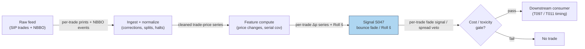

## Stage 47/200 — S047: Bid–ask bounce exploitation

*Batch SB4 · Signal 47/100 · Provenance [D] · Family A — Microstructure & order flow*

### S1. One-line verdict

| | |
|---|---|
| **What it is** | Transaction prices oscillate bid↔ask even when the mid is flat; a print at the ask is likelier followed by one at the bid — a mechanical mean reversion in *trade prices*, not value. |
| **When it works** | As a spread estimate (Roll) and as timing for passive entries/exits; as a P&L source only for co-located market makers with queue priority. |
| **When it dies** | As paper-trading alpha: gross edge bounded by the spread; fees, adverse selection, missed fills consume it. |
| **Build-or-buy in one line** | Build the Roll estimator on any trade feed — ten lines; do not build a bounce-harvesting strategy on SIP data. |

Provenance **[D]** · Family A — Microstructure & order flow. Signal chapter 47/100.

> **Honesty note (mandatory):** bounce harvesting *requires* spread estimates (ties to S012 Roll estimator and S014 spread decomposition), and the **gross edge is bounded by the spread itself** — you cannot earn more than the round-trip spread per share before costs. After costs this is an HFT/market-making feature, not paper-trading alpha (source entry).

### S2. How it works — plain human explanation

**Jargon, defined once:** *co-located* (servers physically located at the exchange data center); *SIP* (Securities Information Processor — the official consolidated tape); *NBBO* (National Best Bid and Offer — the consolidated best bid/ask across exchanges); *MBO* (market-by-order — individual-order messages); *HFT* (high-frequency trader).

The **bid**/ask are the best pay/take prices; the **mid** is their average; the **spread** (ask−bid) is the market maker's gross wage. Watch prints: 50.01, 50.01, 49.99, 50.01, 49.99… — the mid sat at 50.00 throughout, but trades bounced bid↔ask with the aggressor side. That oscillation is the **bid–ask bounce**: pure mechanics, zero information.

Two uses. *Measurement*: Roll (1984) showed the bounce's fingerprint — negative serial covariance in price changes — estimates the **effective spread** (the spread actually paid) from *trade prices alone, no quote feed*. *Trading*: after an ask print, the next print is likelier at the bid — a patient trader "fades" it (sell the ask, buy the bid, pocket the spread). That is bounce harvesting.

Why nearly unharvestable for a small operation? Round trip: sell 100 at the ask 50.01, buy back at the bid 49.99 → gross +$2.00. Subtract: exchange/SEC-style fees, **adverse selection** (sometimes the mid moves — the ask print was informed, the bid never comes back), and **queue priority** (your bid limit order waits behind everyone else). Remains: tenths of a cent per share — co-located market makers (Ho–Stoll), not a laptop strategy. For most readers: *cost estimator and execution timer*, not alpha.

**Mental model:** bounce = trade prices mean-revert bid↔ask while the mid stands still (mechanics, not mispricing); Roll turns its negative serial covariance into a spread estimate from prices alone; gross edge ≤ spread per round trip — net edge is a market-maker's game.

### S3. The math — exact formula

**Roll (1984) data-generating process:**

$$\Delta p_t = \frac{s}{2}\,(Q_t - Q_{t-1}) + u_t$$

- $p_t$ — trade price of trade $t$; $\Delta p_t = p_t - p_{t-1}$.
- $s$ — effective spread ($, per share).
- $Q_t \in \{+1,-1\}$ — trade direction (+1 buyer-initiated at ask, −1 seller-initiated at bid); Roll assumes $Q_t$ i.i.d. with $P(Q_t=+1)=1/2$ and independent of the efficient-price innovation $u_t$.
- $u_t$ — public-information shock (mean zero, serially uncorrelated).

**Estimator:** under these assumptions $\text{Cov}(\Delta p_t, \Delta p_{t-1}) = -s^2/4$, hence

$$\hat s = 2\sqrt{-\hat\gamma_1}, \qquad \hat\gamma_1 = \widehat{\text{Cov}}(\Delta p_t, \Delta p_{t-1})$$

- If $\hat\gamma_1 \ge 0$ the estimator is **undefined** (no bounce, or trending) — report undefined, lengthen the window, or bias-correct (Harris 1990: positive for ~half of securities on daily data).
- Sample autocovariance: $\hat\gamma_1 = \frac{1}{T-2}\sum_{t=2}^{T-1}(\Delta p_t - \overline{\Delta p})(\Delta p_{t-1} - \overline{\Delta p})$.

**The fade rule:** after a print at the ask ($Q_t = +1$), post/shade toward the bid expecting reversion; after a bid print, the reverse. Expected gross per round trip $\le s$ per share.

**Parameter table:**

| Parameter | Symbol | Typical range | Too small / too large | Default example |
|---|---|---|---|---|
| Estimation window | $T$ | 100–5,000 trades (or 1–15 min bars) | noisy/positive $\hat\gamma_1$ / mixes regimes | 500 trades (*example — not an institutional standard*) |
| Fade holding | $h$ | 1–20 trades | no fill / adverse move | next opposite-side print (*example*) |
| Participation | — | ≤10% of visible depth | no fills / moves the quote | passive only (*example*) |

**Normalization:** none — $\hat s$ is in price units; compare to quoted spread as a ratio ($\hat s / s_{\text{quoted}}$) for cross-name work. **Causal timing:** $\hat\gamma_1$ over trades $\le t$; a fade entered at $t$ is filled no earlier than $t+1$ — and only if your quote is actually hit (queue honesty).

**Named variants:** (1) Roll on trade prices; (2) Roll on 1–15 min bars; (3) Corwin–Schultz (S013, high-low based); (4) effective/quoted/realized spread decomposition (S014/S015) — the bounce harvester's required companions.

### S4. Worked example — step-by-step numbers (SYNTHETIC)

Synthetic 60-trade tape (seed **4747**; `batches/SB4/plot_S047.py`): mid fixed at $50.00, quoted spread $0.02 (bid 49.99 / ask 50.01), side switches with probability 0.65 (bounce-heavy). First 12 trades:

| Trade | Side | Price ($) |
|---|---|---|
| 1 | ask | 50.01 |
| 2 | ask | 50.01 |
| 3 | ask | 50.01 |
| 4 | bid | 49.99 |
| 5 | ask | 50.01 |
| 6 | ask | 50.01 |
| 7 | ask | 50.01 |
| 8 | bid | 49.99 |
| 9 | bid | 49.99 |
| 10 | ask | 50.01 |
| 11 | bid | 49.99 |
| 12 | ask | 50.01 |

Roll estimation on the full 60-trade tape: $\Delta p \in \{+0.02, 0, -0.02\}$; first-order serial covariance $\hat\gamma_1 = -0.000138$ → $\hat s = 2\sqrt{0.000138} = \$0.0235$ vs quoted $0.02$ — recovered within ~18% on 60 trades (sampling noise; a demonstration, not a calibration claim). Note the estimator *needs* $\hat\gamma_1 < 0$; a trending tape returns undefined.

**Bounce round-trip P&L decomposition** (per share, example costs — *not* an institutional fee schedule):

| Leg | ¢/share |
|---|---|
| Gross (sell ask 50.01, buy bid 49.99) | +2.0 |
| Exchange + regulatory-style fees | −0.4 |
| Adverse selection (mid moves against the fade) | −0.8 |
| Latency / queue (missed or slipped fills) | −0.4 |
| **Net** | **+0.4** |


**What to notice:** the gross edge (+2.0¢) is *exactly* the spread — the theoretical maximum, achieved only with perfect fills at both touches. Even generous example costs leave +0.4¢/share — ~$4 per 1,000-share round trip before the trades where the bid never comes back. **Limits:** flat mid (no adverse moves in the tape — the −0.8¢ is imposed, not observed); no partial fills; no queue-position modeling; SIP-latency-free. Real harvesting lives or dies on queue position and cancels, which this example does not model (*simulated only — requires MBO/ITCH* for any queue claim).

### S5. Strategies that use this signal

- **T097 — Sub-Hour Microstructure Reversal Scalper — primary trigger**: tick-level mean reversion harvesting the bounce with spread estimates (S012).
- **T011 — Short-Term Reversal + Bounce Timing — primary trigger**: Jegadeesh/Lehmann reversal entered *at the touch* — S047 supplies entry timing, S035 the reversal, S014 the cost gate.
- **T083 — Retail-Flow Internalizer Fade — execution input**: the internalizer's edge *is* spread capture against retail flow; S047's bounce mechanics and S015's spread decomposition price the fade.
- *Filter role:* Roll-implied spread as a *veto* — don't run spread-paying strategies when $\hat s$ exceeds the expected edge.

### S6. Data required — exact spec

| Field | Type | Granularity | Source tier | Notes |
|---|---|---|---|---|
| Trade prices + timestamps | events | per trade | Tier 1 | TAQ / Databento / Polygon — Roll needs only this |
| NBBO (for the fade, not the estimator) | events | per trade | Tier 1–2 | Fading blind without quotes is just the estimator |
| Queue/cancel data (for real harvesting) | MBO events | per order | Tier 3 | *Simulated only — requires MBO/ITCH* otherwise |

Collection: the *estimator* is honest on SIP trades; the *harvest* needs direct-feed MBO. Ingest sketch (≤20 lines):

```python
import polars as pl, numpy as np
p = pl.read_parquet("trades_2026-09-09.parquet").sort("ts")["price"].to_numpy()
dp = np.diff(p)
mu = dp.mean()
gamma1 = ((dp[1:-1] - mu) * (dp[:-2] - mu)).mean()   # Cov(dp_t, dp_{t-1})
roll_spread = 2 * np.sqrt(-gamma1) if gamma1 < 0 else np.nan
print(f"Roll implied spread: {roll_spread:.4f}" if gamma1 < 0
      else "undefined: non-negative serial covariance")
```

Storage: trades-only — tens of MB/symbol-day. Data-quality checklist: corrections, out-of-sequence prints, splits, DST/half-days, locked/crossed NBBO.

### S7. Local build on M5 Max / 128GB

**Feasibility verdict: trivial for the estimator; infeasible-locally for real bounce harvesting.** The Roll estimator is O(T) arithmetic — microseconds. Real harvesting needs co-located MBO feeds, queue-position modeling, and cancel logic: a different sport.

Throughput (per `notes/cost-model.md` §2): rolling Roll spreads over 500 symbols × 390 1-min bars — milliseconds in numpy; tick-level rolling estimation across 500 symbols is seconds per day. No bottleneck. RAM (per cost-model §3): trade-price vectors are megabytes; everything fits.

Stack: **Python+numpy** for all estimator work; **Rust** only inside a live MM loop; **DuckDB** for historical spread panels.

Engineering time: **Tier M, 20–60 h** (per cost-model §5) → $3,000–$9,000 loaded-cost estimate at $150/hr — and most of that is the *fade simulator* (fill modeling, queue honesty), not the estimator (an afternoon). A production bounce-harvesting MM system is Tier H+ and co-located — out of scope for local build. **What breaks first:** harvesting on SIP data — no queue visibility makes backtests fictional; label *simulated only — requires MBO/ITCH*.

### S8. Buy vs build

| Option | What you get | Indicative price | Gains | Loses |
|---|---|---|---|---|
| Tier 0: Alpaca IEX | Recent trades | ~$0 | Free prototype | No history depth |
| Tier 1: Polygon / Alpaca SIP | Full trade history | ~$30–200/mo | Estimator fully feasible | Harvest not honest on SIP |
| Tier 2: Databento | Microsecond trades + MBP-1 | ~$200/mo + usage | Cleaner estimation windows | Still no queue position |
| Tier 3: LOBSTER / direct MBO | Order-level replay | ~hundreds/yr academic / institutional $$$$ | The only honest harvest testbed | Cost; complexity |

All prices *indicative — verify before budgeting*. **Verdict: build the estimator on Tier 1; do not "buy" bounce alpha.** No vendor sells harvestable bounce edge — market makers keep it. Buy better data only to improve the *spread estimate* (S012/S014), which gates every other strategy's cost model. Crossover: direct MBO feeds only if you are actually building a quoting system (Tier H, co-located) — otherwise it is an expensive toy.

### S9. Success ratio / efficacy — documented evidence

| Study / source | Market & period | Metric | Before/after cost | Caveat |
|---|---|---|---|---|
| Roll (1984), *Journal of Finance* | US equities (daily/weekly data) | Spread $= 2\sqrt{-\text{cov}}$; implied spreads related to firm size | Before cost (estimator) | Assumes i.i.d. trade direction, constant spread, flow/value independence — all violated intraday |
| Harris (1990), *Journal of Finance* | US equities | Roll estimator **severely downward-biased** (Jensen's inequality); serial covariances positive for ~half of securities → estimator undefined; estimates depend on observation interval | Before cost (estimation critique) | Limits the estimator, let alone harvesting |
| Source entry (report, [D]) | Practitioner consensus | "Live MM bounce capture (queue position, cancels) is proprietary"; "after costs an HFT/MM feature, not paper-trading alpha" | After cost (practitioner verdict) | Qualitative, from the report's own coverage |
| Chatbot lead (Duck.ai, 2026-09-10, Q-SB4-3) | General | Bounce harvesting requires spread estimates (S012/S014); gross edge bounded by the spread itself; profitability consumed by half-spread, queue, fees, latency, missed fills, adverse selection, impact | After cost framing | *Unverified chatbot claim*; kept as labeled lead |
| Net-PnL of a local bounce-harvesting strategy | — | **No documented positive row**; the documented direction is negative-to-zero for non-co-located implementations | After cost | Honest cell: harvesting edge is a market-maker's edge |

**Regimes where it fails:** trending tapes (autocovariance ≥ 0 → undefined estimator); wide-spread / illiquid names (bounce exists but fills don't); news-driven directional flow (fade gets run over — adverse selection); locked/crossed markets; tick-constrained stocks (1-tick spread, fiercest queue competition).

**Honest bottom line:** as a *spread estimator* this is genuine and documented — every serious cost model uses Roll-family estimates. As a *standalone trigger* it is a **near-zero net edge** outside co-located market making: gross is capped at the spread, costs are structural. Report **both** OOS forecast improvement **and** net implementation performance after spread/fees/latency/realistic fills; without the second, call it a predictive feature, not a demonstrated edge (Q-SB4-3, labeled chatbot source).

### S10. Failure modes & pitfalls

1. **Gross ≤ spread arithmetic** — forgetting the edge is capped at the round-trip spread. *Mitigation:* always decompose P&L as in S4 before trading.
2. **Undefined estimator** — $\hat\gamma_1 \ge 0$ on trending tapes; trading anyway. *Mitigation:* report undefined; lengthen window; bias-correct (Harris 1990).
3. **Adverse selection** — the ask print was informed; the bid never comes back. *Mitigation:* condition fades on toxicity (S008); size for the loss case.
4. **Queue-position fiction** — backtests assume your bid gets hit; reality queues you behind. *Mitigation:* model queue explicitly; label SIP backtests *simulated only — requires MBO/ITCH*.
5. **Roll assumption violations** — serially correlated trade direction (S018!) and time-varying spreads break the $-s^2/4$ identity. *Mitigation:* use with S018 awareness; prefer effective-spread measures (S014).
6. **Latency** — by the time a SIP print reaches you, the bounce already happened. *Mitigation:* passive quoting only; never chase prints.
7. **Overtrading** — harvesting invites maximum turnover at minimum edge. *Mitigation:* per-trade cost budget; daily loss stop.
8. **Tick-size trap** — 1-tick-spread stocks look attractive (tiny spread = easy fill) but queue competition is maximal. *Mitigation:* measure realized fill rates, not theoretical edge.

### S11. Visuals




### S12. Sources

1. Roll, R. (1984). "A Simple Implicit Measure of the Effective Bid-Ask Spread in an Efficient Market." *Journal of Finance*, 39(4), 1127–1139. https://authors.library.caltech.edu/records/afwsc-6bb61
2. Harris, L. (1990). "Statistical Properties of the Roll Serial Covariance Bid/Ask Spread Estimator." *Journal of Finance*, 45(2). — severe downward bias; positive serial covariances common; estimator often undefined. https://repec.udesa.edu.ar/pub/Finanzas/Journals/Journal%20of%20Finance/45/2/2328671.pdf
3. Screamer Labs — `RollSpread` practitioner documentation: $2\sqrt{-\text{cov}(\Delta P_t, \Delta P_{t-1})}$ from trade prices alone; undefined (NaN) when serial covariance is non-negative. https://github.com/screamer-labs/screamer/blob/HEAD/docs/functions_micro/RollSpread.md
4. Stoll, H. R. (1989). "Inferring the Components of the Bid-Ask Spread: Theory and Empirical Tests." *Journal of Finance*. / Ho, T. & Stoll, H. R. (1981). Dealer inventory models. (Report citations; URLs not independently verified — not fabricated here.)
5. Chatbot source (labeled, per question-bank protocol): Duck.ai (GPT-5.6 Luna, anonymous, 2026-09-10) answered Q-SB4-1–Q-SB4-3; Grok/Cursor answers pending (checked 2026-09-10). Spread-estimate dependency and gross-edge-bound points used above as *labeled leads*.

**Unverified leads** (chatbot-only, not independently confirmed): Roll window guidance (100–5,000 transactions; 1–15 min bars); "corrected estimator (drift, discreteness, asymmetry)" as remedies for non-negative autocovariance.
