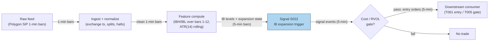

## Stage 22/200 — S022: First-hour range expansion / initial balance

*Batch SB5 · Signal 22/100 · Provenance [D] · Family B — Intraday Momentum & Breakout*

### S1. One-line verdict

| | |
|---|---|
| **What it is** | First-hour (Initial Balance) high/low; a close or excursion beyond the band marks a likely trend day — trade the expansion. |
| **When it works** | High-conviction news/volatility days where institutions commit directionally after the open. |
| **When it dies** | Chop, low-volume bracket days, and late entries after the expansion leg is spent. |
| **Build-or-buy in one line** | Build: it is a Tier L calculation on 1–5 min bars; buy the bars, not the signal. |

### S2. How it works — plain human explanation

**Initial balance (IB)** is a Market Profile term (Steidlmayer/Dalton): the high and low established during the first hour of regular trading (09:30–10:30 ET), i.e. the first twelve 5-minute bars. **IBH** = Initial Balance High (the hour's highest high); **IBL** = Initial Balance Low (the hour's lowest low); **IBR** = Initial Balance Range (IBH − IBL). Picture it: overnight, thousands of orders pile up — earnings reactions, macro news, portfolio rebalancing. The opening auction clears that backlog, and the first hour is the market's price-discovery session: buyers and sellers negotiate a reference range. If, after 10:30, price pushes *beyond* that range and holds, it means the marginal institutional flow has picked a side. Pit traders called the result a **trend day** — a session where the day's range keeps extending in one direction.

A concrete vignette: 09:47:03, AAPL bid 231.40 × 800 / ask 231.41 × 300. By 10:30 the tape has printed a first-hour high of 232.10 (IBH) and low of 230.55 (IBL). At 11:05, on a sector headline, a 5-minute bar closes at 232.42 — $0.32 above IBH, about 21% of the IB range. The signal says the morning's balance is broken; you enter long on the next bar's open, never at the print that broke the level — in live trading you cannot trade a bar that has already closed.

Why should this work economically? First, **overnight information asymmetry**: informed flow accumulates while the market is closed; the first hour absorbs it, and a break of the resulting range means absorption failed — imbalance remains. Second, **institutional participation**: large desks benchmark to VWAP (volume-weighted average price — the day's volume-weighted average trade price) and commit once the day's direction resolves; their own flow then extends the move. Third, **behavioral anchoring**: the first hour's extremes are visible reference points; breaks trigger stop-loss cascades.

- **Mental model:** the first hour draws a box the market negotiated; a sustained break of the box means the negotiation failed and one side is winning.
- **Mental model:** expansion is a *regime* statement (trend day vs bracket day) first, an entry trigger second — size and hold time should follow the regime call.
- **Mental model:** the edge lives in the *confirmation* (close beyond the band + volume), not in touching the line; touches are noise, closes are commitment.

### S3. The math — exact formula

Let bars 1…K be the first K 5-minute bars of RTH (regular trading hours — the 09:30–16:00 ET equity session; K = 12 for a 60-minute IB), with bar i having high H_i and low L_i, and let C_t be the close of bar t > K.

$$\text{IBH} = \max_{i=1..K} H_i, \qquad \text{IBL} = \min_{i=1..K} L_i, \qquad \text{IBR} = \text{IBH} - \text{IBL}$$

Expansion (bullish) at bar t, with buffer δ ≥ 0 and optional volume multiple m_v:

$$\text{Expand}_t^{\text{up}} = \big[\, C_t > \text{IBH} + \delta \,\big] \;\; \text{AND} \;\; \big[\, V_t > m_v \cdot \bar{V} \,\big]$$

where V_t is bar-t volume and V̄ is the mean volume of the IB bars. Bearish expansion mirrors with C_t < IBL − δ. A common normalization expresses the excursion as a fraction of the range:

$$e_t = \frac{C_t - \text{IBH}}{\text{IBR}} \quad \text{(bullish; } e_t > q \text{ triggers, e.g. } q = 0.25\text{)}$$

The buffer is often set from volatility: δ = q·ATR(A), where **ATR** (Average True Range) is the N-bar mean of True Range TR_i = max(H_i − L_i, |H_i − C_{i−1}|, |L_i − C_{i−1}|). **Causal timing:** IBH/IBL are known only after bar K closes (10:30 ET); the expansion signal is computed at the close of bar t (t > K) using only data ≤ t, and is tradable no earlier than the open of bar t+1.

| Parameter | Symbol | Typical range | Too small | Too large | Default (example) |
|---|---|---|---|---|---|
| IB window | K (5-min bars) | 6–18 bars (30–90 min) | noisy box, whipsaws | late regime call, gives up the move | 12 bars / 60 min, *example — not an institutional standard* |
| Buffer | δ or q | 0–0.5×ATR | false breaks on touches | misses the expansion leg | q = 0.1×ATR(14), *example* |
| Excursion fraction | q_e | 0.1–0.5 of IBR | trades noise | never triggers | 0.25, *example* |
| Volume multiple | m_v | 1.0–2.0× | no confirmation value | filters out real breaks on quiet names | 1.5×, *example* |

**Named variants.** (1) **Crabel ORB** (opening-range breakout; Crabel, 1990): shorter window (15–30 min), breakout of the opening range itself — faster but noisier than IB. (2) **Fisher ACD** (Fisher, 2002): builds "A-up/A-down" pivot points (ACD = Fisher's "A/C down" pivot-entry framework) from the opening range plus N points; a mechanical entry/exit system around the same idea. (3) **IB + squeeze confirmation**: require a volatility squeeze (see S030) during the IB hour — compression before expansion selects for larger trend days.

### S4. Worked example — step-by-step numbers (SYNTHETIC)

Synthetic 30-bar 5-minute tape, seed 22 (volumes jittered with `np.random.default_rng(22)`; OHLC hand-specified). Bars 1–12 are the first hour; bars 13–29 are flat; bar 30 is the expansion bar.

| bar | time | O | H | L | C | Vol |
|---|---|---|---|---|---|---|
| 1 | 09:30 | 100.00 | 100.20 | 99.90 | 100.05 | 858 |
| 2 | 09:35 | 100.05 | 100.35 | 99.95 | 100.15 | 839 |
| 3 | 09:40 | 100.15 | 100.50 | 100.00 | 100.30 | 842 |
| 4 | 09:45 | 100.30 | 100.70 | 100.10 | 100.35 | 821 |
| 5 | 09:50 | 100.35 | 100.60 | 100.20 | 100.40 | 838 |
| 6 | 09:55 | 100.40 | 100.80 | 100.25 | 100.45 | 804 |
| 7 | 10:00 | 100.45 | 100.70 | 100.30 | 100.42 | 804 |
| 8 | 10:05 | 100.42 | 100.60 | 100.10 | 100.30 | 810 |
| 9 | 10:10 | 100.30 | 100.90 | 100.20 | 100.60 | 783 |
| 10 | 10:15 | 100.60 | 101.20 | 100.40 | 100.80 | 791 |
| 11 | 10:20 | 100.00 | 100.80 | 99.80 | 100.20 | 774 |
| 12 | 10:25 | 100.00 | 100.80 | 99.80 | 100.20 | 794 |
| 13–29 | 10:30–11:55 | 100.00 | 100.80 | 99.80 | 100.20 | ~665–777 |
| 30 | 12:00 | 100.20 | 102.50 | 100.00 | 102.00 | 2500 |

Step 1 — IB levels (bars 1–12): IBH = max high = **101.20** (bar 10); IBL = min low = **99.80** (bars 11–12); IBR = 101.20 − 99.80 = **1.40**.

Step 2 — expansion check at bar 30: C_30 = 102.00 > IBH = 101.20 → breakout. Excursion e = (102.00 − 101.20)/1.40 = 0.80/1.40 = **57.14% of IBR**, well above the 25% example threshold. Volume 2500 ≈ 3.5× the IB-hour mean (~810) — confirmation passes at m_v = 1.5.

Step 3 — tradability: signal computed at 12:00 close; entry no earlier than the next 5-minute bar open (~102.00). (These figures reproduce the operator-verified Q-SB5-1 worked example: IBH 101.20, IBL 99.80, IBR 1.40, excursion 0.80 = 57.14% of IBR — all hand-checked, no arithmetic errors.)

**What to notice.** The long flat midday (bars 13–29) is the bracket regime: price sits *inside* the IB box and no signal fires — correctly, the method stays flat. The bar-30 break arrives with a volume surge, the classic expansion signature. **Limits:** no fees, no spread, a single hand-picked expansion bar — real breaks often retest IBH and shake out early entries. Nothing here is a backtest.

### S5. Strategies that use this signal

- **T061 — Initial-Balance Expansion Trader** — *primary entry trigger (direction)*: S022 defines the IB box and fires the expansion entry; S030 (squeeze) confirms compression inside the box; S032 (RVOL — relative volume, i.e. volume vs its time-of-day average) gates for institutional participation.
- **T005 — RVOL-Filtered Opening-Range Breakout** — *conceptual-fit reference (not a plan-defined consumer of S022)*: after 10:30, require price beyond IBH (or below IBL) before taking late ORB entries; veto counter-trend entries while price is trapped inside the IB box.

### S6. Data required — exact spec

| Field | Type | Granularity | Source tier | Notes |
|---|---|---|---|---|
| OHLCV | float/int | 1–5 min bars, RTH | Tier 0–1 | SIP-consolidated (Securities Information Processor); exchange timestamps required |
| Corporate actions | events | daily | Tier 0–1 | splits/dividends; IB levels must be split-adjusted point-in-time |
| Halt/status flags | enum | per bar | Tier 1 | exclude halted bars from the IB window |
| Session calendar | dates | daily | Tier 0 | half-days invalidate a 60-min IB; fall back to 30-min |

Collection: Polygon Stocks Advanced (`/v2/aggs/ticker/{t}/range/5/minute/...`) or Databento `ohlcv-1m`; Alpaca IEX free tier suffices for prototyping. Ingest sketch (≤20 lines, polars):

```python
import polars as pl
bars = pl.read_parquet("bars_1m/*.parquet").filter(
    pl.col("symbol") == "AAPL").sort("ts")                    # exchange ts, RTH only
bars = bars.with_columns(pl.col("ts").dt.date().alias("day"))
ib = bars.group_by("day").agg([                               # first 12 five-min bars
    pl.col("high").head(12).max().alias("IBH"),               # 09:30-10:30 ET
    pl.col("low").head(12).min().alias("IBL")]).with_columns(
    (pl.col("IBH") - pl.col("IBL")).alias("IBR"))
sig = bars.join(ib, on="day").with_columns(
    ((pl.col("close") > pl.col("IBH") + 0.1 * pl.col("atr14"))
     & (pl.col("volume") > 1.5 * pl.col("ib_vol"))).alias("expand_up"))
```

Storage: 1-min bars for 500 symbols ≈ 50 MB/day, ~3 GB per 60 days (per `notes/cost-model.md` §4) — archive freely. **Data-quality checklist:** exchange timestamps (SIP vs direct skew); point-in-time splits/dividends; drop halted bars from the window; DST and early closes (shorten K or skip); reject stale/zero-volume bars.

### S7. Local build on M5 Max / 128GB

**Feasibility: trivial.** IBH/IBL is a 12-bar rolling max/min plus a close comparison — O(1) per bar with running state. Per `notes/cost-model.md` §2, a 500-symbol 1-minute universe produces 500 bars/min (8.33 bars/sec average; design for 500-bar bursts at the minute boundary) — each update is microseconds; the full 60-day feature table (11.7M rows) recomputes in well under a second in polars (~10–50M rows/sec simple ops). The S022 signal alone is Tier L; the Q-SB5-2 chatbot lead prices a *full multi-signal session-pattern engine* far higher (185–385 h prototype / 705–1,530 h research-grade, rows verified to sum exactly), with point-in-time correctness the dominant cost.

| Stack | When to pick |
|---|---|
| Python + polars | Default: IB/ATR/z logic is vectorized rolling ops; fastest to write and audit |
| Rust | Only if you need tick-level break detection across thousands of symbols in real time |
| DuckDB | Ad-hoc research queries over partitioned Parquet history |

RAM: 60 days × 500 symbols of 1-min bars is ~3 GB on disk per cost-model §4 and far less as a compact numeric frame — trivial against the 77 GB working budget (cost-model §3). Engineering: **Tier L, 4–12 h → $600–1,800** at $150/hr loaded-cost estimate (cost-model §5), for the signal plus replay harness; the point-in-time bar store is the real work. **Bottleneck:** data correctness (corporate actions, halt handling), not compute. **Breaks at:** full-universe tick-level expansion monitoring (millions of events/sec) — then move break detection to Rust per cost-model §2 (5–50M events/sec).

### S8. Buy vs build

| Option | What you get | Indicative price | Gains | Loses |
|---|---|---|---|---|
| Tier 0: Alpaca IEX / Stooq | Free 1-min/daily bars | ~$0 | zero cost, fine for prototyping | IEX-only or delayed; no venue detail |
| Tier 1: Polygon Stocks Advanced | SIP 1-min bars, splits, 20+ yrs | ~$30–200/mo | clean history, corp actions | SIP timestamps only |
| Tier 2: Databento Standard | L1 (top-of-book quotes)/L2 (full depth-of-book) + OHLCV schemas, replay | ~$200/mo + usage | honest timestamps, venue data | usage meter runs on history pulls |
| Academic: LOBSTER / TAQ | MBO (market-by-order)/ITCH (Nasdaq's direct-feed order message protocol) replay, TAQ (Trade and Quote — the consolidated equity tick database) history | ~hundreds/yr academic; institutional $$$$ | microstructure-grade research | licensing friction, heavy storage |

All prices *indicative — verify before budgeting*. **Verdict: build.** Data tier ≤ 1, eng Tier L — buy the bars (Tier 1), build the IB logic, thresholds, and replay yourself, per the Q-SB5-2 chatbot verdict (buy normalized data; build bar construction, indicator state, and point-in-time replay). Buy deeper history only if you extend to cross-sectional IB studies.

### S9. Success ratio / efficacy — documented evidence

| Study / source | Market & period | Metric | Before/after cost | Caveat |
|---|---|---|---|---|
| Holmberg, Lönnbark & Lundström (2013), "Assessing the profitability of intraday opening range breakout strategies", *Finance Research Letters* 10(1) | Crude oil futures | ORB returns significantly > 0; success rate above a fair game | Before-cost | Futures, not equities; fixed rule, no regime filter |
| "Enhancing Opening Range Breakout Strategies with LSTM-Based True Range Prediction" (Springer, 2026) | S&P 500 index futures (ES) | LSTM (long short-term memory — a neural-network architecture)-forecast true range: ~+70% cumulative return vs ATR-based ORB baseline | Before-cost; oracle upper-bound labeled | Method paper; ML overlay, not the raw IB signal |
| Duck.ai Q-SB5-3 (labeled chatbot lead, 2026-09-10) | Practitioner synthesis | Donchian/ATR breakouts show positive convexity in trends, die in chop; edge is in regime selection + execution | n/a — qualitative | *Unverified chatbot claim* — treat as a research lead |

**Regimes where it fails:** range-bound/bracket days (repeated false breaks — the principal failure mode per practitioner sources); low-liquidity names where the "IB" is market-maker noise; news-spike expansions that reverse by midday; late entries after the expansion leg is spent. **Documented decay:** the raw rule is decades old (Crabel 1990) and widely published — expect the naive version to be competed away; conditioning (squeeze, RVOL, higher-timeframe trend) is where any residual edge lives. **Bottom line:** as a standalone trigger, a weak-to-moderate, cost-sensitive edge; as a *regime filter* (trend-day vs bracket-day) feeding sized entries, moderate — the honest use case.

### S10. Failure modes & pitfalls

1. **Mixed bar-inclusion conventions (live-implementation pitfall — mandatory flag).** The Q-SB5-1 worked example mixed conventions: Donchian(20) at bar 30 used *prior* bars only (10–29), while EMA (exponential moving average)/Bollinger/ATR/z windows *included* bar 30 (bars 11–30). In live code this silently moves every threshold: ATR(20) including the expansion bar's TR of 2.50 is 1.075, but a completed-bar convention (TR of bars 10–29) gives 1.00 — an 8% band-width swing from a bookkeeping choice. **Mitigation — one consistent convention:** compute all rolling windows from *fully closed bars only* (at bar t's close, windows cover bars t−N..t−1); monitor the *live* bar for the break; fill at the next bar's open. **Cost:** you surrender the intrabar excursion and pay one bar of lag — the price of zero lookahead and identical live/replay behavior.
2. **Lookahead on IBH/IBL:** using the 10:30 IB levels before 10:30, or re-estimating them with revised bars. Mitigate: freeze the IB at bar-K close; store raw messages and derive bars yourself (Q-SB5-2 verdict).
3. **Late-entry slippage:** entering minutes after the break at the extended price. Mitigate: cap entry at IBH + 0.5×IBR; skip if already extended.
4. **Half-days and news halts:** a 60-min IB on Thanksgiving Friday is meaningless. Mitigate: session calendar; fall back to 30-min IB or stand down.
5. **Overfit IB window/buffer:** mining K ∈ {6,…,18} × q grids on one year. Mitigate: pick K = 60 min for the Market-Profile reason, validate out-of-sample, purge/embargo (see S088).
6. **Cost blowup:** breakout entries cross the spread and chase; on a 1.40-range name with a 2–3 bp spread and 5–10 bp chase slippage, a 30–50 bp excursion target is half consumed. Mitigate: model spread + fees + impact per trade (H5); require excursion target ≥ 3× round-trip cost.
7. **Crowding on round IB levels:** everyone sees the same first-hour high. Mitigate: buffer q > 0, volume confirmation, or time-delay the entry.
8. **Stale corporate-action data:** an unadjusted split halves IBH overnight and fabricates a breakout. Mitigate: point-in-time security master (the Q-SB5-2 "biggest hidden item").

### S11. Visuals




### S12. Sources

- Crabel, T. (1990). *Day Trading with Short Term Price Patterns and Opening Range Breakout.* Traders Press (ISBN 0934380171). Practitioner source for ORB; computer-tested short-term patterns.
- Steidlmayer, J. P. & Dalton, J. (1992/2007). *Mind Over Markets.* The Initial Balance / Market Profile framework.
- Fisher, M. (2002). *The Logical Trader.* Wiley. ACD method: opening-range-based pivot entries/exits.
- Holmberg, U., Lönnbark, C. & Lundström, C. (2013). "Assessing the profitability of intraday opening range breakout strategies." *Finance Research Letters* 10(1), 27–33. https://www.econbiz.de/Record/assessing-the-profitability-of-intraday-opening-range-breakout-strategies-holmberg-ulf/10010818902
- "Enhancing Opening Range Breakout Strategies with LSTM-Based True Range Prediction." Springer (2026). https://link.springer.com/chapter/10.1007/978-981-92-0074-0_23

**Unverified leads**
- Duck.ai (GPT-5.6 Luna) answered Q-SB5-1–Q-SB5-3 (2026-09-10); Grok/Cursor answers pending (checked 2026-09-10). The Q-SB5-1 30-bar example (IBH 101.20 / IBL 99.80 / IBR 1.40 / excursion 57.14% of IBR) was operator-verified with no arithmetic errors; its mixed bar-inclusion convention is flagged in S10. Q-SB5-3's qualitative assessments are research leads, not confirmed facts.
