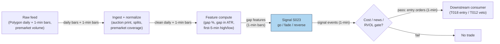

## Stage 23/200 — S023: Gap-and-go

*Batch SB5 · Signal 23/100 · Provenance [SR] · Family B — Intraday Momentum & Breakout*

### S1. One-line verdict

| | |
|---|---|
| **What it is** | An overnight gap that holds through the open, then breaks the first minutes' high — a footprint of unfilled institutional demand. |
| **When it works** | News-driven gaps with heavy premarket volume and wide market/sector tailwinds. |
| **When it dies** | Small no-news gaps, thin premarket prints, and extended gaps that mean-revert into the open. |
| **Build-or-buy in one line** | Build the classifier; buy the news feed if you want the news/no-news split that makes it work. |

### S2. How it works — plain human explanation

An **overnight gap** is the difference between today's opening print and yesterday's close: G = (O_t − C_{t−1})/C_{t−1}. Overnight, news accumulates while nobody can trade; the open is where it all reprices at once. **Gap-and-go** says: if a stock gaps up on real news, holds the gap (doesn't immediately fall back to fill it), and then breaks above the high of its first few minutes of trading, the institutions that wanted to buy couldn't finish overnight — they will keep buying into the morning. **Gap fade** is the mirror: small, no-news gaps tend to get "filled" as price drifts back toward the prior close.

A concrete vignette: 08:47, premarket. XYZ closed at 100.00; on an earnings beat it trades 103.00 on 4× its normal premarket volume. At 09:30 the opening print is 103.00 — a +3.0% gap. The first five minutes hold between 103.00 and 103.60. At 09:36 a 1-minute bar closes at 103.65, above the first-5-minute high. Go: the gap held, the opening drive broke upward — buy the continuation, targeting the morning extension, and flatten by lunch if momentum stalls. Contrast: ABC gaps +1.5% to 101.50 on no news with thin premarket volume; by 10:00 it is back at 100.40 — the fade was the trade, not the go.

Why should either leg exist? **Overnight information asymmetry**: news arrives around the clock but can only be traded at the open, so the opening auction is a coarse, liquidity-constrained repricing — large gaps often under-adjust initially, leaving a drift (the go). **Institutional urgency**: desks with VWAP (volume-weighted average price — the day's volume-weighted average trade price) benchmarks or rebalance mandates must complete size during the day, extending the move. Conversely, **liquidity provision**: market makers fade small uninformed gaps, and overnight index-futures noise mean-reverts once cash trading resumes (the fade).

- **Mental model:** the gap is the market's first draft of the news; the first 30 minutes are the editing process — go trades the drafts that get *confirmed*, fade trades the drafts that get *rejected*.
- **Mental model:** there is no universal "gaps continue X% of the time" — continuation probability is a function of gap size (in ATR — Average True Range, the trailing mean of True Range), news, and premarket volume.
- **Mental model:** the go is a positive-skew, low-hit-rate trade; the fade is a high-hit-rate, negative-skew trade — evaluate by expected value net of costs, not by win rate.

### S3. The math — exact formula

Gap and gap size in volatility units (**ATR** = Average True Range, the trailing mean of True Range):

$$G_t = \frac{O_t - C_{t-1}}{C_{t-1}}, \qquad g_t^{\text{ATR}} = \frac{O_t - C_{t-1}}{\text{ATR}_{t-1}(14)}$$

**Hold condition** (up gap; down gap mirrors): the gap is "held" if the low of the first M minutes stays above the prior close: min_{i≤M} L_i > C_{t-1}. **Go trigger**: close of a 1-minute bar above the first-N-minute high:

$$\text{Go}_t = \big[\, g_t^{\text{ATR}} > k \,\big] \;\; \text{AND} \;\; \big[\, \min_{i \le M} L_i > C_{t-1} \,\big] \;\; \text{AND} \;\; \big[\, C_{\tau} > \max_{i \le N} H_i \,\big]$$

for the first bar τ > N. **Fade trigger**: the gap fills, i.e. price touches C_{t-1}, or the first-N-minute low breaks with falling **RVOL** (Relative Volume — the ratio of current volume to the same time-of-day historical average). **Causal timing:** the gap is known at the 09:30 opening print; the hold condition needs M minutes of tape; the trigger is tradable at the close of bar τ, filled at bar τ+1's open at the earliest. Filters: premarket volume multiple, float, news flag, opening spread.

| Parameter | Symbol | Typical range | Too small | Too large | Default (example) |
|---|---|---|---|---|---|
| Gap threshold | k (×ATR) or % | 1.5–2.5×ATR or 2–4% | fades dominate, whipsaws | almost never triggers | 2.0×ATR, *example — not an institutional standard* |
| Hold window | M (min) | 5–15 | gap-fill noise triggers | misses the move | 10 min, *example* |
| Breakout window | N (min) | 1–5 | microstructure noise | late entry | first 5-min high, *example* |
| Premarket vol mult. | m_pm | 2–5× normal | no-news gaps pass | filters real earnings gaps on quiet premarkets | 3×, *example* |
| RVOL gate | m_r | 1.5–3× | weak participation | only mega-caps qualify | 2×, *example* |

**Named variants.** (1) **Earnings-gap go**: require a material-news flag — the highest-conviction subset. (2) **Index-gap fade**: gap driven by overnight index-futures moves with no stock-specific news. (3) **Gap-and-reverse**: gap fills *and* keeps going through the prior close — the fade's trend variant.

### S4. Worked example — step-by-step numbers (SYNTHETIC)

Three synthetic 1-minute scenarios, seed 23 (`np.random.default_rng(23)`; anchor values pinned, small noise between). Prior close C_{t−1} = 100.00; synthetic ATR(14) = 1.50. Prices shown at minutes after the 09:30 open.

| min | A: gap-and-go | B: gap fade | C: gap-and-reverse |
|---|---|---|---|
| 0 (open) | 103.00 | 101.50 | 102.50 |
| 5 | 103.60 | 101.65 | 102.90 |
| 30 | 103.45 | 101.30 | 102.60 |
| 60 | 103.90 | 100.80 | 101.80 |
| 120 | 104.20 | 100.40 | 100.60 |
| 240 | 104.05 | 99.95 | 99.90 |
| 390 (close) | 103.80 | 99.90 | 99.50 |

Step 1 — gap sizes: A: +3.00% = 2.00×ATR (passes the 2.0× example threshold); B: +1.50% = 1.00×ATR (fails — fade candidate); C: +2.50% = 1.67×ATR (borderline).

Step 2 — hold check: A never trades below 103.00 (holds); B's low drifts under the prior close by minute 240 (99.95 — gap filled); C pushes to 102.90 then collapses through the prior close to 99.50 (gap-and-reverse).

Step 3 — go trigger on A: first-5-minute high = 103.60; the first 1-minute close above it prints at minute 6 at **103.65** — entry no earlier than minute 7's open.

**What to notice.** Scenario B is the mandatory lesson: a +1.5% gap on no news fades *through* the prior close — the naive "buy every gap" rule loses on both legs here. Scenario C shows why stops exist: a 2.5% gap that initially pushes higher still ends −0.5% on the day. **Limits:** hand-picked anchors; no spreads (the opening spread is the day's widest — often 5–20 bps (basis points, 1 bp = 0.01%) on mid-caps), no chase slippage, no fees. Mechanics illustration, not a backtest.

Expected-value framing (illustrative *example* parameters, not a claim): a go strategy winning 45% of trades, averaging +1.80% on wins and −1.20% on losses, with 8 bps all-in costs: E[return] = 0.45×1.80 − 0.55×1.20 − 0.08 = **+0.07% per trade**. Report this — not "gaps continue 55% of the time" — because the win rate alone hides the skew.

### S5. Strategies that use this signal

- **T018 — RVOL-Gated Gap-and-Go** — *primary entry trigger (direction)*: S023 defines the gap/hold/break; S032 (RVOL) gates for institutional participation; S094 (block footprints) confirms real size behind the move.
- **T012 — Jump-Filtered Overnight-Gap Fade** — *conceptual-fit reference (not a plan-defined consumer of S023)*: if S023's go conditions confirm (news flag + RVOL + first-minutes high break), veto the fade — the gap is informed and fading it is picking up pennies in front of a steamroller.

### S6. Data required — exact spec

| Field | Type | Granularity | Source tier | Notes |
|---|---|---|---|---|
| Daily OHLC | float | daily | Tier 0–1 | prior close; must be split/dividend-adjusted point-in-time |
| Opening print | float | per day | Tier 1 | official open auction print, not first trade |
| 1-min OHLCV | float/int | 1-min, first 60–90 min | Tier 1 | SIP (Securities Information Processor — the consolidated feed) bars suffice |
| Premarket volume | int | premarket session | Tier 1–2 | not all vendors carry it; verify coverage |
| News flags | events | per symbol-day | Tier 2 | earnings/ guidance/ M&A; Benzinga-class feeds |

Collection: Polygon (`/v2/aggs/...` + premarket flag) or Alpaca (free tier covers SIP bars; premarket volume via extended-hours bars). Ingest sketch (≤20 lines):

```python
import polars as pl
d = pl.read_parquet("daily/*.parquet").sort(["symbol", "day"])
d = d.with_columns((pl.col("open") / pl.col("close").shift(1) - 1).over("symbol").alias("gap"),
    ((pl.col("open") - pl.col("close").shift(1)) / pl.col("atr14")).over("symbol").alias("gap_atr"))
pm = pl.read_parquet("premarket/*.parquet")          # premarket volume per symbol-day
cand = d.join(pm, on=["symbol", "day"]).filter(
    (pl.col("gap_atr") > 2.0) & (pl.col("pm_vol_mult") > 3.0))   # example thresholds
mins = pl.read_parquet("bars_1m/*.parquet")          # first-5-min high, hold check
go = cand.join(mins.group_by(["symbol", "day"]).agg(
    pl.col("high").head(5).max().alias("h5"),
    pl.col("low").head(10).min().alias("l10")), on=["symbol", "day"])
```

Storage: daily bars trivial; 1-min bars for 500 symbols ≈ 50 MB/day, ~3 GB/60 days (per `notes/cost-model.md` §4). **Data-quality checklist:** official opening-auction print (not first trade); point-in-time adjustments (a split fabricates a −50% "gap"); premarket volume comparability across vendors; halted/delayed opens excluded.

### S7. Local build on M5 Max / 128GB

**Feasibility: trivial.** A handful of daily-bar arithmetic plus a first-5-minute high/low scan — O(1) per symbol-day. Per `notes/cost-model.md` §2, the 500-symbol 1-minute universe (195k bars/day) is trivially handled by polars batch ops; the daily gap screen is milliseconds. S023 alone is Tier L; the Q-SB5-2 chatbot lead prices the *full session-pattern engine* at 185–385 h prototype / 705–1,530 h research-grade.

| Stack | When to pick |
|---|---|
| Python + polars | Default: gap screens and first-N-minute stats are trivially vectorized |
| DuckDB | Research queries over partitioned daily/minute history |
| Rust | Unneeded at this granularity |

RAM: daily + 1-min history for 500 symbols over years fits in single-digit GB — far under the 77 GB working budget (cost-model §3). Engineering: **Tier L, 4–12 h → $600–1,800** at $150/hr loaded-cost estimate (cost-model §5) for the signal + replay; the news-flag pipeline is the only part that can push toward Tier M. **Bottleneck:** premarket-volume coverage and news-flag licensing, not compute. **Breaks at:** full-universe real-time premarket scanning across fragmented venues — then the constraint is data licensing, not the M5 Max.

### S8. Buy vs build

| Option | What you get | Indicative price | Gains | Loses |
|---|---|---|---|---|
| Tier 0: Alpaca IEX / Stooq | Free daily + SIP 1-min bars | ~$0 | zero cost | no premarket volume detail, no news flags |
| Tier 1: Polygon Stocks Advanced | SIP bars, premarket, splits | ~$30–200/mo | single-vendor gap pipeline | news flags are an add-on |
| Tier 2: Benzinga Pro-class news | Machine-readable headlines | ~$100–200/mo | the news/no-news split that stratifies gaps | redistribution limits; headline ≠ materiality |
| Tier 2: Databento Standard | L1 (top-of-book quotes) + imbalance + OHLCV | ~$200/mo + usage | honest auction prints, venue detail | overkill for a daily-gap signal |

All prices *indicative — verify before budgeting*. **Verdict: build the classifier, buy the bars; buy the news feed only if the earnings-gap variant is core.** The crossover: if you need licensed redistribution of news (e.g. serving signals to others), you are buying regardless — building means re-licensing anyway (cost-model §6).

### S9. Success ratio / efficacy — documented evidence

| Study / source | Market & period | Metric | Before/after cost | Caveat |
|---|---|---|---|---|
| Stübinger & Schneider (2019), "Statistical Arbitrage with Mean-Reverting Overnight Price Gaps", *J. Risk Financ. Manag.* 12(2):51 | S&P 500 constituents, 1998–2015, high-frequency | Jump-detected overnight-gap strategy: +51.47% p.a., Sharpe 2.38 | **After transaction costs** (authors' model) | This is a **fade**, not a go — the documented edge is mean-reversion of gaps |
| Caporale & Plastun (2017); Plastun et al. (2020); weekend-gap follow-up (MDPI, 2025) | DJIA/NASDAQ, weekend gaps | Prices continue in the gap's direction for several hours after Monday's open | Before-cost, index level | Continuation subsides quickly; varies by index |
| Berkman, Koch & Tuttle (2009), "Dispersion of Opinions, Limits to Arbitrage, and Overnight Returns", SSRN | 3,000 largest US stocks, 9 yrs intraday | Overnight gains reverse during the day, concentrated in high-disagreement / hard-to-short names | Before-cost | Explains the fade leg; limits-to-arbitrage names are the least tradable |

**Regimes where it fails:** low-volume no-news gaps (fade eats the go); gap into a halted/volatile open; crowded first-5-minute-high entries (every retail screener sees the same level); macro-gap days where the *index* mean-reverts and drags single names. **Documented decay:** the simple gap-fade is a decades-old prop-desk staple — heavily competed; the news-conditioned go retains more plausibility because it keys on genuine information events. **Bottom line:** as a standalone trigger, a *conditional* edge — weak unconditionally, plausible when stratified by news × size × volume; as a *classifier* (go vs fade vs reverse) feeding execution, moderate. The honest statistic is E[return] = P(win)·E[win] − P(loss)·E[loss] − costs.

### S10. Failure modes & pitfalls

1. **Entry slippage on gaps:** chasing the open means paying the day's widest spread plus momentum slippage. Mitigate: enter on the confirmed break (minute 6+, not the print), cap chase at 0.5×ATR beyond the trigger.
2. **Lookahead on the opening print:** using a vendor's "open" that is actually a revised or late print. Mitigate: use the official auction print with its publication timestamp; never the first trade.
3. **Auction cutoffs:** MOO/LOO (market/limit-on-open) orders must beat the cutoff; after it, you are a price-taker on the book. Mitigate: model the cutoff explicitly; assume regular-session fills after 09:30:01.
4. **News misclassification:** "no news" gaps that are actually informed. Mitigate: treat unexplained large gaps as informed by default — require the go, never fade blindly.
5. **Halts and delayed opens:** the first-5-minute window is undefined. Mitigate: skip delayed opens and LULD (limit-up/limit-down) halts.
6. **Survivorship bias:** gap-downs that never recover belong to delisted names your universe file dropped. Mitigate: point-in-time universe including delisted securities.
7. **Overfit thresholds:** mining k × M × N grids. Mitigate: fix k from ATR economics (1.5–2.5), validate on untouched years, embargo around earnings seasons.
8. **Cost blowup:** the go's positive skew comes with poor hit rate; two full-stop losses erase a week of small wins. Mitigate: size by the E[return] equation with the full per-trade cost stack (spread + fees + slippage/impact); hard daily loss stop.

### S11. Visuals




### S12. Sources

- Stübinger, J. & Schneider, L. (2019). "Statistical Arbitrage with Mean-Reverting Overnight Price Gaps on High-Frequency Data of the S&P 500." *Journal of Risk and Financial Management* 12(2):51. https://www.mdpi.com/1911-8074/12/2/51/ (FAU record: https://open.fau.de/items/4ae97dde-36f5-4c61-965b-3dc87dafe294/full)
- Caporale, G. M. & Plastun, O. (2017) and follow-ups; weekend-gap continuation evidence summarized in "Price Gaps and Volatility: Do Weekend Gaps Tend to Close?" (MDPI, 2025). https://www.mdpi.com/1911-8074/18/3/132
- Berkman, H., Koch, P. D. & Tuttle, L. (2009). "Dispersion of Opinions, Limits to Arbitrage, and Overnight Returns." SSRN. https://papers.ssrn.com/sol3/papers.cfm?abstract_id=1214564
- Crabel, T. (1990). *Day Trading with Short Term Price Patterns and Opening Range Breakout.* Traders Press. Practitioner gap/playbook discussion (source entry's citation).
- Frazzini, A. (2006). "The disposition effect and underreaction to news." *Journal of Finance* 61(4), 2017–2046. http://ideas.repec.org/a/bla/jfinan/v61y2006i4p2017-2046.html — Behavioral mechanism for drift after news-driven gaps: post-announcement drift varies with unrealized capital gains (the disposition effect), motivating the news-conditioned go variant in S4.
- Tetlock, P. C. (2007). "Giving content to investor sentiment: The role of media in the stock market." *Journal of Finance* 62(3), 1139–1168. https://econpapers.repec.org/article/blajfinan/v_3a62_3ay_3a2007_3ai_3a3_3ap_3a1139-1168.htm — Overnight news sentiment predicts downward price pressure followed by reversion; one of the documented drivers of overnight gaps.

**Unverified leads**
- Duck.ai (GPT-5.6 Luna) answered Q-SB5-1–Q-SB5-3 (2026-09-10); Grok/Cursor answers pending (checked 2026-09-10). Q-SB5-3's gap framework (no universal continuation %, stratify by ATR size/news/premarket volume, report E[return]) is used as a *labeled chatbot lead* consistent with the papers above; its qualitative verdicts are not independently confirmed facts. Provenance stays [SR]: practitioner reconstruction, not upgraded.
