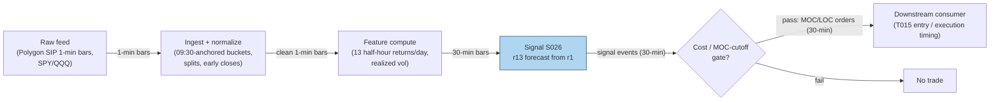

## Stage 26/200 — S026: First half-hour → last half-hour momentum

*Batch SB5 · Signal 26/100 · Provenance [D] · Family B — Intraday Momentum & Breakout*

### S1. One-line verdict

| | |
|---|---|
| **What it is** | The market's first-30-minute return positively predicts its last-30-minute return — a documented intraday time-series momentum. |
| **When it works** | High-volatility, high-volume, and macro-news days, on liquid index ETFs. |
| **When it dies** | Quiet midday-type days, single illiquid names, and after realistic transaction-cost and auction-cutoff modeling. |
| **Build-or-buy in one line** | Build: one regression on 1-minute bars; buy nothing beyond a clean ETF bar feed. |

### S2. How it works — plain human explanation

Divide the trading day into thirteen 30-minute **buckets**: bucket 1 is 09:30–10:00 (including the overnight move from the prior close), bucket 13 is 15:30–16:00. **Time-series momentum** means the market's own past return predicts its own future return (as opposed to **cross-sectional** momentum, where *stocks'* relative returns predict each other). S026 is time-series: if the S&P 500 ETF (SPY) rallies in the first half hour, it tends — statistically — to drift further up in the last half hour.

A concrete vignette: 15:28, SPY bid 512.40 / ask 512.41. The day opened strong on a CPI print: bucket 1 returned +0.45%. The tape has chopped sideways since, but the morning's buyers never got flushed. The rule says: buy SPY now, hold into the close, flatten at 16:00 — the last-half-hour drift should rhyme with the morning's direction. You exit into the **MOC** (market-on-close) auction, not after the closing print, because as a price-taker you cannot trade at a print that has already happened.

Why should this exist? Two documented economic stories (Gao, Han, Li & Zhou, 2018). First, **daytrader unwinding with the disposition effect**: on good-news mornings, liquidity-providing daytraders go short early; reluctant to realize losses, they cover late — their buying lands in the last half hour. Second, **strategic informed trading** (Admati & Pfleiderer, 1988): informed traders concentrate in high-volume periods — the open and the close — so morning information keeps being impounded late in the day. Both stories predict the effect concentrates on high-volume, high-volatility, news-heavy days — which is what the paper finds.

**Mandatory framing.** The closely related Heston–Korajczyk–Sadka (2010) result is *different*: it documents **cross-sectional** half-hour **periodicity** — stocks that outperform in a given half-hour bucket tend to outperform in the *same bucket on subsequent days*, at exact multiples of a trading day, persisting ≥40 trading days. It is *not* a "first-30-minutes predicts last-30-minutes" rule. The two effects share the U-shaped intraday volume clock as a mechanism, but they are different signals with different implementations.

- **Mental model:** the morning sets the day's informational tone; the close is when the slow money finishes reacting to it.
- **Mental model:** this is a *timing* feature (when to be exposed into the close), not a standalone fortune — its authors frame the value partly as execution-cost reduction.
- **Mental model:** predictability concentrates where volume concentrates — the signal is weakest exactly when it is cheapest to trade.

### S3. The math — exact formula

Half-hour returns (p_{0,t} = prior day's 16:00 price, so bucket 1 includes the overnight return):

$$r_{j,t} = \frac{p_{j,t}}{p_{j-1,t}} - 1, \qquad j = 1, \dots, 13$$

Predictive regression (Gao et al., 2018):

$$r_{13,t} = \alpha + \beta \, r_{1,t} + \varepsilon_t$$

with the documented extension adding the twelfth (second-to-last) bucket:

$$r_{13,t} = \alpha + \beta_1 r_{1,t} + \beta_2 r_{12,t} + \varepsilon_t$$

Trading form: at ~15:30 compute the forecast r̂_{13,t} (or simply sign(r_{1,t})); take the position for the final 30 minutes; flatten at the close. HKS (cross-sectional) form, for contrast: sort stocks into deciles on bucket-h return at day t−k and hold through bucket h at day t, for k = 1…40+ days. **Causal timing:** the signal uses data ≤ 15:30 on day t (r_{1,t} is known by 10:00); the earliest fill is 15:30+; the exit must respect MOC/LOC (limit-on-close) auction cutoffs — you cannot exit "at the close" as a price-taker after 16:00.

| Parameter | Symbol | Typical range | Too small | Too large | Default (example) |
|---|---|---|---|---|---|
| Bucket width | — | 15–60 min | microstructure noise dominates | washes out the close effect | 30 min, *example — not an institutional standard* |
| Formation | r_1 window | 1 bucket | misses overnight digestion | overlaps the holding period | bucket 1 incl. overnight, *example* |
| Entry time | — | 15:00–15:30 | pays for dead midday chop | misses the drift | ~15:30, *example* |
| Exit | — | MOC auction / 15:59 | leaves the drift on the table | after-print fills (lookahead) | flatten by 16:00 via MOC/LOC, *example* |
| Vol conditioning | σ̂(r_1) | on/off | trades quiet days with no edge | halves the sample | scale by first-half-hour realized vol, *example* |

**Named variants.** (1) **Sign-only timing**: position = sign(r_{1,t}) — no regression estimation. (2) **Recursive regression forecast**: re-estimate (α, β) on an expanding window each day. (3) **HKS cross-sectional quintile**: rank stocks on prior same-bucket returns; long top / short bottom quintile through the bucket — the periodicity trade, not the morning-to-close trade.

### S4. Worked example — step-by-step numbers (SYNTHETIC)

Synthetic 13-bucket × 60-day panel, seed 26 (`np.random.default_rng(26)`). Design: same-bucket day-to-day AR(1) (first-order autoregressive) persistence φ = 0.35 for buckets 1 and 13, 0.05 elsewhere; U-shaped bucket volatility. The table below is the last 12 days (returns in basis points, 1 bp = 0.01%).

| day | r₁ (first 30 min) | r₁₃ (last 30 min) |
|---|---|---|
| 49 | −12.11 | 126.76 |
| 50 | 55.90 | 35.61 |
| 51 | −72.58 | 50.50 |
| 52 | −46.58 | 182.64 |
| 53 | 1.47 | 103.80 |
| 54 | 40.92 | 97.11 |
| 55 | 18.83 | 130.42 |
| 56 | 21.89 | 69.72 |
| 57 | −9.51 | 6.46 |
| 58 | 40.84 | 47.54 |
| 59 | 9.24 | 29.89 |
| 60 | −15.82 | −81.93 |

Step 1 — means: r̄₁ = 2.71 bps, r̄₁₃ = 66.54 bps. Step 2 — sums: Σ(r₁−r̄₁)² = 15225.4, Σ(r₁−r̄₁)(r₁₃−r̄₁₃) = −2318.4. Step 3 — slope: β̂ = −2318.4/15225.4 = −0.1523, i.e. **β̂×100 = −15.23**; α̂ = 66.96 bps; R² = 0.68%; t-statistic = **−0.26** — statistically indistinguishable from zero.

That negative, insignificant toy estimate is the honest point: **with 12 days you measure noise**. Gao et al. needed SPY 1993–2013 (~5,200 days) to estimate β̂×100 = 6.94 at the 1% level. The heatmap's second panel tells the complementary story on the full 60-day window: same-bucket day-to-day autocorrelations are 0.259 (bucket 1) and 0.271 (bucket 13) against a design truth of 0.35 (standard error ≈ 0.13) — persistence is *visible* once the sample is long enough, invisible in a two-week toy.

**What to notice.** The synthetic design bakes in exactly the HKS-style claim (morning/close buckets persist day-to-day; midday doesn't) and the chart recovers it — but only with 60 days. **Limits:** the AR(1) design *assumes* the effect; nothing here estimates real predictability. No costs, no auction cutoffs, no bid-ask bounce (which mechanically creates short-horizon reversal — HKS's own caveat). This is a mechanics illustration, not evidence.

### S5. Strategies that use this signal

- **T015 — First-Half-Hour → Close Continuation** — *primary entry trigger (direction and timing)*: S026 is the core signal — morning winners held into the last-half-hour drift; S027 (end-of-day momentum) confirms the close leg; S046 (session seasonality) deseasonalizes the entry.
- **T006 — Intraday Trend + Vol-Regime Allocator** — *conceptual-fit reference (not a plan-defined consumer of S026)*: the strategy rides intraday time-series momentum into the close; S026's first-half-hour conditioning decides *whether* to hold the afternoon position, scaled by the HMM (hidden Markov model — a regime-switching model) vol regime (S079).

### S6. Data required — exact spec

| Field | Type | Granularity | Source tier | Notes |
|---|---|---|---|---|
| 1-min OHLCV | float/int | 1-min, RTH (regular trading hours) | Tier 1 | aggregate to 30-min buckets yourself |
| Daily OHLC (adjusted) | float | daily | Tier 0–1 | splits/dividends; bucket 1 spans the close |
| Session calendar | dates | daily | Tier 0 | early closes change bucket boundaries |
| MOC imbalance (optional) | messages | per day | Tier 2 | for exit execution, not the signal |

Collection: Polygon Stocks Advanced 1-min SIP (Securities Information Processor — the consolidated feed) bars for SPY/QQQ/IWM; Alpaca free tier suffices for the ETF-only variant. Ingest sketch (≤20 lines):

```python
import polars as pl
bars = pl.read_parquet("bars_1m/SPY.parquet").sort("ts")     # exchange ts, RTH
b = bars.with_columns(((pl.col("ts").dt.hour() * 60 +
    pl.col("ts").dt.minute() - 570) // 30 + 1).alias("bucket"))  # 9:30->1 ... 15:30->13
hh = b.group_by([pl.col("ts").dt.date().alias("day"), "bucket"]).agg([
    pl.col("open").first().alias("o"), pl.col("close").last().alias("c")])
r = hh.sort(["day", "bucket"]).with_columns(
    (pl.col("c") / pl.col("c").shift(1) - 1).alias("r"))  # lag over full frame: bucket-1 row follows prior day's close, so r1 includes the overnight move
sig = r.filter(pl.col("bucket") == 1).select(["day", pl.col("r").alias("r1")])
```

Storage: 1-min bars for a handful of ETFs are megabytes per year — trivial (per `notes/cost-model.md` §4). **Data-quality checklist:** buckets anchored to 09:30 ET (DST-safe); early-close days re-bucketed or excluded; adjusted closes so splits don't fabricate bucket-1 "gaps"; auction prints flagged separately; one timezone end-to-end.

### S7. Local build on M5 Max / 128GB

**Feasibility: trivial.** Thirteen bucket returns per day and one OLS (ordinary least squares) regression — the entire 20-year SPY history is ~5,200 × 13 numbers; the regression is microseconds in numpy. Per `notes/cost-model.md` §2, even a 500-symbol 1-minute universe (195k bars/day) is trivial for polars batch ops (~10–50M rows/sec). S026 alone is Tier L; the Q-SB5-2 chatbot lead prices the *full session-pattern engine* at 185–385 h prototype / 705–1,530 h research-grade.

| Stack | When to pick |
|---|---|
| Python + polars/numpy | Default: bucketing + regression is a one-liner |
| DuckDB | Cross-sectional HKS extension over thousands of names × 40 days |
| Rust | Unneeded at this granularity |

RAM: the full research dataset (decades of ETF 1-min bars) is < 1 GB — negligible against the 77 GB working budget (cost-model §3). Engineering: **Tier L, 4–12 h → $600–1,800** at $150/hr loaded-cost estimate (cost-model §5) for the signal, replay, and cost accounting; the HKS cross-sectional extension (thousands of names, decile sorts, 40-day lags) stays Tier L/M in polars. **Bottleneck:** transaction-cost and auction-cutoff realism, not compute. **Breaks at:** nothing on this machine — the constraint is statistical (you need decades of data for a 1.6% R²), not computational.

### S8. Buy vs build

| Option | What you get | Indicative price | Gains | Loses |
|---|---|---|---|---|
| Tier 0: Alpaca IEX / Stooq | Free daily + 1-min ETF bars | ~$0 | enough for the Gao et al. replication | IEX-only prints; no auction detail |
| Tier 1: Polygon Stocks Advanced | SIP 1-min, 20+ yrs, splits | ~$30–200/mo | full sample in one pull | SIP timestamps only |
| Tier 2: Databento Standard | L1 (top-of-book quotes) + OHLCV, replay | ~$200/mo + usage | honest open/close auction data | overkill for a 13-bucket signal |
| Academic: TAQ (Trade and Quote — the consolidated equity tick database) via WRDS (Wharton Research Data Services) | Publication-grade intraday | institutional/academic terms | the literature-standard source | access friction |

All prices *indicative — verify before budgeting*. **Verdict: build.** Data Tier ≤ 1, eng Tier L, and the "parameters" are a regression you must estimate yourself — there is nothing to buy except the bars. Buy TAQ-grade history only for the HKS cross-sectional extension.

### S9. Success ratio / efficacy — documented evidence

| Study / source | Market & period | Metric | Before/after cost | Caveat |
|---|---|---|---|---|
| Gao, Han, Li & Zhou (2018), "Intraday Momentum", *Rev. Financ. Stud.* 31(1) | SPY, TAQ (Trade and Quote database), 1993–2013 | r₁₃ on r₁: β̂×100 = 6.94, p < 1%, R² = 1.6% (in-sample) / 1.2% (out-of-sample, OOS); with r₁₂: 2.6% / 1.8%. Timing strategy (sign of r₁): 6.67%/yr, Sharpe **1.08** vs 0.29 buy-and-hold | Before-cost; authors state gains survive "reasonable transaction costs" | Single most-liquid ETF; sample spans pre-decimalization years; SPY-only |
| Heston, Korajczyk & Sadka (2010), *J. Finance* 65(4) | US stocks, post-decimalization intraday | Cross-sectional same-bucket continuation at exact daily multiples, ≥40 trading days; short-horizon reversal from liquidity imbalance + bid-ask bounce | Before-cost (draft: 3.11 bp top-minus-bottom decile, same bucket next day) | **Not** a first→last-30-min rule; authors' economic claim is execution-timing: "timing trades can reduce execution costs by the equivalent of the effective spread" |
| Haendler, Heston, Korajczyk & Sadka (2025), SSRN working paper | US stocks, OOS of 2010 sample | Periodicity persists OOS; open ≈ VWAP (volume-weighted average price)-like trading, close ≈ MOC activity; institutional proxies explain all open + midday periodicity, up to 30% of close | Mechanism decomposition, not a return claim | Working paper (2025); explains *why*, doesn't add tradable alpha |
| Li et al. (2020), *Finance Research Letters* 35 (OOS lead) | Chinese index futures | First-session return predicts last-session return; stronger at 60-min buckets, on high volume/vol/attention days | Before-cost | Futures, different market structure; confirms the time-series pattern travels |

**Regimes where it fails:** low-volatility, low-volume days (Gao et al. show predictability concentrates in high-vol/volume, recession, and macro-news days); single illiquid names (the result is a *market*/liquid-ETF phenomenon); crowded MOC windows where the predictable flow is arbed by execution algos. **Documented decay:** the published sample ends 2013; the 2025 follow-up confirms the *periodicity* persists OOS but attributes it increasingly to institutional execution patterns (VWAP/MOC) — i.e., the mechanism is now the plumbing, and plumbing gets optimized. **Bottom line:** documented statistical predictability (R² ≈ 1–2%) on the most liquid ETF over 20 years; as a *standalone after-cost retail rule* — weak; as an *execution-timing / rebalance feature* — moderate, which is how its discoverers frame it.

### S10. Failure modes & pitfalls

1. **Confusing HKS with a first→last-30min rule.** HKS is cross-sectional periodicity across *days*; Gao et al. is time-series morning→close. Trading one with the other's implementation is a category error. Mitigate: implement each paper's specification separately.
2. **MOC auction cutoff lookahead.** Backtests that "exit at the close" assume the 16:00 print; live, MOC/LOC orders face cutoffs (typically ~15:50–15:58) and imbalance risk. Mitigate: model the cutoff; assume exit at the 15:55 mid or via LOC with non-fill risk.
3. **Transaction-cost decay.** A 1.6% R² on 30-minute returns is a few basis points of edge per day — one extra spread-crossing error kills it. Mitigate: full cost model (spread + fees + impact); the decisive test is point-in-time replay with realistic fills, not close-to-close backtests.
4. **Single-name extrapolation.** Gao et al. is SPY; HKS is a broad cross-section. A mid-cap's bucket-1 return is mostly bid-ask bounce. Mitigate: restrict to liquid ETFs; deseasonalize by bucket volatility.
5. **Bucket misalignment.** Using 16:00 prints in r₁₃ while the signal fires at 15:30, or mixing timezones. Mitigate: fixed 09:30-anchored buckets; the tradable r₁₃ estimate uses data ≤ 15:30 only.
6. **Overfitting bucket width and entry time.** Mining 15/30/60-min × 15:00/15:15/15:30 grids. Mitigate: fix 30-min buckets for the literature reason; one untouched OOS decade.
7. **Regime dependence.** Predictability lives in high-vol/news days; a rule traded every day dilutes the edge with noise days. Mitigate: condition on first-half-hour realized vol (the paper's own interaction).
8. **Survivorship and adjustments.** ETF splits/dividends fabricate bucket returns. Mitigate: adjusted prices, point-in-time corporate actions.

### S11. Visuals




### S12. Sources

- Gao, L., Han, Y., Li, S. Z. & Zhou, G. (2018). "Intraday Momentum: The First Half-Hour Return Predicts the Last Half-Hour Return." *Review of Financial Studies* 31(1). SSRN 2552752. https://ssrn.com/abstract=2552752 — SPY TAQ 1993–2013; β̂×100 = 6.94 (p < 1%), R² = 1.6% IS / 1.2% OOS; timing Sharpe 1.08 vs 0.29.
- Heston, S. L., Korajczyk, R. A. & Sadka, R. (2010). "Intraday Patterns in the Cross-Section of Stock Returns." *Journal of Finance* 65(4), 1369–1407. https://bauer.uh.edu/departments/finance/documents/Heston-Korajczyk-Sadka-jf-2010-01-07.pdf — cross-sectional half-hour periodicity at exact daily multiples, ≥40 trading days; execution-timing value ≈ effective spread. (Circulated draft with the 3.11 bp decile figure: https://conference.nber.org/confer/2008/mms08/korajczyk.pdf)
- Haendler, C., Heston, S., Korajczyk, R. & Sadka, R. (2025). "The intra-day stock return periodicity puzzle." SSRN working paper. https://www.kellogg.northwestern.edu/academics-research/research/detail/2025/the-intra-day-stock-return-periodicity-puzzle/ — OOS persistence; open ≈ VWAP trading, close ≈ MOC; proxies explain all open/midday and up to 30% of close periodicity.
- Li, Y., Shen, D., Wang, P. & Zhang, W. (2020). "Does intraday time-series momentum exist in Chinese stock index futures market?" *Finance Research Letters* 35. https://ideas.repec.org/a/eee/finlet/v35y2020ics1544612319304337.html — independent OOS confirmation on futures.

**Unverified leads**
- Duck.ai (GPT-5.6 Luna) answered Q-SB5-1–Q-SB5-3 (2026-09-10); Grok/Cursor answers pending (checked 2026-09-10). Q-SB5-3's HKS summary figures ("≥40 trading days", "up to 30%") were verified above against the paper abstract and the Kellogg research page before quoting; remaining qualitative chatbot assessments are research leads, not confirmed facts.
