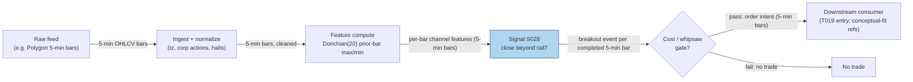

## Stage 28/200 — S028: Donchian breakout

*Batch SB5 · Signal 28/100 · Provenance [D] · Family B — Intraday Momentum & Breakout*

### S1. One-line verdict

| | |
|---|---|
| **What it is** | Buy/sell signal when price *closes* beyond the highest high or lowest low of the prior N bars. |
| **When it works** | Persistent intraday trends: genuine range expansion with follow-through, rising volume, supportive higher-timeframe trend. |
| **When it dies** | Range-bound chop: repeated false breakouts bleed the account through spread, fees, and slippage. |
| **Build-or-buy in one line** | Build — a rolling max/min over cheap 1-minute bars; nothing to buy. |

Provenance **[D]** (documented: Richard Donchian, 1960s; Turtle rules via Curtis Faith) · Family **B — Intraday Momentum & Breakout**.

### S2. How it works — plain human explanation

Picture 10:15 on a normal Tuesday. A liquid large-cap has spent the morning shuffling between 99.80 and 101.20. The highest *high* of the last twenty 5-minute bars is 101.20, printed at 09:30. The lowest *low* is 99.80. Those two numbers are the **Donchian channel** — the Donchian channel is simply the range bracketed by the N-bar maximum high and the N-bar minimum low; the channel's upper rail is the highest high, its lower rail the lowest low, and its midline is the average of the two. At 10:15 a 5-minute bar closes at 102.00, above the upper rail. That is a **Donchian breakout**: the market just traded somewhere it has not traded in the last N bars.

Why should that predict anything? Three overlapping mechanisms. First, *stop-loss cascades*: resting stop orders cluster just beyond visible highs and lows, so a push through them mechanically becomes buy or sell flow. Second, *participation*: many systematic desks are programmed to add to positions only on confirmed expansion, so the breakout recruits its own follow-through. Third, *information*: a genuine new high often means informed flow (earnings leak, sector move, large buyer) is still working. The dark twin of each mechanism is the **whipsaw** — a false breakout: price pokes through the rail on thin volume, no follow-through arrives, and the bar slumps back inside, trapping everyone who chased.

The economic intuition is therefore conditional, not magical: *range expansion sometimes marks the start of a persistent move and sometimes marks exhaustion*. The signal's job is to timestamp the expansion; the strategy's job (see S5) is to filter the two cases.

**Mental model:**
- The channel is a *memory* of where price has recently been allowed to trade; a close outside it is a *regime-change candidate*.
- Breakouts are *convexity* bets: small frequent losses (failed breaks) paid for occasional large wins (real trends) — the payoff only works if costs and sizing are controlled.
- The midline is free information: it doubles as a natural trailing reference for exits.

### S3. The math — exact formula

Let $H_t, L_t, C_t$ be the high, low, close of bar $t$ (prices in dollars), and $N$ the lookback in bars. The channel is computed on **completed bars only** — the triggering bar $t$ is excluded, so it cannot reference itself:

$$D^U_t(N) = \max_{i \in [t-N,\, t-1]} H_i \qquad
  D^L_t(N) = \min_{i \in [t-N,\, t-1]} L_i \qquad
  M_t = \frac{D^U_t + D^L_t}{2}$$

Entry signals (example thresholds — not an institutional standard):

$$\text{long}_t = \mathbf{1}\{C_t > D^U_t\}, \qquad
  \text{short}_t = \mathbf{1}\{C_t < D^L_t\}$$

where $\mathbf{1}\{\cdot\}$ is the indicator function (1 if true, 0 if false). Causal timing: the signal is fully determined at the **close of bar $t$** and is tradable no earlier than the **open of bar $t+1$**. The one-bar shift is not optional — without it, the triggering bar would be compared against a channel that includes its own high, making a breakout arithmetically impossible (StockCharts' ChartSchool documents exactly this completed-bar convention).

| Parameter | Symbol | Typical range | Too small | Too large | Default (example) |
|---|---|---|---|---|---|
| Lookback | $N$ | 10–55 bars intraday | Constant whipsaws; channel hugs price | Rare signals; exits far from extremes | 20 *(example — not an institutional standard)* |
| Entry trigger | — | close-through vs high/low-through | Close-through is late but cleaner | High-through fires mid-bar (intrabar lookahead risk) | Close-through *(example)* |
| Exit | — | midline touch / opposite break / time stop | Exits inside noise | Gives back open profit | 10-bar time stop or midline *(example)* |

**Normalization choices.** The raw channel is in price units — fine intraday within one symbol, but not comparable across names. Cross-sectional use typically normalizes channel *position*, e.g. $\%\text{position} = (C_t - D^L_t)/(D^U_t - D^L_t)$, or scales the channel width by **ATR** (average true range — the mean of per-bar true ranges; defined in S029) for volatility comparability.

**Named variants.** (1) *Turtle System 1 / System 2* (Faith 2007): 20-day / 55-day Donchian entries with ATR-based unit sizing and pyramiding — the documented ancestor. (2) *Donchian width filter*: require channel width above its recent median before arming the breakout (a volatility-regime gate). (3) *Stop-entry vs close-entry*: place a stop just beyond the rail and let the market trigger it intrabar — earlier fill, worse adverse selection.

### S4. Worked example — step-by-step numbers (SYNTHETIC)

Synthetic 30-bar 5-minute tape, seed 28 (fixed `numpy.random.default_rng(28)`; bars 11–30 hand-specified, bars 1–10 a seeded ramp). All numbers below were hand-verified against the operator-checked worked example; **this tape is synthetic — not market data — and no performance is claimed from it.**

| Bar | Open | High | Low | Close | Volume |
|-----|------|------|-----|-------|--------|
| 22 | 100.00 | 100.80 | 99.80 | 100.20 | 780 |
| 23 | 100.00 | 100.80 | 99.80 | 100.20 | 770 |
| 24 | 100.00 | 100.80 | 99.80 | 100.20 | 760 |
| 25 | 100.00 | 100.80 | 99.80 | 100.20 | 750 |
| 26 | 100.00 | 100.80 | 99.80 | 100.20 | 740 |
| 27 | 100.00 | 100.80 | 99.80 | 100.20 | 730 |
| 28 | 100.00 | 100.80 | 99.80 | 100.20 | 720 |
| 29 | 100.00 | 100.80 | 99.80 | 100.20 | 710 |
| 30 | 100.20 | 102.50 | 100.00 | 102.00 | 2,500 |

(Bars 1–10 ramp 99.70 → 100.50 with bar-10 high 101.20; bars 11–29 flat as above with volume declining 850 → 670.)

**Step 1 — channel at bar 30 (completed-bar convention, prior 20 bars = bars 10–29):**
$D^U_{30} = \max H = 101.20$ (bar 10); $D^L_{30} = \min L = 99.80$; midline $M_{30} = (101.20 + 99.80)/2 = 100.50$.

**Step 2 — breakout test:** $C_{30} = 102.00 > 101.20$ → bullish close-breakout. The high (102.50) also exceeded the rail, but the signal is defined on the close.

**Step 3 — context:** bar-30 volume (2,500) is ~3.3× the bars 11–29 average (~760); bar range 2.50 vs the 1.00 compression range — expansion with participation, exactly the shape the signal is designed to catch.

**Step 4 — causal timing:** the signal is known only at bar 30's close; earliest fill is bar 31's open. Any "backtest" filling at 102.00 is fantasy — the realistic fill is the next bar's open plus spread and slippage (see S10).

**What to notice.** The midline (100.50) sits 1.47% below the breakout close — a natural trailing reference that a strategy can use for exits. The compression (bars 11–29) made the channel narrow, so the breakout needed only a modest move — which is also why choppy markets manufacture false breaks from the same geometry. This toy tape has no fees, no partial fills, and no latency: it demonstrates the *computation*, not profitability.

### S5. Strategies that use this signal

- **T019 — Donchian/Keltner Breakout + Vol Sizing** — primary entry trigger (direction); positions sized by the volatility-breakout regime (S076).
- **T003 — VPIN-Gated Breakout Trader** — *conceptual-fit reference (not a plan-defined consumer of S028)*: Donchian breaks are taken only when order-flow toxicity (VPIN — volume-synchronized probability of informed trading) is low; toxicity spikes veto the trade.

### S6. Data required — exact spec

| Field | Type | Granularity | Source tier | Notes |
|---|---|---|---|---|
| OHLCV (open/high/low/close/volume) bars | float/int | 1–15 min bars (example: 5-min) | Tier 1 | Consolidated or single-venue; venue choice documented |
| Corporate actions | events | as-occurring | Tier 1 | Splits/dividends must adjust the channel or it breaks on ex-dates |
| Session calendar | reference | daily | Tier 0/1 | Half-days, halts, DST — channel spans must skip non-trading gaps |

Ingest + feature sketch (Python/polars, ≤20 lines; the `.shift(1)` is the completed-bar convention):

```python
import polars as pl
bars = pl.read_parquet("bars_5m/*.parquet").sort(["symbol", "ts"])  # [ts,symbol,o,h,l,c,v]
N = 20  # example — not an institutional standard
feat = bars.with_columns([
    pl.col("high").rolling_max(N, min_periods=N).shift(1).over("symbol").alias("donchian_up"),
    pl.col("low").rolling_min(N, min_periods=N).shift(1).over("symbol").alias("donchian_lo"),
])
sig = feat.with_columns([
    (pl.col("donchian_up") + pl.col("donchian_lo")).truediv(2).alias("donchian_mid"),
    (pl.col("close") > pl.col("donchian_up")).alias("long_break"),
    (pl.col("close") < pl.col("donchian_lo")).alias("short_break"),
])
```

**Storage:** 1-min bars run ~0.1 MB per symbol-day in Parquet (500 symbols ≈ 50 MB/day per `notes/cost-model.md` §4); 5-minute bars are ~5× lighter; 60 days × 500 symbols ≈ 3 GB — archive freely. **Data-quality checklist:** timezone/DST normalization; corporate-action adjustment before any rolling max; halt/limit-move bars flagged; late/corrected prints versioned; venue vs consolidated timestamps recorded.

### S7. Local build on M5 Max / 128GB

**Feasibility: trivial.** A Donchian channel is a rolling max/min — O(1) amortized per bar with deques, or a vectorized `rolling_max` at ~10–50M rows/sec in polars (`notes/cost-model.md` §2). A 500-symbol universe produces 500 × 390 = 195k 1-min bars/day; recomputing the whole day's features takes milliseconds. RAM: 500 symbols × 60 days of 1-min bars ≈ 12 MB (`notes/cost-model.md` §3) — three orders of magnitude under the ~77 GB working budget. As the batch's chatbot build review put it: the M5 Max will not be the constraint; data rights, exchange timestamps, and point-in-time correctness will be (labeled chatbot lead — see S12).

| Stack | When to pick it |
|---|---|
| Python + polars | Default: more than fast enough for bar-level channels, best iteration speed |
| Rust | Only if you drop to L1 (top-of-book quotes) tick events across hundreds of symbols (Python loop tops out ~100–500k events/sec per cost-model §2) |
| DuckDB | Ad-hoc research queries over the Parquet archive |

**Engineering band:** Tier L per `notes/cost-model.md` §5 (1-min bar signals) — **4–12 h ≈ $600–1,800** at $150/hr loaded cost. **What breaks first at 500 symbols or full OPRA:** nothing at bar granularity — but a tick-level Donchian (breakout on trade prints) would need Rust and per-symbol state, and full OPRA (Options Price Reporting Authority) is a different project entirely (Tier H).

### S8. Buy vs build

| Option | What you get | Indicative price | Buying gains | Buying loses |
|---|---|---|---|---|
| Tier 0: Stooq / Alpaca IEX / delayed exchange quotes | Daily bars, delayed quotes | ~$0 | Free history for prototyping | No real-time intraday; coarse timestamps |
| Tier 1: Polygon Stocks Advanced / Alpaca SIP (Securities Information Processor consolidated feed) | Real-time 1-min SIP bars, corporate actions | ~$30–200/mo | Clean normalized bars; 7+ yrs history | SIP latency; no venue detail |
| Tier 2: Databento Standard | L1/L2 (Level 1/2 market data; MBP-1/10 = market-by-price), imbalance feeds | ~$200/mo + usage | Honest timestamps; venue granularity | Overkill for bar-level channels |
| Academic: LOBSTER / TAQ (Trade and Quote — the consolidated equity tick database) | MBO (market-by-order)/ITCH (Nasdaq's direct-feed order message protocol) replay, full tick history | ~hundreds/yr academic; institutional $$$$ | True microstructure research | Cost and complexity far beyond the signal's needs |

All prices *indicative — verify before budgeting*. **Verdict: build.** The analytics are three lines; buy only the cheapest normalized bar feed that meets your latency needs (hybrid: buy bars, build channels). The crossover to buying more is venue-specific or sub-bar research — i.e., a different signal, not a better Donchian.

### S9. Success ratio / efficacy — documented evidence

| Study / source | Market & period | Metric | Before/after cost | Caveat |
|---|---|---|---|---|
| Curtis Faith (2007), *Way of the Turtle* — System 1 (20-day) / System 2 (55-day) Donchian entries, ATR unit sizing | Futures, 1983–88 cohort | Cohort track record described in the book; rules fully documented | Before-cost (gross practitioner account) | Daily futures trend-following, not intraday equities; 1980s regime; no portable Sharpe ratio (return per unit of volatility) |
| Rayome, D. L. & Jain, A. (2008), "Do Turtles Have Fat Tails?", *J. of the Academy of Finance* | Soybeans; Donchian 20-day & 55-day systems | Academic examination of Turtle-style Donchian channels | Before-cost | Single-commodity study; tests the construction, not an intraday strategy |

**Regimes where it fails:** range-bound chop (the documented principal failure mode — repeated false breakouts); low-liquidity names where the channel is gamed by wide spreads; crowded breakout levels at round numbers; news-driven spikes that reverse within the bar.

**Honest bottom line:** as a *standalone intraday trigger* this is a weak, unproven edge — "reasonable hypothesis, not documented universal intraday alpha; the edge, if any, is in regime selection and execution, not the channel formula." As a *regime-conditioned trigger* (trend filter + cost gate, e.g. T019) it is plausible; as a *filter* (e.g. vetoing mean-reversion entries when a fresh breakout just fired) it is arguably more valuable than as a trigger.

### S10. Failure modes & pitfalls

- **Lookahead via forming-bar inclusion.** Computing the channel (or any co-feature like ATR/Bollinger) on windows that *include* the triggering bar, while Donchian excludes it, mixes conventions at the same timestamp — backtest fills then assume knowledge only available at the bar's close. *Mitigation:* pick ONE convention — completed-bar (features through $t-1$, signal on bar $t$, fill at $t+1$) or forming-bar estimate (explicitly simulated, fill at $t+1$ open) — and state its fill-timing cost: including the forming bar costs you roughly one full bar of slippage versus the fantasy fill.
- **Whipsaw bleed.** Chop manufactures breakouts that reverse within 1–3 bars. *Mitigation:* volatility-regime gate (trade only when channel width or ADX — average directional index, a 0–100 trend-strength gauge — confirms a trending regime) and a per-day loss stop.
- **Cost blowup.** A 20-bar intraday channel can fire several times a day; each round-trip pays spread + fees + impact. *Mitigation:* model costs per trade explicitly (S3's timing), require expected move > 2–3× round-trip cost before arming.
- **Regime breaks.** Breakouts that worked in a trending tape fail when the market transitions to range-bound. *Mitigation:* higher-timeframe trend-slope filter; stand down after N consecutive failed breaks.
- **Parameter mining.** N=20 vs 21 vs 55 will always have a "best" N in-sample. *Mitigation:* fix N from first principles (session fraction), validate out-of-sample with purged/embargoed splits (validation splits with near-in-time train/test overlap removed to prevent leakage).
- **Data errors.** A bad tick prints a false N-bar high; an unadjusted split collapses the channel. *Mitigation:* bad-tick filters, corporate-action-adjusted series, halt flags.
- **Microstructure noise vs signal.** On thin names the "breakout" is just the spread widening. *Mitigation:* minimum ADV (average daily volume)/liquidity screen; use mid-price or microprice confirmation before arming.

### S11. Visuals




### S12. Sources

1. StockCharts ChartSchool — "Price Channels" (Donchian channels): formula, and the completed-bar convention ("the formula doesn't include the most recent period"). https://chartschool.stockcharts.com/table-of-contents/technical-indicators-and-overlays/technical-overlays/price-channels (accessed 2026-09-10).
2. Rayome, D. L. & Jain, A. (2008) — "Do Turtles Have Fat Tails? Donchian Channels and Turtle Trading: The Case of Soybeans," *Journal of the Academy of Finance*, Summer 2008. http://carrels.distantreader.org/journal-journalOfFinanceIssues-ojsoai/cache/jfi-2421.pdf
3. Faith, Curtis M. (2007) — *Way of the Turtle: The Secret Methods that Turned Ordinary People into Legendary Traders*, McGraw-Hill. Documents the Turtle 20-day/55-day Donchian systems and ATR-based sizing.
4. Brock, W., Lakonishok, J. & LeBaron, B. (1992) — "Simple technical trading rules and the stochastic properties of stock returns," *Journal of Finance* 47(5), 1731–1764. https://repository.hkust.edu.hk/ir/bitstream/1783.1-362/1/tech.pdf — Moving-average/breakout rules (including channel breakouts) show forecast power for the DJIA 1897–1986; the benchmark academic test of breakout-style rules.
5. Sullivan, R., Timmermann, A. & White, H. (1999) — "Data-snooping, technical trading rule performance, and the bootstrap," *Journal of Finance* 54(5), 1647–1691. https://econpapers.repec.org/article/blajfinan/v_3a54_3ay_3a1999_3ai_3a5_3ap_3a1647-1691.htm — White's Reality Check over 7,846 rules including channel breakouts: the best rule's profits do not survive data-snooping adjustment out-of-sample — the caution behind the S10 overfitting warnings.
6. Fama, E. F. & Blume, M. E. (1966) — "Filter rules and stock-market trading," *Journal of Business* 39(1), 226–241. https://doi.org/10.1086/294849 — Early evidence that mechanical trading rules (filters, close cousins of breakouts) do not beat buy-and-hold after costs.

**Unverified leads** (chatbot-provided, not independently checkable — do not treat as evidence):
- duck.ai answers Q-SB5-1–Q-SB5-3 (GPT-5.6 Luna, 2026-09-10): the 30-bar worked-example numbers (operator hand-checked, no arithmetic errors); engineering-hour columns for a session-pattern platform (prototype 185–385 h, research-grade 705–1,530 h — column totals verified); evidence framing for intraday Donchian ("reasonable hypothesis, not documented universal intraday alpha").
- A chatbot-cited SSRN study of daily Donchian/ATR on BTC (URL not captured — unverified): reported as positive but highly cost/parameter/regime-sensitive; not evidence of durable intraday US-equity edge.
- A chatbot-cited practitioner article (altrady.com, URL not captured — unverified) identifying range-bound chop as the principal Donchian failure mode.
