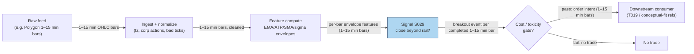

## Stage 29/200 — S029: Keltner / Bollinger breakouts

*Batch SB5 · Signal 29/100 · Provenance [D] · Family B — Intraday Momentum & Breakout*

### S1. One-line verdict

| | |
|---|---|
| **What it is** | Breakout signal when price *closes* outside a volatility envelope: Keltner = EMA (exponential moving average) ± k·ATR (average true range); Bollinger = SMA (simple moving average) ± k·σ (standard deviation of closes). |
| **When it works** | Genuine volatility expansions with directional follow-through; envelopes adapt to the local regime instead of using fixed price levels. |
| **When it dies** | Mean-reverting tapes where band tags get faded; fast markets where the lagging envelope is still catching up. |
| **Build-or-buy in one line** | Build — EMA/ATR/SMA/std on cheap 1–15-minute bars; the only real choice is *which* envelope definition you standardize on. (EMA = exponential moving average; ATR = average true range; SMA = simple moving average; std = standard deviation.) |

Provenance **[D]** (documented: Keltner 1960; Raschke 1980s rework; Bollinger 1980s; Wilder 1978 ATR) · Family **B — Intraday Momentum & Breakout**.

### S2. How it works — plain human explanation

Take the same 10:15 tape as S028. Two different envelopes are drawn around price. The **Keltner channel** (named for Chester Keltner, 1960; modern form popularized by Linda Raschke in the 1980s) centers on an **EMA** — an exponential moving average, which weights recent bars more heavily than old ones — and sets its rails at a multiple of **ATR**, the average true range (the mean per-bar price range including overnight gaps, defined below). The **Bollinger bands** (John Bollinger, 1980s) center on a simple moving average (**SMA** — the plain arithmetic mean) and set their rails at a multiple of **σ** (sigma), the standard deviation of closes — a statistical measure of how spread out recent closes are.

At bar 30, price closes at 102.00. The Keltner upper rail sits at 102.44: *no* close-breakout — only the bar's high (102.50) poked through. The Bollinger upper rail sits at 101.0746: *yes*, a close-breakout. Same bar, same market, two different answers — because Keltner measures volatility with range (ATR) while Bollinger measures it with dispersion of closes (σ), and the two disagree exactly when a single wide bar dominates the window.

The economic idea: a close beyond $k$ standard deviations (or $k$ ATRs) is a tail event under the *local* volatility model — either real information is arriving (trade the expansion, i.e. momentum) or the market just overreacted (fade the tag, i.e. mean reversion; see S041/T014). The envelope itself is direction-agnostic; the *trading rule* layered on top chooses the side. Which is precisely why the worked example's disagreement matters: the "signal" is as much a function of your envelope definition as of the market.

**Mental model:**
- Envelopes are *adaptive rulers*: they rescale the definition of "extreme" to current volatility, unlike fixed-price channels.
- Keltner (range-based) and Bollinger (dispersion-based) are *two different volatility lenses* — they will disagree on wide-range single bars; that disagreement is information about the bar's character.
- A band break is a *volatility event with a sign attached by your rule*, not a verdict from the market.

### S3. The math — exact formula

Let $H_t, L_t, C_t$ be bar $t$'s high, low, close. The **true range** of a bar (Wilder 1978) captures gaps as well as intrabar range:

$$TR_t = \max\big(H_t - L_t,\; |H_t - C_{t-1}|,\; |L_t - C_{t-1}|\big)$$

**ATR** (average true range) smooths it. Two conventions exist and must not be mixed silently: the simple average $ATR_t(N) = \frac{1}{N}\sum_{i} TR_i$ (used in this chapter's worked example), and Wilder's smoothed $ATR_t = \frac{(N-1)\,ATR_{t-1} + TR_t}{N}$.

**Keltner channel** (modern Raschke/StockCharts form; $E_t$ = EMA with $\alpha = 2/(N+1)$, $E_t = \alpha C_t + (1-\alpha)E_{t-1}$):

$$K^{U/L}_t = E_t(N) \;\pm\; m \cdot ATR_t(A)$$

**Bollinger bands** ($\mu_t$ = SMA of closes, $\sigma_t$ = population standard deviation, $k$ = width multiplier):

$$B^{U/L}_t = \mu_t(N) \;\pm\; k \cdot \sigma_t(N)$$

Breakout rule (example — not an institutional standard): long when $C_t > \text{upper}_t$; short when $C_t < \text{lower}_t$; exit on reversion to the midline or a time stop. Causal timing: computed at bar $t$'s close from data $\le t$; tradable no earlier than bar $t+1$'s open.

| Parameter | Symbol | Typical range | Too small | Too large | Default (example) |
|---|---|---|---|---|---|
| Envelope lookback | $N$ | 10–30 bars | Bands hug price; constant tags | Dead-lagging; signals arrive exhausted | 20 *(example — not an institutional standard)* |
| ATR window | $A$ | 10–30 (often = $N$) | Jittery rails | Rails ignore fresh volatility | 20 *(example)* |
| Multiplier | $m$ / $k$ | 1.5–2.5 | Tags on noise | Almost never triggers | 2 *(example)* |

**Normalization choices.** Both envelopes are self-normalizing (volatility-scaled), which is their advantage over fixed channels. For cross-sectional ranking, practitioners often convert the break into a z-like score, e.g. $(C_t - E_t)/ATR_t$ — a volatility-normalized distance from the midline.

**Named variants.** (1) *Original Keltner (1960)*: SMA of **typical price** $(H+L+C)/3$ ± SMA of the plain daily range — no ATR, no EMA, no multiplier. Materially different from the modern form (a measured comparison found ~2.6% median relative difference in the upper band — choosing a variant is choosing a different indicator). (2) *Raschke/StockCharts modern*: EMA ± $m$·ATR, the version used here and in most platforms. (3) *Bollinger %B and bandwidth*: $(C - B^L)/(B^U - B^L)$ locates price inside the bands; bandwidth (see S030) measures their width — both are derived signals, not breakouts.

### S4. Worked example — step-by-step numbers (SYNTHETIC)

Same synthetic 30-bar 5-minute tape as S028, seed 29 (fixed `numpy.random.default_rng(29)`; bars 11–30 hand-specified: bars 11–29 flat at O=100.00/H=100.80/L=99.80/C=100.20, volume 850→670; bar 30: O=100.20/H=102.50/L=100.00/C=102.00, V=2,500). All numbers hand-verified against the operator-checked worked example; **synthetic — not market data — and no performance is claimed.**

**Step 1 — true ranges (bars 11–30).** Bars 11–29: $TR = \max(1.00,\, 0.60,\, 0.40) = 1.00$ each. Bar 30: $TR_{30} = \max(2.50,\, |102.50-100.20|=2.30,\, |100.00-100.20|=0.20) = 2.50$.

**Step 2 — ATR(20), simple average:** $ATR = (19 \times 1.00 + 2.50)/20 = 1.075$.

**Step 3 — Keltner midline:** EMA(20) seeded with the SMA of closes over bars 11–30: $(19 \times 100.20 + 102.00)/20 = 100.29$. (SMA-seeding is an example convenience — production code needs a proper warmup; see S10.)

**Step 4 — Keltner rails:** $100.29 \pm 2 \times 1.075$ → upper **102.44**, lower **98.14**. Verdict: $C_{30} = 102.00 < 102.44$ → **no Keltner close-breakout**; the high (102.50) pierced the rail, but the close did not — a high-through only.

**Step 5 — Bollinger:** $\mu = 100.29$ (same window); deviations $-0.09$ (×19) and $+1.71$; population variance $0.1539$; $\sigma = 0.3923$; bands $100.29 \pm 2(0.3923)$ → upper **101.0746**, lower **99.5054**. Verdict: $C_{30} = 102.00 > 101.0746$ → **Bollinger close-breakout**.

**What to notice.** One bar, two envelopes, opposite verdicts: the wide bar-30 range inflated ATR (range-based) far more than it inflated σ (dispersion-based, 19 of 20 closes identical). This is not a bug — it is the chapter's central lesson: *the breakout is defined by your volatility lens*. A strategy that "trades Bollinger breaks" and one that "trades Keltner breaks" will hold different positions off identical data. Also note the methodology: these windows *include* bar 30, unlike S028's completed-bar Donchian — the mixed-convention pitfall flagged in S10. This toy tape has no fees, no partial fills, no latency.

### S5. Strategies that use this signal

- **T019 — Donchian/Keltner Breakout + Vol Sizing** — primary entry trigger alongside S028; Keltner breaks add the volatility-scaled confirmation leg, sized by the vol-breakout regime (S076).
- **T003 — VPIN-Gated Breakout Trader** — *conceptual-fit reference (not a plan-defined consumer of S029)*: Keltner/Bollinger close-breakouts as breakout-timing candidates, taken only when order-flow toxicity (VPIN) is low; toxicity vetoes the trade.

### S6. Data required — exact spec

| Field | Type | Granularity | Source tier | Notes |
|---|---|---|---|---|
| OHLC (open/high/low/close) bars (high/low required — ATR needs range) | float | 1–15 min bars | Tier 1 | Close-only feeds are insufficient |
| Corporate actions | events | as-occurring | Tier 1 | Unadjusted splits corrupt σ and ATR identically |
| Session calendar | reference | daily | Tier 0/1 | Overnight gaps enter TR via $\|H_t - C_{t-1}\|$ — handle half-days explicitly |

Ingest + feature sketch (Python/polars, ≤20 lines):

```python
import polars as pl
bars = pl.read_parquet("bars_5m/*.parquet").sort(["symbol", "ts"])
N, m = 20, 2.0  # example — not an institutional standard
feat = bars.with_columns([
    pl.max_horizontal(pl.col("high") - pl.col("low"),
        (pl.col("high") - pl.col("close").shift(1).over("symbol")).abs(),
        (pl.col("low") - pl.col("close").shift(1).over("symbol")).abs()).alias("tr"),
    pl.col("close").rolling_mean(N).over("symbol").alias("sma"),
    pl.col("close").rolling_std(N, ddof=0).over("symbol").alias("sd"),
])
sig = feat.with_columns([
    (pl.col("tr").rolling_mean(N).over("symbol")).alias("atr"),
    (pl.col("sma") + 2 * pl.col("sd")).alias("bb_up"),
    (pl.col("sma") - 2 * pl.col("sd")).alias("bb_lo"),
])
# Keltner midline: EMA seeded after warmup; rails = ema ± m*atr
```

**Storage:** ~0.1 MB per symbol-day for 1-min bars in Parquet (500 symbols ≈ 50 MB/day per `notes/cost-model.md` §4); 60 days × 500 symbols ≈ 3 GB. **Data-quality checklist:** high ≥ max(open, close), low ≤ min(open, close) invariants; bad-tick filtering before TR; split-adjustment; warmup bars (≥N) before first valid envelope — no signal on partial windows.

### S7. Local build on M5 Max / 128GB

**Feasibility: trivial.** EMA, SMA, rolling std, and ATR are all O(1)-per-bar streaming updates; a full 500-symbol × 390-bar day recomputes in milliseconds with numpy/polars vectorization (~50–200M elements/sec per `notes/cost-model.md` §2). RAM: 500 symbols × 60 days of 1-min bars ≈ 12 MB (`notes/cost-model.md` §3) vs the ~77 GB working budget. Per the batch's chatbot build review: the machine is not the constraint — point-in-time-correct data, exchange timestamps, and corporate actions are (labeled chatbot lead).

| Stack | When to pick it |
|---|---|
| Python + polars | Default: streaming state per symbol, millisecond 1-min batches |
| Rust | Only for tick-level envelopes across hundreds of symbols in real time |
| DuckDB | Research queries over the Parquet archive |

**Engineering band:** Tier L per `notes/cost-model.md` §5 (1-min bar signals) — **4–12 h ≈ $600–1,800** at $150/hr loaded cost. One line of justification: the math is five rolling statistics; the work is the data-quality layer. **What breaks first at 500 symbols or full OPRA:** nothing at bar granularity; the percentile/squeeze overlay (S030) adds only O(log N) per bar. (OPRA = Options Price Reporting Authority.)

### S8. Buy vs build

| Option | What you get | Indicative price | Buying gains | Buying loses |
|---|---|---|---|---|
| Tier 0: Stooq / Alpaca IEX / delayed quotes | Daily bars, delayed quotes | ~$0 | Free prototyping | No real-time intraday |
| Tier 1: Polygon Stocks Advanced / Alpaca SIP (Securities Information Processor consolidated feed) | Real-time 1–15 min SIP bars, corp actions | ~$30–200/mo | Normalized OHLCV; multi-year history | No venue granularity |
| Tier 2: Databento Standard | MBP-1/10 (market-by-price Level 1/2), futures, OPRA research | ~$200/mo + usage | Exchange timestamps; honest bars-from-trades | Unneeded for envelope breakouts on bars |
| Charting-platform overlays (TradingView etc.) | Pre-built Keltner/Bollinger studies | ~$15–60/mo | Instant visualization | Opaque variant definitions; weak reproducibility |

All prices *indicative — verify before budgeting*. **Verdict: build.** Envelopes are five rolling statistics on cheap bars; the decision that matters — original vs modern Keltner, simple vs Wilder ATR, close vs high-through — is yours to standardize, and no vendor sells you that judgment. Buy the cheapest normalized bar feed that meets latency needs.

### S9. Success ratio / efficacy — documented evidence

| Study / source | Market & period | Metric | Before/after cost | Caveat |
|---|---|---|---|---|
| Keltner (1960), *How to Make Money in Commodities* — "ten-day moving average trading rule": close beyond the band = trend signal | Commodities, 1960s practitioner rule | Rule description; no returns reported | Before-cost (no P&L documented) | Practitioner convention, not a tested strategy |
| Raschke 1980s ATR rework (via TradingView/StockCharts documentation) | Practitioner standard since the 1980s | Widespread adoption as the default envelope | Before-cost (no strategy returns documented) | Popularity ≠ edge; variant confusion is documented (original vs modern differ materially) |
| Evidence synthesis, duck.ai Q-SB5-3 (2026-09-10; labeled chatbot) | Intraday envelopes, practitioner literature | No documented universal intraday after-cost alpha; results regime-dependent; whipsaws + spread/slippage dominate | After-cost orientation | Chatbot synthesis, not a paper — see Unverified leads |

**Regimes where it fails:** low-volatility grinds where tags are faded (the mean-reversion use, S041, is the mirror image); volatility explosions where the lagging envelope is repriced for several bars after the move; correlated triggers — every envelope trader sees the same tag at the same bar.

**Honest bottom line:** as a *standalone intraday trigger*, envelope breakouts inherit S028's verdict — plausible trend-following payoff, no documented universal after-cost alpha; the envelope choice (range- vs dispersion-based, close- vs high-through) moves the trigger more than most parameter tuning. As a *volatility-normalized ruler* feeding sizing, exits, and regime filters, the construction is more defensible than as a raw entry signal.

### S10. Failure modes & pitfalls

- **Mixed bar-inclusion conventions.** S028's Donchian excludes the triggering bar; the Keltner/Bollinger/ATR windows in this chapter's example *include* it. Mixing the two at the same timestamp in one strategy is a live-implementation pitfall: backtest fills assume information only finalized at the bar's close. *Mitigation:* one stated convention per strategy — e.g. all features on completed bars (through $t-1$), signal evaluated on bar $t$, fill at $t+1$ open — and price the fill-timing cost: a forming-bar estimate costs roughly a full bar of slippage versus the close-fill fantasy.
- **EMA seeding / warmup.** Seeding the EMA with an SMA (as the example does) is a convenience; the first ~N bars of any EMA/ATR are contaminated by the seed. *Mitigation:* require ≥N (ideally 2–3×N) warmup bars before arming; never trust backtest P&L from the warmup region.
- **ATR variant mismatch.** Simple-average ATR vs Wilder-smoothed ATR vs EMA-of-TR (some libraries) produce different rails — backtest in one variant, trade in another, and the trigger moves. *Mitigation:* pin the exact smoother in code and in the research log.
- **Close-through vs high-through.** The example shows the two rules disagreeing on the same bar. *Mitigation:* pick one, document it, and never switch mid-research; high-through is earlier but suffers intrabar adverse selection.
- **Lag in fast markets.** Envelopes are moving averages — they lag by construction; in a vertical move the band is repriced *by* the move it was supposed to detect. *Mitigation:* cap the signal's role to confirmation, not discovery, in jump regimes; consider jump filters (S064).
- **Parameter mining across N/m/k.** Three free parameters mine beautifully in-sample. *Mitigation:* fix from session logic (e.g. N = half the RTH bar count), validate with purged/embargoed out-of-sample splits (validation splits with near-in-time train/test overlap removed to prevent leakage).
- **Cost blowup on tag clusters.** Bands get tagged repeatedly in choppy tapes. *Mitigation:* cooldown (one signal per N bars), spread/fee gate per trade.

### S11. Visuals




### S12. Sources

1. Keltner, Chester W. (1960) — *How to Make Money in Commodities*. Original "ten-day moving average trading rule": SMA of typical price ± SMA of daily range.
2. Wikipedia — "Keltner channel": documents the original formula and Linda Raschke's 1980s ATR/EMA rework. https://en.wikipedia.org/wiki/Keltner_channel (accessed 2026-09-10).
3. TradingView — "Keltner Channels (KC)" support article: modern calculation (EMA ± 2×ATR) and history. https://www.tradingview.com/support/solutions/43000502266-keltner-channels-kc/ (accessed 2026-09-10).
4. Wilder, J. Welles Jr. (1978) — *New Concepts in Technical Trading Systems*. Defines True Range and Average True Range.
5. ta-lib proposal drafts, issue #41 — "(KC) Keltner Channels": measured comparison showing the 1960 original, StockCharts/Raschke, and pandas-ta variants differ materially (~2.6% median relative upper-band difference). https://github.com/ta-lib/ta-lib-proposal-drafts/issues/41 (accessed 2026-09-10).

**Unverified leads** (chatbot-provided, not independently checkable — do not treat as evidence):
- duck.ai answers Q-SB5-1–Q-SB5-3 (GPT-5.6 Luna, 2026-09-10): the 30-bar worked-example numbers (operator hand-checked, no arithmetic errors; the mixed bar-inclusion convention flagged as a methodology caveat, not an arithmetic error); evidence framing for intraday envelope breakouts.
