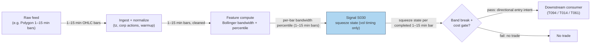

## Stage 30/200 — S030: Bollinger bandwidth squeeze → expansion

*Batch SB5 · Signal 30/100 · Provenance [SR] · Family B — Intraday Momentum & Breakout*

### S1. One-line verdict

| | |
|---|---|
| **What it is** | Volatility-*state* timing: when Bollinger bandwidth sits at a low percentile of its history (the "squeeze"), position for the expansion that statistically follows — *direction comes from the subsequent band break, never from the squeeze itself*. |
| **When it works** | Volatility clustering regimes: quiet tapes that resolve into genuine directional expansions with follow-through. |
| **When it dies** | Dead low-liquidity names that compress indefinitely; news-spike fake expansions; any use of the squeeze as a *directional* signal. |
| **Build-or-buy in one line** | Build — bandwidth and a rolling percentile on cheap bars; vendor "squeeze" overlays add opacity, not edge. |

Provenance **[SR]** (standard reconstruction: Bollinger documented the squeeze concept; the percentile-break rule is a practitioner reconstruction — never upgraded to [D]) · Family **B — Intraday Momentum & Breakout**.

### S2. How it works — plain human explanation

Return to the 10:15 tape. For twenty bars, price barely moved: the **Bollinger bandwidth** — bandwidth is simply the distance between the upper and lower Bollinger bands divided by the midline, i.e. how wide the envelope is *relative* to price, expressed as a percentage — drifted between 0.90% and 1.45%, near the lows of its recent history. Then bar 30 erupts: bandwidth jumps to 1.564%, the highest of the last 20 bars (a **percentile** — the percentage of prior readings at or below the current one — of 100%). The quiet period ended. The squeeze framework says: *compression precedes expansion; the expansion has now begun.*

The economic logic is **volatility clustering** — the well-documented tendency of quiet periods to be followed by active ones and vice versa. When bands pinch, the market is in a low-disagreement equilibrium: market makers are comfortable, nobody is being forced to trade. That equilibrium is fragile. A catalyst — news, a large order, a sector move — breaks it, resting liquidity gets consumed, market makers widen quotes, and realized volatility jumps. The squeeze does not predict the catalyst; it identifies the *loaded spring*.

Here is the mandatory honesty, stated plainly: **the squeeze predicts that *something* will happen, not *which direction* it goes.** Bollinger's own rule is "wait for a squeeze and go with the *first breakout*" — the direction comes from the break, confirmed by a separate directional read (band-break side, momentum, order flow). Any presentation of the squeeze as a directional signal is a misrepresentation. As one market commentator put it about a real S&P 500 bandwidth compression to its lowest since June 2021: a larger swing is likely on the horizon — "the question now is which way the market will move" (Reuters, 2026-09-10).

**Mental model:**
- The squeeze is a *volatility-state* indicator, not a *directional* one — it times *when*, never *which way*.
- Bandwidth percentile converts an absolute width ("1.2%") into a regime-relative statement ("tighter than 90% of recent history").
- The tradable object is the *transition* (compression → expansion + confirmed break), not the compression itself.

### S3. The math — exact formula

Bollinger bands as in S029: midline $\mu_t$ (SMA of closes, window $N$), $\sigma_t$ (population standard deviation), rails $\mu_t \pm k\sigma_t$. **Bandwidth** (Barchart/Trading Technologies convention, ×100 for percent):

$$BW_t = \frac{B^U_t - B^L_t}{\mu_t} = \frac{2k\,\sigma_t}{\mu_t}$$

so with $k=2$, $BW_t = 4\sigma_t/\mu_t$. The **bandwidth percentile** over trailing window $R$ (prior bars only — the current bar is ranked against history, not against itself):

$$P_t = 100 \times \frac{\#\{j \in [t-R,\, t-1] : BW_j \le BW_t\}}{R}$$

**Squeeze** (all parameters example — not an institutional standard): $P_t \le p$, commonly $p \in \{5, 10, 20\}$. **Entry**: on the first close outside the band *in the break direction* after a squeeze — i.e. the squeeze arms the trade, the band break aims it. Causal timing: squeeze state known at bar $t$'s close; expansion entry no earlier than bar $t+1$.

| Parameter | Symbol | Typical range | Too small | Too large | Default (example) |
|---|---|---|---|---|---|
| Band lookback | $N$ | 15–30 bars | Bands chase noise | Squeeze rarely registers | 20 *(example — not an institutional standard)* |
| Band width | $k$ | 1.5–2.5 | Bands inside normal noise | Squeeze never triggers | 2 *(example)* |
| Percentile window | $R$ | 50–250 bars | Percentile flickers | Ancient regimes pollute the ranking | 125 *(example)* |
| Squeeze threshold | $p$ | 5–20% | Almost never "on" | Always "on" — no information | 20 *(example)* |

**Named variants.** (1) *Bollinger's "simple" squeeze*: current bandwidth at its 6-month minimum (the default he taught). (2) *Bollinger's "complicated" squeeze*: plot the 20-day standard deviation, then 125-day 1.5-σ Bollinger bands *of that standard deviation* — a squeeze triggers when the 20-day σ tags the lower band (Bollinger 2001, p.194). (3) *TTM Squeeze* (Carter, via StockCharts): squeeze "on" when **both** Bollinger bands (20, 2σ) sit *inside* the Keltner channels (20-period, 1.5× ATR — using Keltner's *original 1960* formula, per StockCharts' note), plus a momentum histogram that supplies the missing directional read. TTM is a vendor overlay — reproducible from the published construction, but a black box if bought as a study.

### S4. Worked example — step-by-step numbers (SYNTHETIC)

Synthetic 30-bar bandwidth series, seed 30 (fixed `numpy.random.default_rng(30)`). Prior-20 bandwidth values (bars 10–29) compress from 0.90% to 1.45% (supplied example conveniences, disclosed); bar 30 is the expansion bar. All numbers hand-verified against the operator-checked worked example; **synthetic — not market data — and no performance is claimed.**

| Bar | Bandwidth | Percentile (trailing 20) | State |
|-----|-----------|--------------------------|-------|
| 26 | 1.30% | 100% (rising window) | Expansion underway |
| 27 | 1.36% | 100% | Expansion underway |
| 28 | 1.40% | 100% | Expansion underway |
| 29 | 1.45% | 100% | Expansion underway |
| 30 | **1.564%** | **100%** | **Expansion bar — NOT a squeeze** |

**Step 1 — bandwidth at bar 30:** from the S029 Bollinger computation, $BW_{30} = 4 \times 0.3923 / 100.29 = 0.01564 = 1.564\%$.

**Step 2 — percentile:** all 20 prior values (0.90%…1.45%) are ≤ 1.564%, so $P_{30} = 100 \times 20/20 = 100\%$.

**Step 3 — squeeze test:** with the example threshold $p = 20\%$, $100\% \not\le 20\%$ → **no squeeze at bar 30**. This is the expansion *after* compression — the spring has already released.

**Step 4 — what a squeeze entry would have looked like:** the compression phase (bars 10–20, bandwidth near its local lows) is where $P_t \le 20\%$ would have armed the signal; the profitable question was never "will volatility expand" (it did — 0.90% → 1.564%) but "in which direction, and after costs." The bar-30 close above the Bollinger upper band (101.0746, from S029) is the directional leg: *squeeze armed it, the band break aimed it.*

**What to notice.** Percentile needs $R$ prior bars — with $R=20$ the first valid reading here is bar 21, so squeeze states are always *late by construction*: the indicator confirms compression after it has persisted. Combined with the bar-$t+1$ fill rule, a squeeze system enters expansions, not compressions — anyone describing it as "buying the quiet" is misreading their own indicator. This toy series has no fees and no direction embedded: it demonstrates the *computation*, and specifically the fact that the computation alone yields no directional call.

### S5. Strategies that use this signal

- **T094 — Squeeze Breakout (Options-Confirmed)** — primary trigger: Bollinger squeeze breakouts confirmed by unusual options activity and vol expansion (S076).
- **T014 — Bollinger Reversal + Squeeze Exit** — squeeze as timing/exit filter: covers reversal positions into bandwidth-squeeze expansions and vol breakouts.
- **T061 — Initial-Balance Expansion Trader** — squeeze as confirmation filter: first-hour range breaks confirmed by squeeze state and relative volume.

### S6. Data required — exact spec

| Field | Type | Granularity | Source tier | Notes |
|---|---|---|---|---|
| OHLC (open/high/low/close) bars | float | 1–15 min or daily | Tier 0/1 | Daily bars suffice for the 6-month-minimum variant |
| Corporate actions | events | as-occurring | Tier 1 | Splits corrupt σ and hence bandwidth |
| Session calendar | reference | daily | Tier 0 | Percentile windows must span comparable regimes |

Ingest + feature sketch (Python/polars, ≤20 lines):

```python
import polars as pl
bars = pl.read_parquet("bars_15m/*.parquet").sort(["symbol", "ts"])
N, k, R, p = 20, 2.0, 125, 20  # example — not an institutional standard
feat = bars.with_columns([
    pl.col("close").rolling_mean(N).over("symbol").alias("sma"),
    pl.col("close").rolling_std(N, ddof=0).over("symbol").alias("sd"),
]).with_columns([
    ((4 * pl.col("sd")) / pl.col("sma")).alias("bw"),  # k=2 -> 4*sd/sma
]).with_columns([
    pl.col("bw").rolling_map(lambda s: (s[:-1] <= s[-1]).mean() * 100,
                             window_size=R + 1).over("symbol").alias("bw_pct"),
    (pl.col("bw_pct") <= p).alias("squeeze"),
])
```

**Storage:** ~0.1 MB per symbol-day for 1-min bars in Parquet (500 symbols ≈ 50 MB/day per `notes/cost-model.md` §4); daily bars are negligible. **Data-quality checklist:** percentile needs $R$ valid prior bars — no squeeze state during warmup; bandwidth is meaningless across corporate actions; compare like-with-like regimes (don't rank today's 5-min bandwidth against last month's daily bandwidth).

### S7. Local build on M5 Max / 128GB

**Feasibility: trivial.** Bandwidth is arithmetic on the S029 features; the rolling percentile is O($R$) per bar naive or O(log $R$) with an order-statistic tree — at $R=125$ and 500 symbols × 390 bars/day, even the naive version is microseconds per bar. Throughput and RAM are the S029 story verbatim: milliseconds per full-universe recompute, ~12 MB for 500 symbols × 60 days of 1-min bars (`notes/cost-model.md` §2/§3). The machine is not the constraint; point-in-time correctness of the bandwidth history is (labeled chatbot lead).

| Stack | When to pick it |
|---|---|
| Python + polars | Default: rolling statistics plus percentile in one pipeline |
| Rust | Unneeded at bar granularity |
| DuckDB | Research queries over the Parquet archive |

**Engineering band:** Tier L per `notes/cost-model.md` §5 — **4–12 h ≈ $600–1,800** at $150/hr loaded cost. **What breaks first at 500 symbols or full OPRA:** nothing new — the percentile state per symbol is one small ring buffer; full OPRA only matters if you confirm squeezes with options flow (T094), which is a separate Tier-H project.

### S8. Buy vs build

| Option | What you get | Indicative price | Buying gains | Buying loses |
|---|---|---|---|---|
| Tier 0: Stooq / Alpaca IEX | Daily bars | ~$0 | Enough for the 6-month-minimum squeeze variant | No intraday |
| Tier 1: Polygon / Alpaca SIP (Securities Information Processor consolidated feed) | Real-time 1–15 min bars | ~$30–200/mo | Clean intraday bandwidth series | Nothing material |
| Vendor overlay: TTM Squeeze study (charting platforms) | Pre-built squeeze dots + momentum | ~$15–60/mo platform fee | Instant visualization | Opaque parameters; weak audit trail; the momentum histogram's construction is the actual edge, and you can't inspect it |
| Tier 2: Databento | Normalized bars, imbalance feeds | ~$200/mo + usage | Research-grade history | Overkill for bandwidth math |

All prices *indicative — verify before budgeting*. **Verdict: build.** Bandwidth is one division; the percentile is one rolling rank. Buy the cheapest bar feed that covers your timeframe — and build the indicator yourself, because the squeeze threshold $p$ and window $R$ *are* the strategy, and a vendor will not let you audit theirs.

### S9. Success ratio / efficacy — documented evidence

| Study / source | Market & period | Metric | Before/after cost | Caveat |
|---|---|---|---|---|
| Bollinger (2001), *Bollinger on Bollinger Bands* — squeeze as lowest-volatility regime; "wait for a squeeze and go with the first breakout" | Practitioner framework, multi-market | Timing rule description; no strategy returns reported | Before-cost (no P&L documented) | The rule is volatility-timing, explicitly not a directional edge |
| Reuters / LSEG market technicals (2026-09-10) — S&P 500 Bollinger Bandwidth compressed to lowest since June 2021; prior extreme followed by ~4% rally over 16 sessions | US large-cap, Aug–Sep 2026 | Observed volatility compression → subsequent swing; direction explicitly "unclear" beforehand | Observational (no strategy P&L; before-cost) | Single anecdote, not a backtest; illustrates exactly the direction-neutrality point |
| Evidence synthesis, duck.ai Q-SB5-3 (2026-09-10; labeled chatbot) | Squeeze literature, practitioner | Squeeze = defensible volatility-timing; "DIRECTION NOT determined by compression"; the testable question is risk-adjusted after-cost returns of squeeze+breakout vs merely predicting realized-vol increase | After-cost orientation | Chatbot synthesis, not a paper — see Unverified leads |

**Regimes where it fails:** dead low-liquidity names where bandwidth sits at "squeeze" levels for months with no expansion; news-spike expansions that reverse within the bar (expansion without follow-through); breaks against the higher-timeframe trend; correlated triggers — every squeeze trader arming the same bar.

**Honest bottom line:** as a *volatility-state timer* the squeeze is the most defensible of the three SB5 chapters — volatility clustering is real and compression-then-expansion is its visible signature. As a *directional edge* it is nothing: the squeeze must be paired with a confirmed break (and ideally a directional filter) and evaluated on **risk-adjusted after-cost returns**, not on whether realized volatility subsequently rose. A system that "predicts" the expansion but loses money trading it has measured meteorology, not alpha.

### S10. Failure modes & pitfalls

- **The direction illusion.** Treating the squeeze itself as a buy/sell signal. It is not — compression resolves up or down with roughly the market's base rates. *Mitigation:* the strategy may only enter on the *confirmed band break* (or a separate directional filter); backtest the squeeze leg and the direction leg separately.
- **Squeeze defined after the move.** Percentile needs $R$ prior bars and the entry needs the break — by the time all conditions are true, part of the expansion is consumed. *Mitigation:* measure entry delay explicitly (bars from percentile trough to fill); size for the *remaining* move, not the full expansion.
- **Mixed bar-inclusion conventions.** Bandwidth/σ windows that include the forming bar, ranked against percentiles of completed bars, mix information sets at one timestamp — the same live-implementation pitfall as S028/S029. *Mitigation:* one stated convention (completed-bar features through $t-1$, signal on bar $t$, fill at $t+1$) and an explicit fill-timing cost.
- **Permanent compression in dead names.** Illiquid stocks show "squeeze" bandwidth for months; the spring never releases because there is no spring. *Mitigation:* minimum ADV (average daily volume) and spread screens; require the expansion to actually begin (band break) rather than betting on compression alone.
- **News-spike fake expansions.** A one-bar volatility spike prints percentile 100% with no follow-through. *Mitigation:* require expansion persistence (e.g. 2–3 bars) or volume/imbalance confirmation before committing.
- **Threshold mining.** $p \in \{5,10,20\}$, $R \in \{50,\dots,250\}$ — a large grid that will always yield a "best" backtest. *Mitigation:* fix $p, R$ from the trading horizon's logic; validate out-of-sample with purged/embargoed splits (validation splits with near-in-time train/test overlap removed to prevent leakage).
- **Correlated triggers and crowding.** Squeeze breakouts are visible to every technician watching the same bands. *Mitigation:* expect slippage at the obvious break bar; consider entering on the retest rather than the break.

### S11. Visuals




### S12. Sources

1. Bollinger, John (2001) — *Bollinger on Bollinger Bands*, McGraw-Hill. The squeeze concept: lowest-volatility regime (simple: 6-month bandwidth minimum; complicated: 20-day σ vs 125-day 1.5-σ bands of σ, p.194) and the "wait for a squeeze and go with the first breakout" rule.
2. Barchart — "Bollinger BandWidth": formula $((\text{Upper} - \text{Lower}) / \text{Middle}) \times 100$ and the squeeze theory ("periods of low volatility are followed by periods of high volatility… can foreshadow a significant advance or decline" — direction-neutral). https://Www.Barchart.com/education/technical-indicators/bollinger_squeeze (accessed 2026-09-10).
3. StockCharts ChartSchool — "TTM Squeeze": Carter's construction (Bollinger 20/2 inside Keltner 20/1.5, original 1960 Keltner formula) plus the momentum histogram that supplies the directional read the squeeze itself lacks. https://chartschool.stockcharts.com/table-of-contents/technical-indicators-and-overlays/technical-indicators/ttm-squeeze (accessed 2026-09-10).
4. Trading Technologies — "Bollinger Bandwidth": formula and configuration reference. https://library.tradingtechnologies.com/trade/chrt-ti-bollinger-bandwidth.html (accessed 2026-09-10).
5. Reuters (2026-09-10) — "Mapping the Market: S&P 500 may be ready to break out after quiet period": bandwidth compressed to lowest since June 2021; "the question now is which way the market will move." https://www.reuters.com/markets/us/global-markets-technicals-2026-09-10/ (accessed 2026-09-10).

**Unverified leads** (chatbot-provided, not independently checkable — do not treat as evidence):
- duck.ai answers Q-SB5-1–Q-SB5-3 (GPT-5.6 Luna, 2026-09-10): the 30-bar worked-example numbers (operator hand-checked, no arithmetic errors; bar-30 percentile 100% = expansion after compression, NOT a squeeze); the mandatory framing that the squeeze is volatility-state timing and the testable question is risk-adjusted after-cost returns vs merely predicting realized-vol increase.
