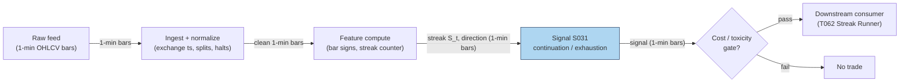

## Stage 31/200 — S031: Consecutive-bar streaks (runs)

*Batch SB5 · Signal 31/100 · Provenance [SR] · Family B — Intraday Momentum & Breakout*

### S1. One-line verdict

| What it is | When it works | When it dies | Build-or-buy in one line |
|---|---|---|---|
| Counts consecutive same-sign bar returns; trades continuation at streak ≥ k₁ (*example*) or fades exhaustion at streak ≥ k₂ with range/volume confirmation | Strong intraday trends, news-driven drifts, momentum regimes with persistent order flow | Chop, mean-reverting tapes, low-volume grinds where every "streak" is noise | Build: 20 lines of code on any bar feed; nothing to buy |

Provenance: **[SR]** (standard reconstruction — the streak recursion is textbook; thresholds are implementation examples, not institutional standards). Family B — Intraday Momentum & Breakout.

### S2. How it works — plain human explanation

A *streak* (also called a *run*) is simply a count: how many consecutive bars closed in the same direction? At 10:23, a trader watching XYZ sees the last five 5-minute bars all close higher. That is a streak of 5. The signal asks the oldest question in technical trading — Cowles and Jones (1937) were counting exactly these sequences and reversals on stock prices nearly a century ago: does a rise tend to follow a rise?

Economically, two opposite stories both plausibly generate streaks, and the signal deliberately plays both. The **continuation** story is order-flow persistence: institutional flow arrives in waves (a fund working a large buy order prints a sequence of up bars), and herding plus stop-running extends the move — the micro-mechanism behind intraday time-series momentum. The **exhaustion** story is positioning: after six or seven consecutive up bars the marginal buyer is spent, market makers are long and skewing quotes down, and any pause triggers profit-taking — so extreme streaks *fade*.

The practical art is the split: moderate streaks (3–5 bars, *example*) ride; extreme streaks (6+, *example*) fade, ideally confirmed by a range expansion or a volume climax that says "everyone is already in."

**Mental model:**
- A streak is a *coarse, robust* momentum proxy: no parameters to overfit beyond two integer thresholds, computable in O(1) per bar.
- Direction and regime decide the trade: streaks *continue* when flow is institutional and news-backed; they *exhaust* when the move is retail-chased and volume climaxes.
- The signal's real value is as a *trigger with a built-in flip*: ride the run, then fade it when it gets absurd.

### S3. The math — exact formula

Let $r_t = \ln(C_t / C_{t-1})$ be the bar-$t$ log return on closes $C_t$, and define the sign $s_t = \mathrm{sign}(r_t) \in \{+1, -1\}$ (zero returns, *unchanged* bars, are treated as breaking the streak — a live-implementation choice that must be fixed and documented). The streak counter is the recursion:

$$S_t = \begin{cases} S_{t-1} + 1, & s_t = s_{t-1} \\ 1, & s_t \neq s_{t-1} \end{cases} \qquad S_1 = 1$$

The direction of the streak is $s_t$. The two-sided trading rule (*thresholds are examples — not institutional standards*):

$$\text{Continuation: enter with } s_t \text{ when } S_t \ge k_1 \quad\text{(e.g. } k_1 = 3\text{)}$$
$$\text{Exhaustion fade: enter against } s_t \text{ when } S_t \ge k_2 \text{ AND range/volume filter passes} \quad\text{(e.g. } k_2 = 6\text{)}$$

| Parameter | Symbol | Typical range | Too small | Too large | Default (*example*) |
|---|---|---|---|---|---|
| Continuation threshold | $k_1$ | 2–5 bars | Fires on noise; whipsawed by 2-bar wiggles | Never fires; misses the move | 3 |
| Exhaustion threshold | $k_2$ | 5–9 bars | Fades healthy trends mid-run | Only catches once-a-month extremes | 6 |
| Bar grid | — | 1–15 min | Microstructure noise dominates | Signal too slow for intraday | 5-min |
| Zero-return rule | — | break / carry / ignore | (implementation choice — backtest and live must match) | — | break streak |

**Causal timing:** $S_t$ is computed at the close of bar $t$ using only data $\le t$; the earliest tradable fill is the open of bar $t+1$. Entering *inside* bar $t$ on a developing streak is a look-ahead violation (the bar's sign isn't known until it closes).

**Normalization:** streaks are usually raw counts, but a calibrated variant normalizes by the expected streak length under a Bernoulli sign model: under iid signs with up-probability $p$, $P(S \ge k) = p^{k-1}$ for an up-streak — so a 6-bar up-streak with $p = 0.52$ has probability $0.52^5 \approx 3.8\%$, i.e. genuinely unusual. Rank/z normalization across the universe is a cross-sectional variant.

**Named variants:**
1. **Close-sign streaks** (above) vs **range streaks** (consecutive higher highs / lower lows) — range streaks are stricter and rarer.
2. **Volume streaks** — consecutive bars with rising volume in the streak direction; used as the exhaustion *confirmation* (a volume climax at $S_t \ge k_2$).
3. **Above-VWAP streaks** — consecutive bars closing above session VWAP (volume-weighted average price); a trend-quality overlay rather than a pure sign run.

### S4. Worked example — step-by-step numbers (SYNTHETIC)

Synthetic 12-bar 5-minute tape, seed **31**. Prices are hand-designed so the streak pattern is exact; volume jitter comes from `numpy.default_rng(31)`. Zero returns break the streak. This is synthetic data — not market data — and the chart plots exactly these numbers.

| bar | O | H | L | C | vol | sign($r_t$) | $S_t$ | action (*example* thresholds $k_1{=}3$, $k_2{=}6$) |
|---|---|---|---|---|---|---|---|---|
| 1 | 99.95 | 100.03 | 99.92 | 100.00 | 1129 | +1 | 1 | — |
| 2 | 100.00 | 100.18 | 99.97 | 100.15 | 1320 | +1 | 2 | — |
| 3 | 100.15 | 100.35 | 100.12 | 100.32 | 1358 | +1 | 3 | continuation LONG |
| 4 | 100.32 | 100.47 | 100.29 | 100.44 | 1393 | +1 | 4 | continuation LONG |
| 5 | 100.44 | 100.64 | 100.41 | 100.61 | 1614 | +1 | 5 | continuation LONG |
| 6 | 100.61 | 100.82 | 100.58 | 100.79 | 1754 | +1 | 6 | continuation LONG **+ EXHAUSTION fade** |
| 7 | 100.79 | 100.82 | 100.68 | 100.71 | 1035 | −1 | 1 | — |
| 8 | 100.71 | 100.74 | 100.57 | 100.60 | 1234 | −1 | 2 | — |
| 9 | 100.60 | 100.63 | 100.52 | 100.55 | 1330 | −1 | 3 | continuation SHORT |
| 10 | 100.55 | 100.69 | 100.52 | 100.66 | 1155 | +1 | 1 | — |
| 11 | 100.66 | 100.83 | 100.63 | 100.80 | 1279 | +1 | 2 | — |
| 12 | 100.80 | 100.98 | 100.77 | 100.95 | 1267 | +1 | 3 | continuation LONG |

Step-by-step: bar 1's return is measured vs the prior close $C_0 = 99.95$ ($r_1 = \ln(100.00/99.95) > 0$, sign +1, $S_1 = 1$). Each subsequent bar: same sign as the prior bar increments the counter, a flipped sign resets to 1. At bar 3's close $S_3 = 3 \ge k_1$ → continuation long, fillable at bar 4's open (100.32). At bar 6, $S_6 = 6 \ge k_2$ with volume at its tape maximum (1754 shares vs 1129 at bar 1) → the exhaustion flip fires: the strategy would flatten/reverse the long into bar 7's open (100.79). Note the payoff logic: entering at bar 4's open (100.32) and flipping at bar 7's open (100.79) captures +0.47 before costs; entering at bar 3's signal but filling late erodes it — the causal-timing rule is the whole game.

**What to notice:** the volume profile confirms the economics — volume builds through the up-run (institutional participation) and collapses at bar 7. This toy tape has no fees, no spread, and a conveniently clean reversal; in live tapes most $k_2$ hits just consolidate sideways and the fade bleeds on spread. Nothing here is a performance claim.

### S5. Strategies that use this signal

- **T062 — Streak Runner with Exhaustion Flip** — *primary entry trigger (direction)*: rides the $S_t \ge k_1$ continuation leg; *exhaustion filter/flip*: reverses at $S_t \ge k_2$ with range/volume confirmation. This is the signal's home strategy — the chapter's continuation/fade duality maps 1:1 onto T062's two legs.
- No other strategy in the plan's T001–T100 list consumes S031 directly; the natural secondary consumers are regime-gated momentum books (S031 as a trend-quality filter), which the plan does not define — so this chapter claims exactly one T-consumer and does not invent one.

### S6. Data required — exact spec

| Field | Type | Granularity | Source tier | Notes |
|---|---|---|---|---|
| Open, high, low, close | float | 1–15 min bars | Tier 0–1 | Any OHLCV vendor; consolidated SIP (Securities Information Processor — the consolidated feed) is fine |
| Volume | int | same bars | Tier 0–1 | Needed for the exhaustion volume filter |
| Corporate actions / splits | reference | event | Tier 0–1 | Unadjusted splits fabricate sign flips |
| Halt / session calendar | reference | event | Tier 0–1 | Overnight gaps must not continue the streak |

Ingest loop (Python/polars sketch, ≤20 lines):

```python
import polars as pl
bars = pl.read_parquet("bars_1m/*.parquet")          # O,H,L,C,volume,ts,symbol
bars = (bars.sort(["symbol","ts"])
            .with_columns(r = pl.col("C").log() - pl.col("C").log().shift(1).over("symbol"))
            .with_columns(sign = pl.when(pl.col("r")>0).then(1)
                                    .when(pl.col("r")<0).then(-1).otherwise(0))
            .with_columns(sign_chg = (pl.col("sign") != pl.col("sign").shift(1).over("symbol")).cast(pl.Int64))
            .with_columns(run_id = pl.col("sign_chg").cum_sum().over("symbol"))
            .with_columns(streak = pl.int_range(pl.len()).over("symbol", "run_id") + 1))
```

Storage: 1-min bars are tiny — per `notes/cost-model.md` §4, 500 symbols ≈ 50 MB/day in Parquet (≈0.1 MB per symbol-day); a 60-day single-symbol research set is a few MB. Archive freely.

Data-quality checklist: timestamp normalization (exchange vs vendor receipt), split/dividend adjustment before sign computation, half-days and DST transitions, halted symbols (freeze the streak, don't carry it across the halt), stale prints on illiquid names.

### S7. Local build on M5 Max / 128GB

**Feasibility: trivial.** A streak counter is O(1) integer state per symbol per bar. Per cost-model §2, even a pure-Python loop handles ~100–500k events/sec and 500 symbols × 1 bar/min is 8.33 bars/sec average — roughly five orders of magnitude below the Python ceiling; polars column ops run at ~10–50M rows/sec, so a full 60-day recompute over 500 symbols (11.7M rows) finishes in about a second. Bottleneck: none on compute; the only real work is the data-quality layer (splits, halts, timestamps).

Stack: **Python+polars** — pick it; nothing here justifies Rust (no L2 (full depth-of-book)/MBO (market-by-order) event rates). DuckDB only if you want SQL access to the bar archive.

RAM: per cost-model §3, 500 symbols × 60 days of 1-min bars ≈ 12 MB — trivial against the 77 GB working budget.

Engineering: **Tier L, 4–12 h** (cost-model §5) → **$600–1,800** at the $150/hr loaded-cost estimate. One line of justification: bar ingestion + streak recursion + two thresholds is an afternoon's work; the remaining hours are the split/halt hygiene and a point-in-time replay check.

What breaks first at 500 symbols or full OPRA (Options Price Reporting Authority): nothing — this signal doesn't touch options or depth; scaling to the full US universe is still a bars problem, trivial.

### S8. Buy vs build

| Option | What you get | Indicative price | What buying gains | What buying loses |
|---|---|---|---|---|
| Tier-0 free (Stooq delayed, Alpaca IEX) | Daily/15-min bars | ~$0 — *indicative, verify before budgeting* | $0 data for research | Coarse granularity; no 1-min history depth |
| Tier-1 retail (Polygon Stocks Advanced, Alpaca SIP) | 1-min + real-time SIP bars, corporate actions | ~$30–200/mo — *indicative, verify before budgeting* | Clean adjusted bars, full history | Nothing material for this signal |
| Tier-2 professional (Databento) | Normalized OHLCV + venue detail | ~$200/mo + usage — *indicative, verify before budgeting* | Venue-stamped bars if you later care about venue effects | Overkill for close-sign streaks |
| Academic route (CRSP — Center for Research in Security Prices — / TAQ — Trade and Quote, the consolidated equity tick database — via WRDS (Wharton Research Data Services)) | Publication-grade history | institutional — *indicative, verify before budgeting* | Reproducible research archive | Cost and access friction for zero analytic gain |

**Verdict: build.** The signal is ~20 lines on any bar feed; there is no vendor product that adds value beyond the raw bars. Buy Tier-1 bars only because you need reliable 1-min history anyway — the crossover point is "you need more than delayed daily bars," which any serious intraday book already has.

### S9. Success ratio / efficacy — documented evidence

| Study / source | Market & period | Metric | Before/after cost | Caveat |
|---|---|---|---|---|
| Cowles & Jones (1937), "Some a posteriori probabilities in stock market action" | US stocks, historical to 1930s | Sequence-to-reversal ratio deviating from the random-walk null | Before-cost (informational — a statistical regularity, not a P&L) | Daily data from the 1930s; documents that sign sequences carry structure, not that a 5-min streak rule earns money |
| Heston, Korajczyk & Sadka (2010), "Intraday patterns in the cross-section of stock returns", *J. Finance* | US stocks, post-decimalization, half-hour bars | Return continuation at exact multiples of a trading day, persisting ≥40 trading days; timing trades can save ≈ the effective spread | Execution-benefit framing (≈ spread saved); not a standalone after-cost alpha | Cross-sectional portfolio effect, not a per-name streak trigger; the "saving" is a cost reduction, not a return |
| Haendler, Heston, Korajczyk & Sadka (2025), "The intra-day stock return periodicity puzzle" (out-of-sample follow-up) | US stocks, extended sample | Open/midday periodicity fully explained by institutional trading proxies (VWAP-like, MOC — market-on-close); up to 30% of close periodicity | Before-cost (explanatory, not a trading P&L) | Confirms the institutional-flow mechanism behind intraday continuation — supports the continuation story, not a parameter set |

Regimes where it fails: volatility spikes (streaks form and reverse inside one bar — the counter is always one bar late), low-liquidity names (streaks are just wide spreads bouncing), crowded momentum unwinds (every streak system flips the same way). Documented decay: the raw continuation leg is the classic short-horizon momentum that has been arbitraged down for decades; what survives is the *calibration* (which streaks, which names, which volume profile).

**Honest bottom line:** as a standalone trigger this is a *weak, largely undocumented-after-cost* edge — no public study shows a retail 5-minute streak rule surviving spread and fees. As a *calibrated trigger-plus-flip inside T062*, it is a *reasonable structural component*: the value is in the regime logic around the counter, not the counter itself.

### S10. Failure modes & pitfalls

1. **Look-ahead leakage** — entering on a developing bar before its sign is fixed. *Mitigation:* compute at bar close, trade at next bar's open; enforce in replay with bar-completion flags.
2. **Stale/latency effects** — on a delayed feed the "streak" you see is one bar behind the market's. *Mitigation:* timestamp everything at bar publication; paper-trade on the same delayed feed you backtest on.
3. **Crowding / alpha decay** — streak-chasing is the most retail-obvious rule in existence; the continuation leg decays first. *Mitigation:* keep thresholds adaptive (percentile of recent streak distribution, not fixed integers) and gate on volume/flow quality.
4. **Cost blowup** — a 5-bar streak on a 1-min grid can mean 20+ round trips a day; spread alone eats a 2–3 bps (basis points, 1 bp = 0.01%) edge. *Mitigation:* model half-spread + fees + slippage/impact per trade in the trigger test; require expected move > 3× cost.
5. **Regime breaks** — streaks continue in trends and mean-revert in ranges; a fixed $k_1/k_2$ can't tell them apart. *Mitigation:* regime-gate with a vol-regime or trend filter (e.g. only ride streaks with the day's VWAP trend).
6. **Overfitting / parameter mining** — two integer thresholds on one symbol will always "work" in-sample. *Mitigation:* fix $k_1, k_2$ on a calibration universe, validate on untouched symbols and out-of-sample years; prefer the Bernoulli-probability normalization over raw counts.
7. **Data errors** — unadjusted splits print a −50% "bar" that resets every streak and fabricates signals. *Mitigation:* adjust before sign computation; assert no $|r_t| > 20\%$ without a corporate-action record.
8. **Microstructure noise vs signal** — on 1-min bars, bid-ask bounce alone manufactures alternating signs that mask real streaks. *Mitigation:* use 5-min+ grids or mid-price bars for illiquid names.

### S11. Visuals




### S12. Sources

- Cowles, A. & Jones, H.E. (1937). *Some a posteriori probabilities in stock market action.* Econometrica 5(4). PDF: https://www.ploymarket.com/proxy/https/cowles.yale.edu/sites/default/files/2022-08/cowles-posteriori37.pdf
- *The Cowles–Jones test with unspecified upward market probability.* Data Science in Finance and Economics, 3(4), 324–336 (2023). PDF: http://aimspress.com/aimspress-data/dsfe/2023/4/PDF/DSFE-03-04-019.pdf
- Heston, S.L., Korajczyk, R.A. & Sadka, R. (2010). *Intraday patterns in the cross-section of stock returns.* Journal of Finance 65(4), 1369–1407. PDF: https://bauer.uh.edu/departments/finance/documents/Heston-Korajczyk-Sadka-jf-2010-01-07.pdf
- Haendler, C., Heston, S., Korajczyk, R. & Sadka, R. (2025). *The intra-day stock return periodicity puzzle.* https://www.kellogg.northwestern.edu/academics-research/research/detail/2025/the-intra-day-stock-return-periodicity-puzzle/
- Lo, A. W. & MacKinlay, A. C. (1988). *Stock market prices do not follow random walks: Evidence from a simple specification test.* Review of Financial Studies 1(1), 41–66. http://web.mit.edu/Alo/www/Papers/lo-mackinlay-88.html — Variance-ratio rejection of the random walk with positive short-horizon serial correlation: the statistical basis for streak continuation at the bar level.
- Jegadeesh, N. & Titman, S. (1993). *Returns to buying winners and selling losers: Implications for stock market efficiency.* Journal of Finance 48(1), 65–91. https://onlinelibrary.wiley.com/doi/10.1111/j.1540-6261.1993.tb04702.x — Cross-sectional momentum over 3–12-month horizons; the longer-horizon counterpart to the intraday run persistence the streak counter trades.

**Unverified leads** (chatbot-provided, not independently checkable — do not treat as evidence):
- Duck.ai (GPT-5.6 Luna, anonymous, 2026-09-10), Q-SB5-2: 1-min bar engine build estimates — prototype 185–385 eng-hours, research-grade 705–1,530 eng-hours (column totals verified; per-row breakdown unverified). Logged in `batches/SB5/duckai-answers.md`; Grok/Cursor answers pending (checked 2026-09-10).
