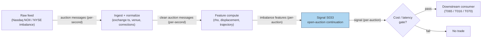

## Stage 33/200 — S033: Open-auction imbalance continuation

*Batch SB5 · Signal 33/100 · Provenance [SR] · Family B — Intraday Momentum & Breakout*

### S1. One-line verdict

| What it is | When it works | When it dies | Build-or-buy in one line |
|---|---|---|---|
| Reads the opening auction's leftover buy/sell pressure from imbalance messages and rides its sign for the first 5–15 minutes of continuous trading | Large, genuine imbalances on liquid names where the auction couldn't fully clear the pressure | Small imbalances, news-driven opens, or any setup where your fill arrives after the pressure is gone | Buy the normalized imbalance feed; build the replay and the message-sequence logic yourself |

Provenance: **[SR]** (standard reconstruction — practitioner-standard signal; no published canonical parameter set). Family B — Intraday Momentum & Breakout.

### S2. How it works — plain human explanation

Every US equity trading day starts with an *opening auction*: between roughly 9:28 and 9:30, the exchange collects buy and sell orders and computes a single *clearing price* — the price at which the most shares can match — then prints the open. During that window the exchange publishes *imbalance messages*. On Nasdaq this feed is called **NOII** (Net Order Imbalance Indicator): each message states the *indicative clearing price* (where the auction would clear if it ran right now), the *paired shares* (how many shares would actually match at that price), the *imbalance* (the leftover buy or sell shares that can't be matched — the side with more demand), a *reference price* (usually the prior close), the *auction status* (e.g. open, final), the *venue*, and *timestamps* (plus updates and corrections as orders arrive or cancel).

The economic intuition: a large buy imbalance with a rising indicative price means real, unresolved demand. Not all of it gets filled in the auction — especially the portion that arrived as market-on-open (MOO) or limit-on-open (LOO) orders with no price protection beyond the cross. When continuous trading starts at 9:30, that leftover demand keeps lifting offers for the first few minutes. The signal is therefore: **trade with the sign of the opening imbalance for the first 5–15 minutes**.

A concrete vignette: at 9:29:30, NOII for XYZ shows indicative $150.46 (up 44 bps — basis points, 1 bp = 0.01% — vs the $149.80 reference), paired shares 695,872, and a buy imbalance of 181,123 shares — 26% of the paired volume with nowhere to go. The auction prints at $150.55; you buy at the first 1-minute close and the residual demand carries the stock for the next five minutes. That drift is the continuation you're harvesting.

But the honest framing, which this chapter will not soften: the *documented* informational content is real, and the *tradable* edge concentrates brutally with the people who have direct, low-latency venue access and auction order types. A retail setup on an M5 Max reading a normalized vendor feed sits at the bottom of that hierarchy — tier (c) below — and most of what it can see is already in the price by the time it can act.

**Mental model:**
- The auction is a scheduled, visible supply/demand shock; the imbalance message is the closest thing to seeing the shock before it lands.
- Continuation exists because auctions ration fills — leftover pressure leaks into the first minutes of the continuous session.
- Your edge is not the *idea* (everyone knows it) but your *position in the latency and order-type hierarchy* — which, for a retail build, is the worst seat in the house.

### S3. The math — exact formula

From each NOII-style message at time $\tau$ in the pre-open window, extract:

- $P^{ind}_\tau$: indicative clearing price (where the auction would clear now)
- $Q^{paired}_\tau$: paired shares (matchable volume at $P^{ind}_\tau$)
- $I_\tau$: signed imbalance in shares ($>0$ = buy imbalance, $<0$ = sell imbalance)
- $P^{ref}$: reference price (prior close)

Two derived features (all thresholds *examples — not institutional standards*):

$$\text{Imbalance ratio:}\quad \rho_\tau = \frac{|I_\tau|}{Q^{paired}_\tau} \qquad\text{(how much of the cross is one-sided)}$$
$$\text{Indicative displacement:}\quad d_\tau = \frac{P^{ind}_\tau - P^{ref}}{P^{ref}} \quad\text{(in bps; direction + magnitude)}$$

The continuation rule:

$$\text{At the open print } P^{open}: \text{ if } \rho_{final} \ge \rho_{min} \text{ (e.g. 15\%) AND } |d_{final}| \ge d_{min} \text{ (e.g. 20 bps),}$$
$$\text{enter with } \mathrm{sign}(I_{final}) \text{ at the first tradable print; exit at } t_{open} + H \text{ (e.g. } H = 10 \text{ min) or on sign flip.}$$

| Parameter | Symbol | Typical range | Too small | Too large | Default (*example*) |
|---|---|---|---|---|---|
| Min imbalance ratio | $\rho_{min}$ | 10–30% | Fires on balanced crosses; pure noise | Only mega-cap news opens qualify | 15% |
| Min displacement | $d_{min}$ | 10–50 bps | Trades opens the market already priced | Misses normal institutional pressure | 20 bps |
| Holding window | $H$ | 5–15 min | Exits before the drift plays out | Holds into the mid-morning reversal | 10 min |
| Message staleness cap | — | 5–30 s | Acts on cancelled imbalances | Misses the final update | 15 s |

**Causal timing — read this twice:** the signal is a *message sequence*, not a snapshot. At decision time $t$ you may use only messages with exchange timestamps $\le t$. And the cardinal sin: **using the final published imbalance to explain trades placed before it was disseminated is look-ahead bias** — the backtest must replay the exact message tape ("what was known at $t$?"), including cancellations and corrections, not the end-of-window snapshot.

**Named variants:**
1. **Final-snapshot rule** (above) vs **trajectory rule** — enter only if the imbalance *grew* over the last 60–90 seconds of the window (filters late cancellations).
2. **Open-print deviation** — no imbalance feed at all: trade the sign of $(P^{open} - P^{ind}_{last})$ or $(P^{open} - P^{ref})$; a cruder proxy for the same pressure.
3. **Close-auction mirror** — the same machinery applied to the closing auction (MOC — market-on-close — / LOC — limit-on-close — imbalance) for the last-15-minutes drift; different cutoff rules, different participants.

### S4. Worked example — step-by-step numbers (SYNTHETIC)

Synthetic Nasdaq-style NOII tape for one stock, seed **33**. Reference price $P^{ref} = 149.80$. Small jitter comes from `numpy.default_rng(33)`; the pattern (growing paired shares, persistent buy imbalance, rising indicative) is designed. Synthetic data — not market data — and the chart plots exactly these messages.

| Time (ET) | Status | Indicative $P^{ind}$ | Paired shares | Buy imbalance $I$ | $\rho = |I|/Q^{paired}$ | $d$ vs ref (bps) |
|---|---|---|---|---|---|---|
| 09:28:00 | Open | 150.18 | 118,045 | 81,453 | 69.0% | +25.3 |
| 09:28:20 | Open | 150.26 | 205,233 | 106,903 | 52.1% | +30.8 |
| 09:28:40 | Open | 150.34 | 342,767 | 142,871 | 41.7% | +36.2 |
| 09:29:00 | Open | 150.40 | 480,257 | 163,742 | 34.1% | +40.2 |
| 09:29:15 | Open | 150.38 | 558,647 | 146,967 | 26.3% | +38.9 |
| 09:29:30 | Open | 150.46 | 695,872 | 181,123 | 26.0% | +43.8 |
| 09:29:45 | Open | 150.53 | 860,114 | 208,556 | 24.2% | +48.6 |
| 09:29:55 | Final | 150.55 | 972,793 | 217,180 | 22.3% | +50.2 |

Step-by-step: the final message (09:29:55) satisfies both gates — $\rho = 22.3\% \ge 15\%$ (*example*) and $d = +50.2\text{ bps} \ge 20\text{ bps}$ (*example*), with a buy imbalance ($I > 0$). The trajectory check passes too: paired shares grew monotonically (118k → 973k) and the indicative price rose into the close of the window, so this is not a late-cancellation artifact. The auction prints at $P^{open} = 150.55$. Enter long at the first 1-minute close, 150.62 (09:31 bar — the earliest fill a non-colocated participant can realistically secure). Hold $H = 10$ min; the 09:30–09:35 closes print 150.62, 150.70, 150.66, 150.74, 150.81.

P&L walk (synthetic, before costs): entry 150.62 at the 09:31 close; exit at the last listed close, 150.81 (09:35 — the example tape lists closes only through 09:35, so the walk stops there rather than at the H = 10 min mark): **+0.19 = +12.6 bps**. Now the honest part: a 1-cent spread crossed on entry and exit costs ~1.3 bps round-trip on a $150 stock, plus fees and slippage from filling at 09:31 rather than the 09:30 print. Net of realistic frictions this toy trade keeps maybe +8–10 bps — and that is the *good* case.

**What to notice:** the imbalance *ratio* falls through the window (69% → 22%) even as the *absolute* imbalance grows — late liquidity arrives to meet the pressure, which is why the ratio gate matters more than the share count. Also notice what the example assumes away: routing to the listing venue's open, fills at the close print, and no news at 09:32. None of those are free.

### S5. Strategies that use this signal

- **T065 — Open-Auction Imbalance Continuation** — *primary entry trigger (direction)*: the strategy is this signal with futures-spot confirmation (S059) and block-pressure confirmation (S094) layered on.
- **T016 — End-of-Day Drift Rider** — *filter/confirmation*: uses the opening-auction imbalance read (with S027 last-hour drift and S013 spread estimates) to confirm the day's directional bias before leaning into the close.
- **T070 — MOC Auction-Pin Trader** — *primary trigger (closing-auction variant)*: applies the same imbalance machinery to the closing auction (MOC/LOC), trading the imbalance into the close with GEX (gamma exposure) context (S074).

### S6. Data required — exact spec

| Field | Type | Granularity | Source tier | Notes |
|---|---|---|---|---|
| NOII / imbalance messages (indicative price, paired shares, buy/sell imbalance, auction status) | message stream | per-message (seconds) | Tier 2–3 | Nasdaq NOII via ITCH (Nasdaq's direct-feed order message protocol); NYSE/NYSE Arca equivalents; Databento Imbalance schema |
| Reference price, venue, auction type (open/close/halt) | message fields | per-message | Tier 2–3 | Must distinguish which auction and which venue — fragmentation matters |
| Exchange timestamp vs vendor receipt timestamp, correction flags | metadata | per-message | Tier 2–3 | The entire edge is "what was known at $t$" — receipt-time-only feeds leak |
| 1-min continuous-session bars | float | 1-min | Tier 1 | For the 5–15 min continuation leg |
| Symbol master / corporate actions | reference | event | Tier 0–1 | Splits near the open corrupt the reference price |

Ingest sketch (≤20 lines) — note the raw-message store, not snapshots:

```python
import polars as pl
# store RAW messages, never just the latest snapshot
msgs = pl.read_parquet("auction_imbalance/date=*/venue=*/**.parquet")
msgs = msgs.with_columns(
    rho = pl.col("imbalance_shares").abs() / pl.col("paired_shares"),
    d_bps = (pl.col("indicative_price") - pl.col("reference_price"))
            / pl.col("reference_price") * 1e4)
# point-in-time replay: as-of join messages to decision times on EXCHANGE ts
decisions = pl.DataFrame({"t": decision_times})
pit = decisions.join_asof(msgs.sort("exchange_ts"), left_on="t", right_on="exchange_ts")
```

Storage: imbalance traffic is far lighter than full tick data — hundreds of MB to a few GB for all updates/corrections/venues over a multi-month window (per the batch's chatbot research lead; treat sizing as indicative). Partition Parquet by `date/` and `venue`/symbol-bucket — not by individual symbol (chatbot Q-SB5-2 lead, verified sensible practice).

Data-quality checklist: exchange timestamp vs receipt timestamp (use exchange for sequencing), correction-vs-new message semantics, "was it actually disseminated then" (some messages are revised), venue attribution (Nasdaq vs NYSE vs Arca imbalances differ), auction-type tagging (open vs close vs halt-reopen), reference-price definition per venue.

### S7. Local build on M5 Max / 128GB

**Feasibility: feasible** — but the difficulty is *data semantics*, not compute. The batch's chatbot research (Q-SB5-2, labeled lead) puts it bluntly: "the 128GB M5 Max will not be the constraint; data rights, historical revisions, exchange semantics, reproducibility will be." Message rates are trivial (a few per second per symbol in the auction window); per cost-model §2 even a pure-Python loop handles ~100–500k events/sec. The real engineering is the point-in-time replay: raw message storage, correction handling, and the as-of join guaranteeing "what was known at $t$."

Stack: **Python+polars** — pick it; the as-of joins and Parquet partitioning are exactly polars' home turf. Rust only if you're also running a colocated L2 (full depth-of-book) book; you aren't.

RAM: imbalance messages for a 500-symbol universe over 60 days fit in single-digit GB — comfortable inside the 77 GB working budget (cost-model §3). The 1-min continuation bars are ~12 MB (cost-model §3 table) — trivial.

Engineering: **Tier M, ~30–50 h → $4,500–7,500** at the $150/hr loaded-cost estimate (cost-model §5, M band 20–60 h). One line of justification: the signal math is an afternoon; the auction-message normalization, correction semantics, and point-in-time replay harness are the other 25–45 hours — the chatbot's eng-hour table independently flags point-in-time correctness as the biggest hidden item (prototype 20–40 h for replay alone; labeled chatbot lead, cost-model takes precedence).

What breaks first at 500 symbols or full OPRA (Options Price Reporting Authority): multi-venue normalization (each venue's imbalance dialect and cutoff rules) and the replay harness's as-of join performance — not the Mac.

### S8. Buy vs build

| Option | What you get | Indicative price | What buying gains | What buying loses |
|---|---|---|---|---|
| Tier-0 free (delayed quotes, SIP (Securities Information Processor — the consolidated feed) snapshots) | No real imbalance feed | ~$0 — *indicative, verify before budgeting* | Nothing | The entire signal — unusable |
| Tier-1 retail (broker API bars) | Price/volume only; some brokers show indicative auction prices | ~$30–200/mo — *indicative, verify before budgeting* | Cheap continuation-leg bars | No message sequence; cannot replay "what was known at $t$" |
| Tier-2 professional (Databento Imbalance schema: paired qty, indicative prices, auction status, reference price) | Normalized multi-venue imbalance messages | ~$200/mo + usage; broader history/multi-venue ~$1,000–5,000+/mo — *indicative, verify before budgeting* (vendor bands per cost-model §6; imbalance pricing per chatbot Q-SB5-2 lead) | Research-grade replayable data without exchange agreements | Still normalized — not the raw ITCH wire; some venue nuance lost |
| Direct exchange (Nasdaq TotalView/NOII, NYSE real-time) | The raw wire, lowest latency | Exchange redistribution fees, small-institutional ~$1,000–10,000+/mo — *indicative, verify before budgeting* (chatbot Q-SB5-2 lead; unverified — confirm with the exchange) | Full fidelity + the latency tier where the edge actually lives | Cost, contracting, and engineering to parse ITCH yourself |

**Verdict: hybrid — buy the normalized feed (Tier 2), build the replay.** The crossover logic: buy raw messages because you cannot reconstruct "what was known at $t$" from snapshots, but build the bar construction, the $\rho/d$ features, and the point-in-time replay yourself — that replay is the strategy's moat and no vendor sells it. Do not use a TradingView-style screener or an opaque vendor pattern API as the research source of record (chatbot Q-SB5-2 lead: weak auction coverage, poor reproducibility).

### S9. Success ratio / efficacy — documented evidence

| Study / source | Market & period | Metric | Before/after cost | Caveat |
|---|---|---|---|---|
| Challet & Gourianov (2018), "Dynamical regularities of US equities opening and closing auctions", arXiv:1802.01921 | US equities, opening + closing auctions | Indicative match price is strongly mean-reverting *because the imbalance is*; the final auction price reacts to a single order placement/cancellation in markedly different ways in the opening vs closing auction | Before-cost (informational — market dynamics, not a P&L) | Documents that imbalance information moves prices; does not show a retail-tradable continuation P&L |
| Morand (Imperial College thesis), "Predicting US stock returns using closing auction imbalance data" | US stocks, closing auction (MOC/LOC cutoff 15:55) | R² ≈ 1% for 2–16 second forward returns from imbalance features; R² negative beyond ~30 s horizon; predictability improves near the 15:55 cutoff | Before-cost (regression R², no spread/impact modeled) | Closing auction, not opening; seconds-scale horizon — far shorter than the 5–15 min continuation rule, and R² ≈ 1% is economically tiny |

Regimes where it fails: news-driven opens (the imbalance is information, not pressure — it doesn't "continue," it *reprices*); thin names where the indicative price is unstable and pre-auction cancellations whip it around; days when you're filled late (the first 60 seconds after the print capture most of the drift — a 2-minute delay can erase it); cross-venue fragmentation (your imbalance read is Nasdaq-only but the pressure clears on Arca).

**Honest bottom line:** as a standalone trigger this is an *informationally documented but barely monetizable* edge for a retail setup — the microstructure literature confirms imbalance information moves prices, and the only quantified forward-return study finds ~1% R² at seconds-scale horizons before costs. As a *directional prior inside T065/T016/T070* — with futures-spot confirmation, spread estimates, and GEX context — it is a *reasonable structural input*. The tradable edge concentrates with (a) direct auction participants, then (b) institutional API users, then (c) retail — and an M5 Max retail build sits squarely in tier (c): delayed/normalized imbalance, MOO/LOO/MOC/LOC via broker, no first-arrival access, no queue priority, no identical timestamps. Size expectations accordingly.

### S10. Failure modes & pitfalls

1. **Look-ahead bias (the cardinal sin)** — backtesting with the *final* imbalance against trades placed *before it was published*. *Mitigation:* replay the literal message sequence with exchange timestamps; assert no feature uses a message with `exchange_ts > decision_t`. Final imbalance predicting earlier trades is the textbook violation — flag any backtest that can't show its as-of join.
2. **Stale snapshots / cancellations** — pre-auction cancellations can erase an imbalance seconds before the cross; a snapshot feed shows you the ghost. *Mitigation:* use the message stream with correction flags; require the trajectory variant (imbalance stable or growing into the window's end).
3. **Queue and latency disadvantage** — by the time a retail fill lands (09:31 in the worked example), tier-(a) participants have already traded the pressure. *Mitigation:* measure fill delay explicitly in replay; kill the signal if simulated delay > 60 s destroys the P&L.
4. **News contamination** — an imbalance caused by an 09:29 headline is repricing, not residual pressure; fading or chasing it blindly is gambling. *Mitigation:* gate on a news filter (halt the signal on halt-reopen auctions and on news-flagged symbols).
5. **Venue fragmentation** — the imbalance you see is one venue's; the pressure may clear elsewhere. *Mitigation:* venue-tag every message; prefer listing-venue opens; be skeptical of imbalances on non-listing venues.
6. **Cost blowup** — the continuation is typically 10–20 bps gross; one wide spread at the open plus fees takes a third of it. *Mitigation:* model the *opening* spread (not the midday spread) explicitly; require expected drift > 3× round-trip cost.
7. **Indicative-price instability** — Challet & Gourianov document the indicative price whipping as single orders arrive/cancel; a naive "rising indicative" trigger fires on noise. *Mitigation:* smooth over the last 60–90 s of messages; require paired-share growth alongside the price move.
8. **Auction-rule changes** — cutoff times, order types, and tick rules change (e.g. Nasdaq's 15:55 MOC/LOC cutoff for the close). *Mitigation:* version your auction-rule config per date; re-validate the replay after every exchange notice.

### S11. Visuals




### S12. Sources

- Challet, D. & Gourianov, N. (2018). *Dynamical regularities of US equities opening and closing auctions.* arXiv:1802.01921. https://arxiv.org/abs/1802.01921
- Nasdaq. *Market Model & Functionality — Nasdaq Derivatives Markets* (§5.2.1.2.5, Net Order Imbalance Indicator: equilibrium price, indicative trade volume, imbalance volume dissemination). https://www.nasdaq.com/docs/2024/11/12/NEQD-Market-Model-3.1.6.pdf
- Morand, C. *Predicting US stock returns using closing auction imbalance data.* Imperial College London, MSc thesis (Math-Finance). https://www.imperial.ac.uk/media/imperial-college/faculty-of-natural-sciences/department-of-mathematics/math-finance/MORAND_CLEA_01805978.pdf

**Unverified leads** (chatbot-provided, not independently checkable — do not treat as evidence):
- Duck.ai (GPT-5.6 Luna, anonymous, 2026-09-10), Q-SB5-3: auction-imbalance framing — NOII-equivalent field list (paired shares, buy/sell imbalance, indicative clearing price, reference price, auction status, venue, timestamps, updates/corrections); tradability hierarchy (a) direct auction participants > (b) institutional API users > (c) retail; "test MUST use the message sequence ('what was known at t?') — final imbalance predicting earlier trades = look-ahead bias"; decisive-test verdict (point-in-time replay with realistic fills, spread crossing, market impact, borrow constraints, auction cutoffs, delisted securities — not close-to-close/next-bar backtests on vendor-adjusted data). Full text in `batches/SB5/duckai-answers.md`; Grok/Cursor answers pending (checked 2026-09-10).
- Duck.ai Q-SB5-2: imbalance feed pricing — API/vendor ~$100–1,000+/mo, small-institutional ~$1,000–10,000+/mo, direct exchange redistribution "much more" (*indicative — verify before budgeting*; unverified chatbot claim); eng-hour table for the session-pattern engine (prototype 185–385 h, research-grade 705–1,530 h; column totals verified).
