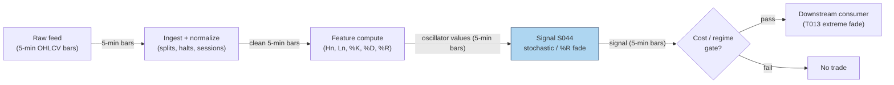

## Stage 44/200 — S044: Stochastic oscillator & Williams %R

*Batch SB5 · Signal 44/100 · Provenance [D] · Family C — Intraday Mean Reversion & Reversal*

### S1. One-line verdict

| What it is | When it works | When it dies | Build-or-buy in one line |
|---|---|---|---|
| Two bounded (0–100 / −100–0) oscillators measuring where the close sits inside the recent high–low range; fade overbought/oversold extremes on %K/%D crosses | Clean trading ranges where closes oscillate between well-defined highs and lows | Trends (it pins at extremes and fades the whole move), news jumps, and any tape where the "range" is one expanding bar | Build: textbook formulas on any OHLC feed; nothing to buy |

Provenance: **[D]** (documented — George Lane's stochastic oscillator, 1950s; Larry Williams' %R, 1970s; formulas and 14/80/20 conventions are the published standards). Family C — Intraday Mean Reversion & Reversal.

### S2. How it works — plain human explanation

Both indicators answer one question: *where did we close inside the recent trading range?* The **stochastic oscillator**'s raw value, **%K**, is the close's position as a percentage of the last *n* bars' high–low range: 100 means we closed at the very top of the range, 0 at the very bottom. **%D** is just a 3-bar moving average of %K — a smoothing that turns the twitchy %K into a signal line. **Williams %R** is the same idea on an inverted scale from −100 to 0: −100 means the close was the lowest low of the last *n* bars, 0 means it was the highest high. (In fact, %R is algebraically the mirror of raw %K — more on that in S3.)

The trading logic is pure mean-reversion folklore: in a *trading range* — a market bouncing between support and resistance rather than trending — closes that press against the top of the range tend to rotate back down, and closes crushed against the bottom tend to bounce. So the canonical rules: **short when %K crosses down through %D while above 80** (overbought — the market is trading near the top of its range and losing momentum), **long symmetrically when %K crosses up through %D below 20** (oversold). For Williams %R: fade when %R pushes above −20 (overbought) or below −80 (oversold) and turns.

Why should it work at all? In a range, the range boundaries are where resting liquidity sits — sellers reload at resistance, buyers at support — and where short-horizon mean-reversion flows (market-maker inventory, stat-arb) lean hardest. The oscillator is just a normalized way of saying "we're at the edge of the recent range, where the other side usually shows up."

The honest counterweight, stated up front because this chapter must not oversell oscillator edges after costs: in a *trend*, the range keeps expanding in the trend's direction and these oscillators pin at their extremes for bar after bar, generating a fade signal against every new high. The indicator cannot distinguish "overbought in a range" from "strong in a trend" — that distinction has to come from a regime filter outside the indicator.

**Mental model:**
- %K/%D and %R are *position-in-range* gauges, not predictors — they tell you where you are, not where you're going.
- The edge, such as it is, lives entirely in the *range assumption*: right in ranges, systematically wrong in trends.
- Use them as *exhaustion timing* (when to fade) inside a larger structure, never as a standalone directional system.

### S3. The math — exact formula

Over the last $n$ bars, let $H_n = \max H_i$ and $L_n = \min L_i$ be the highest high and lowest low. With close $C_t$:

$$\%K_t = 100 \cdot \frac{C_t - L_n}{H_n - L_n} \qquad \text{(raw / "fast" \%K)}$$

$$\%D_t = \mathrm{SMA}(\%K_t, 3) \;\; \text{(SMA = simple moving average)} = \frac{\%K_t + \%K_{t-1} + \%K_{t-2}}{3}$$

$$\text{Williams } \%R_t = -100 \cdot \frac{H_n - C_t}{H_n - L_n}$$

Note the identity: $\%R_t = \%K_t - 100$. They are the same measurement on a flipped scale — running both is redundancy, not diversification, unless you use different lookbacks.

Trading rules (*thresholds are examples — not institutional standards*; the 14/80/20/−80/−20 conventions are Lane/Williams' published defaults, which is why this chapter keeps [D]):

$$\text{Short fade: } \%K_{t-1} \ge \%D_{t-1} \text{ and } \%K_t < \%D_t \text{ with } \%K_t > 80$$
$$\text{Long fade: } \%K_{t-1} \le \%D_{t-1} \text{ and } \%K_t > \%D_t \text{ with } \%K_t < 20$$
$$\text{\%R fade: short as \%R turns down from above } -20\text{; long as \%R turns up from below } -80$$

| Parameter | Symbol | Typical range | Too small | Too large | Default (*example*) |
|---|---|---|---|---|---|
| Lookback | $n$ | 9–20 bars | Twitchy; whipsaw crosses on noise | Lags; the range includes ancient history | 14 (Lane/Williams default) |
| %D smoothing | — | 3–5 bars | Barely smoother than %K | Signal arrives after the turn | 3 |
| Overbought | — | 70–90 (stoch) / −30–−10 (%R) | Constant false overbought reads | Never fires | 80 / −20 |
| Oversold | — | 10–30 (stoch) / −90–−70 (%R) | Never fires | Fires mid-plunge repeatedly | 20 / −80 |

**Causal timing:** $\%K_t, \%D_t, \%R_t$ are computed at bar $t$'s close using bars $t-n+1 \ldots t$ only; the crossover is confirmed at the close, so the earliest fill is bar $t+1$'s open. Note %D needs 3 bars of %K and %K needs $n$ bars — the first tradable bar is $t \ge n+2$.

**Named variants:**
1. **Fast vs slow stochastic** — "fast" uses raw %K with %D as the signal line; "slow" smooths %K first (typically SMA-3) and then smooths again for %D. Slow generates fewer, later signals; a documented study (S9) found fast outperformed slow in most markets tested.
2. **Stochastic RSI (Relative Strength Index) / %R with different lookbacks** — practitioners often run %R(14) against Stoch(14,3) for confirmation; as shown above they're near-duplicates, so the honest variant is *different* lookbacks, not different names.
3. **Divergence** — price makes a new high but %K doesn't (bearish divergence); a discretionary overlay, not a rule in this chapter's formula.

### S4. Worked example — step-by-step numbers (SYNTHETIC)

Synthetic 24-bar 5-minute tape, seed **44**: an 18-bar grind up (so %D is well established), then a rollover. %K/%D use $n{=}14$, %D = SMA(%K, 3). Synthetic data — not market data; the chart plots exactly these numbers.

| bar | O | H | L | C | %K(14) | %D | %R(14) | signal |
|---|---|---|---|---|---|---|---|---|
| 9 | 101.70 | 102.08 | 101.70 | 101.89 | — | — | — | |
| 10 | 101.96 | 102.29 | 101.96 | 102.12 | — | — | — | |
| 11 | 102.21 | 102.54 | 102.21 | 102.37 | — | — | — | |
| 12 | 102.42 | 102.75 | 102.42 | 102.58 | — | — | — | |
| 13 | 102.67 | 103.04 | 102.67 | 102.84 | — | — | — | |
| 14 | 102.89 | 103.26 | 102.89 | 103.08 | 94.7 | — | −5.3 | |
| 15 | 103.13 | 103.48 | 103.13 | 103.30 | 94.8 | — | −5.2 | |
| 16 | 103.33 | 103.67 | 103.33 | 103.51 | 95.4 | 95.0 | −4.6 | |
| 17 | 103.58 | 103.97 | 103.58 | 103.78 | 94.3 | 94.8 | −5.7 | **SHORT cross** |
| 18 | 103.85 | 104.18 | 103.85 | 104.02 | 95.1 | 94.9 | −4.9 | |
| 19 | 103.61 | 103.61 | 103.23 | 103.42 | 75.9 | 88.4 | −24.1 | |
| 20 | 103.22 | 103.22 | 102.85 | 103.02 | 60.7 | 77.2 | −39.3 | |
| 21 | 102.80 | 102.80 | 102.47 | 102.64 | 43.3 | 60.0 | −56.7 | |
| 22 | 102.48 | 102.48 | 102.10 | 102.28 | 23.5 | 42.5 | −76.5 | |
| 23 | 102.06 | 102.06 | 101.71 | 101.87 | 6.3 | 24.4 | −93.7 | |
| 24 | 101.68 | 101.68 | 101.34 | 101.50 | 5.8 | 11.9 | −94.2 | |

Step-by-step at the trigger bar: at bar 16's close, %K = 95.4 ≥ %D = 95.0 (the 3-bar SMA of the unrounded %K values). At bar 17's close, %K = 94.3 < %D = 94.8 — a cross down, with %K at 94.3 > 80 (*example* overbought line) → **short fade**. Williams %R confirms the overbought read: −5.7, inside the −20 line. Earliest fill: bar 18's open at 103.85. (%R = %K − 100 holds in every row — the check the table invites.)

**The bar-18 adverse move.** The fade does not go straight down. Bar 18 extends *against* the short: it prints H 104.18 (+0.33 above the 103.85 entry) and closes 104.02 — the position is −0.17 underwater at bar 18's close. Only at bar 19 does the rollover begin (O 103.61, C 103.42). Cover example: bar 20's close at 103.02 → gross **+0.83 = +80 bps** (basis points, 1 bp = 0.01%) before costs — the fade survives the adverse excursion and catches the first leg of the rollover. This is why the chapter insists on stops and sizing: a mechanical fade with no adverse-move budget is stopped out exactly at bar 18.

**What to notice:** the cross at bar 17 is *marginal* — %K 94.3 vs %D 94.8, a 0.5-point cross. That's deliberate pedagogy: textbook crosses are often this thin, and a production rule needs a minimum cross magnitude or %R-confirmation to avoid trading dust. Also note %R collapses to −94.2 by bar 24 — deep "oversold" — while price is still falling: the classic pinned-at-the-extreme behavior that punishes mechanical fading without a regime check. This toy tape has no spread, no fees, and a conveniently clean rollover; nothing here is a performance claim.

### S5. Strategies that use this signal

- **T013 — RSI-2 / IBS Extreme Fade** — *primary oscillator-fade consumer (genuine fit)*: Connors-style oversold/overbought fading combining RSI-2 and IBS (internal bar strength); the %K/%D crossover and %R extremes are the natural timing overlay for its fade entries.
- **T062 — Streak Runner with Exhaustion Flip** — *conceptual-fit reference (not a plan-defined consumer — labeled as conceptual)*: a %K-cross-down-above-80 or %R-above-−20 rollover is exactly the kind of exhaustion signature T062's flip leg needs to time its reversal; the fit is conceptual, not specified in the plan.
- Related signals (same family): **S042** (RSI-2) and **S043** (IBS) are the sibling extreme-fade oscillators; **S045** (stretched-move z-score) is the vol-normalized cousin of the same "too far, too fast" idea.

### S6. Data required — exact spec

| Field | Type | Granularity | Source tier | Notes |
|---|---|---|---|---|
| Open, high, low, close | float | 5–15 min bars (intraday) | Tier 0–1 | Any OHLCV vendor; SIP (Securities Information Processor — the consolidated feed) is fine |
| Session calendar / halts | reference | event | Tier 0–1 | Don't span the lookback across halts or overnight gaps |
| Corporate actions | reference | event | Tier 0–1 | Unadjusted splits corrupt $H_n/L_n$ for $n$ bars |

Ingest sketch (≤20 lines):

```python
import polars as pl
N = 14
df = (pl.read_parquet("bars_5m/*.parquet").sort(["symbol","ts"])
        .with_columns(Hn = pl.col("H").rolling_max(N).over("symbol"),
                      Ln = pl.col("L").rolling_min(N).over("symbol")))
df = df.with_columns(pctK = 100*(pl.col("C")-pl.col("Ln"))/(pl.col("Hn")-pl.col("Ln")),
                     pctR = -100*(pl.col("Hn")-pl.col("C"))/(pl.col("Hn")-pl.col("Ln")))
df = df.with_columns(pctD = pl.col("pctK").rolling_mean(3).over("symbol"))
```

Storage: 5-min bars are ~78 bars/day/symbol — per cost-model §4, 500 symbols of 1-min bars is ~50 MB/day; 5-min is ~5× smaller. Trivial; archive freely.

Data-quality checklist: split-adjustment before computing $H_n/L_n$ (one unadjusted split poisons the range for the full lookback), halt handling (freeze, don't bridge), DST/half-day session boundaries, illiquid names where $H_n = L_n$ prints (division by zero — guard it).

### S7. Local build on M5 Max / 128GB

**Feasibility: trivial.** Rolling max/min/mean over 14 bars is O(1)-amortized per bar with deques, or a single polars pass at ~10–50M rows/sec (cost-model §2) — a 60-day, 500-symbol 5-min recompute is milliseconds. The Mac will be idle.

Stack: **Python+polars** — pick it; this is a column-ops problem and nothing here needs Rust or a GPU.

RAM: per cost-model §3, 500 symbols × 60 days of 1-min bars ≈ 12 MB; 5-min bars ≈ 2–3 MB — roughly four orders of magnitude inside the 77 GB working budget.

Engineering: **Tier L, 4–12 h → $600–1,800** at the $150/hr loaded-cost estimate (cost-model §5). One line of justification: the formulas are textbook and the ingest is a rolling-window one-liner; the hours go to split/halt hygiene and deciding the zero-range guard.

What breaks first at 500 symbols or full OPRA (Options Price Reporting Authority): nothing — this signal never touches options or depth; the full US universe on 5-min bars remains a trivially small frame.

### S8. Buy vs build

| Option | What you get | Indicative price | What buying gains | What buying loses |
|---|---|---|---|---|
| Tier-0 free (Stooq, Alpaca IEX delayed) | Daily/15-min OHLC | ~$0 — *indicative, verify before budgeting* | $0 research data | Coarse for intraday crossover timing |
| Tier-1 retail (Polygon Stocks Advanced, Alpaca SIP) | 1-min + real-time SIP bars | ~$30–200/mo — *indicative, verify before budgeting* | Clean 5-min bars with corporate actions | Nothing material |
| Tier-2 professional (Databento) | Normalized OHLCV, venue detail | ~$200/mo + usage — *indicative, verify before budgeting* | Venue-stamped bars if you ever care | Overkill for range oscillators |
| Charting platform (TradingView-style) | Built-in Stochastic / %R studies | ~$15–60/mo — *indicative, verify before budgeting* | Zero-code visualization | Not a research source of record: opaque revisions, no replay, no audit |

**Verdict: build.** Two textbook formulas on bars you already buy for every other signal. The crossover point is simply "you have 5-min bars," which is every tier at or above free. Never pay for the indicator itself — and never use a screener's precomputed oscillator values as research inputs (you can't audit their lookback or bar-revision handling).

### S9. Success ratio / efficacy — documented evidence

| Study / source | Market & period | Metric | Before/after cost | Caveat |
|---|---|---|---|---|
| Chong et al., "Performance of Stochastic Oscillators" (MPRA 80559) | Multiple markets (paper's universe) | Fast stochastic outperformed slow stochastic in most markets studied | As reported in the paper — cost treatment not verified from available materials; treat as before-cost unless the paper states otherwise | Compares indicator *variants*, not oscillator-vs-cash; says nothing about net profitability |
| Paik et al. (2024), "Algorithm-Based Low-Frequency Trading Using a Stochastic Oscillator and William%R", *JRFM* | SPY + MSCI Korea ETF, 2010–2022 | 8 trades in 12 years, 87.5% hit ratio, max gain +28.7%, max drawdown −0.1% | Before-cost as reported — the paper does not model transaction costs (and a reviewer noted the parameter choices lack theoretical basis) | Weekly/low-frequency system (~1.5 trades/year), not intraday; 8 trades is far too few for statistical confidence; index-level, not single-name |

Regimes where it fails: trends (the documented killer — %K pins above 80 through entire legs up, %R pins near 0); news jumps (the range explodes and the oscillator reads "overbought" into a repricing); low-volatility grinds (the range is tiny, so %K whipsaws 0–100 on penny moves); crowded retail symbols where every fade is faded by someone faster.

**Honest bottom line — and this chapter will not oversell it:** there is *no documented after-cost intraday edge* for stochastic/%R fades as a standalone trigger in the sources found. What is documented: the formulas are standard, variant comparisons exist, and one low-frequency paper reports attractive before-cost numbers on 8 trades. As a standalone trigger this is a *weak, unproven-after-cost* edge; as an *exhaustion-timing overlay* inside T013-style fades or T062-style flips — telling you *when* within an already-justified fade — it is a *reasonable, cheap component*.

### S10. Failure modes & pitfalls

1. **Trend-pinning** — the #1 killer: fading every new high in a trend. *Mitigation:* regime-gate — only take fades when a trend filter (e.g. ADX — average directional index, a 0–100 trend-strength gauge — or price within a defined range for N bars) says "range."
2. **Look-ahead on the cross** — acting on a developing bar's %K before the close fixes $H_n/L_n$. *Mitigation:* confirm crosses at bar close; trade next bar's open.
3. **Zero-range division** — $H_n = L_n$ on dead names → division by zero. *Mitigation:* guard: if range is zero, hold the prior value and skip signals.
4. **Parameter mining** — 14/80/20 "works" because everyone uses it; optimizing to 11/73/27 on one symbol is overfitting. *Mitigation:* keep the published defaults or calibrate on a broad universe with out-of-sample validation.
5. **Cost blowup** — oscillators on 1-min bars can fire several times a day; each fade pays the full spread at the worst moment (you're providing liquidity to momentum). *Mitigation:* model full spread-crossing cost + fees + slippage/impact; require expected rotation > 3× cost; prefer 5–15 min grids.
6. **Redundant confirmation** — %R ≈ %K − 100, so "both agree" is one signal counted twice. *Mitigation:* if you want confirmation, use an *independent* input (volume, or S045's vol-normalized z) — not the same range repackaged.
7. **News-jump misreads** — a gap reprices the range; the oscillator screams overbought into a new equilibrium. *Mitigation:* suppress signals for N bars after jumps (S064-style jump filter) or on news-flagged symbols.
8. **Thin-cross trading** — the worked example's 0.5-point cross is typical; trading dust crosses churns. *Mitigation:* require a minimum cross magnitude (e.g. 2 points, *example*) or %R beyond its line as confirmation.

### S11. Visuals




### S12. Sources

- Chong, T.T.L. et al. *Performance of Stochastic Oscillators.* MPRA Paper 80559. https://mpra.ub.uni-muenchen.de/80559/1/MPRA_paper_80559.pdf
- Paik, J. et al. (2024). *Algorithm-Based Low-Frequency Trading Using a Stochastic Oscillator and William%R: A Case Study on the U.S. and Korean Indices.* J. Risk Financial Manag. 17(3), 92. https://www.mdpi.com/1911-8074/17/3/92/
- Barchart. *Williams Percent Range — education/technical indicators* (formula, −80/−20 conventions, n=14 default). https://Www.barchart.com/education/technical-indicators/percent_r
- Barchart. *Stochastic Slow — trader help/studies* (raw %K, %K/%D smoothing conventions; "%R is the inverse of fast stochastics"). https://www.barchart.com/trader/help/studies/stoch_s.php
- Jegadeesh, N. (1990). *Evidence of predictable behavior of security returns.* Journal of Finance 45(3), 881–898. http://ideas.repec.org/a/bla/jfinan/v45y1990i3p881-98.html — Significant negative first-order serial correlation in monthly returns: short-term reversal predictability that oscillator overbought/oversold rules attempt to time.
- Lehmann, B. N. (1990). *Fads, martingales, and market efficiency.* Quarterly Journal of Economics 105(1), 1–28. https://econpapers.repec.org/RePEc:oup:qjecon:v:105:y:1990:i:1:p:1-28. — Weekly winners/losers reverse the next week, net of spreads and costs: attributed to inefficiency in the market for liquidity around large price moves, the mechanism behind oscillator fade setups.

**Unverified leads** (chatbot-provided, not independently checkable — do not treat as evidence):
- Duck.ai (GPT-5.6 Luna, anonymous, 2026-09-10), Q-SB5-1: Keltner/Bollinger formulas and the 30-bar worked tape whose verified z-score material (z=+4.36, σ=0.3923) is reused in S045 — arithmetic verified by the operator, not independently re-derived here. Full text in `batches/SB5/duckai-answers.md`; Grok/Cursor answers pending (checked 2026-09-10).
