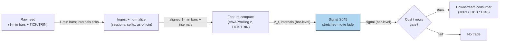

## Stage 45/200 — S045: Stretched-move z-score & market-internals extremes

*Batch SB5 · Signal 45/100 · Provenance [SR] · Family C — Intraday Mean Reversion & Reversal*

### S1. One-line verdict

| What it is | When it works | When it dies | Build-or-buy in one line |
|---|---|---|---|
| Measures how many realized-vol units price has stretched from its session anchor (VWAP or rolling mean); fades multi-sigma moves lacking volume/news, confirmed by market-wide TICK/TRIN extremes | Liquidity-driven excursions in liquid names — fast spike, no news, volume not confirming | News-driven repricings, trending opens, and illiquid names where "3 sigma" is just the spread | Build the z-score on bars you own; buy the internals feed (TICK/TRIN) if you want the market-wide leg |

Provenance: **[SR]** (standard reconstruction — the z-score mean-reversion template is textbook; the VWAP-session anchoring, the 2–3σ thresholds, and all internals levels are desk-specific examples, not institutional standards). Family C — Intraday Mean Reversion & Reversal.

### S2. How it works — plain human explanation

A **z-score** is a distance measured in units of typical wiggle: "price is 3 standard deviations above its anchor" means the move is 3× bigger than the recent norm. The anchor here is usually the session **VWAP** — the volume-weighted average price, i.e. the average price paid by everyone who traded today, weighted by size — or a rolling mean. The ruler is **realized volatility** — volatility measured from actual recent price changes, not implied from options.

The economic story: most violent intraday spikes are *liquidity excursions*, not information. A large seller dumps into thin midday liquidity, price lurches 3 sigma in ten minutes, but nothing fundamental changed — no news, no expanding volume, no market-wide participation. Liquidity providers step back, the order book refills, and price drifts back toward where the day's volume actually traded (VWAP). Fading the stretch — selling the spike, buying the plunge — harvests that snap-back. The confirmation that it's *liquidity* rather than *news* is what keeps you alive: volume should be flat or falling into the extreme, and there should be no headline.

The second leg is **market internals** — market-wide, not single-name, extremes. **TICK** is the number of NYSE stocks ticking up minus the number ticking down, right now: a real-time breadth pulse. Readings beyond ±800 to ±1,000 (*desk-specific example*) mark intraday capitulation. **TRIN** (the Arms index, short for TRading INdex) is (advancing stocks ÷ declining stocks) ÷ (advancing volume ÷ declining volume): above 1.0 means declining volume dominates — bearish; spikes mark panic. When your single-name z-score screams *and* TICK prints −1,000, you're fading a market-wide flush — the highest-probability version of this trade.

A vignette: at 13:42 XYZ spikes from 100.20 to 102.00 in one 5-minute bar on 2,500 shares — barely above its recent average. No headline. The 20-bar z-score prints +4.36 while NYSE TICK tags −950. You short the spike: a liquidity air-pocket, with the single-name ruler and the market-wide pulse agreeing it's exhaustion, not repricing.

**Mental model:**
- The z-score separates *big moves* (common) from *statistically unusual moves* (rare) — you only fade the unusual ones.
- "Unusual" is necessary but not sufficient: the *cause* filter (no news, no volume expansion) is what keeps you from fading a genuine repricing.
- Internals turn a single-name guess into a market-structure read: capitulation is a crowd phenomenon, and TICK/TRIN measure the crowd.

### S3. The math — exact formula

**Session-anchored z (source reconstruction):**

$$z_t = \frac{P_t - \mathrm{VWAP}_{session,t}}{\sigma_{realized} \cdot \sqrt{t}}$$

where $P_t$ is the current price (mid or last), $\mathrm{VWAP}_{session,t} = \sum_{i \le t} P_i V_i / \sum_{i \le t} V_i$ is the session volume-weighted average price, $\sigma_{realized}$ is per-bar realized volatility (e.g. the standard deviation of recent 1-min returns, annualized or per-bar consistently), and $t$ is elapsed session time in bars — the $\sqrt{t}$ term scales the ruler for how far price can normally wander by time $t$ under a random walk.

**Rolling z (the worked example's variant):**

$$z_t = \frac{C_t - \mu_t(N)}{\sigma_t(N)}, \qquad \mu_t(N) = \frac{1}{N}\sum_{i=t-N+1}^{t} C_i, \;\; \sigma_t(N) = \sqrt{\frac{1}{N}\sum_{i=t-N+1}^{t}(C_i - \mu_t)^2}$$

(population standard deviation; the window *includes* bar $t$ — the completed-bar convention, with the caveat dissected in S10).

**Trade rule** (*thresholds are examples — not institutional standards*):

$$\text{Fade when } |z_t| > z_{entry} \text{ (e.g. 2.0–3.0) AND volume is NOT expanding AND no news flag;}$$
$$\text{cover when } z_t \to 0 \text{ or at a time stop (e.g. 30–60 min).}$$

**Market internals:**

$$\mathrm{TICK}_t = \#\{\text{NYSE stocks on an uptick}\} - \#\{\text{NYSE stocks on a downtick}\}$$
$$\mathrm{TRIN}_t = \frac{\text{Advances}_t / \text{Declines}_t}{\text{AdvancingVolume}_t / \text{DecliningVolume}_t}$$

Fade triggers (*desk-specific examples*): $|\mathrm{TICK}| > 800$–$1{,}000$; TRIN spiking well above 1.0 (panic selling) or collapsing below ~0.7 into a buying climax.

| Parameter | Symbol | Typical range | Too small | Too large | Default (*example*) |
|---|---|---|---|---|---|
| Entry z | $z_{entry}$ | 1.5–3.0 | Fades normal noise; churns on spread | Waits for once-a-week events | 2.0 |
| Lookback | $N$ | 15–60 bars | Ruler too twitchy; z whipsaws | Ruler stale; misses regime shifts | 20 |
| Anchor | — | session VWAP / rolling mean | — | — | rolling mean (worked ex.) |
| Time stop | — | 15–90 min | Exits before snap-back | Holds a repricing all afternoon | 45 min |
| TICK extreme | — | 500–1,500 | Constant false capitulations | Never fires | ±800 |

**Causal timing:** $z_t$ uses bars $\le t$ only (the VWAP variant needs the session's volume tape to date — no future bars); the fade is entered at bar $t+1$'s open at the earliest. TICK/TRIN are real-time but vendor-delayed — know your feed's latency (often 1–15 minutes on retail feeds, which can make the "confirmation" arrive after the turn).

**Named variants:**
1. **VWAP-session z** (source formula) vs **rolling z** (worked example) — VWAP anchors to the day's actual traded value; rolling mean adapts faster but has no economic anchor.
2. **Return-based z** — $r_t(M) = \ln(C_t/C_{t-M})$, z-scored over its own history; measures *velocity* rather than *displacement*.
3. **Internals composite** — z-score AND (TICK extreme OR TRIN spike); the capitulation filter that upgrades a single-name fade to a market-structure fade.

### S4. Worked example — step-by-step numbers (SYNTHETIC)

This worked example reuses the operator-verified 30-bar synthetic tape (seed **45**; every number below was hand-checked — $\mu_{20} = 100.29$, $\sigma_{20} = 0.3923$, $z_{30} = +4.36$). Construction: bars 1–10 closes ramp 100.00 → 100.50 (step 0.50/9); bars 11–29 close at 100.20 on declining volume; bar 30 prints O 100.20, H 102.50, L 100.00, C 102.00 on 2,500 shares. Rolling 20-bar z, population std, window *including* the current bar. Synthetic data — not market data; the chart plots exactly this series.

| bar | C | $\mu_{20}$ | $\sigma_{20}$ | z | read |
|---|---|---|---|---|---|
| 20 | 100.20 | 100.2250 | 0.1156 | −0.22 | quiet |
| 21 | 100.20 | 100.2350 | 0.1037 | −0.34 | quiet |
| 22 | 100.20 | 100.2422 | 0.0957 | −0.44 | quiet |
| 23 | 100.20 | 100.2467 | 0.0915 | −0.51 | quiet |
| 24 | 100.20 | 100.2483 | 0.0903 | −0.54 | quiet |
| 25 | 100.20 | 100.2472 | 0.0907 | −0.52 | quiet |
| 26 | 100.20 | 100.2433 | 0.0910 | −0.48 | quiet |
| 27 | 100.20 | 100.2367 | 0.0890 | −0.41 | quiet |
| 28 | 100.20 | 100.2272 | 0.0821 | −0.33 | quiet |
| 29 | 100.20 | 100.2150 | 0.0654 | −0.23 | quiet |
| 30 | 102.00 | 100.2900 | 0.3923 | **+4.36** | **FADE (short)** |

Step-by-step at bar 30: $\mu = (19 \times 100.20 + 102.00)/20 = 100.29$; deviations $-0.09$ (×19, sq 0.0081 each = 0.1539) and $+1.71$ (sq 2.9241); sum 3.0780; population variance $3.0780/20 = 0.1539$; $\sigma = 0.3923$; $z = 1.71/0.3923 = +4.36 > 2.0$ (*example* threshold) → short fade at bar 31's open (102.00). Volume check: 2,500 shares is elevated but not a climax versus the tape's 670–850 recent prints — no volume *expansion* confirming new information; stipulate no news flag. Hypothetical exit (labeled as such — the tape ends at bar 30): cover half at $z \to +1.0$ (~100.68) and the rest on the 45-minute time stop; a full snap-back to 100.68 would be +1.32 ≈ +129 bps before costs. The honest version: you'd more likely cover into a partial retrace for +30–60 bps, and sometimes the "excursion" keeps going.

**What to notice:** bars 20–29 show the ruler *shrinking* ($\sigma$ 0.1156 → 0.0654) as the tape goes dead — low-volatility compression is what makes bar 30 read +4.36 rather than +1.5. That's the mechanism *and* the trap: a compressed ruler makes everything look extreme. This toy tape has no fees, no spread, and no bar 31 — the exit is illustrative, not a backtest. Nothing here is a performance claim.

**Methodology caveat (mandatory):** this example computes the window *including* bar 30. Recomputed on a strictly *prior-only* window (bars 10–29): $\mu = 100.2150$, $\sigma = 0.06538$, $z = +27.30$ — a wildly different number from the same bar. Mixing inclusion/exclusion conventions across indicators at the same bar is a live-implementation pitfall: pick one convention (completed-bar including current, or strictly prior), document it, and make the backtest and the live engine match exactly. See S10.

### S5. Strategies that use this signal

- **T063 — Stretched-Move Z-Score Fade** — *primary entry trigger (direction)*: the strategy is this signal — fades multi-sigma intraday moves with resiliency-timed exits (S048) and spread-decomposition cost gating (S014).
- **T013 — RSI-2 / IBS Extreme Fade** — *co-trigger (genuine fit)*: the plan lists S045 among T013's signals — the z-score provides the vol-normalized "how stretched" read alongside RSI-2/IBS extremes.
- **T048 — Put/Call Ratio Contrarian** — *context input (genuine fit)*: the plan lists S045 as stretched-move/sentiment context for fading extreme put/call readings.

### S6. Data required — exact spec

| Field | Type | Granularity | Source tier | Notes |
|---|---|---|---|---|
| Mid/last price, volume | float/int | 1–5 min bars | Tier 0–1 | Any intraday feed; SIP consolidated fine |
| Session VWAP | derived | per-bar cumulative | Tier 0–1 | Needs the full session volume tape to date |
| Realized vol (per-bar σ) | derived | rolling | Tier 0–1 | From the same bars — no extra feed |
| NYSE TICK | int | real-time tick | Tier 1–2 | dxFeed, Databento, broker feeds; know the delay |
| TRIN / advance-decline + adv/dec volume | float | real-time | Tier 1–2 | Same vendors; definitions vary slightly — pin yours |
| News flag | boolean | event | Tier 2 | Benzinga-class headline feed to enforce the no-news filter |

Ingest sketch (≤20 lines):

```python
import polars as pl
N = 20
b = (pl.read_parquet("bars_1m/*.parquet").sort(["symbol","ts"])
       .with_columns(mu = pl.col("C").rolling_mean(N).over("symbol"),
                     sd = pl.col("C").rolling_std(N, ddof=0).over("symbol")))
b = b.with_columns(z = (pl.col("C") - pl.col("mu")) / pl.col("sd"))
# internals: as-of join the slower TICK feed onto bar times
tick = pl.read_parquet("internals_tick/*.parquet").sort("ts")
b = b.join_asof(tick, on="ts", strategy="backward")  # TICK known at bar close only
```

Storage: 1-min bars per cost-model §4 — 500 symbols ≈ 50 MB/day Parquet, 60 days ≈ 3 GB; internals are a single market-wide series — negligible. Archive freely.

Data-quality checklist: bar timestamp vs internals timestamp alignment (the as-of join is the whole game), vendor TICK delay disclosure, VWAP session-boundary definition (regular session only), corporate actions before z computation, half-day sessions (the $\sqrt{t}$ scaling needs the right $t$).

### S7. Local build on M5 Max / 128GB

**Feasibility: trivial** for the bar-based z-score; **feasible** with the internals leg. Rolling mean/std over 20 bars is O(1)-amortized per bar; per cost-model §2, polars does ~10–50M rows/sec on simple column ops — the entire 500-symbol 60-day 1-min universe (11.7M rows) z-scores in about a second. The internals join is one as-of per bar. Bottleneck: none on compute — it's feed latency on TICK/TRIN that matters, not FLOPS.

Stack: **Python+polars** — pick it. Rust only if you're already running an event-driven book; nothing in this signal needs it.

RAM: per cost-model §3, 500 symbols × 60 days of 1-min bars ≈ 12 MB — four orders of magnitude inside the 77 GB working budget. Even 5 years of 1-min bars for calibrating the $z_{entry}$ threshold fits comfortably.

Engineering: **Tier L, 4–12 h → $600–1,800** at the $150/hr loaded-cost estimate (cost-model §5). One line of justification: the z-score is a rolling-window one-liner; the hours go to the no-news filter wiring, the internals as-of join, and pinning the bar-inclusion convention (S10) identically in research and live.

What breaks first at 500 symbols or full OPRA: the internals leg doesn't scale per-symbol (it's one market-wide series — fine); what breaks is *expectation* — 500 independent z-fades without portfolio-level heat control become one large correlated bet on calm markets.

### S8. Buy vs build

| Option | What you get | Indicative price | What buying gains | What buying loses |
|---|---|---|---|---|
| Tier-0 free (Stooq, Alpaca IEX delayed) | Daily/15-min bars | ~$0 — *indicative, verify before budgeting* | $0 data | Too coarse for a 20-bar intraday z |
| Tier-1 retail (Polygon, Alpaca SIP) | 1-min + real-time SIP bars | ~$30–200/mo — *indicative, verify before budgeting* | Clean bars for the z computation | Usually no TICK/TRIN feed |
| Tier-2 (Databento / dxFeed / broker) | Bars + market-internals (TICK, TRIN, adv/dec) | ~$200/mo + usage — *indicative, verify before budgeting* | The internals leg with timestamps you can audit | Still check the vendor's TICK delay |
| Academic/institutional (TAQ + NYSE internals history) | Publication-grade replay | institutional $$$$ — *indicative, verify before budgeting* | Point-in-time internals research | Vast overkill for a Tier-L signal |

**Verdict: hybrid — build the z-score, buy the internals feed.** The crossover: the z-score itself is 5 lines on bars you already own (never pay for it); the TICK/TRIN series you cannot reconstruct from SIP bars, so buy it from a Tier-1/2 vendor once you trade the internals-confirmed variant. Start with the single-name z (Tier-0/1 data, $0–200/mo) and only add the internals subscription when the confirm-filter proves its worth in replay.

### S9. Success ratio / efficacy — documented evidence

| Study / source | Market & period | Metric | Before/after cost | Caveat |
|---|---|---|---|---|
| "Trends and Reversion in Financial Markets on Time Scales from Minutes to Decades" (arXiv:2501.16772, 2025) | Minute-bar data, multiple markets | Intraday mean reversion statistically strong — regression linear coefficient negative with t ≈ −13.6 at short horizons, after discounting tick-size effects | Before-cost (informational regression — not a trading P&L) | Documents the *statistical* phenomenon, not a monetizable rule; says nothing about spread, impact, or timing |
| Wood, Roberts & Zohren (2021), "Slow Momentum with Fast Reversion" (arXiv:2105.13727) | 50 liquid futures, 1990–2020 | Adding a fast mean-reversion module to a time-series-momentum strategy improved Sharpe by ~one-third (≈ two-thirds in 2015–2020) | As reported by the authors — verify the paper's cost treatment before treating as after-cost | Futures portfolio, daily-ish horizon, ML pipeline — supportive of the *idea* that fast reversion adds value, not of any specific z-threshold |

Regimes where it fails: news-driven repricings (the #1 killer — the z-score can't tell a liquidity air-pocket from an earnings surprise; that's what the no-news filter is for); trending opens where "stretched" keeps stretching all day; volatility-regime shifts where the backward-looking $\sigma$ understates the new normal and every z is overstated; illiquid names where 3 sigma is one wide spread.

**Honest bottom line:** the *statistical* fact of intraday mean reversion is well documented — as a standalone trigger this is a *moderate, real-but-thin* edge whose monetization lives or dies on two things the formula doesn't contain: the cause filter (news/volume) and the exit timing (resiliency). Before costs the phenomenon is real; after spread-crossing on entry *and* exit plus the occasional news-driven blowup, the public evidence supports "structural component of T063," not "standalone money machine."

### S10. Failure modes & pitfalls

1. **Bar-inclusion convention mismatch (mandatory caveat)** — the worked example shows it: including-bar-30 gives $z = +4.36$; prior-only gives $z = +27.30$. A backtest on one convention and a live engine on the other is a different strategy. *Mitigation:* pick one convention, document it, assert it in both code paths with a unit test.
2. **Fading news** — the z-score's blindness to *why* is its deepest flaw. *Mitigation:* hard no-news filter (halt-reopen and headline-flagged symbols excluded); require volume *not* expanding.
3. **Compressed-ruler false extremes** — dead tapes shrink $\sigma$ until everything reads extreme. *Mitigation:* floor $\sigma$ at a multiple of the spread or a longer-horizon vol estimate; don't trade z on dormant names.
4. **Stale/vol-of-vol underestimation** — after a regime shift the backward $\sigma$ is too small and z overstates. *Mitigation:* use a vol estimator with faster adaptation (or a vol-regime gate) around events.
5. **Internals latency** — retail TICK feeds can lag 1–15 minutes; the "confirmation" arrives after the turn. *Mitigation:* measure your feed's delay in replay; if the lag kills the P&L, drop the internals leg rather than trading stale confirmation.
6. **Cost blowup (double spread-cross)** — you cross the spread entering *against* momentum and again covering — often 2× the cost of a momentum trade for a smaller expected move. *Mitigation:* model full round-trip spread + fees + impact; require expected snap-back > 4× cost; prefer limit orders on the exit.
7. **Correlated-book risk** — 500 z-fades are one bet on "today is calm"; on a crash day they all trigger together. *Mitigation:* portfolio heat limits and a market-wide kill switch (e.g. halt new fades when |TICK| is extreme *against* your book).
8. **Overfitting $z_{entry}$** — 2.0 vs 2.5 will always "optimize" in-sample. *Mitigation:* calibrate the threshold on a broad universe and out-of-sample years; prefer the economically anchored VWAP variant over the most-tunable rolling one.

### S11. Visuals




### S12. Sources

- *Trends and Reversion in Financial Markets on Time Scales from Minutes to Decades.* arXiv:2501.16772 (2025). https://arxiv.org/pdf/2501.16772.pdf
- Wood, K., Roberts, S. & Zohren, S. (2021). *Slow Momentum with Fast Reversion: A Trading Strategy Using Deep Learning and Changepoint Detection.* arXiv:2105.13727. https://arxiv.org/abs/2105.13727v2
- TRIN (Arms index) — definition and formula: (advances/declines) ÷ (advancing volume/declining volume); <1.0 bullish, >1.0 bearish. https://en.wikipedia.org/wiki/TRIN_(finance)

**Unverified leads** (chatbot-provided, not independently checkable — do not treat as evidence):
- Duck.ai (GPT-5.6 Luna, anonymous, 2026-09-10), Q-SB5-1: the 30-bar worked tape reused in S4 — arithmetic operator-verified (z=+4.36, σ=0.3923, IBH/IBL=101.20/99.80), with the methodology caveat (mixed bar-inclusion conventions) flagged in S10. Q-SB5-3: "fade works best when the move lacks volume/news confirmation" framing. Full text in `batches/SB5/duckai-answers.md`; Grok/Cursor answers pending (checked 2026-09-10).
