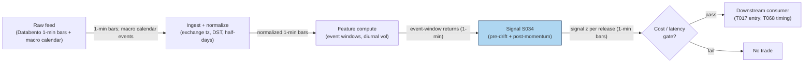

## Stage 34/200 — S034: Scheduled macro-announcement drift

*Batch SB6 · Signal 34/100 · Provenance [D] · Family C — Intraday Mean Reversion & Reversal*

### S1. One-line verdict

| | |
|---|---|
| **What it is** | Measures drift before a scheduled macro release (FOMC, CPI, payrolls) and continuation right after; trades the event window. |
| **When it works** | High-uncertainty regimes where pre-event risk premia are large; releases with a clear surprise that markets need minutes to digest. |
| **When it dies** | Leaked or fully anticipated prints; surprise sign opposite the pre-drift; crowded event trades; post-2015 the pre-FOMC drift largely disappeared. |
| **Build-or-buy in one line** | Build — the logic is 40 lines; buy the cleanest timestamped 1-min bars + a reliable calendar you can afford. |
| Provenance `[D]` · Family C | Documented in the report; citations: Ederington & Lee (1993). |

### S2. How it works — plain human explanation

**FOMC** (Federal Open Market Committee) is the Federal Reserve body that sets US interest rates; its statements land at a scheduled minute (e.g. 14:00 ET), and **CPI** (Consumer Price Index) and **payrolls** (the monthly US jobs report) land at scheduled minutes too. A **surprise** is the gap between the printed number and what markets expected. **Drift** here means a slow directional price move rather than a jump. **PEAD** (post-earnings-announcement drift) is the older, better-established cousin: after earnings surprises, prices keep drifting in the surprise direction for days (Ball & Brown; Bernard & Thomas).

The market vignette: at 13:00 ET, one hour before an FOMC statement, the S&P 500 e-mini sits at 6000.00 and prices often *drift* into the release — the pre-announcement drift. The story is risk compensation: investors demand a premium for holding inventory through the event. The statement drops at 14:00:00; the bulk of the repricing lands within the first minute (Ederington & Lee 1993), but volatility stays elevated ~15 minutes and prices can keep *continuing* in the surprise direction as the statement, dot plot, and press conference get parsed. That continuation is the signal's second leg.

Three mechanisms drive it: (1) **inventory/risk compensation** — dealers shade prices into scheduled uncertainty, creating drift; (2) **information diffusion** — complex releases take minutes to interpret, so the reaction is a process, not an instant; (3) **positioning cascades** — pre-event hedges unwind after the print, extending the move. The honest caveat, repeated in S9: the pre-announcement premium is *risk compensation with unknown sign* — it is not an exploitable directional prediction.

**Mental model:**
- Scheduled events are the market's few predictable volatility earthquakes — the timing is public, the direction is not.
- Pre-event drift is payment for bearing event risk, and its sign is unreliable; post-event continuation is payment for being the liquidity that absorbs the repricing.
- The first minute belongs to machines (latency race); minutes 2–30 belong to interpretation (this signal's hunting ground); hours later belongs to macro funds.

### S3. The math — exact formula

Let the release time be $\tau$. Define the **pre-window** $[\tau - W_{pre}, \tau)$ and the **post-window** $(\tau, \tau + W_{post}]$, measured in minutes on 1-min bars. Let $P(t)$ be the price at minute $t$.

Pre-announcement drift (log return):
$$R_{pre} = \log P(\tau^-) - \log P(\tau - W_{pre})$$

Announcement surprise proxy (first tradable move; the true surprise needs a survey/consensus feed):
$$R_{jump} = \log P(\tau + 2) - \log P(\tau^-)$$

Post-announcement continuation signal at minute $t > \tau$:
$$s(t) = \mathrm{sign}(R_{jump}) \cdot \mathbf{1}\left\{|R_{jump}| > \kappa \cdot \hat{\sigma}_{diurnal}(t)\right\}$$
where $\hat{\sigma}_{diurnal}(t)$ is the time-of-day-normalized 1-min volatility (see S067 diurnal deseasonalization) and $\kappa$ is a threshold. The traded return over the post-window is:
$$R_{post} = s(\tau{+}1) \cdot \left[\log P(\tau + W_{post}) - \log P(\tau + 1)\right] - \mathrm{costs}$$

**Parameter table** (every default is `example — not an institutional standard`):

| Parameter | Symbol | Typical range | Too small | Too large | Default example |
|---|---|---|---|---|---|
| Pre-window | $W_{pre}$ | 15–120 min (FOMC: 60) | noise dominates | mixes in unrelated trend | 60 min |
| Post-window | $W_{post}$ | 5–60 min | catches only the jump, no continuation | continuation fades, costs compound | 30 min |
| Jump threshold | $\kappa$ | 1.5–4.0 (diurnal σ) | trades noise jumps, churns | misses real surprises | 2.5 |
| Entry delay | — | 1–5 min after $\tau$ | filled at the violent first print | misses the move | 1 min |
| Max hold | — | 15–60 min | cuts continuation short | overnight/event-tail risk | 30 min |

**Normalization:** compare $R_{jump}$ and $R_{pre}$ against the *diurnal* (time-of-day) volatility, not a flat trailing σ — 14:00 on an FOMC day has a different baseline than 14:00 on a quiet Tuesday. A z-score form $z = R / \hat{\sigma}_{diurnal}$ is standard; raw returns are acceptable only inside a single event type.

**Causal timing:** the calendar gives $\tau$ in advance; $R_{pre}$ is computed at $\tau$ from bars $\le \tau$; $R_{jump}$ needs the first post-release prints, so the earliest tradable entry is $\tau + 1$ min. Entering *at* $\tau$ on the pre-drift sign is a different, riskier trade — you are betting the drift survives the release.

**Named variants:** (1) *Pre-drift capture* — trade only $R_{pre}$, flat before the print (avoids the jump). (2) *Post-continuation* — the form above. (3) *Vol-expansion straddle* — buy gamma/vol into the release sized by the expected move instead of direction (the bridge to T068).

### S4. Worked example — step-by-step numbers (SYNTHETIC)

Synthetic 1-min tape, seed **34** (numpy `default_rng(34)`), announcement at $t = 0$ (14:00 ET, FOMC-style). All numbers below are exactly what `batches/SB6/plot_S034.py` prints and plots — text and chart agree by construction.

| $t$ (min) | Price | Step | Cumulative log-return from $t{=}{-}60$ |
|---|---|---|---|
| −60 | 5999.99 | start of pre-window | 0.0 bp |
| −45 | 6004.74 | drift building | +7.9 bp |
| −30 | 6010.64 | drift building | +17.7 bp |
| −15 | 6013.95 | drift building | +23.2 bp |
| −5 | 6016.90 | drift building | +28.1 bp |
| 0 | 6009.46 | release minute (last pre-print) | **+15.8 bp** |
| +1 | 6000.34 | surprise repricing | +0.6 bp |
| +2 | 5991.58 | jump completes | −14.0 bp |
| +5 | 5988.54 | continuation | −19.1 bp |
| +10 | 5985.32 | continuation | −24.5 bp |
| +20 | 5978.76 | continuation | −35.4 bp |
| +30 | 5973.49 | exit | −44.3 bp |

Computation steps:
1. Pre-drift: $R_{pre} = \log(6009.46/5999.99) = +0.001578 \approx$ **+15.8 bp** over 60 min — the risk-compensation drift into the event.
2. Announcement jump: $R_{jump} = \log(5991.58/6009.46) = -0.002980 \approx$ **−29.8 bp** in the first 2 minutes (hawkish surprise).
3. Trade (variant 2, post-continuation): short 1 unit at the first tradable print $t{=}{+}1$, $P = 6000.34$; cover at $t{=}{+}30$, $P = 5973.49$. Gross P&L $= 6000.34/5973.49 - 1 = +0.00450 \approx$ **+45.0 bp** before costs.
4. Costs (example — not an institutional standard): index-future half-spread ≈ 0.5 bp each way + 0.5 bp slippage/commission each way → ≈ 2 bp round trip. Net ≈ **+43 bp** on this synthetic tape.

**What to notice:** the pre-drift (+15.8 bp) pointed *up* while the surprise went *down* — the pre-event premium's sign did not predict the release direction, exactly the S2 warning. The post-continuation leg (+45 bp gross) is where this variant's edge lives. Limits: no partial fills, no quote withdrawal at the release, no latency between $\tau$ and the $t{=}{+}1$ fill, one cherry-picked path — arithmetic demonstration, not a backtest.

### S5. Strategies that use this signal

- **T017 — Scheduled Macro-Announcement Drift** — primary entry trigger (direction): the pre-drift and post-continuation rules above are T017's entry logic, sized by the HAR vol forecast (S066) and gated by identified-news drift (S092).
- **T068 — Scheduled-Event Vol Expansion** — event-timing and window input: S034 supplies $\tau$, $W_{pre}$, $W_{post}$ and the diurnal-vol baseline; T068 trades the volatility *expansion* (straddle/implied-move positioning) rather than S034's direction.

### S6. Data required — exact spec

| Field | Type | Granularity | Source tier | Notes |
|---|---|---|---|---|
| 1-min OHLCV (index future or ETF) | float/int | 1-min bars | Tier 1–2 | Survive DST, half-days; official session flags |
| Economic calendar | event + timestamp | macro calendar events | Tier 0–2 | Release minute $\tau$ in exchange tz; revision flags |
| Consensus vs actual (optional) | float | per release | Tier 2–3 | True surprise; without it use $R_{jump}$ proxy |
| Diurnal vol profile | float | 1-min bins | derived | Rolling median of \|return\| by time-of-day |

Ingest sketch (≤20 lines, Python/polars pseudocode):
```python
import polars as pl
bars = pl.read_parquet("bars/ES_1m.parquet")          # 1-min bars, exchange tz
cal  = pl.read_parquet("calendar/macro.parquet")      # release, tau, importance
bars = bars.with_columns(r=pl.col("close").log().diff())
# attach each bar to the nearest release; keep only event windows
ev = (bars.join_asof(cal.sort("tau"), left_on="time", right_on="tau",
                     strategy="backward", tolerance="90m"))
ev = ev.with_columns(tmin=(pl.col("time") - pl.col("tau")).dt.total_minutes())
pre  = ev.filter((pl.col("tmin") >= -60) & (pl.col("tmin") < 0))
post = ev.filter((pl.col("tmin") > 0) & (pl.col("tmin") <= 30))
```
Storage: 1-min bars for a 500-symbol universe ≈ 50 MB/day parquet → 60 days ≈ 3 GB (per `notes/cost-model.md` §4); the calendar itself is kilobytes. Data-quality checklist: normalize all timestamps to one tz (releases are ET; futures trade CT); corporate actions irrelevant for futures but ETF dividends need adjustment; drop halted/auction-only bars; handle half-days (day after Thanksgiving); flag bars where the feed, not the market, was stale.

### S7. Local build on M5 Max / 128GB

**Verdict: trivial.** A calendar join plus rolling statistics on 1-min bars — Tier L (4–12 h) per `notes/cost-model.md` §5 (S034 is in the S021–S048 1-min group). Throughput (per §2): polars does 10–50M rows/sec; a 10-year multi-event study scans in seconds. RAM (per §3): 60 days of 500-symbol 1-min bars ≈ 3 GB — far inside the 77 GB working budget. Stack: **Python + polars** (no reason for Rust here). Engineering: ~6–10 h ≈ **$900–1,500** loaded-cost estimate. What breaks first: not compute — calendar-feed reliability and corporate-action hygiene (wrong $\tau$ = trading the wrong minute). (Labeled chatbot lead: duck.ai Q-SB6-2 put a full event scanner *prototype including data plumbing* at 40–100 h; the Tier L band covers the signal logic and takes precedence.)

### S8. Buy vs build

| Vendor / option | What you get | Indicative price | Gains | Loses |
|---|---|---|---|---|
| Tier 0: Fed/FRED/BLS calendars + Stooq daily bars | Release schedule, daily history | ~$0 | Free; authoritative $\tau$ | No intraday bars, no consensus series |
| Tier 1: Polygon Stocks Advanced / Alpaca SIP 1-min | 1-min SIP bars + basic calendar fields | ~$30–200/mo | Cheap, covers S6 fully | SIP timestamps; redistribution limits |
| Tier 2: Databento Standard (pay-as-you-go) | Exchange-native 1-min bars, futures | ~$200/mo + usage | Honest timestamps for the $\tau{+}1$ fill | Usage metering on history pulls |
| Academic route: NBER/Fed working papers + TAQ via WRDS | Publication-grade history | institutional $$$$ | Reproducible research | Slow access, not for live trading |

**Verdict: build the signal, buy the raw bars.** The crossover is the calendar: if your edge needs consensus-vs-actual *surprise* (not just the $R_{jump}$ proxy), buy a proper economic-surprise feed; otherwise the Tier-0 calendar plus Tier-1 bars is enough. All prices `indicative — verify before budgeting`.

### S9. Success ratio / efficacy — documented evidence

| Study / source | Market & period | Metric | Before/after cost | Caveat |
|---|---|---|---|---|
| Ederington & Lee (1993), J. Finance | Rates/FX futures, scheduled macro releases | Bulk of price adjustment within 1 min; vol elevated ~15 min, slightly elevated for hours | Descriptive (no strategy) | Futures, not equities; documents the *volatility* pattern, not a tradable drift |
| Lucca & Moench (2015), J. Finance (as documented in Kurov, Wolfe & Gilbert 2021) | US equities, Sep 1994–Mar 2011 | +49 bp average in the 24 h before FOMC; ≈80% of annual excess returns | Before cost; premium, not strategy P&L | Sign is risk compensation; the finding is about the *premium*, not a forecastable direction |
| Kurov, Wolfe & Gilbert (2021), Finance Research Letters | US equities extended to Dec 2019 | Pre-FOMC drift disappeared after 2015 (both with and without press conferences) | Before cost | Directly documents decay of the flagship pre-event effect |
| Neuhierl & Weber, "Monetary Momentum", NBER w24748 | CRSP value-weighted index, FOMC days | ≈2.5% return gap pre-announcement between expansionary/contractionary surprises; ≈4.5% including a 15-day post-drift | Before cost | Needs the (unobservable ex ante) policy-surprise sign; a research fact, not a recipe |

**Regimes where it fails:** fully anticipated or leaked releases (no surprise, no continuation); risk-off days where the whole cross-section moves together and the event is noise; post-2015 FOMC calendar (the pre-drift leg has decayed); simultaneous releases (CPI + retail sales) where attribution is ambiguous; data revisions that rewrite the "surprise" after the fact.

**Honest bottom line:** as a *standalone directional trigger* this is a **weak, decayed edge** — the headline premia (49 bp pre-FOMC) are before-cost risk compensation with unknown sign, and the flagship version has weakened since 2015. As a *volatility-timing and event-window framework* (when to widen stops, when to stand down, when T068 should be armed) it is a **solid, durable input**. Do not confuse documented announcement-day premia with exploitable directional prediction.

### S10. Failure modes & pitfalls

1. **Wrong-$\tau$ / timezone bugs** — trading the wrong minute around a release. Mitigation: single canonical tz (ET), unit-test the join on known releases.
2. **Lookahead via revisions** — the "actual" you backtest on is the revised print, not the real-time flash. Mitigation: archive real-time vintages or use the first-print proxy.
3. **Leaked/whisper numbers** — price moves before the embargo lifts. Mitigation: require $R_{jump}$ confirmation; never pre-position on rumor.
4. **Sign flip** — pre-drift up, surprise down (shown in S4). Mitigation: size the pre-leg small or trade only the post-continuation leg.
5. **Spread/quote withdrawal at $\tau$** — the $t{=}{+}1$ fill in the example is fantasy during a volatility halt. Mitigation: model 2–5× normal spread in the event minute; use limit orders.
6. **Overfitting the event set** — ~8 FOMCs/year is a tiny sample; mining $W_{pre}$/$W_{post}$ overfits fast. Mitigation: pool across CPI/payrolls/FOMC with a hierarchical prior; freeze parameters.
7. **Crowding** — the pre-FOMC drift's decay is the exhibit. Mitigation: treat published effects as risk controls, not alpha; monitor live P&L decay.
8. **Microstructure noise vs signal confusion** — a 2-min "jump" can be one bad print. Mitigation: median-filter the release prints; require the move to persist 2+ bars.

### S11. Visuals




### S12. Sources

1. Ederington, L. H. & Lee, J. H. (1993). "How Markets Process Information: News Releases and Volatility." *Journal of Finance* 48(4), 1161–1191. http://ideas.repec.org/a/bla/jfinan/v48y1993i4p1161-91.html
2. Kurov, A., Wolfe, M. H. & Gilbert, T. (2021). "The Disappearing Pre-FOMC Announcement Drift." *Finance Research Letters* 40. https://pmc.ncbi.nlm.nih.gov/articles/PMC7525326/ — documents Lucca & Moench (2015)'s +49 bp / 24 h pre-FOMC finding (1994–2011, ≈80% of annual returns) and its post-2015 disappearance.
3. Neuhierl, A. & Weber, M. "Monetary Momentum." NBER Working Paper 24748. http://nber.org/system/files/working_papers/w24748/w24748.pdf — pre-announcement drift by policy-surprise sign plus ~15-day post-announcement continuation.

**Unverified leads** (chatbot / secondary, not independently confirmed — do not treat as facts):
- Duck.ai (GPT-5.6 Luna, anonymous, 2026-09-10) answered Q-SB6-1–Q-SB6-3; its macro-drift summary (pre-FOMC premium as risk compensation; HF first-30-second reaction burst; no stable universal post-reaction number) was checked for internal consistency against the named sources but is used here only as research leads, not confirmed facts. Source log: "Duck.ai answered Q-SB6-1–Q-SB6-3 (2026-09-10); Grok/Cursor answers pending (checked 2026-09-10)."
- Guo, Hung & Kontonikas (2021), *Finance Research Letters* — pre-FOMC drift concentrated in high-sentiment/low-uncertainty months (seen only via the duck.ai answer's citation; not independently opened).
