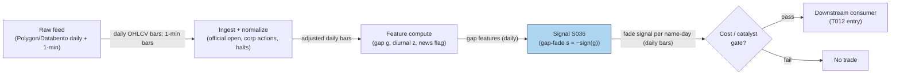

## Stage 36/200 — S036: Overnight-gap fade (overnight→intraday reversal)

*Batch SB6 · Signal 36/100 · Provenance [D] · Family C — Intraday Mean Reversion & Reversal*

### S1. One-line verdict

| | |
|---|---|
| **What it is** | Fades the overnight gap: if a stock opens well above/below the prior close, bet it drifts back toward the close during the session. |
| **When it works** | Small, no-news gaps in liquid names where the opening print overshoots on thin liquidity and attention-driven order flow. |
| **When it dies** | Earnings/catalyst gaps (they continue), trending markets, illiquid names with wide spreads — and after costs, which often eat the whole edge. |
| **Build-or-buy in one line** | Build in an afternoon; the hard part is the cost model and the news filter, not the arithmetic. |
| Provenance `[D]` · Family C | Documented in the report; citations: Alvarez (2026, unverifiable — see S12), Lou, Polk & Skouras (2019). |

### S2. How it works — plain human explanation

An **overnight gap** is the price jump between yesterday's official close and today's opening print — the market's verdict on everything that happened while the exchange was shut. **Fading** a gap means betting against it: gap up → short, expecting the price to fall back; gap down → buy, expecting a bounce. The **bid–ask bounce** is the mechanical zigzag between the bid and the ask: a buy prints at the ask, a sell at the bid, so transaction prices bounce even when the true value hasn't moved. **Adverse selection** is the risk that the person trading against you knows more than you do — the market maker's nightmare and the reason spreads exist.

The vignette: XYZ closed at $100.00. Overnight, thin pre-market trading and retail chatter push the open to $102.00 — a +2.00% gap on no real news. The fade trader shorts at 9:30:00. Two stories justify it. First, **liquidity overshoot**: the opening auction concentrates overnight demand into one print with limited liquidity on the other side, so the price overshoots; once continuous trading starts, liquidity returns and the price mean-reverts. Second, **attention pressure** (Berkman, Koch, Tuttle & Zhang 2012): retail investors who noticed the stock overnight pile in at the open and push it too far; their pressure unwinds intraday. The mirror risk is **PEAD** — post-earnings-announcement drift: when the gap carries genuine information (earnings, guidance, macro shock), the open is not an overshoot but the first installment, and fading it bleeds. The report's own caveat: the mirror hypothesis (gap continuation) must be estimated per instrument, never assumed away.

**Mental model:**
- The open is the day's least liquid, most emotional print — that is both the opportunity and the trap.
- Small no-news gaps revert (overshoot); large catalyst gaps continue (information). The signal's entire job is telling them apart.
- Fill probability is not expectancy: a 70% win rate with fat losers is a losing strategy.

### S3. The math — exact formula

Overnight and intraday returns (simple returns; log is fine too — pick one and stay consistent):
$$r_{overnight}(t) = \frac{O(t)}{C(t-1)} - 1 \equiv g(t), \qquad
r_{intraday}(t) = \frac{C(t)}{O(t)} - 1$$

The documented panel relationship (Lou, Polk & Skouras 2019 document the offsetting cross-period structure):
$$r_{intraday}(t) = \alpha + \beta \cdot r_{overnight}(t) + \mathrm{FE} + \varepsilon(t), \qquad \beta < 0 \;\; \text{(the fade hypothesis)}$$

Trading form — fade the gap, sized by its magnitude:
$$s(t) = -\mathrm{sign}(g(t)) \cdot \mathbf{1}\{|g(t)| \ge g_{min}\} \cdot \mathbf{1}\{|g(t)| \le g_{max}\}$$
$$R(t,k) = \frac{P(t,k) - O(t)}{O(t)}, \qquad \Pi(t,k) = s(t) \cdot R(t,k) - \mathrm{costs}$$
where $P(t,k)$ is the price $k$ bars/minutes after the open and $\Pi$ is the fade P&L.

**Parameter table** (every default is `example — not an institutional standard`):

| Parameter | Symbol | Typical range | Too small | Too large | Default example |
|---|---|---|---|---|---|
| Min gap | $g_{min}$ | 0.5–2.0% (equities); 0.2–0.8% (futures/FX) | noise gaps, churn | too few trades | 1.0% |
| Max gap | $g_{max}$ | 3–8% | fades genuine information gaps (PEAD leg) | — | 5% |
| Entry delay | — | 1–5 min bars | filled into the opening spike | gives away the reversion | 0 (at open) or 1 bar |
| Hold | $k$ | 5–60 min; or to close | cuts reversion short | gives back the fill to afternoon drift | 10 bars / to close |
| Exit target | — | 25–100% of gap | leaves money on table | never fills, round-trips | 100% (prior close) |
| Stop | — | 25–75% of gap or 0.5–1.5× opening ATR | stopped by noise | catastrophic gap-continuation days | 50% of gap |

**Normalization:** scale the gap by recent volatility — $|g|/\hat{\sigma}_{daily}$ or vs. the 14-day ATR — so that a 2% gap in a 1%-vol name (huge) and in a 4%-vol name (noise) are not treated equally. A z-scored form $z = g / \hat{\sigma}$ with $|z| \ge 1.5$–$2.0$ is the usual gate.

**Causal timing:** $g(t)$ is known at the opening print; the earliest fill is the open (auction) or the first post-open bar. $R(t,k)$ uses only prices $\le t{+}k$. No lookahead: $C(t{-}1)$ must be the *official* close, split/dividend-adjusted.

**Named variants:** (1) *Open-to-close fade* — enter at the open, exit at the close (the regression form). (2) *Timed fade* — exit after $k$ minutes or at a partial-fill target (the S4 form). (3) *Size-scaled fade* — position $\propto |g(t)|$ below $g_{max}$. (4) *Jump-filtered fade* — fade only when the Lee–Mykland test says the overnight move was *not* a significant jump (S037; T012's form).

### S4. Worked example — step-by-step numbers (SYNTHETIC)

Synthetic tape, seed **36**: prior close $C(t{-}1) = 100.00$, open $O(t) = 102.00$ → gap $g = 102/100 - 1 = \mathbf{+2.00\%}$, which clears the example $g_{min} = 1\%$. Fade: short 1 share at the open.

| Bar | Price | Log-return $r(i)$ | Fade P&L (cumulative, before costs) |
|---|---|---|---|
| open (0) | 102.00 | — (entry) | 0.00% |
| 1 | 101.50 | −0.004914 | +0.49% |
| 2 | 101.1030 | −0.003918 | +0.88% |
| 3 | 100.8055 | −0.002947 | +1.17% |
| 4 | 100.5068 | −0.002967 | +1.46% |
| 5 | 100.1093 | −0.003960 | +1.85% |
| 6 | 99.7115 | −0.003980 | +2.24% |
| 7 | 99.4135 | −0.002994 | +2.54% |
| 8 | 99.2149 | −0.002000 | +2.73% |
| 9 | 99.1157 | −0.001000 | +2.83% |
| 10 | 99.2148 | +0.001000 | **+2.731%** |

Step-by-step:
1. Gap: $g = 102.00/100.00 - 1 = +2.00\%$ → $s = -1$ (short).
2. Exit at bar 10: $\Pi(10) = -(99.2148 - 102.00)/102.00 = 2.7852/102.00 = \mathbf{+2.731\%}$ before costs — the gap more than filled (price fell *through* the prior close).
3. Jump-screen sanity check on the same tape (full treatment is S037): the Lee–Mykland opening test gives $T(\text{open}) = -4.65 < q(0.95) = 2.970$ → **not** a significant jump → the fade is permitted. (Visible correction note: the chatbot's printed arithmetic had a single-digit typo — $|r(4)|\cdot|r(5)|$ printed as $0.000011649$, correct value $\mathbf{0.000011749}$; corrected chain $\Sigma = 0.000087954$, $\hat{V} = 0.00013816$, $\sqrt{\hat{V}} = 0.011754$, $Z = 1.685$, $T = -4.65$. An independent recomputation confirmed the corrected numbers to 3–4 significant figures; the conclusion is unchanged.)
4. Costs (example — not an institutional standard): all-in ≈ 3–15 bp for very liquid names. Even at 15 bp, net ≈ **+2.58%** on this tape — but this tape is a cherry-picked illustration, not a backtest.

**What to notice:** the tape fills *fast* — most of the 2.73% arrives in the first 6 bars, which is why real implementations exit on partial fills or short holds rather than waiting for the close. Limits: no fees, no partial fills, no bid–ask bounce contamination (mid-price-like closes), exactly one path. The S11 chart plots this same tape; every price above appears on it.

### S5. Strategies that use this signal

- **T012 — Jump-Filtered Overnight-Gap Fade** — primary entry trigger (direction): S036 supplies the fade direction and sizing; S037 gates it (fade only when no significant jump is detected); S100 (earnings drift) vetoes known catalyst days.
- **T018 — RVOL-Gated Gap-and-Go** — mirror-hypothesis context (not a consumer): T018 trades *continuation* of the same overnight gaps S036 fades. The report's own caveat applies — continuation vs. reversal must be estimated per instrument, so T018 is the strategy you calibrate S036 against.

### S6. Data required — exact spec

| Field | Type | Granularity | Source tier | Notes |
|---|---|---|---|---|
| Official open & prior close | float | daily bars | Tier 0–1 | Auction prints preferred; adjust for splits/dividends |
| 1-min OHLCV (exit timing) | float/int | 1-min bars | Tier 1–2 | For the $k$-bar exit and partial-fill logic |
| Corporate actions | event | daily | Tier 0–1 | A split masquerading as a gap is the classic bug |
| News/catalyst flag (optional) | boolean | daily | Tier 2 | Earnings calendar; vetoes the fade |

Ingest sketch (≤20 lines):
```python
import polars as pl
d = pl.read_parquet("bars/daily_adj.parquet")      # split/dividend-adjusted
d = d.with_columns(g=pl.col("open")/pl.col("close").shift(1).over("sym") - 1)
cands = d.filter((pl.col("g").abs() >= 0.01) & (pl.col("g").abs() <= 0.05))
m = pl.read_parquet("bars/ES_1m.parquet")           # 1-min bars for exit timing
# per candidate: first 10 post-open bars -> fade P&L
tr = (m.join(cands.select("sym","date","g"), on=["sym","date"], how="inner")
       .with_columns(pl=(pl.col("close")/pl.col("open")-1)))
```
Storage: daily bars for 3,000 stocks × 10 years ≈ 60M rows ≈ 2–5 GB RAM (per `notes/cost-model.md` §3); 1-min exit-timing bars ≈ 50 MB/day for 500 symbols (§4). Data-quality checklist: official vs. consolidated open (they differ); adjusted *and* unadjusted closes; **keep delisted symbols** (anti-survivorship); halt flags; DST/half-day session lengths.

### S7. Local build on M5 Max / 128GB

**Verdict: trivial.** Daily-bar arithmetic plus a 1-min exit timer — Tier L (4–12 h) per `notes/cost-model.md` §5 (S036 is in the S021–S048 1-min group). Throughput (per §2): the daily gap scan is 3,000 rows/day; a 10-year 1-min exit study scans in seconds. RAM (per §3): the daily panel ≈ 2–5 GB; 60 days of 500-symbol 1-min bars ≈ 3 GB — inside the 77 GB budget. Stack: **Python + polars**; DuckDB if you prefer SQL. Engineering: ~4–8 h ≈ **$600–1,200** loaded-cost estimate. What breaks first: not compute — the *news/catalyst filter* (a "no-news" decision at scale needs a real news feed, the Tier-2/3 cost). (Labeled chatbot lead: duck.ai Q-SB6-2 put a full gap-scanner prototype with data plumbing at 40–100 h; the Tier L band covers the signal logic and takes precedence.)

### S8. Buy vs build

| Vendor / option | What you get | Indicative price | Gains | Loses |
|---|---|---|---|---|
| Tier 0: Stooq / Alpaca IEX daily bars | Daily OHLCV, adjusted | ~$0 | Free; enough for the regression form | No 1-min exit timing; survivorship care needed |
| Tier 1: Polygon Stocks Advanced | 1-min SIP bars, corporate actions | ~$30–200/mo | Full S6 spec, cheap | SIP timestamps adequate at 1-min, not sub-second |
| Tier 2: Databento Standard | Exchange-native bars, imbalance feeds | ~$200/mo + usage | Honest auction prints | Overkill for the daily-bar variant |
| Academic: TAQ via WRDS | Publication-grade history | institutional $$$$ | Reproducible | Not for live use |

**Verdict: build.** The signal is a ratio of two prices; the money goes to clean corporate-action data and (optionally) a news/catalyst feed for the $g_{max}$/veto logic. Buy the Tier-1 bars; build the scanner. All prices `indicative — verify before budgeting`.

### S9. Success ratio / efficacy — documented evidence

| Study / source | Market & period | Metric | Before/after cost | Caveat |
|---|---|---|---|---|
| Berkman, Koch, Tuttle & Zhang (2012), J. Fin. & Quant. Analysis | US equities, attention-sorted | Positive overnight returns reverse intraday; concentrated in high-attention, hard-to-value stocks; implicit costs of buying at the open often exceed the effective half-spread | Descriptive + cost measurement | Documents the *mechanism* (attention overshoot), not a tradable fade strategy |
| Lou, Polk & Skouras (2019), J. Fin. Economics | US equities 1993–2013 | Strong overnight/intraday firm-level continuation with an offsetting cross-period reversal lasting years | Before cost | Monthly horizon; supports the fade *intuition*, not a daily gap-fade P&L |
| Stübinger & Schneider (2019), J. Risk & Fin. Mgmt (S&P 500, 1998–2015) | S&P 500 constituents, high-frequency | 51.47% p.a., annualized Sharpe 2.38 **after** transaction costs (5 bp/half-turn) for the jump-filtered variant | After cost (authors' model) | Single-team backtest, no independent replication — an upper-bound illustration, not an expectation |

The mandatory honesty framing: **small non-news gaps often partially revert; large catalyst gaps often continue; unconditional fill probability is not positive expectancy; a high win rate can coexist with poor expectancy because the losers are fat**. The practitioner statistic that S&P 500 same-session gap fills run ~60–70% is **descriptive, not an academic constant** — do not annualize it into a Sharpe. On costs: all-in ≈ 3–15 bp for very liquid names, and a 5–10 bp gross expectancy per trade nets to **≈0 or negative** — where most gap-fade backtests die.

**Honest bottom line:** as a standalone trigger this is a **fragile, possibly zero-after-cost edge** — the fade exists in the data, but costs, catalyst gaps, and the bid–ask bounce eat most of it. As a *filter/segmentation input* (which gaps to avoid fading, which names revert cleanly) it is **genuinely useful**, and the jump-filtered form (S037/T012) is the only variant with a published after-cost backtest — read with the caveats above.

### S10. Failure modes & pitfalls

1. **Catalyst gaps** — earnings, M&A, FDA: the gap is information, fading it is catching a falling knife. Mitigation: $g_{max}$ cap + earnings-calendar veto (T012's S100 gate).
2. **Bid–ask bounce contamination** — transaction-price "reversion" that is just the quote side flipping. Mitigation: measure on mid-quotes or require the move to exceed the effective spread.
3. **Cost blowup at the open** — the open is the widest-spread minute of the day. Mitigation: model all-in 3–15 bp; enter 1–5 bars late if needed.
4. **Lookahead via adjusted closes** — computing the gap on adjusted data with unadjusted opens (or vice versa). Mitigation: keep adjusted *and* unadjusted series; test the join on known splits.
5. **Survivorship bias** — dropping delisted names flatters the fade (dead stocks gapped down and never reverted). Mitigation: keep delisted symbols in the panel (the Q-SB6-2 chatbot lead, verified sound).
6. **Fat-loser asymmetry** — 70% win rate, −3× average loss on the 30%. Mitigation: hard stop at 25–75% of gap; size by $|g|$ with a cap, never martingale.
7. **Regime breaks** — trending/crisis markets where every gap continues. Mitigation: regime gate (pause when the index trends strongly); daily loss stop.
8. **Overfitting $g_{min}$/$g_{max}$/$k$** — three knobs on a noisy effect. Mitigation: freeze parameters across the pooled sample; report sensitivity, not the optimum.

### S11. Visuals




### S12. Sources

1. Berkman, H., Koch, P. D., Tuttle, L. & Zhang, Y. J. (2012). "Paying Attention: Overnight Returns and the Hidden Cost of Buying at the Open." *Journal of Financial and Quantitative Analysis* 47(4), 715–741. https://bearworks.missouristate.edu/articles-cob/576/
2. Lou, D., Polk, C. & Skouras, S. (2019). "A Tug of War: Overnight versus Intraday Expected Returns." *Journal of Financial Economics* 134(1), 192–213. https://researchonline.lse.ac.uk/id/eprint/87481/
3. Stübinger, J. & Schneider, L. (2019). "Statistical Arbitrage with Mean-Reverting Overnight Price Gaps on High-Frequency Data of the S&P 500." *Journal of Risk and Financial Management* 12(2). https://www.mdpi.com/1911-8074/12/2/51 — the jump-filtered variant's after-cost backtest (51.47% p.a., Sharpe 2.38), with the replication caveats in S9.

**Unverified leads** (not independently confirmed — do not treat as facts):
- Alvarez (2026), "Overnight Returns and Intraday Reversals" — carried as a citation in the report's source entry; **no matching publication could be verified via web search (checked 2026-09-10)**. The entry's claim (net alpha after costs is negative) is consistent with the cost analysis above but remains an unverified report-carried citation.
- Duck.ai (GPT-5.6 Luna, anonymous, 2026-09-10) answered Q-SB6-1–Q-SB6-3; its gap-fade worked example (S4) was independently recomputed and corrected (single-digit typo noted in S4); its practitioner statistics (S&P 500 same-session fills ~60–70% descriptive; all-in costs 3–15 bp; a live gap-fade edge shrinking to ~5%/yr) are **unverified chatbot claims** used only as labeled practitioner context. Source log: "Duck.ai answered Q-SB6-1–Q-SB6-3 (2026-09-10); Grok/Cursor answers pending (checked 2026-09-10)."
