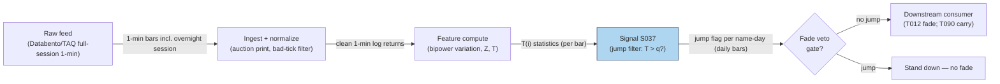

## Stage 37/200 — S037: Jump-filtered overnight-gap reversal

*Batch SB6 · Signal 37/100 · Provenance [D] · Family C — Intraday Mean Reversion & Reversal*

### S1. One-line verdict

| | |
|---|---|
| **What it is** | Runs the Lee–Mykland jump test on the overnight move; fades the gap only when the move is *not* a statistically significant jump. |
| **When it works** | When genuine information jumps (earnings, macro shocks) behave differently from liquidity gaps — the filter keeps you out of the former. |
| **When it dies** | When the filter deletes your best trades, when the local-vol window is contaminated, or when you mistake the filter for an alpha source. |
| **Build-or-buy in one line** | Build — the test is 30 lines of numpy; the discipline is in the evaluation, not the code. |
| Provenance `[D]` · Family C | Documented in the report; citations: Stübinger & Schneider (2019) — note the report prints "Stübinger & Endres (2018)"; the journal paper is Stübinger & Schneider (2019), corrected in S12. |

### S2. How it works — plain human explanation

A **jump** is a price discontinuity — a move too large and too sudden to be ordinary minute-to-minute diffusion, the market's signature of real information arriving (an earnings beat, a surprise rate decision). **Bipower variation** is a way to measure "normal" volatility that is robust to jumps: instead of squaring returns (which lets one jump dominate), it multiplies *adjacent* absolute returns, so a lone spike gets diluted by its quiet neighbors. **Extreme-value normalization** rescales the test statistic so that the largest of many noisy observations can be judged against a known distribution — it answers "is this return extreme even allowing for the fact that I looked at 390 minutes today?" The **Lee–Mykland test** (Lee & Mykland 2012) packages this into a formal yes/no: is the return at minute $i$ a jump, at significance level $\alpha$?

The vignette: same setup as S036 — XYZ closed at $100.00, opens at $102.00 (+2.00%). The naïve fade shorts at the open. But was that +2% a *liquidity* gap (thin pre-market, attention buyers — the kind that reverts) or an *information* jump (a leaked takeover bid — the kind that continues)? The Lee–Mykland test scales the overnight return by local bipower-variation volatility, applies the extreme-value normalization, and compares against the 5% critical value 2.970. If $T > 2.970$: jump detected — do *not* fade immediately (stand down). If $T \le 2.970$: no jump — the fade is permitted. Lee & Mykland's empirical finding gives this teeth: individual-stock jumps line up with prescheduled earnings and company news, index jumps with general market news — the test genuinely identifies information-like discontinuities.

The mandatory framing, before any enthusiasm: it is **documented** that the test identifies information-like jumps (Lee & Mykland 2012). It is **not** generally published, across broad US samples, that bolting this filter onto a gap-fade strategy improves net return. The honest prior: sensible risk control and regime segmentation — not assumed alpha creation. The correct evaluation is an out-of-sample difference-in-differences, $\Delta(\text{filter}) = \text{NetReturn}(\text{fade} + \text{filter}) - \text{NetReturn}(\text{fade only})$, with per-trade stats by gap size, catalyst, and vol regime.

**Mental model:**
- Not all gaps are created equal: liquidity gaps revert, information jumps persist — the test is the sorting hat.
- The filter is a veto, not a trigger: it says "don't fade this one," never "buy this one."
- A filter that raises Sharpe by deleting two bad days and leaving 40 trades is not evidence — it's a smaller sample.

### S3. The math — exact formula

Let $p(i) = \log P(i)$ and $r(i) = p(i) - p(i-1)$. Local **bipower variation** over a window of $k$ returns ending at $i$. The sum has $k-1$ adjacent products, and the $1/(k-1)$ local-average normalization is the Lee–Mykland convention — Lee & Mykland (2008)'s exposition writes $\hat{\sigma}^2 = [1/(K-2)](\pi/2)\sum|r_j||r_{j-1}|$, and the S6 code below implements the equivalent averaging via `np.convolve(..., np.ones(k-1)/(k-1))`. Omitting the normalization (as an earlier draft of this chapter did) materially changes the test statistic — see the correction in S4.
$$\hat{V}(i) = \frac{\pi}{2}\cdot\frac{1}{k-1} \sum_{j=i-k+2}^{i} |r(j-1)| \cdot |r(j)|$$

Standardized return:
$$Z(i) = \frac{r(i)}{\sqrt{\hat{V}(i)}}$$

**Extreme-value normalization** (with $\Delta$ the sampling interval as a fraction of the day, e.g. $\Delta = 1/390$ for 1-min bars):
$$T(i) = \frac{|Z(i)| - C(\Delta)}{S(\Delta)}, \quad
C(\Delta) = \sqrt{2\log(1/\Delta)} - \frac{\log\pi + \log\log(1/\Delta)}{2\sqrt{2\log(1/\Delta)}}, \quad
S(\Delta) = \frac{1}{\sqrt{2\log(1/\Delta)}}$$

Decision rule — reject "no jump" at level $\alpha$ when:
$$T(i) > q(1-\alpha), \qquad q(1-\alpha) = -\log(-\log(1-\alpha))$$
with $q(0.95) = 2.970$ and $q(0.99) = 4.600$. Under the null, $\Pr(T(i) \le x) \approx \exp(-e^{-x})$ (Gumbel).

Jump-filtered fade rule: fade only if $|g(t)| \ge g_{min}$ **and** $T(\text{open}) \le q(1-\alpha)$. A detected opening jump means "do NOT fade immediately" — not "reverse and chase."

**Parameter table** (every default is `example — not an institutional standard`):

| Parameter | Symbol | Typical range | Too small | Too large | Default example |
|---|---|---|---|---|---|
| Local window | $k$ | 30–120 1-min returns | $\hat{V}$ noisy, false jumps | stale vol, misses regime shifts | 60 |
| Significance | $\alpha$ | 1–10% | filters everything (no trades) | filters nothing | 5% |
| Sampling | $\Delta$ | 1-min to 5-min | microstructure noise contaminates $\hat{V}$ | jumps blurred into diffusion | 1-min |
| Gap gate | $g_{min}$ | 0.5–2.0% | (see S036) | (see S036) | 1.0% |

**Normalization choices:** the test *is* a normalization — $Z(i)$ scales by local bipower variation rather than a global $\sigma$, which is precisely what makes it robust to volatility regimes. Alternatives: raw $|r(i)|$ thresholds (regime-blind, not recommended), or the Barndorff-Nielsen–Shephard (2004) / Andersen et al. (2010) jump tests (different asymptotics, same idea).

**Causal timing:** computed at the open from returns up to and including the overnight return; tradable no earlier than the first post-open bar. Caveat (verified sound): a 10-minute opening calculation is *illustrative only* — not statistically reliable; production needs the full $k$-return local window.

**Named variants:** (1) *Opening-jump veto* — the form above. (2) *Intraday jump scan* — run $T(i)$ on every bar to catch continuation jumps for early exit. (3) *Two-sided filter* — different $\alpha$ for up vs. down gaps (example choice, not a standard).

### S4. Worked example — step-by-step numbers (SYNTHETIC)

Same synthetic tape as S036 (seed **36** for the tape; the test arithmetic below is hand-computed; the S037 chart script uses numpy `default_rng(37)`): $C(t{-}1) = 100.00$, $O(t) = 102.00$, post-open 1-min closes $101.50, 101.1030, 100.8055, 100.5068, 100.1093, 99.7115, 99.4135, 99.2149, 99.1157, 99.2148$. Log returns: $-0.004914, -0.003918, -0.002947, -0.002967, -0.003960, -0.003980, -0.002994, -0.002000, -0.001000, +0.001000$.

Step-by-step Lee–Mykland at the open:
1. Overnight return: $r(\text{open}) = \log(102/100) = \mathbf{0.019803}$.
2. Adjacent absolute-return products: $0.000019253, 0.000011546, 0.000008744, \mathbf{0.000011749}, 0.000015761, 0.000011916, 0.000005988, 0.000002000, 0.000001000$. (**Correction:** the chatbot printed the fourth product as $0.000011649$ — one digit off; $0.002967 \times 0.003960 = \mathbf{0.000011749}$. Independently recomputed and confirmed.)
3. Sum: $\Sigma = \mathbf{0.000087954}$ (printed $0.000087854$ — corrected).
4. Bipower variation — **with the $(k-1)$ local-average normalization** the published formula and the S6 code require ($k = 10$ returns, 9 adjacent products): $\hat{V} = (\pi/2)\cdot(1/9)\cdot\Sigma = 1.5708 \times 0.000087954/9 = \mathbf{0.0000153509}$; $\sqrt{\hat{V}} = \mathbf{0.0039180}$. (Correction: an earlier draft computed $\hat{V} = (\pi/2)\Sigma = 0.00013816$ with no normalization — contradicting both the S6 code and the published formula. Adding the normalization divides $\hat{V}$ by 9 and flips the conclusion below; the numbers here are the correct, consistent ones.)
5. $Z(\text{open}) = 0.019803/0.0039180 = \mathbf{5.0542}$.
6. With $\Delta = 1/390$: $C(\Delta) = \mathbf{3.031}$, $S(\Delta) = \mathbf{0.2894}$; $T(\text{open}) = (5.0542 - 3.031)/0.2894 = \mathbf{6.99}$.
7. Decision: $6.99 > q(0.95) = \mathbf{2.970}$ → **Lee–Mykland jump at 5%** (also above $q(0.99) = 4.600$) → **do NOT fade — stand down**.
8. Fade P&L (from S036): short at $102.00$, cover at bar 10 at $99.2148$ → $\Pi(10) = \mathbf{+2.731\%}$ before costs. The filter vetoes this trade even though the tape would have profited — the veto is conservative risk control, not a profit oracle; whether deleting such trades helps net is the diff-in-diff question in S2.
9. Costs (example — not an institutional standard): three-component stack for the fade this filter gates — effective half-spread ≈ 2 bp (basis points; 1 bp = 0.01%) per leg (4 bp round trip, opening print in a liquid name) + fees ≈ 0.5 bp per leg (1 bp round trip) + slippage/impact allowance ≈ 5 bp per leg (10 bp round trip, opening-auction adverse selection) = ≈ 15 bp round trip. The $+2.731\%$ ($+273.1$ bp) gross nets to ≈ $+273.1 - 15 = +258$ bp (≈ **+2.58\%**) after costs — *if* the filter permits the trade, which on this tape it does not. A 5–10 bp gross expectancy per trade against a 15 bp stack is ≈ 0 or negative: the fade the filter gates lives or dies on costs, not on the jump test.

**What to notice:** the overnight return looked dramatic (+2.00%), and scaled by local volatility with the correct normalization it *is* extreme — $T = 6.99$ against the 2.970 threshold. That is the filter's value proposition in one number: it keeps you out of the big-gap trade. The honest sting: on this tape the filter deletes a +2.73% winner — a veto is not a profit oracle, and a filter that raises Sharpe by deleting two extreme days while leaving 40 trades is not evidence. Limits: the 10-bar window is illustrative, not statistically reliable; the test itself carries no costs; one test on one tape proves the arithmetic, not the strategy.

### S5. Strategies that use this signal

- **T012 — Jump-Filtered Overnight-Gap Fade** — the filter as gate/veto (primary role): S036 gives the fade direction, S037 vetoes information-like gaps, S100 vetoes known earnings days. This chapter *is* T012's risk engine.
- **T090 — Overnight Inventory Carry Manager** — jump filter as the carry gate: no jump → the overnight position may be carried; jump → flatten or hedge. Combined with borrow awareness (S098) and VIX term-structure context (S068).

### S6. Data required — exact spec

| Field | Type | Granularity | Source tier | Notes |
|---|---|---|---|---|
| 1-min (or finer) prices incl. overnight session | float | 1-min bars | Tier 1–2 | The test needs the overnight return *and* the local window |
| Official open / prior close | float | daily bars | Tier 0–1 | Defines $r(\text{open})$; auction prints preferred |
| Corporate actions | event | daily | Tier 0–1 | Splits look like jumps to the test |
| Trades/quotes (optional, finer) | event | tick/L1 (level-1) | Tier 2 | For sub-minute variants; microstructure noise caveat |

Ingest sketch (≤20 lines):
```python
import polars as pl, numpy as np
m = pl.read_parquet("bars/ES_1m_overnight.parquet")  # incl. pre-open session
r = np.log(m["close"].to_numpy()); r = np.diff(r, prepend=np.nan)
k, alpha = 60, 0.05
def bipower(r, k):
    a = np.abs(r)
    return (np.pi/2) * np.convolve(a[:-1]*a[1:], np.ones(k-1)/(k-1), mode="same")
V = bipower(r[1:], k); Z = r[1:]/np.sqrt(V)
Delta = 1/390; s = np.sqrt(2*np.log(1/Delta))
C = s - (np.log(np.pi)+np.log(np.log(1/Delta)))/(2*s); S = 1/s
T = (np.abs(Z)-C)/S; q = -np.log(-np.log(1-alpha))
jump = T > q   # boolean per bar; fade only where ~jump at the open
```
Storage: same as S036 — daily panel trivial; 1-min bars ≈ 50 MB/day per 500 symbols (per `notes/cost-model.md` §4); the overnight session roughly doubles the bar count for 24-hour instruments. Data-quality checklist: overnight session flags (pre-market vs. RTH (regular trading hours)); the opening auction print vs. first 1-min bar (they differ — use the print for $r(\text{open})$); bad ticks at the illiquid overnight open (median-filter); DST (daylight-saving time) transitions in the overnight session.

### S7. Local build on M5 Max / 128GB

**Verdict: feasible.** The test is vectorized numpy over 1-min returns — Tier L (4–12 h) per `notes/cost-model.md` §5 (S037 is in the S021–S048 1-min group). Throughput (per §2): numpy does ~50–200M elements/sec; the bipower convolution over a 500-symbol 1-min panel is milliseconds per day. RAM (per §3): 60 days × 500 symbols of 1-min bars ≈ 3 GB — inside the 77 GB budget. Stack: **Python + polars/numpy**; nothing here needs Rust or the GPU. Engineering: ~8–12 h ≈ **$1,200–1,800** loaded-cost estimate, most of it in validation (the test is easy; *trusting* it takes the hours — see S10). What breaks first: the multiple-testing burden (millions of $T(i)$/day need FDR (false discovery rate)-style control at $\alpha = 5\%$) and overnight data-quality edge cases. (Labeled chatbot lead: duck.ai Q-SB6-2 estimated jump-filter + validation at 10–25 h prototype; the cost-model Tier L band takes precedence.)

### S8. Buy vs build

| Vendor / option | What you get | Indicative price | Gains | Loses |
|---|---|---|---|---|
| Tier 0: Stooq/Alpaca IEX | Daily + 1-min IEX bars | ~$0 | Free; enough for the daily-open variant | No overnight session detail |
| Tier 1: Polygon Stocks Advanced | Full-session 1-min bars, corp actions | ~$30–200/mo | Covers S6 at 1-min | SIP (Securities Information Processor consolidated feed) timestamps; fine here |
| Tier 2: Databento (TAQ (Trade and Quote database)-like) | Exchange-native intraday, imbalance feeds | ~$200/mo + usage | Honest auction/overnight prints | Cost if you scan full history |
| Academic: LOBSTER / WRDS TAQ | MBO (market-by-order)/ITCH (Nasdaq's direct data-feed protocol) replay, publication history | hundreds/yr academic | Research-grade | Not for live trading |

**Verdict: build the test, buy the bars.** There is no serious vendor product that sells "a Lee–Mykland jump flag" — and you wouldn't want a black box here anyway, because the $\alpha$/$k$ choices are the strategy. Buy Tier-1 full-session bars; the 30 lines of numpy are yours. All prices `indicative — verify before budgeting`.

### S9. Success ratio / efficacy — documented evidence

| Study / source | Market & period | Metric | Before/after cost | Caveat |
|---|---|---|---|---|
| Lee & Mykland (2012), J. Econometrics | US equities, high-frequency | The test identifies information-like jumps: individual-stock jumps associate with earnings/company news; index jumps with market news | Statistical (no strategy) | Validates the *detection*, not any trading rule |
| Stübinger & Schneider (2019), J. Risk & Fin. Mgmt | S&P 500, 1998–2015, high-frequency | Jump-test-based overnight-gap strategy: 51.47% p.a., Sharpe 2.38 **after** costs (5 bp/half-turn; 10 bp round trip) | After cost (authors' model) | Single-team backtest; no independent replication; an upper bound, not an expectation |
| Mykland, Shephard & Sheppard (2012), working paper | Theory/simulation | Blocked multipower variation improves jump-test power and jump-robust vol estimates | Theoretical | Backing for better $\hat{V}$ inside the filter; not a strategy result |

The mandatory evaluation framing: **"removing jumps improves net strategy performance" is not generally published across broad US samples.** The filter helps if jump days have negative fade expectancy; it *hurts* if your biggest profitable fades get classified as jumps, if auction mechanics get misclassified, if the BV window is contaminated, if the jump is followed by partial reversion anyway, if the trade count collapses, or if adverse selection concentrates on the survivors. Evaluate with the out-of-sample difference-in-differences $\Delta(\text{filter}) = \text{NetReturn}(\text{fade}+\text{filter}) - \text{NetReturn}(\text{fade only})$, with per-trade stats by gap size, catalyst, and vol regime. A filter that lifts Sharpe by deleting two extreme losing days but leaves 40 observations is not persuasive.

**Honest bottom line:** as a *detection statistic* this is a **well-documented, genuinely useful test**. As a *strategy component* it is **sensible risk control and segmentation with no general proof of net alpha creation** — evaluate it as a veto via diff-in-diff, never assume it manufactures edge.

### S10. Failure modes & pitfalls

1. **BV-window contamination** — the jump itself (or a nearby one) lands inside the local window, inflating $\hat{V}$ and masking the jump. Mitigation: jump-robust windows (exclude the tested return); try $k \in \{30, 60, 120\}$ and check stability.
2. **Auction/opening-mechanics misclassification** — the opening print's microstructure looks like a jump. Mitigation: use the official auction print deliberately; consider excluding the first 1–5 minutes from the *window* while testing the overnight return.
3. **Multiple testing** — at $\alpha = 5\%$ across 500 names × 390 minutes, false jumps are guaranteed. Mitigation: FDR/Bonferroni-style adjustment for scans; keep $\alpha$ tight for vetoes.
4. **Trade-count collapse** — an aggressive filter leaves too few fades to estimate anything. Mitigation: report the trade count with and without the filter; require a minimum (e.g. ≥200 OOS trades) before believing $\Delta$.
5. **Adverse selection on survivors** — the filter keeps the "clean" gaps, which may be exactly the ones everyone else fades. Mitigation: the diff-in-diff *is* the check; watch for crowding in the survivor set.
6. **$\alpha$/$k$ mining** — tuning the test until the backtest shines. Mitigation: freeze $(\alpha, k)$ from the detection literature; any tuning happens on a validation split with embargo.
7. **Overnight data gaps** — missing pre-market bars make $r(\text{open})$ span an unknown interval. Mitigation: require a minimum overnight bar count; otherwise skip the name-day.
8. **Latency at the open** — computing $T$ on the auction print and getting the fade order in before the reversion starts. Mitigation: pre-compute everything except the final print; the decision is one comparison.

### S11. Visuals




### S12. Sources

1. Lee, S. S. & Mykland, P. A. (2012). "Jumps in Equilibrium Prices and Market Microstructure Noise." *Journal of Econometrics* 168(2), 396–406. https://ideas.repec.org/a/eee/econom/v168y2012i2p396-406.html — the nonparametric jump test; documents individual jumps ↔ earnings/company news, index jumps ↔ market news.
2. Stübinger, J. & Schneider, L. (2019). "Statistical Arbitrage with Mean-Reverting Overnight Price Gaps on High-Frequency Data of the S&P 500." *Journal of Risk and Financial Management* 12(2). https://www.mdpi.com/1911-8074/12/2/51 — jump-test-based overnight-gap backtest (51.47% p.a., Sharpe 2.38 after costs), with the replication caveats in S9. **Correction:** the report prints "Stübinger & Endres (2018)"; the journal paper is Stübinger & Schneider (2019) — "Stübinger and Endres (2018)" is cited *inside* it as a transaction-cost reference.
3. Mykland, P. A., Shephard, N. & Sheppard, K. (2012). "Efficient and Feasible Inference for the Components of Financial Variation Using Blocked Multipower Variation." Working paper. http://galton.uchicago.edu/~mykland/paperlinks/mss120221.pdf — improved bipower/multipower estimators that raise jump-test power; the theoretical backing for better $\hat{V}$ inside the filter.

**Unverified leads** (not independently confirmed — do not treat as facts):
- Barndorff-Nielsen & Shephard (2004) and Andersen et al. (2010) jump tests — named in the report's source entry as the procedure family; carried as report provenance, not independently opened for this chapter.
- Duck.ai (GPT-5.6 Luna, anonymous, 2026-09-10) answered Q-SB6-1–Q-SB6-3; its Lee–Mykland worked example was independently recomputed — one single-digit typo found and corrected visibly in S4 (conclusion unchanged); its evaluation framing (diff-in-differences $\Delta(\text{filter})$, "sensible risk-control/segmentation, not assumed alpha creation") is used here as a labeled chatbot lead consistent with the published evidence above. Source log: "Duck.ai answered Q-SB6-1–Q-SB6-3 (2026-09-10); Grok/Cursor answers pending (checked 2026-09-10)."
