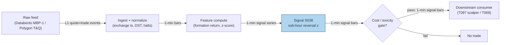

## Stage 38/200 — S038: Sub-hour microstructure reversal

*Batch SB6 · Signal 38/100 · Provenance [D] · Family C — Intraday Mean Reversion & Reversal*

### S1. One-line verdict

| | |
|---|---|
| **What it is** | Fade sharp 5–30-minute moves; sub-hour returns negatively autocorrelate, mostly from bid–ask bounce and decaying liquidity pressure. |
| **When it works** | Liquid names, normal two-sided flow, moves wide enough that the bounce is a small fraction; entered passively, exited on resiliency. |
| **When it dies** | Wide spreads, news-driven trends, one-sided flow, fast markets — the "reversal" is a trend in disguise, and costs eat it. |
| **Build-or-buy in one line** | Build: ~1 day of polars work on 1-minute bars; buy only the feed, never the signal. |

Provenance **[D]** (documented): Lehmann (1990); Heston, Korajczyk & Sadka (2010). Family C — Intraday Mean Reversion & Reversal.

### S2. How it works — plain human explanation

It is 9:47:03. A mid-cap stock's quote is bid 50.10 × 800 / ask 50.12 × 300. A seller dumps 5,000 shares; the bid side absorbs them down through 50.08 to 50.06 as the book thins. The last trade prints at 50.06 — the *bid*. Ten minutes later, with no news, the book has refilled and a buyer lifts the offer — the *ask*. The transaction price just "reversed" from 50.06 to 50.10 (+8 cents) while nothing fundamental happened. That round trip is the **bid–ask bounce** (the mechanical zig-zag of trade prices between bid and ask while the true value — the **midquote**, the average of bid and ask — barely moves). On top of the bounce: the seller's pressure pushed the midquote itself down — **temporary impact** (the price concession for absorbing an order, decaying as the book refills) — and liquidity providers get paid as it decays back.

Why should the effect exist? **Adverse selection** (the risk your counterparty knows more than you): makers widen spreads after one-sided flow, then let quotes drift back as the flow proves benign. And **inventory**: dealers who just bought 5,000 unwanted shares shade quotes to shed them; once flat, quotes revert. Both are compensation for **liquidity provision**, not free money.

Mental model:
- Sub-hour reversal = bounce (mechanical, untradable at the touch) + temporary-impact decay (economic, partially tradable if you can be the liquidity provider).
- The trade price lies; the midquote tells the truth. Always measure the signal on both.
- If the reversal only exists in transaction prices and vanishes on midquotes, you have found a measurement artifact, not an edge.

### S3. The math — exact formula

Let P(t) be the transaction price and m(t) = (bid(t) + ask(t)) / 2 the midquote at time t. Work in log prices p(t) = log P(t), μ(t) = log m(t).

**Formation return** over lookback L (5–30 min):

R(t, L) = p(t) − p(t − L)

**Signal** (direction over hold horizon H, e.g. 1–60 min):

s(t) = −sign(R(t, L))

**Scaled version** (z-score — standard deviations from zero, trailing-window estimate):

z(t, L) = R(t, L) / σ̂(t, L), trade if |z| ≥ z* (example threshold z* = 1.5 — *example, not an institutional standard*)

Hold return: Π(t, t+H) = s(t) · (p(t+H) − p(t)) − costs.

**Microstructure decomposition** (mandatory honesty lens; chatbot Q-SB6-1 notation, labeled): p(t) = μ(t) + (S(t)/2)·q(t) + ε(t), with spread S(t) and trade direction q(t) ∈ {+1 (ask print), −1 (bid print)}. If P(0) prints at the ask and P(1) at the bid with μ unchanged, the measured return is log((μ − S/2)/(μ + S/2)) < 0 — a **mechanical negative return with zero efficient-price move**. Any reversal study that does not control for q(t) is measuring this, not economics.

| Parameter | Symbol | Typical range | Too small | Too large | Default (example) |
|---|---|---|---|---|---|
| Formation lookback | L | 1–30 min | noise dominates; you trade the bounce | signal decays; you fade trends | 10 min |
| Hold horizon | H | 1–60 min | you exit inside the bounce | impact fully decayed; drift risk | 30 min |
| Entry threshold | z* | 0.5–2.0 | overtrading, cost bleed | no trades | 1.5 |
| Spread filter | S_max | 2–3× intraday median spread | toxic fills | signal starved | 2× median |

Ranges above are the chatbot's (Duck.ai Q-SB6-1) practical grid — a labeled lead, consistent with the literature's sub-hour concentration. Normalization: z-score of the formation return (preferred — adapts to intraday vol seasonality, see S046) vs raw return (simpler, biased to high-vol buckets). Causal timing: z(t,L) uses data ≤ t; earliest fill t+1 (tick strategies add explicit execution lag). Variants: (1) **trade-price reversal** (raw, bounce-contaminated — diagnostic only); (2) **midquote reversal** (preferred for signal generation); (3) **Lee–Ready-signed reversal** (classifies trades as buyer-/seller-initiated and measures reversal net of the bounce).

### S4. Worked example — step-by-step numbers (SYNTHETIC)

Synthetic tape, seed 42 (`batches/SB6/plot_S038.py`): $100 stock, fixed $0.02 spread, 12 events over 38 minutes. Midquote falls 100.000 → 99.955 (events 0–5, liquidity pressure), then reverts 99.955 → 99.968 (events 5–11, temporary-impact decay):

| ev | t (min) | bid | mid | ask | side | trade |
|---|---|---|---|---|---|---|
| 0 | 0 | 99.990 | 100.000 | 100.010 | ask | 100.010 |
| 1 | 3 | 99.980 | 99.990 | 100.000 | bid | 99.980 |
| 2 | 7 | 99.970 | 99.980 | 99.990 | ask | 99.990 |
| 3 | 10 | 99.965 | 99.975 | 99.985 | bid | 99.965 |
| 4 | 14 | 99.955 | 99.965 | 99.975 | bid | 99.955 |
| 5 | 17 | 99.945 | 99.955 | 99.965 | bid | 99.945 |
| 6 | 21 | 99.940 | 99.950 | 99.960 | ask | 99.960 |
| 7 | 24 | 99.943 | 99.953 | 99.963 | ask | 99.963 |
| 8 | 28 | 99.947 | 99.957 | 99.967 | bid | 99.947 |
| 9 | 31 | 99.951 | 99.961 | 99.971 | ask | 99.971 |
| 10 | 35 | 99.955 | 99.965 | 99.975 | bid | 99.955 |
| 11 | 38 | 99.958 | 99.968 | 99.978 | ask | 99.978 |

Formation leg (ev 0→5): r(trade) = **−0.0650%**; r(mid) = **−0.0450%**. The extra −0.0200% is pure bounce: ask-print start, bid-print end — one full spread of mechanical move. Reversal leg (ev 5→11): r(trade) = **+0.0330%**; r(mid) = **+0.0130%** — the naive backtest overstates the economics by nearly 2× (50.8% vs 28.9% reversal fraction). P(0)=ask → P(1)=bid demo (ev 6→8): r(trade) = **−0.0130%** while r(mid) = **+0.0070%** — opposite signs, zero information, just side alternation.

What to notice: no fees, no queue, a fixed spread — real tapes are uglier. The lesson: size every sub-hour reversal claim on midquotes first, then ask what survives once you must cross the spread to trade it.

### S5. Strategies that use this signal

- **T097 — Sub-Hour Microstructure Reversal Scalper**: primary entry trigger; S038 is the core fade.
- **T069 — Late-Day Reversal into Close**: primary trigger for last-30-minute overextension fades; S038 supplies the timing.
- **T011 — Short-Term Reversal + Bounce Timing**: S038 as the intraday-timing leg (S035/S047 carry the daily formation).
- **T083 — Retail-Flow Internalizer Fade**: S038 as a filter/veto — only fade retail flow when the sub-hour reversal z is aligned.

### S6. Data required — exact spec

| Field | Type | Granularity | Source tier | Notes |
|---|---|---|---|---|
| Bid/ask/size | float/int | L1 quote events (or 1-min bars) | Tier 1–2 | SIP bars suffice for research; execution needs direct/L1 |
| Trade price/size/side | float/int | trade events (or 1-min bars) | Tier 1–2 | side via Lee–Ready if aggressor flag absent |
| Corporate actions | adjustments | daily | Tier 1 | splits/dividends poison formation returns |
| Halt/session calendar | timestamps | daily | Tier 1 | exclude halts, half-days, DST transitions |

Collection: Polygon stocks v3 trades/quotes or Databento MBP-1; bar route via Polygon aggregates. Ingest sketch (≤20 lines, polars):

```python
import polars as pl
bars = pl.read_parquet("bars/1min/*.parquet")          # ts, sym, o,h,l,c,v
q = (bars.sort(["sym","ts"])
        .with_columns(r=pl.col("c").log().diff().over("sym")))          # log returns
sig = (q.with_columns(form=pl.col("r").rolling_sum(10).over("sym"))     # L=10 min
          .with_columns(sd=pl.col("r").rolling_std(60).over("sym"))
          .with_columns(z=pl.col("form")/pl.col("sd"))
          .filter(pl.col("z").abs() >= 1.5))                            # example threshold
```

Storage: per `notes/cost-model.md` §4, 1-min bars for 500 symbols ≈ 50 MB/day, ≈3 GB per 60 days — archive freely (§3's ~12 MB cell conflicts with its own per-symbol-day row; §4 is the planning number). L1 quote events are 0.5–4 GB RAM per symbol-day — sample or aggregate; never archive naively. Data-quality checklist: exchange-timestamp normalization, split/dividend adjustment, halt and limit-up/down exclusion, DST/early-close calendars, stale-quote filters.

### S7. Local build on M5 Max / 128GB

**Feasibility: trivial.** 1-minute-bar signal: 500 symbols × 390 bars = 195k rows/day; the 60-day history ≈ 3 GB (`cost-model.md` §4). Per `notes/cost-model.md` §2, polars does ~10–50M rows/sec on simple ops and numpy ~50–200M elements/sec — the daily scan is milliseconds; the bottleneck is feed latency and timestamp hygiene, not compute. RAM: gigabytes against the ~77GB working budget (§3). Stack: Python+polars; Rust only for per-tick event logic across hundreds of symbols; DuckDB optional for the bar archive. Engineering: **Tier L, 4–12 h ≈ $600–1,800** at $150/hr loaded (`cost-model.md` §5) — one day's work for a competent quant-dev, including the bounce diagnostics. (The chatbot's Q-SB6-2 figure of 240–570 h is a labeled lead for a larger three-engine build — gap scanner + lead-lag + L1 resiliency — not this signal; cost-model tiers take precedence.) What breaks first: nothing at 500 symbols — no options leg; at full L1 tick granularity you would outgrow the Python event loop (~100–500k events/sec, §2) and need Rust or per-symbol batching.

### S8. Buy vs build

| Option | What you get | Indicative price | Gains | Loses |
|---|---|---|---|---|
| Tier 0: Stooq / Alpaca IEX | Daily + 15-min bars, IEX-only quotes | ~$0 | free prototyping | no SIP NBBO, survivorship gaps |
| Tier 1: Polygon Stocks Advanced / Alpaca SIP | Full SIP 1-min bars, trades+quotes | ~$30–200/mo | honest NBBO, corp actions | — |
| Tier 2: Databento Standard (MBP-1) | Exchange-native L1, imbalance feeds | ~$200/mo + usage | true queue/aggressor data for execution | usage billing on history |
| Academic: TAQ via WRDS | Publication-grade tick history | institutional $$$ | the literature's own data | slow access, no live |

All prices `indicative — verify before budgeting` (per `notes/cost-model.md` §6 price bands). **Verdict: build.** Buy the Tier-1 SIP bars (or Tier-2 L1 if you will execute passively), build the analytics — no vendor sells your thresholds, your spread filter, or your bounce diagnostics, and those are the entire edge.

### S9. Success ratio / efficacy — documented evidence

| Study / source | Market & period | Metric | Before/after cost | Caveat |
|---|---|---|---|---|
| Lehmann (1990), "Fads, Martingales, and Market Efficiency", QJE | US stocks, weekly, 1962–1985 | contrarian ~1.79%/wk (Quantpedia) | before cost | weekly; pre-decimalization spreads |
| Jegadeesh (1990), "Evidence of Predictable Behavior of Security Returns", J. Finance | US stocks, monthly, 1934–1987 | reversal ~2.49%/mo | before cost | monthly, not intraday |
| Conrad, Gultekin & Kaul (1997), JBES | NYSE/AMEX/NASDAQ daily | bid-price series kills NASDAQ reversal profits; rest dies at trivial costs | **after cost → ~zero/negative** | daily horizon; the honest template for intraday work |
| Heston, Korajczyk & Sadka (2010), J. Finance | US stocks, half-hour bars, 2001–2005 | sub-hour reversal = liquidity imbalances <1h + bounce; periodicity strategies "lose money after paying the bid/ask spread" | **after cost → negative** for naive exploitation | timing trades *saves* ~effective spread for exogenous flow |
| Rif & Utz (2021), QREF 81 | Nasdaq-100, 1-min, 2014–2019 | reversal in the 1-min interval after extreme negative moves; tied to liquidity provision | before cost | crash-conditioned; HFTs are the natural harvesters |

Bottom line: as a standalone trigger, the *transaction-price* version is a strong statistical artifact and a weak-to-negative after-cost edge; the *midquote/liquidity-provision* version is a small, real, capacity-constrained edge. The chatbot's Q-SB6-3 verdict is adopted verbatim as a labeled lead: "strong transaction-price, much smaller after midpoint correction; bounce = major contaminant."

### S10. Failure modes & pitfalls

1. **Bid–ask bounce contamination** — the #1 killer. *Mitigation:* compute formation/reversal on r(trade), r(mid), r(bid), r(ask); signal on midquotes; mark on quote midpoints; charge effective (not quoted) spread; lag execution one bar. "Reversal only in transaction prices = suspect."
2. **Lookahead leakage** — using the bar's close before the bar closes, or contemporaneous spread. *Mitigation:* signal at t uses data ≤ t; earliest fill t+1; exchange-time timestamps; tick logic on SIP bars is labeled simulated-only (needs MBO/ITCH).
3. **News-driven trends misread as liquidity** — fading a real repricing. *Mitigation:* news filter (skip earnings/macro days or when a jump detector fires — S037/S034); cap |z| entries during vol spikes.
4. **Cost blowup** — crossing the spread both ways turns +30bp gross into negative net. *Mitigation:* passive limit entries; spread filter (skip if quoted spread > 2× median); model effective spread + fees + slippage.
5. **Adverse selection** — the flow you fade knows something. *Mitigation:* toxicity gate (VPIN S008 / OFI S001 veto); skip extreme, persistent flow imbalance.
6. **Stale quotes / quote flickering** — midpoints that jump on flicker, not economics. *Mitigation:* no-trade/stale filters; minimum quote-life; smooth with microprice (S004).
7. **Regime breaks** — vol spikes widen spreads and stretch impact half-lives. *Mitigation:* vol-regime gate (S065/S079); widen z* or stand down in the top vol decile.
8. **Overfitting the (L, H, z*) grid** — the classic 6×6×4 parameter mine. *Mitigation:* purged/embargoed validation (S088); report the full grid, not the best cell; demand out-of-sample stability.

### S11. Visuals




### S12. Sources

- Lehmann, B. (1990). "Fads, Martingales, and Market Efficiency." *Quarterly Journal of Economics* 105(1), 1–28. https://doi.org/10.2307/2937816
- Heston, S. L., Korajczyk, R. A., & Sadka, R. (2010). "Intraday Patterns in the Cross-Section of Stock Returns." *Journal of Finance* 65(4), 1369–1407. Draft: https://bauer.uh.edu/departments/finance/documents/Heston_Korajczyk_Sadka_paper_UH.pdf
- Conrad, J., Gultekin, M. N., & Kaul, G. (1997). "Profitability of Short-Term Contrarian Strategies: Implications for Market Efficiency." *Journal of Business & Economic Statistics* 15(3), 379–386. https://doi.org/10.2307/1392341
- Avramov, D., Chordia, T., & Goyal, A. (2006). "Liquidity and Autocorrelations in Individual Stock Returns." *Journal of Finance* 61(5), 2365–2394. https://doi.org/10.1111/j.1540-6261.2006.01060.x
- Rif, A., & Utz, S. (2021). "Short-term stock price reversals after extreme downward price movements." *Quarterly Review of Economics and Finance* 81, 123–133. https://opus.bibliothek.uni-augsburg.de/opus4/frontdoor/deliver/index/docId/94257/file/1-s2.0-S1062976921000922-main.pdf
- Quantpedia — "Reversal" strategy tag (Jegadeesh 1990; Lehmann 1990 summaries). https://quantpedia.com/strategy-tags/reversal/

**Chatbot source (labeled):** Duck.ai (GPT-5.6 Luna via duck.ai, anonymous) answered Q-SB6-1–Q-SB6-3 (2026-09-10); Grok/Cursor answers pending (checked 2026-09-10). Q-SB6-1 supplied the p(t)/R(t,L)/z(t,L) notation and practical grid used in S3; Q-SB6-3 supplied the sub-hour concentration framing and contamination checklist used in S2/S10, verified against Heston et al. (2010) and Conrad et al. (1997) above.

**Unverified leads:** none — all quantitative claims above trace to the cited papers or the labeled synthetic example.
