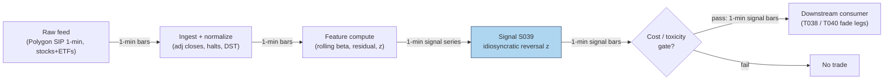

## Stage 39/200 — S039: Idiosyncratic (residual) short-term reversal

*Batch SB6 · Signal 39/100 · Provenance [D/SR] · Family C — Intraday Mean Reversion & Reversal*

### S1. One-line verdict

| | |
|---|---|
| **What it is** | Strip market/sector factors out of each stock's return, then fade the leftover *idiosyncratic* (stock-specific) jump — the part the broad market did not cause. |
| **When it works** | Stock-specific liquidity shocks in large caps: the move is real, the market is calm, and the residual mean-reverts as liquidity providers get paid. |
| **When it dies** | Market-wide selloffs (everything moves together — there is no residual to fade), factor-model misspecification, or when the "idiosyncratic" move is actually news. |
| **Build-or-buy in one line** | Build: one regression per stock per bar on 1-minute data; buy the sector-ETF (exchange-traded fund) bars, build the residualizer. |

Provenance **[D/SR]** — documented core (Lehmann 1990 / Jegadeesh 1990 reversal; Heston et al. 2010 sub-hour component) with standard-reconstruction intraday extension (factor residualization on intraday bars). Never upgraded: the intraday residual-reversal strategy specifics remain [SR] until a dedicated intraday citation is added.

### S2. How it works — plain human explanation

It is 10:15. The market (SPY) is flat on the morning. Stock B — a large-cap industrial — suddenly drops 0.50% in 30 minutes on heavy but anonymous volume. Stock A, its sector peer, is down 0.12% — roughly in line with its sector ETF. The residual trader asks: *how much of each move did the market explain?* For A, almost all of it (its **residual** — the return left over after subtracting what the factor model predicts — is only −0.09%). For B, almost none of it (residual −0.47% of the −0.50% move). Only B's drop is **idiosyncratic** (stock-specific, not explained by common factors), so only B is faded.

Why should this exist economically? A **factor model** (a regression that explains each stock's return as a mix of common market/sector factors plus a stock-specific leftover) separates two kinds of price pressure. Market-wide pressure is usually information or risk repricing — it does *not* reliably reverse. Stock-specific pressure with no news is usually a **liquidity shock** (someone needed to trade now and paid for immediacy): the price overshoots, liquidity providers absorb it, and the price decays back as compensation for that service. Residualization is the filter that keeps the second kind and discards the first — which is why residual reversal survives costs that kill naive reversal (Blitz et al., below).

Mental model:
- Raw reversal fades *moves*; residual reversal fades *liquidity shocks*.
- The factor model is a noise-canceling headphone: it removes the market's roar so you can hear the stock's own echo.
- If your "residual" still correlates with the market, your factor model is broken — fix the hedge before trading the signal.

### S3. The math — exact formula

One-factor (market) version; multi-factor adds sector terms. For stock i at bar t:

r(i,t) = α(i) + β(i) · r_mkt(t) + u(i,t)

where r are log returns, β(i) is the stock's **beta** (sensitivity to the market; β=1 moves one-for-one), and u(i,t) is the residual. Estimated over a trailing window (chatbot Q-SB6-1 practical grid, labeled lead: 60–250 daily bars, or 1–6 months of intraday bars; re-estimate betas every 1–20 days):

û(i,t) = r(i,t) − α̂(i) − β̂(i) · r_mkt(t)

**Signal**: cumulate the residual over lookback L (5–60 min intraday):

U(i,t,L) = Σ_{ℓ=0}^{L−1} û(i,t−ℓ),   s(i,t) = −sign(U(i,t,L))

**Scaled**: z(i,t) = U(i,t,L) / (σ̂(u,i,t) · √L), where σ̂ is trailing residual volatility. Trade if |z| ≥ z* (*example* 1.5 — not an institutional standard).

**Portfolio construction** (dollar-neutral cross-section): w(i,t) = −(rank(U(i,t)) − rank̄) / Σ|rank(U) − rank̄| — long the most negative residuals, short the most positive, weights summing to zero net dollars.

| Parameter | Symbol | Typical range | Too small | Too large | Default (example) |
|---|---|---|---|---|---|
| Factor window | W | 60–250 d (or 1–6 mo intraday) | noisy β, hedge leaks | stale β, regime blindness | 120 d |
| Residual lookback | L | 5–60 min | bounce noise | shock already decayed | 30 min |
| Hold | H | 15 min–1 d | exit inside bounce | overnight gap risk | 60 min |
| Entry threshold | z* | 0.5–2.0 | overtrading | no trades | 1.5 |
| Beta refresh | — | 1–20 d | estimation churn | stale hedge | 5 d |

Causal timing: β̂ estimated on data ≤ t−1 (never the formation window — that would regress the shock on itself); U(i,t,L) uses bars ≤ t; earliest fill t+1. Variants: (1) market-only residual (SPY beta); (2) sector+market residual (adds sector ETF — kills industry momentum contamination, cf. Da et al. 2014); (3) PCA (principal component analysis)/statistical-factor residual (S080-style eigenportfolios — no ETF needed, but factors can rotate).

### S4. Worked example — step-by-step numbers (SYNTHETIC)

Synthetic panel, seed 43, from `batches/SB6/plot_S039.py`. One-factor model, six 5-minute buckets (30-min formation), β_A = 1.0, β_B = 0.9, residual vols σ̂_A = 0.05%, σ̂_B = 0.09% per bucket:

| bkt | mkt % | raw A % | resid A % | raw B % | resid B % |
|---|---|---|---|---|---|
| 1 | +0.02 | +0.01 | −0.01 | −0.12 | −0.14 |
| 2 | −0.03 | −0.05 | −0.02 | −0.10 | −0.07 |
| 3 | −0.04 | −0.06 | −0.02 | −0.09 | −0.05 |
| 4 | +0.01 | +0.00 | −0.01 | −0.08 | −0.09 |
| 5 | +0.02 | +0.01 | −0.01 | −0.06 | −0.08 |
| 6 | −0.01 | −0.03 | −0.02 | −0.05 | −0.04 |
| **cum** | | **−0.12** | **−0.09** | **−0.50** | **−0.47** |

z_A = −0.09 / (0.05·√6) = **−0.73**; z_B = −0.47 / (0.09·√6) = **−2.15**. With the example |z| ≥ 1.5 rule: **fade B only** — A is market-driven noise, B is a genuine idiosyncratic leg (95% of its move is residual).

Fade-B trade walk: long B at 99.500 (bucket-6 close, midpoint-marked — see contamination note), exit three buckets later at 99.800 as it reverts (+0.30% raw, +0.30% residual, market flat). Gross **+30.2 bp** (basis points; 1 bp = 0.01%); costs: effective half-spread 3 bp × 2 legs = 6 bp + 1 bp fees + 2 bp slippage/impact allowance (assembling the residual basket, adverse-selection buffer) = 9 bp → **net +21.2 bp** on this toy trade.

What to notice: the example is rigged to be clean — real residuals are noisier, betas drift, and the "market flat" hold never happens. The takeaway is comparative: residualization *ranked* B over A correctly — the entire job of S039. Nothing here is a backtest.

**Bounce-contamination note (mandatory):** this worked example marks entry/exit on midquotes and charges effective-spread costs — the S038 diagnostics apply in full: a residual strategy evaluated on transaction prices with a 1-day lag skipped (to dodge the bounce) is the documented honest configuration (Blitz et al. use a 1-day implementation lag for exactly this reason).

### S5. Strategies that use this signal

- **T038 — Sector Momentum + Idiosyncratic Fade**: primary trigger for the fade leg — long sector momentum while fading idiosyncratic residual extremes (S039 *is* the fade).
- **T040 — PCA Eigenportfolio Residual Reversal**: primary trigger — statistical-factor residuals instead of ETF-based ones; same fade logic.
- **T027 — Illiquidity Temporary-Impact Fade**: S039 as the stock-selection filter — only fade overextended moves whose residual (not raw) component is extreme, exiting on the resiliency half-life.

### S6. Data required — exact spec

| Field | Type | Granularity | Source tier | Notes |
|---|---|---|---|---|
| Stock 1-min OHLCV (open, high, low, close, volume) | float/int | 1-min bars | Tier 1 | formation + hold measurement |
| Market/sector ETF 1-min bars | float | 1-min bars | Tier 1 | SPY + 11 sector SPDRs as factor proxies |
| Corporate actions | adjustments | daily | Tier 1 | splits poison both β and residuals |
| Session/halt calendar | timestamps | daily | Tier 1 | exclude halts, half-days, DST (daylight-saving time) |

Collection: Polygon stocks v3 aggregates (stocks + ETFs, one subscription) or Alpaca SIP (Securities Information Processor consolidated feed). Ingest sketch (≤20 lines, polars):

```python
import polars as pl
bars = pl.read_parquet("bars/1min/*.parquet")      # ts, sym, c
spy  = pl.read_parquet("bars/1min/SPY.parquet").select("ts", mkt="c")
r = (bars.join(spy, on="ts").sort(["sym","ts"])
        .with_columns(r=pl.col("c").log().diff().over("sym"),
                      rm=pl.col("mkt").log().diff()))
# rolling beta vs SPY, 120-bar window, then residual
b = (r.with_columns(b=(pl.col("r").rolling_cov(pl.col("rm"),120)
                      / pl.col("rm").rolling_var(120)).over("sym"))
        .with_columns(u=pl.col("r") - pl.col("b")*pl.col("rm"))
        .with_columns(U=pl.col("u").rolling_sum(6).over("sym")))   # L=30min
```

Storage: per `notes/cost-model.md` §4, 1-min bars for 500 symbols ≈ 50 MB/day, ≈3 GB per 60 days — archive freely (§3's ~12 MB cell conflicts with its own per-symbol-day row; §4 is the planning number); the 11 sector ETFs add ~11 symbol-days, negligible. Data-quality checklist: ETF bars must be dividend-adjusted identically to stocks; beta windows must end before the formation window (no lookahead); delisted symbols retained (survivorship); halt bars excluded from residual sums.

### S7. Local build on M5 Max / 128GB

**Feasibility: trivial.** The workload is S038's 1-minute-bar scan plus one rolling covariance per symbol — still seconds for the 500-symbol daily scan (`cost-model.md` §2). 60 days of history ≈ 3 GB (§4); the 120-day beta window ≈ 6 GB — both inside the ~77GB working budget (§3). Bottleneck: not CPU or RAM, but **factor-model hygiene** — beta staleness and ETF adjustment errors are where this signal silently dies. Stack: Python+polars; no Rust needed. Engineering: **Tier L, 4–12 h ≈ $600–1,800** at $150/hr loaded (§5) — a day's work for the residualizer plus the contamination battery. (Chatbot Q-SB6-2's 240–570 h covers a three-engine institutional build — gap scanner + HY lead-lag + L1 resiliency — and does not describe this signal; cost-model tiers take precedence.) Scaling to 500 symbols changes nothing; scaling to tick-level residuals would need L1 storage discipline (per-symbol daily files, §3).

### S8. Buy vs build

| Option | What you get | Indicative price | Gains | Loses |
|---|---|---|---|---|
| Tier 0: Stooq / Alpaca IEX | Daily bars, IEX quotes | ~$0 | free factor-proxy prototyping | no full SIP NBBO |
| Tier 1: Polygon Stocks Advanced | Full SIP 1-min bars incl. ETFs | ~$30–200/mo | one subscription covers stocks+factors | — |
| Tier 2: Databento | L1 + reference symbology | ~$200/mo + usage | execution-grade timestamps | overkill for a 1-min residualizer |
| Academic: Barra/Axioma-style risk models | Commercial factor betas | $$$$ | practitioner-grade hedges | cost; licensing |

All prices `indicative — verify before budgeting` (per `notes/cost-model.md` §6 price bands). **Verdict: build.** Buy the Tier-1 SIP bars (stocks + sector ETFs in one feed), build the residualizer — the beta-refresh cadence, the residual lookback, and the z-threshold are the strategy, and no vendor sells them. Buy a commercial risk model only if you scale to portfolio-level hedging where your rolling betas prove unstable.

### S9. Success ratio / efficacy — documented evidence

| Study / source | Market & period | Metric | Before/after cost | Caveat |
|---|---|---|---|---|
| Da, Liu & Schaumburg (2011/2014), "Decomposing Short-Term Return Reversal", FRB NY Staff Report 513 / *Management Science* | US large caps w/ analyst coverage, monthly, 27 yrs | residual-based reversal: 1.57%/mo raw; **1.34%/mo three-factor alpha** (t=9.28), ~4× the standard STR alpha; midpoint-based returns also profitable | before cost (midpoint-robustness shown) | monthly formation — the intraday extension is [SR], not this paper |
| Blitz, Huij, Lansdorp & Verbeek, "Short-Term Residual Reversal" (working paper; Robeco) | US stocks, post-1990, incl. large caps | "statistically and economically significant profits **net of trading costs**, even for large caps post-1990"; ~2× the risk-adjusted return of conventional reversal | **after cost (stated qualitatively)** | working paper; exact bp figures not independently verified — see Unverified leads |
| Avramov, Chordia & Goyal (2006), *J. Finance* | US stocks, monthly | reversals concentrated in illiquid high-turnover names; contrarian profits "smaller than the likely transactions costs" | **after cost → negative** for naive version | motivates residualization: the naive leg is where costs win |
| Da, Liu & Schaumburg (2014), within-industry double sort | same sample | 1.51%/mo raw; 1.26%/mo 3-factor alpha | before cost | cash-flow-news orthogonalization; needs analyst-revision data |

Regimes where it fails: market-wide stress (residuals shrink as correlations → 1; Nagel 2012 shows reversal payoffs co-move with VIX — the premium is compensation for liquidity provision, and it demands capital exactly when capital is scarce); factor-model breakdowns (sector ETF basis vs constituents); crowded quant unwinds (Khandani & Lo 2007 document the strategy's decay episodes). Bottom line: as a standalone trigger this is a **documented, cost-surviving edge in large caps** — but it is a liquidity-provision premium: it loses money in the states of the world where you most want protection.

### S10. Failure modes & pitfalls

1. **Bounce contamination (again)** — residuals computed on transaction prices inherit the S038 artifact. *Mitigation:* midquote marks, 1-day/1-bar implementation lag, effective-spread costing — the full S038 battery.
2. **Hedge leakage** — stale or wrong β leaves market exposure in the "residual". *Mitigation:* refresh betas every 1–20 days; monitor residual–market correlation out of sample; prefer sector+market over market-only.
3. **News masquerading as liquidity** — a −0.47% residual with no *visible* news may still be informed flow. *Mitigation:* earnings/announcement blackout; news-novelty filter (S093); toxicity veto (S008).
4. **Factor-model misspecification** — missing factors (style, industry) create phantom residuals. *Mitigation:* sector terms at minimum; PCA residual cross-check (S080).
5. **Lookahead in beta estimation** — including the formation window in the regression. *Mitigation:* estimation window strictly ends before formation; walk-forward only.
6. **Crowding / quant-unwind risk** — everyone fading the same residuals. *Mitigation:* capacity caps; turnover budgeting; monitor pairwise strategy crowding proxies.
7. **Survivorship bias** — delisted names had the juiciest "reversals". *Mitigation:* point-in-time universe with delisting returns.
8. **Overfitting (L, z*, H)** — same grid-mine as S038. *Mitigation:* purged/embargoed CV (S088); stability across subperiods required.

### S11. Visuals




### S12. Sources

- Da, Z., Liu, Q., & Schaumburg, E. (2014). "Decomposing Short-Term Return Reversal." FRB NY Staff Report No. 513 (2011); published version "A Closer Look at the Short-Term Return Reversal," *Management Science* 60(3), 658–674. https://fraser.stlouisfed.org/docs/publications/frbnysr/frbny_sr513.pdf and https://www3.nd.edu/~zda/Reversal.pdf
- Blitz, D., Huij, J., Lansdorp, S., & Verbeek, M. "Short-Term Residual Reversal." Working paper (Robeco / Erasmus). https://efmaefm.org/0EFMSYMPOSIUM/2012/papers/017_update.pdf ; summary https://www.robeco.com/en-int/insights/2011/11/short-term-residual-reversal
- Avramov, D., Chordia, T., & Goyal, A. (2006). "Liquidity and Autocorrelations in Individual Stock Returns." *Journal of Finance* 61(5), 2365–2394. https://doi.org/10.1111/j.1540-6261.2006.01060.x
- Nagel, S. (2012). "Evaporating Liquidity." *Review of Financial Studies* 25(7), 2005–2039. https://doi.org/10.1093/rfs/hhs066

**Chatbot source (labeled):** Duck.ai (GPT-5.6 Luna via duck.ai, anonymous) answered Q-SB6-1–Q-SB6-3 (2026-09-10); Grok/Cursor answers pending (checked 2026-09-10). Q-SB6-1 supplied the r(i,t) = α + βᵀf + u residualization notation and practical grid used in S3; Q-SB6-3 supplied the "residualization separates genuine idiosyncratic reversal from broad-market moves" framing used in S2/S9, verified against Da et al. and Blitz et al. above.

**Unverified leads:**
- Duck.ai Q-SB6-3 literature summary: residual reversal "net ~44bp/mo (largest 500) / ~54bp/mo (largest 100) after costs + 1-day lag" — internally consistent with the cited papers' direction but the exact figures could not be independently verified in this batch's research; do not quote as fact.
