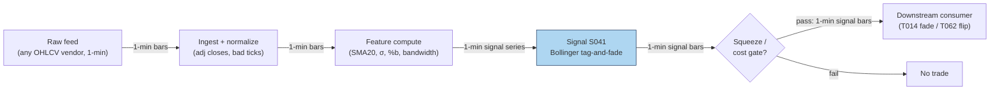

## Stage 41/200 — S041: Bollinger-band reversal

*Batch SB6 · Signal 41/100 · Provenance [D] · Family C — Intraday Mean Reversion & Reversal*

### S1. One-line verdict

| | |
|---|---|
| **What it is** | Fade price tags of Bollinger bands (SMA ± kσ): a close outside the band that falls back inside is treated as an exhausted ~2σ excursion reverting to the mid. |
| **When it works** | Range-bound, two-sided markets where volatility is stationary — the band means what it says, and tags are liquidity events, not breakouts. |
| **When it dies** | Trends and volatility breakouts ("walking the band"): fading those is stepping in front of a repricing; the squeeze/breakout use (family B) is the opposite trade. |
| **Build-or-buy in one line** | Build: two rolling statistics on any OHLC feed; buy nothing except the bars. |

Provenance **[D]** (documented): Bollinger, *Bollinger on Bollinger Bands* (2001); Fang, Jacobsen & Qin (2014). Family C — Intraday Mean Reversion & Reversal.

### S2. How it works — plain human explanation

It is 11:20. Stock SYN has chopped between 99.50 and 100.50 all morning; its 20-minute average is 100.00, typical wiggle (standard deviation) 0.25. It spikes to 100.62 — above the upper band at 100.50 — on a burst of market buys, then prints 100.40, back inside. The **Bollinger bands** (a moving-average midline ± k standard deviations — a volatility-adaptive envelope) just defined "unusually far, unusually fast." The fade logic says: the impulse failed to *expand* — nobody followed through — so the excursion was impatient liquidity demand, and price should drift back toward the mid.

Economically this is S038 in a different hat: a band tag is a standardized way of detecting a short-horizon liquidity shock. The band's width adapts to recent volatility, so a tag means "large *relative to what this name has been doing*" — the same temporary-impact story (price concession for immediacy, decaying as the book refills). The failure mode is equally familiar: when the tag is the *start* of a volatility breakout — the **squeeze** (bandwidth collapsing to a multi-month low, then price exploding out) — fading it is fading a genuine repricing. Bollinger's own rule: tags alone are not signals; the *confirmation* (close back inside) is the signal.

Mental model:
- Bands = a volatility ruler. A tag = "this move is big for this stock, right now."
- Tag + close back inside = exhausted impulse → fade to the mid. Tag + follow-through = breakout → do not fade (family B, S030).
- After a tag, the band itself is contaminated (the spike inflates σ) — expect wide bands and size down.

### S3. The math — exact formula

For closes P_t, window n, multiplier k:

Mid_t = SMA(n)_t = (1/n) Σ_{i=0}^{n−1} P_{t−i}
σ_t = std(P_{t−n+1..t})   (sample standard deviation, ddof=1)
Upper_t = Mid_t + k·σ_t,   Lower_t = Mid_t − k·σ_t

**Position-in-band** (%b — price position between bands; 0 = lower, 1 = upper):

%b_t = (P_t − Lower_t) / (Upper_t − Lower_t)

**Bandwidth** (normalized band width — the squeeze detector):

Bandwidth_t = (Upper_t − Lower_t) / Mid_t × 100%

**Fade rule (tag-and-reenter):** if P_t < Lower_t (%b_t < 0) and P_{t+1} > Lower_{t+1} (back inside) → long at P_{t+1}; target = Mid; exit on mid touch or after M bars (*example* M = 10 — not an institutional standard). Mirror for upper tags (short). Stop: beyond the tag extreme by a fraction of σ (*example* 0.5σ).

| Parameter | Symbol | Typical range | Too small | Too large | Default (example) |
|---|---|---|---|---|---|
| Window | n | 10–50 bars | bands hug noise; constant tags | sluggish; tags arrive late | 20 |
| Multiplier | k | 1.5–2.5 | tags on every wiggle | almost never tags | 2.0 |
| Exit horizon | M | 5–20 bars | exit inside bounce | give back the reversion | 10 |
| Squeeze filter | bandwidth pct | 5–20th pct | filters everything | filters nothing | <10th pct = skip fades |

Causal timing: Mid_t, σ_t use closes ≤ t; tag confirmed at t+1's close; earliest fill t+1 (enter at P_{t+1}'s close or t+2's open). Variants: (1) **tag-and-reenter** (this chapter — confirmation-based); (2) **pure tag fade** (enter at the tag bar close — earlier, more false positives); (3) **squeeze-breakout** (family B/S030 — trade *with* the expansion, the anti-fade).

### S4. Worked example — step-by-step numbers (SYNTHETIC)

Synthetic 70-bar 1-minute series, seed 44 (`batches/SB6/plot_S041.py`), n=20, k=2; mean-reverting noise plus two engineered excursions. The script selects each side's deepest tag that re-enters the band next bar.

**Lower-tag event (long fade).** Bar 32 tags (close 97.652 < lower 97.999, %b −0.099, bandwidth 3.52%); bar 33 closes back inside (98.736 > lower 97.882) → **long** at 98.736; exit bar 34 at 99.773 on mid touch. P&L = **+1.037/share = +105.0 bp** (basis points; 1 bp = 0.01%) before costs.

**Upper-tag event (short fade).** Bar 54 tags (close 102.132 > upper 101.947, %b 1.063, bandwidth 2.93%); bar 55 closes back inside (100.983 < upper 101.996) → **short** at 100.983; exit bar 56 at 100.022 on mid touch. P&L = **+0.961/share = +95.2 bp** before costs.

**Costs (example — not an institutional standard):** three-component stack per round trip — effective half-spread ≈ 1 bp per leg (2 bp round trip) + fees ≈ 0.5 bp per leg (1 bp round trip) + slippage/impact allowance ≈ 1 bp per leg (2 bp round trip) = 5 bp round trip. Lower-tag event: +105.0 bp gross → **+100.0 bp net**; upper-tag event: +95.2 bp gross → **+90.2 bp net**. The S10 gate (|expected move| > 2× round-trip cost, i.e. > 10 bp here) passes on this engineered tape — on real tapes, where the expected move is 5–10 bp against the same 5 bp stack, that gate is what kills most band fades.

What to notice: both winners are engineered — the excursions were *designed* to revert, so +105bp/+95bp prove the arithmetic, not the edge. The instructive number is bandwidth: 3.5% and 2.9% — the tags inflated σ so badly that %b barely registered (−0.099 on the lower tag). That band-contamination means your "2σ event" was really a ~1σ event against a panicked band — size accordingly, and never present toy-tape P&L as a backtest.

**Bar-level tape (7 bars per event, n=20, k=2):**

| bar | close | SMA20 | σ | lower | upper | %b | bw% | note |
|---|---|---|---|---|---|---|---|---|
| 29 | 100.051 | 100.096 | 0.125 | 99.847 | 100.345 | +0.409 | 0.50 | quiet |
| 30 | 98.808 | 100.028 | 0.312 | 99.403 | 100.652 | −0.476 | 1.25 | dip starts |
| 31 | 97.086 | 99.872 | 0.725 | 98.421 | 101.323 | −0.460 | 2.91 | inside, σ inflating |
| 32 | 97.652 | 99.752 | 0.877 | 97.999 | 101.505 | −0.099 | 3.52 | **tag** (close < lower) |
| 33 | 98.736 | 99.684 | 0.901 | 97.882 | 101.486 | +0.237 | 3.62 | back inside → **long** |
| 34 | 99.773 | 99.663 | 0.893 | 97.876 | 101.450 | +0.531 | 3.59 | mid touched → **exit** |
| 35 | 100.096 | 99.658 | 0.890 | 97.877 | 101.439 | +0.623 | 3.57 | — |
| 51 | 100.010 | 99.981 | 0.655 | 98.671 | 101.290 | +0.511 | 2.62 | quiet |
| 52 | 101.047 | 100.150 | 0.416 | 99.318 | 100.982 | +1.039 | 1.66 | spike starts |
| 53 | 102.857 | 100.356 | 0.639 | 99.078 | 101.635 | +1.478 | 2.55 | inside, σ inflating |
| 54 | 102.132 | 100.474 | 0.736 | 99.002 | 101.947 | +1.063 | 2.93 | **tag** (close > upper) |
| 55 | 100.983 | 100.519 | 0.739 | 99.041 | 101.996 | +0.657 | 2.94 | back inside → **short** |
| 56 | 100.022 | 100.509 | 0.744 | 99.021 | 101.998 | +0.336 | 2.96 | mid touched → **exit** |
| 57 | 99.695 | 100.483 | 0.764 | 98.955 | 102.011 | +0.242 | 3.04 | — |

### S5. Strategies that use this signal

- **T014 — Bollinger Reversal + Squeeze Exit**: primary trigger — fades band tags; covers into bandwidth-squeeze expansions and vol breakouts (the anti-fade escape hatch).
- **T062 — Streak Runner with Exhaustion Flip**: S041 as the exhaustion-flip trigger — a band tag after a consecutive-bar streak.
- **T054 — Hurst/Variance-Ratio Regime Toggle**: S041 as a regime-gated trigger — fade only when Hurst < 0.5 (mean-reverting); stand down when Hurst > 0.5 (trending).
- **T069 — Late-Day Reversal into Close**: S041 as a secondary timing filter for last-30-minute fades.

### S6. Data required — exact spec

| Field | Type | Granularity | Source tier | Notes |
|---|---|---|---|---|
| OHLCV (open, high, low, close, volume) | float/int | 1–15 min bars (or daily) | Tier 0–1 | any vendor; the signal is vendor-agnostic |
| Corporate actions | adjustments | daily | Tier 1 | unadjusted splits create phantom tags |

Collection: any OHLCV vendor — Stooq daily for research, Polygon/Alpaca 1-min for intraday. Ingest sketch (≤20 lines, polars):

```python
import polars as pl
b = pl.read_parquet("bars/1min/SYN.parquet").sort("ts")
s = (b.with_columns(mid=pl.col("c").rolling_mean(20),
                    sd =pl.col("c").rolling_std(20))
        .with_columns(up=pl.col("mid")+2*pl.col("sd"),
                      lo=pl.col("mid")-2*pl.col("sd"))
        .with_columns(pctb=(pl.col("c")-pl.col("lo"))/(pl.col("up")-pl.col("lo")),
                      bw=(pl.col("up")-pl.col("lo"))/pl.col("mid")*100))
tag = (s.with_columns(tagL=(pl.col("c")<pl.col("lo")) & (pl.col("c").shift(1)>=pl.col("lo").shift(1))))
```

Storage: per `notes/cost-model.md` §4, 1-min bars for 500 symbols ≈ 50 MB/day, ≈3 GB per 60 days — archive freely (§3's ~12 MB cell conflicts with its own per-symbol-day row; §4 is the planning number). Data-quality checklist: split/dividend adjustment (phantom tags), half-day/DST (daylight-saving time) calendars, bad-tick filtering (a single bad print tags the band and inflates σ for 20 bars).

### S7. Local build on M5 Max / 128GB

**Feasibility: trivial.** Two rolling statistics over 1-minute bars: 500 symbols × 390 bars = 195k rows/day, milliseconds in polars (~10–50M rows/sec, `cost-model.md` §2). A 60-day 500-symbol archive is ≈3 GB (`cost-model.md` §4) against the ~77GB working budget (§3); even a 10-year daily archive for 3,000 stocks is ~2–5 GB — fits. Bottleneck: none computationally; the real work is parameter-stability analysis (S088 purged validation across the (n, k, M) grid). Stack: Python+polars for everything; this signal never justifies Rust. Engineering: **Tier L, 4–12 h ≈ $600–1,800** at $150/hr loaded (§5) — an afternoon including the squeeze filter and the tag-confirmation variants. (The chatbot's Q-SB6-2 240–570 h figure describes a three-engine institutional build — gap scanner, HY lead-lag, L1 (level-1) resiliency — not a two-rolling-stat signal; cost-model tiers take precedence.) What breaks first at 500 symbols: nothing. Full OPRA (Options Price Reporting Authority consolidated options feed) is irrelevant to this signal.

### S8. Buy vs build

| Option | What you get | Indicative price | Gains | Loses |
|---|---|---|---|---|
| Tier 0: Stooq / broker charts | Daily bars, built-in BB overlays | ~$0 | instant visualization | no intraday, no custom rules |
| Tier 1: Polygon / Alpaca SIP (Securities Information Processor consolidated feed) | 1-min bars for backtest | ~$30–200/mo | full parameter sweeps | — |
| Retail platforms (QuantConnect etc.) | Canned Bollinger strategies | free–$$/mo | quick prototype | black-box rules; no bounce diagnostics |
| Book route: Bollinger (2001) | Canonical methods (squeeze, %b) | ~$40 book | the inventor's own rules | not a backtest |

All prices `indicative — verify before budgeting` (per `notes/cost-model.md` §6 price bands). **Verdict: build, trivially.** The indicator is two lines of code; any edge lives in your confirmation rule, squeeze filter, and cost model — none for sale. Buy nothing beyond the bar feed.

### S9. Success ratio / efficacy — documented evidence

| Study / source | Market & period | Metric | Before/after cost | Caveat |
|---|---|---|---|---|
| Fang, Jacobsen & Qin (2014), "Popularity versus Profitability", SSRN 2484322 | International stock markets, pre/post-1983 | BB signals "extremely profitable" before introduction; predictability "gradually decreased" after the 2001 book; "largely disappeared" in the US first | before cost | documents *decay*, not a tradable edge — the honest headline |
| Hisarli, Lim & Ng (2013/2014), "The Profitability of a Combined Signal Approach: Bollinger Bands and the ADX", IFTA Journal / SSRN 2230499 | 6 large-cap indices (CAC, DAX, FTSE, HSI, KOSPI, NIKKEI), 1995–2012 | BB-only "would underperform a buy and hold strategy in most of the markets studied"; tactical short-horizon use shows positive skew; ADX filter adds little systematically | cost labeling unclear from abstract — treat as before-cost | index-level, daily; the fade variant is not isolated |
| Lento, Gradojevic & Wright (2007), via Wikipedia "Bollinger Bands" summary | Dow Jones + foreign-exchange (FX), from 1995, ~a decade | standard BB: "no evidence of consistent performance over buy and hold"; **contrarian** (reversed) BB: "produced positive returns in a variety of markets" | before cost (tertiary summary) | the contrarian finding is the fade analog — but verify in the original |
| Bollinger (2001), *Bollinger on Bollinger Bands* (McGraw-Hill) | practitioner canon | methods: %b, bandwidth, the Squeeze, M/W patterns, "walking the band" | n/a — method source | not a performance study; the squeeze chapter is the anti-fade manual |

Bottom line: as a standalone trigger the documented record is **decay and disappointment** — the simple rule's edge was arbitraged away as the indicator went mainstream, and "walking the band" episodes are where fade-only traders blow up. As a *conditional* trigger (range-only, squeeze-filtered, confirmation-required, costs modeled) it is a plausible small edge — but the burden of proof is on your out-of-sample test, not the literature.

### S10. Failure modes & pitfalls

1. **Walking the band** — fading a trend's band-tags repeatedly into a repricing. *Mitigation:* squeeze/bandwidth-expansion filter (S030); regime gate (Hurst/VR S090, S054); hard stop beyond the tag extreme.
2. **Band contamination** — the tag inflates σ, so subsequent "tags" are meaningless and %b understates penetration. *Mitigation:* freeze or down-weight bands for n bars after a tag; size on pre-tag σ.
3. **Lookahead** — computing the tag on a bar that hasn't closed. *Mitigation:* signals on closed bars only; fill at next bar.
4. **Parameter mining** — the (n, k, M) grid is a classic overfit surface. *Mitigation:* purged/embargoed CV (S088); pre-commit to (20, 2) as the default and demand the variant beat it out of sample.
5. **Cost blindness** — band fades are short-horizon; spread+fees dominate. *Mitigation:* model effective spread explicitly; require |expected move| > 2× round-trip cost as a gate.
6. **Corporate-action phantom tags** — splits/dividends print fake excursions. *Mitigation:* adjusted closes; corporate-action calendar.
7. **Bad ticks** — one bad print tags the band and poisons σ for n bars. *Mitigation:* bad-tick filters; median-based robust σ variant.
8. **Volatility-regime blindness** — fixed (20, 2) misbehaves when vol doubles. *Mitigation:* normalize thresholds by vol regime; re-validate quarterly.

### S11. Visuals




### S12. Sources

- Bollinger, J. (2001). *Bollinger on Bollinger Bands*. McGraw-Hill. ISBN 9780071373685.
- Fang, J., Jacobsen, B., & Qin, Y. (2014). "Popularity versus Profitability: Evidence from Bollinger Bands." SSRN 2484322. https://papers.ssrn.com/sol3/papers.cfm?abstract_id=2484322
- Hisarli, T., Lim, K. J. S., & Ng, S. H. (2013). "The Profitability of a Combined Signal Approach: Bollinger Bands and the ADX." *IFTA Journal*. SSRN 2230499. https://papers.ssrn.com/sol3/papers.cfm?abstract_id=2230499
- Leeds, M. "Bollinger Bands Thirty Years Later." arXiv:1212.4890 — rolling-regression / state-space statistical underpinnings of Bollinger Bands; pairs-trading (BBPT) construction. https://ar5iv.labs.arxiv.org/html/1212.4890
- Wikipedia contributors, "Bollinger Bands" — Lento et al. (2007) contrarian-BB summary. https://en.wikipedia.org/wiki/Bollinger_Bands

**Chatbot source (labeled):** Duck.ai (GPT-5.6 Luna via duck.ai, anonymous) answered Q-SB6-1–Q-SB6-3 (2026-09-10); Grok/Cursor answers pending (checked 2026-09-10). The SB6 question set contained **no S041 material** — Q-SB6-1 covered gap/jump, sub-hour reversal, residual reversal, resiliency, and Hayashi–Yoshida; Q-SB6-3 covered gap fade, jump filtering, short-term reversal, lead-lag, and macro drift. No chatbot arithmetic or literature claims were used in this chapter; the worked example and parameters are the author's own synthetic construction (seed 44).

**Unverified leads:** none — performance claims above trace to the cited papers; the worked example is labeled synthetic throughout.
