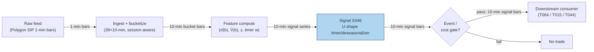

## Stage 46/200 — S046: Intraday seasonality (U-shape) reversal timer

*Batch SB6 · Signal 46/100 · Provenance [D] · Family C — Intraday Mean Reversion & Reversal*

### S1. One-line verdict

| | |
|---|---|
| **What it is** | Use the U-shaped intraday volatility/return profile — wild at the open, dead at lunch, wild at the close — as a *timer and deseasonalizer* for reversal trades: scale signals by what is normal for that bucket, and take reversals when mean reversion is seasonally strongest. |
| **When it works** | Normal trading days with the classic U-profile: lunch-hour dislocations revert as liquidity returns; close-auction dynamics concentrate at known times. |
| **When it dies** | Event days (FOMC, CPI) that flatten or invert the profile; the naive direction ("always fade the open/close move") which is instrument-specific and often untradable after spreads. |
| **Build-or-buy in one line** | Build: 39 bucket means on 1-minute bars; buy nothing — the profile is free once you have the bars. |

Provenance **[D]** (documented): Wood, McInish & Ord (1985); Harris (1986); Andersen & Bollerslev (1997); Heston, Korajczyk & Sadka (2010) on sub-hour reversal interacting with the profile. Family C — Intraday Mean Reversion & Reversal. This is the U-shaped *volatility/return-seasonality* signal — not a duplicate of SB5's periodicity material, which covers cross-day calendar periodicities (day-of-week, turn-of-month), not the within-day bucket profile.

### S2. How it works — plain human explanation

Every trading day has a heartbeat. At 9:30 the open is chaos: overnight news lands, market-on-open orders collide, and the first ten minutes print more volatility than any other bucket of the day. By noon the market is half asleep — spreads widen, volume dies, and a moderate order can push price around precisely because nobody is there to absorb it. At 3:50 the close is chaos again: index funds must match the closing auction, day traders flatten, and volume spikes to its daily peak. Plot average absolute return (or volume) against time of day and you get a **U-shape** (high at both ends, low in the middle) — one of the most replicated facts in market microstructure, documented since Wood, McInish & Ord (1985).

S046 turns that heartbeat into two tools. First, a **timer**: reversal signals (S038, S041, S039) are strongest when liquidity provision is being compensated most — the open's rush of uninformed flow and the lunch hour's thin-book dislocations. Second, a **deseasonalizer**: a 0.14% ten-minute move at noon is a scream; the same 0.14% at 9:35 is a whisper. Dividing the observed move by its bucket's typical size (the **seasonal component** — the predictable time-of-day pattern in volatility) turns raw moves into comparable signals. The trap is trading the profile's *direction* — "the close always reverses" — which is instrument-specific folklore, not a documented edge; the documented edge is using the profile to *time and scale* reversals, not to replace them.

Mental model:
- The U-profile = the market's daily breathing cycle. Reversals = trades that get paid for providing liquidity.
- Take reversals when the breathing is heavy (open/lunch dislocations) and size them by how unusual they are *for that hour*.
- Never trade "bucket 37 always mean-reverts" without a per-instrument, cost-aware backtest — that is the naive version Heston et al. show loses after spreads.

### S3. The math — exact formula

For each 10-minute bucket b ∈ {1..39} and day d, let r(b,d) be the bucket return. Estimate the seasonal profile over D trailing days:

σ̄(b) = (1/D) Σ_{d=1}^{D} |r(b,d)|   (mean absolute bucket return)
V̄(b) = (1/D) Σ_{d=1}^{D} vol(b,d)   (mean bucket volume)

**Deseasonalized move**: z(b,d) = r(b,d) / σ̄(b). A signal fires when |z| ≥ z* (*example* 1.5 — not an institutional standard).

**Reversal timer**: take a base reversal signal s₀(b,d) ∈ {−1,0,+1} (e.g., S038/S041) and weight by the profile:

w(b) = σ̄(b) / mean_b(σ̄(b))   (overweight high-seasonality buckets)
s(b,d) = w(b) · s₀(b,d) · 1[|z(b,d)| ≥ z*]

**Bucket-return variant** (naive, use with care): μ̄(b) = (1/D) Σ_d r(b,d); fade the sign of μ̄(b) — documented only as a descriptive statistic, not a standalone edge.

| Parameter | Symbol | Typical range | Too small | Too large | Default (example) |
|---|---|---|---|---|---|
| Bucket width | — | 5–30 min | noisy profile | profile too coarse | 10 min |
| Profile window | D | 20–60 d | unstable σ̄(b) | regime staleness | 30 d |
| Deseasonalized threshold | z* | 1.0–2.5 | noise trades | no trades | 1.5 |
| Timer weight cap | — | 1.5–3.0 | no timing effect | concentration risk | 2.0 |

Causal timing: σ̄(b) estimated on days ≤ d−1 only; today's bucket return uses bars ≤ the bucket close; earliest fill next bucket. Event-day override: skip or halve size on FOMC/CPI/NFP days (profile inverts). Variants: (1) volatility timer (this chapter); (2) volume-timer (weight by V̄(b) — the close-auction variant for T064); (3) bucket-return fade (T015's domain — instrument-specific, backtest required).

### S4. Worked example — step-by-step numbers (SYNTHETIC)

Synthetic 39-bucket profile, seed 46, from `batches/SB6/plot_S046.py` (U-shape: σ̄ ≈ 22 at open → 7 at lunch → 24 at close; volume 30 → 6 → 34, arbitrary units).

**Deseasonalization — the core arithmetic.** Take today's observed absolute bucket moves against the trailing profile (σ̄ from the prior 20 sessions, per the script's printed worked example). Open bucket: r = 0.19% vs typical σ̄ = 0.215% → z = 19.0/21.5 = **0.88** (normal for the open — no signal). Lunch bucket: r = 0.14% vs typical σ̄ = 0.078% → z = 14.0/7.8 = **1.79** ≥ 1.5 → **signal: fade the lunch dislocation**. Close bucket: r = 0.25% vs typical σ̄ = 0.231% → z = 25.0/23.1 = **1.08** (normal close chaos — no signal). The lunch move is the *smallest* raw move and the *largest* deseasonalized one — that inversion is the entire point of S046: without the profile you trade the open's noise; with it you trade the lunch's signal.

**Timer weighting.** w(open) = 21.5/12.8 ≈ 1.68, w(lunch) = 7.8/12.8 ≈ 0.61, w(close) = 23.1/12.8 ≈ 1.80 (mean σ̄ ≈ 12.8 across the 39-bucket synthetic profile). A base reversal signal firing at lunch gets *down-weighted* 0.56 on raw volatility — but the deseasonalized gate (z ≥ 1.5) is what admits it; the two tools do different jobs: the gate selects *unusual-for-this-bucket* moves, the weight sizes by *bucket importance*. Nothing here is a backtest; the numbers demonstrate the arithmetic, not profitability.

### S5. Strategies that use this signal

- **T064 — U-Shape Open/Close Timer**: primary trigger — concentrates reversal and liquidity-provision trades in the open/close buckets where the profile says edge lives; lunch-hour variant for thin-book dislocations.
- **T015 — Bucket-Return Seasonality Fade**: S046's μ̄(b) as primary trigger — fades the average bucket return; instrument-specific, requires the cost-aware backtest this chapter demands.
- **T044 — Close-Auction Imbalance Fade**: S046's volume profile V̄(b) as the timer — the close bucket's volume spike defines the auction window.
- **T038 — Sector Momentum + Idiosyncratic Fade**: S046 as a timer overlay on the residual fade — take idiosyncratic reversals when seasonally compensated.

### S6. Data required — exact spec

| Field | Type | Granularity | Source tier | Notes |
|---|---|---|---|---|
| 1-min OHLCV | float/int | 1-min bars | Tier 1 | aggregated to 10-min buckets |
| Session calendar | timestamps | daily | Tier 1 | open/close times, half-days, DST |
| Event calendar | dates | daily | Tier 0 | FOMC/CPI/NFP override days |

Collection: Polygon/Alpaca 1-min bars; bucketize in ingest. Ingest sketch (≤20 lines, polars):

```python
import polars as pl
b = (pl.read_parquet("bars/1min/*.parquet").sort(["sym","ts"])
       .with_columns(bkt=((pl.col("ts").dt.hour()*60
                           + pl.col("ts").dt.minute() - 570) // 10).clip(0, 38),
                     d=pl.col("ts").dt.date()))
k = (b.group_by(["sym","bkt","d"])
       .agg(r=pl.col("c").last()/pl.col("c").first() - 1,
            v=pl.col("v").sum()).sort(["sym","bkt","d"]))
prof = k.with_columns(sbar=pl.col("r").abs().rolling_mean(30).over(["sym","bkt"]))
```

Storage: per `notes/cost-model.md` §4, 1-min bars for 500 symbols ≈ 50 MB/day, ≈3 GB per 60 days (§3's ~12 MB cell conflicts with its own per-symbol-day row; §4 is the planning number); the 39-bucket profile per symbol is 39 floats — negligible. Data-quality checklist: DST transitions (bucket alignment shifts), half-days (drop or separate profile), corporate actions (adjust before bucketing), halt buckets (exclude).

### S7. Local build on M5 Max / 128GB

**Feasibility: trivial.** Bucketize 195k rows/day (500 symbols × 390 minutes), then 39 means per symbol — polars finishes before you blink (~10–50M rows/sec simple ops, `cost-model.md` §2). 60 days ≈ 3 GB (`cost-model.md` §4) against the ~77GB working budget (§3). Bottleneck: none — the work is statistical (profile stability across regimes, event-day handling), not computational. Stack: Python+polars; no Rust. Engineering: **Tier L, 4–12 h ≈ $600–1,800** at $150/hr loaded (§5) — a day for the profiler, the deseasonalizer, the event-day override, and the timer overlay onto S038/S041. (Chatbot Q-SB6-2's 240–570 h covers a three-engine institutional build — gap scanner, HY lead-lag, L1 resiliency — not a bucket-mean profiler; cost-model tiers take precedence.) Scaling: the profile is per-symbol embarrassingly parallel; 5,000 symbols changes nothing.

### S8. Buy vs build

| Option | What you get | Indicative price | Gains | Loses |
|---|---|---|---|---|
| Tier 0–1 bar feeds | 1-min bars (profile inputs) | ~$0–200/mo | everything needed | — |
| Bloomberg intraday-volatility model | Daily vol × periodic component decomposition | terminal $$$$ | practitioner-grade deseasonalizer | cost; black box |
| Academic code (Andersen–Bollerslev style) | FFF seasonal estimation | free (papers) | rigorous profile estimation | research-grade, needs adaptation |

All prices `indicative — verify before budgeting` (per `notes/cost-model.md` §6 price bands). **Verdict: build.** The U-profile is 39 means on bars you already buy for S038–S041; no vendor sells your instrument's bucket-return fade, and the Bloomberg decomposition is overkill for a timer. Buy nothing new.

### S9. Success ratio / efficacy — documented evidence

| Study / source | Market & period | Metric | Before/after cost | Caveat |
|---|---|---|---|---|
| Wood, McInish & Ord (1985), "An Investigation of Transactions Data for NYSE Stocks" | NYSE, intraday transactions | U-shaped intraday pattern in returns/volatility established | descriptive (before-cost by nature) | founding fact, not a strategy |
| Andersen & Bollerslev (1997), "Intraday Periodicity and Volatility Persistence in Financial Markets" | S&P 500, 5-min | average absolute returns ≈ 0.095% at open, 0.055% at noon, 0.105% near close; seasonal filtering (FFF) dramatically improves volatility forecasts | descriptive (before-cost) | the deseasonalizer's theoretical foundation |
| Heston, Korajczyk & Sadka (2010), "Intraday Patterns in Arbitrage Pricing" | US stocks, half-hour | sub-hour reversal tied to temporary liquidity imbalances; naive periodicity strategies lose money after the bid–ask spread | **after cost → naive version negative** | the cautionary row: timing ≠ free money |
| Bloomberg, "Intraday Volatility" (practitioner model) | practitioner | intraday vol = daily level × intraday periodic component; failing to remove seasonality misstates spot vol | n/a — modeling guidance | institutional confirmation of the deseasonalizer |

Bottom line: the U-shape itself is among the best-documented facts in microstructure — that is the [D]. What is *not* documented as a standalone edge is fading bucket-average returns; treat μ̄(b) strategies as [SR] until your own cost-aware backtest says otherwise. The defensible deployment is the timer/deseasonalizer role: scale and gate S038/S039/S041 by the profile.

### S10. Failure modes & pitfalls

1. **Naive bucket-direction trading** — "bucket 3 always reverses" without per-instrument evidence. *Mitigation:* require instrument-level backtest with costs; default to timer use.
2. **Event-day inversion** — FOMC/CPI days flatten or invert the U. *Mitigation:* event calendar override; separate event-day profile or stand down.
3. **Profile staleness** — vol regimes shift; a 2022 profile misprices 2024 buckets. *Mitigation:* 20–60 day trailing window; monitor profile drift.
4. **DST/half-day misalignment** — buckets shift by an hour or the day is truncated. *Mitigation:* session-aware bucketing; separate half-day profile.
5. **Liquidity mirage at lunch** — thin books mean the "dislocation" can't be traded at size. *Mitigation:* size by bucket depth, not just z; impact model per bucket.
6. **Overfitting the 39 buckets** — 39 means × sign choices = a multiple-testing playground. *Mitigation:* pre-commit to the U-shape functional form; shrinkage toward the pooled profile; S088 validation.
7. **Confusing volume and volatility profiles** — the close has huge volume *and* vol; lunch has low volume but tradeable dislocations. *Mitigation:* separate V̄(b) and σ̄(b) profiles; different timers for different strategies.
8. **Spread costs at the open/close** — the most "seasonal" buckets are also the most expensive. *Mitigation:* bucket-specific cost model; the timer weight must be net of bucket spreads.

### S11. Visuals




### S12. Sources

- Wood, R. A., McInish, T. H., & Ord, J. K. (1985). "An Investigation of Transactions Data for NYSE Stocks." *Journal of Finance* 40(3), 723–739. https://doi.org/10.1111/j.1540-6261.1985.tb04996.x
- Harris, L. (1986). "A Transaction Data Study of Weekly and Intradaily Patterns in Stock Returns." *Journal of Financial Economics* 16(1), 99–117. https://doi.org/10.1016/0304-405X(86)90044-8
- Andersen, T. G., & Bollerslev, T. (1997). "Intraday Periodicity and Volatility Persistence in Financial Markets." *Journal of Empirical Finance* 4(2–3), 115–158. Kellogg summary: https://www.kellogg.northwestern.edu/academics-research/research/detail/1997/intraday-periodicity-and-volatility-persistence-in-financial-markets/
- Heston, S. L., Korajczyk, R. A., & Sadka, R. (2010). "Intraday Patterns in Arbitrage Pricing." https://bauer.uh.edu/departments/finance/documents/Heston_Korajczyk_Sadka_paper_UH.pdf
- Bloomberg Professional Services, "Intraday Volatility" — intraday vol as daily level × periodic component. https://assets.bbhub.io/professional/sites/10/intraday_volatility-3.pdf

**Chatbot source (labeled):** Duck.ai (GPT-5.6 Luna via duck.ai, anonymous) answered Q-SB6-1–Q-SB6-3 (2026-09-10); Grok/Cursor answers pending (checked 2026-09-10). The SB6 question set contained **no S046 material** — Q-SB6-1 covered gap/jump, sub-hour reversal, residual reversal, resiliency, and Hayashi–Yoshida; Q-SB6-3 covered gap fade, jump filtering, short-term reversal, lead-lag, and macro drift. No chatbot arithmetic or literature claims were used in this chapter; the worked example and parameters are the author's own synthetic construction (seed 46).

**Unverified leads:** none — all citations above were verified in this batch's research (Wood et al. title/journal/DOI confirmed via Memphis digital commons, NBER w4743 citation, and RePEc on 2026-09-10); the worked example is labeled synthetic throughout.
