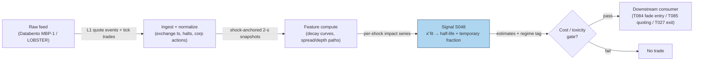

## Stage 48/200 — S048: LOB resiliency & block-trade temporary-impact reversion

*Batch SB6 · Signal 48/100 · Provenance [D] · Family C — Intraday Mean Reversion & Reversal*

### S1. One-line verdict

| | |
|---|---|
| **What it is** | Measures how fast the limit order book refills after a liquidity shock, and how much of a block trade's price impact is temporary (reverses) vs permanent (stays). |
| **When it works** | Liquid names, normal-vol regimes, shocks that are liquidity-driven rather than news-driven; resiliency is measurable and the temporary leg is large relative to spread costs. |
| **When it dies** | News shocks (impact is information, so no reversion), stress days when the book never refills, illiquid names where half-life exceeds the holding horizon, costs above the reversion leg. |
| **Build-or-buy in one line** | Build the estimator yourself on bought raw L1/tape data — no vendor sells your thresholds, but never try to build the feed plant. |

Provenance **[D]** (documented: Degryse et al. 2005; Keim & Madhavan 1996; Kraus & Stoll 1972). Family C — Intraday Mean Reversion & Reversal.

### S2. How it works — plain human explanation

**Resiliency** (the speed at which a limit order book recovers its depth and spread after being disturbed) is one of the three dimensions of liquidity, alongside tightness (the spread) and depth (visible size). The market vignette: 9:47:03, a stock's book reads bid 231.40 × 800 shares / ask 231.41 × 300. An aggressive seller sweeps the bid with a 1,200-share market sell. The bid collapses to 231.36, the spread widens from 1 cent to 5 cents, and the midquote drops 2.5 cents. What happens next is the signal. In a **resilient** book, patient limit-order traders — people and algorithms who earn the spread by posting passive liquidity — smell the wider spread, judge the compensation for providing liquidity now attractive, and refill the bid within seconds: 231.38 × 500, then 231.40 × 800, then back to 231.40 × 800 by 9:47:19. The midquote recovers. The correct trade was to buy into the shock (provide liquidity) and sell into the refill. In a **non-resilient** book — say the seller knew bad news — nobody refills, the midquote stays down, and the same fade trade loses.

**Block-trade temporary-impact reversion** is the same idea at larger scale. A **block trade** (an unusually large print, e.g. 250,000 shares crossing the tape) pushes the price down (for a seller-initiated block) by more than its information content warrants. The total impact splits into two legs: the **permanent impact** — the part that reflects genuine information (adverse selection: the block trader may know something) and never reverses — and the **temporary impact** — the pure **liquidity impact**, the discount demanded by whoever absorbed the block for taking on inventory risk, which decays as the market digests the trade. The signal fades only the temporary leg, over minutes to hours, net of the direction of the block (a seller-initiated block that pushed price down is bought, expecting partial bounce-back; the permanent leg is respected, not faded).

Why should the effect exist economically? Three forces. First, **inventory risk**: whoever takes the other side of a liquidity shock carries unwanted inventory and charges a concession that unwinds as the position is laid off — classic market-maker economics, so the concession is temporary by construction. Second, **patient-flow refill**: a wider post-shock spread raises the expected profit of posting limit orders, which mechanically attracts refills; this is the mechanism behind the exponential recovery used in the Obizhaeva–Wang (2013) optimal-execution model. Third, **information decomposition** (Kraus & Stoll 1972; Keim & Madhavan 1996): block prints carry both liquidity and information components, and only the liquidity component mean-reverts — so the tradable edge is exactly the temporary fraction, which is why the signal must estimate the split rather than blindly fading every shock.

Mental model:
- A liquidity shock is a *discount sale on immediacy*: the price concession is the market paying you to wait — but only if the shock carried no news.
- **Half-life** (the time for half the temporary impact to decay) is the clock you trade against: entries want fast-κ regimes, exits are timed by the estimated half-life.
- The permanent leg is untouchable: fading information-driven moves is catching a falling knife, so the first job of the signal is classification (liquidity vs information), not timing.

### S3. The math — exact formula

Let a liquidity shock of signed size Q (shares, signed by aggressor direction) arrive at event time t = 0, with m(t) the midquote at t. The **temporary impact** I(t|Q) is the liquidity-driven deviation of the midquote from its pre-shock level m(0⁻):

I(t|Q) = m(t) − m(0⁻) = λQ · e^(−κt)

- λ (lambda): **impact coefficient** per share, in price units per share (e.g. bps per 1,000 shares); scales with illiquidity.
- Q: signed shock size (shares; negative for seller-initiated).
- κ (kappa): **mean-reversion speed** (1/time), the resiliency parameter.
- t: seconds since the shock.

**Half-life** — the time for half the temporary impact to decay — is t(1/2) = ln 2 / κ. With a **permanent component** I(∞) (the information leg that never reverses):

I(t|Q) = I(∞) + (I(0) − I(∞)) · e^(−κt)

Spread and depth follow the same reduced form with their own κ (they need not coincide — duck.ai lead, Q-SB6-1, labeled chatbot source):
S(t) = S(∞) + (S(0) − S(∞)) · e^(−κ_S·t); D(t) = D(∞) − (D(∞) − D(0)) · e^(−κ_D·t).
Resiliency(t) = (S(t) − S(∞)) / (S(0) − S(∞)) — fraction of the shock still unrecovered.

**Estimation.** Take observations I(t_j) at snapshots t_j after each shock; OLS on the log form y_j = ln|I(t_j)| = ln|λQ| − κ·t_j + ε_j gives κ̂ = −Σ(t_j − t̄)(y_j − ȳ)/Σ(t_j − t̄)², then t̂(1/2) = ln 2/κ̂. Alternative: **survival analysis** of time-to-recovery (time until spread/depth returns within tolerance of pre-shock level). **Block decomposition**: total impact = permanent + temporary; the temporary fraction reverted over the window = 1 − e^(−κ·H) for holding horizon H.

| Parameter | Symbol | Typical range | Too small | Too large | Default example |
|---|---|---|---|---|---|
| Mean-reversion speed | κ | 0.02–0.5 /s liquid; 0.005–0.05 /s illiquid | Half-life > horizon — nothing reverts before exit | Overfits noise, flips sign | 0.05/s *(example — not an institutional standard)* |
| Impact coefficient | λ | 1–50 bps per 10k shares | Underestimates entry concession | Phantom impact, never fills | 10 bps/shock *(example)* |
| Event window | H | 60–300 s liquid; up to hours for blocks | Truncates the decay tail | Contaminated by new shocks | 120 s *(example)* |
| Snapshot sampling | Δt | 10 ms–1 s message; 1–5 s quotes | Misses fast refill | Noise-dominated first obs | 2 s *(example)* |
| Min events per regime | N | 20–50 shocks per liquidity regime | κ̂ noise-dominated | Stale regimes | 30 *(example)* |
| Entry threshold | θ | temporary fraction ≥ 40–70% of total impact | Fades information shocks | No trades | 50% *(example)* |

**Normalization choices:** always relative to the pre-shock baseline (S(∞), D(∞) estimated from the minute before the shock); midquote-based impact rather than trade-price impact to avoid **bid–ask bounce** contamination (the mechanical negative autocorrelation from bouncing between bid and ask). **Causal timing:** the shock is dated at event time t on exchange timestamps using only data ≤ t; the resiliency estimate and any fade entry are tradable no earlier than t+1 (the first post-shock quote). **Variants:** (1) AR(1) on spread deviations S(t) = ρS(t−1) + ε — κ = −ln(ρ)/Δt; (2) survival/time-to-recovery per shock; (3) multi-exponential or power-law decay (Mu et al. 2010 report power-law decay of spread/volume imbalance after large intraday price changes — descriptive, before-cost). Exponential is a practical reduced form, not a universal law.

### S4. Worked example — step-by-step numbers (SYNTHETIC)

All numbers below are **synthetic**, generated with `rng = np.random.default_rng(48)` per the plot script `batches/SB6/plot_S048.py`. True process: I(t) = 10 bps · e^(−0.05t), so the true half-life is ln 2/0.05 = 13.86 s. Snapshots every 2 s from t = 0 to 60 s, plus iid noise (σ = 0.8 bps).

| t (s) | Observed I(t) (bps) | Fitted Î(t) (bps) |
|---|---|---|
| 0 | 9.754 | 11.162 |
| 6 | 8.533 | 8.036 |
| 12 | 6.176 | 5.786 |
| 18 | 5.002 | 4.165 |
| 24 | 2.168 | 2.999 |
| 30 | 3.304 | 2.159 |
| 36 | 2.539 | 1.554 |
| 42 | 1.157 | 1.119 |
| 48 | 1.013 | 0.806 |
| 54 | 0.454 | 0.580 |
| 60 | 0.160 | 0.418 |

Hand-computation walk-through (the script fits all 31 snapshots; the table shows every 6 s): take logs, e.g. y(0) = ln(9.754) = 2.278, y(30) = ln(3.304) = 1.195, y(60) = ln(0.160) = −1.833. OLS of y on t over the full 31-point sample gives κ̂ = 0.0548/s and ln|λQ|̂ = 2.413 → λQ̂ = 11.162 bps. Fitted half-life t̂(1/2) = ln 2/0.0548 = 12.66 s (chart annotation matches). Reversion fraction after a 30-s hold: 1 − e^(−0.0548·30) = 80.7% of the temporary leg recovered.

**What to notice:** the fit recovers the true half-life (13.86 s) within ~1.2 s despite 0.8 bps noise — the estimator is well-behaved on clean data. But this toy tape has no fees, no spread re-crossing cost, no regime changes, and exactly one isolated shock; real books are hit by overlapping shocks, and the first few observations after a shock are often dominated by feed discreteness (practitioners drop them — duck.ai lead, labeled). The chart `images/S048_example.png` plots the same 31 synthetic points with the true and fitted curves.

### S5. Strategies that use this signal

- **T084 — Block-Trade Impact Reversion** — primary entry trigger: provides liquidity after block prints and exits on the resiliency half-life.
- **T085 — Resiliency Market Maker** — primary quoting logic: skews quotes around the estimated resiliency with Avellaneda–Stoikov inventory control.
- **T027 — Illiquidity Temporary-Impact Fade** — exit timer: fades overextended moves in illiquid names, times exits by the resiliency half-life.
- **T008 — Kalman Dynamic-Hedge Pairs** — filter/veto: skips pair entries when LOB resiliency collapses (wide, non-refilling spreads signal toxic flow).
- **T063 — Stretched-Move Z-Score Fade** — exit timer: uses resiliency-timed exits for multi-sigma fades (per plan §3, T063 consumes S048).

### S6. Data required — exact spec

| Field | Type | Granularity | Source tier | Notes |
|---|---|---|---|---|
| Bid/ask price + size | float/int | L1 quote events (or L2) | Tier 2 | Need venue + sequence numbers to order events |
| Trade price/size/aggressor | float/int | tick trades | Tier 2 | Aggressor side = shock direction |
| Exchange timestamps | int64 ns | per event | Tier 2 | SIP receipt time is *not* sufficient for resiliency (see S7) |
| NBBO | float | per trade | Tier 1/2 | Block detection vs national best |
| Corporate actions / halts | reference | daily/event | Tier 0/1 | Exclude splits, halts, auctions |

Collection: Databento MBP-1 (L1) or MBP-10 (L2) for the book leg; TAQ or Databento for the block tape; LOBSTER (academic) for MBO/ITCH replay. Ingest sketch (≤20 lines, Python/polars):

```python
import polars as pl
quotes = pl.scan_parquet("l1_quotes/*.parquet")          # t_exch, bid, ask, bsz, asz, venue, seq
trades = pl.scan_parquet("trades/*.parquet")             # t_exch, price, size, aggressor
shocks = (trades.filter(pl.col("size") > BLOCK_MIN)       # block prints = shock events
          .with_columns(mid_before=pl.col("price").shift(1)))
book = quotes.with_columns(mid=(pl.col("bid")+pl.col("ask"))/2,
                           spread=pl.col("ask")-pl.col("bid"))
win = book.join_asof(shocks, on="t_exch", strategy="backward")  # align to shock time
decay = win.group_by("shock_id").agg(                       # per-shock decay curve
    pl.col("t_exch").sub(pl.col("t_exch").first()).alias("t"),
    ((pl.col("mid")-pl.col("mid_before"))/pl.col("mid_before")*1e4).alias("impact_bps"))
decay.collect().write_parquet("decay_curves.parquet")
```

Storage: per `notes/cost-model.md` §4, L1 quotes+trades for one liquid symbol run ~2–8 GB/day in parquet — archive per-symbol daily files, never a monolith. Data-quality checklist: normalize all timestamps to exchange time (not vendor receipt); drop crossed/locked quotes; handle corporate actions (splits rescale depth), halts (no resiliency estimable), DST and half-days, stale quotes (no update > 60 s ⇒ exclude from baseline), and block prints at the open/close auctions.

### S7. Local build on M5 Max / 128GB

**Feasibility verdict: feasible (Tier M)** for a research-grade resiliency estimator on ≤20 symbols; heavy toward infeasible-locally for full-universe L2 replay. Justification: the arithmetic (per-shock decay curves + log-OLS) is trivially parallel and memory-light; the difficulty is data plumbing — event ordering, shock labeling, and timestamp normalization — not compute.

Throughput (per `notes/cost-model.md` §2): a Python event loop handles ~100–500k events/sec (GIL-bound, fine for ≤20 symbols L1); polars batch recompute of decay curves runs at ~10–50M rows/sec. Corrected record counts (Q-SB6-2 correction applied): at 10–100 quote updates/sec over a 23,400-second session, one instrument generates ≈2.3×10⁵–2.3×10⁶ records/day — the chatbot's "10⁵–10⁷/day" was a loose envelope; treat the upper bound as burst/extreme, not a per-instrument estimate. The expensive op is quote-to-shock asof joins and event-conditioned decay fits (fit throughput ~100–10,000 events/sec), not the raw parsing.

RAM (cost-model §3): one symbol-day of L1 events is ~0.5–4 GB in RAM — one month of one instrument fits comfortably in the 77 GB working budget; 500 symbols × 60 days of L1 does **not** fit — use per-symbol daily files plus streaming windows. Bottleneck: I/O and join logic, not CPU.

Stack: **Python+polars** for research (when-to-pick: ≤20 symbols, daily refits); **Rust** event loop for real-time multi-symbol (when-to-pick: 5–50M events/sec needed); **DuckDB** for ad-hoc decay-curve SQL over the parquet archive.

Engineering time: **Tier M, 20–60 h** per cost-model §5 (L1 event pipeline) → **$3,000–9,000 loaded-cost estimate** at $150/hr. The chatbot (duck.ai, 2026-09-10, labeled lead) quotes 100–250 h for a production-grade resiliency build including L1 reconstruction and validation — take the cost-model band for the estimator itself and the chatbot figure as the full-plumbing envelope. What breaks first at 500 symbols or full OPRA: RAM and the asof-join fan-out; move to per-symbol streaming and daily batch refits.

### S8. Buy vs build

| Option | What you get | Indicative price | Buying gains | Buying loses |
|---|---|---|---|---|
| Tier 0: SIP-derived quotes (Alpaca IEX, delayed) | Free L1-ish NBBO | ~$0 | Zero cost for prototyping | **Not honest for resiliency**: SIP latency and aggregation smear the refill dynamics — label any SIP result `simulated only` |
| Tier 1: Polygon Stocks Advanced | Real-time SIP + full-market bars | ~$30–200/mo | Cheap NBBO + bars for block detection | Still SIP timestamps; no depth history |
| Tier 2: Databento (L1/L2, usage-based) | Honest exchange-timestamped MBP-1/10 | ~$200/mo + usage | True event ordering, venue fields | Usage billing on full L2 replay |
| Tier 3: LOBSTER (academic) | MBO/ITCH order-book replay | ~hundreds/yr academic | Message-level ground truth for research | Academic license only; not production |

All prices **indicative — verify before budgeting**. **Verdict: build the estimator, buy the raw data.** Buy exchange-timestamped L1 (Databento) or academic replay (LOBSTER); build the shock-labeling and κ fitting yourself, because resiliency thresholds are regime- and name-specific and no vendor sells them. Crossover: buy precomputed analytics never — there are none worth the opacity; buy the feed when your symbol count × history exceeds what the $200/mo usage tier covers.

### S9. Success ratio / efficacy — documented evidence

| Study / source | Market & period | Metric | Before/after cost | Caveat |
|---|---|---|---|---|
| Degryse, de Jong, van Ravenswaaij & Wuyts (2005), *Review of Finance* | Euronext Paris (pure limit-order market), aggressive orders | Depth and spread return to initial levels within ~20 best-limit updates after the shock | **Before-cost** (descriptive, not a strategy) | 2005 market structure; update counts, not clock time |
| Wuyts (2012), VAR simulation (reported in arXiv 1602.00731) | Simulated aggressive market-order shock | All liquidity dimensions revert to steady state within ~15 orders | **Before-cost** (model-based) | Simulation, not live trading |
| Gomber et al. (2015), intraday event study (reported in arXiv 1602.00731) | Large transactions, electronic LOB | Resiliency to "normal levels" is fast after large transactions | **Before-cost** (descriptive) | "Fast" is regime-dependent |
| Mu et al. (2010), Shenzhen Stock Exchange ultra-high-frequency (reported in arXiv 1602.00731) | Large intraday price changes | Significant price reversal; spread, volume, and imbalance decay slowly as a power law | **Before-cost** (descriptive) | Power-law ≠ exponential — decay form is an open choice |
| Keim & Madhavan (1996), *Review of Financial Studies* | 5,625 upstairs block trades, 1985–1992 | Temporary price impact concave in order size; permanent *and* transitory components significant for small caps | **Before-cost** (measured vs decision-price benchmarks) | Upstairs-market era; leakage effects differ in electronic markets |
| Obizhaeva & Wang (2013), *Journal of Financial Markets* | Model of resilient LOB | Exponential-resilience execution schedule cuts implementation shortfall vs naive schedules | **Before-cost** (model-based) | Assumes the resilient-book model holds |

**Honest bottom line:** as a standalone trigger this is a *thin, cost-fragile* edge — the temporary leg must exceed two half-spreads plus fees, which it often does not in liquid names. As a *filter and exit-timer* (when to provide liquidity, when a fade has overstayed, when flow is toxic) it is the practical, documented use. No credible after-cost Sharpe for naive "fade every shock" exists in the literature surveyed — treat any such claim as an **unverified chatbot claim** unless sourced.

### S10. Failure modes & pitfalls

1. **Lookahead leakage** — dating the shock with post-shock prints or using the recovery path to define the shock window. *Mitigation:* shock timestamp fixed on exchange event time from data ≤ t only.
2. **Staleness / SIP latency** — resiliency measured on SIP or vendor-receipt timestamps misattributes feed delay as slow refill. *Mitigation:* exchange timestamps required for sub-minute κ; label SIP work `simulated only — requires MBO/ITCH`.
3. **Crowding / alpha decay** — every liquidity provider fades the same shocks, compressing the temporary leg. *Mitigation:* estimate κ per name/regime; stand down when the temporary fraction shrinks.
4. **Cost blowup** — spread re-crossing plus fees exceed the reverted leg. *Mitigation:* model half-spread × 2 + fees + slippage explicitly; gate on net-of-cost temporary fraction.
5. **Regime breaks** — stress/vol-spike days: κ → 0, books never refill, "temporary" impact becomes permanent. *Mitigation:* vol-regime gate; hard stop on spread > 3× intraday median.
6. **Overfitting / parameter mining** — grid-searching κ windows and entry thresholds until a backtest glows. *Mitigation:* out-of-sample per regime; purged/embargoed validation (S088).
7. **Data errors** — bad ticks, stub quotes, splits rescaling depth. *Mitigation:* crossed/locked and stub-quote filters; corporate-action adjustment before any baseline.
8. **Microstructure noise vs signal** — feed discreteness dominates the first observations after a shock. *Mitigation:* drop the first few snapshots (duck.ai lead, labeled); fit on the decay body, not the impact instant.
9. **Information misclassification** — fading a news-driven shock (permanent leg). *Mitigation:* news/auction/halt filters; widen the permanent-component estimate on high-uncertainty prints.

### S11. Visuals




### S12. Sources

- Degryse, H., de Jong, F., van Ravenswaaij, M. & Wuyts, G. (2005). "Aggressive Orders and the Resiliency of a Limit Order Market." *Review of Finance* 9(2), 201–242. https://feb.kuleuven.be/research/economics/ces/documents/DPS/2002/DPS0210.pdf
- Alfonsi, A., Fruth, A. & Schied, A. (2007). "Optimal execution strategies in limit order books with general shape functions." arXiv:0708.1756. https://ideas.repec.org/p/arx/papers/0708.1756.html
- Keim, D. B. & Madhavan, A. (1996). "The Upstairs Market for Large-Block Transactions: Analysis and Measurement of Price Effects." *Review of Financial Studies* 9(1), 1–36. http://ideas.repec.org/a/oup/rfinst/v9y1996i1p1-36.html
- "Limit order book resiliency after effective market orders: Empirical facts and applications to high-frequency trading" (2016). arXiv:1602.00731. https://web3.arxiv.org/pdf/1602.00731v1
- Kraus, A. & Stoll, H. R. (1972). "Price Impacts of Block Trading on the New York Stock Exchange." *Journal of Finance* 27(3). (Cited in the report; classic temporary/permanent decomposition.)

**Chatbot source (labeled, per question-bank protocol):** Duck.ai answered Q-SB6-1–Q-SB6-3 (GPT-5.6 Luna, anonymous, 2026-09-10; Grok/Cursor answers pending, checked 2026-09-10). Q-SB6-1 supplied the exponential-decay/OLS/half-life formulas and practical ranges used in S3–S4 (lead, not a documented standard); Q-SB6-2 supplied the L1 throughput/record-count leads and the 100–250 h full-build envelope used in S7 (corrected per operator note: ≈2.3×10⁵–2.3×10⁶ records/day/instrument, not 10⁵–10⁷).

**Unverified leads:** the duck.ai-cited arXiv "Limit Order Book Simulations: A Review" (no verified ID captured); the exact 100–250 h resiliency production envelope (chatbot lead, not a documented benchmark).
