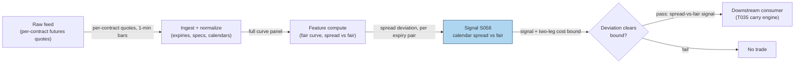

## Stage 58/200 — S058: Futures calendar spread (term-structure carry)

*Batch SB7 · Signal 58/100 · Provenance [D] · Family D — Pairs & Cross-Sectional Arbitrage*

### S1. One-line verdict

| | |
|---|---|
| **What it is** | Trade the *shape* of the futures curve: when the spread between two expiries deviates from its cost-of-carry fair value, buy one leg and sell the other to harvest the convergence (and the roll yield). |
| **When it works** | When curve dislocations are flow-driven (rolls, inventory, rate moves) and you can finance both legs and survive margin expansion into expiry. |
| **When it dies** | When the curve shape shifts for fundamental reasons (rate regime change, convenience-yield shock), at expiry pinches, or in illiquid deferred contracts. |
| **Build-or-buy in one line** | Build the fair-curve analytics; buy contract-level futures data — a continuous series will hide exactly what you need to see. |

Provenance **[D]** (documented: cost-of-carry model; report coverage G, R1). Family D — Pairs & Cross-Sectional Arbitrage. (Distinct from S060: this is fair-value term-structure trading, not predictive lead-lag.)

### S2. How it works — plain human explanation

Every futures contract on the same underlying has its own price, and together they form the *term structure* — the curve of prices across expiries. In a calm market the curve has a shape dictated by carry: for an equity index future, each further-out contract costs a little more than the near one, because carrying the basket longer costs more financing (this upward slope is *contango* — futures above spot and rising with expiry; the reverse, *backwardation*, dominates in commodities when near-term supply is tight). The fair curve is pinned by the same identity as S057: F*(T) = S·e^{(r−q−y)·T}, where y is the *convenience yield* (the implied benefit of holding the physical asset — zero for equities, the whole story for oil).

A *calendar spread* is long one expiry and short another — say long the 1-month future, short the 2-month. It is (mostly) immune to the outright price of the index: if the market crashes, both legs fall together. What it owns is the *slope* of the curve between those two expiries. The signal: compute the fair spread (fair_2 − fair_1) and compare it to the observed spread (F_2 − F_1). If the observed curve is steeper than fair — the market is charging more for carry than financing justifies — you fade it: sell the rich far leg, buy the cheap near leg, and let the spread converge toward fair as time passes. Along the way you also harvest *roll yield*: as each contract ages toward expiry it slides along the curve toward the spot price, and in contango that slide is a headwind for longs and a tailwind for shorts — the calendar spread is how you isolate that slide from directional risk.

A vignette: the 1-month future trades 99.47, the 2-month 101.03 — an observed spread of 1.57. But with 5% rates and 1.8% dividends, the fair spread between those expiries is only 0.27. The curve is 1.30 points too steep. You sell the 2-month, buy the 1-month. If the steepness was a transient flow imbalance (a large fund rolling its position, dealer inventory), the spread compresses back toward 0.27 and you keep the difference — minus two spreads, two commissions, and the financing of the margin.

Why does the deviation exist? Curve shape is set by the balance of hedgers rolling positions, dealers warehousing inventory, and rate expectations — all of which move the observed curve away from the textbook fair curve temporarily. The trade is compensated risk-taking: you are paid to warehouse curve shape while others are forced to trade it.

**Mental model:**
- Cash-and-carry (S057) trades futures vs spot; calendar spread trades futures vs futures — curve shape, not level.
- The spread is market-neutral to the underlying but fully exposed to rates, curve shape, and expiry mechanics.
- Capital-efficient (margin offsets between the legs) but not risk-free: the curve can stay irrational, and expiry is a hard deadline.

### S3. The math — exact formula

**Definitions:** *Term structure* = futures prices across expiries. *Calendar spread* = long one expiry, short another (F_2 − F_1). *Contango* = upward-sloping curve (further expiries dearer); *backwardation* = downward-sloping. *Roll yield* = the return from a contract aging along the curve toward spot. *Convenience yield* y = implied benefit of holding the physical commodity (zero for financial futures).

Fair price for expiry T (generalizing S057 with convenience yield y):

F*(T) = S·e^{(r−q−y)·T}.

Calendar signal (report's form):

signal = (F_2 − F_1) − (fair_2 − fair_1).

Trade rule (signal at t, earliest fill t+1):

- If signal > +bound: observed curve too steep → sell F_2, buy F_1 (fade the steepening).
- If signal < −bound: observed curve too flat/inverted → buy F_2, sell F_1.
- bound = round-trip cost of both legs (2× spread + 2× commission + margin financing).

Exit: spread reverts to within a tolerance of fair, time stop at front-month expiry approach, or stop-loss on adverse curve-shape shift. Roll-yield accounting: holding the spread across the front contract's expiry means rolling the near leg — the roll cost/gain is part of the P&L, not an afterthought.

**Parameter table**

| Parameter | Symbol | Typical range | Too small / too large | Default (example) |
|---|---|---|---|---|
| Rate / div / conv. yield | r, q, y | market-implied | Stale inputs → fake fair curve | r = 5.0%, q = 1.8%, y = 0 (example) |
| Expiry pair | (T1, T2) | adjacent quarterlies | Far-dated → illiquid; too near expiry → pin risk | M1 vs M2 (example) |
| Entry bound | bound | 0.1–1.0 index points | Tight → noise; wide → never trades | 2× round-trip leg costs (example) |
| Exit tolerance | — | 0–50% of entry signal | 0 → never exits; wide → gives back edge | 25% of entry deviation (example) |
| Time stop | — | 5–20 days before front expiry | Late → expiry pinch; early → cuts convergence | 10 days (example) |

**Normalization choices:** express the signal in index points for sizing and as a fraction of the fair spread for cross-expiry comparability; annualize the implied roll yield for comparison with funding costs. Fair curves must be recomputed as r, q, y move — a static fair curve is a stale signal.

**Named variants:** (1) fair-value spread (this signal) vs statistical spread (deviation from the spread's own historical mean — simpler, no rate inputs, but blind to regime shifts); (2) outright calendar vs calendar fly (M1−2·M2+M3 — purer curvature bet); (3) roll-down harvest (hold the near leg long into expiry in backwardation) vs spread convergence.

### S4. Worked example — step-by-step numbers (SYNTHETIC)

Synthetic index future, seed **58058** (fixes the quote-noise pattern below): S0 = 100, r = 5.0%, q = 1.8%, y = 0. Reproduce the quotes: fair = 100·e^{0.032·T}; observed = fair + [−0.80, +0.50, −0.10, +0.20, −0.15, +0.10]. The chart in S11 plots exactly these points.

| Expiry | T (yr) | Fair F*(T) | Observed F (synthetic) | Observed − fair |
|---|---|---|---|---|
| M1 | 0.0833 | 100.2670 | 99.4670 | −0.80 |
| M2 | 0.1667 | 100.5348 | 101.0348 | +0.50 |
| M3 | 0.2500 | 100.8032 | 100.7032 | −0.10 |
| M6 | 0.5000 | 101.6129 | 101.8129 | +0.20 |
| M9 | 0.7500 | 102.4290 | 102.2790 | −0.15 |
| M12 | 1.0000 | 103.2518 | 103.3518 | +0.10 |

Step 1 — fair calendar spread (M1–M2): fair_2 − fair_1 = 100.5348 − 100.2670 = **0.2677**.

Step 2 — observed calendar spread: 101.0348 − 99.4670 = **1.5677**.

Step 3 — signal: 1.5677 − 0.2677 = **+1.30** — the observed curve is 1.30 points steeper than fair. Direction: sell the rich M2, buy the cheap M1 (fade the steepening), provided 1.30 clears the two-leg round-trip bound.

Step 4 — roll-yield context: the fair curve rises 0.27 points per month here (contango from positive carry); a long-M1 holder bleeds ~0.27/month of roll headwind, which is exactly what the short-M1/long-M2 side of this spread harvests if the steepness persists.

**What to notice (and its limits):** the toy has six expiries, no bid–ask spreads, and a conveniently large 1.30-point dislocation — real dislocations this clean are rare and competed over in seconds on electronic venues. The example also freezes r and q; in practice both move and drag the fair curve with them, so part of any "signal" is input noise. It demonstrates the spread-vs-fair computation and the direction logic, not a tradable opportunity.

### S5. Strategies that use this signal

- **T035 — Futures Calendar-Spread Carry** — primary entry trigger (direction): harvests term-structure roll yield with the S058 spread-vs-fair rule, timed by vol forecasts.
- **T100 — Grand Ensemble** — component feature: S058 calendar-spread deviations feed the capstone blend as term-structure-carry features alongside the other families.

### S6. Data required — exact spec

| Field | Type | Granularity | Source tier | Notes |
|---|---|---|---|---|
| Futures quotes, all expiries | float | tick / 1-min, per contract | Tier 2 | Bid/ask ideally; contract-level — never a continuous series |
| Contract specs | reference | per contract | Tier 1–2 | Multiplier, tick, currency, delivery/first-notice/last-trade, hours |
| Full expiration curves | float | daily snapshots | Tier 2 | The whole curve each day, not just the front |
| Rates / funding curve | float | daily | Tier 0–1 | Discounting for the fair curve |
| Dividend / convenience-yield proxies | float | daily | Tier 1–2 | q for equities; storage/insurance/financing for physicals |
| OI / volume per contract | int | daily | Tier 2 | Liquidity per expiry — deferred legs can be untradable |

**Continuous futures series are INSUFFICIENT for calendar-spread research — they hide the actual relative pricing of individual expiries.** A rolled series stitches different contracts together and invents spread jumps at every roll date; the signal *is* the per-expiry relative pricing, so the continuous series destroys the object of study. Research needs contract-level settlement (bid/ask ideally), full expiration curves, and explicit roll rules.

Collection: Databento CME (~$200/mo + usage indicative — verify before budgeting) or CQG/dxFeed for contract-level futures. Ingest sketch (≤20 lines):

```python
import polars as pl
# 1. contract-level quotes; keep contract identity, never pre-roll
fut = pl.read_parquet("futures/curve_contracts.parquet")  # ts, contract, expiry, bid, ask
specs = load_specs()   # multiplier, tick, first_notice, last_trade per contract
# 2. fair curve per timestamp: F*(T) = S * exp((r - q - y) * T)
# 3. calendar signal per adjacent pair: (F2 - F1) - (fair2 - fair1)
# 4. bound = 2 legs' spread + commissions + margin financing (YOUR costs)
# 5. signal at t -> earliest fill t+1; time stop 10d before front expiry
```

Storage: daily full-curve snapshots are kilobytes per day — trivial; tick-level multi-expiry futures run to GBs per day — keep per-contract daily files plus short tick buffers (cost-model §3/§4 pattern: sample or stream, don't archive naively).

Data-quality checklist: contract identity preserved (no silent rolls); expiry/first-notice/last-trade calendars per contract; tick-size changes; settlement vs last-trade price conventions; rate-curve point-in-time; physical-delivery specs (storage, quality, delivery) where relevant.

### S7. Local build on M5 Max / 128GB

**Feasibility: feasible (Tier M) — easy compute, hard data.** The entire signal is closed-form curve arithmetic: per cost-model §2, numpy handles millions of curve evaluations per second, and a full multi-year daily curve panel is megabytes (cost-model §3). The engineering is in the *curve infrastructure*: contract master, expiry calendars, roll rules, fair-curve recomputation as rates move, and the roll-accounting P&L — Tier M **20–60 h ≈ $3,000–9,000** loaded-cost estimate (cost-model §5). (Chatbot lead Q-SB7-2: futures curves + rolls 50–100 h research / 125–250 h production with reconciliation, alerting, and audit — approximate; the cost-model band governs the research build, the higher figure the production harness.) Bottleneck: data licensing and symbology, not CPU or RAM — the working set fits in a fraction of the 77 GB budget. What breaks first: at scale, the number of expiries × underlyings in the curve store and the operational burden of expiry management (this is a calendar-driven strategy — someone or something must act on every expiry). Stack: Python + polars + Parquet date/contract partitions; no GPU, no Rust. Marginal compute cost ≈ $0 (cost-model §1).

### S8. Buy vs build

| Option | What you get | Indicative price | Gains | Loses |
|---|---|---|---|---|
| Tier-0 free (delayed quotes, Stooq) | Daily settlements, some expiries | ~$0 | Learn curve shapes for free | No intraday; incomplete deferred expiries |
| Tier-1 retail (Polygon/futures snapshots) | Daily curves, majors | ~$30–200/mo | Cheap curve history | Indicative — verify before budgeting |
| Tier-2 professional (Databento CME, CQG, dxFeed) | Contract-level quotes, full curves, specs | ~$200/mo + usage | The data the signal actually needs | Still need roll/expiry ops |
| Institutional (full history + derived curves) | Broad institutional curve history | $50–250k+/yr | Production-grade | Absurd for a research build |

**Verdict: build the analytics, buy Tier-2 data.** Build if you research term-structure behavior — the fair-curve engine and roll accounting are the durable assets. Buy (Tier 2) the moment you trade it — contract-level quotes and expiry metadata are not reconstructible from free sources. Crossover: one live calendar spread needs real-time per-contract bid/ask on *both* legs plus expiry ops; that is the buy line. Hybrid (common): buy the raw curve feed, build everything else.

### S9. Success ratio / efficacy — documented evidence

| Study / source | Market & period | Metric | Before/after cost | Caveat |
|---|---|---|---|---|
| CME Group, "Deconstructing futures returns: the role of roll yield" | Futures generally (educational) | Return decomposition: futures return = spot + basis + cumulative roll adjustment; over long horizons the cumulative roll adjustment dominates | Before-cost (decomposition, not a strategy) | Establishes *why* term-structure carry matters, not that it is harvestable |
| Carry literature (Koijen et al. lineage; Pedersen/Jacobs-Levy presentation) | Commodities/cross-asset | Carry predicts futures returns — high-carry contracts outperform (carry predictability) | Before-cost in most published forms | Risk-premium interpretation: you are paid for crash/liquidity risk, not an inefficiency |
| Chatbot research lead (Q-SB7-3) | Practitioner synthesis | Calendar spreads are capital-efficient (margin offsets) but carry curve-shape, roll, margin-expansion, liquidity, and expiry risks | Qualitative | Unverified chatbot claim — directionally standard, not a citable result |

The honest framing: term-structure carry is one of the oldest documented risk premia in futures markets, and its existence is not controversial — what is controversial is how much survives costs and timing. The spread in the worked example (+1.30) must clear two full round trips plus margin financing; on electronic venues, visible dislocations are typically inside the bound within seconds. Documented failure regimes: rate-regime shifts repricing the whole fair curve (your "signal" was a stale r), convenience-yield shocks in commodities (curve inverts for fundamental reasons), expiry pinches in the front leg, and illiquid deferred legs where the quoted spread is not executable. **Bottom line: as a standalone signal this is a moderate, well-understood risk premium — real, but harvested by professionals with funding and execution scale. For a small account it is primarily a paper-trading and microstructure-education exercise (micro contracts only if the personal cost stack clears); for an institution it is balance-sheet carry, same family as S057.**

### S10. Failure modes & pitfalls

1. **Stale fair-curve inputs:** r, q, or y move and the "signal" is just an outdated fair curve. Mitigation: recompute fair curves on live inputs; monitor input staleness as a first-class check.
2. **Continuous-series backtests:** rolled series invent spread jumps at rolls. Mitigation: contract-level data only — restated in every section because it is the #1 error.
3. **Curve-shape regime shift:** the curve steepens for a reason (rate shock, inventory glut) and never mean-reverts. Mitigation: time stop; distinguish flow dislocations (fast, mean-reverting) from regime repricing (slow, persistent) via half-life estimation on the spread.
4. **Roll risk:** holding across front-month expiry forces a roll whose cost can exceed the harvested edge. Mitigation: explicit roll accounting in the P&L; time stop ≥10 days before front expiry (example).
5. **Margin expansion:** clearinghouses raise margins into volatility/expiry; the "capital-efficient" spread suddenly needs more capital. Mitigation: size for 2–3× margin; monitor margin schedules per contract.
6. **Liquidity mirage in deferred legs:** the quoted spread is not executable at size. Mitigation: liquidity filter per expiry (OI, volume, quoted depth); participation caps.
7. **Expiry pinch:** front-leg squeezes as shorts cover into delivery. Mitigation: never hold the front leg into the delivery window; hard unwind dates.
8. **Cost optimism:** two legs × (spread + commission) + financing vs a thin signal. Mitigation: bound computed from *your* measured costs, applied before every entry; walk the example's arithmetic on your own fee schedule.

### S11. Visuals




### S12. Sources

1. CME Group. "Deconstructing futures returns: the role of roll yield." [https://www.cmegroup.com/content/dam/cmegroup//education/files/deconstructing-futures-returns-the-role-of-roll-yield.pdf](https://www.cmegroup.com/content/dam/cmegroup//education/files/deconstructing-futures-returns-the-role-of-roll-yield.pdf) — spot/basis/roll-adjustment decomposition.
2. Hagerty, K. (Northwestern Kellogg). Commodity futures lecture notes — calendar-spread formula, full/non-full carry, convenience yield. [https://www.kellogg.northwestern.edu/faculty/hagerty/ftp/D65/lecture/Fall2006/commodity futures_Fall2006.pdf](https://www.kellogg.northwestern.edu/faculty/hagerty/ftp/D65/lecture/Fall2006/commodity futures_Fall2006.pdf).
3. Pedersen, L. H. / Jacobs Levy Center presentation. "Carry" — carry definition, carry predictability, cross-market term-structure carry. [https://jacobslevycenter.wharton.upenn.edu/wp-content/uploads/2014/06/Pedersen_Jacobs_Levy_Conf_2013.pdf](https://jacobslevycenter.wharton.upenn.edu/wp-content/uploads/2014/06/Pedersen_Jacobs_Levy_Conf_2013.pdf).

**Unverified leads** (chatbot-provided, not independently checkable — do not cite as evidence):
- Duck.ai (GPT-5.6 Luna, 2026-09-10), Q-SB7-3: calendar-spread risk list (capital-efficient via margin offsets; curve-shape/roll/margin-expansion/liquidity/expiry risks); "continuous futures series INSUFFICIENT" data requirement.
- Duck.ai (GPT-5.6 Luna, 2026-09-10), Q-SB7-2: futures curves + rolls eng-hour bands 50–100 h research / 125–250 h production (approximate; cost-model Tier M takes precedence); contract-level data requirements list.
