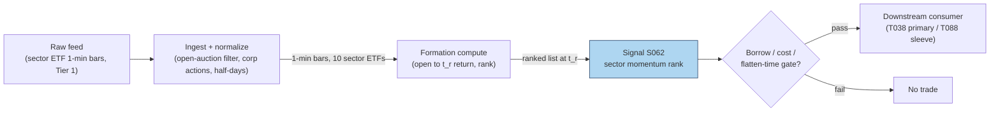

## Stage 62/200 — S062: Sector momentum

*Batch SB7 · Signal 62/100 · Provenance [D/SR] · Family D — Pairs & Cross-Sectional Arbitrage*

### S1. One-line verdict

| | |
|---|---|
| **What it is** | Buy past-winning industries/sectors, short past-losing ones — momentum lives in industries, not just stocks. |
| **When it works** | Intermediate horizons (1–12 months) in the literature; intraday, as a remainder-of-session continuation tilt on sector ETFs. |
| **When it dies** | Momentum crashes (sharp reversals after panics), crowded factor rotations, and — intraday — the close, when you must flatten. |
| **Build-or-buy in one line** | Build the ranker in an afternoon on daily/minute sector-ETF bars; buy nothing until you need point-in-time industry classifications. |

Provenance **[D/SR]**: industry momentum is documented (Moskowitz–Grinblatt 1999); the
intraday sector-ETF adaptation (rank by open-to-midday return, trade the rest of the session) is a
standard reconstruction — the literature version is **not** a day-trading strategy.

### S2. How it works — plain human explanation

**Momentum** is the tendency of past winners to keep winning and past losers to keep losing over
intermediate horizons. **Industry (sector) momentum** is the same effect computed on industry
portfolios rather than individual stocks: Moskowitz and Grinblatt's 1999 finding was that much of
what looks like individual-stock momentum is actually *industry* momentum — control for industries
and the stock-level effect shrinks dramatically.

Picture it: it is 12:00 ET. Over the morning, the ten sector ETFs have scattered: energy +0.4% on
an oil headline, materials −1.2% on China data. Sector momentum says the dispersion is not noise to
fade but information diffusing slowly — analysts, sector funds, and hedgers rotate with a lag, so
the morning's winners tend to keep drifting into the close. You rank the sectors, buy the top
group, short the bottom group, and flatten everything at the bell.

Why should it exist? Slow information diffusion across firms in an industry, correlated analyst
revisions, institutional sector-rotation flows that execute over days, and behavioral
underreaction — the same mechanisms as stock momentum, aggregated to a level where idiosyncratic
noise partly cancels.

Mental model:
- **Industries are the signal; stocks are the noise** — aggregate before you rank.
- **The literature is monthly; the tradable intraday form is a tilt**, not a standalone book.
- **Flatten at the close** — this signal has no overnight thesis in its intraday form.

### S3. The math — exact formula

**Literature form.** Form `N` value-weighted (by market capitalization) industry portfolios (Moskowitz–Grinblatt use 20
industries). Rank by cumulative return over the formation period `F`; long the top `K`, short the
bottom `K` (documented: **top/bottom 3 of 20 industries**; 6-month formation in the original,
1-month formation/holding in factor-momentum work):

```
R_p = (1/K) Σ_{i ∈ winners} R_i − (1/K) Σ_{i ∈ losers} R_i
```

**Intraday adaptation [SR].** At ranking time `t_r` (e.g. 12:00 ET), rank `M` sector ETFs
(XLK, XLF, XLE, …) by open-to-`t_r` return; hold the continuation (long top `k` / short bottom `k`,
or the ETFs themselves) from `t_r` to the close; flatten at 16:00 ET.

| Parameter | Symbol | Typical range | Too small | Too large | Default (example) |
|---|---|---|---|---|---|
| Formation window (lit.) | `F` | 1–12 months | microstructure noise dominates | stale ranking | 6 months (`example — not an institutional standard`) |
| Winners/losers (lit.) | `K` | 2–5 of ~20 | concentration risk | dilutes the spread | 3 (`example`) |
| Intraday rank time | `t_r` | 11:00–14:00 ET | formation too noisy | no holding time left | 12:00 ET (`example`) |
| Intraday legs | `k` | 2–4 of ~10 ETFs | idiosyncratic ETF noise | weak dispersion | 3 (`example`) |

Causal timing: the ranking at `t_r` uses only returns through `t_r`; the earliest fill is the bar
after `t_r`; positions are closed before the closing auction — no overnight carry.

Variants: (1) **residual sector momentum** — strip each sector's market beta first, rank the
residuals; (2) **industry-neutral factor rotation** (Ehsani–Linnainmaa direction) — rotate
*characteristic factors* on prior-month returns rather than industries; (3) **overnight-aware
form** — rank on prior close-to-open + first hour, exploiting the documented open/close split in
intraday momentum.

### S4. Worked example — step-by-step numbers (SYNTHETIC)

Ten fictional sector ETFs, seed **62** (`np.random.default_rng(62)`), reproducible via
`batches/SB7/plot_S062.py`. Formation leg: open → 12:00 ET. Holding leg: 12:00 → 16:00 ET,
flatten at close. Synthetic — arithmetic illustration, not a backtest.

| Sector | Formation (open→12:00) | Holding (12:00→16:00) | Leg |
|---|---|---|---|
| MATR | −1.194% | −0.337% | SHORT |
| FINL | −0.756% | −0.301% | SHORT |
| COMM | −0.545% | +0.009% | SHORT |
| TECH | −0.417% | −0.421% | — |
| INDU | −0.338% | −0.104% | — |
| ENRG | −0.002% | +0.404% | — |
| HLTH | +0.030% | −0.306% | — |
| CONS | +0.131% | +0.175% | LONG |
| UTIL | +0.165% | −0.080% | LONG |
| REAL | +0.193% | −0.191% | LONG |

Step-by-step: rank the formation column; the bottom 3 (MATR, FINL, COMM) are the short leg, the
top 3 (CONS, UTIL, REAL) the long leg. Holding-leg averages: long leg = (+0.175 − 0.080 − 0.191)/3
= **−0.032%**; short leg = (−0.337 − 0.301 + 0.009)/3 = **−0.209%**; long-short spread = −0.032 −
(−0.209) = **+0.178%** before costs.

What to notice: on this synthetic day the spread is positive only because the *loser* leg kept
losing — the winner leg itself drifted slightly negative. That is the honest anatomy of
continuation trades: the edge often lives in the short leg, which is also the expensive leg to
borrow. The chart's right panel plots the same leg closes (winner −0.03%, loser −0.21%, spread
+0.18% — spot-check against the table). The toy tape has no spreads, no borrow fees, and exactly
one convenient day — a real evaluation needs thousands of days and the short-leg cost stack.

### S5. Strategies that use this signal

- **T038 — Sector Momentum + Idiosyncratic Fade**: primary trigger — long sector-momentum
  winners while fading idiosyncratic residual extremes (S039) on the constituents.
- **T088 — Full-Stack Signal Ensemble**: component input — sector momentum is one cross-sectional
  sleeve inside the blended book, with meta-labeling (S086) deciding when the sleeve is active.

### S6. Data required — exact spec

| Field | Type | Granularity | Source tier | Notes |
|---|---|---|---|---|
| Sector ETF prices (XLK, XLF, …) | float | 1-min or daily bars | Tier 0–1 | The tradable implementation needs only ~10 ETFs |
| Industry classifications (GICS/SIC) | reference | event-driven | Tier 0–1 | GICS = Global Industry Classification Standard; for the literature form; CRSP/Compustat in academia |
| Constituent returns (lit. form) | float | daily bars | Tier 0–1 | Value-weighting within industries |
| Corporate actions | reference | daily | Tier 1 | Splits/dividends on ETFs |

Ingest sketch (≤20 lines, Python/polars):

```python
import polars as pl
etfs = ["XLK","XLF","XLE","XLV","XLI","XLP","XLU","XLB","XLC","XLRE"]
bars = pl.read_parquet("bars/sector_etf_1m.parquet")          # ts, sym, open, close
morn = (bars.filter(pl.col("ts").dt.time() <= pl.time(12,0))
            .group_by("sym").agg((pl.col("close").last()/pl.col("open").first()-1)
                                .alias("form_ret")))
rank = morn.with_columns(pl.col("form_ret").rank("ordinal").alias("rk"))
longs  = rank.filter(pl.col("rk") >  len(etfs)-3)["sym"].to_list()
shorts = rank.filter(pl.col("rk") <= 3)["sym"].to_list()      # trade 12:00 -> close
```

Storage: 10 ETFs × 390 minute-bars/day ≈ 4k rows/day — trivial (per notes/cost-model.md §4,
1-min bars for 500 symbols ≈ 50 MB/day total); daily-bar history is megabytes.

Data-quality checklist: ETF open-price reliability (first-minute auction noise — consider
open-to-`t_r` from the 9:35 bar); corporate actions on ETFs; sector reclassifications
(GICS changes move constituents); half-days and early closes (flatten logic must know them).

### S7. Local build on M5 Max / 128GB

**Feasibility: trivial (Tier L).** Ten ETFs, one ranking, one holding window — this is a spreadsheet
with a data feed.

- Throughput (per notes/cost-model.md §2): the whole daily computation is ~4k rows; even the
  literature form (20 industries × thousands of stocks × daily bars) is a few million rows —
  polars does it in well under a second.
- RAM (per §3): everything fits in megabytes; the 60-day working set is noise against the 77 GB budget.
- Engineering band: **Tier L, 8–12 h** (1-min/daily bar signals per cost-model §5: 4–12 h;
  two sessions of logic — ranker + flatten-at-close executor) → $1,200–1,800 at $150/hr
  loaded-cost estimate.
- Bottleneck: none on compute; the binding constraint is borrow availability on the short leg
  and the discipline to flatten daily.
- Breaks at: it doesn't, computationally — scale to the full literature form (all CRSP industries)
  and it is still a batch job.

### S8. Buy vs build

| Option | What you get | Indicative price | Gains | Loses |
|---|---|---|---|---|
| Tier 0: Stooq/Yahoo daily + GICS mappings | Daily sector-ETF bars, free classifications | ~$0 | Zero cost to prototype the literature form | No intraday, survivorship quirks |
| Tier 1: Polygon Stocks Advanced | 1-min sector-ETF bars, corporate actions | ~$30–200/mo | The intraday adaptation needs exactly this | Nothing material at this scale |
| Tier 2: Databento | L1 for precise open/close prints | ~$200/mo + usage | Cleaner auction/open handling | Unnecessary precision for a ranking signal |
| Academic: CRSP/Compustat | Publication-grade industry histories | Institutional $$$$ | Matches the literature exactly | Irrelevant for the tradable ETF form |

*All prices indicative — verify before budgeting.*

**Verdict: build, always, at this scale.** The signal is a ranking; no vendor sells a better one.
The crossover point where buying matters is the *literature replication* (point-in-time industry
histories) — not the tradable sector-ETF version.

### S9. Success ratio / efficacy — documented evidence

| Study / source | Market & period | Metric | Before/after cost | Caveat |
|---|---|---|---|---|
| Moskowitz & Grinblatt (1999), "Do Industries Explain Momentum?", J. Finance | US stocks, 1963–1995 | Industry momentum strategies "highly profitable" after controlling for size, book-to-market, individual-stock momentum, and microstructure; individual-stock momentum "up to 12% abnormal return per dollar long per year" but much weaker once industry momentum is controlled | Before-cost | Pre-1995 sample; equal-weighted industry portfolios; no transaction-cost accounting |
| Ehsani & Linnainmaa (2020, AEA preliminary), "Factor Momentum and the Momentum Factor" | US, 1964–2015 | Replicated industry momentum: 0.35%/month (t ≈ 2.09); factor momentum (rotating 51 factors on prior-month returns): 0.35%/month (t ≈ 7.05), subsumes industry momentum | Before-cost | Factor momentum ≠ industry momentum; the spanning result argues the industry effect rides factor exposures |
| Quantpedia (Dujava), "Sectoral Intramonth Momentum Cycle" | US sector ETFs | Three-phase intramonth cycle composited: 5.99% annualized, Sharpe ratio 0.55 (return per unit of volatility), long-short, invested < half the trading days | Costs unstated (treat as before-cost) | Practitioner research, not peer-reviewed |

Regimes where it fails: momentum crashes — sharp reversals after market panics invert the ranking
violently (the short leg squeezes); crowded factor rotations whipsaw monthly rebalances; intraday,
any day the morning dispersion is macro-news noise rather than slow diffusion. Documented decay:
industry momentum's raw premium has attenuated since the 1990s sample as the anomaly became known;
Ehsani–Linnainmaa's spanning result further suggests part of the "industry" premium was factor
timing in disguise.

Honest bottom line: **as a standalone trigger the literature documents a real but cost-sensitive
and crash-exposed premium at monthly horizons; as an intraday tilt it is an unproven adaptation —
a modest continuation overlay with a hard flatten-at-close, not a book.**

### S10. Failure modes & pitfalls

1. **Momentum crashes** — post-panic reversals flip winners/losers violently. *Mitigation:*
   vol-scaled sizing; skip ranking days after extreme market moves.
2. **Short-leg borrow costs** — the loser leg is where the continuation often lives and the
   hardest to borrow. *Mitigation:* model borrow explicitly; long-only variant if borrow is punitive.
3. **Morning noise misread as signal** — macro headlines at the open create dispersion that
   reverses, not continues. *Mitigation:* delay `t_r`; require formation breadth, not one outlier ETF.
4. **Overnight gap risk (literature form)** — monthly holds carry earnings/macro gaps.
   *Mitigation:* the intraday form flattens daily; the monthly form needs position-level stops.
5. **Crowded rotations** — known anomaly, correlated unwinds. *Mitigation:* cap the sleeve's
   capital; monitor pairwise crowding proxies.
6. **Reclassification drift** — GICS changes move constituents between sectors silently.
   *Mitigation:* point-in-time classification table; the ETF form sidesteps this entirely.
7. **Lookahead in formation** — using revised index membership or restated data.
   *Mitigation:* as-traded ETF prices only, timestamped membership.
8. **Overfitting the rank time** — `t_r` tuned on a handful of years. *Mitigation:* pick `t_r`
   from market-structure reasoning (post-open auction, pre-close), not from a grid search.

### S11. Visuals




### S12. Sources

1. Moskowitz, T.J. & Grinblatt, M. (1999) — "Do Industries Explain Momentum?", *Journal of
   Finance* 54(4), 1249–1290: industry momentum is strong and prevalent and accounts for much
   of the individual-stock momentum anomaly; industry momentum strategies (top/bottom 3 of 20
   industries by past value-weighted return) remain profitable after controlling for size,
   book-to-market, individual-stock momentum, and microstructure effects.
   http://www-stat.wharton.upenn.edu/~steele/Courses/956/Resource/Momentum/MoskowitzGrinblatt99.pdf
2. Ehsani, S. & Linnainmaa, J. (2020, AEA preliminary) — "Factor Momentum and the Momentum
   Factor": industries exhibit return momentum strongest at the one-month horizon; rotating 51
   factors on prior one-month returns earns 0.35%/month (t ≈ 7.05); factor momentum fully
   subsumes industry momentum; replicated industry momentum 0.35%/month (t ≈ 2.09).
   https://www.aeaweb.org/conference/2020/preliminary/paper/RHhbnykd
3. Dujava, C. (Quantpedia) — "Sectoral Intramonth Momentum Cycle: Exploiting Turn-of-the-Month
   Patterns in Sector ETF Strategies": three-phase intramonth momentum cycle at the sector-ETF
   level (momentum D+1, reversal D+2–D+3, renewed momentum D−10 to D−5); composited long-short
   5.99% annualized, 0.55 Sharpe on liquid US sector ETFs (practitioner research).
   https://quantpedia.com/sectoral-intramonth-momentum-cycle/

**Unverified leads**
- Duck.ai (GPT-5.6 Luna, 2026-09-10), Q-SB7-2: sector/industry build-cost context folded into
  the M5 Max discussion (cost-model §5 takes precedence). Q-SB7-3: no sector-momentum-specific
  after-cost numbers were provided by the bot. Source log:
  "Duck.ai answered Q-SB7-1–Q-SB7-3 (2026-09-10); Grok/Cursor answers pending (checked 2026-09-10)"
  (see `batches/SB7/question-log.md`).
