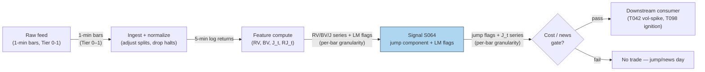

## Stage 64/200 — S064: Jump-robust realized variance (RV / bipower / Lee–Mykland)

*Batch SB8 · Signal 64/100 · Provenance [D] · Family E — Volatility & Options-Informed*

### S1. One-line verdict

| | |
|---|---|
| **What it is** | Splits daily realized variance into a smooth (continuous) part — via **bipower variation** (BV) — and a jump part, plus a per-bar Lee–Mykland jump test. |
| **When it works** | As a measurement and gating layer: jump-filtered vol series are cleaner inputs to every forecast, and jump flags veto trades that would walk into news bursts. |
| **When it dies** | As a standalone alpha: it measures volatility, it does not predict direction. On raw 1-minute returns without deseasonalizing, microstructure noise (ultra-high-frequency frictions such as bid–ask bounce) corrupts the split. |
| **Build-or-buy in one line** | Build — ~30 lines of numpy on 5-minute returns; the only thing you can buy is cleaner input data. |

Provenance **[D]**: bipower variation (Barndorff-Nielsen & Shephard 2004) and the Lee–Mykland
jump test (Lee & Mykland 2008) are documented, peer-reviewed methods. The *trading* uses of the
jump series (gating, momentum-ignition flags — where "ignition" is a sharp price burst that may
start a trend) are practitioner reconstructions.

### S2. How it works — plain human explanation

At 14:02 on a Fed-day (Federal Reserve FOMC rate-announcement day) afternoon, SPY prints a +0.9% bar in five minutes, then drifts back. A
naive **realized variance** (RV) — the sum of squared intraday returns — treats that bar the same
as eighteen +0.2% bars. Your volatility forecast spikes, your position sizer cuts risk, your
"vol spike" strategy fires. But the two situations are economically different: one was a single
discontinuous repricing on news, the other was genuinely elevated diffusive (smooth, continuous, non-jump) trading.

**Jump-robust realized variance** answers a simple question: *how much of today's variance came
from smooth continuous wiggling, and how much from jumps?* The trick, from Barndorff-Nielsen &
Shephard (2004), is that jumps are rare and isolated. A squared return `r²` is contaminated by a
jump — the square of the jump lands in full. But the product of two *adjacent* absolute returns
`|r_{i−1}|·|r_i|` is not: if a jump sits in bar *i*, it can only poison the two products that
touch bar *i*, while all other products measure the background diffusion. With enough bars, the
jump contamination washes out.

That gives **bipower variation** (BV): an estimator of the same integrated variance that RV
targets, but robust to isolated jumps. The difference `RV − BV` is then — up to estimation
error — the jump component of the day's quadratic variation. Lee & Mykland (2008) take the idea
one step further and test *each individual bar*: is this bar's return too large relative to a
local bipower-based vol estimate to be a draw from a diffusion? If yes, flag a jump arrival and
measure its size.

Why should jumps matter economically? Informed/news bursts arrive discontinuously — earnings,
macro prints (scheduled economic-data releases), block repricings (abrupt moves triggered by large block trades) — and the literature finds individual-stock jumps cluster on
prescheduled announcements (Lee & Mykland 2008). Jumps are "highly prevalent and distinctly
less persistent than the continuous sample path variation" (Andersen, Bollerslev & Diebold 2007 — "ABD"), so a forecast that
mixes the two regimes forecasts worse.

Mental model:
- **BV is the calm-weather vol; RV − BV is the storm ledger** — one diffuses, the other jumps.
- **Products of neighbors kill jumps; squares of singles don't** — that asymmetry is the whole trick.
- **Lee–Mykland names the guilty bar** — daily decomposition tells you *how much* jumped; LM tells you *when*.

### S3. The math — exact formula

Let `r_{t,i}` be the log return of day *t* over intraday interval *i* = 1…*M* (evenly spaced grid,
5-minute sampling is the standard starting point).

**Realized variance (RV)** — the sum of squared returns:
```
RV_t = Σ_{i=1..M} r_{t,i}²            (dimensionless variance units)
```
RV is a consistent estimator of the day's total **quadratic variation** = integrated variance
∫σ²ds plus the sum of squared jumps Σξ² (Andersen et al. 2003).

**Bipower variation (BV)** — products of adjacent absolute returns, scaled:
```
BV_t = (π/2) · Σ_{i=2..M} |r_{t,i−1}| · |r_{t,i}|
```
The scaling: for a standard normal Z, E|Z| = μ₁ = √(2/π), so 1/μ₁² = π/2 makes BV consistent for
∫σ²ds alone (Barndorff-Nielsen & Shephard 2004). BV is "somewhat robust to rare jumps" because
adjacent-return products are less affected than squared returns (mandatory framing).

**Jump component:**
```
J_t  = max(RV_t − BV_t, 0)
RJ_t = (RV_t − BV_t) / RV_t
```
(truncation is a practical fix; negative finite-sample estimates are clamped at zero —
Barndorff-Nielsen & Shephard 2004)

**Lee–Mykland (2008) per-bar jump test.** Local instantaneous-vol estimate from the K−2
preceding intervals:
```
σ̂²_{t,i} = (1/(K−2)) · Σ_{j=i−K+2..i−1} |r_{t,j−1}| · |r_{t,j}|
L_{t,i}   = |r_{t,i}| / σ̂_{t,i}
```
Reject "no jump in interval i" at level α when
```
(L_{t,i} − C_MT) / S_MT  >  −log(−log(1 − α))
C_MT = √(2·log(MT))/c − (log π + log(log MT)) / (2·c·√(2·log MT))
S_MT = 1 / (c·√(2·log MT)),   c = √(2/π),   T = number of days
```
— the Gumbel (extreme-value) critical value. Suggested practice: 5-minute intervals, window
K = 240 (per LM 2008 and follow-ups).

| Parameter | Symbol | Typical range | Too small → | Too large → | Default (example) |
|---|---|---|---|---|---|
| Sampling grid | Δ | 1–15 min | microstructure noise inflates RV | jumps diluted, fewer bars | 5 min — *example* |
| Intervals/day | M | 26–390 | power loss | noise | 78 (5-min, RTH = regular trading hours) — *example* |
| LM window | K | 100–300 | σ̂ noisy, false flags | slow to adapt to regime | 240 — *example* |
| Significance | α | 0.5–5% | missed real jumps | flag diffusion tails | 1% — *example* |

All defaults are `example — not an institutional standard`.

**Causal timing:** computed at interval *i* using returns ≤ *i*; the daily RV/BV/J_t split is
available at the close — tradable no earlier than the next open (*t+1*). Intraday LM flags are
tradable no earlier than bar *i+1*.

**Named variants:**
1. *Multipower / tripower variation* — products of 3+ adjacent returns for stronger robustness
   (Barndorff-Nielsen & Shephard 2006).
2. *Threshold BV / Mancini threshold estimator* — pre-truncate returns above a volatility-scaled
   threshold; asymptotically efficient (uses BV only to set the threshold).
3. *Staggered (h-skip) BV* — products |r_i|·|r_{i+h}| with h > 1 to dodge residual microstructure
   correlation.

**Batch flag (formula render warnings, from the Q-SB8-3 verification pass):** two SB8 chatbot
formulas rendered ambiguously and must be re-confirmed from canonical sources before coding:
(a) `VRP_t^σ = IVol_t − √(RV)` — ambiguous on the square root; (b) the 25Δ tolerance
"±0.5 to ±1.0 delta points" — partially garbled. Both concern sibling signals (S069/S071),
not S064; flagged here explicitly so no downstream worker treats them as confirmed.

### S4. Worked example — step-by-step numbers (SYNTHETIC)

**All numbers below are synthetic — the tape was constructed to contain one obvious +1% jump so
the arithmetic is hand-checkable. Nothing here is a backtest (a simulated trade history on past data).** Script:
`batches/SB8/plot_S064.py`, **seed 64** (the tape itself is a fixed 12-return sequence; the seed
drives only script machinery).

The 12 synthetic 5-min returns:
```
r = (0.001, −0.002, 0.0015, 0.0005, −0.001, 0.010,
     −0.0008, 0.0012, −0.0015, 0.0007, 0.0003, −0.0009)
```

Step 1 — RV summands (×10⁻⁶): 1.00, 4.00, 2.25, 0.25, 1.00, **100.00**, 0.64, 1.44, 2.25, 0.49,
0.09, 0.81 → Σ = 114.22×10⁻⁶, so **RV = 0.00011422** ✓ (hand-verified in duckai-answers Q-SB8-1).

Step 2 — BV summands, adjacent products (×10⁻⁶): 2.00, 3.00, 0.75, 0.50, 10.00, 8.00, 0.96,
1.80, 1.05, 0.21, 0.27 → Σ = 28.54×10⁻⁶. **BV = (π/2)(28.54×10⁻⁶) = 44.83×10⁻⁶ =
0.00004483** ✓ (28.54 × 1.5707963 = 44.83).

Step 3 — jump component: **RV − BV = 69.39×10⁻⁶**, so **J_t = 69.39×10⁻⁶** (positive, no
truncation needed) and **RJ = 69.39/114.22 = 60.8%** of the day's variance came from the jump.

The chart (`images/S064_example.png`) plots exactly these numbers: the top panel shows the
12-return tape with the +1% bar highlighted; the bottom panel shows the RV vs BV summands per
interval, with the totals annotated.

**What to notice:** the jump bar contributes 100×10⁻⁶ of the 114.22×10⁻⁶ RV total — the square
of the jump dominates RV — while in BV it appears only inside two adjacent products (10.00 and
8.00), diluted against 44.83×10⁻⁶. That dilution is the robustness in action. The limits: with
only 12 bars this is a toy — in production you need M ≈ 78+ for the asymptotics to bite, and the
toy has no fees, no bid–ask bounce (prices oscillating between bid and ask, creating
spurious measured volatility), and no microstructure noise, all of which inflate RV on real
1–5-minute data.

### S5. Strategies that use this signal

- **T042 — Jump-Robust Vol Spike Trader (primary):** enters short-horizon vol-spike trades only
  when the RV move survives the BV filter — i.e., trades the *continuous* vol spike, not the
  jump (T042 also consumes S065).
- **T098 — Jump-Validated Momentum Ignition (primary):** requires a Lee–Mykland jump flag on the
  ignition bar before chasing momentum — ignition without a jump is treated as noise.
- **T079 — Post-Announcement Vol Fade (filter/veto):** after an earnings/announcement event,
  fades realized vol back toward the BV-implied continuous level; the RV−BV split sizes the fade.

### S6. Data required — exact spec

| Field | Type | Granularity | Source tier | Notes |
|---|---|---|---|---|
| Trade/quote-derived log returns | float | 1–5 min bars | Tier 0–1 | Evenly spaced grid required; fill short gaps, drop halted symbols |
| Corporate-action adjustments | float | event | Tier 0–1 | Splits/dividends must be adjusted *before* return computation or every split looks like a jump |
| Trading-halt flags | bool | bar | Tier 1 | Zero-volume bars are not jumps |

Ingest sketch (≤20 lines, polars):
```python
import polars as pl
bars = pl.read_parquet("bars_5m.parquet")          # t, symbol, open, high, low, close
r = (bars.with_columns(
        pl.col("close").log().diff().over("symbol").alias("r"))
     .filter(pl.col("r").is_not_null()))
rv = r.group_by(["date","symbol"]).agg(pl.col("r").pow(2).sum().alias("RV"))
bv = (r.with_columns((pl.col("r").abs() * pl.col("r").abs().shift(1)
        .over("symbol")).alias("adj"))
      .group_by(["date","symbol"])
      .agg((1.5707963 * pl.col("adj").sum()).alias("BV")))
j = rv.join(bv, on=["date","symbol"]).with_columns(
        (pl.col("RV")-pl.col("BV")).clip(0).alias("J"),
        ((pl.col("RV")-pl.col("BV"))/pl.col("RV")).alias("RJ"))
```
Storage: 1-min bars ≈ **~0.1 MB per symbol-day** (per `notes/cost-model.md` §3); 5-minute
returns are a fraction of that — the RV/BV/J series are three floats per symbol-day, negligible.
**Data-quality checklist:** timestamp normalization (exchange time, DST), corporate actions
(splits are fake jumps), halts/suspensions, half-days, stale/zero-volume bars.

### S7. Local build on M5 Max / 128GB

**Feasibility: trivial.** RV/BV/LM are closed-form numpy/polars reductions over 5-minute
returns — no optimization, no training, no GPU. The pipeline is: 1-min or 5-min bars →
returns → RV/BV per symbol-day → Lee–Mykland per-bar flags.

Throughput (per `notes/cost-model.md` §2): numpy vectorized math ≈ 50–200M elements/sec; the
daily RV/BV for 500 symbols × 78 five-min bars = 39k elements — microseconds. Even full
history: 500 symbols × 390 min × 252 days × 20 years ≈ 982.8M returns ≈ 7.9 GB float64
(chatbot-verified arithmetic) fits in RAM with room; in practice keep it in partitioned Parquet
and compute per-day — cost-model §3's 77 GB working budget is never stressed.

| Stack | When to pick |
|---|---|
| Python + polars/numpy | Default — the whole estimator is groupby-agg; recompute daily in seconds |
| Rust | Only if you need the per-bar LM flag in the hot path at sub-millisecond latency |
| DuckDB | Research store for the RV/BV/J panel across symbols/days |

RAM: 1 day of 5-min returns for 500 symbols ≈ 39k floats ≈ 0.3 MB; 60 days ≈ 20 MB — trivial
(per cost-model §3 rule of thumb `rows × cols × 8`). 60-day rolling LM window needs only the
same returns.

Engineering time: cost-model §5 **Tier M, 20–60 h** for vol estimators (RV/bipower is at the
easy end of M; the Lee–Mykland test with the Gumbel critical value and edge handling is the
harder half). At $150/hr loaded: **$3,000–9,000** engineering. The SB8 chatbot's per-component
estimate for range+bipower was 20–50 h prototype (labeled chatbot lead) — consistent with Tier
M. Data: Tier 0–1 (Stooq/Polygon/Alpaca ~$0–200/mo, indicative — verify before budgeting).
Bottleneck: none computationally — data cleaning (corporate actions, halts) is the real work.

**What breaks first at 500 symbols / full OPRA:** nothing breaks for RV/BV on 5-min bars —
500 symbols is trivial. Scaling to full **L1** (top-of-book) event-driven per-tick LM flags would need Rust; and
the jump logic adds nothing to the options-data cost curve (S071–S074), which is where the real
money goes.

### S8. Buy vs build

| Option | What you get | Indicative price | Gains | Loses |
|---|---|---|---|---|
| Tier 0: Stooq / Alpaca IEX daily+15-min | Free bars for RV/BV on coarse grids | ~$0 | $0 cost, instant start | 1-min/5-min granularity gaps; no corporate-action guarantees |
| Tier 1: Polygon Stocks Advanced / Alpaca SIP | Clean 1-min bars + corporate actions (SIP = Securities Information Processor, the consolidated tape) | ~$30–200/mo | Reliable 5-min grid, splits handled | Nothing material for this signal |
| Tier 2: Databento Standard (MBP-1) | L1 quotes+trades for exact bar builds (MBP-1 = market-by-price level 1, i.e. top-of-book quotes and trades) | ~$200/mo + usage | Honest microstructure, your own grid | Overkill if you only need 5-min RV |
| Academic route: LOBSTER / WRDS TAQ | Replay-grade data for research (TAQ = the NYSE Trades and Quotes database) | ~hundreds/yr academic | Publication-grade replication | Access friction, not real-time |

**Verdict: build.** The estimator is 30 lines; what you might *buy* is data cleanliness (Tier 1
for corporate actions and halt flags). Buy a better feed if — and only if — your jump flags will
gate real money (T042/T098), where a split mislabeled as a jump is a trading error, not a
research artifact.

### S9. Success ratio / efficacy — documented evidence

Mandated framing for this chapter: **documented conditional value, but published effects much
weaker than raw backtests once realistic execution/timing/selection/regime controls are
imposed.** S064 is measurement infrastructure — the "efficacy" literature is about forecast
quality and empirical regularities, not trading Sharpe ratio (mean excess return ÷ volatility). There is no credible after-cost trading
Sharpe for "the bipower signal" as a standalone trigger, and none is claimed.

| Study / source | Market & period | Metric | Before/after cost | Caveat |
|---|---|---|---|---|
| Andersen, Bollerslev & Diebold (2007), *Rev. Econ. & Stat.* — the HAR-RV-CJ model (HAR = heterogeneous autoregression; CJ = continuous + jump components) separating continuous/jump components | DM/$ (deutsche mark per US dollar), S&P 500, 30-yr Treasury yield | Significant out-of-sample (evaluated on data not used to fit the model) volatility-forecast improvements; almost all predictability from the *non-jump* component | Before cost (forecast evaluation, not a profit-and-loss (P&L) backtest) | Forecast-accuracy metric, not tradable P&L; gains are in the continuous component you *keep*, not the jump you removed |
| Lee & Mykland (2008), *Rev. Financial Studies* — LM jump test on US equities | US individual stocks & S&P 500 | Individual-stock jumps associated with prescheduled earnings announcements and company news; index jumps with market news | Before cost (empirical regularity) | Descriptive association, not a trading rule; the test detects the jump *after* the news moved the price |
| **IHSG** (Indeks Harga Saham Gabungan — the Jakarta Composite index) intraday study (2025–2026), 5-min bars, 93 days — bipower decomposition of the Jakarta Composite | Indonesia, Dec 2025–May 2026 | Jump component ≈ 11.77% of daily RV on average; 32.3% of days show significant jumps; share rises to 16.36% on stress days | Before cost (descriptive) | Single emerging market, short sample; not an out-of-sample trading test |

Regimes where it fails: illiquid names where bid–ask bounce masquerades as jumps (use 5-min+
sampling); adjacent jumps (re-contaminate the products — use tripower); scheduled-announcement
clusters where jumps are expected and priced; vol-of-vol (volatility-of-volatility) regimes where the Gumbel critical
value miscalibrates.

**Honest bottom line:** as a standalone trigger this is not an edge at all — it is a
measurement. As a filter/gate (stand down when J_t is extreme; validate ignition with LM
flags), its conditional value is documented: jump-robust vol forecasts beat raw RV forecasts
out-of-sample, and news-day gating is standard practice on institutional desks.

### S10. Failure modes & pitfalls

1. **Microstructure noise masquerading as jumps** — on 1-min raw returns, bid–ask bounce
   inflates RV−BV. Mitigation: 5-minute (or coarser) sampling; noise-robust pre-averaging
   (smoothing returns over short windows to damp microstructure noise) variants.
2. **Lookahead in corporate actions** — an unadjusted split prints a giant "jump." Mitigation:
   adjust prices before return computation; validate against the corporate-action calendar.
3. **Adjacent/overlapping jumps** — products of neighbors re-contaminate. Mitigation: tripower
   variation or the Mancini threshold estimator for jump-dense tapes.
4. **Lee–Mykland over-detection under seasonality** — a strong diurnal U-shape makes the test
   over-flag jumps in high-vol periods of the day (documented in the modified-LM literature).
   Mitigation: deseasonalize first (S067) — LM on `r̃ = r/s_b`.
5. **Halt/zero-volume bars** — flat prices then a reopening gap look like a diffusion tail.
   Mitigation: drop halted symbols from the panel; treat reopenings as scheduled events.
6. **Interpreting the jump as tradable alpha** — the flag fires *after* the price moved.
   Mitigation: use it as a gate/filter (T042/T098/T079), never as a direction signal.
7. **Truncation bias** — max(RV−BV, 0) biases small-sample jump estimates upward. Mitigation:
   use formal tests (LM or the BNS z-test — Barndorff-Nielsen & Shephard's 2004 test of
   "no jumps" against "jumps present") for significance, not raw truncation.
8. **Parameter mining the window/grid** — K, Δ, α chosen to flatter a backtest. Mitigation:
   fix 5-min/K=240/α=1% from literature defaults; report sensitivity, not optima.

### S11. Visuals




### S12. Sources

1. Barndorff-Nielsen, O. E. & Shephard, N. (2004). "Power and Bipower Variation with Stochastic
   Volatility and Jumps." *Journal of Financial Econometrics*, 2(1), 1–37.
   https://public.econ.duke.edu/~get/browse/courses/883/Spr16/COURSE-MATERIALS/Z_Papers/BNSJFEC2004.pdf
2. Lee, S. S. & Mykland, P. A. (2008). "Jumps in Financial Markets: A New Nonparametric Test and
   Jump Dynamics." *Review of Financial Studies*, 21(6), 2535–2563.
   http://ideas.repec.org/a/oup/rfinst/v21y2008i6p2535-2563.html
3. Andersen, T. G., Bollerslev, T. & Diebold, F. X. (2007). "Roughing It Up: Including Jump
   Components in the Measurement, Modeling, and Forecasting of Return Volatility." *Review of
   Economics and Statistics*.
   https://www.sas.upenn.edu/~fdiebold/papers/paper56/abd_081605.pdf
4. Andersen, T. G., Bollerslev, T., Diebold, F. X. & Labys, P. (2003). "Modeling and Forecasting
   Realized Volatility." *Econometrica*, 71(2), 579–625.
   https://papers.ssrn.com/sol3/papers.cfm?abstract_id=262720&rec=1&srcabs=2120094&pos=2
5. IHSG intraday bipower study (2025–2026) — 93 days of 5-minute bars on the Jakarta Composite
   (IHSG); the source of the 11.77% / 32.3% / 16.36% statistics in S9.
   https://doi.org/10.47747/fmiic.v1i3.3561

**Chatbot material (labeled, per question-bank protocol):**
- Duck.ai (GPT-5.6 Luna, anonymous, 2026-09-10) answered Q-SB8-1–Q-SB8-3. The 12-return
  RV/BV worked example (RV = 0.00011422, BV = 0.00004483, RV−BV = 69.39×10⁻⁶) was
  operator-verified arithmetic and is used in S4. Practical leads (5-min sampling; J_t
  truncation; K = 240 for LM) are research leads — formulas come from the cited papers.
  Source log: "Duck.ai answered Q-SB8-1–Q-SB8-3 (2026-09-10); Grok/Cursor answers pending
  (checked 2026-09-10)."

**Unverified leads:**
- Modified Lee–Mykland test adjusting for intraday seasonality (Boudt et al.; conference
  abstract noting LM over/under-detects jumps under strong seasonality):
  https://www.bayes.citystgeorges.ac.uk/__data/assets/pdf_file/0020/67025/Abstracts.pdf —
  cited as a research lead; confirm the published version before implementation.
