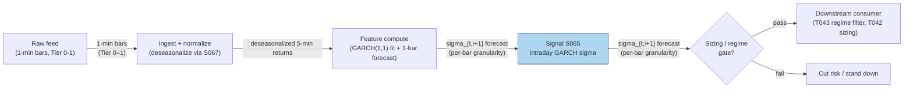

## Stage 65/200 — S065: GARCH(1,1) intraday volatility

*Batch SB8 · Signal 65/100 · Provenance [D] · Family E — Volatility & Options-Informed*

### S1. One-line verdict

| | |
|---|---|
| **What it is** | A parametric conditional-variance recursion — **GARCH** (Generalized Autoregressive Conditional Heteroskedasticity): today's variance is a weighted mix of yesterday's variance and yesterday's squared shock, fitted on deseasonalized intraday returns. |
| **When it works** | As a fast, always-on one-bar-ahead vol forecast for position sizing, leverage caps, and VaR (value-at-risk) gates — wherever you need a number, not a story. |
| **When it dies** | On raw intraday returns without diurnal adjustment (the U-shape breaks it — see S067); as a standalone trading trigger, where it adds nothing beyond "vol clusters." |
| **Build-or-buy in one line** | Build — any stats library fits GARCH(1,1) in milliseconds; buy only the clean intraday bars it eats. |

Provenance **[D]**: **ARCH** (Autoregressive Conditional Heteroskedasticity; Engle 1982) and GARCH (Bollerslev 1986) are documented, Nobel-cited
methods. The *intraday* application — plain GARCH fitted on 5–30-minute returns with diurnal
adjustment — is a practitioner adaptation, not a paper result; the source report flags this
explicitly and so does this chapter.

### S2. How it works — plain human explanation

Volatility clusters. A +2% down-bar is usually followed by more big bars, not by silence; a
quiet Tuesday is usually followed by a quiet Wednesday. **GARCH** (Generalized Autoregressive
Conditional Heteroskedasticity — **conditional** variance = the variance we expect *given* what
just happened) is the workhorse parametric model of that clustering.

The intuition is a thermostat with memory. There are two forces: yesterday's *realized shock*
(the squared residual — big move → raise the forecast) and yesterday's *forecast* (don't move
too fast). The GARCH(1,1) equation blends them:
tomorrow's variance = ω (a floor) + α × (yesterday's squared shock) + β × (yesterday's
variance). The sum **α + β is persistence** — how slowly the forecast forgets. Practitioners
typically see α + β ≈ 0.90–0.99 on financial returns (illustrative band, per the chatbot
research lead — treated as a starting guess, not a standard).

Intraday, there is a catch that kills the naive version. Returns at the open are ~1.4–1.5× as
volatile as midday returns — the diurnal U-shape (S067). If you fit GARCH on *raw* 5-minute
returns, the model sees the 9:35 bar, concludes "huge shock, raise vol," and is fooled by the
clock, not the market. The honest intraday setup, following Andersen & Bollerslev (1997), is to
**deseasonalize first, then GARCH**: write each return as `r_{t,i} = s_i · ε_{t,i}` where `s_i`
is the deterministic time-of-day scale (estimated once from history, mean 1), and fit GARCH on
the deseasonalized residuals. Alternatively, fit GARCH on daily data and scale the daily σ by
the diurnal U-shape for intraday horizons.

Economically, GARCH works as a sizing input because of **adverse selection** (trading against
better-informed counterparties) **and inventory risk** (accumulating unwanted positions): spreads widen and algos slow down when conditional vol is high, so expected slippage
(execution price worse than the decision-time mid) scales with σ. Picture it: 11:20, NVDA prints three −40 bp bars (bp = basis points; 1 bp = 0.01%) in a row. Your GARCH σ steps
up; your participation cap (maximum share of market volume your orders may take) drops from 15% to 8%; overnight carry
(positions held through the close) is cut before the close.
No alpha was generated — but the bleed was contained.

Mental model:
- **GARCH is a thermostat, not a trader** — it forecasts how hot the tape runs, not which way it moves.
- **α is the reflex, β is the memory** — big α reacts to each shock; big β keeps yesterday's level.
- **Seasonality first, dynamics second** — intraday GARCH without S067 deseasonalization is misspecified.

### S3. The math — exact formula

Let `r_{t,i}` be the intraday return and decompose it as
```
r_{t,i} = μ_{t,i} + ε_{t,i},      ε_{t,i} = σ_{t,i} · z_{t,i},     z_{t,i} ~ iid(0,1)
```
(**iid** = independent and identically distributed.) Where **σ²_{t,i}** is the
*conditional variance* (the variance of the next return given all
information up to now). The **GARCH(1,1)** recursion:
```
σ²_{t,i} = ω + α · ε²_{t,i−1} + β · σ²_{t,i−1}
```
with ω > 0, α ≥ 0, β ≥ 0. **Covariance-stationarity** (finite long-run variance) requires
**α + β < 1**, and the **unconditional (long-run) variance** is:
```
Var(r) = ω / (1 − α − β)
```
The **persistence** α + β controls mean reversion speed: half-life of a vol shock ≈
−log(2)/log(α+β) bars (e.g. α+β = 0.95 on 5-min bars ≈ 13.5 bars ≈ ~1 hour).

**Time-of-day seasonality** (intraday setup, Andersen–Bollerslev form):
```
r_{t,i} = s_i · ε_{t,i},      s_i = intraday seasonal scale factor (mean 1)
```
Estimate `s_i` from the U-shape (S067), then fit GARCH on `ε̃ = r/s_i`. The final one-bar-ahead
forecast is `σ̂²_{t,i+1} = s²_{i+1} · σ̂²_GARCH`.

**Leverage-asymmetry extensions** (variants, standard in the literature):
- **GJR-GARCH** (Glosten–Jagannathan–Runkle GARCH): σ² = ω + α·ε²_{t−1} + γ·ε²_{t−1}·1{ε_{t−1}<0} + β·σ²_{t−1} — bad news hits harder.
- **EGARCH** (exponential GARCH): `ln σ²_t = ω + α(|z_{t−1}| − E|z|) + γ·z_{t−1} + β·ln σ²_{t−1}` — log form, no
  positivity constraints; γ < 0 is the leverage effect.

| Parameter | Symbol | Typical range | Too small → | Too large → | Default (example) |
|---|---|---|---|---|---|
| Floor | ω | 1e-8–1e-5 (5-min var units) | σ collapses toward 0 after calm spells | vol never mean-reverts down | 2.0e-7 — *example* |
| Shock weight | α | 0.02–0.15 | sluggish reaction to real vol breaks | jumpy σ, whipsaws sizing | 0.06 — *example* |
| Persistence | β | 0.80–0.95 | forgets regimes too fast | α+β→1, integrated (nonstationary) | 0.89 — *example* |
| Persistence sum | α+β | < 1 required | — | ≥1 → infinite long-run var | 0.95 — *example* |
| Estimation window | — | 10–120 days of 5-min bars | noisy estimates | stale to regime breaks | 20–60 days — *example, chatbot lead* |

All defaults are `example — not an institutional standard`. Heavy-tailed returns → use
**Student-t innovations** (Bollerslev 1987) instead of Gaussian `z`; intraday residuals are
decidedly non-Gaussian.

**Causal timing:** σ̂²_{t,i} uses only returns through bar *i−1* — tradable (as a sizing input)
for bar *i* onward, and positions using it fill at *i* or later.

**Named variants:**
1. *Multiplicative-component GARCH* (Engle & Sokalska 2012): r = σ_t · s_i · z — daily GARCH
   level × deterministic diurnal × stochastic component; pooled cross-sectional estimation.
2. *mcsGARCH* (Diao & Tong 2015): daily × diurnal × stochastic decomposition for intraday VaR.
3. ***FIGARCH** (fractionally integrated GARCH) / long-memory* intraday models: persistence
   decays slower than geometric; some studies
   find it matches or beats short-memory GARCH on FX (before-cost forecast comparisons,
   evaluated with superior predictive ability and Diebold–Mariano tests — statistical tests of
   whether two competing forecasts have equal accuracy).

### S4. Worked example — step-by-step numbers (SYNTHETIC)

**Synthetic throughout — one simulated RTH (regular trading hours) session of 78 five-minute bins, used only to show
how the three pieces (season × GARCH → σ path → returns) assemble. Not a backtest (a simulated trade history on past data).**
Script: `batches/SB8/plot_S065.py`, **seed 65**.

Setup (example parameters — not institutional standards):
- Diurnal scale: `s_i = 1 + 0.55·u²`, u ∈ [−1, +1] across the session, renormalized to mean 1 →
  open/close bins ≈ 1.3× midday.
- GARCH(1,1): ω = 2.0×10⁻⁷, α = 0.06, β = 0.89 → persistence 0.95; unconditional σ =
  √(ω/(1−0.95)) = √(4.0×10⁻⁶) = 20.0 bp per 5-min bar.
- Simulate: h₀ = ω/(1−α−β); then h_i = ω + α·ε²_{i−1} + β·h_{i−1}; final σ_i = s_i·√h_i.

Hand-checkable steps (script's actual seed-65 output — corrected 2026-09-10): h₀ = 4.0×10⁻⁶
(20.0 bp). The seed-65 first Gaussian draw is z₀ = −1.1125, so ε₀ = √h₀·z₀ and
ε₀² = (−1.1125 × 20.0 bp)² ≈ 4.9507×10⁻⁶. Then:
```
h₁ = 2.0×10⁻⁷ + 0.06×4.9507×10⁻⁶ + 0.89×4.0×10⁻⁶
   = 2.000×10⁻⁷ + 2.970×10⁻⁷ + 3.560×10⁻⁶
   ≈ 4.0570×10⁻⁶  (20.14 bp)
```
— the persistence (β·h₀) term dominates, as it should with β = 0.89. **Correction note:**
the previous draft of this paragraph claimed z₀ ≈ −0.28 and h₁ ≈ 3.78×10⁻⁶ — that
hand-arithmetic was wrong and contradicted the script. The numbers above are the script's
true output (re-run and re-verified 2026-09-10); the chart plots exactly this simulation.

The chart (`images/S065_example.png`) plots exactly this simulation: top panel shows the
U-shaped seasonal scale `s_i`, the pure GARCH path, and the combined σ_{t,i} = s_i·√h_i
(mean ≈ 21.2 bp); bottom panel shows the synthetic 5-min returns drawn from it. You can see
the open/close vol elevation *and* the stochastic GARCH wander riding underneath it.

**What to notice:** the seasonal component is deterministic and knowable before the session
starts; the GARCH component adapts to realized shocks. Their product is what a sizer should
consume. The limits: this is one simulated path — real intraday residuals have heavier tails
(use Student-t), real α/β need fitting (not hand-picked), and the toy ignores the bid–ask
bounce (prices oscillating between bid and ask) that inflates real 5-minute σ estimates.

### S5. Strategies that use this signal

- **T043 — GARCH Regime Filter (primary):** the canonical consumer — momentum strategies run
  when the GARCH forecast is below its own trailing median; reversal books take over above it.
- **T042 — Jump-Robust Vol Spike Trader (also uses S065):** pairs the S064 jump split with the
  S065 σ forecast — a "vol spike" is defined as realized vol exceeding the GARCH forecast by a
  margin, after removing jumps.

### S6. Data required — exact spec

| Field | Type | Granularity | Source tier | Notes |
|---|---|---|---|---|
| Log returns | float | 5–30 min bars (intraday) or daily | Tier 0–1 | Must be deseasonalized before fitting (S067) |
| Diurnal scale s_i | float | per intraday bin | computed | Estimated from 20+ days of history |
| Corporate-action adjustments | float | event | Tier 0–1 | Splits corrupt the GARCH recursion otherwise |

Ingest sketch (≤20 lines):
```python
import polars as pl, numpy as np
from arch import arch_model          # pip install arch
bars = pl.read_parquet("bars_5m.parquet")
r = bars.with_columns(pl.col("close").log().diff().over("symbol").alias("r")).drop_nans()
# deseasonalize with the S067 scale, then fit per symbol
s = pl.read_parquet("diurnal_scale.parquet")      # bin -> s_b, mean 1
x = r.join(s, on="bin").with_columns((pl.col("r")/pl.col("s_b")).alias("e"))
fit = arch_model(x.filter(symbol="AAPL")["e"].to_numpy(),
                 vol="Garch", p=1, q=1, dist="t").fit(disp="off")
print(fit.params)          # omega, alpha, beta (+ nu for Student-t)
forecast = fit.forecast(horizon=1).variance.values[-1, 0]
```
Storage: 1-min bars ≈ **~0.1 MB per symbol-day** (per `notes/cost-model.md` §3); the GARCH
parameters are 4 floats per symbol — nothing. **Data-quality checklist:** deseasonalize first
(the #1 failure), adjust corporate actions, handle half-days (shorter bin count), exclude
halted symbols from the seasonal estimation.

### S7. Local build on M5 Max / 128GB

**Feasibility: trivial.** GARCH(1,1) maximum-likelihood on a few thousand 5-minute
observations fits in milliseconds per symbol in `arch`/`statsmodels`; refitting a 500-symbol
universe intraday is seconds. No GPU, no distributed anything.

Throughput (per `notes/cost-model.md` §2): numpy ≈ 50–200M elements/sec; sklearn-class
optimization on 1M rows ≈ 1–10 min — a per-symbol GARCH fit on 2,000–5,000 five-minute obs is
far below that. 500 symbols × 78 bins/day of 5-min returns ≈ 39k floats/day; the full 20-year
history ≈ 982.8M returns ≈ 7.9 GB float64 (chatbot-verified) fits the 77 GB working budget
with room — though in practice you stream per-symbol daily files (cost-model §3).

| Stack | When to pick |
|---|---|
| Python + `arch` package | Default — tested optimizers, Student-t built in |
| Python + polars/numpy hand-rolled | If you need the recursion inside a hot loop (performance-critical inner execution path) with custom likelihoods |
| Rust | Only for tick-level (trade-by-trade) per-event σ updates in the execution path |

RAM: 1 day / 60 days of 5-min returns ≈ 0.3 MB / 20 MB for 500 symbols (cost-model §3 rule of
thumb) — trivial.

Engineering time: cost-model §5 **Tier M, 20–60 h** (intraday GARCH sits mid-M: the recursion
is easy, the deseasonalization, Student-t fitting, and forecast plumbing are the real work).
At $150/hr loaded: **$3,000–9,000**. The SB8 chatbot's per-component band for intraday GARCH
was 30–80 h prototype / 100–220 h production — labeled chatbot lead; the cost-model band takes
precedence and sits inside the prototype range. Data: Tier 0–1 (~$0–200/mo, indicative —
verify before budgeting).

**What breaks first at 500 symbols:** nothing in compute — but refitting per symbol per day
with Student-t likelihoods gets slow in pure Python loops; vectorize or fit in batch, and
consider the multiplicative-component form (one pooled diurnal + per-symbol daily GARCH) to
cut the parameter count.

### S8. Buy vs build

| Option | What you get | Indicative price | Gains | Loses |
|---|---|---|---|---|
| Tier 0: Stooq / Alpaca IEX | Free daily + coarse intraday bars | ~$0 | $0 start for daily GARCH | Intraday granularity insufficient for the 5-min recursion |
| Tier 1: Polygon Stocks Advanced / Alpaca SIP | Clean 1-min SIP (Securities Information Processor, the consolidated tape) bars + actions | ~$30–200/mo | The right input for deseasonalization + fitting | Nothing material |
| Library route: `arch` / `statsmodels` (open source) | Tested GARCH optimizers, t-dist | ~$0 | Don't re-derive the likelihood | You still own the diurnal layer |
| Tier 2: Databento | L1 (top-of-book) for exact bar construction | ~$200/mo + usage | Microstructure-honest bars | Overkill for a daily refit |

**Verdict: build, with open-source estimation.** The model is a commodity; the edge — if any —
is in the deseasonalization and the plumbing (refit cadence, forecast horizon, how sizing
consumes σ̂). Buy Tier-1 bars once the GARCH forecast gates real risk; the free tier suffices
while you prototype.

### S9. Success ratio / efficacy — documented evidence

Mandated framing: **documented conditional value, but published effects much weaker than raw
backtests once realistic execution/timing/selection/regime controls are imposed.** GARCH is a
forecasting technology, not a trading signal — its literature measures forecast accuracy
(R², likelihood, VaR coverage), not Sharpe ratio (mean excess return ÷ volatility). Treating a vol forecast as a standalone entry
trigger has no documented edge.

| Study / source | Market & period | Metric | Before/after cost | Caveat |
|---|---|---|---|---|
| Andersen & Bollerslev (1997), *J. Empirical Finance* — explicit periodic (diurnal) modeling of 5-min DM/$ (deutsche mark per US dollar) and S&P 500 futures | FX + US equities, 1992–93 / 1986–89 | "Most of the distortions attributable to the intraday volatility cycle may be eliminated" by modeling seasonality; raw intraday GARCH persistence estimates were wildly irregular across sampling frequencies, stabilizing after adjustment | Before cost (model diagnostics, not P&L) | Demonstrates misspecification of raw intraday GARCH, not a trading edge |
| Diao & Tong (2015), *Applied Economics Letters* — multiplicative-component GARCH on CSI 300 5-min returns | China CSI 300 | Diurnal component confirmed (notably *not* U-shaped under China's T+1 trading rule — shares cannot be sold the same day they are bought); model "performs well" out-of-sample (evaluated on data not used to fit the model) for intraday vol and VaR forecasting | Before cost (forecast evaluation) | Single market; "performs well" is a forecast-accuracy claim |
| "Forecasting exchange rate volatility using high-frequency data: Is the euro different?" — intraday GARCH vs FIGARCH, out-of-sample battery (superior predictive ability / Diebold-Mariano tests — statistical tests
   comparing the forecast accuracy of two models), deseasonalized 15-min data | EUR FX | Intraday FIGARCH "always outperforms" plain intraday GARCH; both enhanced by high-frequency data vs daily models | Before cost (forecast comparison) | FX-specific; the winner (FIGARCH) is long-memory, not the plain GARCH of this chapter |

**Honest bottom line:** as a standalone trigger this is not an edge at all — it is a
measurement. As a filter (T043's regime gate; T042's spike definition; VaR and participation
caps), its conditional value is documented: deseasonalized intraday GARCH-class models beat
raw or daily alternatives out-of-sample, and every serious intraday desk runs something in
this family for risk — not for entries.

### S10. Failure modes & pitfalls

1. **Fitting on raw (non-deseasonalized) returns** — the U-shape masquerades as clustering;
   α inflates, persistence misestimates. Mitigation: always deseasonalize via S067 first.
2. **α + β ≥ 1 (integrated/nonstationary)** — forecasts never mean-revert; long-run variance
   undefined. Mitigation: constrain the optimizer; monitor the persistence sum in production.
3. **Gaussian innovations on fat-tailed residuals** — underestimates tail σ, VaR breaches.
   Mitigation: Student-t innovations; backtest VaR coverage (Kupiec/Christoffersen VaR-coverage tests).
4. **Jumps contaminating the recursion** — a single jump bar permanently lifts σ̂. Mitigation:
   winsorize (clip extreme values at a percentile threshold) or jump-filter (S064) the input residuals; consider GJR/EGARCH for asymmetry.
5. **Stale parameters across regimes** — 60-day fit is blind to today's vol break. Mitigation:
   shorter windows (10–20 days) or exponentially weighted refits in fast markets; monitor
   forecast errors.
6. **Overfitting via model mining** — GARCH vs EGARCH vs GJR vs FIGARCH chosen by in-sample
   (fit-period) likelihood. Mitigation: fix the family a priori; compare out-of-sample on a frozen test set.
7. **Microstructure noise at fine grids** — 1-min σ̂ inflated by bid–ask bounce. Mitigation:
   5-min minimum sampling (chatbot lead), or noise-robust returns.
8. **Using the forecast as a direction signal** — the classic category error. Mitigation:
   restrict GARCH to sizing/gates (T043); entries come from directional signals.

### S11. Visuals




### S12. Sources

1. Andersen, T. G. & Bollerslev, T. (1997). "Intraday Periodicity and Volatility Persistence in
   Financial Markets." *Journal of Empirical Finance*, 4(2–3), 115–158.
   https://www.kellogg.northwestern.edu/academics-research/research/detail/1997/intraday-periodicity-and-volatility-persistence-in-financial-markets/
2. Diao, X. & Tong, B. (2015). "Forecasting intraday volatility and VaR using multiplicative
   component GARCH model." *Applied Economics Letters*, 22(18), 1457–1464.
   http://ideas.repec.org/a/taf/apeclt/v22y2015i18p1457-1464.html
3. "Forecasting exchange rate volatility using high-frequency data: Is the euro different?"
   *International Journal of Forecasting* (intraday GARCH vs FIGARCH out-of-sample comparison,
   deseasonalized 15-min data).
   https://www.sciencedirect.com/science/article/abs/pii/S0169207011000069
4. Engle, R. F. & Sokalska, M. E. (2012). "Forecasting intraday volatility of individual stocks:
   a multiplicative component GARCH." Referenced in the practitioner intraday-volatility
   literature (see source 5's survey of the decomposition r = daily × diurnal × stochastic).
   https://assets.bbhub.io/professional/sites/10/intraday_volatility-3.pdf
5. Canonical origins (report citations; journal references confirmed, no URL spot-checked):
   Engle, R. F. (1982). "Autoregressive Conditional Heteroskedasticity with Estimates of the
   Variance of United Kingdom Inflation." *Econometrica*, 50(4), 987–1007; Bollerslev, T.
   (1986). "Generalized Autoregressive Conditional Heteroskedasticity." *Journal of
   Econometrics*, 31, 307–327.

**Chatbot material (labeled, per question-bank protocol):**
- Duck.ai (GPT-5.6 Luna, anonymous, 2026-09-10) answered Q-SB8-1–Q-SB8-3. The intraday
  GARCH(1,1) formulation (σ²_{t,i} = ω + αε²_{t,i−1} + βσ²_{t,i−1}, α+β<1), the seasonal
  decomposition r_{t,i} = s_i·ε_{t,i}, the persistence band α+β ≈ 0.90–0.99 (illustrative),
  the 20–60-day estimation window, and Student-t innovations are chatbot research leads —
  consistent with the cited literature above; parameter values in S3/S4 are marked
  `example — not an institutional standard`. Source log: "Duck.ai answered Q-SB8-1–Q-SB8-3
  (2026-09-10); Grok/Cursor answers pending (checked 2026-09-10)."
- Batch formula flags (from Q-SB8-3 verification): (a) the volatility-premium line
  `VRP_t^σ = IVol_t − √(RV)` was ambiguous on the square root in the chatbot's render;
  (b) the 25Δ tolerance "±0.5 to ±1.0 delta points" was partially garbled. Neither is used
  in this chapter; both are cited here only as explicit flags for sibling chapters (S069,
  S071).

**Unverified leads:**
- Score-driven intraday extensions of GARCH (report cites arXiv 2211.12376) — confirm the
  arXiv ID from a canonical source before citing in production.
- "Volatility around the clock" (arXiv:1211.2961) reports up to 50% improvements in
  realized-volatility forecasts from a Bayesian intraday model with seasonal components:
  https://arxiv.org/abs/1211.2961v1 — a single-study forecast metric, not a trading result;
  treat as unverified until the full paper's evaluation is read.
