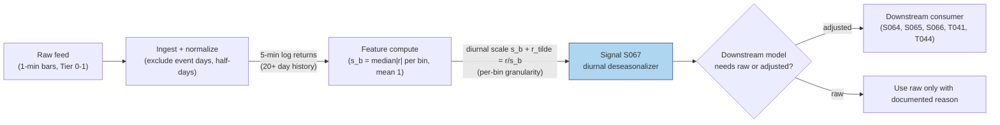

## Stage 67/200 — S067: Intraday vol seasonality / diurnal deseasonalization

*Batch SB8 · Signal 67/100 · Provenance [D] · Family E — Volatility & Options-Informed*

### S1. One-line verdict

| | |
|---|---|
| **What it is** | The **diurnal** (daily-recurring) **U-shape** in intraday volatility — high at the open, low midday, high at the close — estimated as a per-bin scale factor and divided out before any intraday model is fit. |
| **When it works** | Always as a preprocessing layer: every intraday vol or momentum model on raw returns is misspecified without it. |
| **When it dies** | Treated as a trading signal (it is clock, not information); copied across markets where the shape differs (FX follows geographic sessions, not a U). |
| **Build-or-buy in one line** | Build — median |r| per time bin over a few weeks; nothing to buy except the bars. |

Provenance **[D]**: the U-shaped intraday pattern is documented across NYSE, London, and Tokyo
equities and Chicago futures (Wood, McInish & Ord 1985; Andersen & Bollerslev 1997), with
noted exceptions (FX session structure; China's T+1 market). Deseasonalization itself is
standard practitioner methodology.

### S2. How it works — plain human explanation

**Diurnal** means "recurring within the day." **U-shape** is the picture: plot average
volatility against the time of day for US equities and you get a bathtub — elevated at the
9:30 open (overnight news gets priced in), sagging through the midday lull, rising again into
the 16:00 close (benchmarked funds and MOC flows rush to finish). This pattern is not
information arriving — it is the *clock*. The same stock, same news environment, is simply
more volatile at 9:35 than at 12:35.

That distinction is load-bearing for every other vol signal in this family. A **GARCH** model
(S065) fitted on raw 5-minute returns sees the open spike and "learns" that volatility is
clustering — when really it is just 9:30 being 9:30. A jump test (S064) sees the close bar and
flags a jump that was really the scheduled end-of-day auction pressure. **Deseasonalization**
removes the clock before the model sees the data: estimate a deterministic scale factor `s_b`
for each time-of-day bin *b* (scaled so its average is 1), then work with adjusted returns
`r̃ = r / s_b`. A 30-bp bar at the open with s_open = 1.4 becomes a 21-bp adjusted bar —
comparable to a 21-bp midday bar. What remains is the *stochastic* volatility: the part the
market actually did not schedule.

Why does the U-shape exist economically? The open concentrates overnight information
processing (adverse selection is highest when informed traders act on accumulated news);
midday, liquidity provision dominates and spreads tighten; the close concentrates uninformed
benchmark flow (indexers, VWAP completions, **MOC** — market-on-close — imbalances) which is price-insensitive and
pushes volume up. Different mechanisms, same shape — which is why it is stable enough to
estimate from history and divide out.

But the shape is not universal, and that is a documented fact, not a footnote. In FX, the
pattern follows geographic sessions — Ito & Hashimoto (2006) found U-shaped intraday activity
for Tokyo and London participants but *not* for New York participants. In China's CSI 300,
the diurnal pattern is not U-shaped at all under the T+1 trading rule (Diao & Tong 2015).
Estimate per market; never import a shape.

Mental model:
- **The clock is not the market** — divide out the predictable U before modeling the unpredictable wiggle.
- **s_b is a ruler, not a signal** — it normalizes other signals; it never triggers a trade by itself.
- **Every market has its own shape** — estimate it locally, re-estimate it when structure changes.

### S3. The math — exact formula

For each time-of-day bin *b* (e.g. 78 five-minute bins of the US RTH — regular trading
hours — session), estimate the
deterministic **diurnal factor**:
```
s_b = median(|r_{t,b}| over days t) / mean_b(median(|r_{t,b}|))     (mean 1 by construction)
```
Alternatives: mean RV share per bin, or a Fourier/parametric fit. Then **deseasonalize**:
```
r̃_{t,b} = r_{t,b} / s_b
```
All downstream models (GARCH, HAR, jump tests) are fitted on `r̃`, not `r`.

**Andersen–Bollerslev (1997) multiplicative form** (the canonical decomposition):
```
R_{t,n} = E(R_{t,n})/√N + σ_t · s_{t,n} · Z_{t,n}
```
where `R_{t,n}` is the *n*th intraday return of day *t*, `σ_t` is the daily stochastic vol
level, `s_{t,n}` is the periodic (deterministic) component scaled to mean 1, and `Z` is
iid noise. Estimation: regress `log|r|`-type measures on time-of-day dummies plus the daily
vol level (their flexible Fourier/indicator procedure), or the simpler median-|r| estimator
above.

| Parameter | Symbol | Typical range | Too small → | Too large → | Default (example) |
|---|---|---|---|---|---|
| Bins/day | — | 13–390 | coarse shape, open/close spikes smeared | noisy s_b, overfitting the clock | 78 (5-min) — *example* |
| Estimation window | — | 2–12 weeks | s_b noisy, day-of-week effects leak | stale after structural change | 20 days (~4 weeks) — *example* |
| Estimator | — | median\|r\| / RV share / Fourier | mean\|r\| is jump-sensitive | over-parameterized | median\|r\| — *example* |

All defaults are `example — not an institutional standard`.

**Causal timing:** `s_b` is estimated on history strictly before day *t* (rolling window); the
adjusted return `r̃_{t,b}` is available at bar *b* — tradable no earlier than *b+1*. Never
estimate `s_b` on the same day you trade it.

**Named variants:**
1. *Fourier-flexible form* (Andersen & Bollerslev 1997): sin/cos terms in time-of-day instead
   of per-bin dummies — smoother, fewer parameters.
2. *Announcement-aware seasonality* (Andersen & Bollerslev 1998): add macro-announcement
   dummies — scheduled news has its own deterministic vol bump on top of the U.
3. *Multiplicative-component GARCH* (Engle & Sokalska 2012): daily GARCH × deterministic
   diurnal × stochastic intraday — the production-grade descendant of this chapter.

### S4. Worked example — step-by-step numbers (SYNTHETIC)

**Synthetic — 20 simulated days × 78 five-minute bins, built with a known U-shape so the
estimator can be checked against truth. Not market data, not a backtest.** Script:
`batches/SB8/plot_S067.py`, **seed 67**.

Construction: true scale `s_true(b) = 1 + 0.60·u²` (u ∈ [−1,+1] across the session),
renormalized to mean 1 → open/close bins ≈ 1.33×, midday bins ≈ 0.83× (a mild U-shape, so
recovery is a real test, not a giveaway). Each day's returns:
`r_{t,b} = s_true(b) · σ_t · z`, with random daily level σ_t and standard-normal z.

Estimation step (the part you would run in production): `ŝ_b = median_t|r_{t,b}| /
mean_b(median_t|r_{t,b}|)`. The script's output: mean(ŝ) = 1.000000 exactly (by
construction), and the estimated profile recovers the hidden U-shape — noisily at the
midday minimum, where small medians amplify sampling noise over only 20 days (a production
window would use more history or Fourier smoothing).

Deseasonalization on the illustrative day-1 tape: the raw open bar was −21.8 bp; divided by
ŝ_open ≈ 1.41 → adjusted −15.4 bp. The script prints `raw_open_bin1_bp=-21.8
adj_open_bin1_bp=-15.4` — the open "spike" is flattened to a level comparable with midday
bars, which is exactly the point: after adjustment, a 15-bp bar means the same thing at
9:35 and at 12:35.

The chart (`images/S067_example.png`): top panel shows the true U-shape (hidden from the
estimator) against the estimated ŝ_b — they track closely; bottom panel shows raw vs
deseasonalized 5-minute returns for the illustrative day.

**What to notice:** the estimator needs no knowledge of the truth — median |r| per bin over
20 days is enough. The limits: 20 days is the *example* window; real estimation must exclude
event days (FOMC, CPI) whose deterministic bumps are not the daily U, and must handle
half-days (fewer bins). Also note what this chapter does *not* do: it never says whether the
market will go up or down — it only makes the ruler honest.

### S5. Strategies that use this signal

- **T044 — Diurnal Deseasonalization Normalizer (primary):** the canonical consumer —
  normalizes *every* signal's thresholds by time-of-day vol before any entry decision
  (consumes S067 with S046, S083).
- **T004 — VWAP-Deviation Mean-Reversion (uses S067):** the VWAP-deviation z-score's
  denominator is the deseasonalized vol — without S067, open/close deviations would look
  artificially stretched.
- **T041 — HAR Vol-Timing Overlay (uses S067):** scales positions by **HAR**
  (Heterogeneous Autoregressive) realized-volatility forecasts that are
  fitted on deseasonalized returns; the overlay's intraday timing leg runs on S067-adjusted
  series.

### S6. Data required — exact spec

| Field | Type | Granularity | Source tier | Notes |
|---|---|---|---|---|
| Log returns | float | 5-min bars (or finer) | Tier 0–1 | 20+ trading days of history minimum |
| Session calendar | — | day | Tier 0–1 | Half-days need their own (shorter) shape |
| Announcement calendar | — | event | Tier 0–2 | FOMC/CPI days excluded from s_b estimation |

Ingest sketch (≤20 lines):
```python
import polars as pl
bars = pl.read_parquet("bars_5m.parquet")          # t, symbol, bin (1..78), close
r = (bars.with_columns(pl.col("close").log().diff().over("symbol").alias("r"))
     .filter(pl.col("r").is_not_null()))
# exclude event days from the seasonal estimation
calm = r.join(event_days, on="date", how="anti")
s = (calm.group_by(["symbol","bin"])
     .agg(pl.col("r").abs().median().alias("med_abs"))
     .with_columns((pl.col("med_abs")/pl.col("med_abs").mean().over("symbol")).alias("s_b")))
adj = r.join(s, on=["symbol","bin"]).with_columns((pl.col("r")/pl.col("s_b")).alias("r_adj"))
```
Storage: 1-min bars ≈ **~0.1 MB per symbol-day** (per `notes/cost-model.md` §3); the `s_b`
table is 78 floats per symbol — nothing. **Data-quality checklist:** exclude scheduled-event
days from estimation (they have their own shape); separate half-day sessions; drop halted
symbols; re-estimate the shape periodically (quarterly is a common *example* cadence).

### S7. Local build on M5 Max / 128GB

**Feasibility: trivial.** Median-|r| per bin over 20 days × 78 bins is a groupby-aggregation —
the cheapest operation in the cost model (polars ≈ 10–50M rows/sec, `notes/cost-model.md` §2).
The whole S067 pipeline for a 500-symbol universe runs in seconds on one core.

Throughput: 500 symbols × 78 bins × 20 days = 780k rows — microseconds of compute. Even the
full 20-year history (982.8M returns ≈ 7.9 GB float64, chatbot-verified) is a streaming
groupby, never held whole — far inside the 77 GB working budget (cost-model §3).

| Stack | When to pick |
|---|---|
| Python + polars | Default — the estimator is literally a groupby |
| DuckDB | If the bar history already lives in a research DB |
| Rust | Never needed for this signal alone |

RAM: 60 days of 5-min returns for 500 symbols ≈ 20 MB (cost-model §3 rule of thumb) —
trivial.

Engineering time: cost-model §5 — deseasonalization is a **Tier L/M boundary task, ~4–12 h**
(Tier L band: 1-min bar signals) to **20 h** if you add the Fourier form and the
announcement-aware variant. At $150/hr loaded: **$600–3,000**. Data: Tier 0–1 (~$0–200/mo,
indicative — verify before budgeting).

**What breaks first at 500 symbols / full OPRA:** nothing — this is the cheapest chapter in
the batch. The only scaling cost is conceptual: per-symbol shapes for 500 symbols need
per-symbol corporate-action-clean bars, and options-side deseasonalization (S071–S074) needs
the full-chain data that dominates that sub-batch's budget.

### S8. Buy vs build

| Option | What you get | Indicative price | Gains | Loses |
|---|---|---|---|---|
| Tier 0: Stooq / Alpaca IEX | Free bars | ~$0 | Enough to prototype the U-shape | Coarse granularity; action-adjustment risk |
| Tier 1: Polygon / Alpaca SIP | Clean 1-min bars + actions (SIP = Securities Information Processor, the consolidated tape) | ~$30–200/mo | Reliable per-bin medians | Nothing material |
| Build on vendor "intraday seasonality" analytics | Precomputed profiles | varies | Saves an afternoon | You inherit their binning, window, and event handling |

**Verdict: build, always.** This is a fifteen-line groupby. Buying a precomputed seasonal
profile means trusting someone else's bin definitions, event exclusions, and re-estimation
cadence on the single most load-bearing preprocessing step in your vol stack — never worth
it.

### S9. Success ratio / efficacy — documented evidence

Mandated framing: **documented conditional value, but published effects much weaker than raw
backtests once realistic execution/timing/selection/regime controls are imposed.** S067 is
pure infrastructure — its "efficacy" is measured in model-misspecification removed, not in
Sharpe. Nobody trades the U-shape; everybody who models intraday vol must condition on it.

| Study / source | Market & period | Metric | Before/after cost | Caveat |
|---|---|---|---|---|
| Andersen & Bollerslev (1997), *J. Empirical Finance* — explicit periodic modeling of 5-min DM/$ and S&P 500 futures | FX + US equities, 1992–93 / 1986–89 | "Most of the distortions attributable to the intraday volatility cycle may be eliminated"; raw intraday GARCH persistence estimates collapsed or exploded across sampling frequencies without the adjustment | Before cost (model diagnostics) | Diagnostic evidence, not a trading result |
| Andersen & Bollerslev (1998), *J. Finance* — DM/$ 5-min with announcement dummies | FX, 1 year of 5-min | Intraday activity patterns + macro announcements + ARCH persistence "separately quantified and shown to account for a substantial fraction of return variability, both at the intraday and daily level" | Before cost (variance decomposition) | FX market; decomposition ≠ trade |
| Shape non-universality: Ito & Hashimoto (2006) via MDPI survey — U-shaped activity for Tokyo/London participants, *not* for New York; Diao & Tong (2015) — CSI 300 diurnal *not* U-shaped under T+1 | FX, China equities | The U is a market-structure artifact, not a law | Before cost (descriptive) | Directly limits portability — estimate per market |

Regimes where deseasonalization fails: structural breaks (tick-size changes, session-hour
changes, the move to 24-hour trading) that shift the shape — a stale `s_b` then
*mis*-normalizes; event days (FOMC/CPI/earnings) with their own deterministic bumps; and
markets where the "shape" is driven by scheduled auctions rather than continuous flow.

**Honest bottom line:** as a standalone trigger this is a zero edge — it is a ruler, not a
trade. As a preprocessing layer its conditional value is as documented as anything in this
document: skip it and your GARCH persistence, your jump flags, and your HAR forecasts are
all measuring the clock instead of the market.

### S10. Failure modes & pitfalls

1. **Estimating s_b on event days** — FOMC/CPI bumps are deterministic but not daily; they
   inflate the U. Mitigation: exclude scheduled-event days from estimation.
2. **Stale shape after structural change** — tick-size, hours, or regime changes move the U.
   Mitigation: re-estimate on a rolling window; monitor ŝ_b drift.
3. **Importing another market's shape** — FX follows sessions, China isn't U-shaped.
   Mitigation: estimate per market, per symbol class; never copy.
4. **Mean-|r| instead of median-|r|** — jumps corrupt the mean estimator. Mitigation: robust
   estimators (median); winsorize first.
5. **Half-days and holidays** — fewer bins, different shape. Mitigation: separate shape or
   exclude.
6. **Lookahead: estimating on the trading day** — s_b must come from history strictly before
   *t*. Mitigation: rolling window ending at *t−1*; freeze the table pre-open.
7. **Over-granular bins** — 1-min bins give noisy s_b that overfits the clock. Mitigation:
   5-min minimum (chatbot lead), or Fourier smoothing.
8. **Treating the season as a signal** — "vol is high at the open, therefore fade" is clock
   trading. Mitigation: S067 normalizes other signals; it never triggers (T044 is the
   consumer, not the trader).

### S11. Visuals




### S12. Sources

1. Andersen, T. G. & Bollerslev, T. (1997). "Intraday Periodicity and Volatility Persistence in
   Financial Markets." *Journal of Empirical Finance*, 4(2–3), 115–158.
   https://www.kellogg.northwestern.edu/academics-research/research/detail/1997/intraday-periodicity-and-volatility-persistence-in-financial-markets/
2. Andersen, T. G. & Bollerslev, T. (1998). "Deutsche Mark–Dollar Volatility: Intraday Activity
   Patterns, Macroeconomic Announcements, and Longer Run Dependencies." *Journal of Finance*,
   53(1), 219–265.
   https://www.kellogg.northwestern.edu/academics-research/research/detail/1998/deutsche-mark-dollar-volatility-intraday-activity-patterns-macroeconomic-announcements/
3. Diao, X. & Tong, B. (2015). "Forecasting intraday volatility and VaR using multiplicative
   component GARCH model." *Applied Economics Letters*, 22(18), 1457–1464. (Documents the
   non-U-shaped CSI 300 diurnal under T+1.)
   http://ideas.repec.org/a/taf/apeclt/v22y2015i18p1457-1464.html
4. "Instantaneous Volatility Seasonality of High-Frequency Markets in Directional-Change
   Intrinsic Time." *Journal of Risk and Financial Management*, 12(2), 54. (Surveys U-shape
   evidence incl. Ito & Hashimoto (2006): U-shape for Tokyo/London, not New York participants.)
   https://www.mdpi.com/1911-8074/12/2/54/html
5. Canonical origin (report citation; journal reference confirmed, no URL spot-checked):
   Wood, R. A., McInish, T. H. & Ord, J. K. (1985). Documented U-shaped intraday patterns in
   NYSE equities — the original U-shape evidence this chapter's estimator operationalizes.

**Chatbot material (labeled, per question-bank protocol):**
- Duck.ai (GPT-5.6 Luna, anonymous, 2026-09-10) answered Q-SB8-1–Q-SB8-3. The Andersen–
  Bollerslev decomposition `R_{t,n} = E(R_{t,n})/√N + σ_t·s_{t,n}·Z_{t,n}`, the deseasonalize-
  first rule (`r̃ = r/s_b`), and the estimation-window guidance are chatbot research leads
  consistent with sources 1–2 above. Source log: "Duck.ai answered Q-SB8-1–Q-SB8-3
  (2026-09-10); Grok/Cursor answers pending (checked 2026-09-10)."
- Batch formula flags (from Q-SB8-3 verification): (a) the volatility-premium line
  `VRP_t^σ = IVol_t − √(RV)` was ambiguous on the square root in the chatbot's render;
  (b) the 25Δ tolerance "±0.5 to ±1.0 delta points" was partially garbled. Neither is used
  in this chapter; both are cited here only as explicit flags for sibling chapters (S069,
  S071).

**Unverified leads:** none beyond the chatbot items above — all efficacy claims in S9 trace
to the checkable sources listed.
