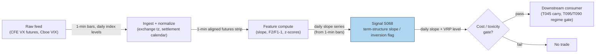

## Stage 68/200 — S068: VIX term structure

*Batch SB8 · Signal 68/100 · Provenance [D] · Family E — Volatility & Options-Informed*

### S1. One-line verdict

| | |
|---|---|
| **What it is** | The slope (and curvature) of the VIX futures curve — how 30-day implied volatility changes with expiry — read as a stress gauge and a carry signal. |
| **When it works** | Calm regimes where the curve sits in *contango* (upward-sloping) and mean-reverts; used as a regime gate and roll-yield harvest. |
| **When it dies** | Vol spikes and regime breaks: the curve inverts (*backwardation*), carry trades get run over, and slope flips faster than daily rebalances. |
| **Build-or-buy in one line** | Buy the VIX/VX futures feed; build the analytics yourself — the math is public and the edge is in timing, not the formula. |

Provenance [D] (documented: Cboe VIX methodology, variance-risk-premium literature). Family E — Volatility & Options-Informed.

### S2. How it works — plain human explanation

The **VIX index** is the market's annualized forecast of S&P 500 volatility over the next 30 days, computed from S&P 500 option prices (more on the formula in S3). It is a *spot* number. But options exist for many expiries, so there is also a *term structure*: VIX futures (ticker VX, traded on CFE — Cboe Futures Exchange) expiring in 1 month, 2 months, 3 months, and so on. The *slope* of this curve is the signal.

Picture a Tuesday morning, 9:47. The VIX prints 17.2. The front-month VX future trades at 17.9, the second-month at 18.6. The curve slopes upward — **contango** (future prices above spot), the normal state: traders demand compensation for bearing volatility risk over longer horizons. Flip to a stress morning: VIX 34, front-month future 35.6, second-month only 32.4 — the curve slopes *downward*, **backwardation**: front-month protection is bid up because everyone wants insurance *now*.

Why should the slope be a tradable signal? Two economic mechanisms. First, **carry/roll-down**: in contango, a short front-month VX position profits mechanically as the future converges down toward spot at settlement (the "roll yield" that has historically made long-VIX ETPs (exchange-traded products) bleed in calm stretches). Second, **stress inversion**: backwardation is one of the cleanest real-time gauges of market stress, and a fast return from backwardation to contango has historically marked stress exhaustion.

Mental model:
- The VIX futures curve prices *when* the market wants volatility insurance; its slope = whether fear is now or later.
- Contango pays carry to short-vol sellers in calm regimes — and charges it violently when stress arrives.
- Backwardation is a stress alarm: the edge is in the *transition* back, not in the level.

### S3. The math — exact formula

**VIX (spot level).** The Cboe computes the VIX as the square root of a *model-free implied variance* — an average of out-of-the-money (strike below spot for puts, above spot for calls) S&P 500 option prices weighted by 1/K², interpolated between the two expiries straddling 30 days (Demeterfi et al., 1999; Britten-Jones & Neuberger, 2000; Cboe white paper). The core formula, for one expiry T (in years):

$$\sigma^2(T) = \frac{2e^{rT}}{T}\left[\sum_{K_i < K_0}\frac{\Delta K_i}{K_i^2}P(K_i) + \sum_{K_i > K_0}\frac{\Delta K_i}{K_i^2}C(K_i)\right] - \frac{1}{T}\left(\frac{F}{K_0} - 1\right)^2$$

where Kᵢ are strike prices (dollars), P(Kᵢ)/C(Kᵢ) are out-of-the-money put/call mid-prices, ΔKᵢ is half the distance to adjacent strikes, F is the forward index level, K₀ is the first strike at or below F, r is the risk-free rate, and VIX = 100 × √[interpolated σ² at 30 days].

**Term-structure signals (the S068 features).** With VXₘ = price of the VIX future expiring in m months (points):

- Level: VIX itself (30-day spot implied vol).
- 1×2 slope: S₁ₓ₂ = VX₂ − VX₁ (points). Example value: +0.7 = contango; −3.2 = backwardation.
- Relative slope: VX₂/VX₁ − 1 (percent). Example: +4.2% contango; −9.0% backwardation.
- Short-vs-long: VIX − VIX3M (VIX3M = Cboe 3-Month Volatility Index), or VIX9D (Cboe 9-Day Volatility Index) vs VIX (9-day vs 30-day: front of the *spot* curve).
- Variance-risk-premium proxy (VRVP): VIX − E[RV], where E[RV] is a realized-vol forecast (e.g. HAR — Heterogeneous Autoregressive — , S066). Positive = options rich vs history.

| Parameter | Symbol | Typical range | Too small | Too large | Default (example — not an institutional standard) |
|---|---|---|---|---|---|
| Futures legs | VX₁, VX₂ | 1–6 months | single leg = no slope | far legs illiquid | 1×2 spread |
| Smoothing | z-score lookback | 20–120 days | noisy flips | stale in breaks | 60 days |
| Inversion trigger | slope < τ | −0.5 to −2.0 pts | false alarms | misses stress | slope < −1.0 (example) |
| Horizon | holding period | 1 day – 4 weeks | noise | curve drifts | 1–2 weeks |

Normalization: z-score the slope against its trailing history (rank works too when the distribution is skewed by crisis spikes); raw slope is regime-biased because contango depth varies with the vol level. Timing is causal by construction: the curve at close *t* uses only quotes ≤ *t*; a position is entered no earlier than *t+1* (next open).

Variants: (1) **VX 1×2 calendar** — the pure slope trade; (2) **VIX vs VIX3M inversion flag** — front vs 3-month inversion as a stress regime feature (no futures needed); (3) **intraday VX-vs-ES basis** (ES = E-mini S&P 500 futures) — VX futures vs S&P 500 futures for same-day stress timing.

### S4. Worked example — step-by-step numbers (SYNTHETIC)

Synthetic 10-day tape (seed **68**), all levels in index points. The chart `images/S068_example.png` plots exactly these numbers.

| Day | VIX | VIX9D | VX₁ | VX₂ | Slope VX₂−VX₁ | F₂/F₁ − 1 | Regime |
|---|---|---|---|---|---|---|---|
| 1 | 16.2 | 14.1 | 16.8 | 17.5 | +0.7 | +4.2% | contango |
| 2 | 16.8 | 14.6 | 17.4 | 18.1 | +0.7 | +4.0% | contango |
| 3 | 15.9 | 13.8 | 16.4 | 17.1 | +0.7 | +4.3% | contango |
| 4 | 17.1 | 15.0 | 17.8 | 18.5 | +0.7 | +3.9% | contango |
| 5 | 17.6 | 15.4 | 18.2 | 18.9 | +0.7 | +3.9% | contango |
| 6 | 18.0 | 15.8 | 18.6 | 19.3 | +0.7 | +3.8% | contango |
| 7 | 28.4 | 25.9 | 29.9 | 28.1 | −1.8 | −6.0% | backwardation |
| 8 | 33.7 | 30.8 | 35.6 | 32.4 | −3.2 | −9.0% | backwardation |
| 9 | 21.2 | 19.4 | 22.3 | 21.9 | −0.4 | −1.8% | backwardation |
| 10 | 18.3 | 16.5 | 19.0 | 19.4 | +0.4 | +2.1% | contango |

Step-by-step (day 1): slope = VX₂ − VX₁ = 17.5 − 16.8 = **+0.7 points** → positive → contango. Relative: 17.5/16.8 − 1 = 0.0417 → **+4.2%**. Day 8 (stress): slope = 32.4 − 35.6 = **−3.2 points** → negative → backwardation; relative: 32.4/35.6 − 1 = −0.0899 → **−9.0%**. Day 10 (normalization): slope = 19.4 − 19.0 = **+0.4** → curve re-steepening into contango as stress fades.

What to notice: days 1–6 show the textbook contango grind; the day-7/8 shock inverts the curve hard; day 10 shows the transition back. This toy tape has no fees, no bid/ask, and no settlement calendar effects — in production the VX₁/VX₂ roll and the Wednesday-morning settlement print move these numbers by tenths that matter at scale.

### S5. Strategies that use this signal

- **T045 — VIX Term-Structure Carry (primary entry trigger):** trades the 1×2 slope and the variance-risk-premium level directly — long contango carry, flat or long front vol on inversion.
- **T095 — Dispersion + GEX Regime Switch (regime gate):** uses the S068 inversion flag to veto dispersion trades when the curve is backwardated (stress breaks correlation assumptions).
- **T090 — Overnight Inventory Carry Manager (risk filter):** widens gap-risk haircuts (extra risk deductions for overnight price gaps) and reduces overnight carry when backwardation signals elevated event risk.

### S6. Data required — exact spec

| Field | Type | Granularity | Source tier | Notes |
|---|---|---|---|---|
| VIX, VIX9D index levels | float (points) | 1-min / daily | Tier 0–1 | Cboe delayed free; real-time via vendors |
| VX futures quotes (all expiries) | float (points) | 1-min / daily | Tier 1–2 | CFE; Databento futures feed |
| Risk-free rate (T-bill — US Treasury bill — curve) | float (%) | daily | Tier 0 | FRED (Federal Reserve Economic Data); for VIX replication checks |
| S&P 500 options chain (for own VIX replication) | quotes | daily snapshots | Tier 2–3 | Only if replicating the index yourself |

Ingest sketch (Python/polars, ≤20 lines):

```python
import polars as pl
def ingest_vx_day(path: str) -> pl.DataFrame:
    # CFE VX futures 1-min bars: ts, expiry, open/high/low/close, volume
    df = (pl.scan_parquet(path)
            .filter(pl.col("symbol").str.starts_with("VX"))
            .with_columns(ts=pl.col("ts").dt.replace_time_zone("America/Chicago"))
            .sort(["expiry", "ts"]).collect())
    front = df.filter(pl.col("expiry") == df["expiry"].min())
    second = df.filter(pl.col("expiry") == df["expiry"].sort().unique()[1])
    return front.join(second, on="ts", suffix="_2")  # compute slope = close_2 - close
```

Storage per symbol-day (per `notes/cost-model.md` §4): VX futures 1-min bars are a handful of contracts — kilobytes per day; a full VIX/VX daily history is megabytes. This signal's data footprint is **trivial** next to any options-chain analytics.

Data-quality checklist: CFE holiday calendar vs equity calendar; VX Wednesday-morning settlement (special opening print); VIX9D/VIX methodology changes; delayed-vs-real-time licensing flags.

### S7. Local build on M5 Max / 128GB

**Feasibility: trivial-to-feasible (Tier M, low end).** The signal is a few arithmetic operations on a tiny feed. Per `notes/cost-model.md` §2, polars handles ~10–50M rows/sec on simple ops; a day of VX 1-min data is a few thousand rows. RAM: a decade of daily VIX/VX history is <10 MB, against the ~77GB working budget (cost-model §3).

Throughput/bottleneck: ingest runs a few hundred quote updates/sec per contract; signal recompute on every tick is still trivially fast in pure Python (cost-model §2: 100–500k events/sec). The bottleneck is **data licensing, not compute** — real-time CFE quotes cost money; the math costs nothing.

Stack: Python + polars (default; whole pipeline is batch-friendly); DuckDB for the research archive; Rust unnecessary. Engineering band: Tier M per cost-model §5 (vol estimators S063–S070), low end — **~25–45 h ≈ $3,750–6,750 at $150/hr loaded-cost estimate**, plus ~$200/mo Tier-2 futures data (indicative — verify before budgeting). What breaks first at 500 symbols or full OPRA: nothing about this signal breaks — it covers one underlying (SPX). Scaling means adding single-name IV term structures, at which point you inherit the OPRA (Options Price Reporting Authority, the consolidated US options tape) firehose costs of S069–S071.

### S8. Buy vs build

| Option | What you get | Indicative price | Buying gains | Buying loses |
|---|---|---|---|---|
| Tier-0 free (Cboe delayed VIX/VIX9D, Stooq) | Daily index levels, delayed futures | ~$0 | Zero cost, fine for daily regime flags | No intraday slope, no real-time inversion timing |
| Tier-1 retail (Polygon Stocks Advanced / Alpaca SIP) | Real-time SIP (Securities Information Processor, the consolidated tape) bars on VIX-linked ETPs | ~$30–200/mo | Cheap intraday proxy | ETPs ≠ futures curve; tracking error in stress |
| Tier-2 professional (Databento futures/CFE) | Real-time VX futures, full expiry strip | ~$200/mo + usage | True curve, intraday slope, settlement data | Still need your own analytics |
| Tier-3 academic/institutional (OptionMetrics IvyDB) | Publication-quality options history | ~$thousands/yr academic; institutional $$$$ | Research-grade replication of the VIX formula itself | Overkill if you only trade the slope |

Verdict: **build the analytics, buy the feed.** The formulas are public and the code is an afternoon; money buys lower latency and more expiries. Crossover: buy Tier-2 CFE data the moment you trade the slope intraday — a daily delayed curve cannot time an inversion; stay on free data if the signal is only a daily regime flag. All prices indicative — verify before budgeting.

### S9. Success ratio / efficacy — documented evidence

Mandated framing: **documented conditional value, but published effects much weaker than raw
backtests once realistic execution/timing/selection/regime controls are imposed.** The evidence below is about return-predictability and curve arithmetic, not about a standalone trading edge.

| Study / source | Market & period | Metric | Before/after cost | Caveat |
|---|---|---|---|---|
| Bollerslev, Tauchen & Zhou (2009), "Expected Stock Returns and Variance Risk Premia," *Review of Financial Studies* 22:4463–4492 | US equities, 1990–2008 | VRP predicts ~3-month excess returns; strongest at the intermediate (quarterly) horizon, dominating P/E (price–earnings ratio), default spread (corporate yield minus Treasury yield), CAY (consumption–wealth ratio) | Before-cost (regression R² — share of variance explained — evidence, not a traded P&L) | Return-predictability, not a pure term-structure trade; horizon is months, not intraday |
| FRB (Federal Reserve Board), "The Variance Risk Premium Around the World" (International Finance Discussion Papers 1035) | US + international equities | VRP large and time-varying; predicts equity returns internationally | Before-cost | Confirms the premium is not a US-only artifact |
| Practitioner term-structure literature (Cboe VIX methodology; dealer/ETP research) | VIX futures since 2004 | Persistent contango funds roll yield for short-front-vol positions in calm regimes | Before-cost (roll arithmetic) | Well-known and crowded; fails exactly when the hedge is needed most |

No credible published source reports an after-cost Sharpe ratio (mean excess return ÷ volatility) for a standalone intraday VIX-slope strategy. Honest bottom line: **as a standalone trigger this is a weak, crowded edge**; **as a regime gate and stress timer it is a genuinely useful filter** — inversion flags carry real information about near-term realized-vol regimes, which is why T095 and T090 consume it.

### S10. Failure modes & pitfalls

- **Lookahead leakage:** using the official VIX close before it is disseminated; settlement prints known only Wednesday morning — timestamp everything in exchange time.
- **Staleness/latency:** delayed (15-min) VIX data makes "intraday inversion" signals fire on stale prints — label Tier-0 builds daily-only.
- **Crowding/alpha decay:** short-contango is one of the most crowded vol trades in history — size it as carry, not alpha.
- **Cost blowup:** VX bid/ask widens in stress exactly when you want to trade the inversion; model 0.05–0.15 point spreads, wider on spikes. Fees: VX round-trip commissions plus exchange/clearing fees — per-contract, e.g. ~$1.50–3.00 round-trip at retail (indicative — verify before budgeting). Impact/slippage: fading an inversion means trading into the stress flow — expect bid/ask 2–5× the quoted normal spread at size, partial fills, and slippage beyond the quoted mid; size down as the curve inverts.
- **Regime breaks:** backwardation can persist for weeks (2008, 2020); "fade the inversion" without a time stop is picking up pennies in front of a steamroller.
- **Overfitting/parameter mining:** slope z-score lookbacks 20 vs 60 days flip signals; pick from the economics (one earnings cycle ≈ 60 days), not a grid search.
- **Data errors:** VX contract rolls, holiday calendars, and the VIX9D/VIX methodology revisions create fake slope jumps — maintain a corporate-action-style calendar for the curve.
- **Microstructure confusion:** front-month futures can trade below spot VIX (negative basis) without backwardation — compare like with like (futures vs futures).

### S11. Visuals




### S12. Sources

- Cboe — "Cboe VIX White Paper" (model-free 30-day implied variance methodology; formula reference via the R.MFIV implementation: https://rdrr.io/github/m-g-h/R.MFIV/src/R/CBOE_VIX.R).
- Demeterfi, K., Derman, E., Kamal, M., Zou, J. (1999). "More Than You Ever Wanted To Know About Volatility Swaps." Goldman Sachs Quantitative Strategies Research Notes. https://www.realvol.com/volatilityblog/?p=516
- Bollerslev, T., Tauchen, G., Zhou, H. (2009). "Expected Stock Returns and Variance Risk Premia." *Review of Financial Studies*, 22:4463–4492. (Working-paper version: Federal Reserve FEDS 2007-11.)
- Federal Reserve Board — "The Variance Risk Premium Around the World." International Finance Discussion Papers 1035. https://www.Federalreserve.gov/pubs/ifdp/2011/1035/ifdp1035.htm
- NBER Working Paper 16884 — "Simple Variance Swaps" (replication of variance swaps from option strips; Carr–Madan/Neuberger lineage). https://www.nber.org/system/files/working_papers/w16884/w16884.pdf

**Chatbot material (labeled, per question-bank protocol):**
- Duck.ai (GPT-5.6 Luna, anonymous, 2026-09-10) answered Q-SB8-1–Q-SB8-3. The model-free implied-variance formula (Q-SB8-1 #3, attributed to the Federal Reserve Board) and the volatility-premium decomposition are chatbot research leads — the VIX construction is cross-checked against the Cboe VIX white paper and the R.MFIV implementation cited above; no chatbot numbers are used as evidence. Source log: "Duck.ai answered Q-SB8-1–Q-SB8-3 (2026-09-10); Grok/Cursor answers pending (checked 2026-09-10)."

**Unverified leads:** Carr & Wu (2006) term-structure work — cited in the report entry but no checkable URL verified; chatbot claims about specific VIX-slope Sharpe ratios or hit rates are unverified and were excluded from S9.
