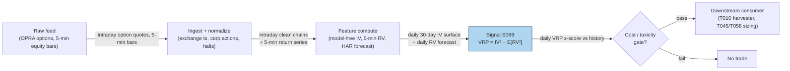

## Stage 69/200 — S069: Implied-vs-realized spread / variance risk premium

*Batch SB8 · Signal 69/100 · Provenance [D] · Family E — Volatility & Options-Informed*

### S1. One-line verdict

| | |
|---|---|
| **What it is** | The **variance risk premium** (VRP): option-implied variance minus expected realized variance — the price investors pay to insure against volatility. |
| **When it works** | At weekly-to-multi-month horizons, where index implied variance systematically exceeds subsequently realized variance on average. |
| **When it dies** | Intraday (microstructure noise dominates), and in jump/crisis episodes when realized variance overshoots implied — the insurance pays out. |
| **Build-or-buy in one line** | Build the realized-variance engine yourself; buy clean implied-variance surfaces — IV inversion (backing out implied volatility from observed option prices) is the expensive part. |

Provenance [D] (documented: Bollerslev–Tauchen–Zhou 2009; variance-swap replication literature). Family E — Volatility & Options-Informed.

### S2. How it works — plain human explanation

**Implied variance** is the market's forecast of future volatility, read off option prices. **Realized variance** is what actually happened, measured from price changes after the fact. The **variance risk premium** is the gap between them: implied minus realized. On average, for equity indices, implied exceeds realized — option sellers collect a premium for bearing volatility and crash risk, the same way insurers collect premiums for bearing fire risk.

Vignette: it's the first trading day of the month. The 30-day S&P 500 implied volatility from the options market is 16.1% annualized. Your forecast of realized volatility over the next 30 days — from a HAR (Heterogeneous Autoregressive) model on 5-minute returns — is 13.9%. The spread is +2.2 vol points, or in variance units 16.1² − 13.9² = 66 variance points. That positive gap is the market paying you to be short volatility: sell the variance, delta-hedge (continuously offsetting directional exposure as the underlying moves), and harvest the difference as realized vol comes in below implied.

Why does the premium exist? Three forces: (1) **crash aversion** — investors overpay for downside protection; (2) **rebalancing demand** — structured products and dealers are structurally short gamma (negative convexity — losses accelerate when the underlying moves) and pay up to hedge; (3) **volatility-of-volatility risk** — variance itself is volatile, and bearing that risk demands compensation. None is an arbitrage: the premium compensates a risk that periodically realizes against you (2008, 2020).

Mental model:
- VRP is an insurance premium, not a mispricing: positive on average because the insured event (a vol spike) is rare and nasty.
- The signal is *richness vs your own forecast*, not vs today's realized vol — compare implied against expected future realized over a matched horizon.
- Intraday "VRP" is mostly bid/ask bounce (prices oscillating between bid and ask) and stale quotes; the documented premium lives at weekly and longer horizons.

### S3. The math — exact formula

Let IVₜᵃⁿⁿ be the annualized implied volatility at time t for horizon T (e.g. 30 days), and Eₜ[RVₜ,ₜ₊ₜᵃⁿⁿ] the time-t forecast of annualized realized volatility over the same window.

**Variance units (canonical):**
$$\mathrm{VRP}_t = (\mathrm{IV}_t^{\mathrm{ann}})^2 - \mathbb{E}_t\big[(\mathrm{RV}_{t,T}^{\mathrm{ann}})^2\big] \quad \text{(variance points)}$$

**Volatility units (desk shorthand):**
$$\mathrm{VRP}_t^{\sigma} = \mathrm{IV}_t^{\mathrm{ann}} - \mathbb{E}_t\big[\mathrm{RV}_{t,T}^{\mathrm{ann}}\big] \quad \text{(vol points)}$$

**Ex-post (measurable after the fact):** VRPₜᵉˣ⁻ᵖᵒˢᵗ = (IVₜᵃⁿⁿ)² − (RVₜ,ₜ₊ₜᵃⁿⁿ)², with realized variance computed from 5-minute log returns: RV = 252 × Σᵢ rᵢ², annualized in percent.

**Implied variance (model-free, per the Federal Reserve Board definition used in the literature):**
$$\mathrm{IV}_t^{\mathrm{ann}} = \frac{2e^{rT}}{T}\left[\sum_{K_i<K_0}\frac{\Delta K_i}{K_i^2}P(K_i) + \sum_{K_i>K_0}\frac{\Delta K_i}{K_i^2}C(K_i)\right] - \frac{1}{T}\left(\frac{F_t}{K_0}-1\right)^2$$
with T in years, r the continuous risk-free rate, Fₜ the forward price, K₀ the first strike at or below Fₜ, and ΔKᵢ strike spacing. Two practical rules: interpolate **total variance** w(K,T) = σᵢᵥ²(K,T)·T across maturities — never raw vol — and interpolate across strikes in log-moneyness k = ln(K/F).

> **Flag (garbled render, do NOT code as confirmed):** one source line rendered the volatility-points analog as IVolₜ − √(RVₜ,ₜ₊ₜᵃⁿⁿ) — the page render was ambiguous about whether the square root applies. Re-confirm from a canonical source before coding the vol-points variant; the variance-points form above is the verified one.

| Parameter | Symbol | Typical range | Too small | Too large | Default (example — not an institutional standard) |
|---|---|---|---|---|---|
| Horizon | T | 7–90 days | microstructure noise | stale, overlapping windows | 30 calendar days |
| RV sampling | Δ | 1–15 min | noise-dominated | misses intraday jumps | 5-min log returns |
| Forecast | E[RV] | HAR / GARCH / lagged RV | jump-contaminated | model risk | HAR on 5-min RV |
| Entry z-score | z | 1.0–2.5σ vs history | overtrading | never trades | z > 1.5 (example) |

Normalization: z-score VRP against its trailing 6–12 month history (it is strongly regime-dependent); raw VRP is meaningless across regimes. Timing: compute at close *t* from options ≤ *t* and RV forecasts ≤ *t*; tradable no earlier than *t+1*.

Variants: (1) **variance-swap VRP** — IV² from the model-free strip vs HAR forecast, traded with variance swaps; (2) **vol-points VRP** — IV − RV for straddle (call + put at the same strike)-based trading (see flag above); (3) **forward VRP** — forward-starting implied variance vs forward realized forecast, isolating specific windows (e.g. around FOMC — Federal Open Market Committee).

### S4. Worked example — step-by-step numbers (SYNTHETIC)

Synthetic 12-month tape (seed **69**): IVᵃⁿⁿ = 30-day implied vol at month start; RVᵃⁿⁿ = realized vol over the matched 30-day window. The chart `images/S069_example.png` plots exactly these numbers.

| Month | IVᵃⁿⁿ (%) | RVᵃⁿⁿ (%) | VRP (vol pts) | VRP (variance pts) |
|---|---|---|---|---|
| 1 | 15.2 | 12.4 | +2.8 | +77 |
| 2 | 16.1 | 13.9 | +2.2 | +66 |
| 3 | 14.8 | 11.7 | +3.1 | +82 |
| 4 | 17.3 | 14.2 | +3.1 | +98 |
| 5 | 28.6 | 34.1 | −5.5 | −345 |
| 6 | 19.4 | 15.3 | +4.1 | +142 |
| 7 | 16.9 | 13.1 | +3.8 | +114 |
| 8 | 15.8 | 12.0 | +3.8 | +106 |
| 9 | 24.7 | 27.8 | −3.1 | −163 |
| 10 | 18.2 | 14.9 | +3.3 | +109 |
| 11 | 15.5 | 12.8 | +2.7 | +76 |
| 12 | 16.4 | 13.5 | +2.9 | +87 |

Step-by-step (month 1): VRP in vol points = 15.2 − 12.4 = **+2.8**; in variance points = 15.2² − 12.4² = 231.04 − 153.76 = **+77** — implied was rich vs what realized. Month 5 (stress): 28.6 − 34.1 = **−5.5** vol points; 28.6² − 34.1² = **−345** variance points — realized overshot implied and short-vol would have lost. Mean VRP over the 12 months is positive in both units, but the two negative months show the tail risk.

What to notice: the premium is *lumpy* — ten calm months of +2 to +4 vol points, two stress months of −3 to −5.5. This is why the academic evidence is strongest at weekly-to-multi-month horizons: the premium is a statistical property of many months, invisible in any single day, and intraday "VRP" is dominated by bid/ask bounce and non-synchronous prices (options and underlying printed at different timestamps) — a market-state feature, not the established premium. This toy example has no trading costs; a real short-vol position pays the full option bid/ask (see S070's 20%/2% arithmetic).

### S5. Strategies that use this signal

- **T010 — Variance-Risk-Premium Harvester (primary entry trigger):** delta-hedged short-vol positions when implied variance is rich vs the HAR forecast — this signal is the trade.
- **T045 — VIX Term-Structure Carry (regime context):** uses the VRP level to scale curve-carry sizing — richer premium, larger carry allocation.
- **T046 — Straddle-Implied Move Fade (filter):** requires the VRP to be positive before fading event straddles (never short rich-looking premium into a negative-VRP regime).
- **T058 — Dispersion Trader (sizing input):** index-vs-single-stock VRP gap scales the dispersion book's short-index-vol leg.

### S6. Data required — exact spec

| Field | Type | Granularity | Source tier | Notes |
|---|---|---|---|---|
| Options quotes (full chain) | bid/ask, volume, OI (open interest) | intraday snapshots / EOD (end-of-day) | Tier 1–2 | OPRA (Options Price Reporting Authority, the consolidated US options tape) via Databento/Cboe LiveVol; Tier 0 Cboe delayed for prototyping |
| 30-day IV surface | float (%) | daily | Tier 1–2 | Vendor surfaces $200–5,000/mo (indicative) |
| Underlying 5-min bars | OHLCV (open/high/low/close/volume) | 5-min | Tier 0–1 | For RV computation; 1-min bars cheaper than options data |
| Risk-free / dividend curves | float | daily | Tier 0 | FRED (Federal Reserve Economic Data); needed for forward Fₜ and IV inversion |

Ingest sketch (Python/polars, ≤20 lines):

```python
import polars as pl, numpy as np
def monthly_vrp(iv_surface: pl.DataFrame, bars5m: pl.DataFrame) -> pl.DataFrame:
    # iv_surface: date, expiry, strike, iv ; bars5m: ts, close
    r = np.log(bars5m["close"][1:] / bars5m["close"][:-1])
    rv = (252 * (r ** 2).sum()) ** 0.5 * 100          # annualized realized vol %
    iv30 = iv_surface.filter(pl.col("days_to_expiry").is_between(28, 32))["iv"].mean()
    return pl.DataFrame({"iv_ann": [iv30], "rv_ann": [rv],
                         "vrp_vol": [iv30 - rv], "vrp_var": [iv30**2 - rv**2]})
```

Storage per symbol-day (per `notes/cost-model.md` §4): 5-min equity bars are trivial (~0.1 MB/day/symbol at 1-min); options snapshots dominate — an SPX full-chain snapshot runs ~100–300 MB in RAM, ~1–3 GB/day on disk as parquet. Keep live working set under the ~77GB budget (cost-model §3): snapshots for a handful of underlyings fit; full OPRA history does not — use per-underlying daily files.

Data-quality checklist: timestamp normalization (options vs equity clocks), corporate actions on the underlying, halts (stale IV prints), DST/half-days, stale quotes (zero-bid chains must be excluded from the model-free sum), American-exercise (early-exercise-allowed) conventions for single names.

### S7. Local build on M5 Max / 128GB

**Feasibility: feasible (Tier M).** Per cost-model §2, numpy vectorized math runs ~50–200M elements/sec; the expensive ops are quote normalization and IV inversion across the chain, not the VRP arithmetic. A 30-day HAR forecast on 5-min bars is milliseconds; inverting a full SPX chain snapshot (a few thousand contracts) is seconds in vectorized numpy. Plan §6 places vol estimators (S063–S070) in Tier M: **20–60 h ≈ $3,000–9,000 at $150/hr loaded-cost estimate**, plus IV-surface data $200–5,000/mo or OPRA research access (indicative — verify before budgeting).

RAM: one SPX snapshot 20–100 MB practical; a rolling year of daily snapshots fits comfortably in the 77GB budget; 60 days of 5-min bars for 500 symbols ≈ 195k bars/day ≈ megabytes. Bottleneck: **IV inversion + surface fitting**, then historical joins. Stack: Python + polars/numpy (default), DuckDB for the research archive, Rust only if you push to full-OPRA tick processing. What breaks first at 500 symbols or full OPRA: the options side — per cost-model §3/§4, full OPRA snapshots run 1–3 GB/day for SPX-like underlyings; selective underlyings only, or you drown in storage.

### S8. Buy vs build

| Option | What you get | Indicative price | Buying gains | Buying loses |
|---|---|---|---|---|
| Tier-0 free (Cboe delayed, Stooq, FRED) | Delayed IV, daily bars, rates | ~$0 | Zero cost; fine for monthly VRP research | No intraday, coarse chains |
| Tier-1 retail (Polygon Options, Alpaca) | Queryable chains, 1-min bars | ~$30–200/mo | Cheap prototyping of the full pipeline | Incomplete chains, rate limits, inconsistent OI |
| Tier-2 professional (Databento OPRA research, Cboe LiveVol, IV surfaces) | Normalized chains, Greeks (delta, gamma, vega, theta, rho), history | ~$200–5,000/mo | Research-grade IV without building inversion | Still need your own RV forecasts and backtests |
| Tier-3 academic/institutional (OptionMetrics IvyDB; full OPRA) | Publication-quality options history | ~$thousands/yr academic; institutional $$$$ | The dataset the papers used | Cost; redistribution limits |

Verdict: **hybrid — buy the normalized chain/IV surface, build the RV engine and the VRP analytics.** The crossover: buy Tier-2 the moment you need historical chains for a real backtest (rebuilding a decade of IV surfaces from raw quotes is a 200–500 h job per the chatbot's IV-inversion component — labeled chatbot lead, cost-model takes precedence); build everything if you only need index-level monthly VRP, where delayed Cboe data suffices. All prices indicative — verify before budgeting.

### S9. Success ratio / efficacy — documented evidence

| Study / source | Market & period | Metric | Before/after cost | Caveat |
|---|---|---|---|---|
| Bollerslev, Tauchen & Zhou (2009), *Review of Financial Studies* 22:4463–4492 | US equities, 1990–2008 | VRP predicts excess returns; predictability strongest at the **intermediate 3-month horizon**, dominating P/E (price–earnings ratio), default spread (corporate yield minus Treasury yield), CAY (consumption–wealth ratio) | Before-cost (predictive regressions) | Return predictability, not a traded short-vol P&L; horizon is months |
| FRB (Federal Reserve Board), "The Variance Risk Premium Around the World" (IFDP — International Finance Discussion Papers — 1035) | US + international, 1990–2008 | VRP large, time-varying (mean ~18 variance pts in the US sample), predicts returns internationally | Before-cost | Confirms pervasiveness; no execution costs modeled |
| Practitioner variance-swap desk literature | Equity indices, 2000s–2020s | Systematic short variance earns positive average carry punctuated by large drawdowns (2008, 2020) | Before-cost in most published accounts | After-cost numbers exist only in institutional marketing; treat as unverified |

Honest horizon note (mandatory): the strongest documented evidence is at weekly → monthly → multi-month horizons — **not intraday**. Honest bottom line: **as a standalone swing factor the VRP is one of the most robust findings in the vol literature; as an intraday trigger it is a different, much weaker animal.**

### S10. Failure modes & pitfalls

- **Lookahead leakage:** using settlement IV or corrected OI from after the signal timestamp — pin the actual chain vintage at time *t*.
- **Staleness/latency:** stale zero-bid quotes poison the model-free sum — exclude them per the Cboe selection rule.
- **Crowding/alpha decay:** short-VRP is the most crowded vol trade in existence; persistent vol trends compress the premium for years.
- **Cost blowup:** shorting variance means paying the option spread twice (entry/exit) plus delta-hedging costs — see the S070 arithmetic (20% of premium on cheap options). Fees: per-contract commissions and exchange/clearing fees on *both* the option leg and the delta-hedge legs — e.g. ~$0.65/contract plus ~$1–3 per hedge-leg execution at retail (indicative — verify before budgeting). Impact/slippage: entering short-vol in size moves the implied level against you (the trade itself depresses IV), and stress exits gap beyond the quoted spread — model the full round-trip spread plus a slippage haircut of 25–100% of the spread in stress.
- **Regime breaks:** earnings/CPI (Consumer Price Index)/FOMC jumps, vol panics, and equity-risk-premium shifts flip the sign — never size short-vol without a jump filter (S064).
- **Overfitting/parameter mining:** horizon (7 vs 30 vs 90 days) and RV estimator choice move results; pre-commit to matched horizons.
- **Microstructure confusion:** intraday VRP wiggles from non-sync prices and auction effects are not tradeable premium — enforce the horizon floor.

### S11. Visuals




### S12. Sources

- Bollerslev, T., Tauchen, G., Zhou, H. (2009). "Expected Stock Returns and Variance Risk Premia." *Review of Financial Studies*, 22:4463–4492. (FEDS 2007-11 working version, Federal Reserve Board.)
- Federal Reserve Board — "The Variance Risk Premium Around the World." International Finance Discussion Papers 1035. https://www.Federalreserve.gov/pubs/ifdp/2011/1035/ifdp1035.htm
- Federal Reserve Board — "Expected Stock Returns and Variance Risk Premia" (Finance and Economics Discussion Series; model-free implied variance definition). Referenced via https://www.federalreserve.gov/Pubs/feds/2011/201145/201145pap.pdf (bibliography entry for BTZ 2009/2007).
- Demeterfi, K., Derman, E., Kamal, M., Zou, J. (1999). "More Than You Ever Wanted To Know About Volatility Swaps." Goldman Sachs. https://www.realvol.com/volatilityblog/?p=516
- NBER Working Paper 16884 — "Simple Variance Swaps" (variance-swap replication from option strips). https://www.nber.org/system/files/working_papers/w16884/w16884.pdf

**Chatbot material (labeled, per question-bank protocol):**
- Duck.ai (GPT-5.6 Luna, anonymous, 2026-09-10) answered Q-SB8-1–Q-SB8-3. The variance-points and vol-points VRP formulas and the model-free implied-variance definition (Q-SB8-1 #3, attributed to the Federal Reserve Board) are chatbot research leads — the variance-points formula is verified in-chapter and cross-checked against the cited papers; the vol-points square-root render was garbled (flagged in S3, do NOT code as confirmed). IV-inversion build-cost components are labeled chatbot leads (the cost-model bands take precedence). Source log: "Duck.ai answered Q-SB8-1–Q-SB8-3 (2026-09-10); Grok/Cursor answers pending (checked 2026-09-10)."

**Unverified leads:** the volatility-points VRP line rendered ambiguously on the square root (flagged in S3 — re-confirm before coding); "Exploring the Variance Risk Premium Across Assets" (afajof.org) was cited by the chatbot but no checkable URL was verified; any specific after-cost Sharpe for traded VRP strategies is an unverified chatbot claim.
