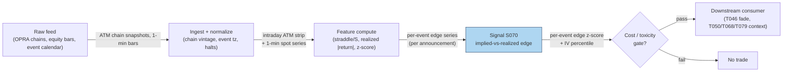

## Stage 70/200 — S070: Straddle-implied move vs realized

*Batch SB8 · Signal 70/100 · Provenance [SR] · Family E — Volatility & Options-Informed*

### S1. One-line verdict

| | |
|---|---|
| **What it is** | The **at-the-money straddle price** (call + put at the same strike) read as the market's expected move; fade the event when realized moves systematically under- or over-shoot it. |
| **When it works** | Around scheduled events (earnings, CPI — Consumer Price Index — , FOMC — Federal Open Market Committee — ) where implied volatility is systematically elevated pre-announcement and realized moves come in below implied *on average*. |
| **When it dies** | Genuine information shocks (guidance changes, macro overlap), crowded short-vol positioning, and illiquid chains where the "implied move" is a stale midpoint. |
| **Build-or-buy in one line** | Build the comparator yourself on bought chains — the formula is a desk standard; the edge is in execution and selection, not the math. |

Provenance [SR] — standard desk reconstruction: the trading rule (fade realized vs straddle-implied moves) is practitioner-standard, but no single canonical published formula was verified, so the tag stays [SR] and is not upgraded. Family E — Volatility & Options-Informed.

### S2. How it works — plain human explanation

A **straddle** is buying (or selling) a call and a put at the same strike and expiry — a bet that pays off if the stock moves a lot in either direction. An **at-the-money (ATM)** straddle — strike near the current stock price — is the market's cleanest statement of how big a move it expects: divide the straddle's price by the stock price and you get the **implied move** in percent. If a $100 stock's ATM straddle costs $6.20, the market is pricing roughly a ±6.2% move.

Vignette: 3:58 PM, the day before earnings. XYZ closes at $100. The ATM straddle expiring Friday trades at $6.20 bid / $6.60 ask — implied move ≈ 6.4% at mid (the midpoint between bid and ask). Your database of XYZ's last 12 earnings shows an average absolute move of 4.1%. The market is charging for 6.4% and history delivered 4.1%: the straddle looks rich, so you sell it (the "fade"). After the announcement XYZ moves 3.8% — below the implied 6.4% — and the straddle collapses to $4.10. You buy it back: gross profit ≈ $2.30 per share pair before costs. The well-known **IV crush** — implied volatility falling sharply once the event passes — is the same phenomenon seen through the vol lens: pre-event IV is elevated, post-event it falls, and the realized move often lands below what was priced.

Why should this work *on average*? Event implied vol embeds a risk premium (S069's VRP concentrated into one day): market makers charge extra for taking event risk, and hedgers overpay for certainty into the print (the announcement release). But it is emphatically not universal — "fade every straddle" is a losing rule. The edge is conditional: broad liquid samples, high IV percentile into the event, no overlapping macro catalyst, and execution at real bid/ask.

Mental model:
- The straddle price is a consensus forecast of the event move, plus an insurance markup.
- You are not predicting the event's direction — you are betting the markup exceeds the surprise.
- The P&L (profit and loss) is decided in dollars after the spread, not in vol points: a 60% hit rate with 20% round-trip costs can still lose money.

### S3. The math — exact formula

**Implied move** (standard desk reconstruction — [SR]):
$$\text{ImpliedMove} = \frac{C_{\mathrm{ATM}} + P_{\mathrm{ATM}}}{S}$$
where C_ATM, P_ATM are the at-the-money call and put prices for the expiry covering the event (dollars), and S is the underlying price (dollars). Result is a fraction; ×100 for percent. (A forward-consistent variant divides by the forward F instead of S.)

**Signal:** compare against the subsequent realized move M_realized = |S_after − S_before|/S_before (or high-frequency realized vol over the event window):
$$\text{edge}_t = \text{ImpliedMove}_t - M_{\text{realized},t}, \qquad z_t = \frac{\text{edge}_t - \mu_L}{\sigma_L}$$
with μ_L, σ_L the trailing-L-event mean and standard deviation of the edge. Fade (sell straddle) when z_t is large positive; the reverse (buy realized / long straddle) when implied looks cheap vs history.

| Parameter | Symbol | Typical range | Too small | Too large | Default (example — not an institutional standard) |
|---|---|---|---|---|---|
| Event window | — | 1–3 days | misses drift | dilutes the event | announcement ± 1 day |
| History lookback | L | 8–20 events | noisy z-score | regime-stale | 12 events |
| Fade threshold | z* | 0.5–2.0σ | overtrading | no trades | z > 1.0 (example) |
| IV percentile gate | — | 50th–90th pct | thin edge | no trades | > 70th pct (example) |

Normalization: z-score the edge vs the name's own event history — a 6% implied move is rich for a utility and cheap for a biotech. Timing: compute from the chain snapshot *before* the event close; the position is opened pre-announcement and the realized move is measured after — strictly causal, no lookahead, but the signal only resolves at *t+1* (post-print).

Variants: (1) **straddle/forward** — divide by F for rate-sensitive underlyings; (2) **ex-event IV** — strip the event premium from the term structure (à la ORATS) and compare residual richness; (3) **post-announcement vol fade** — the T079 variant: sell vol *after* realization when IV stays bid.

### S4. Worked example — step-by-step numbers (SYNTHETIC)

Synthetic 10-event tape (seed **70**), fictional tickers E1–E10. Implied move = ATM straddle mid / stock price; realized move = |post-earnings return|. The chart `images/S070_example.png` plots exactly these numbers.

| Event | Implied move (%) | Realized move (%) | Fade wins? (realized < implied) |
|---|---|---|---|
| E1 | 6.2 | 3.8 | yes |
| E2 | 8.5 | 9.7 | no |
| E3 | 4.1 | 5.2 | no |
| E4 | 11.0 | 7.9 | yes |
| E5 | 5.4 | 2.9 | yes |
| E6 | 9.8 | 13.1 | no |
| E7 | 3.6 | 2.2 | yes |
| E8 | 12.4 | 10.6 | yes |
| E9 | 7.1 | 4.4 | yes |
| E10 | 5.9 | 6.8 | no |

Hit rate = 6/10 = **60% (SYNTHETIC — not a real backtest)**. Step-by-step (E1): edge = 6.2 − 3.8 = **+2.4 percentage points** in the seller's favor. Dollar walk on a $100 stock: straddle mid = $6.20; sell the fade at the bid ≈ $6.00. Post-event the stock moves 3.8%; buy the straddle back at the ask ≈ $4.00. Gross P&L ≈ 6.00 − 4.00 = **+$2.00 per straddle before commissions**. E2 (the loss): sell at ≈ $8.30, stock moves 9.7%, buy back ≈ $9.90 → **−$1.60**.

After-cost arithmetic (verified): a $0.40 option with a $0.08 spread costs 2 × $0.04 = **$0.08 = 20% of premium** per round trip; a $5.00 option with a $0.10 spread costs 2 × $0.05 = **$0.10 = 2% of premium**. Cheap far-wing event options live in the 20% world; liquid ATM straddles in the 2% world. "Event-vol strategies must be evaluated in dollar P&L, not vol points or hit rate %": a 60% hit rate with small average edge is erased by a 5–10% option round trip.

What to notice: even in this friendly toy tape, 4 of 10 events lose — E2, E3, E6, E10 are the genuine-shock cases where realized exceeded implied. The example has no partial fills, no early assignment (the option buyer exercising before expiry), no macro overlap, and uses mid-based implied moves; a real backtest must execute both legs at bid/ask and report the worst decile alongside the mean.

### S5. Strategies that use this signal

- **T046 — Straddle-Implied Move Fade (primary entry trigger):** fades overpriced event moves, confirmed by unusual-options-activity (S073) and gated by the VRP level (S069).
- **T050 — GEX Pin / Dealer-Positioning Fade (context input):** uses the implied move to size pinning fades into expiry — the expected-move radius sets the fade zone.
- **T068 — Scheduled-Event Vol Expansion (veto/positioning):** goes the other way pre-event when the implied move is *cheap* vs history; S070's edge series is the pricing input.
- **T079 — Post-Announcement Vol Fade (downstream leg):** sells event volatility after realization is known — S070 identifies the candidates, T079 times the exit.

### S6. Data required — exact spec

| Field | Type | Granularity | Source tier | Notes |
|---|---|---|---|---|
| Options quotes (ATM chain) | bid/ask | intraday snapshots / EOD (end-of-day) | Tier 1–2 | OPRA (Options Price Reporting Authority, the consolidated US options tape) via Databento/Cboe LiveVol; delayed Cboe for prototyping |
| Underlying price | float ($) | 1-min / daily | Tier 0–1 | For implied-move denominator and realized move |
| Earnings/macro calendar | dates | daily | Tier 0–1 | SEC (Securities and Exchange Commission) EDGAR (Electronic Data Gathering, Analysis, and Retrieval), vendor calendars |
| Historical event moves | float (%) | per event | Tier 1–2 | Built from bars; vendor series available |

Ingest sketch (Python/polars, ≤20 lines):

```python
import polars as pl
def implied_move(chain: pl.DataFrame, spot: float) -> pl.DataFrame:
    # chain: ts, expiry, strike, cp, bid, ask ; spot: underlying price
    atm = (chain.with_columns(mid=(pl.col("bid") + pl.col("ask")) / 2,
                             dist=(pl.col("strike") - spot).abs())
                .sort("dist").head(2))  # nearest call + put
    straddle = atm["mid"].sum()
    return pl.DataFrame({"ts": [chain["ts"][0]], "spot": [spot],
                         "straddle_mid": [straddle],
                         "implied_move": [straddle / spot]})
```

Storage per symbol-day (per `notes/cost-model.md` §4): ATM-chain snapshots are small — a few MB/day per name for the strikes near the money; the full-chain archive is what costs (1–3 GB/day SPX-like). For event studies, store only the ATM strip + spot series: trivial.

Data-quality checklist: snapshot the *actual* chain at the signal timestamp (no closing-chain lookahead), remove stale quotes, handle early close/half-days, corporate actions shifting strikes, American-exercise (early-exercise-allowed) premium on single names.

### S7. Local build on M5 Max / 128GB

**Feasibility: feasible (Tier M, low end).** The signal is arithmetic on a handful of quotes per event. Per cost-model §2, even a pure-Python loop handles this universe; polars does it in milliseconds. RAM: a decade of ATM-strip snapshots for 500 names is a few GB — far under the ~77GB working budget (cost-model §3).

Engineering band: Tier M per cost-model §5 (vol estimators), low end — **~20–40 h ≈ $3,000–6,000 at $150/hr loaded-cost estimate**, plus chain data $200–2,000/mo for a research-grade OPRA slice (indicative — verify before budgeting). Bottleneck: **event-study hygiene** (calendar alignment, chain vintages, bid/ask execution), not compute. Stack: Python + polars + DuckDB. What breaks first at 500 symbols or full OPRA: nothing in the signal — but a production scanner across all names × all events needs the full real-time chain (Tier C OPRA $2,000–20,000+/mo, indicative), which is a data cost, not a compute wall.

### S8. Buy vs build

| Option | What you get | Indicative price | Buying gains | Buying loses |
|---|---|---|---|---|
| Tier-0 free (Cboe delayed, EDGAR calendars) | Delayed chains, event dates | ~$0 | Zero cost; fine for EOD event studies | No intraday timing, coarse bid/ask |
| Tier-1 retail (Polygon Options, Cboe delayed products) | Queryable chains, Greeks (delta, gamma, vega, theta, rho) | ~$0–200/mo | Cheap full pipeline prototype | Incomplete expiries, rate limits |
| Tier-2 professional (Databento OPRA research, LiveVol) | Full historical chains, bid/ask history | ~$200–2,000/mo | Realistic backtest with executable quotes | Still need your own event-study code |
| Tier-3 institutional (OptionMetrics IvyDB; Cboe implied-earnings-move data) | Publication-quality history; vendor implied-move series | ~$thousands/yr academic; institutional $$$$ | The dataset papers use; Cboe's own implied-move spec exists | Cost; may not cover your exact event set |

Verdict: **build the comparator, buy the chains.** The formula is a one-liner; the work is the event calendar, chain vintages, and bid/ask-aware backtesting. Crossover: buy Tier-2 the day you backtest seriously — midpoint-based event studies on free data systematically overstate the edge (the spread *is* the edge in the 20%-of-premium world). All prices indicative — verify before budgeting.

### S9. Success ratio / efficacy — documented evidence

| Study / source | Market & period | Metric | Before/after cost | Caveat |
|---|---|---|---|---|
| Journal of Risk — "Earnings moves and pre-earnings implied volatility" | Listed US stocks, 3 calendar years | Options market predicts the *magnitude* of earnings moves well in most cases, with significant outliers; return distribution symmetric | Before-cost (forecast accuracy, not traded P&L) | Describes pricing accuracy, not a fade strategy's P&L |
| ORATS methodology (LULU example, 8/2018) | Single name, last 12 earnings | Implied earnings move 10.93% vs average actual move 11.698% | Before-cost (practitioner measurement) | One name, one window — illustrative, not a statistical claim |
| Nasdaq practitioner literature (IV-crush explainers) | US equity options | IV systematically elevated pre-announcement, collapses after; straddle sellers profit when realized < implied | Before-cost (educational) | No hit rates or P&L reported |

Honest bottom line (mandatory framing): IV is elevated pre-announcement and falls after; realized moves come in below implied **on average — not universally**. Published-style hit rates in the **mid-50s to low-60s** for broad liquid samples are a chatbot lead (unverified — see Unverified leads), and a 60% hit rate is not automatically attractive: a 5–10% option round trip can erase a small average edge. **As a standalone trigger this is a modest, cost-sensitive edge; as a conditional event filter (high IV percentile, liquid chains, no macro overlap) it is a documented and usable one.** Evaluate in dollar P&L.

### S10. Failure modes & pitfalls

- **Lookahead leakage:** using the post-event chain or corrected prints to price the pre-event straddle — pin the snapshot vintage.
- **Staleness/latency:** illiquid chains show midpoint "implied moves" that no one can trade — require two-sided quotes with size.
- **Crowding/alpha decay:** the earnings fade is textbook; crowded shorts get carried out on genuine beats — condition on IV percentile, not habit.
- **Cost blowup:** the 20%-of-premium arithmetic above — cheap wings are untradeable after costs; model both legs at bid/ask plus fees (per-contract commissions and exchange/clearing fees, e.g. ~$0.65/contract/side at retail — indicative, verify before budgeting). Impact/slippage: pre-event straddle bid/ask widens as the event approaches and liquidity providers pull quotes — expect to cross 1.5–2× the normal spread on entry, and a large fade moves the mid against you on exit; model explicit slippage of 10–50% of the spread per leg rather than assuming mid fills.
- **Regime breaks:** macro overlap (CPI on earnings day), guidance shocks, sector-wide repricing — exclude or separately model overlapping events.
- **Overfitting/parameter mining:** z-thresholds and lookbacks tuned on a handful of events per name — pool across names or accept wide error bars.
- **Data errors:** wrong expiry (weekly vs monthly), early-close calendars, special dividends shifting the straddle.
- **Microstructure confusion:** the straddle mid moves with the underlying into the print — measure the move consistently or delta-hedge (continuously offset directional exposure as the underlying moves).

### S11. Visuals




### S12. Sources

- "Earnings moves and pre-earnings implied volatility." *Journal of Risk*. https://www.risk.net/journal-of-risk/7960706/earnings-moves-and-pre-earnings-implied-volatility
- Nasdaq — "Understanding Earnings Crush Implied Volatility." https://www.nasdaq.com/articles/understanding-earnings-crush-implied-volatility
- Nasdaq — "What an Implied Volatility Crush is and How to Avoid It." https://www.nasdaq.com/articles/what-an-implied-volatility-crush-is-and-how-to-avoid-it-2021-07-09
- ORATS — "How ORATS Removes Earnings Effect from Implied Volatility." https://orats.com/blog/how-orats-removes-earnings-effect-from-implied-volatility
- Cboe DataShop — "Implied Earnings Move Specification" (vendor implied-move methodology). https://datashop.cboe.com/documents/ft_products/ImpliedEarningsMove_Specifications.pdf

**Chatbot material (labeled, per question-bank protocol):**
- Duck.ai (GPT-5.6 Luna, anonymous, 2026-09-10) answered Q-SB8-1–Q-SB8-3. The straddle-implied-vs-realized framing (Q-SB8-3 #2), the per-round-trip spread arithmetic ($0.40/$0.08 = 20%, $5.00/$0.10 = 2%), and the "evaluate in dollar P&L" guidance are chatbot research leads — the arithmetic is operator-verified in S4; the mid-50s–low-60s hit-rate band (tradingview.com) is cited as an *unverified* chatbot lead, never as a published finding. Source log: "Duck.ai answered Q-SB8-1–Q-SB8-3 (2026-09-10); Grok/Cursor answers pending (checked 2026-09-10)."

**Unverified leads:** published hit rates in the mid-50s–low-60s for broad liquid samples (chatbot lead, tradingview.com — not independently verified); any specific after-cost Sharpe ratio (mean excess return ÷ volatility) for straddle-fade strategies is an unverified chatbot claim. The [SR] formula itself is a standard desk reconstruction, not a cited paper.
