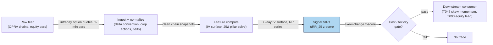

## Stage 71/200 — S071: 25-delta risk reversal / skew change

*Batch SB8 · Signal 71/100 · Provenance [D] · Family E — Volatility & Options-Informed*

### S1. One-line verdict

| | |
|---|---|
| **What it is** | The **25-delta risk reversal**: the implied-volatility gap between a 25-delta call and a 25-delta put — a real-time gauge of crash fear vs upside chase. |
| **When it works** | As a regime/tail-risk feature: sudden steepening of put skew flags institutional hedging demand hours to days before downside episodes. |
| **When it dies** | Thin/illiquid chains (the 25Δ points are noise), expiry weeks (skew deforms), and calm grinds where skew mean-reverts without any equity follow-through. |
| **Build-or-buy in one line** | Buy clean intraday IV surfaces; build the delta-solver and the change-detection — the quoting conventions are the trap, not the arithmetic. |

Provenance [D] (documented: FX-options market convention — Malz; Reiswich–Wystup; equity analog in Bakshi–Kapadia–Madan skew literature). Family E — Volatility & Options-Informed.

### S2. How it works — plain human explanation

**Implied volatility (IV)** is the volatility number that makes an option-pricing formula reproduce the market price. Plot IV against strike and you get the **volatility smile** (or, for equities, the **smirk/skew**: IV much higher for downside puts than upside calls). **Delta** measures how much an option's price moves when the underlying moves $1 — a 25-delta (25Δ) put is an out-of-the-money put whose price moves about $0.25 per $1 drop in the stock.

A **risk reversal** (RR) is the IV of the 25Δ call minus the IV of the 25Δ put (FX market convention). If downside puts trade at 26.5% IV while equidistant upside calls trade at 16.9%, the risk reversal is 16.9 − 26.5 = −9.6 vol points: puts are much richer — the market is paying up for crash protection. Equity desks often flip the sign (put − call, so positive = fear); always state your convention. The **butterfly** — IV(call) + IV(put) − 2·IV(ATM) — measures the smile's curvature (kurtosis pricing) separately from its tilt.

Vignette: 10:15 AM. The S&P is flat, but your skew monitor flashes: the 30-day 25Δ put IV just jumped from 24.5% to 26.5% while the 25Δ call IV didn't move. The risk reversal dropped two vol points in an hour. Nobody panicked in the stock — yet — but somebody with size just paid up for downside protection. That *change* in skew, z-scored against its history, is the S071 signal.

Why should it work? Skew steepening reflects **informed hedging demand**: institutions buy puts before known risks and before portfolio de-risking. The options market aggregates that demand faster than the equity market aggregates the selling — hence "options-to-equity lead" (T093). The effect is a *change* signal: the level of skew is a permanent feature of equity markets; its sudden shifts carry the information.

Mental model:
- The risk reversal prices the market's fear asymmetry: rich puts = someone is scared, rich calls = someone is chasing.
- Trade the *change* in skew, not the level — level is a permanent risk premium; change is news.
- Always name the delta convention (spot/forward/premium-adjusted) — the same "25Δ" can mean three different strikes.

### S3. The math — exact formula

**25-delta risk reversal (FX/desk convention, verified):**
$$\mathrm{RR}_{25} = \sigma_{\mathrm{IV}}^{\mathrm{call},\,25\Delta} - \sigma_{\mathrm{IV}}^{\mathrm{put},\,25\Delta}$$
Negative = downside puts richer (crash fear); positive = upside calls richer. Equity desks frequently quote the flip, σ(put) − σ(call), so that positive = fear — state the sign convention explicitly.

**Black–Scholes deltas with dividend yield q (verified):**
$$\Delta_C = e^{-qT}N(d_1), \qquad \Delta_P = e^{-qT}\,[N(d_1)-1], \qquad d_1 = \frac{\ln(S/K) + (r-q+\tfrac{1}{2}\sigma^2)T}{\sigma\sqrt{T}}$$
The 25Δ call strike K_C solves Δ_C(K_C) = +0.25; the 25Δ put strike K_P solves Δ_P(K_P) = −0.25 (numerical root search). For futures options use the Black-76 forward-delta convention — keep it consistent.

**Butterfly (smile curvature):**
$$\mathrm{BF}_{25} = \sigma_{\mathrm{IV}}^{\mathrm{call},\,25\Delta} + \sigma_{\mathrm{IV}}^{\mathrm{put},\,25\Delta} - 2\,\sigma_{\mathrm{IV}}^{\mathrm{ATM}}$$

**Smile-construction quote convention** (simple-smile convention): σ_call = σ_ATM + σ_BF + ½σ_RR, σ_put = σ_ATM + σ_BF − ½σ_RR (the broker convention needs a numerical solver).

Two implementation rules: interpolate **total variance** w(K,T) = σᵢᵥ²(K,T)·T across maturities — never raw vol — and across strikes interpolate in log-moneyness k = ln(K/F).

> **Flag (garbled render, do NOT code as confirmed):** the chatbot's practical note gave the 25Δ strike-matching tolerance as "±0.5 to ±1.0 delta points," but the render was partially garbled. Re-confirm the tolerance from a canonical source (Reiswich–Wystup) before coding the root-search stopping rule.

| Parameter | Symbol | Typical range | Too small | Too large | Default (example — not an institutional standard) |
|---|---|---|---|---|---|
| Delta pillar | — | 10Δ / 15Δ / 25Δ | noisy wings | insensitive | 25Δ |
| Expiry | T | 1 week – 3 months | expiry noise | stale macro view | 30 days |
| Change lookback | — | 1 hour – 5 days | microstructure | signal decayed | 1 day vs 20-day median |
| Shock threshold | z* | 1.0–3.0σ | false alarms | misses hedging waves | z > 2.0 (example) |

Normalization: z-score the *change* in RR against its trailing 20–60 day history of changes; raw RR level is regime-biased. Timing: compute on each IV-surface snapshot using quotes ≤ *t*; equity response is expected over hours–days, so entries at *t+1* are fine.

Variants: (1) **10Δ RR** — deeper wings, more tail-sensitive, noisier; (2) **25Δ butterfly momentum** — curvature change as a vol-of-vol signal; (3) **RR z-score vs ATM** — skew steepening relative to the vol level, so a vol spike alone doesn't fake a signal.

### S4. Worked example — step-by-step numbers (SYNTHETIC)

Synthetic 30-day equity skew (seed **71**), S = 100, T = 30 days, q = 1.5%. BS deltas are illustrative example inputs for this expiry (puts below spot, calls above). The chart `images/S071_example.png` plots exactly these IV points with the 25Δ markers.

| Moneyness K/S | IV (%) | BS delta | Marker |
|---|---|---|---|
| 0.80 | 34.0 | −0.08 | |
| 0.85 | 30.0 | −0.15 | |
| 0.90 | 26.5 | −0.25 | 25Δ put |
| 0.95 | 22.0 | −0.40 | |
| 1.00 | 19.5 | +0.50 | ATM |
| 1.05 | 17.8 | +0.38 | |
| 1.10 | 16.9 | +0.25 | 25Δ call |
| 1.15 | 16.5 | +0.14 | |
| 1.20 | 16.3 | +0.08 | |

Step-by-step: the 25Δ put is the −0.25-delta row → moneyness 0.90, IV = **26.5%**. The 25Δ call is the +0.25-delta row → moneyness 1.10, IV = **16.9%**. Risk reversal (call − put) = 16.9 − 26.5 = **−9.6 vol points** — downside puts richer by nearly ten vol points, a steep fear skew. Equity-desk flip (put − call) = **+9.6**. Butterfly = 16.9 + 26.5 − 2×19.5 = 43.4 − 39.0 = **+4.4 vol points** of wing curvature.

What to notice: the smirk shape (IV falling with moneyness) is the permanent equity feature; the *signal* would be this RR_25 moving, say, from −7.0 to −9.6 in a day (z-scored). The toy uses hand-placed deltas — production solves Δ_C(K) = 0.25 numerically per snapshot, and the delta-tolerance stopping rule is the garbled item flagged in S3. No trading costs modeled.

### S5. Strategies that use this signal

- **T047 — Risk-Reversal Skew Momentum (primary entry trigger):** follows 25Δ risk-reversal shifts with options-flow confirmation — this signal is the trigger.
- **T093 — Options-to-Equity Lead Trader (primary directional input):** trades equity from options skew and signed flow with cross-asset lead-lag — S071 provides the skew leg.

### S6. Data required — exact spec

| Field | Type | Granularity | Source tier | Notes |
|---|---|---|---|---|
| Options quotes (full chain) | bid/ask | intraday snapshots (15-min–hourly) | Tier 2 | OPRA via Databento/Cboe LiveVol; Tier 0 delayed for EOD research |
| IV surface (vendor or own) | float (%) | intraday snapshots | Tier 1–2 | Vendor surfaces $200–5,000/mo (indicative); own inversion needs full chain |
| Underlying price + dividends | float | 1-min / daily | Tier 0–1 | For moneyness and the q in delta formulas |
| Rates curve | float (%) | daily | Tier 0 | FRED; r in d₁ |

Ingest sketch (Python/polars, ≤20 lines):

```python
import polars as pl
from scipy.stats import norm
from scipy.optimize import brentq
import numpy as np
def delta_call(K, S, T, r, q, sig):
    d1 = (np.log(S / K) + (r - q + 0.5 * sig**2) * T) / (sig * np.sqrt(T))
    return np.exp(-q * T) * norm.cdf(d1)
def strike_at_delta(target, S, T, r, q, sig, cp):
    f = lambda K: (delta_call(K, S, T, r, q, sig) if cp == "C"
                   else delta_call(K, S, T, r, q, sig) - 1) - target
    return brentq(f, 0.3 * S, 3.0 * S)   # then read IV at that strike
```

Storage per symbol-day (per `notes/cost-model.md` §4): intraday IV snapshots dominate — an SPX snapshot is ~100–300 MB in RAM; 8 snapshots/day ≈ 1–2.5 GB/day on disk. RR needs no full-chain OI, but the IV surface needs clean quotes across strikes. Keep the working set under ~77GB (cost-model §3).

Data-quality checklist: document the delta convention per vendor (spot vs forward vs premium-adjusted — they differ); stale quotes on the wings corrupt the 25Δ read; corporate actions shift strikes; expiry-week skew deformation.

### S7. Local build on M5 Max / 128GB

**Feasibility: feasible but heavy (Tier H).** Plan §6 places full-OPRA analytics (S071–S073) in Tier H: **60–200 h ≈ $9,000–30,000 at $150/hr loaded-cost estimate**, plus chain/surface data $200–5,000/mo (Tier B queryable API) up to $2,000–20,000+/mo for full real-time OPRA (indicative — verify before budgeting).

Why heavy: per-snapshot delta-solving across the chain, IV inversion, surface fitting, and snapshot alignment — per cost-model §2, numpy vectorizes the math (~50–200M elements/sec) but quote normalization and historical joins dominate. RAM: intraday snapshots for 2–3 underlyings fit the 77GB budget (cost-model §3); a 500-name intraday skew monitor does not — selective underlyings only. Stack: Python + polars/numpy default; Rust if you process the raw OPRA tick firehose. What breaks first at 500 symbols or full OPRA: the snapshot pipeline — full real-time OPRA is a message firehose (normalization, sequencing, packet recovery), and a specialized vendor's normalized chains are usually cheaper operationally than direct OPRA.

### S8. Buy vs build

| Option | What you get | Indicative price | Buying gains | Buying loses |
|---|---|---|---|---|
| Tier-0 free (Cboe delayed options data) | Delayed chains, coarse Greeks | ~$0–50/mo | Zero cost; EOD skew research | No intraday 25Δ changes — the signal itself |
| Tier-1 retail (Polygon Options) | Queryable real-time chains | ~$30–200/mo | Cheap intraday skew prototype | Incomplete wings, rate limits, inconsistent conventions |
| Tier-2 professional (Databento OPRA research, IV surfaces $200–5,000/mo) | Normalized chains, Greeks, history | ~$200–5,000/mo | Research-grade skew without building inversion | Still need delta-solver + change detection |
| Tier-3 academic/institutional (OptionMetrics IvyDB; full OPRA Tier C) | Publication-quality history; full firehose | ~$thousands/yr academic; $2,000–20,000+/mo institutional | The datasets the papers used | Cost; redistribution limits |

Verdict: **buy the surface, build the signal.** The quoting conventions and the delta-solver are where implementations die — buy clean IV data (Tier 2) and put engineering into change-detection and convention documentation. Crossover: buy Tier-2 surfaces the moment you need intraday RR changes; delayed data suffices only for EOD regime research. All prices indicative — verify before budgeting.

### S9. Success ratio / efficacy — documented evidence

| Study / source | Market & period | Metric | Before/after cost | Caveat |
|---|---|---|---|---|
| Conrad, Dittmar & Ghysels (2009), "Ex Ante Skewness and Expected Stock Returns" | US individual equities, options-implied moments | More negatively (positively) skewed risk-neutral returns → subsequent higher (lower) returns; volatility negatively related to returns cross-sectionally | Before-cost (cross-sectional regressions) | Skew *level* predicts returns cross-sectionally — supports the economics, not an intraday RR-change trade |
| Kim & Park (2018), "Is stock return predictability of option-implied skewness affected by the market state?", *J. Futures Markets* | US equities | Negative relation between option-implied skewness and subsequent returns, significant only in low-market-return / high-sentiment regimes; predictive power attributed to market state | Before-cost | Regime-dependent, not a fixed-threshold rule — matches the "change + context" framing |
| Bakshi, Kapadia & Madan (2003), *Review of Financial Studies* 16:101–143 | Methodology | Model-free risk-neutral skewness from option strips — the measurement toolkit under the signal | N/A (methodology) | Measurement paper, no trading results |

Honest bottom line: **as a standalone intraday trigger the 25Δ RR is a weak, noisy edge; as a tail-risk regime feature feeding defensive tilts and options-to-equity lead strategies it is a documented and sensible one.** The academic evidence supports skew *levels* predicting returns cross-sectionally and in regimes — the intraday *change* application is a practitioner adaptation with thinner documentation. Never trade it without the delta-convention audit.

### S10. Failure modes & pitfalls

- **Lookahead leakage:** using end-of-day corrected IV surfaces for an intraday signal timestamp — pin the snapshot vintage.
- **Staleness/latency:** wide/zero-bid wings make the 25Δ IV a stale quote, not a market view — require two-sided size at the pillar strikes.
- **Crowding/alpha decay:** skew steepening into known events is consensus; the fade-the-hedger trade is crowded — condition on *unexpected* changes.
- **Cost blowup:** trading skew means trading wings, where spreads run 5–15% of premium (see S070) — the RR signal is often cheaper to express via the underlying.
- **Regime breaks:** skew can stay steep for months in bear markets — a "fade the fear" rule bleeds; use changes, not levels.
- **Overfitting/parameter mining:** 10Δ vs 25Δ, hourly vs daily changes, z-thresholds — pre-commit from the economics (hedging flows are daily).
- **Data errors:** vendor delta-convention mismatches (spot vs forward vs premium-adjusted) silently move your pillars — document and test the convention.
- **Microstructure confusion:** expiry-week and dividend-date skew deformations look like hedging demand but aren't — exclude or dummy them.

### S11. Visuals




### S12. Sources

- Reiswich, D., Wystup, U. (2012). "FX Volatility Smile Construction." *Wilmott*. (25Δ risk-reversal quoting conventions; strike–volatility extraction.) https://www.econstor.eu/bitstream/10419/40186/1/613825101.pdf
- "Market-consistent FX volatility surfaces" (RR/BF simple-smile vs broker conventions; Malz quadratic smile seed). https://arxiv.org/html/2512.19621
- Bakshi, G., Kapadia, N., Madan, D. (2003). "Stock Return Characteristics, Skew Laws, and the Differential Pricing of Individual Equity Options." *Review of Financial Studies*, 16:101–143. (Risk-neutral moment estimators; related error analysis: https://acfr.aut.ac.nz/__data/assets/pdf_file/0008/328931/Pakorn-Bakshi,-Kapadia,-and-Madan-2003-Risk-Neutral-Moment-Estimators.pdf)
- Conrad, J., Dittmar, R., Ghysels, E. (2009). "Ex Ante Skewness and Expected Stock Returns." https://pages.stern.nyu.edu/~dbackus/Disasters/ConradDittmarGhysels skewness Dec 09.PDF
- Kim, T. S., Park, H. (2018). "Is stock return predictability of option‐implied skewness affected by the market state?" *Journal of Futures Markets*, 38(9):1024–1042. http://ideas.repec.org/a/wly/jfutmk/v38y2018i9p1024-1042.html

**Unverified leads:** the 25Δ strike-matching tolerance was partially garbled in the source render — flagged in S3, not coded; Malz (1997) is cited in the report entry but no checkable URL was verified; any specific intraday RR-change hit rate or Sharpe is an unverified chatbot claim.
