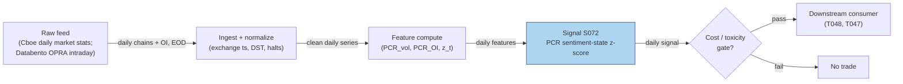

## Stage 72/200 — S072: Put/call ratio

*Batch SB8 · Signal 72/100 · Provenance [D] · Family E — Volatility & Options-Informed*

### S1. One-line verdict

| | |
|---|---|
| **What it is** | Ratio of put to call trading (by volume or by open interest); a crowding and hedge-demand gauge read contrarian at extremes. |
| **When it works** | Fear/panic extremes in index options, when the reading is a sentiment state conditioned on regime, not a standalone rule. |
| **When it dies** | Persistent bear markets, vol breakouts, and regimes where the ratio is driven by institutional hedging rather than speculation. |
| **Build-or-buy in one line** | Build the normalization and analytics yourself; buy the chain data (free EOD from Cboe, OPRA if you need intraday). |

Provenance **[D]** (documented): the ratio is an industry-standard series (Cboe daily market statistics) with peer-reviewed evidence behind its sentiment content. Family E — Volatility & Options-Informed.

### S2. How it works — plain human explanation

A **put option** is a contract giving the right (not the obligation) to sell the underlying stock at a fixed **strike price**; a **call option** gives the right to buy. The **put/call ratio (PCR)** divides put trading by call trading — either by **volume** (contracts traded today) or by **open interest (OI)** (contracts outstanding, i.e. opened but not yet closed, exercised, or expired).

Picture 9:47 on a Tuesday. SPX put volume is running 1.8× call volume while the equity-only PCR sits at 0.6. One market is buying crash insurance; the other is trading single-name calls. That split is the signal's whole point: index options carry the systematic hedge bid, equity options carry more speculation.

Why should it work economically? Three channels. First, **hedging demand**: protective puts are the standard portfolio-insurance product, so a rising PCR often means institutions paying up for downside protection — fear, measurable in contracts. Second, **behavioral crowding**: at sentiment extremes the marginal trader is panicked or euphoric, and prices made at extremes tend to reverse — the classic **contrarian** read (contrarian = bet against the crowd). Third, **adverse selection** (trading against someone who knows more): informed traders prefer options for embedded **leverage** (small premium, large notional) — the case made by Black (1975) and formalized by Easley, O'Hara & Srinivas (1998), who showed *signed* option volume predicts returns while raw volume does not.

The honest version the evidence supports: PCR is **better as a conditional sentiment-state variable than as a standalone buy/sell signal**. A high PCR can mean panic near a low, rational pre-crash hedging, a persistent bearish regime, or systematic put overwriting — same number, four worlds. The ratio gives the room's mood; the trade needs regime conditioning.

Mental model:
- PCR measures who is paying for what insurance, not where the stock goes next by itself.
- Index PCR (hedging) and equity PCR (speculation) are different instruments — never blend them blindly.
- Extremes mark sentiment states; the trade comes from conditioning on the state, never from a fixed threshold.

### S3. The math — exact formula

Let $V^P_t, V^C_t$ be put and call **volume** (contracts) on day $t$, and $OI^P_t, OI^C_t$ be put and call **open interest** at the close of day $t$. Let $\Delta_{j,t}$ be the option **delta** of contract $j$ (delta = the option's price sensitivity to a $1 move in the underlying, between −1 and +1; $|\Delta|$ measures how option-like the exposure is).

$$\text{PCR}^{vol}_t = \frac{V^P_t}{V^C_t}, \qquad
\text{PCR}^{OI}_t = \frac{OI^P_t}{OI^C_t}, \qquad
\text{PCR}^{|\Delta|}_t = \frac{\sum_{j \in \text{puts}} V_{j,t}\,|\Delta_{j,t}|}{\sum_{j \in \text{calls}} V_{j,t}\,|\Delta_{j,t}|}$$

The delta-weighted form (often more informative than raw counts, because it weights contracts by economic exposure) and a smoothed/standardized read:

$$\overline{\text{PCR}}_t = \frac{1}{n}\sum_{k=0}^{n-1}\text{PCR}_{t-k}, \qquad
z_t = \frac{\text{PCR}_t - \mathrm{median}(\text{PCR}_{t-L:t-1})}{1.4826 \cdot \mathrm{MAD}_{t-L:t-1}}$$

where MAD is the median absolute deviation over the trailing $L$-day window, and $1.4826$ rescales MAD to a standard-deviation equivalent under normality. A percentile form is also common: rank today's PCR in its trailing 1-year distribution and fade readings above the 90th / below the 10th percentile.

**Parameter table** (defaults are `example — not an institutional standard`):

| Parameter | Symbol | Typical range | Too small | Too large | Default (example) |
|---|---|---|---|---|---|
| Smoothing window | $n$ | 3–20 days | noisy, whipsaws | lags turning points | 5 |
| Robust lookback | $L$ | 20–252 days | unstable median | stale regime | 60 |
| z threshold | $|z|$ | 1.5–3.0 | too many flags | misses extremes | 2.0 |
| Percentile band | — | 80/20–95/5 | noise | rare signals | 90/10 |

**Normalization choices.** Raw PCR drifts with market structure (0DTE flow — options expiring the same day — was roughly half of SPX volume by 2023). Always normalize: z-score vs trailing median/MAD or trailing percentile rank. Volume PCR reacts fast; OI PCR is slow-moving positioning.

**Causal timing.** Computed at the close of day $t$ using only data $\le t$; tradable no earlier than the open of $t+1$. Intraday 0DTE-aware variants recompute on rolling windows with wider bands.

**Named variants.** (1) Volume PCR vs OI PCR vs delta-weighted PCR. (2) Equity-only vs index-only (Cboe publishes the split; index PCR > 1 is normal because of the structural put-hedge bid, equity PCR < 1 is normal because of call speculation). (3) 0DTE-aware intraday PCR for expiry-day sessions.

### S4. Worked example — step-by-step numbers (SYNTHETIC)

Synthetic 30-day daily PCR tape for fictional name "ABC" (seed **72**, `np.random.default_rng(72)`); the chart plots this same series. Trailing 20-day median and robust z-score, $L=20$ (`example`).

| Day | PCR (put vol / call vol) | Trailing 20d median | z-score | Note |
|---|---|---|---|---|
| 19 | 0.71 | — | — | warm-up, insufficient history |
| 20 | 0.83 | — | — | warm-up, insufficient history |
| 21 | 0.90 | 0.83 | +0.61 | normal |
| 22 | 1.95 | 0.85 | +9.49 | **extreme** (z > 2, example band) |
| 23 | 1.58 | 0.85 | +5.33 | **extreme** |
| 24 | 0.88 | 0.85 | +0.25 | normalizes |
| 25 | 0.97 | 0.86 | +0.84 | normal |
| 26 | 0.88 | 0.86 | +0.16 | normal |
| 27 | 1.02 | 0.86 | +1.01 | normal |
| 28 | 1.01 | 0.86 | +0.98 | normal |
| 29 | 0.96 | 0.86 | +0.67 | normal |
| 30 | 1.00 | 0.86 | +0.90 | normal |

Steps: (1) compute daily PCR = put contracts ÷ call contracts; (2) trailing 20-day median of PCR; (3) MAD over the same window, rescaled by 1.4826; (4) $z_{22} = (1.95 - 0.85)/(1.4826 \times \mathrm{MAD}) = +9.49$. The chart's dashed bands mark $z=\pm 2$ at PCR ≈ 1.18 / 0.53.

**What to notice.** Day 22's spike is unmistakable *because* the trailing MAD was compressed — in live data, volatility-of-PCR itself clusters, so a fixed z-band calibrated in a calm window will over-fire when regime shifts. Also note day 23 stays extreme: fear unwinds over days, not minutes, which is why the documented horizon is 1–10 days, not intraday. Limits of this toy: no fees, no bid/ask on the hedge, and the "fear spike" was injected by hand — nothing here is a backtest.

### S5. Strategies that use this signal

- **T048 — Put/Call Ratio Contrarian** — primary entry trigger: fades extreme PCR z-scores with stretched-move and sentiment context.
- **T047 — Risk-Reversal Skew Momentum** — secondary/confirming input: PCR state conditions whether a 25-delta risk-reversal skew shift is faded or followed.

### S6. Data required — exact spec

| Field | Type | Granularity | Source tier | Notes |
|---|---|---|---|---|
| Put/call volume by product | int (contracts) | daily | Tier 0 | Cboe daily market statistics (free); split equity / index / ETP |
| Put/call open interest | int (contracts) | daily | Tier 0 | same source; EOD snapshot |
| Per-contract volume + Greeks | float/int | intraday (OPRA) | Tier 1–2 | needed for delta-weighted PCR and 0DTE variants |
| Underlying price | float | daily / 1-min | Tier 0–1 | regime conditioning (trend, VIX level) |

**Collection.** Tier-0 route: scrape or download the Cboe daily market statistics page (total/index/equity/ETP PCR published daily, free). Intraday route: OPRA via Databento or Polygon Options — full trade tape with per-contract volume.

```python
import polars as pl
# ingest loop sketch: daily Cboe PCR statistics -> normalized series
rows = fetch_cboe_daily_stats()          # date, equity_pcr, index_pcr, etp_pcr
df = (pl.DataFrame(rows)
        .with_columns(date=pl.col("date").str.to_date())
        .sort("date")
        .with_columns(
            pcr_eq_smooth=pl.col("equity_pcr").rolling_mean(5),          # example window
            med=pl.col("equity_pcr").rolling_median(60),                  # example lookback
        )
        .with_columns(z=(pl.col("equity_pcr") - pl.col("med"))
                      / (1.4826 * (pl.col("equity_pcr") - pl.col("med")).abs().rolling_median(60)))
store_parquet(df, "data/s072_pcr_daily.parquet")   # date-partitioned, append-only
```

**Storage.** Daily PCR series: kilobytes per symbol-year — trivial. Full EOD chain snapshots (for the delta-weighted form): per cost-model §3, an SPX-class snapshot is ~100–300 MB in RAM, far less in parquet; selective underlyings only. **Data-quality checklist:** exchange timestamps; corporate-action adjustments; halts (zero-volume days aren't zero sentiment); DST/half-days; stale quotes if you mix quote-derived deltas with trade volume.

### S7. Local build on M5 Max / 128GB

**Feasibility: trivial for the daily series; feasible for the intraday variant.** The documented signal is a daily ratio off a public statistics page — a spreadsheet could compute it. The engineering lives in the intraday/delta-weighted reconstruction: normalizing OPRA trades and attaching Greeks per contract.

**Throughput** (per cost-model §2): daily PCR on 500 symbols is a few thousand rows — polars handles it in milliseconds. Intraday delta-weighted PCR on OPRA prints for 50 liquid names: ~100k events/sec at busy times is borderline for a pure-Python loop, comfortable in Rust, and trivial as a per-minute polars batch recompute. Bottleneck is I/O and symbol-mastering, not compute.

**Stack options:**

| Stack | When to pick |
|---|---|
| Python + polars | default; daily and per-minute batch recompute |
| Rust | full OPRA firehose, real-time intraday PCR across many underlyings |
| DuckDB | research queries over the historical PCR panel |

**RAM.** Daily panel for 3,000 symbols × 10 years ≈ tens of MB — fits comfortably. Per cost-model §3's 77 GB working budget, even a 60-day intraday OPRA slice for a handful of names fits with care; archive the rest as per-symbol daily parquet files.

**Engineering time.** Cost-model §5 Tier M (vol estimators, S049–S070 class): **20–60 h ≈ $3,000–9,000** at the $150/hr loaded-cost estimate. The chatbot's component lead (labeled `unverified chatbot claim`, cost-model takes precedence) put PCR at 10–25 h prototype / 30–70 h production. **What breaks first at 500 symbols or full OPRA:** the Greeks join — attaching a fresh delta to every print needs an IV surface per underlying per timestamp; precompute Greeks on a grid and interpolate.

### S8. Buy vs build

| Option | What you get | Indicative price | Buying gains | Buying loses |
|---|---|---|---|---|
| Tier 0: Cboe daily market statistics | Daily PCR (total/index/equity/ETP), OI | ~$0 | free, authoritative, zero eng | EOD only; no per-contract detail; no delta weighting |
| Tier 1: Polygon / Alpaca options | Per-contract volume, chains, Greeks | ~$30–200/mo | cheap intraday PCR | API rate limits; OI timing inconsistent |
| Tier 2: Databento OPRA | Full consolidated trades/quotes/OI | ~$200/mo + usage | honest intraday + delta-weighted PCR | usage costs scale with symbols |
| Academic: OptionMetrics IvyDB | Publication-quality history | ~$thousands/yr academic | clean history for research | institutional $$$$; not real-time |

All prices `indicative — verify before budgeting`. **Verdict: build if** you only need the daily sentiment-state series (Tier 0 is free and the math is 20 lines); **buy if** you need intraday or delta-weighted PCR across many names; **hybrid (common)**: buy the normalized chain feed, build the z-score analytics with your own thresholds.

### S9. Success ratio / efficacy — documented evidence

| Study / source | Market & period | Metric | Before/after cost | Caveat |
|---|---|---|---|---|
| Pan & Poteshman (2006), Rev. Financ. Stud. | US equities, CBOE 1990–2001 | Low-PCR stocks beat high-PCR by >40 bps next day, >1% next week (risk-adjusted) | **before-cost**; no trading frictions modeled | Needs buy-to-open flags (CBOE proprietary data); public-volume replication is weaker |
| Webb, Simon & Wiggins (2001), J. Futures Markets | S&P 500 futures, 1989–1999 | PCR as contrarian sentiment indicator: statistically and economically significant forecasting power at 10/20/30-day horizons; OOS simulations enhanced profits | **before-cost** | Sample ends 1999 — pre-0DTE, pre-ETF-dominance regime |
| Cao, Li, Zhan & Zhou (2022), J. Financ. Quant. Anal. | US market, CBOE 2005–2020 | Aggregate call order imbalance negatively forecasts the market risk premium; individual-level imbalance positively predicts cross-section (informed) | **before-cost** | Dual nature: informed at the stock level, sentiment-driven in aggregate |

**Regimes where it fails.** Sustained bear markets (high PCR stays high while prices fall), credit-stress episodes (hedging is rational, not fear), vol breakouts, and expiry weeks (OI distortions). The 0DTE regime has compressed intraday PCR dynamics; folklore thresholds (0.7/1.0) were never estimated rules.

**Honest bottom line.** As a standalone trigger this is a *weak, regime-dependent* edge; as a conditional sentiment-state filter (T048) it is *documented and useful* — but only with conditioning.

### S10. Failure modes & pitfalls

1. **Hedge-vs-speculation confusion** — put volume includes collars and overwriting, not just fear. *Mitigation:* split index vs equity PCR; delta-weight to emphasize speculative strikes.
2. **Lookahead leakage** — OI is published with a lag; using "final" OI at signal time is lookahead. *Mitigation:* timestamp every field; use only data available at $t$.
3. **Fixed-threshold overfitting** — 0.7/1.0 folklore is not estimated. *Mitigation:* percentile/z normalization, re-estimated on rolling windows; mark defaults `example`.
4. **Regime breaks** — 0DTE and ETF flows changed PCR's meaning. *Mitigation:* condition on VIX level and trend regime; revalidate yearly.
5. **Staleness/latency** — EOD PCR misses intraday reversals. *Mitigation:* intraday OPRA variant with wider bands, or accept the 1–10 day horizon.
6. **Cost blowup** — fading extremes means trading into wide spreads during stress. *Mitigation:* model spread + fees + impact; size down when spreads widen.
7. **Crowding/alpha decay** — sentiment indicators are the most-crowded signals in existence. *Mitigation:* use as a filter, not a trigger; combine with non-sentiment signals.
8. **Microstructure noise** — single-day PCR prints are noisy. *Mitigation:* smooth (5–10 day SMA) and require multi-day confirmation.

### S11. Visuals




### S12. Sources

1. Pan, J. & Poteshman, A.M. (2006). "The Information in Option Volume for Future Stock Prices." *Review of Financial Studies* 19(3):871–908. https://ideas.repec.Org/a/oup/rfinst/v19y2006i3p871-908.html
2. Webb, R.I., Simon, D.P. & Wiggins, R.A. III (2001). "S&P futures returns and contrary sentiment indicators." *Journal of Futures Markets* 21(5):447–462. https://ideas.repec.Org/a/wly/jfutmk/v21y2001i5p447-462.html
3. Cao, J., Li, G., Zhan, X. & Zhou, G. (2022). "Betting Against the Crowd: Option Trading and Market Risk Premium." *Journal of Financial and Quantitative Analysis*. https://papers.ssrn.com/sol3/papers.cfm?abstract_id=4301015
4. Cboe — U.S. Options Daily Market Statistics (industry data source; daily put/call ratios by product). https://www.cboe.com/us/options/market_statistics/daily/?dt=2023-06-02

**Unverified leads** (chatbot-provided, not independently checkable — do not treat as evidence): component engineering-hour ranges for a PCR build (prototype 10–25 h, production 30–70 h); folklore threshold values 0.7/1.0.
