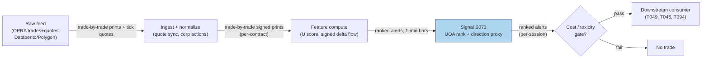

## Stage 73/200 — S073: Unusual options activity

*Batch SB8 · Signal 73/100 · Provenance [D/SR] · Family E — Volatility & Options-Informed*

### S1. One-line verdict

| | |
|---|---|
| **What it is** | Contracts trading far above their normal volume or standing open interest, read as possible fresh informed positioning — direction inferred, never observed. |
| **When it works** | Short-horizon (hours to days) event detection: earnings, M&A (mergers and acquisitions), news — when a real informed trader needs leverage fast. |
| **When it dies** | When the "unusual" print is a spread leg (one side of a multi-leg options strategy), a closing trade, dealer (market-maker) hedging, or index/ETF (exchange-traded fund) hedging flow rather than a directional bet. |
| **Build-or-buy in one line** | Buy normalized OPRA (Options Price Reporting Authority, the consolidated US options tape) trades/quotes (the normalization is the product); build the ranking, filters, and alerts yourself. |

Provenance **[D/SR]**: the informed-options-volume concept is documented (Pan & Poteshman 2006); the signed-volume *reconstruction* from public OPRA data is a standard reconstruction — true bought-to-open needs open/close flags that OPRA lacks. Family E — Volatility & Options-Informed.

### S2. How it works — plain human explanation

**Unusual options activity (UOA)** is the options-market equivalent of a Brinks truck at a bank: a contract that normally trades 2,000 lots (blocks of contracts) suddenly prints (executes and reports) 9,800, or volume exceeds the entire standing **open interest** (outstanding contracts). A **sweep** executes across multiple exchanges nearly simultaneously — someone wants size *now* and pays the spread on every venue. That urgency smells like information.

The economic logic: an informed trader with a short-lived edge wants maximum **leverage** (payoff per dollar at risk) without moving the stock. Options give both. Easley, O'Hara & Srinivas (1998) showed *signed* option volume — calls bought or puts sold (positive-news) versus puts bought or calls sold (negative-news) — predicts stock returns while raw volume does not. Pan & Poteshman (2006) showed put-call ratios from buyer-initiated *opening* volume predict next-day and next-week returns, sourced to private information rather than inefficiency.

Now the central honesty problem of this chapter — read it twice: **the crucial data problem is the open/close flag.** A trade record gives contract, price, size, timestamp, exchange, sometimes the aggressor side (the side that crossed the spread to initiate the trade) — but usually not whether the trade opened or closed a position. A large call buy can be: (a) an opening bullish bet, (b) a *closing* purchase by someone short calls, (c) one leg of a spread, (d) a dealer's hedge. Same print, four opposite meanings. OI changes help only after the fact, at EOD (end-of-day) granularity. So **signed delta flow ≈ Σ_j q_j Δ_j M_j is signed traded exposure, NOT confirmed customer opening** — a proxy, never observed positioning.

Mental model:
- UOA is a ranking and event-detection feature, not a binary "call buying = stock up" rule.
- Urgency (sweeps, premium paid) is more informative than size alone.
- Without the open/close flag, every directional read is a hypothesis with named alternatives.

### S3. The math — exact formula

For contract $i$ on day/session $t$, with trailing median daily volume $\mathrm{med}(V_{i,\cdot})$:

$$U_{i,t} = \frac{V_{i,t}}{\mathrm{median}(V_{i,t-20:t-1})} \qquad \text{(unusual-volume score, `example` window)}$$

**UOA flag (documented rule, Stanford CS229 project on OptionMetrics data):** flag when $V_{i,t} > 2 \times$ daily average **and** $V_{i,t} \ge 500$ contracts (institutional-size block rule) — thresholds are `example — not an institutional standard`. Volume-vs-OI form: flag when $V_{i,t}/OI_{i,t} > 1.5$–$3$ (`example`).

**Signed delta flow (proxy):** for each print $j$ with signed quantity $q_j$ (+1 buy-initiated, −1 sell-initiated via the quote rule — classifying a trade as buyer- or seller-initiated by comparing the trade price to the prevailing bid/ask), delta $\Delta_j$, multiplier $M_j$ (100 shares per contract):

$$F_t = \sum_j q_j \, \Delta_j \, M_j \qquad \text{= signed traded delta exposure (PROXY, not confirmed opening)}$$

Direction mapping (hypotheses, not facts): net call buying + high $F_t$ → bullish hypothesis; net put buying → bearish hypothesis; follow for 1–3 sessions (`example` holding window).

**Parameter table** (`example` defaults throughout):

| Parameter | Symbol | Typical range | Too small | Too large | Default (example) |
|---|---|---|---|---|---|
| History window | — | 10–60 days | unstable median | stale baseline | 20 |
| U threshold | $U$ | 1.5–5× | noise | misses events | 2.0× |
| Block size | — | 250–1,000 contracts | retail noise | only mega-prints | 500 |
| Vol/OI threshold | — | 1.0–3.0× | flags roll days | misses fresh opens | 1.5× |
| Follow horizon | — | 1–5 sessions | cuts winners | signal decays | 1–3 |

**Normalization choices.** $U_{i,t}$ vs trailing median (robust) or mean (the documented 2× rule uses average); per-contract vs aggregated to the underlying; delta-weighting so deep-OTM (out-of-the-money — strike far from the current price) lottery tickets don't dominate. **Causal timing:** the print at time $t$ is known at $t$; the *interpretation* (open vs close) is not fully known until next-day OI — score at $t$, confirm at $t+1$, trade no earlier than $t+1$ on the confirmed read. **Variants:** volume-vs-history ($U$), volume-vs-OI, sweep detection (multi-exchange urgency), signed delta flow, premium-weighted flow.

### S4. Worked example — step-by-step numbers (SYNTHETIC)

Synthetic one-session scan for fictional name "ABC", 8 contracts (seed **73**, `np.random.default_rng(73)`); ranked by $U$; the chart plots these same bars. The open/close flag is **missing** — that absence is the point of the example.

| Contract | Type | Volume | OI | Trailing-20d median vol | $U$ | Vol/OI | Premium ($k) |
|---|---|---|---|---|---|---|---|
| ABC 100C | C | 9,800 | 8,200 | 2,100 | 4.67× | 1.20 | 186.0 |
| ABC 95P | P | 7,100 | 5,400 | 2,300 | 3.09× | 1.31 | 128.0 |
| ABC 97P | P | 2,200 | 4,200 | 2,000 | 1.10× | 0.52 | 33.0 |
| ABC 105C | C | 2,600 | 3,100 | 2,400 | 1.08× | 0.84 | 41.0 |
| ABC 102C | C | 5,100 | 6,600 | 4,800 | 1.06× | 0.77 | 97.0 |
| ABC 90P | P | 1,600 | 2,900 | 1,700 | 0.94× | 0.55 | 24.0 |
| ABC 85P | P | 610 | 1,200 | 900 | 0.68× | 0.51 | 8.0 |
| ABC 110C | C | 340 | 1,500 | 1,500 | 0.23× | 0.23 | 6.0 |

Steps: (1) $U = V/\mathrm{median}$: ABC 100C gives $9{,}800/2{,}100 = 4.67$; (2) vol/OI: $9{,}800/8{,}200 = 1.20$; (3) rank by $U$; (4) the 2×-and-500 rule flags ABC 100C (4.67×, 9,800 ≥ 500) and ABC 95P (3.09×, 7,100 ≥ 500).

**What to notice.** The top hit fails the volume/OI > 1.5 rule (1.20) while passing the $U$ rule (4.67×) — the two standard screens *disagree*, which is normal: $U$ says "unusual versus its own history," vol/OI says "not obviously fresh versus standing positions." And the directional read is genuinely ambiguous: 9,800 calls could be informed opening buying — or a fund closing a short-call book, or one leg of a spread. This toy has no fees, no multi-leg linkage, and no aggressor-side classification error — three things the real tape has in abundance. Treat the output as a ranked alert queue, not a signal with a sign.

### S5. Strategies that use this signal

- **T049 — Unusual Options Activity Follower** — primary entry trigger: follows signed options sweeps confirmed by equity RVOL (relative volume — today's volume vs its historical average) and news sentiment.
- **T046 — Straddle-Implied Move Fade** — confirming filter: unusual activity confirms whether an overpriced event move has informed sponsorship behind it.
- **T094 — Squeeze Breakout (Options-Confirmed)** — confirming filter: unusual call activity confirms Bollinger-squeeze (Bollinger Band contraction signaling a volatility breakout) breakouts.

### S6. Data required — exact spec

| Field | Type | Granularity | Source tier | Notes |
|---|---|---|---|---|
| Options trades (price, size, exchange, ts) | mixed | trade-by-trade (OPRA) | Tier 1–2 | Databento OPRA / Polygon Options; sweep detection needs exchange IDs |
| Options quotes (bid/ask) | float | tick (every quote update) | Tier 1–2 | quote rule for signing prints; needs synchronized timestamps |
| Open interest by contract | int | daily (EOD) | Tier 1–2 | next-day confirmation of open vs close; lagged |
| Underlying price | float | 1-min / tick | Tier 0–1 | delta computation, event context |

**Collection.** OPRA is the consolidated US listed-options feed (quotes, trades, OI, EOD summaries). Vendor APIs (Databento, Polygon) normalize it; raw OPRA direct is a message firehose (the full real-time message stream) requiring symbol mastering (mapping vendor contract symbols to a canonical contract master) and sequence-gap (missing packet/message detection and recovery) handling.

```python
import polars as pl
# ingest sketch: sign prints via quote rule, aggregate signed delta flow
trades = load_opra_trades("ABC", date)          # ts, contract, price, size, exch
quotes = load_opra_quotes("ABC", date)          # ts, contract, bid, ask
t = trades.join_asof(quotes, on="ts", by="contract")   # causal: quote <= trade ts
t = t.with_columns(
    side=pl.when(pl.col("price") >= (pl.col("bid")+pl.col("ask"))/2).then(1).otherwise(-1),
    delta=bs_delta(pl.col("contract"), pl.col("underlying"), pl.col("iv")),  # per-contract
)
flow = t.group_by("contract").agg(
    U=(pl.col("size").sum() / pl.col("hist_median_vol").first()),
    signed_delta=(pl.col("side")*pl.col("delta")*pl.col("size")*100).sum(),  # PROXY
)
```

**Storage.** Per cost-model §4, full OPRA chain snapshots run ~1–3 GB/day (SPX-like) in parquet — selective underlyings only. **Data-quality checklist:** quote/trade timestamp sync (stale quotes mis-sign prints); corporate actions; OI corrections (use as-of — point-in-time, unrevised — vintages, not revised); spread legs look like independent prints — the feed has no multi-leg linkage; expiry-day volume spikes are calendar effects, not information.

### S7. Local build on M5 Max / 128GB

**Feasibility: feasible (Tier H per cost-model §5, the S071–S074 OPRA-analytics class) — the math is simple, the data plumbing is the project.** Scanning is arithmetic; honest signing needs synchronized quotes, per-contract Greeks (the option risk sensitivities — delta, gamma, vega, theta), and next-day OI reconciliation.

**Throughput** (per cost-model §2): a per-minute batch scan over 50 names is trivial in polars (~10–50M rows/sec). Real-time sweep detection across full OPRA wants Rust (~5–50M events/sec); a Python loop (~100–500k/sec) covers ≤20 symbols. Bottleneck: quote normalization and the Greeks join.

| Stack | When to pick |
|---|---|
| Python + polars | default; batch scans, research, alerting |
| Rust | real-time sweep detection on the full OPRA firehose |
| DuckDB | historical UOA panel queries |

**RAM.** Per cost-model §3, an SPX-class chain snapshot is ~100–300 MB live; a 60-day panel for 30–50 names fits inside the 77 GB working budget — per-symbol daily files, never the whole OPRA archive in RAM.

**Engineering time.** Cost-model §5 Tier H: **60–200 h ≈ $9,000–30,000** at the $150/hr loaded-cost estimate — most of it data quality and ops. The chatbot's component lead (labeled `unverified chatbot claim`; cost-model takes precedence) put the unusual-activity scanner at 40–100 h prototype / 150–350 h production. **What breaks first at 500 symbols or full OPRA:** signing — quote-rule accuracy collapses on stale quotes, and vendor aggressor-side misclassification becomes the dominant error.

### S8. Buy vs build

| Option | What you get | Indicative price | Buying gains | Buying loses |
|---|---|---|---|---|
| Tier 0: exchange delayed quotes | Coarse chain snapshots | ~$0 | free prototyping | no real-time scans; incomplete chains |
| Tier 1: Polygon Options / broker APIs | Trades, quotes, chains | ~$30–200/mo | cheap scanner feed | rate limits; inconsistent OI timing; restricted redistribution |
| Tier 2: Databento OPRA | Normalized full trades/quotes/OI | ~$200/mo + usage | honest signing + sweep detection | usage scales; you still build the ranking |
| Tier 3: full OPRA direct / historical archive | Raw firehose + history | $$$$ institutional | complete | normalization is a full-time job |

All prices `indicative — verify before budgeting`. **Verdict: hybrid (the standard answer)** — buy normalized trades/quotes/OI, build the ranking, filters, and alerts. Building the *feed normalization* only pays if OPRA-direct economics beat the vendor at your scale; the *analytics* are always yours, because your thresholds are the edge.

### S9. Success ratio / efficacy — documented evidence

| Study / source | Market & period | Metric | Before/after cost | Caveat |
|---|---|---|---|---|
| Pan & Poteshman (2006), Rev. Financ. Stud. | US equities, CBOE (Chicago Board Options Exchange) 1990–2001 | Buyer-initiated opening PCR: low-minus-high spread >40 bps (basis points; 1 bp = 0.01%) next day, >1% next week (risk-adjusted — adjusted for market beta/factor exposure) | **before-cost** | Needs buy-to-open (new positions opened, vs closed) flags (CBOE proprietary); public-volume replication is weaker |
| Johnson & So (2012), J. Financ. Econ. | US equities, 1996–2009 approx. | Lowest O/S (option-to-stock volume) decile (tenth of the sorted sample) beats highest by 1.47%/month, risk-adjusted | **before-cost** | Unsigned volume; their model attributes the negative relation to stock short-sale costs, not pure informed flow |
| Ge, Lin & Pearson (2016), J. Financ. Econ. | US equities, signed CBOE volume | Purchases of calls that *open* new positions are the strongest return predictor; embedded leverage is the key channel | **before-cost** | Again needs signed + open/close data; confirms the flag is where the information lives |

The literature's own summary: option volume and signed flow *can* predict returns — statistically meaningful but generally modest, heterogeneous, strongest over short horizons. Nothing here is a "call buying = stock up" rule, and the strongest effects come from the papers using the flags retail data doesn't have.

**Regimes where it fails.** Spread-dominated prints, index/ETF hedging flows, liquid fast-diffusion names, near-expiry calendar effects, stale quotes, prints after the stock already moved.

**Honest bottom line.** As a standalone directional trigger this is a *modest, fragile* edge whose documented strength lives in data you probably don't have; as a ranked event-detection feature (T049, T094) it is *genuinely useful* — with the open/close caveat on every output.

### S10. Failure modes & pitfalls

1. **Open/close ambiguity** — the central failure: direction inferred, never observed. *Mitigation:* score at $t$, confirm with next-day OI change, and publish the alternative hypotheses alongside every alert.
2. **Spread legs masquerading as directional flow** — multi-leg prints look like conviction. *Mitigation:* cluster prints by timestamp/underlying/expiry; discount offsetting legs.
3. **Aggressor-side misclassification** — quote rule fails on stale quotes and midpoint prints. *Mitigation:* drop prints where the quote is older than N ms (`example`); track your own mis-sign rate.
4. **Lookahead via revised OI** — OI gets corrected; backtests on final OI overstate. *Mitigation:* as-of vintages only; embargo (withhold from the sample a buffer window around the event) the confirmation leg.
5. **Dealer hedging mistaken for informed flow** — customer flow begets dealer hedging prints. *Mitigation:* separate customer-vs-dealer flow if classified; otherwise widen holding windows.
6. **Cost blowup** — following sweeps means crossing the spread (paying the full bid/ask cost to execute immediately) after the informed trader did. *Mitigation:* model full round-trip spread + fees + impact; the edge must survive paying what the sweep paid.
7. **Event-selection bias** — UOA clusters around scheduled events where straddles are already rich. *Mitigation:* condition on the implied move (S070).
8. **Overfitting the flag definition** — tuning thresholds on the events you trade. *Mitigation:* freeze the screen out-of-sample (on data not used to choose the thresholds); purged/embargoed (training samples whose labels overlap the event window are removed, plus an embargo buffer) validation (S088).

### S11. Visuals




### S12. Sources

1. Pan, J. & Poteshman, A.M. (2006). "The Information in Option Volume for Future Stock Prices." *Review of Financial Studies* 19(3):871–908. https://ideas.repec.Org/a/oup/rfinst/v19y2006i3p871-908.html
2. Johnson, T.L. & So, E.C. (2012). "The Option to Stock Volume Ratio and Future Returns." *Journal of Financial Economics* 106(2):262–286. https://doi.org/10.1016/j.jfineco.2012.05.008
3. Ge, L., Lin, T.-C. & Pearson, N.D. (2016). "Why does the option to stock volume ratio predict stock returns?" *Journal of Financial Economics* 120(3):601–622. https://ideas.repec.Org/a/eee/jfinec/v120y2016i3p601-622.html
4. Easley, D., O'Hara, M. & Srinivas, P.S. (1998). "Option Volume and Stock Prices: Evidence on Where Informed Traders Trade." *Journal of Finance* 53(2):431–465. https://afajof.org/issue/volume-53-issue-2/

**Chatbot material (labeled, per question-bank protocol):**
- Duck.ai (GPT-5.6 Luna, anonymous, 2026-09-10) answered Q-SB8-1–Q-SB8-3. The UOA-direction evidence summary (Q-SB8-3 #3 — "statistically meaningful but generally modest, heterogeneous, strongest over short horizons") and the scanner cost/price components are chatbot research leads, cited as such and never as published findings; Pan & Poteshman (2006) is independently verified above. Source log: "Duck.ai answered Q-SB8-1–Q-SB8-3 (2026-09-10); Grok/Cursor answers pending (checked 2026-09-10)."

**Unverified leads** (chatbot-provided, not independently checkable — do not treat as evidence): unusual-activity scanner build hours (prototype 40–100 h, production 150–350 h); unusual-activity data pricing band ($500–10,000+/mo); the Stanford CS229 2×-volume/500-contract rule is cited from the signal's source entry, not re-verified against the original project page.
