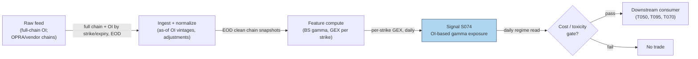

## Stage 74/200 — S074: Gamma exposure (GEX) & dealer positioning

*Batch SB8 · Signal 74/100 · Provenance [SR] · Family E — Volatility & Options-Informed*

### S1. One-line verdict

| | |
|---|---|
| **What it is** | An estimate of how much stock dealers must buy or sell to stay delta-hedged after a 1% move, built from public open interest under an assumed dealer-positioning sign convention. |
| **When it works** | As an intraday *regime context* (positive-gamma = dampened moves, negative-gamma = amplified moves) near large, fresh option expiries. |
| **When it dies** | Whenever you lack full-chain open interest, trust a single sign convention, or expect gamma walls to forecast direction out-of-sample. |
| **Build-or-buy in one line** | Buy the full-chain OI feed (you cannot build this honestly without it); build the estimator — but label it a proxy, never observed positioning. |

Provenance **[SR]** (standard reconstruction): true dealer books are proprietary; every public GEX number is a practitioner reconstruction from open interest plus a positioning assumption. Family E — Volatility & Options-Informed.

### S2. How it works — plain human explanation

**Gamma** (Γ) is how fast an option's **delta** (price sensitivity to the stock) changes as the stock moves — how fast the hedge ratio runs away from the hedger. **Dealers** (options market makers) sit opposite customer trades and keep books **delta-neutral** (offsetting stock so small moves don't change book value); when the stock moves they re-hedge — net long gamma damps moves (buy dips/sell rips), net short gamma amplifies them. **Gamma exposure (GEX)** estimates that dollar hedging flow: per strike, gamma × **open interest** (outstanding contracts), scaled to the P&L of a 1% underlying move, summed across strikes. A **gamma wall** is a strike with peak |GEX| (largest hedging flow); the **zero-gamma flip** is where cumulative net GEX changes sign (popularized extension — see S12); **max pain** minimizes total option-holder payout at expiry; **pinning** is price clustering at strikes near expiry (Ni, Pearson & Poteshman 2005).

Now the honesty core of this chapter, stated plainly: **you cannot honestly claim a reliable dealer-positioning or GEX estimator from quotes and trades alone. Full-chain open interest is required — and even full OI does not reveal the dealer side.** OI tells you contracts exist; not who holds them. The standard move — calls positive, puts negative (or the reverse), i.e. "customers are net long options" — is an *assumption*, not an accounting identity. A strike's OI was built from weeks of both buying and selling; netting it to one sign invents information. Without full-chain OI you cannot honestly build: full-chain GEX by strike, total GEX, gamma walls or zero-gamma levels, historical GEX time series, OI-adjusted unusual activity, or reliable dealer-positioning estimates. Anything built without it is a **PROXY** — "OI-based gamma exposure," never "dealer gamma."

And the effect size, from the literature: pinning exists but is **modest — cents or a small fraction of a percent, NOT a reliable intraday magnet**. Gamma walls are **visually impressive and have little out-of-sample (data the model was not tuned on) forecasting value**.

Mental model:
- GEX estimates a hedging *impulse*, not a price target; it describes how moves propagate, not where they go.
- The sign convention is the model — change it and the "walls" move; publish multiple conventions or none.
- Full-chain OI is the entry ticket; without it you are drawing pictures, not measuring.

**Chatbot material (labeled, per question-bank protocol):**
- Duck.ai (GPT-5.6 Luna, anonymous, 2026-09-10) answered Q-SB8-1–Q-SB8-3. The gamma-hedging research summary (Q-SB8-3 #4 — "statistically meaningful but generally modest, heterogeneous, strongest over short horizons") and the GEX-engine cost/price components are chatbot research leads, cited as such and never as published findings; Ni, Pearson & Poteshman (2005) is independently verified above. Source log: "Duck.ai answered Q-SB8-1–Q-SB8-3 (2026-09-10); Grok/Cursor answers pending (checked 2026-09-10)."

### S3. The math — exact formula

For strike $K$, with Black–Scholes (BS) gamma $\Gamma(K)$, net open interest $OI^{net}(K) = OI^C(K) - OI^P(K)$ (**sign convention = ASSUMPTION**), multiplier $M$ (100 for equity options), spot $S$ (current underlying price):

$$\Gamma(K) = \frac{e^{-qT}\,\phi(d_1)}{S\,\sigma\sqrt{T}}, \qquad
\mathrm{GEX}(K) = \Gamma(K)\cdot OI^{net}(K)\cdot M\cdot S^2\cdot 0.01$$

where $q$ is the dividend yield, $T$ time to expiry in years, $\sigma$ implied volatility (IV — the volatility implied by the option's market price), $\phi$ the standard normal density, and $d_1 = [\ln(S/K) + (r - q + \sigma^2/2)T]/(\sigma\sqrt{T})$. The factor $M\cdot S^2\cdot 0.01$ converts per-contract gamma into **dollars of P&L (profit and loss) for a 1% spot move**. Total exposure: $\mathrm{GEX}_{total} = \sum_K \mathrm{GEX}(K)$ (sum over strikes *and* expiries).

**Named variants.** (1) Aggregate GEX (SqueezeMetrics original: one number). (2) Per-strike GEX with flip/walls (popularized extension). (3) Charm/vanna-adjusted intraday hedging flow (charm $= \partial\Delta/\partial t$, vanna $= \partial\Delta/\partial\sigma$). (4) DDOI-based dealer-directional OI (SqueezeMetrics' own dealer-side model) — DDOI = dealer-directional open interest, their proprietary estimate of which side the dealer book sits on.

Attribution honesty: the $S^2 \times 0.01$ normalization is a *charting-tool convention*; the original SqueezeMetrics whitepaper (2016/2017) computes $\Gamma \cdot OI \cdot 100$ as a *single aggregate* across all strikes and expiries — the per-strike flip is a popularized extension. Its dealer assumption is also narrower than "customers buy, dealers sell": investors net-*sell* calls via overwriting (selling calls against an existing long position) and net-*buy* puts for protection.

**Parameter table** (`example` defaults; every choice changes the answer):

| Parameter | Symbol | Typical range | Too small | Too large | Default (example) |
|---|---|---|---|---|---|
| Strike window | — | ±10–20% of spot | misses wing gamma | illiquid-wing noise | ±15% |
| Expiries included | — | nearest weekly → 6–12M | misses term gamma | stale far-dated OI dominates | all listed |
| Sign convention | — | C−P / P−C / DDOI | — | — | publish ≥2 (`example`) |
| Gamma input | $\sigma$ | per-contract IV | surface noise | stale vol | per-contract IV, own $T$ |

**Causal timing.** OI publishes EOD (end-of-day) with corrections — GEX stamped 16:00 on "final" OI is lookahead (using data that was not yet available at the decision time); honest intraday GEX uses the last *as-of* (point-in-time, unrevised) vintage, tradable no earlier than the next bar after the snapshot completes.

**Named variants.** (1) Aggregate GEX (SqueezeMetrics original: one number). (2) Per-strike GEX with flip/walls (popularized extension). (3) Charm/vanna-adjusted intraday hedging flow.

### S4. Worked example — step-by-step numbers (SYNTHETIC)

Verified 5-strike synthetic chain, $S=100$, $M=100$, so $M\cdot S^2\cdot 0.01 = 10{,}000$ (seed **74**; gamma values are illustrative inputs; the chart plots these same bars).

$$\mathrm{GEX}(K) = \Gamma(K)\times OI^{net}(K)\times 10{,}000$$

| Strike | Γ (illustrative) | Net OI ($OI^C - OI^P$, assumed) | GEX ($ per 1% move) |
|---|---|---|---|
| 90 | 0.020 | +800 | $0.020 \times 800 \times 10{,}000 = \mathbf{+\$160{,}000}$ |
| 95 | 0.025 | −500 | $0.025 \times (-500) \times 10{,}000 = \mathbf{-\$125{,}000}$ |
| 100 | 0.030 | +300 | $0.030 \times 300 \times 10{,}000 = \mathbf{+\$90{,}000}$ |
| 105 | 0.028 | −200 | $0.028 \times (-200) \times 10{,}000 = \mathbf{-\$56{,}000}$ |
| 110 | 0.022 | +100 | $0.022 \times 100 \times 10{,}000 = \mathbf{+\$22{,}000}$ |
| **Total** | | | **$\mathbf{+\$91{,}000}$** |

Largest positive: K90 (+$160k). Largest negative: K95 (−$125k). Gamma walls (top-2 by |GEX|, `example` rule): K90, K95. Cumulative net GEX from low strikes: +160k → +35k → +125k → +69k → +91k — never changes sign, so there is **no zero-gamma flip inside this strike range** under this convention; a good reminder that the flip is not guaranteed to exist.

**What to notice.** The arithmetic is clean; the economics are not. Flip the sign convention and K95 becomes +$125k, K90 −$160k, total −$91k — the *regime label inverts* while the OI data never changed. Five near-the-money strikes are a toy — real estimation needs the full chain, since missing far-wing (strikes far from the current price), short-dated, or index positions can flip the aggregate sign. And nothing here is tradable evidence: pinning runs to cents or small fractions of a percent, walls have little OOS (out-of-sample) value.

### S5. Strategies that use this signal

- **T050 — GEX Pin / Dealer-Positioning Fade** — primary trigger/regime: fades moves away from gamma walls into expiry, conditioned on the net-GEX sign.
- **T095 — Dispersion + GEX Regime Switch** — regime gate: runs dispersion only when the dealer-gamma regime is supportive.
- **T070 — MOC (market-on-close) Auction-Pin Trader** — context input: GEX levels inform the closing-auction pin read.

### S6. Data required — exact spec

| Field | Type | Granularity | Source tier | Notes |
|---|---|---|---|---|
| Full option chain + OI by strike/expiry | mixed | EOD snapshot minimum; intraday delayed for live | Tier 2–3 | **Non-negotiable**: all strikes, all expiries incl. weeklies (weekly-expiring options), index options (SPX — S&P 500 index options) |
| C/P classification, multiplier, style | categorical/int | per contract | Tier 2–3 | American (exercisable any time) vs European (exercisable at expiry) exercise changes gamma |
| Spot/forward, $T$, IV or gamma inputs | float | per snapshot | Tier 2–3 | use each option's own IV and $T$ for Γ; spot = current price, forward = delivery price |
| Corporate actions / adjustments | events | as-of (point-in-time, unrevised) | Tier 2–3 | adjusted strikes otherwise corrupt the strike map |

**Full-chain OI is non-negotiable.** An NTM (near-the-money) chain alone **cannot** support total-GEX, zero-gamma, or dominant-wall claims. Confirm before paying: OI included (not just volume), *all* strikes, *all* expiries including weeklies, index options (SPX), historical snapshots, commercial/non-display rights.

```python
import polars as pl
# ingest sketch: chain snapshot -> per-strike GEX (sign convention explicit)
chain = load_chain_snapshot("SPX", ts)   # strike, expiry, cp, oi, iv, T, mult
g = (chain.with_columns(gamma=bs_gamma(pl.col("strike"), S, pl.col("T"), pl.col("iv"), pl.col("cp")))
          .with_columns(net_oi=pl.when(pl.col("cp")=="C").then(pl.col("oi"))
                                   .otherwise(-pl.col("oi")))   # ASSUMPTION: document it
          .with_columns(gex=pl.col("gamma")*pl.col("net_oi")*pl.col("mult")*S**2*0.01))
per_strike = g.group_by("strike").agg(pl.col("gex").sum())
total = per_strike["gex"].sum()          # "OI-based gamma exposure" -- NEVER "dealer gamma"
```

**Storage.** Per cost-model §4, OPRA (Options Price Reporting Authority, the consolidated US options tape) full-chain snapshots run ~1–3 GB/day (SPX-like) in parquet — selective underlyings only; historical full-chain archives are a Tier-3 purchase. **Data-quality checklist:** OI vintages (as-of, never revised); listing/delisting gaps; index settlement conventions (AM (morning) vs PM (afternoon) settlement); vendor Greek conventions (delta, gamma, vega, theta, rho inputs: rate/dividend/forward/American-exercise) — validate, don't assume.

### S7. Local build on M5 Max / 128GB

**Feasibility: feasible (Tier H per cost-model §5, the S071–S074 OPRA-analytics class) — with the giant asterisk that the compute is trivial and the data is the project.** Greeks for 300,000 contracts vectorize in NumPy in milliseconds; the expensive operations are quote normalization, IV inversion, and historical OI joins.

**Throughput** (per cost-model §2): numpy vectorized math runs ~50–200M elements/sec — a full SPX snapshot's Greeks compute in well under a second. Keep the working set under cost-model §3's 77 GB budget with per-symbol daily files.

**Stack options:**

| Stack | When to pick |
|---|---|
| Python + polars/numpy | default; snapshot GEX, research, dashboards |
| Rust | tick-level hedging-flow replay, full OPRA |
| DuckDB | historical GEX time-series queries |

**RAM.** One SPX snapshot ≈ 10,000 contracts × 40 fields ≈ 3.2 MB raw numeric (verified arithmetic), 20–100 MB working — fits comfortably. A 60-day watchlist panel fits with care under the 77 GB budget; full-history tick archives stream, never load.

**Engineering time.** Cost-model §5 Tier H: **60–200 h ≈ $9,000–30,000** at the $150/hr loaded-cost estimate — "large range mostly from data quality + ops, not formulas." The chatbot's component lead (labeled `unverified chatbot claim`; cost-model takes precedence) put the GEX engine at 50–120 h prototype / 180–450 h production. **What breaks first at 500 symbols or full OPRA:** the OI join — historical full-chain OI by contract and date is the licensed asset you cannot scrape, and without it there is no estimator.

### S8. Buy vs build

| Option | What you get | Indicative price | Buying gains | Buying loses |
|---|---|---|---|---|
| Tier 0/1: Cboe delayed / broker APIs | Coarse chains, delayed OI | ~$0–50/mo | free prototyping | incomplete chains — **cannot support wall/flip claims** |
| Tier 1: queryable real-time chain API | Current chains on request | ~$500–5,000/mo | usable for live GEX | confirm: all strikes/expiries, OI included, history, redistribution rights |
| Tier 2: Databento OPRA / vendor chains | Normalized full chains + Greeks + history | ~$200/mo + usage | honest inputs | usage costs; still your assumptions |
| Tier 3: historical full-chain archive | Historical quotes/trades/OI/Greeks | ~$5,000–50,000+/yr | backtestable GEX | institutional pricing |

All prices `indicative — verify before budgeting` (chatbot bands: OI-based GEX data $500–20,000+/mo; historical GEX custom or $2,000–25,000+/mo). **Verdict: buy the data, build the estimator** — the GEX *calculation* is always worth building (your conventions, your audit trail); the full-chain OI *feed* is virtually never worth building (you would be re-licensing OPRA).

### S9. Success ratio / efficacy — documented evidence

| Study / source | Market & period | Metric | Before/after cost | Caveat |
|---|---|---|---|---|
| Ni, Pearson & Poteshman (2005), J. Financ. Econ. | US optionable stocks, 1996–2002 | Expiration-day closes cluster at strikes; returns altered ≥16.5 bps (basis points; 1 bp = 0.01%) avg (~$9B market-cap — market capitalization — shifts); market-maker hedge rebalancing contributes | **before-cost** | Expiration-day only; basis points, not a standalone trading edge |
| Barbon, Beckmeyer, Buraschi & Moerke (work. paper) | US equities, intraday | Large negative (positive) gamma imbalance vs avg dollar volume → significant end-of-day momentum (reversal); reverts at next open | **before-cost** | The next-open reversion is what makes it hard to monetize after costs |

The verified research brief's framing, kept verbatim because it is the honest summary: pinning exists but effect sizes are **modest — cents or a small fraction of a percent, NOT a reliable intraday magnet**; gamma walls are **visually impressive with little out-of-sample forecasting value**; published effects shrink once realistic execution, timing, selection, and regime controls are imposed.

**Regimes where it fails.** Spot far from any wall; macro-event days; gaps across strikes; too far from expiry (gamma too diffuse); stale or corrected OI; incomplete chains; OTC/structured hedges dominating the listed book; wrong dealer-sign assumption; trending-vol regimes where charm/vanna dominate.

**Honest bottom line.** As a standalone directional trigger this is a *weak* edge with small, hard-to-capture effects; as an intraday *regime context* (T050/T095) it is *defensible* — provided every number is labeled "OI-based gamma exposure under an assumed sign convention," never dealer positioning.

### S10. Failure modes & pitfalls

1. **Sign-convention risk** — the #1 failure: one assumption flip inverts every wall and the regime. *Mitigation:* publish ≥2 conventions.
2. **Incomplete chain** — NTM-only or missing weeklies/index positions can flip the aggregate sign. *Mitigation:* full-chain coverage check; refuse walls on partial chains.
3. **Stale/corrected OI** — backtests on final prints overstate. *Mitigation:* as-of vintages; embargo the series.
4. **Lookahead on snapshot timing** — stamping intraday GEX with EOD OI. *Mitigation:* timestamp the OI vintage on every number.
5. **Over-interpreting walls** — compelling visuals, little OOS (out-of-sample) value. *Mitigation:* regime context, not entry triggers; validate wall rules out-of-sample.
6. **Cost blowup** — fading into walls means trading options with 1–15% round-trip spreads (verified: a $0.40 option with a $0.08 spread costs 20% round-trip before fees). **Explicit cost stack:** bid/ask spread (round-trip) + per-contract commissions/exchange/clearing fees + impact/slippage (price moves against you while executing) and stress widening of spreads on macro days. *Mitigation:* evaluate in dollar P&L; buy at ask/sell at bid in backtests.
7. **OTC (over-the-counter)/structured dominance** — listed OI may be the minority of the real hedge book. *Mitigation:* treat listed GEX as a lower bound; widen uncertainty bands.
8. **0DTE (options expiring the same day)/charm regime shifts** — near-expiry charm/vanna flows can dominate gamma. *Mitigation:* include charm/vanna aggregates; condition on days-to-expiry.

### S11. Visuals




### S12. Sources

1. Ni, S.X., Pearson, N.D. & Poteshman, A.M. (2005). "Stock price clustering on option expiration dates." *Journal of Financial Economics* 77(2):249–274. https://optionmetrics.com/research/s-xiaoyan-ni-n-d-pearson-and-a-m-poteshman-stock-price-clustering-on-option-expiration-dates/
2. Barbon, A., Beckmeyer, H., Buraschi, A. & Moerke, M. "The Role of Leveraged ETFs and Option Market Imbalances on End-of-Day Price Dynamics." Working paper. https://www.alexandria.unisg.ch/server/api/core/bitstreams/5a99db31-0d37-4f86-9502-8cb0f3bff4fe/content
3. SqueezeMetrics (2016, rev. 2017). "GEX — Gamma Exposure" methodology guide (practitioner construction; aggregate GEX, DDOI dealer-direction model). https://squeezemetrics.com/monitor/static/guide.pdf

**Unverified leads** (chatbot-provided, not independently checkable — do not treat as evidence): GEX engine build hours (prototype 50–120 h, production 180–450 h); chain-normalization hours (60–150 / 200–500 h); OI-based GEX data ($500–20,000+/mo) and historical GEX ($2,000–25,000+/mo) pricing bands; the "cents or small fraction of a percent" effect-size framing (kept as a qualitative caution, not a measured statistic).
