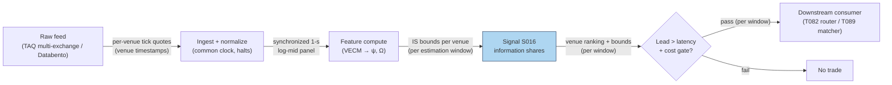

## Stage 16/200 — S016: Hasbrouck (1995) information share — venue price discovery

*Batch SB9 · Signal 16/100 · Provenance [D] · Family A — Microstructure & Order Flow*

### S1. One-line verdict

| | |
|---|---|
| **What it is** | For one security trading on several venues, the **information share (IS)** decomposes the innovation in the common *efficient price* across venues — it measures *where price discovery happens*, not what the price does next. |
| **When it works** | Fragmented markets (US equities, cross-listed stocks, FX): attributing price discovery across venues, routing market-data spend, and building cross-venue lead–lag features. |
| **When it dies** | As a directional trading signal — high IS is descriptive, not predictive; and when innovation correlation is high, Cholesky-ordering bounds swallow any point estimate. |
| **Build-or-buy in one line** | Build the VECM-to-IS pipeline (a day's work); buy synchronized multi-venue mids (TAQ/Databento) — garbage synchronization in, garbage attribution out. |

Provenance **[D]** (Hasbrouck 1995, *Journal of Finance*); never upgraded. The central honesty rule of this chapter: **report bounds, not one number** — the Cholesky ordering sensitivity below is the rule, not an artifact.

### S2. How it works — plain human explanation

**Price discovery** is the incorporation of new information into a security's price. The **efficient price** is the unobservable "true" value common to all venues — each venue's quote is the efficient price plus venue-specific noise. **Cointegration** keeps the venue prices from drifting apart (one long-run anchor), but *which* venue moves first when news arrives is an empirical question.

**Information share** answers it: fit a **VECM** (vector error-correction model — a VAR for cointegrated prices that includes each venue's pull back toward the common anchor), convert it to its moving-average form, and read off the **long-run impact vector** $\psi$ — how much a shock to each venue's price permanently moves the common efficient price. Combine with the **innovation covariance** $\Omega$ (how the venues' unexpected moves co-vary) via a **Cholesky decomposition** $\Omega = FF'$ (a way of attributing correlated shocks to venues one at a time, in a chosen order), and venue $j$'s share is $IS_j = ([\psi F]_j)^2 / (\psi\Omega\psi^\top)$: the proportion of the efficient price's permanent innovation attributable to venue $j$.

Picture three venues quoting the same stock. Venue A's mid ticks up 2¢, B and C follow 300 ms later. The VECM sees A's innovation *leading* the common move and credits A with most of the permanent innovation — A is where price discovery happened. But IS does *not* say the price goes up next (the innovation already happened), it doesn't say A's lead survives your latency and fees, and it doesn't distinguish "A had the informed traders" from "A reacts fastest to public news" or "B and C copy A." A high IS can mean faster public-info reaction, more informed flow, better liquidity, lower latency — or mechanical following. **The information-share statistic alone is descriptive, not predictive.**

- **Mental model 1:** Five thermometers in one room; IS tells you which thermometer's reading the room's "true temperature" follows — not what the temperature will be tomorrow.
- **Mental model 2:** The Cholesky ordering is a seating chart for correlated shocks: whoever sits first gets credit for the shared movement. Change the seating, change the credit — hence bounds, not point estimates.
- **Mental model 3:** This is a *routing and monitoring* tool that becomes a trading input only inside a conditional lead–lag model tested out-of-sample (T082, T089).

### S3. The math — exact formula

Let $p_t = (p_{1,t}, \dots, p_{n,t})^\top$ be the log mid-prices on $n$ venues (dollars in logs), cointegrated with known cointegrating vectors $\beta$ (e.g. pairwise spreads $p_1 - p_j$). The VECM:

$$\Delta p_t = c + \alpha\, \beta' p_{t-1} + \sum_{i=1}^{k-1} \Gamma_i\, \Delta p_{t-i} + \varepsilon_t, \qquad \Omega = \mathrm{Cov}(\varepsilon_t).$$

The moving-average form gives the common **long-run impact row vector** $\psi$ ($1 \times n$) — how much a shock to each venue's price permanently moves the efficient price. With the Cholesky factor $F$ ($\Omega = FF'$, lower triangular, for a given venue ordering), the **information share** of venue $j$ is:

$$IS_j = \frac{([\psi F]_j)^2}{\psi\,\Omega\,\psi^\top}, \qquad \sum_j IS_j = 1.$$

Because $F$ depends on the ordering, compute $IS_j$ for **all $n!$ orderings** and report $[\min, \max]$ bounds per venue. Complement: the **Gonzalo–Granger component share** (permanent–transitory decomposition weight) — a second attribution that agrees with IS when VECM residuals are uncorrelated and diverges otherwise.

| Parameter | Symbol | Typical range | Too small / too large | Default (example) |
|---|---|---|---|---|
| Venues | $n$ | 2–5 | Too many: $n!$ orderings explode; too few: misses the fragmenting venue | 3 *— example, not an institutional standard* |
| Sampling | $\Delta t$ | ≤1 s bars (example) | Too fine: asynchrony distorts $\Omega$; too coarse: the lead is arbitraged | 1-s synchronized mids *— example* |
| Estimation window | $T$ | minutes–days | Too short: $\psi$, $\Omega$ noisy; too long: structural breaks | 1 session *— example* |
| VECM lags | $k$ | 1–5 | Too few: residual autocorrelation biases $\Omega$; too many: overfit | 2 *— example* |

**Normalization:** log mid-prices, synchronized to a common clock (venue timestamps, millisecond-aligned). **Causal timing:** IS is estimated on a *history* window and used as a slow-moving venue attribute — not a per-bar trigger; any lead–lag trade built on it executes no earlier than $t+1$. **Variants:** (1) *trade-vs-quote decomposition* (Pascual et al. 2006); (2) *Hasbrouck lower/upper bounds* (min/max over orderings — the mandated default); (3) *time-varying IS* on rolling windows.

### S4. Worked example — step-by-step numbers (SYNTHETIC)

All numbers below are **synthetic** (seed **84**); the chart plots exactly these numbers. DGP: a common efficient price (random walk, $\sigma = \$0.01$) plus venue transitory noise with different persistence — Venue A fast/tight ($\rho = 0.10$, leads), Venue B medium ($\rho = 0.50$), Venue C slow/noisy ($\rho = 0.90$, lags); 5,000 one-second bars; VECM with known $\beta$ (pairwise spreads) and 1 lag of $\Delta p$.

**Step 1 — estimate.** The VECM yields $\psi = [0.2963,\ 0.2768,\ 0.2825]$ (nearly equal — the common efficient price loads on all venues) and $\Omega = [[0.000613,\ 0.000172,\ 0.000121],[0.000172,\ 0.000524,\ 0.000101],[0.000121,\ 0.000101,\ 0.000499]]$ (strong off-diagonals — the venues share the shock contemporaneously), with $\psi\Omega\psi^\top = 0.00019818$.

**Step 2 — one ordering.** For ordering (A, B, C), the Cholesky factor is $F = [[0.024763,\ 0,\ 0],[0.006953,\ 0.021815,\ 0],[0.004889,\ 0.003083,\ 0.021571]]$. Then $[\psi F]_A = 0.0106431$, and $IS_A = 0.0106431^2 / 0.00019818 = 0.5716 \approx \mathbf{0.572}$; likewise $IS_B = 0.241$, $IS_C = 0.187$.

**Step 3 — all six orderings: the bounds.** 

| Ordering | A | B | C |
|---|---|---|---|
| (A,B,C) | 0.572 | 0.241 | 0.187 |
| (A,C,B) | 0.572 | 0.180 | 0.248 |
| (B,A,C) | 0.326 | 0.486 | 0.187 |
| (B,C,A) | 0.240 | 0.486 | 0.274 |
| (C,A,B) | 0.395 | 0.180 | 0.424 |
| (C,B,A) | 0.240 | 0.336 | 0.424 |

**Venue bounds (the honest answer): A: 0.240–0.572 (avg 0.391); B: 0.180–0.486 (avg 0.318); C: 0.187–0.424 (avg 0.291).** The chart shows these as bars with whiskers.

**What to notice:** A was *designed* as the leader and averages highest — yet its bounds (24–57%) overlap B's and C's completely. A point estimate like "A = 39%" is spurious precision; the bounds are the result. **Limits:** synthetic; real venues have halts and tick-size differences, and this example has no latency.

### S5. Strategies that use this signal

- **T082 — Information-Share Venue Router** — primary trigger: routes orders to the price-discovering venue and avoids toxic venues — IS bounds are the routing table.
- **T089 — Quote-Matcher (SIP-vs-Direct)** — attribution input: micro-arbitrage on venue/SIP quote differences; IS identifies which venue's quotes lead so the matcher knows which side is stale.

### S6. Data required — exact spec

| Field | Type | Granularity | Source tier | Notes |
|---|---|---|---|---|
| Venue mid-prices (all $n$ venues) | numeric | ≤1-s, synchronized | Tier 2–3 | TAQ multi-exchange quotes or Databento multi-venue; venue (not SIP) timestamps |
| Venue trade prints (optional) | event | tick | Tier 2–3 | For the trade-vs-quote IS decomposition |
| Corporate actions / halts | reference | daily | Tier 0–1 | A halted venue drops out of the panel — handle explicitly |
| FX rates (cross-listed only) | numeric | matched frequency | Tier 1 | Convert to common currency before the VECM |

Ingest sketch (Python/polars, ≤20 lines):

```python
import polars as pl
frames = []
for venue in ["A", "B", "C"]:
    q = pl.read_parquet(f"quotes_{venue}.parquet")
    q = q.with_columns(mid=(pl.col("bid")+pl.col("ask"))/2,
                       ts=(pl.col("venue_ts").dt.round("1s")))
    frames.append(q.group_by("ts").agg(pl.col("mid").last().alias(venue)))
panel = frames[0]
for f in frames[1:]:
    panel = panel.join(f, on="ts", how="inner")   # common clock
panel = panel.with_columns(pl.all().exclude("ts").log().name.suffix("_log"))
```

Storage (per `notes/cost-model.md` §4): IS needs *tick* quotes per venue — L1 quotes+trades ≈ 2–8 GB/symbol-day parquet per venue feed; keep per-symbol-per-venue daily files and estimate on 1-s bars. Data-quality checklist: venue (never SIP) timestamps, millisecond alignment; locked/crossed quotes filtered; halts remove the venue for that interval; DST/half-days; tick-size differences across venues.

### S7. Local build on M5 Max / 128GB

**Feasibility: feasible** (Tier M — the VECM is small; the pain is synchronization). Per `notes/cost-model.md` §2, polars asof/rolling joins run ~1–10M rows/sec — synchronizing three venue quote streams to 1-s bars for a Dow-30-style panel is seconds; the VECM is OLS plus a $3 \times 3$ eigendecomposition per window — milliseconds in numpy. RAM: a 1-s bar panel for 30 symbols × 3 venues × 1 session is megabytes (§3); raw tick panels stay in per-symbol daily files. Engineering (per §5): Tier M, **20–60 h** ≈ **$3,000–9,000** at $150/hr loaded-cost estimate (multi-venue sync, VECM, Cholesky-bounds machinery, rolling leadership monitor). What breaks first at 500 symbols or full OPRA: the synchronization join across venues (Rust or pre-aggregated 1-s bars), and the $n!$ ordering combinatorics — cap $n$ or sample orderings.

| Stack | When to pick |
|---|---|
| Python + polars/numpy | Default: sync, VECM, IS bounds, leadership monitoring |
| Rust | Only for tick-level multi-venue sync at full universe scale |
| DuckDB | Ad-hoc IS studies over archived multi-venue panels |

### S8. Buy vs build

Vendor price bands per `notes/cost-model.md` §6.

| Option | What you get | Indicative price | Gains | Loses |
|---|---|---|---|---|
| Tier-0/1 (SIP consolidated) | One NBBO tape | ~$0–200/mo *indicative — verify before budgeting* | Cheap | No per-venue attribution possible — IS needs venue-identified quotes |
| Tier-2 (Databento multi-venue) | Per-venue L1 with venue timestamps | ~$200/mo + usage *indicative — verify before budgeting* | Honest synchronization for IS | Usage meter on full universes |
| Tier-3 (TAQ via WRDS) | Full multi-exchange history | institutional/academic *indicative — verify before budgeting* | Gold-standard replay | Licensing friction |
| Build the estimator | VECM → $\psi$, $\Omega$ → IS bounds | eng time only | Your own orderings, windows, decompositions | — |

**Verdict: build the pipeline, buy venue-identified data.** The econometrics is a day's work and must be yours; SIP data cannot answer "which venue" by construction. Crossover: for a *single* venue's lead–lag vs the SIP, Tier-1 plus a lead–lag regression (S059/S060) is cheaper than multi-venue IS.

### S9. Success ratio / efficacy — documented evidence

| Study / source | Market & period | Metric | Before/after cost | Caveat |
|---|---|---|---|---|
| Hasbrouck (1995), *J. Finance* | 30 Dow stocks | Median **92.7%** information share for the NYSE | Before-cost (descriptive) | 1995 fragmentation; specialist era — magnitudes not portable |
| Su & Chong (2007), *Pacific-Basin Finance J.* | Chinese NYSE/SEHK cross-listings | SEHK **89.4%** IS (81.6% Gonzalo–Granger PT) vs NYSE | Before-cost (descriptive) | Cross-listed, overlapping-hours subsample |
| Pascual, Pascual-Fuster & Climent (2006), *J. Financial Markets* | Spanish cross-listed stocks, 2-hr overlap | NYSE contribution decomposed into trade-related vs trade-unrelated informative shocks | Before-cost (descriptive) | Working-paper version; overlap-window only |

Regimes where it fails: leadership changes (the "dominant" venue of 1995 is not the dominant venue of 2026); high correlation regimes where bounds go uninformative; sampling asynchrony manufacturing spurious leads; news regimes where all venues react to the same public signal. **Honest bottom line:** as a standalone directional signal this has no documented edge — the evidence base is *attribution*, and every number above is before-cost and descriptive. As a venue-routing input (T082) and quote-staleness detector (T089), it earns its keep: knowing *where* discovery happens tells you which feed to buy, which quotes to trust, and which venue's moves deserve a response.

### S10. Failure modes & pitfalls

1. **Cholesky-ordering shopping** (reporting the ordering most favorable to your venue) → mitigate: always report min/max bounds over all $n!$ orderings.
2. **Sampling asynchrony** (stale prints look like a "lag") → mitigate: venue timestamps, common-clock bars, drop bars where any venue is stale.
3. **Cointegration failure** (halts, tick-size regimes, FX moves break the anchor) → mitigate: test cointegration per window; suspend attribution when it fails.
4. **Structural breaks in leadership** → mitigate: rolling windows; change-point monitoring on the bounds.
5. **Endogeneity** (all venues react to the same news) → mitigate: news-time controls; don't trade the lead without a conditional model tested out-of-sample.
6. **Latency erasing the lead** (measured lead 300 ms; your round trip 800 ms) → mitigate: compare the lead horizon against measured latency + fees before any trading claim.
7. **Over-interpreting a high IS** → mitigate: remember the four readings of high IS — the statistic doesn't choose among them.

### S11. Visuals




### S12. Sources

1. Hasbrouck, Joel (1995). "One Security, Many Markets: Determining the Contributions to Price Discovery." *Journal of Finance* 50(4): 1175–1199. http://ideas.repec.org/a/bla/jfinan/v50y1995i4p1175-99.html
2. Su, Qian & Chong, Terence Tai-Leung (2007). "Determining the contributions to price discovery for Chinese cross-listed stocks." *Pacific-Basin Finance Journal* 15(2): 140–153. https://www.sciencedirect.com/science/article/abs/pii/S0927538X06000643
3. Pascual, Roberto, Pascual-Fuster, Bartolomé & Climent, Francisco (2006). "Cross-listing, price discovery and the informativeness of the trading process." *Journal of Financial Markets* 9: 144–161. (Stable URL not captured this batch.)
4. Gonzalo, Jesús & Granger, Clive W. J. (1995). "Estimation of common long-memory components in cointegrated systems." *Journal of Business & Economic Statistics* 13: 27–35. (Component-share complement.)
5. Federal Reserve Bank of New York. Staff Report on FX market price discovery and the shifting locus of trading (working-paper PDF captured in this batch's research notes). https://www.newyorkfed.org/medialibrary/media/research/staff_reports/sr624.pdf

**Unverified leads** (batch-research claims without an independently checkable source this batch):
- Duck.ai Q-SB9-3 information-share summary (verified formula): $IS_j = ([\psi F]_j)^2/(\psi\Omega\psi^\top)$; "descriptive, not predictive"; the six limitations (Cholesky ordering, cointegration assumption, sampling sensitivity, structural breaks, endogeneity, latency).
- NY Fed FX price-discovery staff study findings as summarized by the bot — working-paper PDF captured above; treat the summary as a lead.
- Source log: Duck.ai answered Q-SB9-1–Q-SB9-3 (2026-09-10); Grok/Cursor answers pending (checked 2026-09-10).
