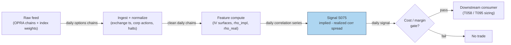

## Stage 75/200 — S075: Dispersion trading

*Batch SB9 · Signal 75/100 · Provenance [D] · Family E — Volatility & Options-Informed*

### S1. One-line verdict

| | |
|---|---|
| **What it is** | Harvests the gap between index option-implied correlation and realized constituent correlation (long constituent vol, short index vol, or reverse). |
| **When it works** | Calm-to-moderate regimes where implied correlation mean-reverts and realized correlations stay dispersed. |
| **When it dies** | Correlation spikes (2008-style): correlations → 1, index IV explodes, constituent hedges go illiquid. |
| **Build-or-buy in one line** | Build the analytics yourself, but you must *buy* the options data — there is no free full-chain OPRA feed. |

Provenance **[D]** · Family E — Volatility & Options-Informed.

### S2. How it works — plain human explanation

**Dispersion** is the tendency of index volatility and the volatilities of the index's constituents to disagree. A **variance swap** is a contract paying the difference between realized variance over its life and a fixed strike variance — its fair strike is roughly the market's expectation of future variance. **Implied volatility (IV)** is the volatility number that makes an option's market price equal its model price. **Implied correlation** is the single correlation number that makes the index's implied variance consistent with the constituents' implied variances.

Picture a calm Tuesday: the S&P 500's 1-month implied volatility sits at 24% while the average single-stock IV is 35%. The index options imply a correlation of only 0.39 — but realized correlation has been running 0.30. The classic dispersion trade *sells* index volatility (short index straddles or variance swaps — a **straddle** is a call plus a put at the same strike, a pure volatility position) and *buys* constituent volatility (long single-stock straddles), **delta-hedging** both legs (neutralizing directional exposure by trading the underlying against the option position). If realized correlation comes in below the implied correlation you sold, the index leg decays faster than the constituent legs, and the spread earns money.

Why should the edge exist? Two competing stories. (1) **Correlation-risk compensation**: the premium is payment for bearing correlation risk — correlations spike exactly when you are short index vol, so the premium is earned risk compensation. (2) **Market inefficiency**: structural supply/demand (institutional put buying vs. dealer/hedge-fund single-stock option selling) misprices the index-vs-constituent volatility surface. Deng (2008) tests these against each other using the late-1999/2000 institutional changes in the US options market as a natural experiment, and finds the profitability *changed* when market structure changed — supporting inefficiency over a stable risk premium (label: research lead — see S9/S12).

- **Mental model 1:** You are an insurance company selling correlation insurance — small steady premiums, occasional catastrophic claims.
- **Mental model 2:** Index puts are structurally overbought; single-stock options are structurally oversold. Dispersion arbitrages the spread between those two clienteles.
- **Mental model 3:** Net delta near zero understates risk: your true exposure is to correlation and to index vega (sensitivity to IV changes), not direction.

The honest core, straight from the literature: the premium "is compensation for correlation + liquidity risk." The 2008-style break — correlations → 1, index puts extremely expensive, constituent hedges illiquid — is precisely the wrong environment for a small account: margin expands, spreads widen, forced hedging at worst prices.

### S3. The math — exact formula

Index variance decomposes into constituent variances plus pairwise correlation terms:

$$\sigma_I^2 = \sum_{i=1}^{n} w_i^2 \sigma_i^2 + 2\sum_{i<j} w_i w_j \rho_{ij}\, \sigma_i \sigma_j$$

where $\sigma_I$ = index implied volatility, $\sigma_i$ = constituent $i$ implied volatility, $w_i$ = index weight of constituent $i$ (weights sum to 1), and $\rho_{ij}$ = implied pairwise correlation.

Solving for one common pairwise correlation gives the **implied correlation**:

$$\rho_{\text{impl}} = \frac{\sigma_I^2 - \sum_i w_i^2 \sigma_i^2}{\sum_{i \ne j} w_i w_j\, \sigma_i \sigma_j}$$

and the signal is its spread vs. realized correlation:

$$\text{signal}_t = \rho_{\text{impl},t} - \rho_{\text{real},t}(W)$$

with $\rho_{\text{real},t}(W)$ the average pairwise realized constituent correlation over window $W$. Classic direction: **long constituent variance / short index variance** when $\text{signal}_t > +\kappa$ (*example* $\kappa \approx 0.10$–$0.15$ — *not an institutional standard*); reverse or stand down when the spread is negative or realized correlation is spiking. Computed at day $t$'s close on data $\le t$; tradable no earlier than $t+1$.

| Parameter | Symbol | Typical range | Too small | Too large | Default (example) |
|---|---|---|---|---|---|
| Entry spread threshold | $\kappa$ | 0.05–0.20 | Overtrading, costs dominate | Never trades | 0.10 |
| Realized-corr window | $W$ | 20–60 trading days | Noisy $\rho_{\text{real}}$ | Stale, misses regime shifts | 30 days |
| Constituent count | $n$ | 30–100 | Idiosyncratic noise | Hedging cost explosion | 50 |
| Option tenor | $T$ | 1–3 months | Gamma/transaction churn | Vega-dominant, slow | 1 month |
| Delta-hedge frequency | — | daily–intraday | Gamma bleed | Trading costs | daily |

*All defaults are examples — not institutional standards.*

**Normalization:** work in correlation *spread* units (dimensionless), or z-score the spread against its own 1-year history. **Variants:** straddle-based (listed options) vs. variance-swap-based (OTC, cleaner math); equally-weighted vs. index-weighted legs; vega-neutral vs. gamma-weighted sizing. The Cboe Implied Correlation Index (tickers KCJ/ICJ) disseminates the market price of expected 1-year SPX constituent correlation — a ready-made dispersion-regime gauge.

### S4. Worked example — step-by-step numbers (SYNTHETIC)

All numbers below are **synthetic** — a hand-built 10-day illustration, not market data and not a backtest. Random seed **75** (`np.random.default_rng(75)`; only the filler bars use it). Equal weights, three stocks A/B/C with IVs 33/35/37.

Day 1 check: $\sigma_I^2 = 27^2 = 729$; $\sum w^2\sigma_i^2 = (33^2+35^2+37^2)/9 = 409.22$; $\sum_{i\ne j} w_iw_j\sigma_i\sigma_j = 2(33{\cdot}35+33{\cdot}37+35{\cdot}37)/9 = 815.78$; so $\rho_{\text{impl}} = (729-409.22)/815.78 = \mathbf{0.3920}$.

Daily P&L uses two illustrative scalings, both stated as examples: **$1,000 per correlation point** on the $\rho_{\text{impl}} - \rho_{\text{real}}$ spread, and **−$1,000 per vol point** of index-IV increase on the short index leg (vega bleed).

| Day | Index IV | $\rho_{\text{impl}}$ | $\rho_{\text{real}}$ | Spread P&L ($) | Index vega P&L ($) | Daily total ($) | Cumulative ($) |
|---|---|---|---|---|---|---|---|
| 1 | 27.0 | 0.3920 | 0.30 | +92.0 | 0 | +92.0 | +92.0 |
| 2 | 27.0 | 0.3920 | 0.28 | +112.0 | 0 | +112.0 | +204.0 |
| 3 | 27.0 | 0.3920 | 0.32 | +72.0 | 0 | +72.0 | +276.0 |
| 4 | 27.0 | 0.3920 | 0.29 | +102.0 | 0 | +102.0 | +378.0 |
| 5 | 27.0 | 0.3920 | 0.31 | +82.0 | 0 | +82.0 | +460.0 |
| 6 | 27.0 | 0.3920 | 0.30 | +92.0 | 0 | +92.0 | +551.9 |
| 7 | 30.0 | 0.6016 | 0.55 | +51.6 | −3,000 | −2,948.4 | −2,396.4 |
| 8 | 33.0 | 0.8333 | 0.75 | +83.3 | −3,000 | −2,916.7 | −5,313.2 |
| 9 | 38.0 | 0.8536 | 0.92 | −66.4 | −5,000 | −5,066.4 | −10,379.5 |
| 10 | 40.0 | 1.0000 | 0.97 | +30.0 | −2,000 | −1,970.0 | −12,349.5 |

**What to notice:** days 1–6 earn a slow, steady +$552 while realized correlation sits below implied — the insurance-premium phase. On day 7 stress arrives: implied correlation rises (the market *sees* the correlation risk coming), but the damage comes from the index-IV repricing on the short leg, not the correlation spread itself. By day 10 implied correlation hits 1.0000 and six days of gains are buried under −$12,350. Limits of this toy: fixed scalings, no option bid–ask, no delta-hedging cost, no margin calls, 3 names. It illustrates the payoff shape, not profitability.

### S5. Strategies that use this signal

- **T058 — Dispersion Trader** — primary trigger: long single-stock realized vol vs. short index vol, VRP-aware (uses S075, S063, S069). This signal *is* the strategy's entry logic.
- **T095 — Dispersion + GEX Regime Switch** — runs dispersion only when the dealer-gamma regime is supportive (uses S075, S074, S068). S075 supplies the correlation-spread trigger; S074 (GEX) acts as the regime gate/veto — dispersion is stood down when dealer positioning makes correlation spikes likely.

### S6. Data required — exact spec

| Field | Type | Granularity | Source tier | Notes |
|---|---|---|---|---|
| Index option chain (IV by strike/tenor) | float (IV, OI, volume) | daily EOD snapshots (intraday for hedging) | Tier 2 | OPRA; SPX/OEX or ETF (SPY) chains |
| Constituent option chains | float | daily EOD snapshots | Tier 2 | 30–100 underlyings; OI filter for liquidity |
| Index weights | float | daily | Tier 0/1 | Index factsheet or vendor |
| Dividends / borrow rates | float | daily | Tier 1/2 | For variance-swap fair value; hard-to-borrow names distort |
| Underlying prices (hedging) | float | 1-min bars | Tier 1 | For daily delta hedging |

Collection (Databento OPRA example, ≤20-line sketch):

```python
import databento as db
client = db.Historical("YOUR_KEY")          # key via approved credential flow
job = client.timeseries.get_range(
    dataset="OPRA.PILLAR",                  # OPRA full chain
    symbols=["SPX.OPT", "AAPL.OPT"],        # index + constituents
    schema="definition",                    # chain definitions
    start="2026-08-01", end="2026-09-10")
store = job.to_parquet("opra_chains.parquet")
# downstream: fit IV surface per underlying -> compute rho_impl daily
```

Storage per cost-model §4: OPRA full-chain snapshots ≈ **1–3 GB/day (SPX-like)** — selective underlyings only; 60 days of the 50-name chain ≈ 60–180 GB on disk.

**Data-quality checklist:** chain timestamps in exchange time; corporate actions adjusted before IV fitting; halts → drop the underlying that day; OI/volume liquidity filter on single-name tenors; borrow-rate spikes flagged; DST/half-day calendars.

### S7. Local build on M5 Max / 128GB

**Feasibility: feasible for research, heavy for production** (Tier H per cost-model §5: 60–200 h ≈ **$9,000–$30,000** loaded-cost estimate at $150/hr — full-chain OPRA analytics, surface fitting, and multi-leg hedging sit in the H tier).

- **Throughput** (cost-model §2): IV-surface fitting is numpy-vectorized (~50–200M elements/sec); a 50-name daily chain refit takes seconds. Intraday delta hedging on 1-min bars for 50 names = 19,500 bars/day — trivial for polars (~10–50M rows/sec). Bottleneck is **data I/O and licensing**, not arithmetic.
- **RAM** (cost-model §3): one SPX-like chain snapshot ≈ 100–300 MB; 8 snapshots/day ≈ 1–2.5 GB/day live — fits inside the 77 GB working budget if you keep fitted surfaces, not raw ticks. 60 days of fitted surfaces ≈ tens of GB — fits with care.
- **Stack:** Python + polars + numpy for research; DuckDB for the chain archive. Rust only for intraday chain streaming.
- **What breaks first at 500 symbols:** the OPRA feed itself — full-chain real-time for 500 underlyings is institutional $$$$ data and TB-scale storage (cost-model §4 warns: do not archive naively). Breakage order: data bill → disk → your ability to delta-hedge, long before the M5 Max's CPU.

### S8. Buy vs build

| Option | What you get | Indicative price | Gains | Loses |
|---|---|---|---|---|
| Tier-0 free route | Stooq daily bars, Cboe delayed quotes page | ~$0 | Regime gauges (KCJ/ICJ levels), weights | No chains, no history, no backtest |
| Tier-1 retail (Cboe delayed options data) | Coarse Greeks, straddle moves | ~$0–50/mo | Cheap signal prototyping | Too coarse for real implied-corr math |
| Tier-2 professional (Databento OPRA) | Full chain snapshots, research-grade | ~$200/mo + usage | Honest IV surfaces, real backtests | Usage meter runs on full-universe pulls |
| Academic/institutional (OptionMetrics IvyDB) | Publication-quality options history | ~$thousands/yr academic; institutional $$$$ | Clean adjusted history | Price; redistribution limits |

*All prices indicative — verify before budgeting.*

**Verdict: build if** you need custom correlation estimators, your own hedging rules, or microstructure honesty around which tenors are actually tradeable. **Buy if** you need full OPRA chain history or borrow/term-structure panels — building those means re-licensing anyway. **Crossover:** buy Databento OPRA for the raw chains (~$200/mo + usage, indicative), build the implied-correlation engine yourself.

### S9. Success ratio / efficacy — documented evidence

| Study / source | Market & period | Metric | Before/after cost | Caveat |
|---|---|---|---|---|
| Deng (2008), "Volatility Dispersion Trading", SSRN | US index + single-stock options; natural experiment of late-1999/2000 institutional changes | Dispersion profitability *changed* after structural options-market changes → supports inefficiency over stable risk premium | Before-cost (cost detail not in available abstract) | Research lead: abstract-level; full text paywalled |
| Ferrari, Poy, Abate (2019), S&P 100 options backtest | S&P 100 options | Risk-adjusted return beat buy-and-hold; low market correlation | Before-cost (costs not detailed in available summary) | Research lead: timing + Bollinger overlay; model-dependent |
| Variance-swap dispersion study (MPRA 22318) | EuroStoxx 50, Jan 2005–Dec 2006 | Systematic short index variance / long constituents: positive mean 3-month returns | Explicitly **before-cost** (zero transaction costs assumed) | Author notes the market got more efficient and later profits were lower than historically |
| Quantpedia literature summary (unverified lead) | 1996–2007 backtest summary | "15.39% return" cited | Before/after-cost unknown | **Historical, model-dependent, NOT expected return** — quarantined as a research lead |

Regimes where it fails: correlation spikes (2008-style: correlations → 1, index puts extremely expensive, constituent hedges illiquid, dealers and funds hedging simultaneously) and volatility-of-volatility explosions. Documented decay: Deng measures a sharp decrease in performance since 2000; the MPRA study notes declining profits as the market got more efficient.

**Honest bottom line:** as a standalone trigger this is a *structural but capacity-constrained* edge — the index-vs-single-name vol/correlation premium is real in the historical record, but it is compensation for correlation and liquidity risk that realizes violently. As a regime-gated harvester (cf. T095) it is more defensible. For a ≤$1M paper operation the capital intensity (index leg + dozens of constituent option legs + daily delta hedging + short-option margin + stress collateral) makes it one of the hardest signals in this document to run small.

### S10. Failure modes & pitfalls

1. **Correlation-spike break (and hidden vega)** — correlations → 1, short index leg detonates; near-zero net delta hides the real exposure. *Mitigation:* hard cap on index vega; stand down when KCJ/ICJ or realized correlation spikes (T095's GEX gate); risk-report on $\partial\sigma_I^2/\partial\rho_{ij} = 2w_iw_j\sigma_i\sigma_j$, not delta.
2. **Liquidity illusion in constituent hedges** — single-name options go one-sided in stress. *Mitigation:* OI/volume liquidity filters; fewer, more-liquid names.
3. **Margin expansion** — short-option margin and stress collateral spike exactly when P&L is worst. *Mitigation:* pre-fund stress collateral; size to stressed margin, not current.
4. **Discrete-rebalance error** — variance-swap math assumes continuous hedging; daily hedging leaks P&L. *Mitigation:* model discrete hedging explicitly; widen the required edge by the slippage estimate.
5. **Dividend/borrow distortion** — special dividends and hard-to-borrow names corrupt IV. *Mitigation:* borrow-rate feed; exclude or haircut affected names.
6. **Surface model risk** — implied correlation depends on your IV interpolation. *Mitigation:* compute with two surface methods; trade only when they agree.
7. **Crowding** — every vol desk runs dispersion; unwinds correlate. *Mitigation:* monitor dealer positioning (S074); reduce into crowded regimes.

### S11. Visuals




### S12. Sources

1. Bakshi, G. & Kapadia, N. (2003). "Delta-Hedged Gains and the Negative Market Volatility Risk Premium." *Journal of Derivatives*, Fall 2003. http://people.umass.edu/nkapadia/docs/Bakshi_Kapadia_JoD_Fall_2003.pdf — negative market volatility risk premium: index options priced above subsequently realized volatility; foundational for the index-leg richness dispersion harvests.
2. Deng, Q. (2008). "Volatility Dispersion Trading." SSRN. https://papers.ssrn.com/sol3/papers.cfm?abstract_id=1156620 — profitability changed after the late-1999/2000 structural options-market changes, supporting the inefficiency hypothesis over a stable risk premium.
3. Ferrari, P., Poy, G. & Abate, G. (2019). "Dispersion trading: an empirical analysis on the S&P 100 options." *Investment Management and Financial Innovations*, 16(1), 178–188. http://dx.doi.org/10.21511/imfi.16(1).2019.14 — S&P 100 backtest; risk-adjusted return beat buy-and-hold with low market correlation.
4. "Dispersion Trading Based on the Explanatory Power of S&P 500 Stock Returns." *Mathematics* (MDPI), 2020. https://www.mdpi.com/2227-7390/8/9/1627 — net buying pressure on index options vs. net selling pressure on single-stock options creates the IV mispricing.
5. Dispersion P&L decomposition (variance-swap gamma P&L = correlation exposure + vega/volga/vanna terms). http://arxiv.org/pdf/1004.0125v1 — formalizes the split into a correlation-spread term and a volatility term.

**Unverified leads** (chatbot-provided or second-hand; not confirmed facts — verify before use):
- Quantpedia literature summary citing a "15.39% return 1996–2007 backtest" for dispersion — historical, model-dependent summary; NOT an expected return.
- Driessen, Maenhout & Vilkov (2009): large negative *index* variance risk premium with no evidence of a negative premium on *individual* variance risk — cited as summarized in an NYU Stern survey document (https://www.stern.nyu.edu/sites/default/files/assets/documents/con_040081.pdf); full text not independently opened.

---
