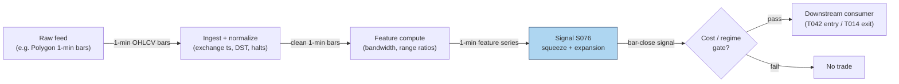

## Stage 76/200 — S076: Volatility breakout / squeeze positioning

*Batch SB9 · Signal 76/100 · Provenance [D/SR] · Family E — Volatility & Options-Informed*

### S1. One-line verdict

| | |
|---|---|
| **What it is** | Positions for volatility expansion: enters when a bar's range explodes past its recent average, or when Bollinger bandwidth has squeezed to a historic low. |
| **When it works** | Genuine regime shifts — scheduled events, breakouts with follow-through — where realized volatility actually expands after the signal. |
| **When it dies** | Choppy, mean-reverting regimes: the breakout reverses, the time stop exits at a loss, and costs compound. |
| **Build-or-buy in one line** | Build — it is a few dozen lines on 1-min bars; nothing worth buying. |

Provenance **[D/SR]** · Family E — Volatility & Options-Informed.

### S2. How it works — plain human explanation

A **range-expansion** bar is a bar whose high–low range is a large multiple of its recent average — the market suddenly moving much more than it has been. A **Bollinger bandwidth squeeze** is the opposite setup: **Bollinger Bands** (a moving average plus/minus two standard deviations) pinch to their narrowest width in months, meaning volatility has compressed to an extreme. **Realized volatility** is volatility that actually happened (measured from price changes); the premise of the squeeze is volatility clustering — quiet periods are followed by loud ones, a fact documented since Engle (1982).

Picture 9:47 AM: a stock has chopped between $100.20 and $100.28 for two hours, bandwidth at its 5th percentile of the last six months. Then a headline hits; the next 1-minute bar prints $100.05–$100.59 — a range 7× its 10-bar average — and closes above the upper band. The signal says: volatility regime has changed; position for expansion in the bar's direction with a **time stop** (exit after a fixed number of bars, because the edge, if any, is short-lived).

Why should it work? Two mechanisms. First, genuine information arrival: scheduled events and real breakouts produce persistent directional range expansion. Second, positioning cascades: a volatility breakout forces hedgers and stop-losses to trade, extending the move. But the honest framing, confirmed by large-scale testing: the squeeze tells you *that* a move is coming, not *which way*. Volatility clustering predicts the magnitude of future movement, not its direction. A **false breakout** (or **whipsaw**) — the bar breaks out, you enter, price reverses — is the modal outcome in range-bound regimes, and each one costs spread plus fees plus the time stop's giveback.

- **Mental model 1:** The squeeze is a coiled spring detector — it measures compression, not aim.
- **Mental model 2:** Range expansion is a regime-change alarm — it fires on real news and on noise alike; the time stop is what keeps the noise affordable.
- **Mental model 3:** You are buying realized volatility after it starts expanding — you will always be late; the question is whether the move has a second leg.

### S3. The math — exact formula

**Range expansion.** Let $R_t = H_t - L_t$ be bar $t$'s range and $\bar{R}_{t-1}^{(N)} = \frac{1}{N}\sum_{i=1}^{N} R_{t-i}$ its trailing mean. Signal when:

$$\frac{R_t}{\bar{R}_{t-1}^{(N)}} > k \quad \text{(enter in the direction of bar } t\text{'s close vs. open)}$$

with $k \approx 1.5$–$2.0$ (*example — not an institutional standard*; the worked example uses $k = 1.75$).

**Bollinger bandwidth squeeze.** With $N$-bar moving average $\text{MA}_t^{(N)}$ and standard deviation $\sigma_t^{(N)}$:

$$\text{BW}_t = \frac{(\text{MA}_t^{(N)} + 2\sigma_t^{(N)}) - (\text{MA}_t^{(N)} - 2\sigma_t^{(N)})}{\text{MA}_t^{(N)}} = \frac{4\sigma_t^{(N)}}{\text{MA}_t^{(N)}}$$

Squeeze when $\text{BW}_t$ is at or below the $p$-th percentile of its trailing $M$-bar history (*example:* $p = 10$, $M \approx 126$ trading days ≈ 6 months — the practitioner standard; Bollinger's own definition is the lowest bandwidth in the past 125 periods). The combined signal: **squeeze armed** (bandwidth percentile ≤ $p$) **and then** an expansion bar or a close outside the bands → enter in the breakout direction; exit on a time stop of $H$ bars (*example:* 3–6 bars).

Causal timing: computed at bar $t$'s close using only data $\le t$; tradable no earlier than bar $t+1$'s open.

| Parameter | Symbol | Typical range | Too small | Too large | Default (example) |
|---|---|---|---|---|---|
| Expansion multiple | $k$ | 1.5–2.5 | Noise triggers, overtrading | Misses real expansions | 1.75 |
| Range lookback | $N$ | 10–20 bars | Jumpy reference | Slow to adapt | 10 |
| Band lookback | $N$ (bands) | 10–20 bars | Twitchy bands | Squeeze never registers intraday | 10 |
| Squeeze percentile | $p$ | 5–15% | Almost never armed | Not a real squeeze | 10% |
| Squeeze history | $M$ | 60–180 days | Percentile meaningless | Ancient regimes pollute | 126 days |
| Time stop | $H$ | 3–10 bars | Chops winners early | Gives back the move | 6 bars |

*All defaults are examples — not institutional standards.*

**Normalization:** bandwidth percentile is already normalized; the range ratio is self-normalizing. **Variants:** expansion-only (no squeeze arming — more trades, lower quality); squeeze + close-outside-band (Bollinger's original); Crabel-style opening-range expansion; close-position filter (close in top/bottom quartile of the expansion bar).

### S4. Worked example — step-by-step numbers (SYNTHETIC)

**Synthetic** 60-bar 1-minute series, random seed **76** (`np.random.default_rng(76)`; only filler bars 51–59 use randomness — all signal bars are fixed). 10-bar, 2σ bands (*example* parameter); bandwidth percentile over a trailing 20-bar window (*illustrative short window — practitioner standard is 6 months*); range ratio vs. 10-bar average range with $k = 1.75$.

**Tape A — squeeze → true breakout (bars 27–32):**

| Bar | O | H | L | C | Range | 10-bar avg range | Ratio | BW pct | Upper | Lower |
|---|---|---|---|---|---|---|---|---|---|---|
| 27 | 100.24 | 100.26 | 100.21 | 100.23 | 0.05 | 0.086 | 0.62 | 5.3% | 100.25 | 100.16 |
| 28 | 100.24 | 100.27 | 100.21 | 100.24 | 0.05 | 0.081 | 0.67 | 5.0% | 100.25 | 100.17 |
| 29 | 100.24 | 100.27 | 100.21 | 100.24 | 0.05 | 0.077 | 0.70 | 5.0% | 100.25 | 100.18 |
| 30 | 100.26 | 100.74 | 100.20 | 100.67 | 0.54 | 0.073 | **7.37** | 100% | 100.55 | 99.99 |
| 31 | 100.70 | 100.91 | 100.57 | 100.77 | 0.34 | 0.118 | 2.88 | 100% | 100.74 | 99.91 |
| 32 | 100.77 | 101.01 | 100.65 | 100.86 | 0.35 | 0.143 | 2.46 | 100% | 100.92 | 99.86 |

Bar 29: squeeze armed (BW at 5th percentile). Bar 30: range 7.37× average, close 100.67 > upper band 100.55 → expansion signal. Entry bar 31 open 100.70; 6-bar time stop → exit bar 36 close 101.21. Gross +$0.510/share; costs (half-spread $0.01 + fee $0.003 per side, an *example* schedule) = $0.026/share → **net +$0.484/share (+$242 on 500 shares)**.

**Tape B — expansion false breakout (bars 44–49):**

| Bar | O | H | L | C | Range | 10-bar avg range | Ratio | BW pct | Upper | Lower |
|---|---|---|---|---|---|---|---|---|---|---|
| 44 | 100.81 | 100.86 | 100.76 | 100.80 | 0.09 | 0.192 | 0.50 | 50% | 101.22 | 100.65 |
| 45 | 100.80 | 100.85 | 100.75 | 100.79 | 0.09 | 0.169 | 0.56 | 35% | 101.16 | 100.64 |
| 46 | 100.81 | 101.46 | 101.00 | 101.32 | 0.46 | 0.148 | **3.12** | 55% | 101.24 | 100.59 |
| 47 | 101.35 | 101.48 | 101.11 | 101.22 | 0.37 | 0.164 | 2.25 | 60% | 101.31 | 100.56 |
| 48 | 101.22 | 101.37 | 100.96 | 101.08 | 0.41 | 0.174 | 2.33 | 60% | 101.33 | 100.56 |
| 49 | 101.08 | 101.21 | 100.87 | 100.97 | 0.33 | 0.200 | 1.68 | 55% | 101.34 | 100.57 |

Bar 46: range 3.12× average and close 101.32 > upper band 101.24 — but note the *weaker* setup: no squeeze arming (BW percentile 35–55%, not ≤10%) and the band break is only $0.08 vs. $0.12 on the true breakout. Entry bar 47 open 101.35; price reverses; 3-bar time stop → exit bar 49 close 100.97. Gross −$0.380/share → **net −$0.406/share (−$203 on 500 shares)**.

**What to notice:** the two trades net +$39 combined — the winner barely covers the loser plus costs. That *is* the lesson: expansion signals are roughly coin-flips on direction; profitability comes entirely from (a) requiring squeeze arming, (b) sizing the time stop to the regime, and (c) costs staying small relative to the average expansion move. This toy has no partial fills, no slippage beyond the spread, and hand-picked bars — it demonstrates mechanics, not profitability.

### S5. Strategies that use this signal

- **T042 — Jump-Robust Vol Spike Trader** — primary trigger: trades bipower-variation / Lee–Mykland jump-filtered vol spikes (uses S064, S065, S076). S076 supplies the raw expansion trigger; S064/S065 veto the jumps that are microstructure noise rather than regime change.
- **T014 — Bollinger Reversal + Squeeze Exit** — exit/cover leg: fades band tags but *covers into bandwidth-squeeze expansions and vol breakouts* (uses S041, S030, S076). S076 acts as the adverse-regime veto — when expansion fires, the reversal book stands down.
- **T041 — HAR Vol-Timing Overlay** — regime input: scales all intraday positions by HAR realized-vol forecasts (uses S066, S067, S076). S076 flags expansion regimes where the overlay cuts size.
- **T050 — GEX Pin / Dealer-Positioning Fade** — context leg (uses S074, S070, S076): S076's expansion signal tells the pin-fade when the pinning regime has broken.
- **T019 — Donchian/Keltner Breakout + Vol Sizing** — sizing leg (uses S028, S029, S076): S076 gates position size by volatility-breakout regime.

### S6. Data required — exact spec

| Field | Type | Granularity | Source tier | Notes |
|---|---|---|---|---|
| OHLCV bars | float/int | 1–5 min bars | Tier 1 | Any OHLCV vendor; RTH session filter |
| Corporate actions | adjustment factors | daily | Tier 1 | Splits/dividends before band computation |

Collection (Polygon example, ≤20-line sketch):

```python
import requests, polars as pl
resp = requests.get(                                   # key via approved credential flow
  "https://api.polygon.io/v2/aggs/ticker/SPY/range/1/minute/2026-09-09/2026-09-10",
  params={"apiKey": "YOUR_KEY", "limit": 50000}).json()
bars = pl.DataFrame(resp["results"]).with_columns(
  pl.from_epoch("t", "ms").dt.convert_time_zone("America/New_York").alias("ts"))
# downstream: rolling(10) mean/std -> bands; rolling range ratio; bandwidth percentile
```

Storage per cost-model §4: 1-min bars for 500 symbols ≈ **50 MB/day** total; 60 days ≈ 3 GB — archive freely.

**Data-quality checklist:** timestamps in exchange time (DST/half-days); corporate actions adjusted; halts → exclude bars; zero-range RTH bars flagged; late prints not used for signal bars.

### S7. Local build on M5 Max / 128GB

**Feasibility: trivial** (per cost-model §5 this is Tier L: 4–12 h ≈ **$600–$1,800** loaded-cost estimate at $150/hr — justified: 1-min bar signals with rolling statistics are the textbook Tier-L workload).

- **Throughput** (cost-model §2): 500 symbols × 390 bars = **195,000 bars/day**; polars rolling aggregations run at ~10–50M rows/sec — the full universe recomputes in milliseconds. A Python event loop at ~100–500k events/sec is also ample. Bottleneck: none locally; data-vendor rate limits, if anything.
- **RAM** (cost-model §3): 1-min OHLCV for 500 symbols × 60 days ≈ **12 MB** — four orders of magnitude inside the 77 GB working budget.
- **Stack:** Python + polars (pick this; nothing else needed). Rust/DuckDB only if this becomes one feature among thousands in a shared engine.
- **What breaks first at 500 symbols:** nothing about compute — the failure mode is *signal* quality: 500-symbol expansion screens generate correlated false breakouts on macro headlines, so the breakage is portfolio heat, not hardware.

### S8. Buy vs build

| Option | What you get | Indicative price | Gains | Loses |
|---|---|---|---|---|
| Tier-0 free (Stooq, Alpaca IEX) | Daily/15-min bars | ~$0 | Free prototyping | Too coarse for true 1-min squeeze timing |
| Tier-1 retail (Polygon Stocks Advanced, Alpaca SIP) | 1-min/real-time SIP bars | ~$30–200/mo | Everything this signal needs | SIP-vs-direct latency nuance (irrelevant at this horizon) |
| Tier-2 professional (Databento) | L1/L2 + bars, clean symbology | ~$200/mo + usage | Corporate-action-clean history | Overkill for this signal alone |
| Academic route | LOBSTER academic samples | ~hundreds/yr academic | Microstructure truth | Unnecessary — bars suffice |

*All prices indicative — verify before budgeting.*

**Verdict: build, always.** The entire signal is two rolling computations; the only real decision is the data tier. **Buy** Tier-1 1-min bars (~$30–200/mo, indicative) the moment you trade more than a toy universe; **build** the estimator regardless — you cannot buy your own thresholds, and the squeeze percentile window is the whole edge.

### S9. Success ratio / efficacy — documented evidence

| Study / source | Market & period | Metric | Before/after cost | Caveat |
|---|---|---|---|---|
| Fang, Jacobsen & Qin (2014), "Popularity versus Profitability: Evidence from Bollinger Bands" (summarized by CXO Advisory) | 14 international stock indexes, 1885–2014 | Basic Bollinger volatility-breakout avg daily gross buy–sell spread: **0.45% pre-1983 → 0.00% post-2001**; squeeze refinement = band width at 6-month minimum + close outside band | **Before-cost** (gross spread) | Decay coincides with rising media coverage — popularity extinguished the edge |
| EdgeTools, "Buy the Panic" — ~20M Bollinger backtests | CME_MINI:ES1! futures | Squeeze breakout longs −0.10pp edge, shorts +0.15pp — economically negligible, statistically zero after Bonferroni correction; squeeze predicts future *volatility*, not *direction* | Before-cost (cost treatment undisclosed — treat as research lead) | Practitioner study, not peer-reviewed; confirms the "magnitude not direction" framing |

Regimes where it fails: low-volatility chop (false breakouts dominate); macro-headline whipsaws (expansion fires on noise); crowded retail hours where everyone trades the same band break. Documented decay: the Fang et al. result is the key fact — the naive breakout edge decayed to zero as the indicator became popular.

**Honest bottom line:** as a standalone directional trigger this is a *weak-to-zero* edge in modern data — the documented record shows decay to nothing and large-scale tests find no directional edge. As a *volatility-regime detector* (squeeze = expansion is coming) and as a *veto/exit* (T014, T041) it is genuinely useful: it tells you when your other edges are about to be stressed. Trade it for the regime information, not the direction.

### S10. Failure modes & pitfalls

1. **False breakouts in chop** — the modal outcome in range-bound regimes. *Mitigation:* require squeeze arming (BW percentile ≤ 10%) before taking expansion entries.
2. **Direction coin-flip** — clustering predicts magnitude, not direction. *Mitigation:* pair with a directional filter (trend, order flow); never size as if direction were signaled.
3. **Realized vol doesn't follow** — band break without follow-through; the move dies in 2 bars. *Mitigation:* short time stops (3–6 bars); exit on range contraction.
4. **Cost blowup** — frequent small losses each pay spread + fees; turnover kills the book. *Mitigation:* require expected move > 3× round-trip cost, modeled explicitly.
5. **Lookahead in the percentile** — computing the "6-month low" with data past the signal bar. *Mitigation:* strictly trailing window; point-in-time bandwidth history.
6. **Parameter mining** — $k$, $N$, $p$, $H$ are many degrees of freedom on 1-min data. *Mitigation:* fix parameters from the literature first (1.75 / 10 / 10% / 6); sensitivity-check, don't optimize.
7. **Overnight/event gaps** — bars spanning announcements print artificial expansion. *Mitigation:* session filters; treat scheduled-event windows as a separate regime (S034).
8. **Correlated signals** — macro headlines fire expansion on all 500 names at once. *Mitigation:* portfolio-level heat cap; de-duplicate by residualizing market beta.

### S11. Visuals




### S12. Sources

1. Fang, J., Jacobsen, B. & Qin, Y. (2014). "Popularity versus Profitability: Evidence from Bollinger Bands." https://www.cxoadvisory.com/big-ideas/when-bollinger-bands-snapped/ (CXO Advisory summary) — 14 international indexes, 1885–2014: basic Bollinger breakout gross edge decayed 0.45%/day pre-1983 → 0.00% post-2001; defines the squeeze refinement as band width at a six-month minimum plus a close outside the band.
2. EdgeTools. "Buy the Panic: What 20 Million Bollinger Tests Found for CME_MINI:ES1!" https://www.tradingview.com/chart/ES1!/FwfqO55g-Buy-the-Panic-What-20-Million-Bollinger-Tests-Found/ — ~20M backtests: squeeze-breakout directional edge ≈ 0 (−0.10pp long / +0.15pp short, insignificant after Bonferroni); squeeze forecasts future volatility, not direction.
3. Bollinger Band squeeze definition (lowest bandwidth in the past 125 periods; squeeze = volatility compression precedes expansion). https://www.tradingview.com/scripts/bollingerbands/page-4/?script_type=indicators&sort=recent — documents the indicator's squeeze/bulge semantics and the 125-period convention.

**Unverified leads** (not confirmed facts — verify before use):
- TheStreet (2015) practitioner note on squeeze + failed-breakout confirmation — https://www.thestreet.com/investing/stocks/this-technical-tool-can-tell-you-when-a-stock-will-break-out-13283064 — anecdotal, single-stock examples.

---
