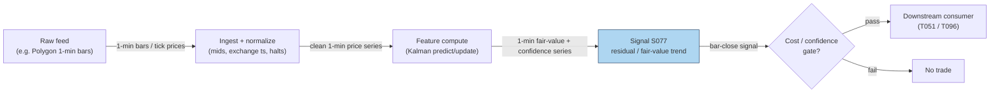

## Stage 77/200 — S077: Kalman-filtered fair value (local-level trend)

*Batch SB9 · Signal 77/100 · Provenance [D] · Family F — Statistical/ML Infrastructure*

### S1. One-line verdict

| | |
|---|---|
| **What it is** | Splits each observed price into a latent "efficient" (fair-value) price plus microstructure noise, using the Kalman filter; trades the gap or the fair-value trend. |
| **When it works** | When microstructure noise is large relative to true price movement (illiquid names, wide spreads) and the Q/R calibration is honest. |
| **When it dies** | When Q/R is miscalibrated — too smooth and you lag every turn; too fast and you just chase noise — or when the "trend" was noise all along. |
| **Build-or-buy in one line** | Build — the filter is ~20 lines; the calibration (Q, R) is the entire product and cannot be bought. |

Provenance **[D]** · Family F — Statistical/ML Infrastructure.

### S2. How it works — plain human explanation

A **Kalman filter** is a recursive estimator for a hidden quantity observed through noise. A **state-space model** writes the world as two equations: how the hidden state evolves (the *state* equation) and how observations relate to it (the *observation* equation). The **local-level model** is the simplest useful state space: the hidden fair value follows a random walk, and each observed price equals the fair value plus noise.

Picture 9:47:03: AAPL's mid-price flickers 231.40 → 231.41 → 231.39 → 231.42 within two seconds. Is the "true" price moving, or is this just **microstructure noise** — bid–ask bounce and quote flicker around a stable efficient price? The Kalman filter answers with a weighted average: each new observation moves the fair-value estimate by the **Kalman gain** $K_t$ times the surprise. The gain comes from the ratio of **process noise** $Q$ (how much the true price moves per step) to **observation noise** $R$ (how noisy each print is). Large $Q/R$ → trust the tape, react fast. Small $Q/R$ → trust the model, smooth heavily. The filter also outputs $P_{t|t}$, the variance of its own estimate — a built-in confidence meter no moving average gives you.

This differs from **S052** (define-on-first-use distinction): S052 uses the Kalman filter to estimate a time-varying *hedge ratio* $\beta_t$ between *two* cointegrated prices (a pairs-trading parameter). S077 uses it to estimate the latent *efficient price of a single price* — fair value vs. hedge ratio. Same machinery, different estimand.

Economically: at short horizons, much price variance is transient (bounce, flicker) rather than information. Filtering it out gives a cleaner trend with less lag than any moving average of comparable smoothness — and the filter's confidence output lets you size positions by how much you actually know.

- **Mental model 1:** A thermostat for price — the filter separates the room's true temperature (fair value) from the thermometer's jitter (noise).
- **Mental model 2:** $Q/R$ is the only real parameter — everything else is bookkeeping. It sets where you live on the smooth↔fast frontier.
- **Mental model 3:** The residual $e_t = y_t - \hat{x}_{t|t}$ is the trade: fade it (mean reversion to fair value) or ride $\Delta\hat{x}$ (fair-value momentum) — but never both at once without a regime rule.

### S3. The math — exact formula

Local-level state space (log-prices $y_t$, latent fair value $x_t$):

$$x_t = x_{t-1} + \eta_t, \quad \eta_t \sim \mathcal{N}(0, Q) \qquad \text{(state)}$$
$$y_t = x_t + \varepsilon_t, \quad \varepsilon_t \sim \mathcal{N}(0, R) \qquad \text{(observation)}$$

**Predict:** $\hat{x}_{t|t-1} = \hat{x}_{t-1|t-1}$, $\quad P_{t|t-1} = P_{t-1|t-1} + Q$

**Update:** $K_t = \dfrac{P_{t|t-1}}{P_{t|t-1} + R}, \quad \hat{x}_{t|t} = \hat{x}_{t|t-1} + K_t\,(y_t - \hat{x}_{t|t-1}), \quad P_{t|t} = (1 - K_t)\,P_{t|t-1}$

**Signals:** residual (fade) $e_t = y_t - \hat{x}_{t|t}$; or fair-value momentum on $\Delta\hat{x}_{t|t} = \hat{x}_{t|t} - \hat{x}_{t-1|t-1}$; or the one-step-ahead surprise $s_t = y_t - \hat{x}_{t|t-1}$. The scale-free tuning knob is $\lambda = Q/R$.

| Parameter | Symbol | Typical range | Too small | Too large | Default (example) |
|---|---|---|---|---|---|
| Process-noise variance | $Q$ | $10^{-6}$–$10^{-2}$ (price²) | Filter never moves; lags turns | Chases every tick; no smoothing | 0.04 |
| Observation-noise variance | $R$ | $10^{-5}$–$10^{-1}$ (price²) | Overfits bounce | Ignores real moves | 0.16 |
| Smooth↔fast ratio | $Q/R$ | $10^{-4}$–$1$ | Glacial | Noise-chasing | 0.25 |
| Initial variance | $P_0$ | $R$, $10R$, or $100R$ (diffuse) | Overconfident start | Slow burn-in | $R$ |

*All defaults are examples — not institutional standards.*

**Calibration (the actual work):** $R$ from bid–ask bounce / quote-revision variance at the shortest horizon; $Q$ from low-frequency price-change variance *minus* the noise component; or joint maximum-likelihood/EM on a training window. **Normalization:** z-score the residual by $\sqrt{P_{t|t} + R}$ for a scale-free fade signal. Causal timing: the update at $t$ uses only data $\le t$; tradable no earlier than $t+1$.

**Variants:** local *linear* trend (adds a slope state — faster but twitchier); pairs form: $y_t = \beta_t x_t + \mu_t + \varepsilon_t$ with $\theta_t = [\beta_t, \mu_t]^\top$ random-walking — the S052 bridge, signal on the z-scored spread $s_t = y_t - \hat{\beta}_t x_t - \hat{\mu}_t$; **innovation**-gated entries (trade only when $|e_t|$ exceeds a multiple of its predicted std).

### S4. Worked example — step-by-step numbers (SYNTHETIC)

**Operator-verified** recursion (duck.ai answers, hand-checked 2026-09-10 — 4th-decimal rounding noise only, no material errors). Synthetic 10-observation series; $Q = 0.04$, $R = 0.16$, $\hat{x}_{0|0} = 100.00$, $P_{0|0} = 0.16$. Seed **77** recorded for the plot script (`np.random.default_rng(77)`); the series itself is fixed, not random.

Update 1 ($y_1 = 100.40$): $P_{1|0} = 0.16 + 0.04 = 0.20$; $K_1 = 0.20/(0.20+0.16) = 0.5556$; surprise $\nu_1 = 0.40$; $\hat{x}_{1|1} = 100.00 + 0.5556 \times 0.40 = \mathbf{100.2222}$; $P_{1|1} = (1-0.5556)\times0.20 = \mathbf{0.0889}$.

Update 2 ($y_2 = 99.80$): $P_{2|1} = 0.1289$; $K_2 = 0.4462$; $\nu_2 = -0.4222$; $\hat{x}_{2|2} = \mathbf{100.0338}$; $P_{2|2} = \mathbf{0.0714}$.

Update 3 ($y_3 = 100.20$): $P_{3|2} = 0.1114$; $K_3 = 0.4104$; $\nu_3 = 0.1662$; $\hat{x}_{3|3} = \mathbf{100.1020}$; $P_{3|3} = \mathbf{0.0657}$; $e_3 = 100.20 - 100.1020 = \mathbf{0.0980}$.

Full table (matches `images/S077_example.png` exactly):

| $t$ | $y_t$ | $\hat{x}_{t\|t-1}$ | $P_{t\|t-1}$ | $K_t$ | $\hat{x}_{t\|t}$ | $P_{t\|t}$ | $e_t = y_t - \hat{x}_{t\|t}$ |
|---|---|---|---|---|---|---|---|
| 1 | 100.40 | 100.0000 | 0.2000 | 0.5556 | 100.2222 | 0.0889 | +0.1778 |
| 2 | 99.80 | 100.2222 | 0.1289 | 0.4462 | 100.0338 | 0.0714 | −0.2338 |
| 3 | 100.20 | 100.0338 | 0.1114 | 0.4104 | 100.1020 | 0.0657 | +0.0980 |
| 4 | 100.60 | 100.1020 | 0.1057 | 0.3977 | 100.3001 | 0.0636 | +0.2999 |
| 5 | 100.30 | 100.3001 | 0.1036 | 0.3931 | 100.3001 | 0.0629 | −0.0001 |
| 6 | 100.90 | 100.3001 | 0.1029 | 0.3914 | 100.5349 | 0.0626 | +0.3651 |
| 7 | 101.10 | 100.5349 | 0.1026 | 0.3908 | 100.7557 | 0.0625 | +0.3443 |
| 8 | 100.80 | 100.7557 | 0.1025 | 0.3905 | 100.7730 | 0.0625 | +0.0270 |
| 9 | 101.20 | 100.7730 | 0.1025 | 0.3904 | 100.9397 | 0.0625 | +0.2603 |

**What to notice:** the gain $K_t$ decays 0.5556 → 0.3904 and $P_{t|t}$ converges toward its steady state (~0.0625) — the filter "learns" how much to trust the tape within a handful of observations. The residual $e_t$ is the tradeable object: a fade rule would sell $t=6$'s +0.3651 print; a fair-value-momentum rule would buy the rising $\hat{x}_{t|t}$ path. Note $t=5$: the filter barely moves ($\hat{x}$ unchanged to 4 decimals) because the observation confirmed the prediction — exactly the behavior a moving average cannot replicate. Limits: Gaussianity assumed, $Q/R$ fixed by fiat here, and 10 points prove nothing about profitability.

### S5. Strategies that use this signal

- **T051 — Kalman Fair-Value Trend** — primary trigger: local-level trend following with dynamic confidence from the Kalman filter (uses S077, S078, S079). S077 *is* the entry logic — position direction from $\Delta\hat{x}_{t|t}$, sized by $1/\sqrt{P_{t|t}}$.
- **T096 — Kalman + HMM Adaptive Trend** — regime-gated variant (uses S077, S079, S078): fair-value trend entries from S077, gated by the HMM regime state (S079) — trend-following only when the hidden state says "trending" — with AR-innovation timing (S078).

### S6. Data required — exact spec

| Field | Type | Granularity | Source tier | Notes |
|---|---|---|---|---|
| Trade/quote prices | float | tick or 1-min bars | Tier 1 | Any intraday feed; mid-prices preferred over last prints |
| Bid–ask spread | float | 1-min | Tier 1 | For $R$ calibration from bounce |
| Pair leg prices (pairs form) | float | 1-min bar closes | Tier 1 | Two cointegrated names |

Collection (1-min bars → filter loop, ≤20-line sketch):

```python
import polars as pl, numpy as np
bars = pl.read_parquet("bars_1min.parquet").sort("ts")   # Tier-1 vendor, key via approved flow
y = bars["mid"].to_numpy(); Q, R = 0.04, 0.16            # example calibration
x, P = y[0], R
xs, Ps = [], []
for yt in y:                                             # causal: uses only data <= t
    Pp = P + Q; K = Pp/(Pp+R)
    x = x + K*(yt-x); P = (1-K)*Pp
    xs.append(x); Ps.append(P)
bars = bars.with_columns(pl.Series("fair", xs), pl.Series("conf", Ps))
```

Storage per cost-model §4: 1-min bars for 500 symbols ≈ **50 MB/day** total; 500 × 390 = **195,000 bars/day**; 60 days ≈ 3 GB — archive freely. Panel RAM for a 500 × 252 estimation window: 500×252×8 ≈ **0.96 MiB**; the 500×500 covariance ≈ **1.91 MiB** (both operator-verified byte arithmetic).

**Data-quality checklist:** use mid-prices (last prints inject bounce into $y_t$); timestamp normalization; corporate actions adjusted; halts excluded; calibration window separated from the trading window (no lookahead in $Q/R$).

### S7. Local build on M5 Max / 128GB

**Feasibility: trivial-to-feasible** (per cost-model §5 this is Tier M: 20–60 h ≈ **$3,000–$9,000** loaded-cost estimate at $150/hr — justified: the filter loop is simple, but honest $Q/R$ calibration with walk-forward validation is the real work).

- **Throughput** (cost-model §2): 500 scalar Kalman updates run in <10 ms compiled; a 500-symbol 1-min batch update is ~1–20 ms vectorized. Polars/numpy handle the universe in real time with enormous headroom. Bottleneck: none — calibration design, not compute.
- **RAM** (cost-model §3): the filter state is two floats per symbol; even a 500 × 252 estimation panel is ~1 MiB. Fits trivially inside the 77 GB working budget.
- **Stack:** Python + numpy/polars (pick this). Rust only if the filter sits inside a tick-level execution loop.
- **What breaks first at 500 symbols:** calibration discipline — estimating honest per-symbol $Q/R$ on 500 names without overfitting needs purged walk-forward (S088) machinery, not more hardware.

### S8. Buy vs build

| Option | What you get | Indicative price | Gains | Loses |
|---|---|---|---|---|
| Tier-0 free (Stooq daily) | Daily bars | ~$0 | Free local-level on daily data | Useless for intraday fair value |
| Tier-1 retail (Polygon/Alpaca SIP) | 1-min/real-time bars | ~$30–200/mo | Everything the filter needs | — |
| Tier-2 professional (Databento) | L1 quotes, imbalance feeds | ~$200/mo + usage | True quote-mid inputs, better $R$ calibration | Overkill for the basic filter |
| Academic route | Textbooks (Harvey), LOBSTER samples | ~$0–hundreds/yr | Canonical state-space theory | No production feed |

*All prices indicative — verify before budgeting.*

**Verdict: build, immediately.** The filter is twenty lines; no vendor sells your $Q/R$. **Buy** Tier-1 1-min bars (~$30–200/mo, indicative) and spend the budget on calibration rigor — walk-forward $Q/R$ selection with purged validation — instead of fancier data.

### S9. Success ratio / efficacy — documented evidence

| Study / source | Market & period | Metric | Before/after cost | Caveat |
|---|---|---|---|---|
| Benhamou (2016), "Trend Without Hiccups — A Kalman Filter Approach", SSRN | S&P 500 mini-future | 4 KF models: models 1–2 ≈ $20k net/1yr; model 4 (short/long-term split + extremum term) ≈ **$40k net/1yr**, max drawdown −$7.3k → −$2.6k | Reported "net", cost detail unavailable — **research lead** | Parameters "obtained by general optimization… best possible choice" = in-sample optimization; overfit risk explicitly flagged by the paper itself |
| Bel Hadj Ayed et al. (2015), "Forecasting trends with asset prices", arXiv:1504.03934 | Latent trend as unobservable OU process | Closed-form likelihood + online estimation; quantifies damage from **bad calibration** of a misspecified Kalman filter | N/A — methodology, not a P&L backtest | Confirms the chapter's core warning: calibration is the product |
| Bruder, Dao, Richard & Roncalli (2011), "Trend Filtering Methods for Momentum Strategies", SSRN | Multi-asset momentum | Trend-filtering (incl. Kalman-type) methods improve momentum strategy construction | Before/after-cost detail unverified — **research lead** | Cited via reference list; full text not independently opened |

Regimes where it fails: high-noise chop where $Q/R$ is set too fast (filter chases bounce and whipsaws); regime shifts where the calibrated $Q/R$ no longer describes the market (volatility regime change → recalibrate); jump-driven moves the Gaussian local-level model cannot represent (pair with S064 jump filters). Documented decay: none specific to the filter — but the Benhamou caveat generalizes: any edge found by optimizing filter parameters in-sample should be assumed overstated until walk-forwarded.

**Honest bottom line:** as a standalone trigger this is a *calibration-dependent smoothing edge* — the filter demonstrably beats moving averages on lag *given correct parameters*, and its confidence output ($P_{t|t}$) is genuinely useful for sizing. As infrastructure (fair-value input to T051/T096, or the pairs-form spread in S052-style books) it is more defensible than as a lone signal. For a ≤$1M paper operation it is one of the cheapest signals in this document to run honestly.

### S10. Failure modes & pitfalls

1. **Q/R miscalibration** — the single dominant failure; too smooth lags turns, too fast chases noise. *Mitigation:* calibrate $R$ from bounce, $Q$ from low-frequency variance minus noise; walk-forward the ratio.
2. **In-sample parameter optimism** — optimizing $Q/R$ on the test period (the Benhamou caveat). *Mitigation:* purged/embargoed walk-forward (S088); never select $Q/R$ on the evaluation window.
3. **Gaussianity violation** — jumps break the linear-Gaussian assumptions. *Mitigation:* jump-robust pre-filtering (S064); robustified update or regime switch.
4. **Microstructure regime change** — spread/tick-size changes alter $R$ silently. *Mitigation:* re-estimate $R$ on rolling windows; monitor the innovation variance.
5. **Stale-quote inputs** — filtering last prints instead of mids injects bounce into the state. *Mitigation:* mid-price or microprice inputs only.
6. **Overfitting via variants** — local-level vs. local-linear-trend vs. pairs form = model mining. *Mitigation:* pick the variant *a priori* from the horizon; report all tried.
7. **Latency illusion** — "zero lag" claims assume the print is tradeable; SIP latency still applies. *Mitigation:* label backtests on SIP data as `simulated only — requires MBO/ITCH` for any latency-sensitive claim.
8. **Confidence misread** — $P_{t|t}$ measures *estimation* uncertainty, not *prediction* uncertainty; price can leave the ±2σ band freely. *Mitigation:* size on $P_{t|t}$, stop-loss on realized P&L.

### S11. Visuals




### S12. Sources

1. Benhamou, E. (2016). "Trend Without Hiccups — A Kalman Filter Approach." SSRN. https://papers.ssrn.com/sol3/papers.cfm?abstract_id=2747102 — 4 KF models on the S&P 500 mini-future; the combined smoothing+extremum model roughly doubles reported net profit vs. basic models while cutting max drawdown; parameters optimized in-sample (overfit caveat).
2. Bel Hadj Ayed, A. et al. (2015). "Forecasting trends with asset prices." arXiv:1504.03934. https://arxiv.org/abs/1504.03934v1 — latent trend as unobservable Ornstein–Uhlenbeck process; closed-form likelihood and the cost of bad calibration in a misspecified filter.
3. Bruder, B., Dao, T.-L., Richard, J.-C. & Roncalli, T. (2011). "Trend Filtering Methods for Momentum Strategies." SSRN. http://papers.ssrn.com/sol3/papers.cfm?abstract_id=2289097 — trend-filtering methods (including Kalman-type filters) applied to momentum strategy construction.

**Unverified leads** (not confirmed facts — verify before use):
- Kalman, R.E. (1960) original filter paper and Harvey, A.C. (1989) *Forecasting, Structural Time Series Models and the Kalman Filter* — canonical references per the signal report; specific editions/URLs not verified in this pass.
- HF stat-arb reference arXiv 2210.15448 cited in the signal report — not independently opened.

---
