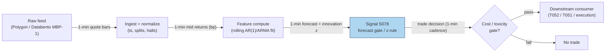

## Stage 78/200 — S078: AR(1)/ARMA short-horizon return forecast & innovation

*Batch SB9 · Signal 78/100 · Provenance [D/SR] · Family F — Statistical/ML Infrastructure*

### S1. One-line verdict

| | |
|---|---|
| **What it is** | AR(1)/ARMA forecast of 1–5 min mid-price returns; trades the forecast direction or the standardized forecast error (**innovation**). |
| **When it works** | When short-horizon return autocorrelation is stable and larger than the round-trip cost: calm, liquid, trend-persistent minutes. |
| **When it dies** | When the per-bar edge is below spread+fees; when the fitted φ flips sign in regime breaks; when you run it on trade prices without removing the bid–ask bounce. |
| **Build-or-buy in one line** | Build: the model is a dozen lines of OLS (ordinary least squares); buy only the 1-min bar feed. |

Provenance: the AR/ARMA forecasting machinery is **[D]** (documented: Box–Jenkins; Tsay); the **innovation-trading rule** (long z < −2, short z > +2, exit at 0) is **[SR]** — a research framing, not a documented paper rule.

### S2. How it works — plain human explanation

It is 9:47:03 and AAPL's mid-price is 231.405. The last three 1-minute returns were +1.8, +0.9, −0.4 basis points. An **AR(1)** model — **autoregressive** of order 1: today's value is a linear function of last bar's value plus noise — fitted over the last hour says: r_t ≈ 0.28·r_{t−1} + noise. The one-step forecast is 0.28 × (−0.4) = −0.11 bp against a ~2.5 bp round-trip cost — twenty times smaller. The signal does nothing, and that restraint is the whole point.

The economic story: at 1–5 minute horizons, mid-price returns carry small but measurable autocorrelation. Part of it is mechanical (the bid–ask bounce induces *negative* serial covariance in trade prices — Roll 1984), part of it is structural (large orders are split into autocorrelated sequences of child orders; market-maker inventory cycles push and pull the mid back). An AR(1) or ARMA(p,q) (**autoregressive moving-average**: AR terms on past returns plus **MA** terms on past forecast errors) separates the *predictable* component from the *surprise*. Two ways to trade it:

1. **Forecast trading**: take the sign of the forecast, but only when |forecast| clears the cost threshold.
2. **Innovation trading** ([SR] framing): standardize the forecast error — the **innovation**, the part of the return the model did *not* predict — as z_t = ε̂_t/σ̂_ε, and bet that huge unexplained shocks partially reverse (long z < −2, short z > +2, exit at 0).

Why should any of this exist economically? Order flow is not white noise: split orders arrive in autocorrelated sequences (Bouchaud et al. 2004 document long-range correlated market orders), so signed flow — and hence the mid — drifts persistently over a few minutes, while market-maker inventory cycles pull the mid back after one-sided flow. The AR coefficient φ is the net of these two forces. The edge is tiny precisely because both forces are well known — which is why honest cost gating kills most candidate trades.

**Mental model:**
- Short-horizon returns = a small predictable part + a dominant surprise; the model exists to isolate the surprise.
- You are not predicting the market; you are measuring whether the market's own short memory is currently stronger than your cost to trade it.
- The trade gate (|forecast| > cost) fires rarely by design; a frequently-firing AR(1) signal at 1-minute is almost certainly a cost model bug or look-ahead.

### S3. The math — exact formula

**AR(1) (documented [D]):**

r_t = c + φ·r_{t−1} + ε_t,   ε_t white noise, E[ε_t] = 0, Var(ε_t) = σ²_ε

**ARMA(p,q) (documented [D]):**

r_t = c + Σᵢ₌₁ᵖ φᵢ·r_{t−i} + Σⱼ₌₁ᵍ θⱼ·ε_{t−j} + ε_t

One-step forecast (causal: computed at event/bar *t* using only data ≤ *t*; tradable no earlier than *t+1*):

f̂_t = c + Σᵢ φᵢ·r_{t−i}

**Innovation** and its standardization:

ε̂_t = r_t − f̂_t   (the surprise),   z_t = ε̂_t / σ̂_ε

**Forecast-direction rule [D form]**: direction = sign(f̂_t) **only if** |f̂_t| > c_thr, where c_thr is the example round-trip cost threshold.

**Innovation rule [SR — research framing, not a paper rule]**: long when z_t < −2, short when z_t > +2, exit when z_t crosses 0. Parameters re-estimated on rolling windows; model order chosen by AIC/BIC (**Akaike/Bayesian information criteria**: penalized fit measures that trade off likelihood against number of parameters).

**Bid–ask bounce (Roll 1984) — why trade prices need cleaning:** under a constant spread s, trade prices follow Δp_t = m_t + (s/2)(q_t − q_{t−1}) with q_t ∈ {+1,−1} the trade sign, so Cov(Δp_t, Δp_{t−1}) = −s²/4. The AR(1) coefficient on *trade* prices is mechanically negative; running the signal on trade prices without de-bouncing confuses the bounce with predictability. Use mid-prices (or quote midpoints).

**Parameter table** (every default marked `example — not an institutional standard`):

| Parameter | Symbol | Typical range | Too small | Too large | Default example |
|---|---|---|---|---|---|
| AR order | p | 1–3 | underfits persistent flow | fits noise; unstable | p = 1 |
| MA order | q | 0–2 | misses bounce/MA structure | over-parameterized | q = 0 |
| Estimation window | W | 30–240 bars | noisy φ̂, whipsaws | stale through regime breaks | W = 60 1-min bars |
| Cost threshold | c_thr | 1–5 bp | trades below cost | never fires | c_thr = 2.5 bp |
| Innovation z-entry | z_entry | 1.5–3 | constant trading, cost bleed | never trades | ±2 [SR] |
| AIC/BIC selection | — | p,q ∈ {0..3} | picks noise | picks inertia | re-check weekly [example] |

**Normalization**: fit on mid-price *returns* (or spreads), never raw prices (non-stationary — φ̂ drifts to 1); z-score the innovation (z_t) for cross-name comparability; causal timing "computed at bar *t* using only data ≤ *t*; tradable no earlier than *t+1*". **Variants**: (a) AR(1) on mid returns (directional); (b) ARMA(1,1) on trade prices with the MA term absorbing the bounce; (c) innovation trading ([SR]) vs forecast trading; (d) calendar-time 1-min bars vs event-time bars.

### S4. Worked example — step-by-step numbers (SYNTHETIC)

Synthetic 12-bar tape, 1-min mid returns in **basis points**, generated with **seed 78** (`rng = np.random.default_rng(78)`). Model: r_t = 0.28·r_{t−1} + ε_t, ε ~ N(0, 4.5 bp). The coefficient φ̂ = 0.28 is *assumed already estimated* on a prior 60-bar window — this example does not pretend to fit it from 12 bars. Forecast f_t = 0.28·r_{t−1}; innovation ε̂_t = r_t − f_t; gate |f_t| > 2.5 bp (example threshold).

| t | r_t (bp) | f_t (bp) | innovation ε̂_t (bp) | \|f_t\| > 2.5? | Action |
|---|---|---|---|---|---|
| 0 | −3.04 | — | −3.04 | no data | NONE |
| 1 | +0.93 | −0.85 | +1.78 | no | NONE |
| 2 | −1.46 | +0.26 | −1.72 | no | NONE |
| 3 | −5.33 | −0.41 | −4.92 | no | NONE |
| 4 | +1.70 | −1.49 | +3.19 | no | NONE |
| 5 | −1.07 | +0.48 | −1.55 | no | NONE |
| 6 | −0.09 | −0.30 | +0.21 | no | NONE |
| 7 | +3.23 | −0.03 | +3.25 | no | NONE |
| 8 | +12.29 | +0.90 | +11.39 | no | NONE |
| 9 | +1.28 | +3.44 | −2.16 | **yes** | **BUY** (forecast +3.44 bp > 2.5) |
| 10 | +2.74 | +0.36 | +2.38 | no | NONE |
| 11 | +4.77 | +0.77 | +4.00 | no | NONE |

Hand-check of bar 9: f_9 = 0.28 × 12.29 = +3.44 bp ✓; |3.44| > 2.5 → BUY, tradable at bar 10's open. Bar 8's +12.29 bp realized return produced a +11.39 bp innovation — the surprise was nine times the forecast, and the model *did not trade it*: the forecast rule only fires at bar 9. (The matching chart — forecast vs realized with the cost gate — appears in §S11.)

**What to notice:** the gate fired once in 12 bars. That is the honest signature of this signal: with φ = 0.28 and 4.5 bp noise, the typical forecast is ~1 bp, well inside a 2.5 bp cost band. This toy tape has no fees, no latency, no partial fills, and a *known* φ — a real deployment estimates φ with error, which shrinks the edge further. Do not read this as a backtest.

### S5. Strategies that use this signal

- **T052 — AR/ARMA Innovation Trader**: *primary trigger* — trades forecast innovations (surprises) per the [SR] z-rule, validated by the trade–quote VAR (vector autoregression; S084).
- **T040 — PCA Eigenportfolio Residual Reversal**: uses S078 for *timing* — AR-innovation timing of residual-reversal entries (signal T040 composes S080, S039, S078).
- **T051 — Kalman Fair-Value Trend**: uses S078 as a *timing/refinement input* alongside the Kalman fair-value deviation (S077).
- **T096 — Kalman + HMM Adaptive Trend**: uses S078 for AR-innovation-timed entries inside the HMM regime book.
- **T057 — Fractional-Differentiation Memory Trader**: uses S078 to time entries on fractionally-differenced series.

### S6. Data required — exact spec

| Field | Type | Granularity | Source tier | Notes |
|---|---|---|---|---|
| Mid price / quote midpoint | float | 1-min bars (or 5-min) | Tier 1–2 | Prefer NBBO (national best bid and offer) midpoint over trade price (de-bounced) |
| Bid–ask spread series | float (bp) | 1-min bars | Tier 1–2 | For the cost gate c_thr; intraday, not static |
| Corporate actions / splits | events | daily | Tier 0–1 | Adjust returns; splits break AR continuity |
| Halt / auction flags | bool | 1-min bars | Tier 1–2 | Exclude halt bars from estimation window |

Collection: Polygon Stocks Advanced (`/v2/aggs/ticker/{t}/range/1/minute/...`) or Databento MBP-1 (`dbn` schema, `midpoint` from best bid/ask), ≤20-line sketch:

```python
import polars as pl, numpy as np
bars = pl.read_parquet("aapl_1min.parquet").sort("ts")          # mid, spread_bps
r = (bars["mid"] / bars["mid"].shift(1) - 1) * 1e4              # bp returns
W, phi = 60, None
for t in range(W, len(r)):                                     # rolling refit (example cadence)
    y, x = r[t-W:t].to_numpy()[1:], r[t-W:t].to_numpy()[:-1]
    phi = float(np.polyfit(x, y, 1)[0])                        # OLS AR(1); AIC/BIC for (p,q)
    f = phi * r[t-1]                                           # causal forecast, tradable at t+1
    if abs(f) > 2.5:                                           # example cost gate
        submit("BUY" if f > 0 else "SELL", tradable_at=t+1)
```

Storage per symbol-day (cost-model §4): 1-min bars, 500 symbols ≈ 50 MB total/day → **~0.1 MB per symbol-day** (parquet). Data-quality checklist: timestamp normalization, corporate actions, halts/auctions, DST and half-days, stale quotes (frozen NBBO fakes autocorrelation).

### S7. Local build on M5 Max / 128GB

**Feasibility: trivial.** AR(1)/ARMA on 1-min bars is pure vectorized numpy/polars: refitting an AR(1) on 60-bar windows for 500 symbols is a few million flops — sub-millisecond per full-universe refit (cost-model §2: numpy ~50–200M elements/sec; polars simple ops ~10–50M rows/sec). RAM: 500 symbols × 60 days of 1-min bars ≈ 12 MB (cost-model §3) — noise against the 77 GB working budget. Bottleneck is the **feed**, not compute. What breaks first at 500 symbols: the refit scheduler and corporate-action pipeline, not the math.

Engineering band: single-symbol AR(1) prototype is Tier L (4–12 h, cost-model §5); a 500-symbol rolling harness with cost gate, regime monitoring, and the trade–quote VAR validation is **Tier M (20–60 h)** — budget **20–60 h ≈ $3,000–9,000** loaded-cost estimate at $150/hr.

### S8. Buy vs build

| Option | What you get | Indicative price | Gains | Loses |
|---|---|---|---|---|
| Tier-0 free (Stooq, Alpaca IEX daily) | Daily bars | ~$0 | Free | No 1-min bars — insufficient |
| Tier-1 retail (Polygon Stocks Advanced, Alpaca SIP) | 1-min/real-time SIP (Securities Information Processor — the consolidated US quote feed) bars + actions | ~$30–200/mo | Cheap, good enough for 1-min mid returns | SIP latency; NBBO only |
| Tier-2 professional (Databento Standard) | Honest L1 MBP-1, futures | ~$200/mo + usage | Cleaner timestamps, depth for spread series | Overkill for AR(1) alone |
| Academic route | TAQ via WRDS (if affiliated) | ~institutional | Publication-grade | Access friction |

*Indicative — verify before budgeting.* **Verdict: build.** The estimator is ~15 lines; the edge lives in your cost gate and your regime filter, which no vendor sells. **Buy** the Tier-1 feed (the crossover: buy the 1-min bars, build everything else).

### S9. Success ratio / efficacy — documented evidence

| Study / source | Market & period | Metric | Before/after cost | Caveat |
|---|---|---|---|---|
| Roll (1984), *J. Finance* 39(4) | US equities, trade prices | Bid–ask bounce ⇒ negative first-order serial covariance; spread = 2√(−cov) | Before-cost (it *is* a cost estimator) | Positive sample covariances break the estimator (imaginary spreads) |
| Hasbrouck (1991), *J. Finance* 46(1) | NYSE issues | Trade **innovations** (not raw volume) forecast quote revisions with protracted lag; VAR(p) with 5–30 lags | Before-cost (documents impact, not P&L) | Information content ≠ tradable profit; impact is concave in size |
| Bouchaud, Gefen, Potters & Wyart (2004), *Quant. Finance* 4(2) | Paris Bourse | Market orders long-range correlated (persistence); limit orders mean-reverting — the tension AR models exploit | Before-cost (structural fact) | Describes order flow, not an AR(1) trading rule |

**Honest bottom line:** the literature documents the *autocorrelation structure*, not a profitable AR(1) trading rule. No source in this chapter's set reports a live, after-cost Sharpe for AR(1) forecast trading — the standalone per-bar edge is usually smaller than the spread. As a **standalone trigger**, weak/borderline; as a **filter and innovation extractor** (the surprise series fed to T052/T051), genuinely useful. The [SR] innovation rule has no documented efficacy and must be validated out-of-sample, e.g. with the trade–quote VAR (S084) per T052.

### S10. Failure modes & pitfalls

1. **Bounce contamination** (trade prices, not mids) → always use mid/quote-midpoint returns; sanity-check φ̂ sign against Roll's prediction.
2. **Look-ahead in refit** → forecast at *t* uses only data ≤ *t*; tradable no earlier than *t+1*; refit on a strictly lagged window.
3. **Cost-gate optimism** → model spread + fees + slippage explicitly; the gate must use *effective* round-trip cost, not the quoted half-spread.
4. **Regime flips of φ** → φ̂ estimated in a calm window goes stale in a vol event; monitor φ̂ stability and stand down on breaks.
5. **Overfitting (p,q) by AIC/BIC mining** → cap (p,q) ≤ 3, require stability across sub-periods, prefer p = 1.
6. **Halt/auction/split bars** → exclude from estimation; a split bar looks like a −50% "return" to a naive AR.
7. **Microstructure noise vs signal** → at 1-min the noise dominates; the signal's job is to *measure* that, not to wish it away.
8. **Crowding of the innovation fade** → the [SR] z-rule fades the same shocks everyone else's models see; size it as a timing overlay, not a book.

### S11. Visuals




### S12. Sources

- Roll, R. (1984). "A Simple Implicit Measure of the Effective Bid-Ask Spread in an Efficient Market." *Journal of Finance*, 39(4), 1127–1139. https://authors.library.caltech.edu/records/afwsc-6bb61
- Hasbrouck, J. (1991). "Measuring the Information Content of Stock Trades." *Journal of Finance*, 46(1), 179–207. http://ideas.repec.org/a/bla/jfinan/v46y1991i1p179-207.html
- Bouchaud, J.-P., Gefen, Y., Potters, M. & Wyart, M. (2004). "Fluctuations and response in financial markets: the subtle nature of 'random' price changes." *Quantitative Finance*, 4(2), 176–190. http://ideas.repec.org/p/arx/papers/cond-mat-0307332.html
- Box, G.E.P. & Jenkins, G.M. (1970). *Time Series Analysis: Forecasting and Control*. Holden-Day. (Canonical AR/ARMA reference per report entry; cited for the documented [D] machinery.)
- Tsay, R.S. (2005). *Analysis of Financial Time Series*. Wiley. (Canonical intraday time-series reference per report entry.)

**Unverified leads** (chatbot-provided, not independently checkable — do not cite as fact):
- Duck.ai Q-SB9-1 verified the Kalman worked example to 4th-decimal accuracy but found the PCA worked example internally inconsistent (see S080 disclosure).
- Duck.ai Q-SB9-2 planning ranges: Kalman/HMM/ARMA prototype 40–80 h; data $50–2,000/mo illustrative (indicative — verify before budgeting).

*Research provenance note — source log: Duck.ai answered Q-SB9-1–Q-SB9-3 (2026-09-10); Grok/Cursor answers pending (checked 2026-09-10).*
