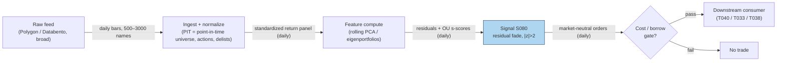

## Stage 80/200 — S080: PCA / statistical-factor residual reversal (incl. eigenportfolios)

*Batch SB9 · Signal 80/100 · Provenance [D] · Family F — Statistical/ML Infrastructure*

### S1. One-line verdict

| | |
|---|---|
| **What it is** | **PCA** (principal component analysis) splits panel returns into a few shared statistical factors plus **residuals**; the residual is the purest mean-reverting component — trade it market-neutral. |
| **When it works** | When residuals are genuinely idiosyncratic and mean-revert faster than costs eat them: calm markets, uncrowded names, shortable universe. |
| **When it dies** | Crowded unwinds (2007-style), factor breaks, borrow recalls, turnover that exceeds the per-trade edge; or when "residual" is just mismeasured beta. |
| **Build-or-buy in one line** | Build: PCA is one `eigh` call; buy only broad daily/intraday bar coverage. |

Provenance **[D]** (Avellaneda & Lee 2010; restated per report entry).

### S2. How it works — plain human explanation

It is 9:47:03. Two correlated stocks, A and B, both track the market, but in the last hour A drifted +1.5 standard deviations above what B (and the market) would imply, while nothing happened to either company. **PCA** — principal component analysis: a rotation of the return panel into orthogonal directions (**principal components**) ranked by variance explained — says most of what moves A and B together is one shared factor. Subtract it and what remains is the **residual**: the stock's own idiosyncratic wiggle.

An **eigenportfolio** (Avellaneda–Lee 2010) is simply a tradeable version of one principal component: weight each stock by its eigenvector entry divided by its volatility, so the portfolio's return *is* the factor's return. The residual of stock i is then its return minus its loadings on the top few eigenportfolios. Residuals of liquid stocks often behave like an **OU process** — **Ornstein–Uhlenbeck**, the mathematical name for noisy mean reversion: dX = κ(μ−X)dt + σdW, pulled toward μ at speed κ while being buffeted by noise. The signal fades stretched residuals: short the stock whose residual is far above its OU-implied equilibrium, buy the one far below, hedge the factor exposure away so the book is market-neutral.

Why should residuals mean-revert? Mostly microstructure and inventory: a burst of one-sided flow pushes a stock away from its statistical peers; liquidity providers lean against it; the peer relationship reasserts. The catch — the 2007 quant-unwind lesson — is that *everyone* estimates similar factors and fades the same residuals. Then "idiosyncratic alpha" is a crowded trade, and when many desks cut risk at once, the residuals don't revert; they gap.

**Mental model:**
- Returns = a few shared factors + your stock's own noise; PCA finds the factors without needing to name them.
- The residual is the only part of a stock's move that is *its*, so it is the only part you can bet on mean-reverting.
- A residual trade is a bet that the peer relationship holds *and* that you are not standing in a crowded exit with fifty other desks.

### S3. The math — exact formula

**Factor decomposition (documented [D]):**

R_{i,t} = Σⱼ₌₁ᵐ β_{ij}·F_{j,t} + R̃_{i,t}

where R_{i,t} is stock i's (standardized) return, F_{j,t} are the m statistical factors, β_{ij} the loadings, and R̃_{i,t} the residual. Causal timing: factors and loadings are estimated on a window ending at *t*; the residual at *t* is tradable no earlier than *t+1* — **no look-ahead**: only information through *t* may enter.

**PCA estimation:** standardize z_{i,t} = (r_{i,t} − r̄_i)/s_i over window W; Σ = (1/(W−1))·Z^⊤Z; solve Σ·v_j = λ_j·v_j (**eigenvalues** λ_j = variance along direction j; **eigenvectors** v_j = the directions). m-factor reconstruction ẑ_t = Σⱼ₌₁ᵐ v_j(v_j^⊤z_t); residual u_t = z_t − ẑ_t, i.e. u_{i,t} = z_{i,t} − Σⱼ₌₁ᵐ v_{j,i}(v_j^⊤z_t). Signal = −u_{i,t}/σ̂_{u_i}; enter when |u/σ̂| > 1.5–2.5 (example thresholds).

**Eigenportfolio form (Avellaneda–Lee 2010 [D]):** eigendecompose the *correlation* matrix ρ = Σ_k λ_k v_k v_k^⊤. Eigenportfolio weights Q_{ki} = v_{ki}/σ_i; factor returns F_{kt} = Σ_i Q_{ki} r_{it}; residuals X_{it} = r_{it} − Σ_k β_{ik}F_{kt}. Fit OU to each residual; the **s-score** s_{it} = (X_{it} − μ_i)/(σ_i/√(2κ_i)); allocate −1 if s > c_thresh **and** R²_OU > c_crit, +1 if s < −c_thresh, else 0 (c's are examples).

**Parameter table** (every default `example — not an institutional standard`):

| Parameter | Symbol | Typical range | Too small | Too large | Default example |
|---|---|---|---|---|---|
| Estimation window | W | 60–250 d (daily); 500–10,000 (intraday) | noisy eigenvectors | stale factors | W = 252 d |
| # factors | m | 1–5 or 50–80% variance explained | leaves factor in "residual" | fits noise as factors | m = 3 |
| Residual half-life target | ln2/κ | 2–20 observations | untradable turnover | factor drift eats it | 5 obs |
| s-score entry | c_thresh | 1.5–2.5 | cost bleed | never trades | 2.0 |
| OU fit quality | c_crit (R²_OU) | 0.3–0.7 | trades non-MR noise | filters everything | 0.5 |

**Normalization**: standardize by trailing volatility (correlation PCA) so large-vol names don't dominate the eigenvectors; the Avellaneda–Lee eigenportfolio form divides eigenvector weights by σ_i for the same reason. **Variants**: (a) covariance PCA vs correlation PCA (eigenportfolio); (b) sector-neutral residuals (PCA within sectors); (c) s-score trading vs raw −u/σ̂ trading; (d) daily eigenportfolios (1–5 day horizon) vs intraday PCA residuals (minutes–hours).

### S4. Worked example — step-by-step numbers (SYNTHETIC)

> **Disclosure — the research material was wrong here, and this chapter does not repeat the error.** The duck.ai chatbot's worked example printed a 10×3 return panel claiming each column had mean zero, alongside a covariance matrix with diagonal 1.0833 and off-diagonal 0.9722. Recomputed from the printed panel: column A sums to 3.5 (mean **0.35**, not zero), column B sums to −6.5 (mean **−0.65**, not zero) — the "mean zero" claim is **false**. The sample covariances (÷9) are Σ_AA ≈ 1.3611 and Σ_BB ≈ 1.6944, **not** the displayed 1.0833. Only the off-diagonal Σ_AB = 8.75/9 ≈ 0.9722 matches. The printed panel is **not** re-used. What *is* verified: **given the stated Σ** — exact fractions 13/12 and 35/36, displayed rounded as 1.0833/0.9722 — the eigendecomposition (λ_1 = 2.0556, v_1 = (1/√2)[1,1,0]^⊤), the residual derivation u_{A,t} = (A_t − B_t)/2, and the day-1 arithmetic (Â_1 = 0.5, u_{A,1} = 0.5) are all correct. This chapter therefore uses the **stated-Σ route**: Σ is given below, never re-estimated from the bad panel.

**Stated covariance** (3 assets; C is uncorrelated with A, B):

Σ = [[1.0833, 0.9722, 0], [0.9722, 1.0833, 0], [0, 0, 1.0833]]

**Eigendecomposition** (verified): λ_1 = 2.0556, v_1 = (1/√2)[1,1,0]^⊤; λ_2 = 1.0833; λ_3 = 0.1111. Variance explained: 63.25% / 33.33% / 3.42%. The dominant factor is the A–B pair moving together (the "market"); C stands alone.

**Residual construction:** with m = 1 factor, the reconstruction of A is Â_t = (A_t + B_t)/2 (since v_1A·(v_1^⊤z_t) = (A_t+B_t)/2), so the residual is u_{A,t} = A_t − (A_t+B_t)/2 = **(A_t − B_t)/2**. (Symmetrically u_{B,t} = −u_{A,t}: the trade is implicitly a pair.)

**Synthetic panel** — 10 days of *standardized* returns for A and B, **seed 80** (`rng = np.random.default_rng(80)`); day 1 is fixed to the verified arithmetic A_1 = 1.0, B_1 = 0.0 ⇒ Â_1 = 0.500, u_{A,1} = 0.500. Residual z-score uses σ̂_u = 0.72 estimated on these 10 days (pedagogical only — production uses 60–250 days); fade rule: |z| > 2.0 → trade against the residual (example threshold).

| day | A_t | B_t | Â_t = (A+B)/2 | u_{A,t} = (A−B)/2 | z_t | Signal |
|---|---|---|---|---|---|---|
| 1 | +1.000 | +0.000 | +0.500 | +0.500 | +0.69 | NONE |
| 2 | −0.411 | −0.986 | −0.699 | +0.287 | +0.40 | NONE |
| 3 | −0.580 | +0.425 | −0.078 | −0.502 | −0.70 | NONE |
| 4 | −1.199 | −0.673 | −0.936 | −0.263 | −0.37 | NONE |
| 5 | −1.177 | +0.928 | −0.125 | −1.053 | −1.46 | NONE |
| 6 | +2.553 | −0.510 | +1.021 | +1.532 | **+2.13** | **SHORT A** (fade +residual) |
| 7 | +0.133 | −0.918 | −0.393 | +0.526 | +0.73 | NONE |
| 8 | +0.112 | −0.256 | −0.072 | +0.184 | +0.26 | NONE |
| 9 | +0.867 | −0.825 | +0.021 | +0.846 | +1.17 | NONE |
| 10 | +0.291 | −0.052 | +0.119 | +0.172 | +0.24 | NONE |

Hand-check day 6: u_{A,6} = (2.553 − (−0.510))/2 = 3.063/2 = +1.532 ✓; z = 1.532/0.72 = +2.13 > 2.0 → SHORT A, expecting the residual to mean-revert toward 0. Day 1 reproduces the verified arithmetic exactly (Â_1 = 0.500, u_{A,1} = 0.500 ✓). (The matching chart — stated-Σ eigendecomposition and the residual fade series — appears in §S11.)

**What to notice:** one signal in ten days — the gate is selective by construction. The residual's z-score is measured against σ̂_u from only 10 observations, which is statistically meaningless; this example teaches the *arithmetic*, not estimation. Real Σ estimation needs hundreds of observations, and even then eigenvectors wobble — which is why crowded residual trades unwind together. No borrow costs, no short-sale constraints, no market impact: do not read this as a backtest.

### S5. Strategies that use this signal

- **T040 — PCA Eigenportfolio Residual Reversal**: *primary trigger* — statistical-factor residual mean reversion with AR-innovation timing (S080 primary, with S039, S078).
- **T033 — Johansen VECM Basket Arb**: uses S080 residuals as a complementary factor-residual input to cointegrated multi-leg baskets (S055, S080, S051).
- **T038 — Sector Momentum + Idiosyncratic Fade**: uses S080 to identify and fade idiosyncratic residual extremes while riding sector momentum (S062, S039, S080).

### S6. Data required — exact spec

| Field | Type | Granularity | Source tier | Notes |
|---|---|---|---|---|
| Return panel (broad universe) | float | daily bars (eigenportfolio); intraday bars (PCA residuals) | Tier 1–2 | 500–3000 names; survivorship-bias-free history matters |
| Volatility estimates | float | daily | Tier 1 | For correlation-PCA standardization and Q_{ki} = v_{ki}/σ_i |
| Borrow availability / fees | float/bool | daily | Tier 2–3 | Short leg feasibility; recalls kill the trade |
| Corporate actions, delistings | events | daily | Tier 0–1 | Point-in-time universe; dead names bias eigenvectors |

Collection: any intraday vendor with broad coverage (Polygon, Databento, Alpaca SIP); daily panel via Stooq/Tiingo for prototyping, ≤20-line sketch:

```python
import polars as pl, numpy as np
px = pl.read_parquet("panel_daily.parquet").sort(["sym","ts"])   # point-in-time, split-adj
rets = px.with_columns((pl.col("close")/pl.col("close").shift(1)-1).over("sym").alias("r"))
Z = rets.pivot("ts","sym","r").fill_null(0).to_numpy()            # T x N
z = (Z - Z[-252:].mean(0)) / Z[-252:].std(0)                      # standardize, causal window
Sigma = np.cov(z[-252:].T)                                       # /(W-1)
lam, V = np.linalg.eigh(Sigma); k = np.argsort(lam)[::-1][:3]    # top-m factors
F = z[-1:] @ V[:, k]                                             # factor returns at t
u = z[-1:] - F @ V[:, k].T                                       # residuals, tradable at t+1
```

Storage per symbol-day (cost-model §4): daily bars for 3,000 stocks ≈ 5 MB total/day — **trivial**; the PCA panel itself is 500×252×8 ≈ 0.96 MiB and the covariance 500×500×8 ≈ 1.91 MiB (byte arithmetic verified). Data-quality checklist: survivorship bias, point-in-time membership, corporate actions, borrow/HTB (hard-to-borrow) flags, cross-panel timestamp alignment.

### S7. Local build on M5 Max / 128GB

**Feasibility: feasible, borderline trivial for daily.** A 500×500 eigendecomposition takes ~10–100 ms optimized (cost-model §2; naïve Python 0.5–5 s is an implementation problem, not hardware), the covariance update is sub-millisecond. RAM: panel + covariance ≈ 5–20 MB dense, 0.1–2 GB with cached rolling windows (duck.ai planning estimate) — far under the 77 GB working budget (cost-model §3). Bottleneck: **universe hygiene** (point-in-time membership, delistings), not arithmetic.

Engineering band: basic rolling PCA is **Tier M (20–60 h, cost-model §5)**; a sector-neutral, vol-scaled, point-in-time production version is 100–220 h (duck.ai planning estimate). Budget **~40–60 h ≈ $6,000–9,000 loaded-cost estimate** at $150/hr for a honest research-grade build.

### S8. Buy vs build

| Option | What you get | Indicative price | Gains | Loses |
|---|---|---|---|---|
| Tier-0 (Stooq daily) | Daily bars, broad | ~$0 | Free prototyping | Survivorship bias risk; no borrow data |
| Tier-1 (Tiingo/Polygon) | Daily + 1-min, actions | ~$30–200/mo | Clean actions, broad coverage | Borrow/HTB data thin |
| Tier-2 (Databento) | Intraday L1 for residual timing | ~$200/mo + usage | Honest intraday residuals | Overkill for daily eigenportfolios |
| Borrow data (specialized) | HTB flags, fees | ~$$$ | Tells you if the short leg exists | Expensive for a first build |

*Indicative — verify before budgeting.* **Verdict: build.** PCA is one eigendecomposition; the edge is in universe hygiene, the OU fit, and the cost model — none of which are for sale. **Buy** the broad bar coverage (Tier-1) and, before sizing anything real, the borrow data.

### S9. Success ratio / efficacy — documented evidence

| Study / source | Market & period | Metric | Before/after cost | Caveat |
|---|---|---|---|---|
| Avellaneda & Lee (2010), *Quant. Finance* 10(7) | US equities, 1997–2007 (PCA window from 1996) | Eigenportfolio + OU s-score stat-arb; reported attractive historical risk-adjusted performance | Before-cost reference (canonical in-sample result, NOT a live number) | Pre-publication sample; no borrow/turnover stress; later performance is universe- and cost-dependent |
| Liew & Roberts (2013), *Risks* 1(3) | US equities, 2001-01-02 → 2010-05-27 | Avellaneda–Lee + Black–Litterman (a Bayesian method for blending views into portfolio weights) blend: **+45% Sharpe vs the unblended AL strategy** | Cost treatment not stated — treat as before-cost | Improvement over a baseline, not an absolute return claim |
| Epstein, Wang, Choi & Pelger (2025), arXiv:2510.11616 | Largest US equities, Jan 1998–Dec 2021 | PCA + OU-threshold benchmark (K=10): gross Sharpe **0.80 → net Sharpe −4.32 after transaction costs** | **After-cost (documented negative net)** | One study's construction and cost model — but it is the honest shape of the problem |

**Regimes where it fails:** vol spikes (factor correlations jump; eigenvectors estimated in calm regimes mis-hedge), crowded unwinds (2007 quant unwind: correlated long-short books deleveraging together — Marquette review of the episode), low-liquidity names (residual "reversion" is just stale pricing), borrow recalls. Documented decay: post-publication crowding compresses residual premia; the 2025 study above shows a textbook PCA+OU construction going deeply negative net of costs.

**Honest bottom line:** as a **standalone trigger**, PCA residual reversal is historically documented but fragile — attractive in-sample, routinely disappointing net of realistic frictions. As a **residual-extraction technology** (the factor model inside T040/T033/T038), it is indispensable. The after-cost backtest must be R_net = R_gross − Σc_i|Δw_i| − borrow − financing − impact, stressed at 2× spreads, ½ liquidity, borrow recalls, and a 2008-style shock. And remember the documented shape (unverified lead): ~6%/yr can coexist with a ~49% max drawdown — positive mean is not a livable ride.

### S10. Failure modes & pitfalls

1. **Look-ahead in the panel** → estimate Σ only on data ≤ *t*; residuals tradable at *t+1*; keep delisted names in history *as of* each date.
2. **Mismeasured beta dressed as alpha** → too few factors leaves market exposure in the "residual"; check residual correlation with the market factor.
3. **Crowding** → many desks estimate similar factors and cut risk in the same vol events; monitor crowding proxies and size down when residual autocorrelation rises.
4. **Cost blowup** → residuals mean-revert a few bps; turnover at 10 bp round-trip kills the gross edge (see the −4.32 net Sharpe above); model Σc_i|Δw_i| + borrow + financing + impact explicitly.
5. **Regime breaks** → one-day correlation spikes invalidate the hedge; stress-test and keep a kill switch on factor-vol.
6. **Short-sale constraints** → HTB names, recalls, buy-ins; gate the universe on borrow availability.
7. **Overfitting m and thresholds** → cap factors, validate on purged walk-forward splits.
8. **Stale-price residuals** → in illiquid names the residual is nonsynchronous pricing, not mispricing; restrict to liquid names.

### S11. Visuals




### S12. Sources

- Avellaneda, M. & Lee, J.H. (2010). "Statistical Arbitrage in the U.S. Equities Market." *Quantitative Finance*, 10(7), 761–782. Working paper: https://math.nyu.edu/~avellane/AvellanedaLeeStatArb20090616.pdf
- Liew, J. & Roberts, R. (2013). "U.S. Equity Mean-Reversion Examined." *Risks*, 1(3), 162–175. https://ideas.repec.org/a/gam/jrisks/v1y2013i3p162-175d31043.html
- Epstein, E.L., Wang, R., Choi, J. & Pelger, M. (2025). "Attention Factors for Statistical Arbitrage." arXiv:2510.11616. https://arxiv.org/abs/2510.11616v1
- Connor, G. & Korajczyk, R.A. (1988). "Risk and return in an equilibrium APT: Application of a new test methodology." *Journal of Financial Economics*, 21(1), 341–360. (Asymptotic PCA — canonical reference per report entry; listed for the documented [D] machinery.)

**Unverified leads** (chatbot-provided, not independently checkable — do not cite as fact):
- "PCA strategies Sharpe ≈ 0.90–0.95 under 10bp round-trip, 1998–2021" — specific model/universe, NOT universal; not independently verified.
- Public implementation "~6%/yr 2010–2019 with ~49% max drawdown" (QuantConnect) — could not verify the page; kept as a lead.
- Duck.ai Q-SB9-2 planning figures: rolling PCA per-window ms (optimized) / seconds naïve; 5–20 MB dense, 0.1–2 GB with cache; 100–220 h build (indicative — verify before budgeting).

*Research provenance note — source log: Duck.ai answered Q-SB9-1–Q-SB9-3 (2026-09-10); Grok/Cursor answers pending (checked 2026-09-10).*
