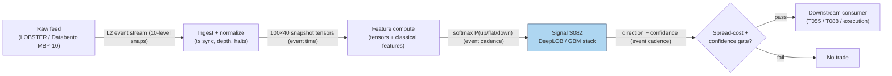

## Stage 82/200 — S082: Deep learning on the LOB (DeepLOB + classical ML features)

*Batch SB9 · Signal 82/100 · Provenance [D/SR] · Family F — Statistical/ML Infrastructure*

### S1. One-line verdict

| | |
|---|---|
| **What it is** | **DeepLOB** (**deep** neural network on the **limit order book**: **CNN** spatial filters + **LSTM** temporal memory) predicts the next mid-price move from 100 LOB snapshots; a cheaper cousin uses hand-built features in logistic/**GBM** (gradient-boosted machine) models. |
| **When it works** | When you have synchronized, high-quality event data and the model beats a GBT (gradient-boosted trees) baseline *net of* fees, latency, queue, and turnover — horizons longer than your execution latency, labels on executable prices. |
| **When it dies** | When 55% accuracy meets a spread ten times the edge; mid-price evaluation traded at bid/ask; assumed fills with no queue model; FI-2010-style (the public LOB benchmark: 5 NASDAQ-Nordic stocks, 10 days — see §S9) toy benchmarks. |
| **Build-or-buy in one line** | Buy the L2 (level-2: full depth-of-book) data and replay; build the model only after a non-deep baseline, and only if the neural net improves *net-of-cost* consistently. |

Provenance **[D/SR]**: the deep form is documented [D] (Zhang, Zohren & Roberts 2019; Sirignano & Cont 2019); the classical feature-stack form is a standard reconstruction [SR].

> **The central sentence of this chapter, from the research:** *"Accuracy, Sharpe, and gross backtest return are NOT interchangeable with executable profit."* Everything below is an elaboration of it.

### S2. How it works — plain human explanation

It is 9:47:03.000. AAPL's book shows 800 shares bid at 231.40 and 300 offered at 231.41, with similar stacks ten levels deep on each side. The **LOB** — limit order book — is the full ladder of resting limit orders, price by price, size by size. The **microprice** (size-weighted midpoint) sits a hair above the mid: the book is bid-heavy, so the next move is slightly more likely up. That single observation is the entire classical program: hand-built features (imbalance, queue depth, spread, short-horizon return) fed into logistic regression or gradient-boosted trees (**GBT**: ensembles of decision trees like LightGBM/XGBoost, the tabular-data workhorse).

**DeepLOB** (Zhang, Zohren & Roberts 2019) skips the hand-building. It feeds the last 100 ten-level snapshots — a 100×40 tensor (100 events × 10 levels × price+size × bid+ask) — into **convolutional** filters (**CNN**: a layer sliding small weight patterns across an input to find local structure — here, *across book levels*) stacked with **LSTM** modules (**long short-term memory**: a recurrent layer remembering patterns *across time*). Out comes a **softmax** — a normalized probability vector — over {up, flat, down} at horizons of 10/20/50/100 events. Trade the predicted direction above a confidence threshold.

Why should the book predict the next move? Because the book *is* the supply/demand schedule: heavy bid queues mean more buyers waiting than sellers, so the mid drifts toward the heavy side. The deep network's bet is that nonlinear interactions across levels and time carry information that linear features miss. Sirignano & Cont (2019) add a striking finding: a model trained *pooled across ~1,000 stocks* beats per-stock models — the price-formation mechanism is universal, not asset-specific — and long price/order-flow history helps (path dependence).

The honest counterweight: a classifier does not pay the spread. The worked example (§S4) shows a 55%-accurate model losing 0.049 pence per trade, because the expected move is smaller than the half-spread it must cross. *"AUC (area under the ROC curve) does not estimate any of those terms. Even a statistically significant forecast can have negative net P&L if the expected move is smaller than the effective round-trip cost."*

**Mental model:**
- The LOB is a photograph of supply and demand; DeepLOB learns to read nonlinear patterns in a stack of 100 photographs.
- Classification accuracy is measured on mid-prices; profit is made at bid/ask — the two live in different currencies.
- The development sequence is fixed: logistic/trees → feature-rich trees → compact neural → DeepLOB only if neural wins *net-of-cost* → Transformer only if it survives strict walk-forward plus regime tests.

### S3. The math — exact formula

**DeepLOB input [D]:** X_t ∈ ℝ^{100×40}: the 100 most recent 10-level LOB snapshots in *event time* (price and size at each of 10 bid and 10 ask levels = 40 features per snapshot), normalized (z-score per feature in the paper's protocol).

**Labels [D]:** with m_−(t) = average mid over the past k events and m_+(t) = average mid over the next k events, l_t = (m_+(t) − m_−(t))/m_−(t). Class: up if l_t > +α, down if l_t < −α, flat otherwise, at horizons k ∈ {10, 20, 50, 100} events. α is an example threshold (the paper uses small multiples of tick-relative moves — `example — not an institutional standard`).

**Architecture [D]:** convolutional layers over the (time × level) grid extract spatial book features (early filters reconstruct microprice-like quantities across all 10 levels), then LSTM layers for temporal dependence, then a softmax: P(y ∈ {up, flat, down} | X_t). **Trade rule [SR framing]:** trade the argmax direction only if max_c P(c) > p_conf (example: 0.6) *and* the expected move clears the spread-cost filter — calibrate on executable prices, not mid-price labels.

**Classical feature-stack form [SR] (the Kercheval–Zhang-style setup — note the correction: the report entry cites "Kercheval & Seemann," but the published paper is Kercheval & Zhang 2015):** per-bar features — microprice deviation (S004), OFI (order flow imbalance; S001), bid/ask depth ratio, spread, queue imbalance at levels 1–5, short-term return, Lee–Ready (the standard quote-rule algorithm for signing trades as buyer- or seller-initiated) trade-sign imbalance; label = sign of mid change over the next N events; model P(up | features) via logistic regression or GBM; trade when |P − 0.5| > threshold (example) with a spread-cost filter. **Caution [D/SR]:** a published research pipeline, not a plug-and-play rule; reproducing it needs full LOB reconstruction and heavy compute.

**Evaluation metrics:** directional accuracy is misleading on imbalanced 3-class labels — use **balanced accuracy** (1/3)·Σ_c(correct_c/obs_c); for binary reductions use ROC-**AUC** (**area under the receiver-operating curve**: probability a random positive scores above a random negative) or PR-AUC. *"AUC does not estimate any of those terms"* in the net-P&L decomposition: Net P&L = forecast-driven move + captured spread − spread crossed − fees − slippage − adverse selection − impact − infra costs.

**Parameter table** (every default `example — not an institutional standard`):

| Parameter | Symbol | Typical range | Too small | Too large | Default example |
|---|---|---|---|---|---|
| Snapshots | T | 50–200 | misses temporal context | compute blowup, stale | T = 100 |
| Book depth | L | 5–20 levels | misses deep-book info | noise, sparse levels | L = 10 |
| Horizons | k | 10–100 events | sub-spread noise | signal decay | {10, 20, 50, 100} |
| Label band | α | 0–3 bp-equiv | label noise | class imbalance → flat | 1 bp-equiv |
| Confidence | p_conf | 0.5–0.8 | trades noise | never trades | 0.6 |
| Retrain cadence | — | weekly–quarterly | regime drift | compute cost | monthly |

**Variants:** (a) DeepLOB CNN–LSTM (documented); (b) LSTM-on-events / universal pooled model (Sirignano & Cont); (c) classical GBM on hand-built features [SR]; (d) Transformer/TransLOB successors (higher F1 — harmonic mean of precision and recall — on FI-2010 reported by some — unverified lead — but some report *no trading simulation*, so classification gain ≠ economic value).

### S4. Worked example — step-by-step numbers (SYNTHETIC)

**Setup (stated, hand-checkable):** a classifier with **55% directional accuracy** at a horizon longer than execution latency. When correct, the mid moves **0.06 pence** in our favor; when wrong, 0.06 pence against. We trade with market orders, paying **half the 0.10 p spread = 0.05 p** plus **0.005 p** fees+slippage per trade. (Pence units echo the LSE review lead in §S12; these numbers are synthetic and stated, not measured.) **Reproducibility:** `rng = np.random.default_rng(82)` — the arithmetic below is fully deterministic (no sampling), so the seed fixes the chart-generation environment and is stated so any re-run is byte-identical.

| Outcome | Prob | Mid move (p) | Spread paid (p) | Fees+slip (p) | Net per trade (p) |
|---|---|---|---|---|---|
| Correct call | 0.55 | +0.06 | −0.05 | −0.005 | **+0.005** |
| Wrong call | 0.45 | −0.06 | −0.05 | −0.005 | **−0.115** |
| **Expected** | 1.00 | +0.006 | −0.05 | −0.005 | **−0.049** |

Hand-check: expected mid move = 0.55×0.06 − 0.45×0.06 = +0.006 p ✓; net = 0.006 − 0.05 − 0.005 = −0.049 p/trade ✓. Correct-call net = 0.06 − 0.055 = +0.005 ✓; wrong-call net = −0.06 − 0.055 = −0.115 ✓. (The matching chart — waterfall of expected per-trade P&L — appears in §S11.)

**What to notice — the accuracy-vs-cost gap:** 55% accuracy *sounds* tradable; the arithmetic says each trade loses 0.049 pence because the expected move (+0.006 p) is an order of magnitude smaller than the half-spread it must cross (0.05 p). This is the review's lead: median simulated gross ≈ **0.01 p/trade** against a Tesco spread of **0.10 p — the spread is exactly 10× the gross edge** (unverified research lead, not asserted as fact). The 55% model is *useless* here for every reason the research lists: the edge is below the spread-crossing cost, turnover multiplies the bleed, and mid-price evaluation flatters what bid/ask trading would pay. This toy assumes fills happen; a real queue model would make it worse. Do not read this as a backtest.

### S5. Strategies that use this signal

- **T055 — DeepLOB + Feature-Stack Classifier**: *primary trigger* — deep learning on LOB sequences stacked with OFI and classical microstructure features (S082 primary, with S083, S001).
- **T088 — Full-Stack Signal Ensemble**: uses S082 as one base classifier blended with meta-labeling and purged-CV validation (S086, S082, S088).

### S6. Data required — exact spec

| Field | Type | Granularity | Source tier | Notes |
|---|---|---|---|---|
| LOB snapshots (10–20 levels, price+size) | float/int | **L2 event stream** (per order-book event) | Tier 2–3 | Full reconstruction; SIP L1 is insufficient for the deep form |
| Trade prints (for labels/signing) | struct | **L2 event stream** | Tier 2–3 | Lee–Ready signing for the classical form |
| Corporate actions | events | daily | Tier 0–1 | Price-level features must be split-adjusted |
| Timestamp sync map | metadata | per session | Tier 2–3 | Exchange vs capture clock; label leakage lives here |

Collection: LOBSTER (NASDAQ TotalView-ITCH reconstructions; selectable depth) or Databento MBP-10 (`dbn` schema, 10-deep), ≤20-line sketch:

```python
import databento as db, polars as pl, numpy as np
dl = db.Historical(); dl.batch.download("XNAS-20260102.mbp-10.dbn.zst", ...)
book = pl.read_parquet("snapshots.parquet").sort("ts_event")  # 40 cols: bid/ask px+sz x10
X = np.lib.stride_tricks.sliding_window_view(                 # 100-snapshot tensor
        book.select(px_sz_cols).to_numpy(), (100, 40)).squeeze(1)
k, alpha = 50, 0.0001                                          # horizon + label band (examples)
m_mid = book["mid"].to_numpy()
up = (m_mid[k:].mean() ...)                                    # label vs smoothed mids (vectorize!)
# CAUSAL: labels use only events > t; features only <= t. Leakage check mandatory.
```

Storage per symbol-day (cost-model §4): L2 MBP-10 liquid name ≈ **10–40 GB parquet** — research-only; never archive naively. Data-quality checklist: timestamp normalization (exchange vs capture), full vs truncated depth, auction/cross events, halts, corporate actions, synchronized clocks across venues (label leakage otherwise).

### S7. Local build on M5 Max / 128GB

**Feasibility: heavy — feasible for research, not for production training.** The verified byte arithmetic: a DeepLOB input tensor (batch 256 × 100 × 40 float32) = **4.096 MB input only**; activations/gradients/optimizer multiply that 10–50×, and a training cache of 1–5M examples runs 20–400 GB — training streams from NVMe, it does not sit in RAM (duck.ai planning figures). One liquid name's L2 day is 8–40 GB RAM (cost-model §3) — two names threaten the 77 GB working budget: **use per-symbol daily files + streaming**. Inference on the M5 GPU (planning estimates, not measured): compact DeepLOB 1–10 ms per sequence — adequate for research cadence; *"do NOT put Python preprocessing + GPU sync + deep recurrent model on the critical path"* of any live tick loop.

Engineering band: **Tier H (60–200 h, cost-model §5)** — reproduce DeepLOB 100–250 h; clean pipeline + reproducible training 250–500 h; full L3 replay + queue model + execution sim 1,000–2,000+ h (duck.ai planning estimates). Budget **~150 h ≈ $22,500 loaded-cost estimate** at $150/hr for a faithful reproduction — *after* the GBT baseline exists.

### S8. Buy vs build

| Option | What you get | Indicative price | Gains | Loses |
|---|---|---|---|---|
| Tier-0 / academic (LOBSTER academic) | MBO (market-by-order — per-order data)/ITCH (NASDAQ's direct order-feed protocol) replay, selectable depth | ~hundreds/yr academic | The honest data at research prices | Academic license limits; NASDAQ-only |
| Tier-2 (Databento Standard) | MBP-10 L2, OPRA research | ~$200/mo + usage | Clean schemas, broad venues | Usage meter runs fast at L2 |
| Tier-3 commercial historical L2/L3 | Multi-year, multi-venue depth | several thousand → **$100,000+/yr** | Production-grade history | Budget-destroying for a first build |
| FI-2010 (public benchmark) | 10 days, 5 stocks, 10 levels, normalized | ~$0 | Free, comparable | **NOT adequate for production validation** |

*Indicative — verify before budgeting.* **Verdict: buy the data, build the model — in the right order.** Crossover: buy L2/replay (building means re-licensing exchange data anyway); build the model **only** after logistic/GBT baselines, and promote to DeepLOB only if the neural net improves *net-of-cost* consistently. Without synchronized high-quality event data and a demonstrated incremental edge after fees/latency/queue/turnover, **GBT is the better cost/performance choice**.

### S9. Success ratio / efficacy — documented evidence

| Study / source | Market & period | Metric | Before/after cost | Caveat |
|---|---|---|---|---|
| Zhang, Zohren & Roberts (2019), *IEEE Trans. Signal Processing* 67(11) | FI-2010 (5 NASDAQ-Nordic stocks, 10 days) + 1-yr LSE | Beats SVM/MLP/other CNNs on FI-2010 classification; stable OOS (out-of-sample) accuracy on LSE incl. untrained instruments | **Before-cost** (accuracy metric, not P&L) | The v1 preprint's "good profits in a simple trading simulation" is a before-cost simulation only; label definition dominates accuracy |
| Sirignano & Cont (2019), *Quant. Finance* 19(9) | US equities, billions of quotes/trades | Pooled universal model beats per-stock linear/nonlinear models OOS on *direction* of price moves; stable across time and sectors | **Before-cost** (direction accuracy, not executable P&L) | Documents predictability of direction, not profitability after spread/fees |
| Kercheval & Zhang (2015), *Quantitative Finance* 15(8) | High-frequency LOB data | SVM classification of price-move direction from limit-order-book features — the classical feature-stack program in published form | **Before-cost** (classification accuracy, not P&L) | Label/feature design dominates results; no executable after-cost P&L reported |

**FI-2010 limits (documented):** Ntakaris et al. (2017), *Journal of Forecasting* — 10 consecutive days, 5 stocks, 10 levels, horizons 10/20/30/50/100 — "NOT adequate for production validation": downsampled, pre-normalized, one illiquid-ish market. Successor papers (e.g. TransLOB) report higher F1 on FI-2010, but a survey notes some report **no trading simulation** — classification gain ≠ economic value (unverified lead).

**Honest bottom line:** DeepLOB is a genuine classification advance — the strongest documented OOS benchmark gains in this batch — and simultaneously the clearest example of the accuracy≠profit gap: *"AUC (area under the ROC curve) does not estimate any of those terms. Even a statistically significant forecast can have negative net P&L if the expected move is smaller than the effective round-trip cost."* As a standalone trigger it is a research-grade edge that usually dies at the spread; as the top of the development sequence (after GBT baselines earn their keep) it is the right tool. Credible deployment requires: horizon > execution latency, labels on executable prices with spread+fees, chronological cross-regime OOS, queue-aware conservative fills, and net-of-everything P&L.

### S10. Failure modes & pitfalls

1. **Mid-price evaluation, bid/ask trading** → evaluate on executable prices; mid-price accuracy flatters by ~half the spread per trade.
2. **No queue model** → assumed fills overstate capture; use conservative queue-aware fill simulation.
3. **Label leakage** → features at *t* use only events ≤ *t*; one future timestamp in normalization invalidates everything.
4. **FI-2010 overfitting** → 10 days, 5 stocks is a toy; require chronological, cross-regime, cross-instrument OOS.
5. **Turnover bleed** → predictions flipping every 50 events multiply costs; gate on confidence *and* minimum hold.
6. **Latency illusion** → inference + features must fit inside the horizon; `simulated only — requires MBO/ITCH` for queue-position claims.
7. **Skipping the GBT baseline** → if trees match the net net-of-cost, the deep model is pure complexity risk; enforce the development sequence.
8. **Regime drift** → book dynamics change with vol regimes; monitor live accuracy vs backtest and retrain on schedule.

### S11. Visuals




### S12. Sources

- Zhang, Z., Zohren, S. & Roberts, S. (2019). "DeepLOB: Deep Convolutional Neural Networks for Limit Order Books." *IEEE Transactions on Signal Processing*, 67(11), 3001–3012. arXiv:1808.03668. https://arxiv.org/abs/1808.03668v6
- Sirignano, J. & Cont, R. (2019). "Universal features of price formation in financial markets: perspectives from deep learning." *Quantitative Finance*, 19(9), 1449–1459. arXiv:1803.06917. https://arxiv.org/abs/1803.06917?context=stat.ML
- Ntakaris, A., Magris, M., Kanniainen, J., Gabbouj, M. & Iosifidis, A. (2017). "Benchmark Dataset for Mid-Price Forecasting of Limit Order Book Data with Machine Learning Methods." *Journal of Forecasting*. arXiv:1705.03233. https://arxiv.org/abs/1705.03233v4
- Kercheval, A.N. & Zhang, Y. (2015). "Modelling high-frequency limit order book dynamics with support vector machines." *Quantitative Finance*, 15(8), 1315–1329. https://ideas.repec.Org/a/taf/quantf/v15y2015i8p1315-1329.html
- Gould, M.D., Porter, M.A., Williams, S., McDonald, M., Fenn, D.J. & Howison, S. (2013). "Limit Order Books." arXiv:1012.0349. https://arxiv.org/abs/1012.0349v2 (Survey: the LOB background this chapter assumes.)

**Unverified leads** (chatbot-provided, not independently checkable — do not cite as fact):
- Simulated profit/trade ≈ −0.01–0.03 pence, median ~0.01 p; Tesco spread ~0.1 p (exactly 10×) — internally consistent arithmetic, underlying figures not independently verified.
- DeepLOB commercial historical L2/L3 data "several thousand → $100,000+/yr"; academic free/low-cost (indicative — verify before budgeting).
- Successor models (TransLOB): higher F1 on FI-2010; survey notes some report no trading simulation.
- DeepLOB inference/training planning figures (indicative): compact 1–10 ms inference; 1–8 h/epoch moderate training; 500–1,200 h multi-symbol build.

*Research provenance note — source log: Duck.ai answered Q-SB9-1–Q-SB9-3 (2026-09-10); Grok/Cursor answers pending (checked 2026-09-10).*
