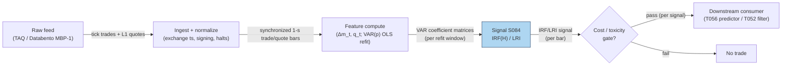

## Stage 84/200 — S084: Hasbrouck (1991) trade–quote VAR

*Batch SB9 · Signal 84/100 · Provenance [D] · Family F — Statistical/ML Infrastructure*

### S1. One-line verdict

| | |
|---|---|
| **What it is** | A vector autoregression (VAR) on the joint dynamics of quote revisions and signed trades; the impulse response of quotes to a trade *innovation* measures that trade's permanent price impact (its information content). |
| **When it works** | Liquid single-name equities with clean synchronized trade/quote data; used to measure information share of trades, calibrate transaction-cost models, and gate directional signals on trade informativeness. |
| **When it dies** | Thin, gappy, or mis-synchronized tapes; regime breaks (vol spikes, news); long-memory order flow where a short-lag VAR is misspecified; any venue where you cannot sign trades accurately. |
| **Build-or-buy in one line** | Build — it is ~50 lines of OLS plus closed-form impulse responses; the hard part is the synchronized tape, which you buy (TAQ/Databento). |

Provenance **[D]** (Hasbrouck 1991, *Journal of Finance*); never upgraded — the formulas below are the paper's, verified against the replication material in this batch's research notes.

### S2. How it works — plain human explanation

A **VAR** (vector autoregression) is just a system of regressions where each variable is predicted from *past values of all variables in the system*. A **quote revision** is the change in the mid-price (the average of best bid and best ask) from one observation to the next. A **signed trade** is a trade stamped +1 if the buyer initiated it (a market buy lifting the ask) and −1 if the seller initiated it. A **trade innovation** is the *unexpected* part of the signed trade — the part not predictable from past trades and past quote revisions.

Picture 9:47:03 on a liquid name: bid $231.40 × 800 / ask $231.41 × 300. A 500-share market buy lifts the ask; the mid moves from $231.405 to $231.41 — a +$0.005 quote revision. Was that half-cent *information* or *mechanics* (thin ask side)? Hasbrouck's idea: model the whole joint dance of trades and quote revisions as a VAR, then ask: "if a completely unexpected buy arrives right now, how much does the quote *permanently* move?" The answer is the **impulse response function (IRF)** — the cumulative quote revision after a trade shock — and its limit is the **long-run impact (LRI)**, the trade's permanent price impact. That permanent component is the trade's *information content*: transitory wiggles wash out, but information stays in the price.

Why should this work economically? Two forces. First, **adverse selection**: when an informed trader buys, the book learns something bad may be coming and reprices upward — the trade *causes* a permanent revision. Second, **inventory and liquidity mechanics**: even uninformed flow moves quotes temporarily as liquidity providers manage inventory, and those moves decay. The VAR separates the two: permanent = information, transitory = plumbing. The key discipline is that only the *unexpected* trade moves the needle — expected, autocorrelated order flow is already in the price.

- **Mental model 1:** Trades and quotes are two dancers; the VAR is the choreography sheet. A step that *surprises* (innovation) moves the whole routine permanently; a rehearsed step doesn't.
- **Mental model 2:** Every trade's price impact has a permanent (information) half-life of forever and a transitory (inventory) half-life of seconds — the IRF draws the boundary between them.
- **Mental model 3:** This is a *measurement device first, trading signal second*. Its day job is telling you how informative your flow is; T056 turns that measurement into a predictor.

### S3. The math — exact formula

Let $m_t = (a_t + b_t)/2$ be the mid-price (average of best ask $a_t$ and best bid $b_t$, in dollars), $\Delta m_t = m_t - m_{t-1}$ the quote revision, and $q_t$ the signed trade ($+1$ buyer-initiated, $-1$ seller-initiated, or signed size). Stack $x_t = (\Delta m_t, q_t)^\top$. The **VAR(p)** with $p$ lags is:

$$x_t = c + \sum_{\ell=1}^{p} A_\ell\, x_{t-\ell} + u_t,$$

where $c$ is a $2 \times 1$ intercept, each $A_\ell$ is a $2 \times 2$ coefficient matrix, and $u_t$ is the 2-vector of *innovations* (one-step-ahead forecast errors), with $u_t = (u_{m,t}, u_{q,t})^\top$.

The **impulse response function** to a unit trade innovation $e_q = (0,1)^\top$ traces the cumulative quote revision:

$$\mathrm{IRF}(H) = \sum_{h=0}^{H} \Psi_h\, e_q, \qquad \Psi_0 = I,\;\; \Psi_h = \sum_{\ell=1}^{\min(h,p)} A_\ell \Psi_{h-\ell},$$

and the **long-run impact (LRI)** — the permanent price impact of one unexpected trade — is the closed form

$$\mathrm{LRI} = e_m^\top \Bigl(I - \sum_{\ell=1}^{p} A_\ell\Bigr)^{-1} e_q, \qquad e_m = (1,0)^\top.$$

A trade of size $q$ (shares) has permanent impact $\approx \mathrm{LRI} \times q$.

| Parameter | Symbol | Typical range | Too small / too large | Default (example) |
|---|---|---|---|---|
| Lags | $p$ | 5–30 | Too few: long-memory flow missed, IRF biased; too many: overfit, noisy LRI | 10 *— example, not an institutional standard* |
| Sampling | $\Delta t$ | 1 s – 5 min | Too fine: microstructure noise dominates; too coarse: impact already absorbed | 1-s bars *— example* |
| IRF horizon | $H$ | 50–500 events | Too short: IRF hasn't converged; too long: adds estimation noise | 100 *— example* |
| Size transform | $q_t$ | sign / signed shares / signed dollars / $\mathrm{sign}(q)\lvert q\rvert^\beta$ | Raw shares: dominated by prints; sign-only: discards size concavity | signed shares *— example* |

**Normalization:** quote revisions in dollars (or log-mid changes); trade variable as sign, signed shares, or signed dollars. **Causal timing:** the VAR is estimated on data $\le t$; the IRF/LRI computed at bar $t$ uses only history, so a forecast "the next unexpected buy moves the mid by LRI" is tradable no earlier than $t+1$. **Variants:** (1) *duration-augmented VAR* (Dufour & Engle 2000) adds $\ln(T_i)$ inter-trade durations — short durations carry more information; (2) *asymmetric VEC* (Escribano & Pascual 2006) lets bid and ask respond differently to buys vs sells; (3) *multi-variable VAR* adding spread/depth when the 2-variable system is inadequate.

### S4. Worked example — step-by-step numbers (SYNTHETIC)

All numbers below are **synthetic**, generated with seed **42** (`rng = np.random.default_rng(42)`), and the chart plots exactly these numbers. DGP: a VAR(1) in $(\Delta m_t, q_t)$ with true $A_1 = [[0.10, 0.012],[0.05, 0.60]]$ ($\Delta m$ in dollars, $q = \pm 1$), 5,000 events.

First, the raw input shape — 6 events of the synthetic tape (bid/ask in dollars, $q$ = trade sign):

| t | bid | ask | mid | $\Delta m$ | q |
|---|---|---|---|---|---|
| 0 | 99.9932 | 100.0032 | 99.9982 | −0.0018 | +1 |
| 1 | 100.0048 | 100.0148 | 100.0098 | +0.0116 | +1 |
| 2 | 100.0057 | 100.0157 | 100.0107 | +0.0010 | +1 |
| 3 | 100.0152 | 100.0252 | 100.0202 | +0.0095 | +1 |
| 4 | 100.0380 | 100.0480 | 100.0430 | +0.0228 | +1 |
| 5 | 100.0340 | 100.0440 | 100.0390 | −0.0040 | −1 |

Estimating the VAR(1) by OLS on all 5,000 events gives $\hat A_1 = [[0.1046,\ 0.0120],[0.1479,\ 0.5958]]$ (close to the true DGP). Hand-check: $\mathrm{IRF}(1) = e_m^\top(I + \hat A_1)e_q = \hat A_1[0,1] = 0.0120$ dollars = **1.20 cents** per unexpected buy. Cumulating: IRF(2) = 2.04¢, IRF(3) = 2.55¢, IRF(5) = 3.05¢, IRF(10) = 3.31¢, converging to the closed-form LRI $= e_m^\top(I-\hat A_1)^{-1}e_q =$ **3.33 cents** — the permanent impact of one unexpected buy innovation, reached by about event 20 (chart).

**What to notice:** the IRF starts at 0 and *builds* — Hasbrouck's "protracted lag" finding is visible right here. **Limits:** no fees, no spread cost, and the DGP is a clean VAR(1) — real order flow has long memory a 1-lag VAR cannot capture, and the LRI is a measurement of information content, not a backtested profit.

### S5. Strategies that use this signal

- **T056 — Hasbrouck Trade–Quote VAR Predictor** — primary trigger: predicts quote revisions from joint trade–quote dynamics; the IRF *is* the forecast.
- **T052 — AR/ARMA Innovation Trader** — filter/validator: trades forecast innovations (surprises), validated by the trade–quote VAR — only innovations the VAR deems information-bearing pass.
- **T030 — Multi-Level OFI Weighted Predictor** — confirmatory: integrated 10-level OFI as directional trigger, VAR-confirmed (the VAR's LRI weights how much of the OFI impulse is permanent).

### S6. Data required — exact spec

| Field | Type | Granularity | Source tier | Notes |
|---|---|---|---|---|
| Trades (price, size, exchange ts) | event | tick | Tier 2–3 | TAQ or Databento; exchange timestamps, not SIP-processed |
| Quotes (bid/ask, sizes, exchange ts) | event | tick | Tier 2–3 | Same session as trades; NBBO or direct |
| Corporate actions / halts | reference | daily | Tier 0–1 | Splits/dividends rescale mids; halt bars excluded |
| Derived: signed trade $q_t$, mid $m_t$ | computed | 1-s bars (example) | — | Lee–Ready or quote-rule signing; asof-join trades to prevailing quotes |

Ingest sketch (Python/polars, ≤20 lines):

```python
import polars as pl
tr = pl.read_parquet("taq_trades.parquet")          # ts, price, size, exch
qu = pl.read_parquet("taq_quotes.parquet")          # ts, bid, ask, bsize, asize
qu = qu.with_columns(mid=(pl.col("bid")+pl.col("ask"))/2)
trq = tr.join_asof(qu.sort("ts"), on="ts", strategy="backward")  # prevailing quote
trq = trq.with_columns(q=pl.when(pl.col("price")>pl.col("mid")).then(1)
                          .when(pl.col("price")<pl.col("mid")).then(-1)
                          .otherwise(None).alias("q"))            # quote rule (example)
bars = trq.group_by_dynamic("ts", every="1s").agg(
    pl.col("mid").last().alias("m"), pl.col("q").sum().alias("qbar"))
bars = bars.with_columns(dm=pl.col("m").diff())      # VAR input: (dm, qbar)
```

Storage (per `notes/cost-model.md` §4): L1 quotes+trades for one liquid symbol ≈ 2–8 GB/day parquet; 60 days ≈ 120–480 GB for a single name — per-symbol daily files, never a 500-symbol panel in RAM. Data-quality checklist: exchange vs SIP timestamp normalization; corporate-action adjustment; halted-session exclusion; DST/half-day calendars; stale-quote filtering.

### S7. Local build on M5 Max / 128GB

**Feasibility: feasible** (Tier M). The VAR itself is OLS on a few thousand 2×2 observations per refit — microseconds in numpy; the cost is all in tick ingest and the signing/asof join. Per `notes/cost-model.md` §2, a Python event loop handles ~100–500k events/sec (fine for ≤20 symbols of L1), and polars batch recompute (group_by_dynamic + rolling OLS) runs at ~1–10M rows/sec — refitting a 10-lag VAR on 5,000 one-second bars per symbol is milliseconds. RAM: one symbol-day of 1-s bars is kilobytes; even 60 days of 1-s bars for 500 symbols is trivial — the footprint rule of §3 only bites if you keep raw tick panels resident (don't). Engineering: Tier M, **20–60 h** ≈ **$3,000–9,000** at $150/hr loaded-cost estimate (ingest + signing + rolling VAR + IRF/LRI + monitoring). What breaks first at 500 symbols or full OPRA: the Python per-tick loop — move signing/join to Rust or pre-aggregated bars, and refit on a cadence rather than per event.

| Stack | When to pick |
|---|---|
| Python + polars | Default: ingest, signing, 1-s bars, rolling OLS, IRF analytics — everything in this chapter |
| Rust | >100 symbols tick-level, or sub-millisecond refit cadence |
| DuckDB | Ad-hoc research over multi-month tick archives without a cluster |

### S8. Buy vs build

| Option | What you get | Indicative price | Gains | Loses |
|---|---|---|---|---|
| Tier-0 free route (Alpaca IEX / Stooq) | Daily/1-min bars, no real tick quotes | ~$0 | $0 | Cannot sign trades or synchronize quotes — VAR impossible |
| Tier-1 retail (Polygon Stocks Advanced, Alpaca SIP) | SIP trades+quotes, 1-min/real-time | ~$30–200/mo *indicative — verify before budgeting* | Cheap synchronized tape | SIP latency; no depth; signing noise |
| Tier-2 professional (Databento Standard) | Exchange-timestamped L1/L2 (MBP-1/10) | ~$200/mo + usage *indicative — verify before budgeting* | Honest timestamps for signing/VAR | Usage meter runs on full universes |
| Academic/institutional (TAQ via WRDS; LOBSTER) | Publication-grade tick history | hundreds/yr academic *indicative* | Gold-standard replay | Academic licensing; delayed |

**Verdict: build the estimator, buy the tape.** The VAR/IRF math is 50 lines and needs your own lags, horizons, and size transforms, but synthesizing exchange-timestamped trades+quotes yourself is re-licensing TAQ — buy Databento or TAQ access. Crossover: if SIP 1-s bars suffice for your horizon (minutes, not seconds), the Tier-1 route wins on cost.

### S9. Success ratio / efficacy — documented evidence

| Study / source | Market & period | Metric | Before/after cost | Caveat |
|---|---|---|---|---|
| Hasbrouck (1991), *J. Finance* | NYSE issues | Permanent impact positive & concave in size; full impact arrives with protracted lag; large trades widen spreads; wide-spread trades more informative; stronger asymmetries in small firms | Before-cost (measurement) | 1991 market structure; specialist system — magnitudes not portable |
| Dufour & Engle (2000), via CFS working-paper discussion | NYSE (duration-augmented VAR) | Shorter inter-trade durations → more informative trades (negative duration coefficients) | Before-cost (measurement) | Requires accurate trade-time stamps |
| Escribano & Pascual (2006), *Empirical Economics* | Multiple microstructures | Buys more informative than sells; bid/ask adjust asymmetrically; symmetry likelihood rises with volatility | Before-cost (measurement) | Model-dependent asymmetries |
| Campigli, Bormetti & Lillo (recent extension) | NASDAQ | S-VAR misspecified when impact is nonlinear in sign or order flow has long memory; instantaneous impact assumed constant while liquidity fluctuates | Methodological caveat | Limits naive VAR trading use |

Regimes where it fails: volatility spikes (parameters unstable); news jumps (revisions are jump-driven, not trade-driven); thin names (signing error dominates); crowded periods where everyone trades the same innovation proxy. **Honest bottom line:** as a standalone trigger this is a *measurement* edge, not a documented net-of-cost alpha — the literature documents the *existence and shape* of trade informativeness, not a tradable Sharpe. As a filter/validator (T052) and cost-model input it is genuinely useful: it tells you which flow to fade and which to respect.

### S10. Failure modes & pitfalls

1. **Trade-signing error** (Lee–Ready/quote-rule mislabels mid-spread prints) → mitigate: exchange timestamps, tick-test fallback, report signing-agreement rates.
2. **Lookahead via quote synchronization** (using the quote *after* the trade to sign it, then predicting that same quote) → mitigate: strict backward asof joins; trade at $t$ sees quotes $\le t$.
3. **Lag misspecification** (too few lags on long-memory flow) → mitigate: AIC/BIC lag selection per symbol, rolling refits.
4. **Regime breaks** (FOMC, earnings, vol spikes change $A_\ell$ intraday) → mitigate: regime-gated refits; suspend thresholds in jumps.
5. **Microstructure noise vs signal confusion** (bid–ask bounce looks like mean-reverting "information") → mitigate: mid-prices only, never trade prices, in the VAR.
6. **Overfitting the horizon/size transform** (tuning $H$, $\beta$ until the IRF "looks nice") → mitigate: fix transforms a priori; validate LRI stability out-of-sample.
7. **Cost blindness** (3.33¢ permanent impact means nothing if the spread is 5¢) → mitigate: net the IRF against effective spread + fees before any trading claim.

### S11. Visuals




### S12. Sources

1. Hasbrouck, Joel (1991). "Measuring the Information Content of Stock Trades." *Journal of Finance* 46(1): 179–207. http://ideas.repec.org/a/bla/jfinan/v46y1991i1p179-207.html
2. Escribano, Álvaro & Pascual, Roberto (2006). "Asymmetries in bid and ask responses to innovations in the trading process." *Empirical Economics* 30(4): 913–946. http://ideas.repec.org/a/spr/empeco/v30y2006i4p913-946.html
3. Campigli, F., Bormetti, G. & Lillo, F. "Time and the Price Impact of a Trade." (Structural-VAR extension; documents S-VAR misspecification pitfalls.) https://www.researchgate.net/publication/227532807_Time_and_the_Price_Impact_of_A_Trade
4. *Journal of Finance*, Vol. 46, Issue 1 (March 1991) — issue listing confirming the Hasbrouck (1991) publication record. https://afajof.org/issue/volume-46-issue-1/

**Unverified leads** (chatbot/batch-research claims without an independently checkable source this batch; do not cite as evidence):
- Duck.ai Q-SB9-1 formula summary (verified arithmetic): VAR(p), IRF, LRI forms used in §S3; "the informative component = UNEXPECTED trade innovation, not total volume."
- Dufour & Engle (2000) duration findings as summarized in a CFS working-paper discussion (shorter durations → more informative trades) — widely cited, URL not captured this batch.
- Source log: Duck.ai answered Q-SB9-1–Q-SB9-3 (2026-09-10); Grok/Cursor answers pending (checked 2026-09-10).
