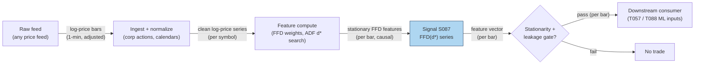

## Stage 87/200 — S087: Fractional differentiation (memory-retaining stationarization)

*Batch SB9 · Signal 87/100 · Provenance [D] · Family F — Statistical/ML Infrastructure*

### S1. One-line verdict

| | |
|---|---|
| **What it is** | A preprocessing transform: differentiate a price series to a *fractional* order $d$ — just enough to make it stationary (stable mean/variance) while preserving the long memory that integer differencing (returns) destroys. |
| **When it works** | As a feature-engineering step feeding ML models: stationary inputs that still correlate with price levels, fitted leakage-safely on training data. |
| **When it dies** | Applied naively with $d$ fitted on the full sample (lookahead); $d$ too high (memory erased) or too low (nonstationary inputs break the model); structural breaks the ADF test cannot see. |
| **Build-or-buy in one line** | Build — it is a 15-line binomial-weight filter; nothing to buy except the price feed. |

Provenance **[D]** (López de Prado, *Advances in Financial Machine Learning*, 2018, Ch. 5); formulas verified against this batch's hand-checked research notes.

### S2. How it works — plain human explanation

**Stationarity** means a series' statistical properties (mean, variance) don't drift over time — most ML models and statistical tests quietly assume it. A **unit root** is the classic violation: a random-walk price whose level wanders. **Fractional differentiation** generalizes "take returns" to a continuous dial: instead of differencing to integer order 1 (returns: memory erased) or 0 (levels: nonstationary), you differentiate to a *fraction* $d$ between 0 and 1.

The economic intuition: integer differencing is a sledgehammer. A return series is essentially *uncorrelated with the price level it came from* — the entire history of "where we are" is thrown away. López de Prado's resolution: find the *smallest* $d$ (call it $d^*$) at which an **ADF test** (Augmented Dickey–Fuller — a statistical test for the presence of a unit root) first rejects nonstationarity, while the transformed series still correlates strongly with the original log prices. You get stationarity *and* keep most of the memory.

The mechanics are a weighted sum of past log prices with **binomial weights** that decay but never reach zero for $0 < d < 1$ — unlike returns, where the weights are $(1, -1, 0, 0, \dots)$ and history is cut off after one lag. Because the weights never vanish, the window must be **truncated**: drop weights below a tolerance $\tau$ (the **fixed-width window**, FFD), giving a causal, fixed-length filter. **Leakage-safe** means: $d^*$ and the truncation are chosen on *training data only*, and the filter is applied rolling — the value at bar $t$ uses only bars $\le t$.

- **Mental model 1:** Returns are amnesia; levels are a fever dream (nonstationary). Fractional $d$ is the dimmer switch between them — turn it up just until the ADF test says "stationary."
- **Mental model 2:** The weights are a fading memory: yesterday matters a lot, last month a little, and — unlike returns — last month still matters *at all*.
- **Mental model 3:** This is plumbing, not alpha. It never generates a trading signal by itself; it makes the *inputs* to your models well-behaved.

### S3. The math — exact formula

The fractional difference operator $(1-L)^d$ (where $L$ is the lag operator, $Lx_t = x_{t-1}$) expands as an infinite weighted sum:

$$(1-L)^d x_t = \sum_{k=0}^{\infty} w_k\, x_{t-k}, \qquad w_0 = 1,\;\; w_k = -w_{k-1}\,\frac{d-k+1}{k}.$$

The **fixed-width** version truncates at lag $L-1$, the first lag with $\lvert w_{L-1}\rvert < \tau$:

$$\tilde x_t(d, L) = \sum_{k=0}^{L-1} w_k\, x_{t-k}.$$

Boundary cases: $d = 0$ gives $\tilde x_t = x_t$ (identity); $d = 1$ gives weights $(1, -1, 0, \dots)$, i.e. first differences. For $d \in (0,1)$, weights satisfy $-1 < w_k < 0$ for all $k > 0$ — the alternation that keeps the filtered series stationary while memory decays.

| Parameter | Symbol | Typical range | Too small / too large | Default (example) |
|---|---|---|---|---|
| Fractional order | $d$ | 0.1–0.4 memory-retaining; 0.4–0.8 stronger stationarization; $>1$ usually unnecessary | Too small: ADF fails, inputs nonstationary; too large: correlation with levels collapses — you've reinvented returns | smallest $d$ with ADF $p < 0.05$ *— example rule, not an institutional standard* |
| Truncation tolerance | $\tau$ | $10^{-3}$–$10^{-5}$ (illustrative) | Too large: fixed window too short, memory cut; too small: enormous $L$, wasted compute | $10^{-5}$ *— example* |
| Window / input | $x_t$ | log prices | Raw prices with splits/dividends: jumps corrupt weights | log prices *— example* |

**Normalization:** apply to log prices (never raw prices across corporate actions). **Causal timing:** $\tilde x_t$ uses only $x_{t}, \dots, x_{t-L+1}$ — tradable no earlier than $t+1$ is automatic since this is a feature transform, but $d^*$ must be selected on a strictly-prior training window (purged/embargoed per S088). **Variants:** (1) *expanding window* (weights grow with $t$ — early points carry different memory; deprecated in favor of FFD); (2) *ARFIMA-style* estimation of $d$ via the fractional-integration parameter; (3) *per-regime $d$* refit on rolling windows.

### S4. Worked example — step-by-step numbers (SYNTHETIC)

All numbers below are **synthetic** (seed **2**, `rng = np.random.default_rng(2)`); the chart plots exactly these numbers. DGP: a 5,000-bar random-walk log-price series (a pure unit root — the hard case).

**Step 1 — the weights.** For $d = 0.4$, the recursion gives (truncation tolerance $\tau = 10^{-3}$, illustrative):

| $k$ | 0 | 1 | 2 | 3 | 4 | 5 | 6 | 7 | 8 | 9 |
|---|---|---|---|---|---|---|---|---|---|---|
| $w_k$ | 1.000000 | −0.400000 | −0.120000 | −0.064000 | −0.041600 | −0.029952 | −0.022963 | −0.018371 | −0.015156 | −0.012798 |

Hand-check: $w_1 = -0.4$; $w_2 = -(-0.4)(0.4-1)/2 = -0.12$; $w_3 = -(-0.12)(0.4-2)/3 = -0.064$. ✓. Applied to the five values $100, 99, 98, 97, 96$ at lags 0–4: $\tilde x = 100 - 0.4(99) - 0.12(98) - 0.064(97) - 0.0416(96) = 100 - 39.6 - 11.76 - 6.208 - 3.9936 = \mathbf{38.438}$. (Caution: at least one popular online explainer prints 30.576 for this arithmetic — recompute it yourself; the recursion above is correct.) Sanity boundaries: $d = 0$ returns the input unchanged (123.45 → 123.45); $d = 1$ returns the first difference (100, 99 → 1.00).

**Step 2 — truncation.** At $\tau = 10^{-5}$ the fixed-width lag is $L = 3382$ for $d = 0.2$, $L = 927$ for $d = 0.5$, and $L = 228$ for $d = 0.8$ — smaller $d$ means slower weight decay means a longer fixed window. The chart's left panel shows this decay.

**Step 3 — the tradeoff.** Scanning $d$ from 0 to 1 on the synthetic random walk:

| $d$ | ADF $p$-value | corr($\tilde x$, log-price) |
|---|---|---|
| 0.00 | 0.7354 (nonstationary) | 1.000 |
| 0.25 | 0.2070 (nonstationary) | 0.889 |
| **0.30** | **0.0267 — first rejection → $d^*$** | **0.882** |
| 0.50 | 0.0000 | 0.549 |
| 1.00 | 0.0000 | 0.015 (memory gone) |

**What to notice:** at $d^* = 0.30$ the series is stationary (ADF $p = 0.0267 < 0.05$) yet still 88% correlated with the price level — compare with returns ($d = 1$), whose correlation with levels is 0.015: pure amnesia. **Limits:** this is a clean random walk; real prices have breaks and regime shifts the ADF test can miss, and $d^*$ is sample-dependent — refit it only on training data, never the evaluation window.

### S5. Strategies that use this signal

- **T057 — Fractional-Differentiation Memory Trader** — primary trigger: trades fractionally-differenced series preserving long memory, AR-timed — this signal *is* the feature pipeline.
- **T088 — Full-Stack Signal Ensemble** — feature preprocessing: blends all S001–S100 with meta-labeling; FFD is the memory-retaining stationarization applied to price-based ML inputs before the ensemble (a preprocessing role, not a trigger — stated honestly).

### S6. Data required — exact spec

| Field | Type | Granularity | Source tier | Notes |
|---|---|---|---|---|
| Log prices (any symbol) | numeric | any frequency (1-min bars used here) | Tier 0–2 | Any price feed; corporate-action-adjusted |
| ADF test statistics | computed | per $d$ candidate | — | statsmodels or hand-rolled |
| $d^*$, truncation lag $L$ | fitted | per training window | — | Fitted on training data only |

Ingest/feature sketch (Python, ≤20 lines):

```python
import numpy as np
def ffd_weights(d, tau=1e-5):
    w = [1.0]
    while abs(w[-1]) >= tau or len(w) == 1:
        k = len(w)
        w.append(-w[-1] * (d - k + 1) / k)   # binomial recursion
    return np.array(w[:-1])
def ffd(logp, d, tau=1e-5):
    w = ffd_weights(d, tau)                   # fixed-width, causal
    y = np.convolve(logp, w, mode="full")[:len(logp)]
    return y, len(w) - 1                      # drop first L-1 as warmup
# select d*: smallest d with ADF p < 0.05 on TRAINING window only
```

Storage (per `notes/cost-model.md` §4): 1-min bars for 500 symbols ≈ 50 MB/day parquet; a 60-day panel ≈ 3 GB — archive freely. FFD adds one float column per $d$; the weights vector is kilobytes. Data-quality checklist: corporate-action-adjusted log prices; no forward-filled gaps longer than $L$; session calendars consistent between fitting and application windows.

### S7. Local build on M5 Max / 128GB

**Feasibility: trivial** (Tier M, low end — the transform is a convolution). Per `notes/cost-model.md` §2, numpy vectorized math runs ~50–200M elements/sec: a 500-symbol × 252-bar panel convolved with a 1,000-weight kernel is sub-millisecond to a few milliseconds — this batch's own research notes put FFD at "sub-ms/500 symbols." The real work is the $d^*$ search (one ADF per $d$ candidate per symbol per refit), still seconds for a full universe. RAM: tens of MB (§3); the weights are negligible. Engineering: Tier M low end, **~20–40 h** ≈ **$3,000–6,000** at $150/hr loaded-cost estimate — the standalone filter is an afternoon; the leakage-safe rolling version with stationarity testing, purged $d^*$ selection, and a feature-store integration is the rest. What breaks first at 500 symbols: nothing in compute — what breaks is *discipline*: refitting $d^*$ on overlapping windows without purging (see S088).

| Stack | When to pick |
|---|---|
| Python + numpy | Everything in this chapter — the reference implementation |
| Python + polars | When FFD is one of many rolling features over a bar panel |
| Rust | Only if FFD sits inside a tick-level hot loop (rare) |

### S8. Buy vs build

| Option | What you get | Indicative price | Gains | Loses |
|---|---|---|---|---|
| Tier-0 free (Stooq, Alpaca IEX) | Daily bars | ~$0 | $0 start for daily-frequency FFD research | Coarse frequency only |
| Tier-1 retail (Polygon, Tiingo) | 1-min/real-time SIP bars | ~$30–200/mo *indicative — verify before budgeting* | Cheap intraday panels for $d^*$ search | — |
| Build the transform | 15-line filter + ADF search | eng time only | Your own $d^*$, $\tau$, rolling discipline | — |
| Academic route | The AFML book itself (Wiley, 2018) | book price *indicative* | Canonical reference | — |

**Verdict: always build the transform; buy only the price feed.** There is nothing to license — FFD is a published formula. The crossover question is not build-vs-buy but *which frequency of bars to buy* for the $d^*$ search: daily bars (free) suffice to learn the method; 1-min bars (Tier 1) for production features.

### S9. Success ratio / efficacy — documented evidence

| Study / source | Market & period | Metric | Before/after cost | Caveat |
|---|---|---|---|---|
| López de Prado (2018), *AFML* Ch. 5 | Equities/FX (book examples) | $d^*$ typically well below 1 (often ~0.3–0.6), with high correlation to the original level at $d^*$ | N/A (feature transform) | Book examples, not a trading backtest |
| Practitioner reproduction at scale (Binance USD-M perpetuals, 568 pairs, hourly) | Crypto, hourly | FFD reproduced causally with no lookahead; fixed-width truncation stable across the cross-section | N/A (replication) | Crypto cross-section; method validation, not P&L |
| Ritchie Ng / RAPIDS explainer | Illustrative | Hand-worked weight arithmetic for $d = 0.4$ | N/A | Pedagogical; recompute the arithmetic yourself (see §S4 erratum note) |

No documented standalone Sharpe exists for "fractional differentiation" — it is not a signal, it is a *preprocessing step*, and the literature treats it that way. Regimes where it fails: structural breaks (a break makes $d^*$ meaningless); ultra-short windows where $L$ exceeds the available history; assets whose "memory" is spurious (then FFD preserves noise, beautifully stationary noise). **Honest bottom line:** as a standalone trigger this has no edge and claims none; as a feature transform it is the disciplined alternative to returns — the evidence is methodological (stationarity + retained memory), and its trading value flows entirely through the models it feeds (T057, T088).

### S10. Failure modes & pitfalls

1. **Lookahead in $d^*$ selection** (choosing $d$ on the full sample, then "predicting" in-sample) → mitigate: select $d^*$ on a strictly prior training window with purging/embargo (S088).
2. **$d$ too high** (memory erased — you've built expensive returns) → mitigate: monitor corr($\tilde x$, log-price) at $d^*$; if it collapses, the transform adds nothing.
3. **$d$ too low** (ADF fails — nonstationary inputs silently break downstream models) → mitigate: hard gate on the ADF $p$-value before the features enter any model.
4. **Truncation too aggressive** (large $\tau$ cuts the long tail that *is* the memory) → mitigate: keep $\tau \le 10^{-5}$ unless you can show the tail is numerically irrelevant.
5. **Corporate actions / unadjusted prices** (a split looks like a permanent shock the weights smear across $L$ bars) → mitigate: log prices from an adjusted feed, always.
6. **Refitting $d^*$ on overlapping windows** (churn and implicit lookahead) → mitigate: refit on a fixed cadence on non-overlapping training blocks.
7. **ADF test fragility** (size/power issues, heteroskedasticity, breaks) → mitigate: complement with a KPSS check; never let one test statistic be the only gate.

### S11. Visuals




### S12. Sources

1. López de Prado, Marcos (2018). *Advances in Financial Machine Learning.* Wiley, Chapter 5 "Fractionally Differentiated Features." ISBN 978-1-119-48208-6. https://biblio.com.au/9781119482086
2. Practitioner reproduction: "Fractional Differentiation at Scale (López de Prado, AFML Ch. 5)" — FFD reproduced on 568 Binance USD-M perpetuals, causal, no lookahead. https://github.com/darufinance/lopez-de-prado-work-review/blob/HEAD/projects/02_fractional_differentiation/writeup/README.md
3. Ng, Ritchie. "Fractional Differencing to Minimize Memory Loss While Making a Time Series Stationary." *RAPIDS AI* (Medium). https://medium.com/rapids-ai/rapid-fractional-differencing-to-minimize-memory-loss-while-making-a-time-series-stationary-2052f6c060a4
4. AFML practitioner skill summary (transformation guidance: minimum fractional-differencing order for stationarity; fit order and threshold within training data). https://github.com/nutdnuy/afml-book-skill/blob/HEAD/.github/skills/lopez-de-prado-financial-ml/SKILL.md

**Unverified leads** (batch-research claims without an independently checkable source this batch):
- Duck.ai Q-SB9-1 formula summary (verified arithmetic): $(1-L)^d$ expansion, $w_k$ recursion, fixed-width form, truncation rule, $d$ bands (0.1–0.4 / 0.4–0.8), "smallest $d$ passing stationarity while retaining price correlation."
- "d\* often ~0.3–0.6 on equities/FX" per the reproduction README's summary of the book — literature summary, not an independent measurement.
- Source log: Duck.ai answered Q-SB9-1–Q-SB9-3 (2026-09-10); Grok/Cursor answers pending (checked 2026-09-10).
