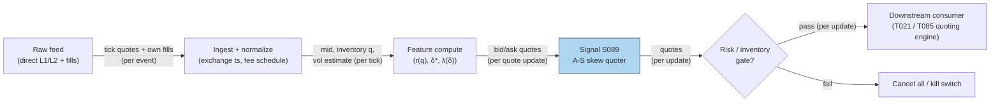

## Stage 89/200 — S089: Avellaneda–Stoikov inventory-skew market making

*Batch SB9 · Signal 89/100 · Provenance [D] · Family F — Statistical/ML Infrastructure*

### S1. One-line verdict

| | |
|---|---|
| **What it is** | The closed-form optimal market-making rule: quote around a *reservation price* (mid-price shifted against your inventory) at an *optimal spread* set by volatility, risk aversion, and book depth. |
| **When it works** | As a quoting framework for inventory control in simulation and in live market making with real microstructure infrastructure (colocation, queue priority, fee-tier access). |
| **When it dies** | Retail/small-account live trading: no colocation, poor queue position, adverse selection, and inventory limits you can't absorb — the paper's assumptions do not survive contact with a real book. |
| **Build-or-buy in one line** | Build the math (closed form, an afternoon); buy the connectivity, colocation, and market-data — and paper-trade for months before risking capital. |

Provenance **[D]** (Avellaneda & Stoikov 2008, *Quantitative Finance*); formulas use the corrected $\ln(1+\gamma/\kappa)$ form per this batch's verified extraction notes. **The paper does NOT document that a live trader will earn the theoretical spread** — keep that sentence in mind for the entire chapter.

### S2. How it works — plain human explanation

A **market maker** continuously posts both a bid and an ask, earning the **spread** (the gap between them) when both sides get hit. **Inventory** is the position accumulated along the way — long 500 shares you didn't want is inventory. **Risk aversion** ($\gamma$) is how much you dislike holding that inventory overnight. **Adverse selection** is the market maker's nightmare: the traders who hit your quotes often know more than you, so your fills predict the price moving against you.

Avellaneda and Stoikov's insight: quote around a **reservation price** instead — your *personal* fair value, the mid-price *minus* a penalty proportional to your inventory. Long inventory? Your reservation price drops below the mid, so both quotes drop: your ask gets cheaper (inviting sellers to take you out of the long) and your bid backs away. The quotes *breathe* with the position, constantly leaning toward flat.

The **optimal spread** balances two forces: quote tighter and you get filled more often but earn less per fill; quote wider and each fill pays more but fills arrive rarely (**Poisson arrivals** — fill rates decaying exponentially in distance from the mid). Volatility widens the spread; more time left in the session widens it too.

Now the small-account reality, which the paper's math assumes away: **continuous prices, Brownian mid-price, Poisson arrivals, no queue priority, no latency, no market impact, simplified fees**. In a real book your quote sits behind fifty others at the same price, a faster trader reprices before your cancel arrives, and the fill that arrives is disproportionately the informed one. **A fill is not necessarily good news.** For a small account there is no colocation and poor queue priority. The real objective is **survival-adjusted net P&L**: hard inventory limits, kill switches, volatility-triggered spread widening, stale-quote cancels, conservative sizing.

- **Mental model 1:** The reservation price is a thermostat: inventory is the temperature, and the quotes are the heating/cooling that push it back toward zero.
- **Mental model 2:** The spread is the wage you demand for standing in front of informed flow — volatility and time-to-close set the wage; the book's depth sets how fast the work arrives.
- **Mental model 3:** The formula is the *starting point of an engineering project*, not a strategy. The edge, if any, lives in queue position, latency, fees, and risk controls — none of which are in the equations.

### S3. The math — exact formula

Let $s$ be the mid-price (dollars), $q$ the inventory (shares, positive = long), $\gamma$ the risk-aversion coefficient (per dollar²), $\sigma$ the mid-price volatility over the horizon (dollars), $T-t$ the time remaining (same time units as $\sigma$), and $\kappa$ the order-book depth parameter (per dollar) governing how fast fill arrivals decay with quote distance. The **reservation price** is:

$$r(s,q,t) = s - q\,\gamma\sigma^2(T-t).$$

The **optimal total spread** (corrected form — $\ln(1+\gamma/\kappa)$, *not* $\ln(1+\gamma\kappa)$) is:

$$\delta_a + \delta_b = \gamma\sigma^2(T-t) + \frac{2}{\gamma}\ln\!\left(1+\frac{\gamma}{\kappa}\right), \qquad \delta^* = \tfrac{1}{2}\bigl[\gamma\sigma^2(T-t) + \tfrac{2}{\gamma}\ln(1+\gamma/\kappa)\bigr],$$

with quotes $p_a = r + \delta^*$ (ask) and $p_b = r - \delta^*$ (bid). Fill **arrival intensities** decay exponentially in distance from the mid:

$$\lambda_a = A e^{-\kappa(p_a - s)}, \qquad \lambda_b = A e^{-\kappa(s - p_b)},$$

where $A$ is the baseline fill intensity at the mid, calibrated from empirical fill counts.

| Parameter | Symbol | Typical range (consistent units) | Too small / too large | Default (example) |
|---|---|---|---|---|
| Risk aversion | $\gamma$ | $10^{-3}$–$1$ per $² | Too small: inventory balloons, ruin risk; too large: quotes too wide, no fills | 0.1 *— example, not an institutional standard* |
| Book depth | $\kappa$ | 0.1–10 per $ | Too small: fills assumed too easy; too large: spread explodes via $\ln(1+\gamma/\kappa)$ | 1.5 *— example* |
| Volatility | $\sigma$ | per-horizon $ | Mismatched horizon vs $T-t$: spread mispriced | 0.3 $/session *— example* |
| Horizon | $T-t$ | one execution cycle → one session | Too long: over-wide spreads; too short: underprices inventory risk | 1 session *— example* |
| Baseline intensity | $A$ | from empirical fill counts | Invented $A$: fill-rate forecasts are fiction | 140/session *— example* |

**Causal timing:** $r$ and $\delta^*$ are recomputed on every quote update from the *current* mid, inventory, and vol estimate — every input must be $\le t$ (stale inputs = stale quotes = picked off). **Variants:** (1) *infinite-horizon* (drop the $T-t$ terms); (2) *asymmetric $\delta_a \ne \delta_b$* (the full HJB solution skews each side separately); (3) *volatility-regime A-S* (widen $\gamma$ or $\sigma$ inputs in stress).

### S4. Worked example — step-by-step numbers (SYNTHETIC)

All numbers below are **synthetic** (seed **21**); the chart plots exactly these numbers. Parameters: $s = 100.00$, $\gamma = 0.1$, $\sigma = 0.3$, $T-t = 1$, $\kappa = 1.5$, $A = 140$.

**Step 1 — the spread.** $\gamma\sigma^2(T-t) = 0.009000$; $(2/\gamma)\ln(1+\gamma/\kappa) = 20 \times \ln(1.066667) = 1.290770$. Total spread $= 1.299770$; half-spread $\delta^* = 0.649885$.

**Step 2 — quotes vs inventory.** $r(q) = 100 - 0.009\,q$ (hand-check: $r(20) = 100 - 0.18 = 99.82$ ✓):

| $q$ (shares) | $r(q)$ | bid $p_b$ | ask $p_a$ | $\lambda_b$ | $\lambda_a$ |
|---|---|---|---|---|---|
| −20 | 100.1800 | 99.5301 | 100.8299 | 69.19 | 40.32 |
| 0 | 100.0000 | 99.3501 | 100.6499 | 52.82 | 52.82 |
| +20 | 99.8200 | 99.1701 | 100.4699 | 40.32 | 69.19 |

At $q = +20$: the reservation price drops to $99.82$, the ask drops to $100.4699$ (cheaper — inviting sellers to lift your long), and $\lambda_a$ rises to 69.19/session while $\lambda_b$ falls to 40.32. The skew is doing its job — *in the model*. (The chart plots the full −20…+20 sweep.)

**Step 3 — fills are random, and randomness is the risk.** Simulating 200 sessions of Poisson fills at $q = 0$ on the ask ($\lambda_a = 52.82$/session, seed 21): mean **53.34** fills (theory 52.82), std **7.43** (theory 7.27), range 29–73. Hand-check: $\lambda_a(0) = 140\,e^{-1.5 \times 0.649885} = 140\,e^{-0.974828} = 52.82$ ✓.

**What to notice:** the reservation-price line is beautifully linear and the skew logic is airtight — and none of it includes queue position, latency, or the fact that the 53 fills are disproportionately the informed ones. At $q = 0$ your bid is $99.3501$ — you "earn" $\delta^* = 0.65$ when lifted; if the mid then falls $1.00$ on news your fill front-ran, that fill *cost* you $0.35$ net. **Limits:** no fees/rebates, no partial fills, no latency — and the paper documents none of this as live P&L.

### S5. Strategies that use this signal

- **T021 — Avellaneda–Stoikov Inventory Skew MM** — primary trigger: quotes skewed by inventory around a microprice/OFI fair value — this signal *is* the quoting engine's brain.
- **T085 — Resiliency Market Maker** — core mechanism: quotes around LOB resiliency with A-S inventory skew — the skew from this chapter modulates a resiliency-based quoting grid.

### S6. Data required — exact spec

| Field | Type | Granularity | Source tier | Notes |
|---|---|---|---|---|
| Mid-price $s$ | numeric | tick (quoting cadence) | Tier 1–2 | Low-latency direct feed for live; any intraday feed for research |
| Inventory $q$ | internal | per fill | — | Your own execution system — must be exact, not estimated |
| Vol estimate $\sigma$ | computed | per refit (e.g. 5-min) | — | Short-horizon realized vol; stale $\sigma$ = mispriced spread |
| Fill counts → $A$, $\kappa$ | calibrated | per symbol/venue | — | From your own fill history or message-level replay |
| Fees/rebates schedule | reference | per venue | — | Taker/maker fees, tier thresholds — the model's blind spot |

Ingest/quote-loop sketch (Python — research version; live belongs in Rust/C++):

```python
import numpy as np
def as_quotes(s, q, gamma=0.1, sigma=0.3, Tt=1.0, kappa=1.5):
    r = s - q * gamma * sigma**2 * Tt
    dstar = 0.5 * (gamma*sigma**2*Tt + (2/gamma)*np.log(1+gamma/kappa))
    return r - dstar, r + dstar
for update in book_stream:                       # tick events
    s = update.mid
    sigma = vol_estimator.recent()               # must be fresh
    bid, ask = as_quotes(s, inventory.q)
    if risk_checks(q=inventory.q, sigma=sigma).ok:
        venue.replace_quotes(bid, ask)           # risk gate FIRST, always
```

Storage (per `notes/cost-model.md` §4): quoting research needs message-level books — L2 MBP-10 ≈ 10–40 GB/symbol-day parquet; keep per-symbol daily files and replay, don't archive naively. Data-quality checklist: exchange timestamps (not SIP) for live; versioned fee/rebate schedule; corporate actions; halt handling (cancel-all on halt); clock sync (PTP).

### S7. Local build on M5 Max / 128GB

**Feasibility: feasible for research and simulation; the live loop is a different machine.** The A-S math itself is microseconds (this batch's research notes: <10 µs in C++/Rust, 10–100 µs in well-written Python per tick) — per `notes/cost-model.md` §2 a Python event loop at ~100–500k events/sec handles a few symbols' quoting cadence, and the M5 Max is "an excellent research/medium-throughput machine, NOT a substitute for colocated hardware." **Build the model, simulator, and risk layer on the Mac; the live quoting engine needs colocation you cannot buy in this budget.** No Python preprocessing + GPU sync + deep recurrent model on the critical quoting path — the book handler updates features asynchronously, the model scores at cadence, the quoting engine stays deterministic. RAM: <100 MB for quoting state (§3). Engineering: **180–400 h** ≈ **$27,000–60,000** at $150/hr loaded-cost estimate for event-driven quoting + inventory/risk (Tier H-adjacent); exchange adapter + certification is another 400–1,000+ h *per venue*.

Python + numpy/polars is the default for formula research, Monte Carlo fill simulation, and parameter sweeps; Rust/C++ for any live or realistic replay quoting loop; an hftbacktest-style replay for message-level backtests with queue-aware fills before paper trading.

### S8. Buy vs build

| Option | What you get | Indicative price | Gains | Loses |
|---|---|---|---|---|
| Build the math (this chapter) | Closed-form quotes, simulator | eng time only | Full control of $\gamma$, $\kappa$, skew | — |
| Buy pro feed (Databento) | Exchange-timestamped L1/L2 | ~$200/mo + usage *indicative — verify before budgeting* | Honest replay for queue-aware fill simulation | Still not colocation |
| Serious multi-venue MM data/connectivity | Direct feeds, colocated servers | $10,000–100,000+/yr *indicative — verify before budgeting* | The actual infrastructure A-S assumes | Institutional budget |

**Verdict: build the model, buy the connectivity — and don't go live until the replay says so.** The formula is free; the *prerequisites* (colocation, queue priority, fee tiers, message-level replay with conservative queue-aware fills) are what cost $10k–$100k+/yr. Crossover: paper-trade the A-S quoter on message-level replay for months; if net-of-everything P&L (spread captured − adverse selection − inventory liquidation − fees/rebates mismatch − latency loss − queue loss − hedging cost) isn't positive, there is no live business.

### S9. Success ratio / efficacy — documented evidence

| Study / source | Market & period | Metric | Before/after cost | Caveat |
|---|---|---|---|---|
| Avellaneda & Stoikov (2008), *Quant. Finance* | Theory + simulations | Closed-form optimal quotes; simulations show positive P&L *under the model's own assumptions* | Before-cost (theoretical) | **Does NOT document that a live trader will earn the theoretical spread** |
| Independent reproduction (Monte Carlo + hftbacktest on real Binance L2 + Hummingbot paper-trade) | Crypto ETF 1-min bars, 2023–2026 (196,415 bars) | Inventory-skewed quoting: 12,652 fills, inventory std 2.58 vs symmetric 9,901 fills, std 11.82; 3–9× inventory-variance reduction across all three tracks | Before-cost (simulation/paper) | Not live capital; crypto market structure |

Regimes where it fails: volatility explosions, one-sided informed flow, fee-tier changes, latency shocks. **Honest bottom line:** as a standalone "strategy" this is an *optimization framework with no documented live net-of-cost edge* — the paper is primarily theoretical, and the replications confirm inventory control, not profitability. Its value is the quoting discipline inside T021/T085, wrapped in risk controls the paper doesn't discuss.

### S10. Failure modes & pitfalls

1. **Adverse selection** (fills predict moves against you) → mitigate: toxicity filters (VPIN/S008), widen on informed-flow proxies.
2. **Queue-position blindness** (model assumes fills arrive at rate $\lambda(\delta)$; reality: you're last in line) → mitigate: message-level replay with *conservative* queue-aware fills; assume zero price improvement.
3. **Latency / stale quotes** (mid moves, your quote doesn't) → mitigate: colocate or don't play; stale-quote cancel on every book update.
4. **Inventory blowout** (one-sided flow overwhelms the skew) → mitigate: hard inventory limits + kill switches *outside* the formula — the formula never says "stop."
5. **Volatility misestimation** (stale $\sigma$ → mispriced spread) → mitigate: short-horizon vol estimator, regime-triggered widening, halt in jumps.
6. **Fee/rebate mismatch** (maker rebates assumed; taker fees realized on hedges) → mitigate: model the *actual* venue fee schedule, including tier minimums you can't reach.
7. **Overfit $\gamma$/$\kappa$** (tuned on a calm month, deployed into a storm) → mitigate: calibrate on stressed periods; prefer conservative parameters.

### S11. Visuals




### S12. Sources

1. Avellaneda, Marco & Stoikov, Sasha (2008). "High-frequency trading in a limit order book." *Quantitative Finance* 8(3): 217–224. https://doi.org/10.1080/14697680701381228
2. Analytical and Monte Carlo replication of Avellaneda–Stoikov (2008) — closed-form verification, reservation-price surfaces, inventory-vs-symmetric experiments. https://github.com/quantcodeautomata/qca-analytical-replication-of-the-avellaneda-stoikov-m
3. A-S reproduction via Monte Carlo, hftbacktest on real Binance L2, and Hummingbot paper-trade — 3–9× inventory-variance reduction; inventory std 2.58 vs 11.82. https://github.com/ericxuzhesheng/avellaneda-stoikov-reproduction
4. Market-making simulator comparing A-S vs fixed-spread strategies on simulated price/fill processes (documents the model equations used). https://github.com/marek-hubar/market-making-simulation

**Unverified leads** (batch-research claims without an independently checkable source this batch):
- Duck.ai Q-SB9-1/Q-SB9-3 formula and framing summaries (verified arithmetic): reservation price, corrected $\ln(1+\gamma/\kappa)$ spread, fill intensities, parameter bands, the MM P&L decomposition, and the small-account reality notes.
- Source log: Duck.ai answered Q-SB9-1–Q-SB9-3 (2026-09-10); Grok/Cursor answers pending (checked 2026-09-10).
