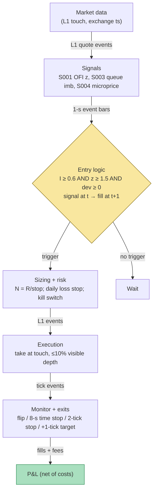

## Stage 101/200 — T001: OFI + Queue-Imbalance Directional Scalper

*Batch TB1 · Strategy 1/100 · Signals S001, S003, S004*

### T1. One-line verdict

| | |
|---|---|
| **Style** | Intraday microstructure directional scalping (liquidity-taking) |
| **Edge source** | One-to-few-tick mid-price moves predicted by touch order-flow imbalance (S001) confirmed by depth-queue imbalance (S003), gated by microprice fair value (S004) |
| **Typical holding period** | Seconds (example: 8-second / 8-event time stop) |
| **Capacity hint** | Near zero for a non-colocated taker — fees consume the documented move (see T7) |
| **Build-or-buy in one line** | Build the signal stack on a bought L1 feed (Tier 2); buy nothing packaged — a "signal SaaS" cannot be audited for t→t+1 causality |

### T2. Full mechanics

**Universe & session.** 5–20 liquid, large-tick names where the touch (best bid/ask — "L1", top-of-book) is informative: large-cap Nasdaq names and liquid ETFs (SPY/QQQ/AAPL-class) with one-to-two-tick spreads and deep, stable queues. Exclude names whose median spread exceeds 3 ticks (`example`), earnings-day and halted names, and anything with unstable L1 depth. Session: RTH 09:45–15:45 ET only (`example`) — skip the first and last 15 minutes (opening-auction book, closing-imbalance effects); flat by 15:45 ET.

**Entry rule.** All quantities use the MASTER.md signal definitions. At each L1 snapshot *t* (exchange timestamp):

- Queue imbalance (S003): `I_t = (Q^b_t − Q^a_t) / (Q^b_t + Q^a_t)` from displayed best bid/ask sizes.
- OFI z-score (S001): `OFI_t = Σ_{n∈T_t} (e^b_n + e^a_n)` over the last 100 events (`example`), per-event contributions from the Cont–Kukanov–Stoikov piecewise rules; `z^OFI_t = (OFI_t − μ_OFI) / σ_OFI` with μ, σ from a trailing 15-minute EWMA (exponentially weighted moving average) baseline (`example`, causal — only events ≤ *t*).
- Microprice deviation (S004): `d_t = P^micro_t − M_t`, the learned fair-value adjustment (bin lookup `G*(X_t)`, fit on history strictly before today), in cents.

Long entry at snapshot *t*, fillable no earlier than *t+1* (causal timing: signal at *t* → earliest fill *t+1*; add wire latency on top):

1. `I_t ≥ +0.60` (`example`) **and** `z^OFI_t ≥ +1.5` (`example`) — flow (S001) and book level (S003) agree;
2. `d_t ≥ 0` — the microprice fair value does not contradict the long;
3. mid has not jumped > 1 tick in the last 5 seconds (`example`) — no chasing;
4. no existing position.

Short mirrors: `I_t ≤ −0.60`, `z^OFI_t ≤ −1.5`, `d_t ≤ 0`.

**Exit rule** — first of four fires (`example` parameters):

1. **Signal flip:** `z^OFI_t` crosses through 0 against the position, or `|I_t|` falls below 0.25 (`example`);
2. **Time stop:** 8 seconds (or 8 events on event time) after the fill (`example`) — the intended edge is one-to-few ticks, not a trend;
3. **Stop-loss:** −2 ticks against entry mid (`example`);
4. **Profit target:** +2 ticks of mid-price movement (`example`) — exit into the touch.

Flat at 15:45 ET regardless.

**Position sizing.** `N = ⌊R / |P_entry − P_stop|⌋`, `R = $200` per trade (`example`). Stop = 2 ticks ($0.02) → `N = ⌊200 / 0.02⌋ = 10,000` shares. Caps (`example`): `N ≤ min(1% of trailing 1-minute ADV, $1M notional)`.

**Risk limits.** Daily loss stop −$2,000 (`example`, then dark for the day); max gross $1M notional (`example`); per-name heat ≤ $250k (`example`). Kill-switch: feed heartbeat missed > 2 s, book sequence gap, clock skew > 50 ms vs NTP, or any exit timer firing late — flatten everything immediately (paper ledger is source of truth; never recover a live paper position from RAM after a crash).

**Cost model** (applied in T4): round-trip commission $0.005/share each way ($0.01 RT/share); spread cost = half-spread on entry and exit (aggressive take); no slippage beyond that, no rebate, no borrow fee. Same illustrative convention Grok used for Q-TB1-1 (see T10 source log).

**Order/execution sketch.** Marketable limit orders at the touch: buy the ask, sell the bid. Participation cap: each child ≤ 10% of visible touch depth (`example`). Queue-position honesty: any claim about passive queue position is `simulated only — requires MBO/ITCH` (market-by-order data identifying individual orders; L1/MBP-1 aggregates cannot prove queue priority). This strategy is a taker (aggressive) by design — it does not earn maker (passive, rebate-earning) rebates.

### T3. Signals it consumes

| Signal | Role | Combination logic |
|---|---|---|
| S001 OFI z-score | **Primary trigger** (direction + timing) | `z^OFI_t ≥ +1.5` (`example`) for longs; exit flip when it crosses 0 |
| S003 queue imbalance | **Confirmation filter** | `I_t ≥ +0.60` (`example`); both must agree — flow and level, the "movie" and the "snapshot" |
| S004 microprice deviation | **Fair-value veto** | enter only if `d_t = P^micro_t − M_t` has the same sign as the trade; never fade the learned fair value |

```
# T001 combination logic (≤25 lines; every threshold `example`)
on each L1 snapshot t (exchange time, causal):
    I   = (qb - qa) / (qb + qa)                     # S003
    ofi = sum(e_b + e_a over last 100 events)       # S001 window
    z   = (ofi - mu_ofi) / sd_ofi                   # 15-min EWMA baseline
    dev = microprice(state_t) - mid                 # S004, cents
    if flat and I >= 0.60 and z >= 1.5 and dev >= 0 \
       and mid_jump_5s <= 1 tick:
        buy at t+1 (lift ask)                       # LONG
    elif flat and I <= -0.60 and z <= -1.5 and dev <= 0 \
       and mid_jump_5s <= 1 tick:
        sell at t+1 (hit bid)                       # SHORT
    if long:
        exit at t+1 if z < 0 or I < 0.25 \
            or age > 8 s or mid <= entry_mid - 2 ticks
    # short mirrors; flat 15:45 ET
    N = floor(200 / 0.02)                           # dollar-risk sizing
    veto if N * price > 1M or N > 1% of 1-min ADV
```
### T4. Worked example — numbers + P&L (SYNTHETIC)

**All numbers synthetic** (random seed 101, `batches/TB1/plot_T001.py` — re-runnable). Fictional large-tick name "QXL" at ~$50.00, tick $0.01, spread 1 tick. R = $200 (`example`) → N = 10,000 shares per trade. Costs: $0.01/share RT commission; half-spread per aggressive leg embedded in fills; no slippage beyond the spread, no rebate. Each trade's `I_t`, `z^OFI_t`, and `d_t` satisfy the T2 entry rules.

| # | Dir | I_t | z^OFI_t | d_t (¢) | Entry fill | Exit fill | Shares | Gross $ | Comm $ | Net $ | Exit reason |
|---|---|---|---|---|---|---|---|---|---|---|---|
| 1 | Long | +0.72 | +2.1 | +0.3 | 50.010 | 50.030 | 10,000 | +200.00 | −100.00 | **+100.00** | target +2 ticks |
| 2 | Short | −0.68 | −1.9 | −0.2 | 50.030 | 50.010 | 10,000 | +200.00 | −100.00 | **+100.00** | target +2 ticks |
| 3 | Long | +0.65 | +1.7 | +0.1 | 50.010 | 49.990 | 10,000 | −200.00 | −100.00 | **−300.00** | 2-tick stop |
| 4 | Long | +0.61 | +1.6 | +0.2 | 50.020 | 50.030 | 10,000 | +100.00 | −100.00 | **0.00** | signal flip |
| 5 | Short | −0.63 | −1.8 | −0.1 | 50.040 | 50.040 | 10,000 | 0.00 | −100.00 | **−100.00** | time stop, flat |
| 6 | Long | +0.70 | +2.0 | +0.4 | 50.000 | 50.025 | 10,000 | +250.00 | −100.00 | **+150.00** | time stop +2.5 |

Line-by-line walk. **Trade 1:** buy 10,000 at the ask 50.010 (mid 50.005, so $0.005/share half-spread is embedded). Mid ticks up; sell 10,000 at the bid 50.030 (mid 50.025). Gross = 10,000 × 0.020 = +$200.00; commission = 10,000 × $0.01 = −$100.00; **net = +$100.00.** **Trade 3 (the loser):** stop fires at 49.990; gross = 10,000 × (49.990 − 50.010) = −$200.00; commission −$100.00; **net = −$300.00** — a 2-tick adverse move costs 1.5× the $200 risk budget because the $100 commission stack rides on top.

Totals: gross +$550.00, commissions −$600.00, **net −$50.00** over 6 trades. The chart `images/T001_example.png` plots this exact walk: synthetic mid segments with entry/exit markers (top) and cumulative net P&L with per-trade annotations (bottom).

**Where the example is optimistic.** (1) Fills assumed at the touch on every exit — no partial fills, quote flicker, or adverse selection on the exit leg. (2) Spread a constant 1 tick; real books widen exactly when flow is most one-sided. (3) Zero latency — signal at *t*, fill at *t+1* with no wire delay; a home-Mac SIP (Securities Information Processor — the consolidated public quote tape) feed adds tens of milliseconds this arithmetic ignores. (4) Grok's own worked example (Q-TB1-1) showed the baseline: a 1-tick scalp nets **$0.00** after $0.01/share fees on 10,000 shares — this sleeve only clears costs when it captures more than one tick, gets queue position/rebate, or pays lower fees. The net −$50 day is the honest shape: costs, not signals, usually decide.

### T5. Data & infra — what must run

**Pipeline inventory.** Feed ingest (09:15–16:05 ET): L1/MBP-1 (market-by-price, top level) quote events with exchange timestamps into ring buffers, heartbeat watchdog every 1–2 s. Feature loop (09:45–15:45): per-symbol touch state, OFI event-window aggregator (last 100 events, `example`), per-event `I_t`, EWMA μ/σ of OFI, microprice bin lookup from the pre-fit `G*` table. Signal→order bridge: signal stamped at snapshot *t*, paper order queued for *t+1* — causal only. Paper broker + ledger persisted to disk (JSONL). Shared services: NYSE calendar, halt flags, DST handling, reference data, risk caps, structured logs.

**M5 Max feasibility: feasible (with the feed as the real constraint).** Throughput (`notes/cost-model.md` §2): a Python event loop does ~100–500k events/sec; 10 liquid names × ~100–2,000 L1 events/sec is trivially inside that; Rust (5–50M/sec) is only needed past ~20 symbols or for raw ITCH decode. RAM (§3): 200–800 MB hot state for 10 names on MBP-1 — far under the 77 GB budget; recording raw MBO for replay runs 2–8 GB. Storage (§4): 5–30 GB/day recording MBO; 0.5–2 GB/day for features + decisions only. Engineering time: Tier M+ (`cost-model.md` §5) — **40–100 h** ≈ $6,000–15,000 loaded-cost estimate at $150/hr; the event-rule correctness is the bulk of the work. Bottleneck: feed latency and timestamp quality, not compute.

**Feed-outage safe mode.** Missed heartbeat > 2 s (`example`) or a sequence-number gap → **flatten immediately, freeze new entries, tag DEGRADED**. Never interpolate OFI across a gap — a stale book manufactures a false `I_t`. Resume after a full snapshot rebuild plus 30 s of clean sequence numbers (`example`). If only SIP L1 remains (direct feed down): T001 is **off** — queue races on SIP timestamps are `simulated only — requires MBO/ITCH`. Local process crash: restart flat; the on-disk ledger is the source of truth, never RAM.

### T6. Buy vs build

| Option | What you get | Indicative price | Gains | Loses |
|---|---|---|---|---|
| Tier 0: delayed quotes / Alpaca IEX | free L1, 15-min delay | ~$0 — *indicative — verify before budgeting* | $0 prototype | no live signal |
| Tier 1 retail: QuantConnect paper (SIP equity stream) | paper host + SIP bars | ~$60–300/mo tiers — *indicative — verify before budgeting* | easy paper ledger | SIP stream cannot honestly implement touch OFI — cargo-cult T001 |
| Tier 1: Massive/Polygon Stocks Advanced (SIP real-time) | real-time SIP trades+quotes | ~$199/mo — *indicative — verify before budgeting* | cheap live data | SIP timestamps; latency-sensitive work is *simulated only* |
| Tier 2: Databento MBP-1 / Nasdaq TotalView MBO | exchange-timestamped L1/depth, live in paid plans | plan ~$1.5k–4k/mo class + license pass-through — *indicative — verify before budgeting* | honest event order, real queue dynamics | TotalView non-display licensing is the surprise bill even for paper |
| No-code (Composer-style) | drag-drop strategies | ~$10–50/mo class — *indicative — verify before budgeting* | nothing to build | cannot express OFI/queue logic — skip |

**Verdict: buy the feed, build the analytics.** OFI + queue imbalance is ~100 lines on data you already hold for S001; the value is your normalization, windows, thresholds, and lead-lag calibration — none of which any vendor sells. Crossover: for statistical honesty on a handful of large-tick names, Databento live MBP-1 (or TotalView MBO) on 5–10 symbols at ~$2k–6k/mo all-in is the honest Phase-1 spend (Grok Q-TB1-2). Below that, run T001 as a *research* harness on SIP — never present SIP fills as executable edge.

### T7. Success-ratio evidence

The literature measures **prediction, not after-cost P&L** — that distinction is the whole story of T001.

| Study / source | Market & period | Metric | Before/after cost | Caveat |
|---|---|---|---|---|
| Cont, Kukanov & Stoikov (2014) | 50 S&P 500 names, NYSE TAQ, Apr–Jun 2010 | linear Δmid = β·OFI; slope ∝ 1/(2·depth); OFI dominates trade imbalance | before-cost; **contemporaneous impact, not a delayed fill** | no forward P&L, no Sharpe |
| Gould & Bonart (2015/2016) | 10 Nasdaq names, LOB data | logistic I → next-mid direction: strongly significant; "considerable improvement" over null on large-tick names | before-cost (classification, not P&L) | direction only; no trading rule, no costs |
| Imbalance-taker fee study (2025, per Grok Q-TB1-3) | microstructure sample, ~15 s holds, 18,927 trades | taker profitable before fees (~+1 bp/round-trip), **negative after taker fee** (post-fee mean ≈ −2.0, units unverified — see Unverified leads) | after-fee | chatbot-sourced numbers |
| Lipton, Pesavento & Sotiropoulos (2013, per Grok) | equities LOB | expected mid move given imbalance typically well below one spread | qualitative | "not a straightforward statistical arbitrage" |

Capacity: a taker OFI scalp has near-zero capacity once more than a few lots hit the touch — every colocated market maker sees the same public `I_t`, and the documented mid move is a fraction of the spread. Decay: the CKS contemporaneous relation is stable as physics; the *tradable* residue decays with every microsecond of latency you concede.

**Honest bottom line.** For a ≤$1M paper operation: T001 as a standalone directional book has **no documented positive after-cost edge** — the papers show OFI and queue imbalance *predict* the next tick, and the one fee-inclusive study Grok surfaced shows the taker version losing after fees. The honest institutional use of S001/S003 is defensive: an adverse-selection filter for quoting — "when not to get filled" — not a standalone taker book. A $1M paper account backtesting T001 on SIP fills is measuring its own latency fantasy, not alpha.

### T8. Failure modes

1. **Contemporaneous ≠ forward.** Trading the CKS regression as if it were a forward rule. Mitigation: forward-shift one event in all research; report lead-lag R², never contemporaneous R².
2. **Latency illusion on SIP.** Your `I_t` print arrives after the queue race is over; a backtest that fills at the signal-bar touch is invalid. Mitigation: label all SIP work `simulated only — requires MBO/ITCH`; add measured wire latency to the cost model.
3. **Spoofed / fleeting queues.** Displayed size cancels before your marketable order arrives. Mitigation: down-weight sub-50 ms quote lifetimes (`example`); require OFI *and* imbalance to agree (the T001 design).
4. **Cost blowup.** Spread + $0.01/share RT fees on sub-second round trips — the T4 day nets −$50 with a 3-2-1 win/loss/flat record. Mitigation: per-trade bps budget; fee-covering entry threshold κ on `|I_t|`; prefer the maker variant (T022) over taking.
5. **Lookahead leakage / overfit thresholds.** Computing the signal from the post-move snapshot, filling inside the signal bar, or mining κ = 0.60 / z = 1.5 on one month's microstructure. Mitigation: strict event-*t* → trade-*t+1* causality audit; walk-forward calibration with shrinkage and purged/embargoed validation (S088).
6. **Regime breaks / depth collapse.** In stress, depth evaporates and the linear ΔP ≈ OFI/(2D) model misprices impact; spreads widen past the 3-tick gate. Mitigation: depth/vol-conditioned scaling; stand down on a spread-multiple trip; a VPIN (volume-synchronized probability of informed trading — the S008 toxicity gauge) veto.
7. **Feed outage / stale book.** A torn book prints a confident false `I_t`. Mitigation: the T5 safe-mode plan — flatten on heartbeat miss, no interpolation, 30 s of clean sequence before re-arming.

### T9. Visuals




### T10. Sources

1. Cont, R., Kukanov, A. & Stoikov, S. (2014). "The Price Impact of Order Book Events." *Journal of Financial Econometrics* 12(1): 47–88. arXiv:1011.6402 — https://arxiv.org/abs/1011.6402 (canonical OFI definition and contemporaneous impact regression; the S001 [D] source — not a forward trading rule).
2. Gould, M. D. & Bonart, J. (2016). "Queue Imbalance as a One-Tick-Ahead Price Predictor in a Limit Order Book." arXiv:1512.03492 — https://arxiv.org/abs/1512.03492 (published *Market Microstructure and Liquidity* 2(2): 1–35; logistic I → next-mid direction, "considerable improvement" over null for large-tick names — the S003 [D] source).
3. Stoikov, S. (2018). "The micro-price: a high-frequency estimator of future prices." *Quantitative Finance* 18(12): 1959–1966 — https://ideas.repec.org/a/taf/quantf/v18y2018i12p1959-1966.html (learned fair-value estimator used as the S004 fair-value veto; better short-term predictor than mid or weighted mid — prediction, not after-cost P&L).

**Source log.** Grok answered Q-TB1-1..3 (2026-09-10); all claims independently verified or labeled unverified. T2 mechanics, the cost convention, time stop, risk budget, and the Q-TB1-3 evidence table are adapted from Grok's TB1 answers; every numeric threshold is marked `example`, and chatbot-only numbers are segregated below, never promoted to documented facts.

**Unverified leads** (chatbot-only — never in Sources):
- Grok Q-TB1-3: Cont–Kukanov–Stoikov "mean R² ≈ 65%, OFI beats trade imbalance (R² ≈ 32%)" — no checkable source captured; unverified chatbot claim.
- Grok Q-TB1-3: Gould–Bonart "P(up | I ≈ 1) ≈ 0.8–0.9 large-tick, 0.6–0.7 small-tick" — same status; the verified claim is the S003 wording ("considerable improvement over null for large-tick").
- Grok Q-TB1-3: 2025 imbalance-taker study — "pre-fee ~+1 bp per round-trip; post-fee mean ≈ −2.0 (units not rendered), ~15 s holds, 18,927 trades" — units and venue unverified; used only as a cautionary lead.
- Grok Q-TB1-3: Lipton–Pesavento–Sotiropoulos (2013) "expected mid move given imbalance well below one spread" — not independently verified; plausible practitioner summary, kept as a lead.
- Grok Q-TB1-2: retail/platform pricing (QuantConnect ~$60–300/mo tiers, Databento plan ~$1.5k–4k/mo class, TotalView license pass-through) — vendor bands, `indicative — verify before budgeting`.
