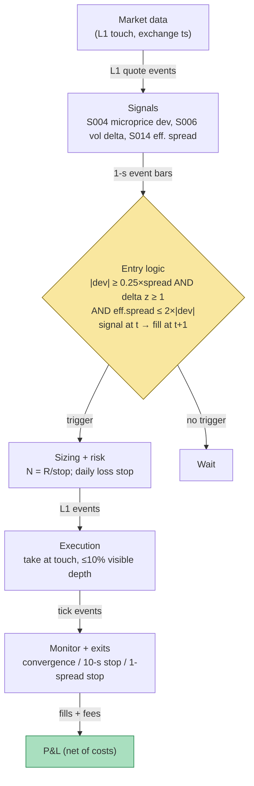

## Stage 102/200 — T002: Microprice Fair-Value Scalper

*Batch TB1 · Strategy 2/100 · Signals S004, S006, S014*

### T1. One-line verdict

| | |
|---|---|
| **Style** | Intraday fair-value scalping (liquidity-taking, mean-reversion to a learned fair price) |
| **Edge source** | Transient deviations of the mid-price from Stoikov's learned microprice fair value, confirmed by signed volume delta and gated by measured spread costs |
| **Typical holding period** | Seconds (example: 5–10 s time stop) |
| **Capacity hint** | Small — per-event edge is a fraction of the spread; survives only where the deviation is wide relative to the measured effective spread |
| **Build-or-buy in one line** | Build on the S001/S003 feed you already own; buy only the exchange-timestamped L1 feed — the microprice fit and the spread-decomposition gate are yours to calibrate |

### T2. Full mechanics

**Universe & session.** 3–10 liquid large-tick names with stable, visible books and 1-tick spreads most of the session (same hunting ground as T001). Exclude earnings days, halts, and any name whose trailing effective spread exceeds 2× its median (`example`). Session 09:45–15:45 ET (`example`), RTH only, flat by 15:45.

**Entry rule.** At each L1 snapshot *t* (exchange time):

- Microprice deviation (S004, **primary trigger**): `d_t = P^micro_t − M_t`, where `P^micro_t = M_t + G*(X_t)` is Stoikov's learned fair value (the limiting expected mid-price conditional on the book state, estimated from discretized (imbalance, spread) transition matrices fit on history strictly before today) and `M_t` is the mid-price. Enter when `|d_t| ≥ κ` with `κ = 0.25 × spread` (`example` — never trade inside the noise of your own fair-value estimate).
- Volume-delta confirmation (S006): signed trade imbalance `TI_t = Σ ε_i V_i` over the trailing 5 minutes (`example`) — each trade's sign ε_i from the quote rule (trade price vs the prevailing NBBO — national best bid and offer — quote; tick-rule fallback on no-quote tapes) — normalized to `Δ_t` and z-scored against the trailing 50 windows (`example`): require `z^Δ_t ≥ +1.0` for longs, `≤ −1.0` for shorts (`example`). The delta confirms that aggressive flow is *pushing with* the deviation, not against it — you trade *toward* fair value only when the tape agrees the deviation is transient noise, not information.
- Spread-decomposition cost gate (S014): compute the trailing 5-minute (`example`) average **effective spread** `S̄^e = 2·D_t·(P_t − M_t)` (what the aggressor actually paid vs the mid, per trade, dollar-weighted). Trade only if the measured cost is covered twice over by *that trade's* deviation: `S̄^e ≤ 2·|d_t|` (`example`) — a fixed gate on κ alone would veto everything on a 1-tick name, so the gate is per-trade.

Long entry (signal at *t*, fillable no earlier than *t+1* — causal timing; add wire latency on top):

1. `d_t ≥ +κ` (microprice fair value *above* the mid — buy the cheap side);
2. `z^Δ_t ≥ +1.0` (`example`) — buy-side aggressive flow confirms;
3. `S̄^e ≤ 2·|d_t|` (`example`) — the per-trade cost gate passes;
4. no existing position; mid has not moved > 1 tick against the deviation in the last 5 s (`example`).

Short mirrors: `d_t ≤ −κ` (microprice fair value *below* the mid — sell the rich side), `z^Δ_t ≤ −1.0`.

**Exit rule** — first of four fires (`example` parameters):

1. **Fair-value convergence:** `d_t` crosses through 0 (mid has reached the microprice) — take the fill at the touch;
2. **Time stop:** 10 s after fill (`example`) — the S004 chapter's guidance (deviation mean-reverts away if you wait);
3. **Stop-loss:** 1 spread-width against entry mid (`example`);
4. **Delta flip:** `z^Δ_t` crosses 0 against the position — the confirming flow evaporated.

**Position sizing.** Vol-targeting with a fixed dollar risk: `N = ⌊R / stop_width⌋`, `R = $50` (`example`), stop = 1 spread ($0.01) → `N = 5,000` shares. Smaller `R` than T001 deliberately: the per-trade edge here is thinner, so the risk budget is too. Caps (`example`): `N ≤ min(1% of 1-min ADV, $500k notional)`.

**Risk limits.** Daily loss stop −$1,000 (`example`); max gross $500k notional (`example`); kill-switch on feed heartbeat miss > 2 s (`example`), book sequence gap, or clock skew > 50 ms (`example`) — flatten immediately, ledger on disk is truth.

**Cost model** (applied in T4): $0.005/share each way ($0.01 RT); spread cost = half-spread per aggressive leg, embedded in fills; no slippage beyond that, no rebate. The S014 gate additionally *measures* realized effective spread intraday and disables the strategy if it drifts above the gate — costs are a live input, not a static assumption.

**Order/execution sketch.** Marketable limits at the touch (taker). Participation ≤ 10% of visible depth (`example`). Queue-position honesty: any passive-fill-rate claim is `simulated only — requires MBO/ITCH`.

### T3. Signals it consumes

| Signal | Role | Combination logic |
|---|---|---|
| S004 microprice deviation | **Primary trigger** | enter long iff `d_t = P^micro_t − M_t ≥ +κ` (`κ = 0.25 × spread`, `example`); exit when `d_t` crosses 0 |
| S006 volume delta | **Confirmation filter** | `z^Δ_t ≥ +1.0` (`example`) for longs — aggressive flow must agree the deviation is noise |
| S014 spread decomposition | **Cost gate (veto)** | trade only if `S̄^e ≤ 2·|d_t|` per trade (`example`); live-disable if measured costs exceed the edge |

```
# T002 combination logic (≤25 lines; every threshold `example`)
on each L1 snapshot t (exchange time, causal):
    dev = microprice(state_t) - mid_t              # S004, cents
    dz  = zscore(signed_volume_delta(5 min))       # S006
    ecost = trailing_mean(effective_spread, 5 min) # S014
    kappa = 0.25 * spread_t
    if flat and dev >= +kappa and dz >= 1.0 and ecost <= 2*abs(dev):
        buy at t+1 (lift ask)                      # LONG toward fair value
    elif flat and dev <= -kappa and dz <= -1.0 and ecost <= 2*abs(dev):
        sell at t+1 (hit bid)                      # SHORT toward fair value
    if long:
        exit at t+1 if dev >= 0 or dz < 0 \
            or age > 10 s or mid <= entry_mid - 1 spread
    # short mirrors; flat 15:45 ET
    N = floor(50 / 0.01)                           # dollar-risk sizing
```

### T4. Worked example — numbers + P&L (SYNTHETIC)

**All numbers synthetic** (random seed 102, `batches/TB1/plot_T002.py`). Fictional large-tick name "QXL" at ~$80.00, tick $0.01. R = $50 (`example`) → N = 5,000 shares. Costs: $0.01/share RT commission; half-spread per aggressive leg embedded in fills.

| # | Dir | d_t (¢) | z^Δ_t | S̄^e (¢) | Entry fill | Exit fill | Shares | Gross $ | Comm $ | Net $ | Exit reason |
|---|---|---|---|---|---|---|---|---|---|---|---|
| 1 | Long | +0.6 | +1.4 | 1.0 | 80.010 | 80.025 | 5,000 | +75.00 | −50.00 | **+25.00** | convergence |
| 2 | Long | +0.6 | +1.1 | 1.2 | 80.015 | 80.020 | 5,000 | +25.00 | −50.00 | **−25.00** | delta flip |
| 3 | Short | −0.7 | −1.6 | 1.0 | 80.020 | 80.008 | 5,000 | +60.00 | −50.00 | **+10.00** | convergence |
| 4 | Long | +0.6 | +1.2 | 1.1 | 80.010 | 80.002 | 5,000 | −40.00 | −50.00 | **−90.00** | 1-spread stop |
| 5 | Short | −0.6 | −1.3 | 1.0 | 80.025 | 80.015 | 5,000 | +50.00 | −50.00 | **0.00** | time stop |
| 6 | Long | +0.8 | +1.8 | 0.9 | 80.005 | 80.020 | 5,000 | +75.00 | −50.00 | **+25.00** | convergence |

Line-by-line walk (trade 1): microprice prints 80.016 against a mid of 80.010 (`d_t = +0.6¢`, beyond the `κ = 0.25¢` example threshold); buy-side delta z = +1.4 confirms; per-trade cost gate: 2 × |d_t| = 1.2¢ ≥ S̄^e = 1.0¢ → passes. (Note the gate must be per-trade: a fixed κ-gate of 2κ = 0.5¢ would veto every trade on this 1-tick name, since measured effective spread is ~1¢ — the gate has to scale with the deviation it is buying.) Buy 5,000 at the ask 80.010; mid converges to the microprice; sell 5,000 at the bid 80.025. Gross = 5,000 × 0.015 = +$75.00; commission = 5,000 × $0.01 = −$50.00; **net = +$25.00.**

Trade 4 (the loser): deviation confirmed, but the move is information not noise — the stop fires one spread against at 80.002. Gross = 5,000 × (80.002 − 80.010) = −$40.00; commission −$50.00; **net = −$90.00** — the stop loss is 0.8R in price but 1.8R after fees.

Totals: gross +$245.00, commissions −$300.00, **net −$55.00** over 6 trades. The chart `images/T002_example.png` plots this exact walk.

**Where the example is optimistic.** (1) The microprice fit is assumed pre-fit and stationary; in reality `G*` drifts with the book regime and the "learned" adjustment decays — the example never pays re-fit error. (2) Every exit fills at the touch; no partial fills, no spread widening at the moment of maximum deviation (when spreads are widest, deviations are largest — the gate helps but cannot see the future). (3) The delta confirmation is assumed causal and clean; tick-rule/quote-rule misclassification on fast tapes is real (S006/S007). (4) Latency zero. The net −$55 day is, again, the honest shape: commissions ($300) exceed gross capture ($245) — a fair-value edge measured in tenths of a cent per share needs either wider deviations or cheaper fees to survive.

### T5. Data & infra — what must run

**Pipeline inventory.** Feed ingest (09:15–16:05 ET): L1/MBP-1 with exchange timestamps; ring buffers; 1–2 s heartbeat watchdog. Feature loop (09:45–15:45): per-symbol touch state, microprice bin lookup (pre-fit `G*` table loaded at 09:00 — **never** fit on the live window), 5-minute signed-volume-delta z-score (quote-rule signing where NBBO exists), trailing effective-spread meter (S014, dollar-weighted). Signal→order bridge: stamp at snapshot *t*, paper order for *t+1*. Paper broker + ledger persisted to disk. Overnight batch (16:30–18:00): re-fit the microprice transition matrices on the day's quotes (symmetrized per Stoikov Thm 3.1), recompute spread baselines — never intraday.

**M5 Max feasibility: feasible.** Throughput (`notes/cost-model.md` §2): the per-event work is a bin lookup plus rolling sums — a Python loop at ~100–500k events/sec covers ≤10 symbols; polars batch recompute is trivial. RAM (§3): hot state < 1 GB; the overnight fit holds ~1 day of L1 per symbol (0.5–4 GB) — fine inside the 77 GB budget. Storage (§4): 0.5–2 GB/day for features + decisions (raw MBO only for calibration windows: 5–30 GB/day). Engineering: Tier M+ (`cost-model.md` §5) — **40–100 h** ≈ $6,000–15,000 loaded-cost estimate; the microprice fit is the long pole, roughly half the band. Bottleneck: quote-history depth and timestamp hygiene, not CPU.

**Feed-outage safe mode.** Heartbeat miss > 2 s or sequence gap → **flatten, freeze entries, tag DEGRADED**. A stale book makes `d_t` a museum piece — do not trade a deviation computed from a torn snapshot. Resume after full snapshot rebuild + 30 s clean sequence. If only SIP (Securities Information Processor — the consolidated public quote tape) L1 remains: T002 is **off** — microprice deviations on SIP timestamps are `simulated only — requires MBO/ITCH`. Overnight fit failure → T002 stays dark the next day (stale `G*` is worse than none). Crash: restart flat, ledger from disk.

### T6. Buy vs build

| Option | What you get | Indicative price | Gains | Loses |
|---|---|---|---|---|
| Tier 0: delayed quotes | free L1, 15-min delay | ~$0 — *indicative — verify before budgeting* | $0 fit prototype | no live deviation |
| Tier 1: Massive/Polygon SIP | real-time SIP L1 | ~$199/mo — *indicative — verify before budgeting* | cheap | SIP deviation is *simulated only — requires MBO/ITCH* |
| Tier 2: Databento MBP-1 | exchange-timestamped L1 | ~$200/mo + usage — *indicative — verify before budgeting* | honest timestamps for the fit and the trigger | usage meter on wide universes |
| Tier 2/3: TotalView MBO / LOBSTER replay | full order-level replay | academic ~hundreds/yr; live TotalView $1.5k–4k/mo class + licenses — *indicative — verify before budgeting* | true queue dynamics for calibration | overkill for paper |
| "Fair-value signal" SaaS | black-box deviation feed | varies — *indicative — verify before budgeting* | none auditable | you cannot verify their fit window, symmetrization, or t→t+1 causality — skip |

**Verdict: build the estimator, buy the feed.** The microprice is a small batch fit plus a per-event table lookup (S004) — ~50 lines once the L1 plumbing exists — and its value is entirely in *your* binning, estimation window, and symmetrization choices. The spread-decomposition gate is arithmetic on your own tape. Buy Databento MBP-1 history to fit honestly and a Tier-1/2 live feed for paper; buy nothing that claims to sell you "fair value" as a product.

### T7. Success-ratio evidence

| Study / source | Market & period | Metric | Before/after cost | Caveat |
|---|---|---|---|---|
| Stoikov (2018) | BAC/CVX, March 2011, high-frequency quotes | microprice a better predictor of short-term prices than mid or weighted mid | before-cost (prediction, not P&L) | two names, one month |
| Cont, Kukanov & Stoikov (2014) | 50 S&P 500, NYSE TAQ 2010 | OFI-based impact: slope ∝ 1/(2·depth) — the depth denominator this strategy's sizing respects | before-cost; contemporaneous | supports the mechanics, not the P&L |
| Huang & Stoll (1997) | spread decomposition | quoted spread splits into order-processing, inventory, and adverse-selection components | measurement, not a strategy | the S014 gate's intellectual basis |
| Roll (1984) | implicit spread from price covariance | quote-free spread estimate | measurement | fallback cost gate when quotes are unavailable (S012) |

No paper in the verified set reports an after-cost Sharpe for a microprice-deviation *taker* strategy — the documented result is a better *predictor*, and the S004 chapter's own warning stands: the learned adjustment is roughly a fifth of the naive cross-weighted baseline (0.076¢ vs 0.375¢ at the extreme bin in the synthetic fit) — the edge per event is a fraction of a fraction of the spread. Capacity: minuscule for a taker; the natural institutional home of the microprice is *quoting* (T021/T085 center quotes on it), where the edge is adverse-selection avoided rather than ticks captured.

**Honest bottom line.** For a ≤$1M paper operation: T002 is a research-grade fair-value toy with real econometric pedigree and no documented after-cost taker P&L. Its honest use is as a quoting anchor and cost-measurement discipline (the S014 gate is this chapter's most valuable part). Do not size it like T001 — even the deliberate $50 risk budget loses to commissions in the synthetic walk.

### T8. Failure modes

1. **Deviation is information, not noise.** The microprice assumes the deviation mean-reverts; when flow is informed, the mid walks *through* fair value and the "cheap" buy is just early. Mitigation: the S006 delta veto — never fade a deviation that aggressive flow is pushing wider; the T4 trade-4 loss is this failure priced.
2. **Stale fit / regime drift.** `G*` fit on last month's book misprices this month's; symmetrization assumptions break. Mitigation: overnight re-fit only (never intraday), fit-quality dashboard (transition-count sparsity, eigenvalue check), dark-day rule if the fit fails.
3. **Spread widening at maximum deviation.** Deviations are largest exactly when liquidity is thinnest; the gate measured on trailing averages lags. Mitigation: gate on the *current* quoted spread too (hard veto above 2 ticks, `example`); the per-trade `S̄^e ≤ 2·|d_t|` form from T4.
4. **Misclassification in the delta.** Quote-rule/tick-rule signing errors on fast tapes corrupt `z^Δ_t`. Mitigation: exchange aggressor flags where available; robustness check with tick-rule signing (the S008 tick-rule-VPIN lesson: the classification choice flips behavior).
5. **Latency illusion on SIP.** Deviation computed on SIP timestamps is stale by construction. Mitigation: `simulated only — requires MBO/ITCH` label; never fill a live deviation off SIP.
6. **Lookahead in the fit.** Fitting `G*` on windows that include the evaluation period manufactures a backtest miracle. Mitigation: strict fit-before-evaluate split; purged/embargoed validation (S088).
7. **Cost-model optimism.** Static half-spread assumptions vs the S014-measured reality; the T4 walk shows commissions alone (−$300) beating gross (+$245). Mitigation: the live S014 meter *disables* the strategy when measured costs exceed the edge — the gate is a kill switch, not a decoration.

### T9. Visuals




### T10. Sources

1. Stoikov, S. (2018). "The micro-price: a high-frequency estimator of future prices." *Quantitative Finance* 18(12): 1959–1966. DOI: 10.1080/14697688.2018.1489139 — https://ideas.repec.org/a/taf/quantf/v18y2018i12p1959-1966.html (the S004 [D] source: learned fair-value estimator; better short-term predictor than mid/weighted mid — prediction, not after-cost P&L).
2. Huang, R. D. & Stoll, H. R. (1997). "The Components of the Bid-Ask Spread: A General Approach." *Review of Financial Studies* 10(4): 995–1034 — https://ideas.repec.org/a/oup/rfinst/v10y1997i4p995-1034.html (three-component spread decomposition behind the S014 cost gate: order-processing, inventory, adverse selection).
3. Roll, R. (1984). "A Simple Implicit Measure of the Effective Bid-Ask Spread in an Efficient Market." *Journal of Finance* 39(4): 1127–1139 — https://doi.org/10.2307/2327617 (quote-free effective-spread estimate; the S012 fallback when quotes are unavailable).

**Source log.** Grok answered Q-TB1-1..3 (2026-09-10); all claims independently verified or labeled unverified. Grok's TB1 Q&A covered T001 (strategy A) directly; T002's mechanics here are composed from the verified MASTER.md signal chapters S004/S006/S014 (formulas carried forward unchanged) plus the shared Q-TB1-2 infra and cost conventions. No Grok performance number is presented as a documented fact about T002.

**Unverified leads** (chatbot-only — never in Sources):
- Grok Q-TB1-2: Tier-1/2 feed pricing bands (Massive/Polygon ~$199/mo, Databento ~$200/mo + usage, TotalView $1.5k–4k/mo class) — `indicative — verify before budgeting`.
- Grok Q-TB1-2: engineering-hour slices (feed client 30–60 h, strategy harness 40–100 h) — planning estimates, folded into the cost-model §5 band used in T5.
- General TB1 caveat: no chatbot supplied a checkable after-cost performance number for a microprice-deviation taker strategy; none is claimed.
