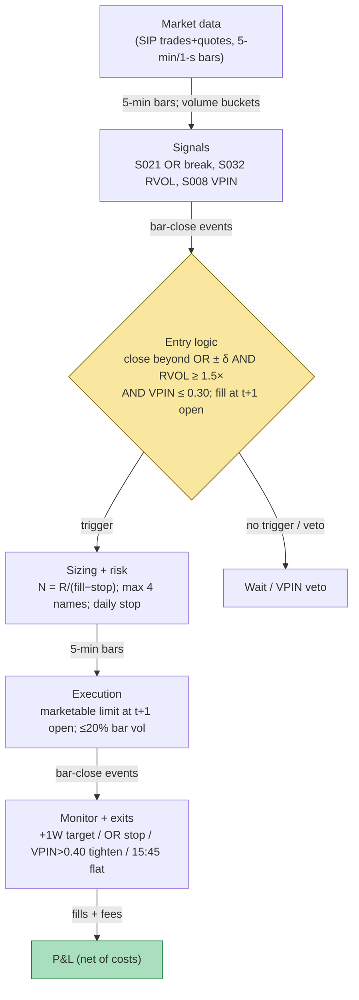

## Stage 103/200 — T003: VPIN-Gated Breakout Trader

*Batch TB1 · Strategy 3/100 · Signals S008, S021, S032*

### T1. One-line verdict

| | |
|---|---|
| **Style** | Intraday breakout (opening-range / session-range), toxicity-gated |
| **Edge source** | Breakouts that are *funded* (abnormal participation, S032) and *clean* (low order-flow toxicity, S008) — the filter does the work, not the geometry |
| **Typical holding period** | Minutes to hours (example: target +1× range width, flat by 15:45) |
| **Capacity hint** | Constrained — the RVOL sort crowds; the published Sharpe is commission-only on a $25k book |
| **Build-or-buy in one line** | Build the ~100-line bar state machine on a cheap SIP (Securities Information Processor — the consolidated public quote tape) feed; buy nothing — the edge is your RVOL baseline and your toxicity calibration, not a product |

### T2. Full mechanics

**Universe & session.** US listed equities, RTH only. Gates (`example`): 14-day ADV ≥ 1M shares; 14-day average true range (ATR — mean of daily high−low ranges) ≥ $0.50; price > $5. Exclude earnings days, halts, and names with missing opening prints. Session: opening range (OR) built 09:30–10:00 ET (`example`: six 5-minute bars); entries 10:00–15:30; flat by 15:45 ET. One trade per name per day; no re-entry after a stop (`example`).

**Entry rule.** At each 5-minute bar close *t* after the OR freeze:

- Breakout event (S021, **primary trigger**): with `ORH = max H_j`, `ORL = min L_j` over the OR bars and width `W = ORH − ORL`, a long triggers on bar close `C_t ≥ ORH + δ`, a short on `C_t ≤ ORL − δ`, with entry offset `δ = $0.05` (`example`).
- Participation confirmation (S032): `RVOL = V_OR / baseline` — OR-window volume vs the trailing 14-session mean of the *same* window (`example`); require `RVOL ≥ 1.5×` (`example`) — the break must be *funded*.
- Toxicity veto (S008, **regime gate**): VPIN over the trailing 50 volume buckets (`example`; bucket = ADV/50, bulk volume classification from bar price changes). If `VPIN_t > 0.30` (`example`), **no entry**. A breakout into toxic flow is how you buy the top of an informed move.

Long entry (signal at bar *t* close, fill at the open of bar *t+1* — causal timing; model gap-through — the fill is worse than the signal print):

1. `C_t ≥ ORH + δ` (`example`);
2. `RVOL ≥ 1.5×` (`example`);
3. `VPIN_t ≤ 0.30` (`example`);
4. no position in the name today.

Short mirrors on `C_t ≤ ORL − δ`.

**Exit rule** — first of four fires (`example` parameters):

1. **Target:** `+1 × W` beyond the break level (long target = `ORH + W`) (`example`);
2. **Stop-loss:** the opposite side of the OR (long stop = `ORL`) (`example`) — OR invalidation;
3. **Toxicity exit:** if `VPIN` crosses above 0.40 (`example`) while in a position, tighten the stop to breakeven-minus-fees immediately (`example` handling) — do not ride a breakout as flow turns toxic;
4. **Time stop:** still open at 15:45 (`example`) → flatten at market.

**Position sizing.** `N = ⌊R / (P_entry − P_stop)⌋`, `R = $200` per trade (`example`); use the *expected fill* (bar-t+1 open estimate), not the signal print — Grok's Q-TB1-1 worked example showed the risk budget silently exceeded when gap-through and exit spread were ignored. Caps (`example`): `N ≤ min(2% of 1-min ADV, $250k notional)`; portfolio heat ≤ 4 concurrent names.

**Risk limits.** Daily loss stop −$1,000 (`example`); max 4 concurrent positions (`example`); kill-switch on feed stall (no 5-min bar within 30 s of expected close), clock skew > 50 ms, or VPIN data stale > 10 min — flatten all, no new entries.

**Cost model** (applied in T4): commission $0.005/share each way ($0.01 RT); spread cost = $0.01 paid on entry and $0.01 on exit vs mid (2¢ assumed spread, `example`); gap-through fill modeled explicitly (entry fill = next-bar open, not the signal close).

**Order/execution sketch.** Marketable limit at the next-bar open (taker). If the bar gaps through the level, the fill is the open — never the signal print. Participation cap ≤ 20% of the breakout bar's volume (`example`).

### T3. Signals it consumes

| Signal | Role | Combination logic |
|---|---|---|
| S021 opening-range breakout | **Primary trigger** (event) | bar close beyond `ORH/ORL ± δ` after the OR freeze; defines levels, target, stop |
| S032 RVOL | **Confirmation filter** | `RVOL ≥ 1.5×` (`example`) on the OR window — unfunded breaks are vetoed |
| S008 VPIN | **Regime gate / veto** | `VPIN > 0.30` (`example`) blocks entry; `VPIN > 0.40` (`example`) tightens a live stop |

```
# T003 combination logic (≤25 lines; every threshold `example`)
on each 5-min bar close t (RTH, causal):
    if t in OR window: update ORH, ORL, V_OR; continue
    if OR not frozen: freeze; RVOL = V_OR / mean(V_OR[-14:]); continue
    vpin = VPIN(trailing 50 buckets)          # S008
    if flat and vpin > 0.30: log VETO; continue
    if flat and C_t >= ORH + 0.05 and RVOL >= 1.5:
        buy at open of t+1                    # LONG
    elif flat and C_t <= ORL - 0.05 and RVOL >= 1.5:
        sell at open of t+1                   # SHORT
    if long:
        exit at t+1 if C_t >= ORH + W or C_t <= ORL \
            or vpin > 0.40 or t >= 15:45
    # short mirrors; one trade per name per day
    N = floor(200 / (expected_fill - stop))   # dollar-risk sizing
```

### T4. Worked example — numbers + P&L (SYNTHETIC)

**All numbers synthetic** (random seed 103, `batches/TB1/plot_T003.py`). Name "XYZ", tick $0.01, assumed spread 2¢ (`example`). R = $200 (`example`). Commission $0.01/share RT. Thresholds: RVOL ≥ 1.5×, VPIN entry gate 0.30, toxicity exit 0.40 (all `example`).

| # | Dir | OR (H/L, W) | RVOL | VPIN | Entry fill | Exit fill | Shares | Gross $ | Comm $ | Net $ | Outcome |
|---|---|---|---|---|---|---|---|---|---|---|---|
| T1 | Long | 100.40/99.80, 0.60 | 2.1× | 0.22 | 100.45 | 100.99 | 307 | +165.78 | −3.07 | **+162.71** | target +1W hit |
| T2 | Long | 100.55/99.95, 0.60 | 2.4× | 0.38 | — | — | — | 0.00 | 0.00 | **0.00** | **VPIN veto** |
| T3 | Short | 100.60/100.10, 0.50 | 1.8× | 0.19 | 100.03 | 100.60 | 350 | −199.50 | −3.50 | **−203.00** | OR stop hit |
| T4 | Long | 100.05/99.55, 0.50 | 1.6× | 0.27 | 99.95 | 100.34 | 500 | +195.00 | −5.00 | **+190.00** | time stop (15:45) |

Line-by-line walk (T1): OR 09:30–10:00 freezes at H 100.40 / L 99.80 (W = 0.60). The 10:00 bar closes at 100.43 ≥ ORH + 0.05; OR-window RVOL = 2.1×; VPIN = 0.22 ≤ 0.30 — all three gates pass. Fill at the next bar open: 100.45 (gap-through modeled). Stop = ORL = 99.80; risk/share = 0.65 → N = ⌊200/0.65⌋ = 307. Target = 100.40 + 0.60 = 101.00; fills at the bid 100.99 (1¢ spread paid). Gross = 307 × 0.54 = **+$165.78**. Commission = 307 × $0.01 = **−$3.07**. **Net = +$162.71.**

T2 (the veto): a valid-looking upside break with RVOL 2.4× — but VPIN prints 0.38 > 0.30, so the strategy stands down. Net $0.00. In the synthetic tape this break would have lost — the veto is the strategy's best trade of the day.

T3 (the loser): downside break on RVOL 1.8×, VPIN 0.19 — gates pass; fill sells at 100.03. The break fails; the stop at 100.60 fires. Gross = 350 × (100.03 − 100.60) = −$199.50; commission −$3.50; **net = −$203.00** — 1.5% over the $200 budget from gap-through plus exit spread, the exact leak Grok's worked example warned about.

T4: entry 99.95, stop 99.55 → N = ⌊200/0.40⌋ = 500. The +1W target (100.55) was not reached; flattened at 100.34 on the 15:45 time stop (`example`). Gross = 500 × (100.34 − 99.95) = +$195.00; commission −$5.00; **net = +$190.00.**

Totals: gross +$161.28, commissions −$11.57, **net +$149.71** over 4 decision points (3 trades + 1 veto). The chart `images/T003_example.png` plots this exact walk, with the T2 veto annotated.

**Where the example is optimistic.** (1) The vetoed T2 break is scripted to have lost — real VPIN vetoes also block winners; the example shows the gate's benefit, not its cost. (2) Bar-open fills assumed available in full size, with no partial fills and no slippage between the VPIN print and the exit fill. (3) RVOL baselines assumed clean — one corporate-action or half-day print in the 14-day window poisons the baseline. A 4-decision synthetic anecdote demonstrating the accounting, not evidence of an edge.

### T5. Data & infra — what must run

**Pipeline inventory.** Pre-open (08:00–09:15 ET): load 14-day same-window volume baselines, NYSE calendar, halt flags, VPIN bucket state. Intraday: 5-minute (and 1-second, for the VPIN bucket tape) OHLCV (open, high, low, close, volume) bars from SIP — **SIP is sufficient here** (nothing in T003 races the touch); per-name volume-bucket accumulator (bucket = ADV/50, `example`); OR state machine; break tests on each 5-min close; paper fills at next-bar open. Post-close: persist ledger, recompute baselines overnight.

**M5 Max feasibility: trivial.** Throughput (`notes/cost-model.md` §2): 500 names × 5-min bars ≈ 6k bars/day; even 1-second bars across 500 names ≈ 2M bars/day — nothing for this machine. The VPIN bucket loop is a rolling sum over trades. RAM (§3): 100–400 MB for bars + bucket state; the 14-day baselines are megabytes. Storage (§4): 50–300 MB/day of bars + decisions. Engineering: Tier L–M (`cost-model.md` §5) — **20–40 h** ≈ $3,000–6,000 loaded-cost estimate; the state machine is easy, universe hygiene (ADV/ATR gates, corporate actions, half-days) is the time sink. Bottleneck: data cleanliness, not compute.

**Feed-outage safe mode.** If the open print or first 30 minutes of volume is incomplete for a name → **exclude that name for the day** (never invent an OR). If the whole tape stalls before the OR freeze → **no T003 trades that day**. If the feed dies after entry: hold the resting paper stop at the OR level on the last valid quote; if quotes die too → flatten at last trade and mark the session UNTRUSTED_FLAT. VPIN input stale > 10 min → no new entries. Early-close calendar miss is a classic bug — bake NYSE holidays into the clock process (Grok Q-TB1-2).

### T6. Buy vs build

| Option | What you get | Indicative price | Gains | Loses |
|---|---|---|---|---|
| Tier 0: Stooq / Alpaca IEX delayed | free daily/15-min bars | ~$0 — *indicative — verify before budgeting* | $0 research prototype | no live OR |
| Tier 1 retail: QuantConnect paper | paper host + SIP bars, research | ~$60–300/mo tiers — *indicative — verify before budgeting* | good paper home for T003 (Grok Q-TB1-2 verdict: fits B/C-style bar strategies) | bundled data only; export limits |
| Tier 1: Massive/Polygon Stocks Advanced / Alpaca SIP | real-time SIP trades+quotes | ~$30–200/mo — *indicative — verify before budgeting* | everything T003 needs, live | nothing — this is the right tier |
| Tier 2: Databento | L1/L2 with exchange ts | ~$200/mo + usage — *indicative — verify before budgeting* | honest timestamps | unnecessary for 5-min-bar breakouts |
| Composer-style no-code | drag-drop | ~$10–50/mo class — *indicative — verify before budgeting* | — | cannot express VPIN buckets or RVOL baselines — skip |

**Verdict: build on Tier 1.** T003 is the rare TB1 strategy where the retail stack is the honest answer: SIP bars are sufficient, the state machine is ~100 lines, and the only real costs are the feed (~$30–200/mo, `indicative — verify before budgeting`) and 20–40 h of engineering. Crossover: buy Databento only if you graduate to touch-level variants (T001/T002).

### T7. Success-ratio evidence

| Study / source | Market & period | Metric | Before/after cost | Caveat |
|---|---|---|---|---|
| Zarattini, Barbon & Aziz (2024), SFI WP 24-98 / SSRN 4729284 | >7,000 US stocks, 2016–2023, 5-min ORB | **Top-20 opening-RVOL "stocks in play": total +1,637%, IRR 41.6%, Sharpe 2.81, hit 48.4%, MDD 12%, alpha 35.8%** | after $0.0035/share commission — **no spread, impact, or borrow model** | $25k starting NAV compounding; the RVOL sort is doing the work; 15-min/30-min/60-min variants decay to Sharpe 1.43/0.21/0.40 |
| Same paper, unfiltered 5-min ORB | same | total +29%, IRR 3.2%, Sharpe 0.48, hit 41.4% — underperforms the S&P 500 (+198%, Sharpe 0.78) | after commission | unfiltered ORB is not a strategy; the filter is the strategy |
| Gervais, Kaniel & Mingelgrin (2001) | US equities | high-volume return premium: unusually high-volume stocks appreciate over the following month | before-cost (return study) | monthly horizon — the attention mechanism, not the trade |
| Easley, López de Prado & O'Hara (2012) | E-mini S&P futures | VPIN "a useful indicator of short-term, toxicity-induced volatility" | indicator study, not a trading rule | authors' claim; see the replication row |
| Andersen & Bondarenko (2014) | S&P 500 futures tick data | VPIN is a **poor predictor of short-run volatility**; no pre-flash-crash extreme; content largely mechanical trading intensity; classification-dependent | replication | directly contests the 2012 claim |

Capacity: the published book is 20 names/day on $25k notional with no capacity schedule; the RVOL sort crowds by construction — everyone scans the same top-20. Decay: unfiltered ORB decayed long ago (Sharpe 0.48 modern); the filtered variant's post-publication window is untested in the verified set.

**Honest bottom line.** For a ≤$1M paper operation: T003 is the most *implementable* strategy in TB1 and the only one with a modern, commission-inclusive published Sharpe above 2 — but that Sharpe (2.81) is commission-only, on a publication-sample RVOL sort, with a 48% hit rate and no market-impact model. The VPIN gate's own literature is split (ELO 2012 vs Andersen–Bondarenko 2014), so treat it as a defensive convention, not a documented edge. Paper-trade it on Tier-1 SIP with honest fills; expect the live number to sit well below the headline.

### T8. Failure modes

1. **Unfunded-break whipsaw.** The OR level breaks on thin volume and reverses. Mitigation: the S032 RVOL gate (the strategy's core); skip the name if the baseline is stale.
2. **Toxic-flow breakout.** The break is informed flow; VPIN spikes *after* you're filled. Mitigation: the S008 entry veto plus the 0.40 live-tightening rule (`example`); never add to a breakout as VPIN rises.
3. **Commission-only cost illusion.** The 2.81 Sharpe nets only $0.0035/share; spread + impact + gap-through are unmodeled. Mitigation: full cost ledger in paper (spread, fees, gap-through); size on expected fill, not signal print.
4. **RVOL baseline poisoning.** Corporate actions, half-days, or a prior news day distort the 14-day window. Mitigation: split/dividend adjustment, half-day masks, median baselines.
5. **Crowded sort.** Every scanner buys the same top-20 RVOL names; the break gets faded. Mitigation: cap participation, accept fewer names, track slippage vs the paper fill as the crowding meter.
6. **Late entry / wrong bar convention.** Entering on the break bar's close vs the next open changes everything; OHLC bars hide intrabar ordering (S021's warning). Mitigation: fill at t+1 open in research *and* live; worst-order assumptions for stop/target on the same bar.
7. **VPIN classification fragility.** Andersen–Bondarenko show VPIN's behavior flips with the classification method. Mitigation: TR-VPIN (tick-rule) as a robustness check; treat the gate as a convention with a sensitivity band.
8. **Calendar/session bugs.** Early closes, half-days, DST shifts move the OR window and the volume baseline. Mitigation: exchange calendar in the clock process; no-trade rule on ambiguous sessions.

### T9. Visuals




### T10. Sources

1. Zarattini, C., Barbon, A. & Aziz, A. (2024). "A Profitable Day Trading Strategy For The U.S. Equity Market." Swiss Finance Institute Research Paper No. 24-98 — https://papers.ssrn.com/sol3/papers.cfm?abstract_id=4729284 (5-min ORB + opening-relative-volume "stocks in play" sort, 2016–2023, >7,000 US stocks: top-20 variant +1,637% total, Sharpe 2.81, hit 48.4% after $0.0035/share commission — commission-only; unfiltered 5-min ORB Sharpe 0.48. Verified against the SSRN abstract and full-text Table 3.)
2. Crabel, T. (1990). *Day Trading with Short Term Price Patterns and Opening Range Breakout.* Traders Press, ISBN 0934380171 — the original ORB framework (S021 [D] source; practitioner book, no stable URL).
3. Easley, D., López de Prado, M. M. & O'Hara, M. (2012). "Flow Toxicity and Liquidity in a High-frequency World." *Review of Financial Studies* 25(5): 1457–1493 — https://papers.ssrn.com/sol3/papers.cfm?abstract_id=1695596 (VPIN: volume-clocked buckets, bulk volume classification; "useful indicator of short-term, toxicity-induced volatility").
4. Andersen, T. G. & Bondarenko, O. (2014). "VPIN and the Flash Crash." *Journal of Financial Markets* 17: 1–46 — https://ideas.repec.org/a/eee/finmar/v17y2014icp1-46.html (replication contesting VPIN: poor short-run volatility predictor; no pre-crash extreme; mechanical relation with trading intensity; classification-dependent).

**Source log.** Grok answered Q-TB1-1..3 (2026-09-10); all claims independently verified or labeled unverified. Grok's TB1 Q&A covered strategy B (RVOL-filtered ORB) directly; the ORB performance figures were **independently verified** against the SSRN abstract and full-text Table 3. The VPIN-gating overlay is composed from the verified MASTER.md S008 chapter (ELO specification + Andersen–Bondarenko critique); no Grok performance number is presented as a documented fact about VPIN-gated trading.

**Unverified leads** (chatbot-only — never in Sources):
- Grok Q-TB1-3: QQQ-only 5-min ORB companion (SSRN 4416622) — "Sharpe ~1.12, ~31% annualized, edge dies at ~2¢/share slippage" — figures not independently verified; kept as a lead.
- Grok Q-TB1-1 (B): universe first-bullet text did not render in capture (context suggests a price gate) — not reconstructed; the chapter uses its own gates.
- Grok Q-TB1-2: Tier-1/2 pricing bands and the "QuantConnect fits B/C" verdict — `indicative — verify before budgeting`; the verdict is engineering judgment, not evidence.
- Grok Q-TB1-3: "commission-only Sharpe is not executable Sharpe" framing and caveat stack — adopted as analysis, labeled chatbot-sourced reasoning.
