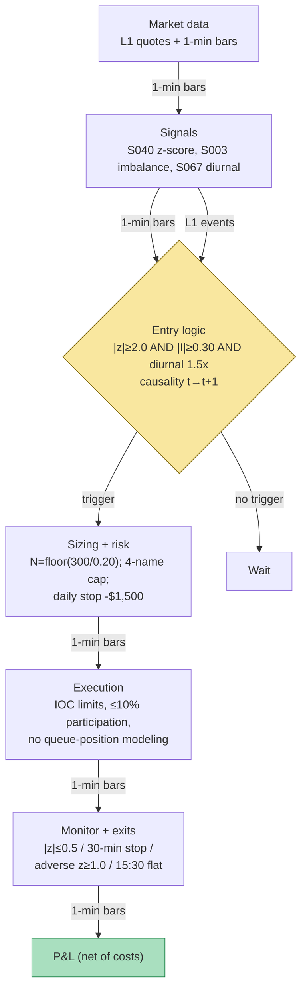

## Stage 104/200 — T004: VWAP-Deviation Mean-Reversion

*Batch TB1 · Strategy 4/100 · Signals S040, S003, S067*

### T1. One-line verdict

| | |
|---|---|
| **Style** | Intraday microstructure mean-reversion (fade) |
| **Edge source** | Transient overextensions away from the session volume-weighted benchmark (S040) revert as liquidity replenishes; queue imbalance (S003) times the turn, diurnal normalization (S067) keeps thresholds honest across the U-shaped vol day |
| **Typical holding period** | 5–45 minutes (example: 14 minutes in the worked example; hard cap 30 minutes) |
| **Capacity hint** | Tens of names × a few thousand shares per event; edge is per-event, not scalable — a few $M of gross notional before the fade itself becomes the flow |
| **Build-or-buy in one line** | Build the signal stack on a cheap SIP/1-min feed; buy nothing except the data — the edge is in your thresholds and timing, which no vendor sells |

### T2. Full mechanics

**Universe & session.** Liquid US large-caps (example gates: price > $20, 14-day average daily volume (ADV — the mean shares traded per day) ≥ 2 million shares, median quoted spread ≤ 3 cents), regular trading hours (RTH) 10:00–15:30 ET. Exclude: the first 30 minutes (VWAP is unstable and the rolling σ̂ needs ≥5 bars before it is anything but noise — see S040), the last 30 minutes (market-on-close and index benchmark flow overwhelms reversion), earnings-announcement days, and any name halted or in a limit-up/limit-down (LULD) pause.

**The signals in the strategy's own notation.** Session VWAP at bar *t*: VWAP_t = Σ_{i≤t} TP_i·V_i / Σ_{i≤t} V_i (TP = typical price (H+L+C)/3, V = bar volume). Fractional deviation d_t = (C_t − VWAP_t)/VWAP_t, z-scored against a rolling window: z_t = d_t / σ̂_{d,t}, σ̂ over the trailing W = 30 one-minute bars (all `example — not an institutional standard`, matching S040). Queue imbalance I_t = (Q^b_t − Q^a_t)/(Q^b_t + Q^a_t) on the L1 touch (S003; Gould–Bonart form). Diurnal factor s_b from S067: the median |return| in time-of-day bin *b* divided by its daily mean, estimated on the prior 20 sessions — used to deseasonalize the deviation: compare |d_t| in basis points against the 20-day same-slot median |d| rather than against a flat number, so a 100-bps deviation at 10:05 (normal) is not treated like 100 bps at 13:00 (extreme).

**Entry rule (long; short mirrors).** At the close of 1-minute bar *t*, enter long if ALL hold: (i) z_t ≤ −k_in with k_in = 2.0 (`example`) — price is stretched below VWAP; (ii) queue-imbalance timing confirm I_t ≥ +0.30 (`example`) — the bid queue is rebuilding, i.e. the book agrees the selling is exhausted; (iii) diurnal gate: |d_t| in bps ≥ 1.5 × the 20-day same-slot median |d| (`example`) — the stretch is extreme even for this time of day; (iv) VPIN-style sanity: no earnings/news flag on the name in the last 15 minutes (news-driven extensions are information, not noise — fading them is donating). **Causal timing:** z_t, I_t and the diurnal check all use data ≤ *t*; the order is eligible at the open of bar *t+1* at the earliest — never the same bar.

**Exit rule.** First of: (1) reversion exit |z_t| ≤ k_out = 0.5 (`example`); (2) time stop 30 minutes (`example`) — the fade thesis expires whether or not the z-score agrees; (3) stop-loss: adverse z_t ≥ +1.0 for a long (`example`) or a price stop of −$0.20/share (`example`), whichever the book's risk sheet binds first; (4) session flatten at 15:30 ET. No overnight carry, ever.

**Position sizing.** Dollar-risk form (Grok's shared convention for this batch): N = ⌊R / risk_per_share⌋ with R = $300 per trade (`example`); risk_per_share from the example price stop ($0.20) → 1,500 shares in the worked example. Portfolio caps: max 4 concurrent fades, max gross $600k notional, daily loss stop −$1,500 (`examples`) — then the book is flat and dark for the day.

**Risk limits & kill switch.** Daily loss stop −$1,500; per-name max 3 entries/day (a repeatedly re-triggering fade is a broken thesis, not a sale); if the rolling σ̂_{d} more than doubles intraday (vol regime break), new entries halt — the z-score's own denominator is screaming that the model is off.

**Cost model.** Spread: $0.02 assumed (pay half-spread each side on aggressive fills); commission $0.005/share each way ($0.01 round-trip, `example`); no rebate (taker fills); slippage modeled as gap-through on the entry bar only in the conservative variant. Borrow n/a (long-only example; shorts add a borrow stub).

**Execution sketch.** Limit orders pegged one tick through the touch at signal +1 bar,IOC (immediate-or-cancel — fill now or cancel); participation cap ≤ 10% of visible 1-minute volume; queue-position honesty: on SIP/L1 data you do NOT model queue position — fills are assumed at the touch with the half-spread paid, labeled `simulated only — requires MBO/ITCH` (market-by-order / ITCH order-level feed data) for any latency/queue claim. All four fills in the worked example are modeled this way.

### T3. Signals it consumes

| Signal | Role | Weight / logic |
|---|---|---|
| S040 — VWAP-deviation z-score | **Primary trigger** (direction + magnitude) | Enter only if \|z_t\| ≥ 2.0 (`example`); sign of z picks direction (fade the stretch) |
| S003 — Queue (depth) imbalance | **Timing filter** | Enter only if I_t has the reversal sign and \|I_t\| ≥ 0.30 (`example`); no book confirmation → no trade |
| S067 — Diurnal deseasonalization | **Normalization gate** | \|d_t\| in bps must clear 1.5× the 20-day same-slot median (`example`); rescales what "extreme" means by time of day |

Combination pseudocode (≤25 lines):

```
# per name, per 1-min bar close t (causal: fills at t+1 open)
vwap  = cum(TP*V)/cum(V)                       # session VWAP
d     = (C[t] - vwap)/vwap                     # fractional deviation
z     = d / std(d[t-29:t+1])                   # S040 z-score, W=30 example
I     = (bid_sz - ask_sz)/(bid_sz + ask_sz)    # S003 touch imbalance
slot_med = median(abs(d_slot[b]) over 20 days)# S067 diurnal norm
if z <= -2.0 and I >= 0.30 and abs(d)*1e4 >= 1.5*slot_med*1e4:
    enter LONG at open(t+1), N = floor(300 / 0.20)      # example R, stop
elif z >= +2.0 and I <= -0.30 and abs(d)*1e4 >= 1.5*slot_med*1e4:
    enter SHORT at open(t+1), N = floor(300 / 0.20)
# exits evaluated each bar while in position:
if abs(z) <= 0.5 or bars_held >= 30 or z >= +1.0 (long): exit at open(t+1)
flatten all at 15:30 ET
```

### T4. Worked example — numbers + P&L (SYNTHETIC)

Setup: fictional large-cap **XYZ**, synthetic 1-minute bars 10:30–11:30 ET, **seed 104** (rerun `batches/TB1/plot_T004.py` to reproduce). VWAP drifts 119.55 → 119.61; rolling σ̂_d = 0.0062 (`example`); slot-median |d| = 60 bps (`example`).

At bar 30 (11:00) the tape prints: C_30 = 117.87, VWAP_30 = 119.58, d_30 = −143 bps, z_30 = −2.30 (≤ −2.0 ✓), I_30 = +0.45 (≥ +0.30 ✓), |d| = 143 bps ≥ 1.5 × 60 bps ✓. All three gates pass → **long 1,500 shares** (N = ⌊300/0.20⌋), filled at the bar-31 open: buy at the ask **117.88** (mid 117.87 + $0.01 half-spread). Outlay: 1,500 × 117.8848 = **$176,827.18** (fills shown to the cent; P&L from unrounded fills).

The deviation reverts cleanly. At bar 44 (11:14): z_44 = −0.30, |z| ≤ 0.5 → exit. Sell at the bid **119.36**. Proceeds: 1,500 × 119.3616 = **$179,042.33**.

| Line | Calculation | $ |
|---|---|---|
| Gross P&L | 1,500 × (119.3612 − 117.8844) | +2,215.15 |
| Spread cost | paid half-spread each side (in the fills above) | (in gross) |
| Commission | 1,500 × $0.01 round-trip | −15.00 |
| **Net P&L** | 2,215.15 − 15.00 | **+2,200.15** |

The chart plots this exact trade: price vs VWAP with the entry/exit markers, and the cumulative net P&L stepping from $0 to +$2,200.15 at bar 44.

**Where the example is optimistic.** The synthetic path is a textbook V: a 143-bps stretch (a genuine tail event) that reverses monotonically to the exit band in 14 minutes. Real fades chop, re-stretch, and stop you out. Fills are assumed instant at the anchor prices with no partial fills, no latency between the bar close and the fill, and a fixed 2-cent spread on 1,500 shares (no market impact). The diurnal gate and queue confirm never bind adversely here. One clean winner proves the arithmetic, not the edge — a live book lives or dies on the win rate across hundreds of such events, most of which look nothing like this.

### T5. Data & infra — what must run

**Pipeline inventory.** (1) Pre-open 08:00–09:30: load 20-day same-slot deviation medians (S067) and the symbol list; (2) intraday 10:00–15:30 loop: ingest L1 quotes + 1-min bars, maintain session VWAP, rolling σ̂_d, I_t, and the three-gate check per name each minute; (3) post-close: persist fills/fees ledger, recompute diurnal factors. Storage: 1-min bars are ~50 MB/day for 500 symbols (cost-model §4) — archive freely; L1 touch quotes for the traded subset only (~2–8 GB/symbol-day parquet, §4) — record for research, don't archive naively.

**M5 Max feasibility: feasible (Tier M, ~40–60 h ≈ $6,000–9,000 loaded-cost estimate).** Per cost-model §2: 50 symbols × ~500 avg L1 events/sec ≈ 25k events/sec — a Python event loop is borderline, so run the book in Rust or poll the normalized vendor API; the per-minute signal math is trivial polars (~195k bars/day for 500 symbols). RAM: live working set < 2 GB; 60 days of 1-min bars for 500 symbols ≈ 12 MB (§3). Bottleneck is feed latency and book correctness, not compute. Breaks at: full OPRA-scale options analytics or 500-symbol L2 — not needed here.

**Feed-outage safe-mode.** Missed heartbeat > 2 s or sequence gap → cancel all working orders, flatten open fades at the last valid touch, freeze new entries, tag the session DEGRADED. If only SIP L1 remains (no venue-level touch): the S003 gate is `simulated only — requires MBO/ITCH`, so entries halt but resting stops stay. After any crash: flat unless the on-disk ledger says otherwise, and no new entries until 30 s of clean sequence.

### T6. Buy vs build

| Option | What you get | Indicative price | Gains | Loses |
|---|---|---|---|---|
| Tier 0: Stooq/Alpaca IEX delayed | Daily + delayed intraday bars | ~$0, indicative — verify before budgeting | Free VWAP/deseasonalization research | No real-time touch; queue imbalance impossible |
| Tier 1: Polygon Stocks Advanced / Alpaca SIP | Real-time SIP 1-min bars + quotes | ~$30–200/mo, indicative — verify before budgeting | Honest z-score + diurnal stack; the strategy's core | SIP touch smears venues; S003 timing degraded |
| Tier 2: Databento MBP-1 (pay-as-you-go) | Exchange-timestamped touch events | ~$200/mo + usage, indicative — verify before budgeting | Real I_t event rules; audit-able t→t+1 causality | Overkill if you only trade the z-fade |
| Retail platform: QuantConnect | Paper broker + SIP data | ~$60–300/mo, indicative — verify before budgeting | Fastest path to a paper book for B-style variants | Weak L1 honesty for the S003 gate |

**Verdict: build on Tier 1, buy nothing exotic.** The strategy's edge lives in your thresholds and the three-gate combination, which no vendor sells. Buy the cheapest feed that honestly supports the touch (Tier 1 SIP suffices for the fade; add Databento MBP-1 only if you can show the S003 gate earns its keep after fees). Crossover: if backtests show the S040-only variant matches the three-gate variant, drop the L1 feed entirely and run on 1-min bars.

### T7. Success-ratio evidence

Honest framing first: **there is no published after-cost Sharpe for a VWAP-deviation fade with queue timing.** The evidence below is for the components (per S040, S003, S067 chapters).

| Study / source | Market & period | Metric | Before/after cost | Caveat |
|---|---|---|---|---|
| Cont, Kukanov & Stoikov (2014), *J. Financial Econometrics* | 50 US stocks, NYSE TAQ, 2008 | Linear OFI↔Δprice; slope ∝ 1/(2·depth) | Before-cost; contemporaneous regression, **not a trading rule** | No forward P&L; no Sharpe |
| Gould & Bonart (2016), arXiv:1512.03492 | 10 liquid Nasdaq stocks, LOB | Queue imbalance → next-mid-move logistic: strongly significant on large-tick names, moderate on small-tick | Before-cost (classification, not P&L) | Predicts direction only; no costs |
| Andersen & Bollerslev (1997), *J. Empirical Finance* | 5-min DM/$ and S&P 500 futures | Deseasonalizing "eliminates most distortions" of the intraday vol cycle | Before-cost (model diagnostics) | Diagnostic, not a trading result |
| S040's chapter evidence (Berkowitz–Logue–Noser 1988; Choi–Larsen–Seppi 2018; Kissell 2014) | VWAP benchmark literature | VWAP±bands are desk-standard tooling; fades used with discretion | Anecdotal | **No published Sharpe for the fade itself** |

Regimes where it fails: trend days (the stretch is information — S024's mirror image); the last 30 minutes (benchmark flow); news-driven extensions; small-tick names where Gould–Bonart's own result is only "moderate". **Bottom line for ≤$1M paper:** this is a research-grade microstructure sleeve, not an allocation memo. A one-person book should paper-trade the S040-only variant first; add the S003 gate only with MBO-honest fills. An institutional desk would run it as a small overlay inside a larger intraday book, never standalone.

### T8. Failure modes

1. **Trend-day fade into information.** The extension is a real buyer, not noise; the fade adds to a loser. *Mitigation:* the S067 diurnal gate plus a hard cap of 3 entries/name/day; a name that re-triggers is a broken thesis.
2. **Queue imbalance spoofing.** Displayed size lies (layering/spoofing); I_t ≥ +0.30 can be manufactured. *Mitigation:* require the imbalance to persist across ≥3 book updates (`example`), and weight cancellations in the S001-style OFI as a veto.
3. **VWAP instability early session.** The first 30 minutes' VWAP whipsaws; z-scores computed on it are fiction. *Mitigation:* no entries before 10:00; σ̂ needs ≥5 bars (S040's own warning).
4. **Latency on SIP.** By the time a non-colocated trader sees I_t = +0.45, the queue is gone; the fill is the adverse selection. *Mitigation:* label all SIP-based queue timing `simulated only — requires MBO/ITCH`; size for taker fills.
5. **Cost-model optimism.** A 2-cent spread assumption on a name that actually trades 4–5 cents wide turns the +$2,200 example into a loss. *Mitigation:* per-name spread filter (median spread ≤ 3¢) and per-name cost calibration weekly.
6. **Benchmark-flow windows.** 15:00–16:00 index/MOC flow pins or runs through VWAP; the fade's "fair value" is not the market's. *Mitigation:* flatten by 15:30; no entries after 15:00 (`example`).
7. **Overfit thresholds.** k_in = 2.0, I ≥ 0.30, 1.5× diurnal are grid-fit-able; in-sample Sharpe lies. *Mitigation:* purged/embargoed validation (S088) before any sizing decision; wide parameter plateaus only.

### T9. Visuals




### T10. Sources

1. Cont, R., Kukanov, A. & Stoikov, S. (2014), "The Price Impact of Order Book Events," *Journal of Financial Econometrics* 12(1): 47–88. arXiv:1011.6402 — https://arxiv.org/abs/1011.6402. (OFI impact regression; contemporaneous, not a strategy.)
2. Gould, M. D. & Bonart, J. (2016), "Queue Imbalance as a One-Tick-Ahead Price Predictor in a Limit Order Book," *Market Microstructure and Liquidity*; arXiv:1512.03492. (Queue-imbalance classifier.)
3. Andersen, T. G. & Bollerslev, T. (1997), "Intraday Periodicity and Volatility Persistence in Financial Markets," *Journal of Empirical Finance* 4(2–3): 115–158 — https://ideas.repec.org/a/eee/empfin/v4y1997i2-3p115-158.html. (Diurnal deseasonalization.)

**Unverified leads** (from Grok's Q-TB1 answers, 2026-09-10 — not independently confirmed): Cont–Kukanov–Stoikov mean R² ≈ 65% (Grok's figure; S001's chapter reports the relationship without that number); Gould–Bonart P(up|I≈1) ≈ 0.8–0.9 on large-tick names (Grok's figure); a 2025 microstructure study finding imbalance-taker rules profitable pre-fee (~+1 bp/round-trip) but ≈ −2.0 (units unverified) post-fee over 18,927 trades; Databento live TotalView plan ~$1.5k–$4k/mo class plus license pass-through (vendor pricing changes fast — re-quote).

*Source log: Grok answered Q-TB1-1..3 (2026-09-10); all claims independently verified or labeled unverified.*
