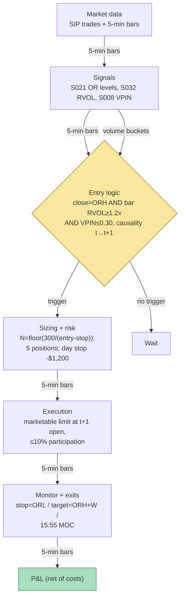

## Stage 105/200 — T005: RVOL-Filtered Opening-Range Breakout

*Batch TB1 · Strategy 5/100 · Signals S021, S032, S008*

### T1. One-line verdict

| | |
|---|---|
| **Style** | Intraday breakout (Crabel opening-range), momentum |
| **Edge source** | The first 15 minutes set the day's range; breaks confirmed by abnormal relative volume (S032) carry institutional intent, while VPIN (volume-synchronized probability of informed trading — the S008 toxicity gauge) vetoes toxic flow |
| **Typical holding period** | 30 minutes – 6 hours (example: ~2 h 15 min in the worked example); one trade per name per day |
| **Capacity hint** | ~20 names/day × a few hundred shares; the published variant ran on $25k notional — size kills it (everyone scans the same "stocks in play" list) |
| **Build-or-buy in one line** | Build the OR/RVOL state machine yourself on a cheap SIP bar feed; buy nothing — the filter *is* the strategy and it is 40 lines of code |

### T2. Full mechanics

**Universe & session.** US listed equities, RTH only. Example gates (in the spirit of the published paper, all `example — not an institutional standard`): 14-day ADV ≥ 1 million shares; 14-day ATR (average true range — mean of daily high−low ranges) ≥ $0.50; price > $5; that morning's opening-range relative volume in the top 20 names of the filtered universe. Futures analogue (ES/NQ): session RVOL ≥ 1.3×. Session window: build the opening range (OR) 09:30–09:45 ET (15 minutes, `example`); entries allowed 09:45–15:30; flatten everything by 15:55 ET. Early-close days: the OR clock compresses proportionally or the day is skipped.

**Entry rule (long; short mirrors).** Let ORH = max high and ORL = min low over 09:30–09:45, frozen at 09:45; W = ORH − ORL. RVOL_OR = V_OR / median same-slot volume over the prior 20 sessions (S032). At the close of each 5-minute bar *t* ≥ 09:45: enter long if (i) close_t > ORH + δ, δ = $0.02 entry offset (`example` — filters marginal touches); (ii) the trigger bar's own RVOL ≥ 1.2× its 20-day same-slot median (`example`); (iii) VPIN_t ≤ 0.30 (`example`) — flow toxicity gate (S008): a breakout into one-sided toxic flow is usually the top, not the start; (iv) no position in the name today (one trade per name per day, `example`). **Causal timing:** the signal is known at the trigger bar's close; the fill is at the *open of bar t+1* — gap-through is modeled (you do not get the signal print).

**Exit rule.** (1) Stop-loss: opposite side of the OR — long stopped at ORL (`example`; a 1× 14-period 5-min ATR stop is the common variant); (2) profit target: +1× W beyond the break level, i.e. ORH + W (1R, `example`); (3) time stop: still open at 15:55 → market-on-close. Once the range breaks, the level is done for the day — no re-entries.

**Position sizing.** N = ⌊R / (P_entry − P_stop)⌋ with R = $300 dollar risk per trade (`example`). In the worked example: entry 50.54, stop 49.80 → risk $0.74/share → 405 shares.

**Risk limits.** Max 5 concurrent ORB positions; portfolio heat ≤ $1,500 at risk; if 3 consecutive stops fire before 11:00, the day's ORB book stands down (a choppy tape, not a breakout tape). Daily loss stop −$1,200 (`examples`).

**Cost model.** Spread $0.02 (pay half-spread each side); commission $0.005/share each way ($0.01 RT, `example`); slippage: gap-through on entry modeled explicitly (the worked example fills 6¢ above the trigger close — that *is* the slippage). No rebate. The published paper's costs were commission-only ($0.0035/share) — this chapter adds the spread, which is the honest difference between the paper's Sharpe and an executable one.

**Execution sketch.** Marketable limit at bar t+1 open (limit = open print ± 2 ticks to bound gap-through); participation cap ≤ 10% of the trigger bar's volume; the stop rests as a stop-market at ORL from entry. Queue-position modeling: none — SIP-bar fills only.

### T3. Signals it consumes

| Signal | Role | Weight / logic |
|---|---|---|
| S021 — Crabel ORB levels | **Primary trigger** (levels + direction) | Break of frozen ORH/ORL; offset δ; the geometry of the trade |
| S032 — Relative volume | **Confirmation filter** | OR RVOL ≥ 1.5× AND trigger-bar RVOL ≥ 1.2× (`examples`); unfunded breaks are rejected |
| S008 — VPIN | **Toxicity veto** | No entry if VPIN_t > 0.30 (`example`); high-VPIN breaks are faded-or-skipped, never chased |

Combination pseudocode (≤25 lines):

```
# 09:30-09:45: accumulate OR; 09:45: freeze ORH, ORL; compute RVOL_OR
if RVOL_OR < 1.5 or name not in top-20 RVOL: skip name for the day   # S032 gate
for each 5-min bar close t >= 09:45:                                # S021 levels
    vpin = VPIN(t)                                                  # S008, rolling 50 buckets
    if vpin > 0.30: continue                                        # toxicity veto
    if close[t] > ORH + 0.02 and bar_RVOL[t] >= 1.2 and flat_today:  # example thresholds
        buy N = floor(300/(open[t+1] - ORL)) at open(t+1)           # causal fill
        stop = ORL; target = ORH + (ORH - ORL)                      # 1R example
    mirror for shorts
# exits: stop hit -> out; target hit -> out; 15:55 -> MOC
```

### T4. Worked example — numbers + P&L (SYNTHETIC)

Setup: fictional **XYZ**, synthetic 5-minute bars 09:30–16:00, **seed 105**. OR (09:30–09:45): high **50.40**, low **49.80**, width **0.60**; RVOL_OR = 1.8× (≥ 1.5 ✓).

Trigger bar 4 (09:50–09:55): close **50.48** > 50.40 ✓; bar RVOL 1.6× (≥ 1.2 ✓); VPIN 0.22 (≤ 0.30 ✓ — flow not toxic). Signal at the bar-4 close → fill at the bar-5 open: **buy 405 @ 50.54** (ask = open + $0.01 half-spread; 6¢ of gap-through above the trigger close — modeled slippage). Stop: 49.80 (OR low). Risk/share = 50.54 − 49.80 = $0.74 → N = ⌊300/0.74⌋ = 405 ✓. Target: 50.40 + 0.60 = **51.00** (1R).

At bar 21 the target prints: **sell 405 @ 51.02** (bid).

| Line | Calculation | $ |
|---|---|---|
| Outlay | 405 × 50.5406 | −20,468.95 |
| Proceeds | 405 × 51.0240 | +20,664.72 |
| Gross P&L | 405 × (51.0240 − 50.5406) | +195.77 |
| Spread cost | half-spread each side (in the fills) | (in gross) |
| Commission | 405 × $0.01 round-trip | −4.05 |
| **Net P&L** | 195.77 − 4.05 | **+191.72** |

(Fills shown to the cent; P&L computed from unrounded fills.) The chart plots this exact day: the OR band, trigger bar, entry/exit markers, and the net P&L stepping to +$191.72 at the exit.

**Where the example is optimistic.** The breakout never retests the level — real ORBs wick back through ORH and stop half the book before working. Entry gap-through is only 6¢; on a real "stock in play" the bar-t+1 open can gap 20–50¢ past the trigger. One trade is shown, but the strategy trades ~20 names/day — the example cherry-picks a winner and hides the 41.4%-style base hit rate of the unfiltered variant. The VPIN gate never binds here; on real tapes it vetoes a meaningful share of the best-looking breaks. And the one-trade-per-day rule plus the 15:55 flatten are what keep the arithmetic clean — the published results depend on exactly this discipline.

### T5. Data & infra — what must run

**Pipeline inventory.** 09:25: load 20-day same-slot volume medians (precomputed overnight). 09:30–09:45: accumulate OR high/low/volume per candidate (~200–500 names after cheap ADV/price/ATR gates). 09:45: freeze OR, compute RVOL_OR, rank, keep top 20. 09:45–15:30: on each 5-minute close, test break + bar RVOL + VPIN veto; signal → fill at next bar open. 15:55: flatten. Overnight: recompute volume baselines, VPIN bucket parameters.

**M5 Max feasibility: trivial (Tier M, ~25–40 h ≈ $3,750–6,000 loaded-cost estimate).** Per cost-model §2: 500 names × 5-min bars ≈ 6k bars/day — nothing; even 1-second bars for RVOL confirmation (~2M bars/day) is trivial for polars. RAM 100–400 MB; disk 50–300 MB/day of bars + decisions (§4). Bottleneck: universe hygiene (corporate actions, halts, early-close calendar), not compute. This is the cheapest strategy in TB1 to run honestly.

**Feed-outage safe-mode.** If the open print or first-15-minute volume is incomplete for a name → exclude that name for the day (never invent an OR). If the whole tape stalls before 09:45 → no trades that day. If the feed dies after entry: the resting paper stop at ORL/H_ORL stays on the last valid quote; if quotes die too → flatten at the last trade and mark the session UNTRUSTED_FLAT. Bake the NYSE holiday/early-close calendar into the clock process — a wrong session window silently breaks every OR.

### T6. Buy vs build

| Option | What you get | Indicative price | Gains | Loses |
|---|---|---|---|---|
| Tier 0: Stooq / Alpaca IEX | Daily + delayed bars | ~$0, indicative — verify before budgeting | Free OR geometry research | No real-time RVOL; no VPIN |
| Tier 1: Polygon Stocks Advanced / Alpaca SIP | Real-time SIP trades + 1-min/5-min bars | ~$30–200/mo, indicative — verify before budgeting | Everything this strategy needs: bars, volume, BVC (bulk volume classification)-VPIN | SIP trade classification is noisier than exchange timestamps |
| Retail: QuantConnect paper | Paper broker + SIP equity stream + minute data | ~$60–300/mo, indicative — verify before budgeting | Fastest honest paper host for this exact strategy | Per-name customization limits at scale |
| No-code (Composer-style) | Drag-and-drop backtests | ~$10–50/mo, indicative — verify before budgeting | — | Cannot express RVOL sorts or VPIN vetoes — skip |

**Verdict: build on Tier 1 SIP.** The ORB state machine is ~40 lines; the RVOL baseline is an overnight batch job; VPIN is a volume-bucket loop. Nothing here justifies a professional feed — SIP trades are adequate for 5-minute OR geometry, and the strategy's documented edge lives in the RVOL sort, not in microsecond timestamps. Crossover: buy a normalized vendor feed (Databento) only if you extend to tick-level ORB variants (1-minute OR) where SIP timestamp smear matters.

### T7. Success-ratio evidence

| Study / source | Market & period | Metric | Before/after cost | Caveat |
|---|---|---|---|---|
| Zarattini, Barbon & Aziz (2024), "A Profitable Day Trading Strategy For The U.S. Equity Market," SSRN 4729284 | 7,000+ US stocks, 2016–2023, 5-min ORB | Top-20 stocks-in-play: total net +1,637%, IRR 41.6%, Sharpe **2.81**, hit 48.4%, max DD 12%, alpha 35.8% | **After** their cost model ($0.0035/share commission; no spread/impact) | Commission-only; $25k compounding; capacity unstudied; sample ends 2023 |
| Same paper, unfiltered variant | Same | Total +29%, IRR 3.2%, Sharpe 0.48, hit 41.4% vs S&P 500 +198% | After their commission | Unfiltered ORB loses to the index |
| Same paper, RVOL split | Same | RVOL >100% → +0.08R/trade; <100% → −0.02R; 30× → +0.38R | After commissions | **The ORB edge is really the volume-filter edge** |
| Zarattini & Aziz (2023), QQQ-only 5-min ORB (per S021's chapter) | QQQ, 2016–2023 | ~33% annualized alpha net of commissions | After commissions, not full spread/impact | Independent replication: edge dies at ~2.2¢/share slippage; 76% of filtered P&L from 2022 |
| Holmberg–Lönnbark–Lundström (2013), *Finance Research Letters* | Crude-oil futures intraday ORB | Returns significantly > 0 vs fair game | Before modern equity spread/impact | Futures; significance ≠ net tradability |

Grok's Q-TB1-3 added two replication notes I could not independently verify (kept in Unverified leads): a QQQ-only replication with Sharpe 1.06 at zero slippage collapsing to 0.23 with 2¢/4¢ slippage, and the claim that the headline Sharpe sits inside the QQQ spread. The verified core stands on its own: the RVOL filter is the strategy; unfiltered ORB is Sharpe < 1 and underperforms buy-and-hold. **Bottom line for ≤$1M paper:** this is the most evidence-backed strategy in TB1 — but the evidence is commission-only on a 2016–2023 sample, and a small book must re-verify the RVOL sort out-of-sample (2024+) before sizing. An institutional desk would run it as one sleeve among many, with the top-20 sort capacity-capped.

### T8. Failure modes

1. **Publication decay.** The paper is public since 2024; every retail scanner now sorts by "stocks in play". *Mitigation:* re-verify the RVOL sort on post-2023 data before allocating; expect the 2.81 Sharpe to be history.
2. **Cost-model gap.** Commission-only backtests hide the spread; the replication's 2.2¢/share break-even is the real hurdle. *Mitigation:* model half-spread + gap-through explicitly (as in T4); reject names with median spread > 3¢.
3. **False-break chop.** Low-conviction tapes break the OR and reverse the same bar. *Mitigation:* the trigger-bar RVOL ≥ 1.2× gate plus the one-trade-per-day rule; three early stops = stand down for the day.
4. **VPIN mismeasurement.** BVC classification errors correlate with volume (Andersen & Bondarenko 2015) — the veto can fire on noise. *Mitigation:* use tick-rule VPIN as a robustness cross-check; treat the veto as a soft weight, not a hard gate, in research.
5. **OR misformation.** Missing open prints or a bad corporate-action adjustment invents a fake range. *Mitigation:* exclude names with incomplete 09:30–09:45 data; never interpolate the OR.
6. **Overnight gap through the stop.** A name gaps past ORL the next morning — but you're flat by 15:55, so this is really **gap-through on entry**: the bar-t+1 open fills far worse than modeled. *Mitigation:* cap the entry limit at open ± 2 ticks; a skipped entry is better than a slipped one.
7. **Regime concentration.** Per the replication lead, most filtered P&L came from 2022 — a vol-regime artifact. *Mitigation:* require the strategy to clear its hurdle in low-vol years separately before trusting the blended Sharpe.

### T9. Visuals




### T10. Sources

1. Crabel, T. (1990), *Day Trading with Short Term Price Patterns and Opening Range Breakout*. Traders Press, ISBN 0934380171. (Original ORB system; practitioner book, no stable URL.)
2. Zarattini, C., Barbon, A. & Aziz, A. (2024), "A Profitable Day Trading Strategy For The U.S. Equity Market," Swiss Finance Institute Research Paper No. 24-98; https://papers.ssrn.com/sol3/papers.cfm?abstract_id=4729284. (5-min ORB + stocks-in-play filter, 2016–2023; commission-only costs.)
3. Easley, D., López de Prado, M. & O'Hara, M. (2012), "Flow Toxicity and Liquidity in a High-Frequency World," *Review of Financial Studies* 25(5): 1457–1493 — https://papers.ssrn.com/sol3/papers.cfm?abstract_id=1695596. (VPIN construction; contrast with Andersen & Bondarenko (2014, 2015) critiques per S008.)
4. Andersen, T. G. & Bondarenko, O. (2014), "VPIN and the Flash Crash," *Journal of Financial Markets* 17: 1–46 — https://ideas.repec.org/a/eee/finmar/v17y2014icp1-46.html. (Replication contesting VPIN: poor short-run volatility predictor; behavior largely mechanical trading intensity; classification-dependent.)

**Unverified leads** (Grok Q-TB1-3, 2026-09-10; Q1 universe first-bullet text did not render): QQQ-only 5-min ORB replication — Sharpe 1.06 at zero slippage, net crosses zero at ~2.2¢/share slippage, Sharpe 0.23 with 2¢ entry/4¢ stop slippage; 2025 microstructure study on imbalance-taker vs maker rules (post-fee negative); "stocks in play" first universe bullet (price gate) lost in extraction — not reconstructed. QuantConnect forum thread (https://www.quantconnect.com/forum/discussion/18444) replicating Zarattini et al. — found via web search, not read in full.

*Source log: Grok answered Q-TB1-1..3 (2026-09-10); all claims independently verified or labeled unverified.*
