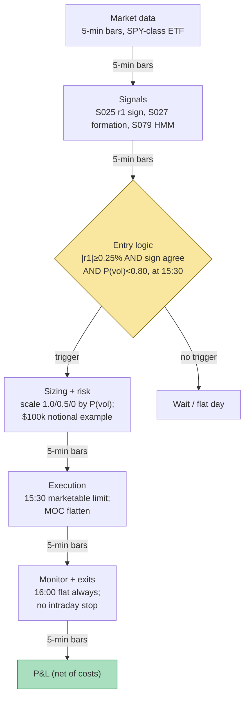

## Stage 106/200 — T006: Intraday Trend + Vol-Regime Allocator

*Batch TB1 · Strategy 6/100 · Signals S025, S027, S079*

### T1. One-line verdict

| | |
|---|---|
| **Style** | Intraday time-series momentum into the close, regime-scaled |
| **Edge source** | First-half-hour return predicts last-half-hour return (Gao et al. 2018); the day's own drift (S027) confirms; a 2-state HMM (hidden Markov model) vol regime (S079) scales size down when volatility makes the drift untradable |
| **Typical holding period** | 30 minutes (enter 15:30, flat at the close) |
| **Capacity hint** | High — SPY/QQQ-class ETFs, minutes-long holds at the most liquid time of day; the constraint is the closing-auction spread, not depth |
| **Build-or-buy in one line** | Build: the whole strategy is a 15:30 clock, a sign rule, and an HMM — any retail platform with minute bars suffices; buy only the data |

### T2. Full mechanics

**Universe & session.** One liquid vehicle: SPY (or QQQ/ES) — example; single-name extension uses price > $20, ADV > 5M shares. RTH only. The strategy trades exactly one window: enter at 15:30 ET, flatten at the 16:00 closing print. No other entries exist — this is a *clock strategy*, which is its main virtue (no intraday monitoring) and its main limitation.

**The signals in the strategy's own notation.** S025 (Gao form): r_{1,t} = log(P_{10:00}/P_{9:30}) — first-half-hour return, *deseasonalized* by S067 (divide by the diurnal factor s_b for the open bin, estimated on the prior 20 days; raw morning returns are mechanically more volatile). The report's generic form Sig_t = sign(Σ w_i r_{t−i}) reduces here to sign(r_{1,t}). S027 (open→15:30 variant, the report's smoother form): r_{first,t} = P_{15:30}/P_{9:30} − 1 — the day's own drift into the entry. S079: 2-state Gaussian HMM on 5-minute log returns (states: calm σ ≈ 0.4%/bar, volatile σ ≈ 1.2%/bar, `examples`); the filtered probability P(s_t = volatile | r_{1:t}) at 15:25 drives the allocator.

**Entry rule (long; short mirrors).** At 15:30, enter long if ALL hold: (i) deseasonalized |r_{1,t}| ≥ 0.25% (`example` threshold — the morning move must be real, not open noise); (ii) sign confirmation: sign(r_{first,t}) = sign(r_{1,t}) (`example`) — the day's drift agrees with the morning impulse (this is the S027 confirm); (iii) regime gate: P(volatile) < 0.80 (`example`) — if the HMM says the tape is toxic, stand down entirely. **Causal timing:** r_{1,t} is known at 10:00; the HMM filter at 15:25 uses data ≤ 15:25; the order is eligible at 15:30 — hours after the signal, which is why this signal is nearly immune to microstructure lookahead traps (S025's own note).

**Position sizing — the allocator.** Full notional $100k (`example`) scaled by the HMM state: scale = 1.0 if P(volatile) < 0.60; 0.5 if 0.60 ≤ P(volatile) < 0.80; 0.0 (flat) if ≥ 0.80 (`examples`, matching S079's τ_half = 0.7 / τ_susp = 0.8 family). Shares = scale × 100,000 / P_{15:30}. This is vol-targeting by regime: position ∝ 1/σ̂ of the inferred state (S079's Hamilton-1989 vol form).

**Exit rule.** Flatten at the 16:00 close, no exceptions — market-on-close or a 15:59:30 market order (`example`). No stop-loss intraday (the hold is 30 minutes; a stop inside the last half hour is spread-donation), no profit target. The time stop *is* the strategy.

**Risk limits.** Max one position (it is one vehicle, one window); daily loss stop −$800 (`example`) — but since the hold is 30 minutes into the close, the stop is effectively enforced by the 0.80 suspend threshold ex ante; a realized −$800 day triggers a next-day review of the HMM calibration, not an intraday exit.

**Cost model.** 1¢/share all-in round-trip (`example`: ~0.5¢ commission + 0.5¢ effective spread on SPY at 15:30 — the tightest spread of the day). No slippage beyond the closing-print assumption in the base case; the conservative variant assumes the MOC print plus 1¢ adverse. Borrow n/a for the ETF long/short (short SPY borrow is ~0 bps for a day — stubbed at zero).

**Execution sketch.** 15:30: marketable limit for the share count (IOC); 15:59:30: closing-auction-eligible order for the full position. Participation is irrelevant — SPY's last-half-hour volume absorbs $100k without a ripple. Queue-position honesty: n/a at this granularity.

### T3. Signals it consumes

| Signal | Role | Weight / logic |
|---|---|---|
| S025 — Intraday time-series momentum (Gao form) | **Primary trigger** (direction) | sign of deseasonalized r_{1,t}; needs \|r̃_1\| ≥ 0.25% (`example`) |
| S027 — Open→15:30 formation drift | **Confirmation filter** | sign(r_{first,t}) must equal sign(r_{1,t}); disagreement → no trade |
| S079 — HMM vol regime | **Regime gate + sizing** | scale 1.0 / 0.5 / 0.0 at P(vol) thresholds 0.60 / 0.80 (`examples`) |

Combination pseudocode (≤25 lines):

```
# once per day, at 15:25-15:30 (all inputs causal)
r1  = log(P10:00 / P09:30) / s_b(open_bin)      # S025, S067-deseasonalized
rfo = P15:30 / P09:30 - 1                        # S027 formation drift
pvol = HMM_forward(r_5min[:15:25])[volatile]     # S079 filtered prob
if abs(r1) < 0.0025: flat("no impulse")          # example threshold
elif sign(rfo) != sign(r1): flat("no confirm")   # S027 disagrees
elif pvol >= 0.80: flat("toxic regime")          # S079 suspend
else:
    scale = 1.0 if pvol < 0.60 else 0.5          # example allocator
    shares = sign(r1) * int(100_000 * scale / P15:30)
    buy/sell shares at 15:30; flatten at 16:00 close
```

### T4. Worked example — numbers + P&L (SYNTHETIC)

Setup: SPY-class ETF at **$500.00** (`example`), full notional **$100,000**, cost **$0.01/share round-trip** (`example`). Five synthetic days, **seed 106**.

| Day | r̃_1 (S025) | r_first (S027) | P(vol) 15:25 (S079) | Decision | r_13 | Net P&L |
|---|---|---|---|---|---|---|
| 1 | +0.42% | +0.90% | 0.15 | LONG 200 sh (scale 1.0) | +0.28% | +$278.00 |
| 2 | −0.35% | −0.70% | 0.25 | SHORT 200 sh (scale 1.0) | −0.22% | +$218.00 |
| 3 | +0.50% | +1.10% | 0.75 | LONG 100 sh (scale 0.5) | −0.15% | −$76.00 |
| 4 | +0.10% | +0.20% | 0.10 | FLAT (below 0.25% impulse) | +0.05% | $0.00 |
| 5 | −0.60% | −1.30% | 0.85 | FLAT (suspended: toxic) | −0.40% | $0.00 |

Line-by-line walk for Day 1 (the template for every traded day): 15:30 — buy 200 @ **$500.00** = $100,000.00. 16:00 — sell 200 @ **$501.40** ($500 × 1.0028) = $100,280.00. Gross +$280.00; cost 200 × $0.01 = −$2.00; **net +$278.00**. Day 2: short 200 @ $500.00, cover @ $498.90 → gross +$220.00 − $2.00 = **+$218.00**. Day 3 (half size): long 100 @ $500.00, sell @ $499.25 → gross −$75.00 − $1.00 = **−$76.00**. Days 4–5: no position, $0. **Five-day total net: +$420.00.**

The chart plots exactly this diary: formation-return bars colored by position (green long / red short / grey flat), the HMM P(volatile) overlay with the 0.60/0.80 allocator thresholds, and the cumulative net P&L stepping +278, +496, +420, +420, +420 with per-day annotations.

**Where the example is optimistic.** Five hand-built days, not a sample: two clean winners, one textbook half-size loser, and — most flattering of all — Day 5's suspend dodges a −$400 day, which is the allocator working *by construction*. Real HMM posteriors arrive with 1–2 periods of detection lag (S079's own warning) and flicker at regime boundaries; the 0.80 suspend will sometimes trigger late or on noise. The close is assumed filled at the print with 1¢ all-in cost — Heston et al. (2010) warn explicitly that half-hour periodicity strategies "lose money after paying the bid/ask spread," and the closing auction is exactly where that spread is widest for impatient flow. A 30-minute hold repeated daily also concentrates all risk in one window — one flash event at 15:45 wipes weeks of drift harvesting.

### T5. Data & infra — what must run

**Pipeline inventory.** Overnight/weekly: refit the 2-state HMM on 60 days of 5-min bars (Baum–Welch; refit weekly, `example`); recompute the 20-day diurnal factors s_b. Intraday: a 15:25 cron computes r_1 (known since 10:00), r_first, and the forward-algorithm P(volatile) — one inference pass, milliseconds. 15:30: order. 16:00: flatten and ledger. That is the entire hot path.

**M5 Max feasibility: trivial (Tier L, ~8–12 h ≈ $1,200–1,800 loaded-cost estimate).** Per cost-model §2: one symbol × 78 five-min bars/day is nothing; the HMM forward pass is microseconds in numpy; the weekly Baum–Welch fit on 60 days × 78 bars is seconds. RAM < 200 MB; disk < 50 MB/day. Bottleneck: none computationally — the risk is *model* risk (HMM miscalibration), not compute. A single cron job could run this.

**Feed-outage safe-mode.** If 15:25 data is stale or the HMM job failed → the day is FLAT (no signal, no trade — the strategy defaults to doing nothing). If the 15:30 entry filled but the 16:00 flatten fails → flatten at the next available print and mark the day UNTRUSTED_FLAT; never carry overnight. Clock skew > 50 ms vs NTP → halt (the whole strategy is a clock).

### T6. Buy vs build

| Option | What you get | Indicative price | Gains | Loses |
|---|---|---|---|---|
| Tier 0: Stooq / Alpaca IEX delayed | Daily + delayed minute bars | ~$0, indicative — verify before budgeting | Free research on the Gao regression | No live 15:30 trigger |
| Tier 1: Polygon / Alpaca SIP | Real-time minute bars | ~$30–200/mo, indicative — verify before budgeting | Everything needed: r_1, r_first, HMM inputs | — |
| Retail: QuantConnect paper | Paper broker + minute data | ~$60–300/mo, indicative — verify before budgeting | Clock-based scheduling is native; easiest paper host | Overkill — a cron job does this |
| Build: own cron + broker API | Full control | ~$0 + eng time, indicative — verify before budgeting | No platform risk | You own the clock bug |

**Verdict: build; the "platform" is a cron job.** There is nothing to buy beyond a minute-bar feed. The strategy's only moving parts are the HMM calibration (weekly, offline) and the 15:25 inference (trivial). Crossover: none — no vendor sells a better 15:30 clock. The real buy-vs-build question is single-name extension (needs a 500-symbol minute-bar universe → Tier 1 feed, still cheap).

### T7. Success-ratio evidence

| Study / source | Market & period | Metric | Before/after cost | Caveat |
|---|---|---|---|---|
| Gao, Han, Li & Zhou (2018), *J. Financial Economics* 132(3) | SPY, 1993–2013 | r_13 = α + β·r_1: β̂ = 6.94 (×100), p < 1%, R² = 1.6% | Before-cost (predictive regression) | R² is statistical, not tradable P&L |
| Same; timing rule per S025's chapter | SPY, 1993–2013 | Sign(r_1) timing: ~6.67%/yr, Sharpe ~1.08 vs 0.29 buy-and-hold | Before-cost metric; authors state gains persist after transaction costs | Figures from the SSRN working-paper version (SSRN 2552752) — re-verify against the published version before citing precisely |
| Heston, Korajczyk & Sadka (2010), *J. Finance* 65(4) | NYSE half-hour intervals, 2001–2005 | Continuation at day-multiple half-hour lags, strongest first/last half-hour | **After** (honest): periodicity strategies "**lose money after paying the bid/ask spread**" | The continuation is a timing/cost phenomenon, not an arbitrage |
| Baltussen, Da, Lammers & Martens (2021) (per S025's chapter) | 60+ futures | Intraday momentum confirmed; gamma-hedging mechanism; effect reverts over following days | Before-cost | Mechanism confirmation + reversion warning |
| Nystrup, Madsen & Lindström (2017), *Quantitative Finance* (per S079) | Major stock indices | HMM + model-predictive-control allocation beats static rules | After modeled costs + 1-day delay | Monthly-ish; intraday spread/impact not modeled |

Grok's Q-TB1 questions did not cover this strategy directly (the batch's Q-triple addressed A/B/C = T001/T005/T007 analogues), so the evidence above is from the project's own S-chapters and my verification — no Grok performance claims are used here. **Bottom line for ≤$1M paper:** the Gao effect is real but small (R² 1.6%); it is one of the few intraday signals whose authors claim post-cost survival, yet Heston et al.'s spread warning applies directly to the 15:30→close window. Paper-trade it on SPY for a quarter before believing the allocator adds anything over the raw sign rule — the HMM is the least-evidenced leg. An institutional desk would not run this standalone; it is a timing sleeve inside a larger intraday book.

### T8. Failure modes

1. **The spread eats the drift.** Last-half-hour returns are small; the closing-auction effective spread is the whole edge. *Mitigation:* trade only SPY/QQQ-class vehicles; measure realized vs assumed 1¢ cost weekly; kill the strategy if realized cost > 2¢/share sustained.
2. **HMM detection lag.** The volatile state is inferred 1–2 periods late — the allocator de-risks after the damage. *Mitigation:* the 0.80 suspend is a gate, not a hedge; accept that regime timing is defensive, not predictive.
3. **Sign disagreement regimes.** r_1 and r_first disagree most on reversal days — exactly when the drift fails. *Mitigation:* the S027 confirm already filters these; log the disagreement rate as a health metric.
4. **Macro-day gaps.** FOMC/CPI days: the 15:30 "drift" is announcement digestion, and the HMM (fit on normal days) mislabels it. *Mitigation:* hard stand-down on scheduled announcement days (`example`) — S034 territory, not this strategy's.
5. **Overfit HMM states.** Two Gaussian states on 5-min bars can memorize the training window's vol clusters. *Mitigation:* weekly refit with fixed K=2, no intraday refit; walk-forward check of the allocator vs the raw sign rule (S088 discipline).
6. **Single-window concentration.** All risk sits in 15:30–16:00; one 15:45 headline wipes weeks of harvesting. *Mitigation:* the daily loss stop and the suspend threshold are the only defenses — size so that one bad close is a bad day, not a bad month.
7. **Publication decay.** Gao et al. is 2018; intraday momentum is widely known and partially arbitraged (Baltussen et al. document the mechanism — known mechanisms get traded). *Mitigation:* re-estimate β̂ on rolling 2-year windows; if it goes insignificant, the strategy is off.

### T9. Visuals




### T10. Sources

1. Gao, L., Han, Y., Li, S. Z. & Zhou, G. (2018), "Intraday Momentum: The First Half-Hour Return Predicts the Last Half-Hour Return," *Journal of Financial Economics* 132(3), 240–263 — https://doi.org/10.1016/j.jfineco.2018.10.008. (Predictive regression β̂=6.94×100, R²=1.6%.)
2. Heston, S. L., Korajczyk, R. A. & Sadka, R. (2010), "Intraday Patterns in the Cross-Section of Stock Returns," *Journal of Finance* 65(4), 1369–1407. https://bauer.uh.edu/departments/finance/documents/Heston-Korajczyk-Sadka-jf-2010-01-07.pdf (Half-hour periodicity; spread warning.)
3. Nystrup, P., Madsen, H. & Lindström, E. (2018), "Dynamic portfolio optimization across hidden market regimes," *Quantitative Finance* 18(5) — https://doi.org/10.1080/14697688.2017.1342857. (Per S079's chapter: HMM + model-predictive-control allocation beats static rules after modeled costs.)

**Unverified leads:** the S025-chapter figure of ~6.67%/yr / Sharpe ~1.08 for the sign(r_1) timing rule is from the SSRN working-paper version (SSRN 2552752) — re-verify against the published JFE version before citing precisely; Moskowitz, Ooi & Pedersen (2012) time-series momentum is daily/monthly evidence, not intraday. No Grok Q-TB1 performance claims apply to this strategy (the batch's questions covered other strategies).

*Source log: Grok answered Q-TB1-1..3 (2026-09-10); all claims independently verified or labeled unverified.*
